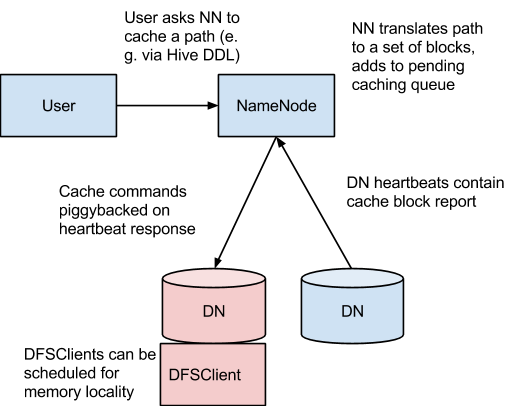

# Centralized Cache Management in HDFS

 ## 1. 概述

HDFS中的集中式缓存管理是一种显式的缓存机制，允许用户指定要由HDFS缓存的信息的路径。 NameNode将与磁盘上具有所需块的DataNodes通信，并指示它们将这些块缓存在堆外缓存中。

HDFS中的集中式缓存管理具有显著的优势：

- 显式地将常用数据放置在内存中，当工作集的大小超过主内存的大小时，这尤其重要，这对于许多HDFS工作负载来说是很常见的。
- 由于DataNode缓存由NameNode管理，做出任务放置决策时，应用程序可以查询一组缓存的块位置。 将任务与缓存的块副本放在一起，从而提高读取性能。
- 当块已由DataNode缓存后，客户端可以使用新的，效率更高的零拷贝读取API。由于缓存数据的完整性校验是由DataNode一次完成的，因此使用此新API时，客户端实际上可以产生零开销。
- 集中式缓存可以提高整体群集内存利用率。 当依赖每个DataNode上的OS缓冲区高速缓存时，重复读取一个块将导致该块的所有n个副本都被拉入缓冲区高速缓存。 使用集中式缓存管理，用户可以显式固定n个副本中的m个副本，从而节省n-m的内存。

## 2. 使用缓存

集中式缓存管理对于重复访问的文件很有用。 例如，Hive中的一个小的事实表(通常用于联接)是缓存的不错选择。 另一方面，缓存一年报告查询的输入可能不太有用，因为历史数据可能只读取一次。

集中式缓存管理对于具有性能服务等级协议(SLA)的混合工作负载也很有用。 缓存高优先级任务的工作集可确保它不与低优先级任务负载竞争磁盘、I/O资源。

## 3. 结构



在这种体系结构中，NameNode负责协调集群中的所有DataNode堆外缓存。 NameNode定期从每个DataNode接收缓存报告，该报告描述了在给定DN上缓存的所有块。在这种体系结构中，NameNode负责协调集群中的所有DataNode堆外缓存。 NameNode定期从每个DataNode接收缓存报告，该报告描述了在给定DN上缓存的所有块。 NameNode通过在DataNode心跳上传输缓存和取消缓存命令来管理DataNode缓存。

NameNode查询其缓存指令集，以确定应该缓存哪些路径。 缓存指令永久存储在fsimage和编辑日志中，并且可以通过Java和命令行API进行添加，删除和修改。 NameNode还存储一组缓存池，缓存池是用于将缓存指令组合在一起进行资源管理和强制执行权限的管理实体。

NameNode定期重新扫描名称空间和活动缓存指令，以确定哪些块需要缓存或取消缓存，并将缓存工作分配给DataNode。 用户添加或删除缓存指令或删除缓存池等用户操作也可以触发重新扫描。

目前不缓存正字构建中、损坏或不完整的块，如果缓存指令涵盖了符号链接(symlink)，则不会缓存符号链接目标。

缓存当前在文件或目录级别完成。 块和子块缓存会在以后版本中支持。

## 3. 组件

### 3.1 缓存命令

缓存指令定义了应该缓存的路径。 路径可以是目录或文件。 目录以非递归方式缓存，这意味着仅目录的第一级列表中的文件。

指令还指定其他参数，例如高速缓存复制因子和过期时间。 复制因子指定要缓存的块副本的数量。 如果多个缓存指令引用同一文件，则将应用最大缓存复制因子。

到期时间在命令行上指定为生存时间(TTL)，即将来相对到期时间。 缓存指令到期后，NameNode在制定缓存决策时将不再考虑该指令。

### 3.2 缓存池

缓存池是用于管理缓存指令组的管理实体。缓存池具有类似UNIX的权限，该权限限制了哪些用户和组可以访问该池。 写入权限允许用户向池中添加和删除缓存指令。 读取权限使用户可以列出池中的缓存指令以及其他元数据。 执行权限未使用。

缓存池也用于资源管理。 池可以强制执行最大限制，该限制限制了池中的指令可以聚合总计缓存的字节数。 通常，池限制的总和将大约等于群集上为HDFS缓存保留的聚合内存量。 缓存池还跟踪大量统计信息，以帮助集群用户确定应该缓存什么。

缓存池还可以规定最长生存时间。 这限制了将指令添加到池中的最大到期时间。

## 4. cacheadmin命令行

管理员和用户可以通过hdfs cacheadmin子命令与缓存池和指令进行交互。

缓存指令由唯一的，非重复的64位整数ID标识。 即使以后删除了缓存指令，ID也不会被重用。

缓存池由唯一的字符串名称标识。

### 4.1 缓存命令

#### 4.1.1 addDirective

用法： 添加新的缓存指令

```
hdfs cacheadmin -addDirective -path <path> -pool <pool-name> [-force] [-replication <replication>] [-ttl <time-to-live>]
```

| 选项            | 描述                                                         |
| --------------- | ------------------------------------------------------------ |
| < path>         | 需要缓存的文件或目录路径                                     |
| < pool-name>    | 指令将添加到的缓存池。 您必须对缓存池具有写权限才能添加新指令 |
| -force          | 跳过对缓存池资源限制的检查                                   |
| <replication>   | 缓存复制复本数因子，默认为1                                  |
| < time-to-live> | 该指令有效的时间。 可以以分钟，小时和天为单位指定，例如 30m，4h，2d。 有效单位为[smhd]。 “never”表示永不过期的指令。 如果未指定，则该指令永不过期。 |

#### 4.1.2 removeDirective

用法：移除缓存指令

```
 hdfs cacheadmin -removeDirective <id>
```

| 选项 | 描述                                                         |
| ---- | ------------------------------------------------------------ |
| <id> | 要删除的缓存指令的ID。 必须对指令池具有写权限才能将其删除。 查看缓存指令ID的列表，请使用-listDirectives命令。 |

#### 4.1.3 removeDirectives

用法：删除具有指定路径的每个缓存指令

```
 hdfs cacheadmin -removeDirectives <path>
```

| 选项   | 描述                                                         |
| ------ | ------------------------------------------------------------ |
| <path> | 要删除的缓存指令的路径。 必须对指令池具有写权限才能将其删除。 查看缓存指令的列表，请使用-listDirectives命令。 |

#### 4.1.4 listDirectives

用法：查看缓存指令的列表

```
hdfs cacheadmin -listDirectives [-stats] [-path <path>] [-pool <pool>]
```

| 选项         | 描述                                                         |
| ------------ | ------------------------------------------------------------ |
| -stats       | 列出基于路径的缓存指令统计信息                               |
| <path>       | 仅列出具有此路径的缓存指令。 如果没有读取访问权限的缓存池不会列出该指令 |
| < pool-name> | 仅列出该池中的路径缓存指令                                   |

### 4.2 缓存池命令

#### 4.2.1 addPool

用法：添加一个缓存池

```
hdfs cacheadmin -addPool <name> [-owner <owner>] [-group <group>] [-mode <mode>] [-limit <limit>] [-maxTtl <maxTtl>]
```

| 选项     | 描述                                                         |
| :------- | ------------------------------------------------------------ |
| <name>   | 新缓存池的名字                                               |
| <owner>  | 池所有者的用户名， 默认为当前用户                            |
| <group>  | 池组，默认为当前用户的主要组名                               |
| <mode>   | 池的UNIX风格权限。 权限以八进制指定，例如 0755。默认情况下，它设置为0755。 |
| <limit>  | 池中的所有指令可以缓存的最大字节数。 默认情况下，未设置限制。 |
| <maxTtl> | 将指令添加到池中的最大允许生存时间。 可以以秒、分钟、小时和天为单位指定，例如：120s/30m/4h/2d，有效单位为[smhd]。 默认不设置最大值，“never”表示没有限制。 |

#### 4.2.2 modifyPool

用法：修改现有缓存池的元数据。

```
hdfs cacheadmin -modifyPool <name> [-owner <owner>] [-group <group>] [-mode <mode>] [-limit <limit>] [-maxTtl <maxTtl>]
```

| 选项     | 描述                                                         |
| :------- | ------------------------------------------------------------ |
| <name>   | 新缓存池的名字                                               |
| <owner>  | 池所有者的用户名， 默认为当前用户                            |
| <group>  | 池组，默认为当前用户的主要组名                               |
| <mode>   | 池的UNIX风格权限。 权限以八进制指定，例如 0755。默认情况下，它设置为0755。 |
| <limit>  | 池中的所有指令可以缓存的最大字节数。 默认情况下，未设置限制。 |
| <maxTtl> | 将指令添加到池中的最大允许生存时间。 可以以秒、分钟、小时和天为单位指定，例如：120s/30m/4h/2d，有效单位为[smhd]。 默认不设置最大值，“never”表示没有限制。 |

#### 4.2.3 removePool

用法：删除缓存池，这还将取消缓存与池关联的路径。

```
hdfs cacheadmin -removePool <name>
```

#### 4.2.4 listPool

用法：显示有关一个或多个缓存池的信息，例如——名称，所有者，组，权限等。

```
hdfs cacheadmin -listPools [-stats] [<name>]
```

| 选项   | 描述                           |
| ------ | ------------------------------ |
| -stats | 显示其他缓存池统计信息         |
| name   | 如果指定，则仅列出命名的缓存池 |

## 3. 配置

### 3.1 本地库

为了防止将文件锁定到内存中，DataNode依赖于Windows上的libhadoop.so或hadoop.dll中找到的本机JNI代码。 如果您正在使用HDFS集中式缓存管理，请确保启用JNI。

### 3.2 配置属性

#### 3.2.1 必须配置

确保以下属性已经配置

- dfs.datanode.max.locked.memory

	制定DataNode用于缓存的最大内存量。 在类似Unix的系统上，还需要增加DataNode用户的内存大小`ulimit(ulimit -l)`来匹配此参数，请参阅下面的“ OS限制”部分。

#### 3.2.2 可选配置

以下属性不是必需的，可以用于个别调整：

- dfs.namenode.path.based.cache.refresh.interval.ms

	用于NameNode后续缓存重新扫描的间隔毫秒数。 这将计算要缓存的块，以及每个DataNode包含应缓存它的块的副本。默认3000毫秒，即3秒钟

- dfs.datanode.fsdatasetcache.max.threads.per.volume

	DataNode为每个命名空间卷缓存新数据的最大线程数。默认为4

- dfs.cachereport.intervalMsec

	DataNode将缓存报告发送到NameNode的间隔毫秒数。默认10000，即10秒

- dfs.namenode.path.based.cache.block.map.allocation.percent

	分配给缓存块映射的Java堆的百分比。 缓存的块映射是使用**链式哈希映射**。 如果缓存的块数量很大，则较小的地图访问速度可能会更慢； 较大的地图会占用更多内存。 默认值为0.25％。

- dfs.namenode.caching.enabled

	此参数可用于启用/禁用NameNode中的集中式缓存。 禁用集中式缓存后，NameNode将不会处理缓存报告或在群集上存储有关块缓存位置的信息。注意：NameNode会继续在文件系统元数据中存储基于路径的缓存位置，即使启用之前此信息不起作用。 此参数的默认值为true，即启用集中式缓存。

#### 3.2.3 OS限制

如果出现错误：“Cannot start datanode because the configured max locked memory size… is more than the datanode’s available RLIMIT_MEMLOCK ulimit”，表示操作系统对可锁定的内存量施加的限制比您要限制的要低。要解决此问题，必须调整与DataNode一起运行的`ulimit -l`值。 通常在`/etc/security/limits.conf`中配置。 但是，会根据所使用的操作系统和发行版而有所不同。

