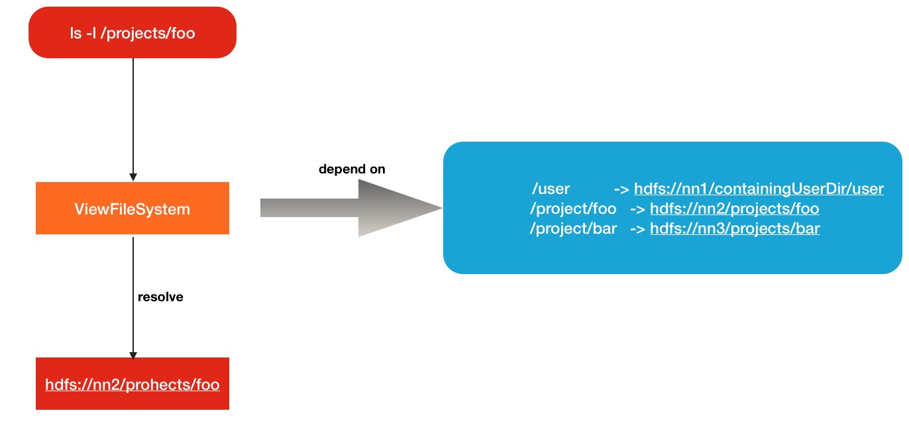

# HDFS跨集群数据合并方案之ViewFileSystem

在很多时候，会碰到数据融合的需求,比如说原先有A集群，B集群,后来管理员认为有2套集群，数据访问不方便，于是设法将A,B集群融合为一个更大的集群，将他们的数据都放在同一套集群上。一种办法就是用Hadoop自带的distcp工具，将数据进行跨集群的拷贝。当然这会带来很多的问题，如果数据量非常庞大的话。本文给大家介绍另外一种解决方案，叫做视图文件系统(ViewFileSystem)。就是让不同集群间维持视图逻辑上的唯一性,不同集群间具有独立性。

## 1. 传统数据合并方案

为了形成对比,下面描述一下数据合并中常用的数据合并的做法,就是搬迁数据.举例在HDFS中,也会想到用distcp工具进行远程拷贝.虽然discp本身就是用来干这种事情的,但是随着数据量规模的升级,会有以下问题的出现:

1. **拷贝周期太长,如果数据量非常大,在机房总带宽有限的情况,拷贝的时间将会非常长**
2. **数据在拷贝的过程中,一定会有原始数据的变更与改动,如何同步这方面的数据也是需要考虑的方面**

ViewFileSystem: 视图文件系统是Hadoop解决跨集群数据合并问题的解决方案

## 2. ViewFileSystem: 视图文件系统

ViewFileSystem不是一个新的文件系统，只是逻辑上的一个视图文件系统，在逻辑上是唯一的。Hadoop ViesFs将各个集群的真实文件路径与ViewFileSystem的新定义的路径进行关联映射，类似于文件系统中的**mount**(挂载)的意思。**进一步地说,ViewFileSystem会在每个客户端中维护一份mount-table挂载关系表,就是上面说的集群物理路径->视图文件系统路径这样的指向关系.但是在mount-table中,关系当然不止1个,会有很多个**。比如下面所示的多对关系：

```
/user          -> hdfs://nn1/containingUserDir/user
/project/foo   -> hdfs://nn2/projects/foo
/project/bar   -> hdfs://nn3/projects/bar
```

前面是ViewFileSystem中的路径,后者才是代表的真正集群路径.所以你可以理解为**ViewFileSystem核心就是路径的路由解析**。原理图如下：



