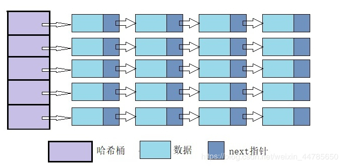

# 数据结构之链式哈希表

## 1. HashTable

哈希表支持一种最有效的检索方法：散列。

从根来上说，一个哈希表包含一个数组，通过特殊的索引值(键)来访问数组中的元素。

**哈希表的主要思想是通过一个哈希函数，在所有可能的键与哈希数组槽位之间建立一张映射表。哈希函数每次接受一个键将返回与键相对应的哈希编码或哈希值。键的数据类型可能多种多样，但哈希值只能是整型。**

计算哈希值和在数组中进行索引都只消耗固定的时间，因此**哈希表的最大亮点在于它是一种运行时间在常量级的检索方法。**当哈希函数能够保证不同的键生成的哈希值互不相同时，就说哈希表能直接寻址想要的结果。但这只是理想状态，在实际运用过程中，能够直接寻址结果的情况非常少。

通常与各种各样的键相比，哈希表的条目数相应较少。因此，绝大多数的哈希函数会将一些不同的键映射到表中相同的槽位上。当两个键映射到一个相同的槽位上时，它们就产生了冲突。一个好的哈希函数能最大限度的减少冲突，但冲突不能完全消除，需要处理这些冲突。

## 2. LinkedHashTable

**链式哈希表从根本上说是由一组链表构成。每个链表都可以看做是一个“桶”，将所有的元素通过散列的方式放到具体的不同的桶中**。

**插入元素**

首先将其键传入一个哈希函数(该过程称为哈希键)**，函数通过散列的方式告知元素属于哪个“桶”，然后在**相应的链表头插入元素。

**查找或删除元素**

用同们的方式先找到元素的桶，然后遍历相应的链表，直到发现想要的元素。因为每个桶都是一个链表，所以链式哈希表并不限制包含元素的个数。然而，如果表变得太大，它的性能将会降低。

## 3. Java8 LinkedHashTable

为提高linkedHashTable各个桶中的链表查询效率，Java8对LinkedHashTable进行改进，当链表容量超过16后，将链表转换为红黑树(一种平衡二叉树的变形)。

