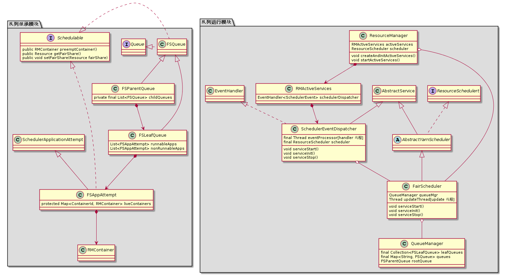

# FairScheduler类图



​													**FairScheduler相关类图**

## 队列继承模块

yarn通过树形结构来管理队列。从管理资源角度来看，树的根节点root队列(FSParentQueue),非根节点(FSParentQueue)，叶子节点(FSLeaf)，app任务(FSAppAttempt，公平调度器角度的Application)都是抽象的资源，它们都实现了Schedulable接口，都是一个**可调度资源对象**。它们都有自己的fair share(队列的资源量)方法，weight属性(权重)、minShare属性(最小资源量)、maxShare属性(最大资源量)，priority属性(优先级)、resourceUsage属性(资源使用量属性)以及资源需求量属性(demand)，同时也都实现了preemptContainer抢占资源的方法，assignContainer方法(为一个**ACCEPTED**的application分配Application Master的container)。

```java
public interface Schedulable {
  /**
   * Name of job/queue, used for debugging as well as for breaking ties in
   * scheduling order deterministically.
   */
  public String getName();

  /**
   * Maximum number of resources required by this Schedulable. This is defined as
   * number of currently utilized resources + number of unlaunched resources (that
   * are either not yet launched or need to be speculated).
   */
  public Resource getDemand();

  /** Get the aggregate amount of resources consumed by the schedulable. */
  public Resource getResourceUsage();

  /** Minimum Resource share assigned to the schedulable. */
  public Resource getMinShare();

  /** Maximum Resource share assigned to the schedulable. */
  public Resource getMaxShare();

  /** Job/queue weight in fair sharing. */
  public ResourceWeights getWeights();

  /** Start time for jobs in FIFO queues; meaningless for QueueSchedulables.*/
  public long getStartTime();

 /** Job priority for jobs in FIFO queues; meaningless for QueueSchedulables. */
  public Priority getPriority();

  /** Refresh the Schedulable's demand and those of its children if any. */
  public void updateDemand();

  /**
   * Assign a container on this node if possible, and return the amount of
   * resources assigned.
   */
  public Resource assignContainer(FSSchedulerNode node);

  /**
   * Preempt a container from this Schedulable if possible.
   */
  public RMContainer preemptContainer();

  /** Get the fair share assigned to this Schedulable. */
  public Resource getFairShare();

  /** Assign a fair share to this Schedulable. */
  public void setFairShare(Resource fairShare);
}
```

## 队列运行模块

从类图角度描述公平调度的工作原理。SchedulerEventDispatcher类负责管理handle线程。FairScheduler类管理update线程，通过QueueManager获取所有队列信息。

