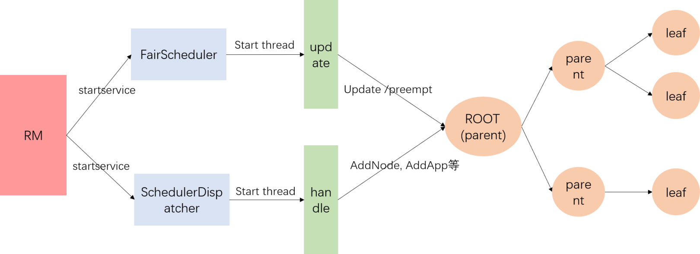

# Fair Scheduler 公平调度器

本文档描述了`Fair Scheduler`，这是一个可插入的Hadoop调度器，它允许YARN应用在大型集群中公平地共享资源。



​																	**FairScheduler 运行流程图**

公平调度器的运行流程就是RM去启动FairScheduler,SchedulerDispatcher两个服务，这两个服务各自负责update线程，handle线程。

- update线程有两个任务：

（1）更新各个队列的资源(Instantaneous Fair Share)；

（2）判断各个leaf队列是否需要抢占资源(如果开启抢占功能)

- handle线程主要是处理一些事件响应，比如集群增加节点，队列增加application，队列删除application，application更新container等。

## 1.Fair Scheduler 简介

`Fair Scheduler`是一种将资源分配给应用的方法，以便所有应用在一段时间内平均获得相等的资源份额。`Hadoop NextGen`能够调度多种资源类型。在默认情况下，公平调度程序仅基于内存调度公平决策。它可以配置为使用内存和CPU进行调度，使用Ghodsi等人开发的主导资源公平性概念。当只有一个应用程序在运行时，该应用程序将使用整个集群。当提交其他应用程序时，释放的资源被分配给新应用程序，因此每个应用程序最终得到的资源大致相同。与默认的Hadoop调度器(它会形成一个应用程序队列)不同，它允许短应用程序在合理的时间内完成，而不会饿死长应用程序。在多个用户之间共享集群也是一种合理的方式。最后，公平共享还可以与应用程序的优先级一起使用——优先级被用作**权重**来决定每个应用程序应该获得的总资源的比例。

调度程序将应用进一步组织成**队列**，并在这些队列之间公平地共享资源。默认情况下，所有用户共享一个名为**default**的队列。如果应用在容器资源请求中特别列出一个队列，则请求将提交到该队列。还可以通过配置根据请求中包含的用户名分配队列(配置不同的分配规则)。在每个队列中，调度策略用于在运行的应用之间共享资源。缺省情况下是**基于内存的公平共享**，但是也可以配置FIFO和具有主要资源公平的多资源。可以将队列安排在层次结构中来划分资源，并使用权重进行配置以按特定比例共享集群。

除了提供公平共享之外，公平调度程序还允许将保证的最小共享资源分配给队列，这对于确保某些用户、组或生产应用始终获得足够的资源非常有用。当一个队列包含应用程序时，它至少会获得最小份额，但当队列不需要它的全部保证份额时，剩余部分将在其他运行的应用之间分配。这使得调度程序即可以保证队列的容量，同时也在这些队列不包含应用时有效地利用资源。

公平调度器允许所有应用以默认方式运行(即共享内存)，但也可以通过配置文件限制每个用户和每个队列运行应用的数量。当用户必须一次提交数百个应用时，或者一次运行太多应用导致创建太多中间数据或切换太多上下文时，非常有用。这通常可以提高性能。限制应用不会导致任何随后提交的应用失败，只会在调度程序的队列中等待，直到用户之前的一些应用完成。

## 2. 具有可插拔策略的分层队列

公平调度程序支持分层队列。所有队列都从一个名为**root**的队列派生。可用资源以典型的公平调度方式分布在根队列的子队列中。然后，子队列以同样的方式将它们的资源分配其子队列。应用只能在叶子队列(将队列层级看作为层级树)上调度。在公平调度器配置文件中，通过将子队列设置为其父队列的子元素，构建队列层级关系。

队列的名称以其父队列的名称开头，句点作为分隔符。因此，根队列下名为“queue1”的队列将被称为“queue1”。队列“parent1”下名为“queue2”的队列称为“root.parent1.queue2”。当提到队列时，名称的根部分是可缺省的。

公平调度程序允许为每个队列设置不同自定义策略，允许用户以其希望的方式共享队列的资源。通过扩展`org.apache.hadoop.yarn.server.resourcemanager.scheduler.fair.SchedulingPolicy`来构建自定义策略。`FifoPolicy`、`FairSharePolicy`(默认)和`DominantResourceFairnessPolicy`是内置调度策略。

## 3. 自动将应用放入队列

公平调度器允许管理员配置自动将提交的应用程序放入适当队列的策略。位置可以取决于提交者的用户和组以及应用程序传递的请求队列。策略由一组规则组成，这些规则按顺序应用于对传入的应用程序进行分类。每个规则要么将应用程序放入队列，要么拒绝它，要么继续执行下一个规则。有关如何配置这些策略，请参阅下面的分配文件格式。

## 4. 配置使用公平调度器

要使用公平调度程序，请首先在yarn-site.xml中分配适当的调度程序类：

```xml
<property> 
  <name> yarn.resourcemanager.scheduler.class </name> 
  <value>org.apache.hadoop.yarn.server.resourcemanager.scheduler.fair.FairScheduler </ value> 
</property>
```

## 5. 公平调度器配置

自定义公平调度程序通常涉及更改两个文件：

- 通过在现有配置目录中的yarn-site.xml文件中添加配置属性来设置调度器范围的选项。
- 在大多数情况下，用户希望创建一个分配文件，列出存在哪些队列以及它们各自的权重和容量。分配文件每10秒重新加载一次，允许动态地进行更改。

### 5.1 yarn-site.xml可以设置的属性

| 属性名称                                                     | 描述                                                         |
| ------------------------------------------------------------ | ------------------------------------------------------------ |
| yarn.scheduler.fair.allocation.file                          | 调度器分配规则的配置文件路径，描述队列及其属性以及某些策略默认值的XML文件。如果是一个相对路径，则在类路径(通常包括Hadoop conf)上搜索。默认为fair-scheduler.xml |
| yarn.scheduler.fair.user-as-default-queue                    | 在未指定队列名称的情况下，是否使用与分配关联的用户名作为默认队列名称。如果设置为“false”或未设置，所有作业共享名为“default”默认队列。默认值为true。如果在配置文件中给出队列放置策略，则忽略此属性。 |
| yarn.scheduler.fair.preemption                               | 是否使用资源优先抢占。默认值为false。                        |
| yarn.scheduler.fair.preemption.cluster-utilization-threshold | 开始抢占阈值。利用率计算为所有资源的最大利用率与容量之比。默认为0.8 |
| yarn.scheduler.fair.sizebasedweight                          | 是否根据应用的大小将分配资源，而不是不分大小向所有应用程序提供相等的资源。当设置为true时，应用的权重是应用的所有请求内存的自然对数加权，除以以2为底的自然对数。。默认值为false。 |
| yarn.scheduler.fair.assignmultiple                           | 是否允许一次心跳中分配多个容器。默认值为false。              |
| yarn.scheduler.fair.dynamic.max.assign                       | 如果true，设置可以在一次心跳中分配的容器的最大数量。默认为-1，不设置限制。 |
| yarn.scheduler.fair.locality.threshold.node                  | 对于在特定节点上请求容器的应用程序，自从最后一次容器分配之后等待接受配置到其他节点的调度机会次数。表示为介于0和1之间的浮点值，作为集群大小的因子，是错过的调度机会。默认值-1.0表示不要放弃任何计划机会。 |
| yarn.scheduler.fair.locality.threshold.rack                  | 对于在特定节点上请求容器的应用程序，自从最后一次容器分配之后等待接受配置到其他节点的调度机会次数。表示为0和1之间的浮点值，它只是集群大小的一小部分，是要放弃的调度机会数。默认值-1.0表示不要放弃任何计划机会。 |
| yarn.scheduler.fair.allow-undeclared-pools                   | 如果为true，则可以在应用提交时创建新队列，无论是application指定了队列，或者是按照user-as-default-queue放置到相应队列。如果该值为false，则每当应用程序被放置在未在分配文件中指定的队列中时，它都会被放置在default队列中，禁止用户自己创建队列。默认为true。如果在分配文件中给定了队列放置策略，则忽略此属性。 |
| yarn.scheduler.fair.update-interval-ms                       | 默认值500ms，锁住调度器重新进行计算作业所需资源的间隔        |

### 5.2 队列配置文件格式

配置文件必须为XML格式。格式包含五种类型的元素：

- **Queue elements**: 代表队列。队列元素可以采用可选属性“type”，当设置为“parent”时，它将成为父队列。当我们希望在不配置任何叶队列的情况下创建父队列时，这非常有用。每个队列元素可以包含以下属性：
  - **minResources**：队列有权使用的最小资源，格式为“x MB，y vcores”。对于单资源公平策略，vcores值被忽略。如果一个队列的最小共享不满足，那么它将在同一父队列下的任何其他队列之前提供可用资源。在单资源公平性策略下，如果队列的内存使用量低于其最小内存共享量，则认为该队列不满足要求。在显性资源公平性下，如果队列对其相对于集群容量的显性资源的使用低于其对该资源的最小共享，则认为该队列不满足要求。如果在这种情况下不满足多个队列，那么资源将以相关资源使用率和最小值之间的最小比率进入队列。请注意，在提交应用程序时，低于其最小值的队列可能不会立即达到其最小值，因为已经运行的作业可能正在使用这些资源。
  - **maxResources**：允许队列的最大资源量，格式为“x MB，y vcores”。对于单资源公平策略，vcores值被忽略。永远不会为队列分配将其聚合使用量超过此限制的容器资源。
  - **maxContainerAllocation**：队列可以为单个容器分配的最大资源。如果未设置该属性，则其值将从父队列继承。默认值为yarn.scheduler.maximum-allocation-mb和yarn.scheduler.maximum-allocation-vcores。不能高于maxResources。该属性对于根队列无效。
  - 对于minResources，maxResources，maxContainerAllocation和maxChildResources属性，可以使用以下一种格式给出参数：
     - 旧格式：“ X mb，Y vcores”，“ X％cpu，Y％memory”，“ X％”。如果未提供单个百分比，则必须同时配置内存和cpu，而忽略其他资源类型并将其设置为零。
     - 新格式（推荐）：“ vcores = X，memory-mb = Y”或“ vcores = X％，memory-mb = Y％”。可以看出，以这种格式，可以给出百分比或整数的无单位资源值。在后一种情况下，将根据为该资源配置的默认单位来推断单位。当指定了内存和CPU以外的资源时，需要这种格式。如果使用minResources，则任何未指定的资源都将设置为0；如果使用maxResources，maxContainerAllocation和maxChildResources，则该资源的最大值将设置为0。
  - **maxRunningApps：**限制队列中要同时运行的应用程序数
  - **maxAMShare：**限制可用于运行应用程序主服务器的队列公平共享的部分。此属性只能用于叶队列。例如，如果设置为1.0f，那么叶队列中的application master可以占用内存和CPU公平共享的100%。值-1.0f将禁用此功能，并且不会检查amshare。默认值为0.5f.
  - **weight：** 与其他队列不成比例地共享集群。权重默认为1，权重为2的队列接收的资源大约是默认权重队列的两倍。
  - **schedulingPolicy：**设置任何队列的调度策略。允许的值为“fifo”/“fair”/“drf”或任何扩展org.apache.hadoop.yarn.server.resourcemanager.scheduler.fair.scheduling策略的类。默认为“fair”。如果“FIFO”，提交时间较早的应用程序优先获取容器，但如果满足较早应用程序的请求后集群上有剩余空间，则稍后提交的应用程序可能同时运行。
  - **aclAdministerApps：**可以管理队列的用户和/或组的列表。当前唯一的管理操作是终止应用程序。
  - **minSharePreemptionTimeout：**队列在尝试抢占容器以从其他队列获取资源之前处于其最小共享之下的秒数。获取最低资源的超时时间，如果未设置，则队列将从其父队列继承值.
  - **fairSharePreemptionTimeout：**队列在试图抢占容器以从其他队列获取资源之前处于公平共享阈值之下的秒数。也就是超过这个时间秒数之前，要抢占到权重指定的资源，如果未设置，则队列将从其父队列继承值。
  - **fairSharePreemptionThreshold：**队列的公平共享抢占阈值。如果队列等待`fairsharepreemptionTimeout`而未收到fairsharepreemptionThreshold*fairshare资源，则允许抢占容器以从其他队列获取资源。如果未设置，则队列将从其父队列继承值。
  - **allowPreemptionFrom：**确定是否允许调度程序从队列中抢占资源。默认值为true。如果队列的此属性设置为false，则此属性将递归应用于所有子队列。
  - **reservation：**表示该队列的资源可供用户预留。这仅适用于叶子队列。如果未配置此属性，则无法保留叶队列。
- **User elements：**设置对单独用户行为的管理。它们可以包含单一属性——**maxRunningApps，对特定用户可以运行的applications的数量限制。**
- **A userMaxAppsDefault element：**设置任意用户(没有特定限制的用户)运行application的默认最大数量限制。
- **A defaultFairSharePreemptionTimeout element：**设置root队列的公平共享抢占的默认超时时间；可以被root队列下的fairSharePreemptionTimeout 设置覆盖。
- **A defaultMinSharePreemptionTimeout element：**设置root队列的默认最小共享抢占超时时间；可以被root队列下minSharePreemptionTimeout覆盖。
- **A defaultFairSharePreemptionThreshold element**：设置root队列的公平共享抢占的默认阈值；可以被root队列下的fairSharePreemptionThreshold 覆盖。
- **A queueMaxAppsDefault element：**设置队列的默认运行app数量限制；可以被任一队列的**maxRunningApps元素覆盖**。
- **A queueMaxAMShareDefault element**:设置队列的默认Application Master共享资源限制；可以被任一队列的maxAMShare元素覆盖。
- **A defaultQueueSchedulingPolicy element：**设置队列的默认调度策略；可以在任一队列中设置**schedulingPolicy 进行覆盖该默认值。默认值为“fair”**。
- **A queuePlacementPolicy element：**包含一个Rule元素列表用于告诉调度器如何放置app到队列。Rule生效顺序与列表中的顺序一致。Rule可以含有参数。所有Rule接受"create"参数，用于标明该规则是否能够创建新队列."Create"默认值为true;如果设置为false并且Rule要放置app到一个allocations file没有配置的队列，那么继续应用下一个Rule。最后的Rule绝不能执行Continue。合法的规则是：
	- specified：application放置到它请求的队列。如果没有请求队列，例如它指定"default",执行continue。如果application请求队列以英文句点开头或者结尾，例如 “.q1” 或者 “q1.” 将会被拒绝.
	- user：application按照提交用户名放置到同名的队列。用户名中的英文句点将会被“_dot_”替换，如对于用户"first.last"的队列名是"first_dot_last"。
	- primaryGroup：application放置到与提交用户primary group同名的队列。用户名中的英文句点将会被“_dot_”替换，如对于组"one.two"的队列名是"one_dot_two"。
	- secondaryGroupExistingQueue：app放置到与提交用户所属的secondary group名称相匹配的队列。第一个与配置相匹配的secondary group将会被选中。组名中的英文句点会被替换成“_dot_”,例如用户使用“one.two”作为他的secondary groups将会放置到“one_dot_two”队列，如果这个队列存在的话。
	- nestedUserQueue: application放置到根据队列中嵌套规则建议的用户名同名的队列中。这有些类似于UserRule，在‘nestedUserQueue’规则中不同的是用户队列可以创建在任意父队列下，而'user'规则只能在root队列下创建用户队列。有一点需要注意，nestedUserQueue 规则只有在嵌入规则返回一个父队列时才会生效。用户可以通过设置 队列的‘type’属性为 ‘parent’ 来配置父队列，或者在队列下至少配置一个叶子。
	- default: application放置到default规则中指定的 ‘queue’属性对应的队列。如果 ‘queue’属性没有指定，app放置到 ‘root.default’ 队列。
	- reject:拒绝application。

以下给出 allocation file的一个样例：

```xml
<?xml version="1.0"?>
<allocations>
  <queue name="sample_queue">
    <minResources>10000 mb,0vcores</minResources>
    <maxResources>90000 mb,0vcores</maxResources>
    <maxRunningApps>50</maxRunningApps>
    <maxAMShare>0.1</maxAMShare>
    <weight>2.0</weight>
    <schedulingPolicy>fair</schedulingPolicy>
    <queue name="sample_sub_queue">
      <aclSubmitApps>charlie</aclSubmitApps>
      <minResources>5000 mb,0vcores</minResources>
    </queue>
  </queue>
  
  <queueMaxAMShareDefault>0.5</queueMaxAMShareDefault>
  
  <!-- Queue 'secondary_group_queue' is a parent queue and may have
       user queues under it -->
  <queue name="secondary_group_queue" type="parent">
  <weight>3.0</weight>
  </queue>
  
  <user name="sample_user">
    <maxRunningApps>30</maxRunningApps>
  </user>
  
  <userMaxAppsDefault>5</userMaxAppsDefault>
  
  <queuePlacementPolicy>
    <rule name="specified" />
    <rule name="primaryGroup" create="false" />
    <rule name="nestedUserQueue">
        <rule name="secondaryGroupExistingQueue" create="false" />
    </rule>
    <rule name="default" queue="sample_queue"/>
  </queuePlacementPolicy>
</allocations>
```

### 5.3 队列访问控制列表

访问控制列表(ACLs)允许管理员控制谁能对特定队列执行操作。这些用户通过aclSubmitApps 和aclAdministerApps属性配置，可以设置在每个队列上。当前唯一支持的管理性操作就是杀死app。任何能够管理管理的人也都可以向该队列提交app.这些属性的值像 “user1,user2 group1,group2” 或者“ group1,group2”的格式。如果用户或者组是在队列的ACLs中或者在这个队列的任意祖先的ACLs中，那么他对该队列的操作是被允许的。所以，如果queue2 在queue1内部，并且user1 在queue1的ACL中，user2 在queue2的ACL中，那么两个用户都可以向queue2提交app.

备注：分隔符是空格。要只是指定ACL组，该值需要以空格开头.

root队列的ACLS默认是"* "，因为ACLs是向下传递的，意思是每个用户都可以对每一个队列提交和杀死application。要启动严格的方访问，修改root队列的ACL为除"*"之外的其他值.

### 5.4 运行时修改配置

通过编辑allocation file可以在运行时完成修改最小共享，资源限制，权重，超时抢占以及队列调度策略等。调度器会每个10-15秒重载修改后的该配置文件.

### 5.5 **通过web UI进行监控**

当前应用、队列以及公平共享都可以通过ResourceManager的web UI查看，地址在http://ResourceManagerURL/cluster/scheduler。

 在web UI上可以看到每个队列的以下字段：

- Used Resources 队列已经分配的容器的资源之和。
- Num Active Applications 队列中已经接受到至少一个容器的应用程序数量。
- Num Pending Applications 队列中还没有接受任何一个容器的应用程序的数量。
- Min Resources 配置的授予队列的最小资源。
- Max Resources   配置的队列允许的最大资源.
- Instantaneous Fair Share   队列的资源的瞬时公平共享。这些共享只考虑活动的队列(那些有运行中程序的)，而且被调度决策所使用。当其他队列没有使用某些资源时，队列可以被分配到超过他shares的资源。一个队列的资源消费处在或者低于它的瞬时公平份额将不会有容器被抢占。
- Steady Fair Share 队列的固定公平份额，无论这些队列是否活跃。他们很少被计算和修改，除非配置或者容量发生变化。他们意思是提供资源可视化。

### 5.6 队列间移动应用

Fair Scheduler 支持移动一个运行中的应用程序到另外一个队列。这个可以用于移动一个重要的应用程序到较高优先级队列，或者移动一个不重要的应用程序到一个较低优先级的队列。通过运行 ：

`yarn application -movetoqueue appID -queue targetQueueName可以移动运行中的应用程序。`

当应用程序移动到一个队列，出于公平考虑，它的现存的分配计算会变成新队列的资源分配。如果加入被移动的应用程序的资源超出目标队列的maxRunningApps 或者maxResources 限制，本次移动将会失败。

### 5.7 记录公平调度器状态

Fair Scheduler能够定期转储其状态。默认情况下禁用。管理员可以通过将：

`org.apache.hadoop.yarn.server.resourcemanager.scheduler.fair.FairScheduler.statedump`日志记录级别设置为DEBUG 来启用它。

默认情况下，Fair Scheduler日志进入资源管理器日志文件。公平调度程序状态转储可能会生成大量日志数据。取消注释log4j.properties中的“公平调度程序状态转储”部分，以将状态转储到单独的文件中。