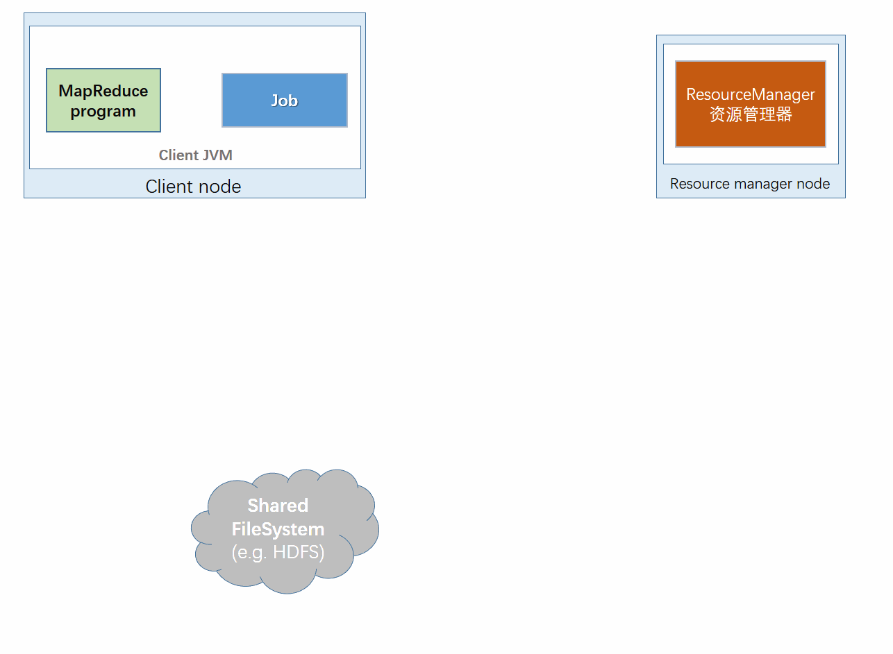

# 第七章 MapReduce的工作机制

在本章中，将深入学习MapReduce的工作机制。

## 7.1 剖析MapReduce运行运行机制

可以通过一个简单的方法调用来运行MapReduce作业：Job对象的`submit( )`方法，可以调用`waitForCompletion()`方法，用于提交以前没有提交的作业，并等待完成。`submit()`方法调用封装了大量的处理细节。

整个过程描述如图7-1所示，在最高层，有以下5个独立的实体。

- 客户端，提交MapReduce作业；
- YARN资源管理器，负责协调集群上计算机资源的分配。
- YARN节点管理器，负责启动和监视集群中机器上计算容器(container)
- MapReduce的application master，负责协调运行MapReduce作业的任务，它和MapReduce任务在容器中运行，这些容器由资源管理器分配资源并由节点管理器进行管理。

### 7.1.1 作业提交

`Job`的`Submit()`方法创建一个内部的`JobSummiter`实例，并且调用其`submitJobInternal()`方法(图7-1步骤1)。提交作业后，`waitForCompletion()`每秒轮询查询作业进度，如果发现自上次报告后有改变，便将进度报告到控制台，作业完成后，如果成功，就现实作业计数器，如果失败，则导致作业失败的错误被记录到控制台。

​											**图7-1 Hadoop运行MapReudce作业的工作原理**

`JobSummiter`所实现的作业提交过程如下所述：

- 向资源管理器请求一个新应用的ID，用于MapReduce作业ID(步骤2)。
- 检查作业的输出说明，例如：如果没有指定输出目录或输出目录已存在，作业不提交，错误抛回给MapReduce程序。
- 计算作业的输入分片，如果分片无法计算，比如因为输入路径不存在，错误返回给MapReduce程序。
- 将运行作业所需资源(包括作业JAR文件，配置文件和计算所得的输入分片)复制到一个以作业ID命名的目录下的共享文件系统。作业JAR的副本较多(由`mapreduce.client.submit.file.replication`属性控制，默认值是10)。因此在运行作业的任务时，集群中有很多个复本可供节点管理器访问。
- 通过调用资源管理器的`submitApplication()`方法提交作业，参见步骤4 。

### 7.1.2 作业的初始化

资源管理器收到调用它的`submitApplication()`消息后，便将请求传递给YARN调度器(scheduler)。调度器分配一个容器，调度器分配一个容器，然后**资源管理器在节点管理器的管理下在容器中启动application master进程(步骤5a，5b)。**

**MapReduce作业的application master是一个Java应用程序，它的主类是MRAppMaster，由于将接受来自任务的进度和完成报告(步骤6)**。因此application master对作业的初始化是通过创建多个簿记对象(作业簿)来跟踪作业完成情况。

**Application Master接受来自共享文件系统的、在客户端计算的输入分片(步骤7)。**然后为每一个分片创建一个map任务对象以及由 mapreduce.job.reduces属性(通过作业的`setNumReduceTasks()`方法设置)指定的多个reduce对象。任务ID此时分配。

Application Master必须决定如何运行构成MapReduce作业的各个任务，如果作业很小，就选择和自己在同一个JVM上运行任务。与在一个节点上顺序运行这些任务相比，当application master判断在新的容器中分配和运行任务的开销大于并行运行它们的开销时，就会发生这样的情况，这样的作业称为`uberized`或者作为uber运行(小作业)。

**小作业的判断：**默认情况下，小作业判别标准是mapper任务小于10个并且只有1个reducer，且输入大小小于一个HDFS块的作业(通过设置`mapreduce.job.ubertask.maxmaps`，`mapreduce.job.ubertask.maxreduces`和`mapreduce.job.ubertask.maxbytes`可以改变这几个值)。必须明确启用Uber任务(对于单个作业，或者是整个集群)，具体方法是将`mapreduce.job.ubertask.enable`设置为true。

最后，在任何任务运行之前，application master调用`setupJob()`方法设置`OutputComitter``。FileOutputCommitter`为默认值，表示将建立作业的最终输出目录以及任务输出的临时工作空间。

### 7.1.3 任务分配

**如果作业不适合作为uber任务运行，application master就会为该作业中所有map任务和reduce任务向资源管理器请求容器(步骤8)。** 首先为Map任务发出请求，该请求优先级要高于Reduce任务的请求。这是因为所有的map任务必须在reduce的排序阶段能够启动前完成。直到有5%的map任务已经完成，为reduce任务的请求才会发出。

reduce任务能够在集群中任务位置运行，但是map任务的请求有着数据本地化局限，这也是调度器所关注的(4.1.1节)。在理想情况下，任务是数据本地化(data local)的，意味着任务在分片驻留的同一节点上运行。可选情况是：机架本地化(rack local)运行、其他机架上运行。对于一个特定的作业运行，可以通过查看作业的计数器来确定在每个本地化层次上运行的任务数量(参见表9-6)。

资源管理器也指定了内存和CPU核数，**默认情况下是，每个map任务和reduce任务都分配到1024MB的内存和1个虚拟内核。**它们可以在每个作业的基础上进行配置(遵从与10.3.3节描述的最大值和最小值)。分别通过：

- `mapreduce.map.memory.mb`
- `mapreduce.reduce.memory.mb`
- `mapreduce.map.cpu.vcores`
- `mapreduce.reduce.cpu.vcores`

### 7.1.4 任务的执行

**一旦资源管理器的调度器为任务分配了一个特定节点上的容器，application master就通过与节点管理器通信来启动容器(步骤9a和9b)。**该任务由主类为`YarnChild`的一个Java应用程序执行。

在运行任务之前，首先将任务需要的资源本地化，包括作业的配置，JAR文件和所有来自分布式缓存的文件(步骤10，参见9.4.2节)。

最终运行map任务和reduce任务(步骤11)。