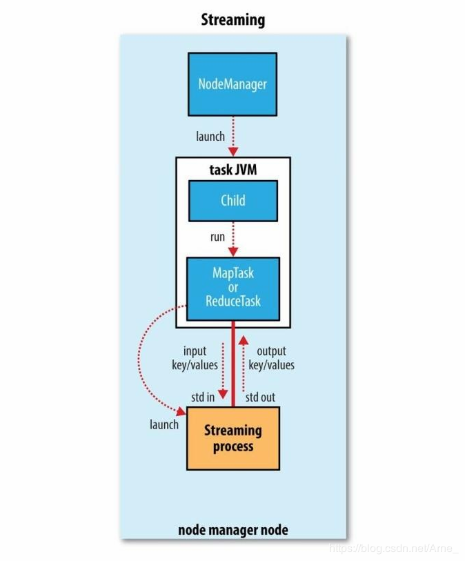
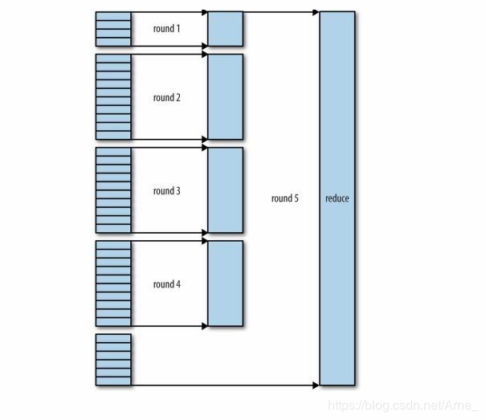

# 第七章 MapReduce的工作机制

在本章中，将深入学习MapReduce的工作机制。

## 7.1 剖析MapReduce运行运行机制

可以通过一个简单的方法调用来运行MapReduce作业：Job对象的`submit( )`方法，可以调用`waitForCompletion()`方法，用于提交以前没有提交的作业，并等待完成。`submit()`方法调用封装了大量的处理细节。

整个过程描述如图7-1所示，在最高层，有以下5个独立的实体。

- 客户端，提交MapReduce作业；
- YARN资源管理器，负责协调集群上计算机资源的分配。
- YARN节点管理器，负责启动和监视集群中机器上计算容器(container)
- MapReduce的application master，负责协调运行MapReduce作业的任务，它和MapReduce任务在容器中运行，这些容器由资源管理器分配资源并由节点管理器进行管理。

### 7.1.1 作业提交

`Job`的`Submit()`方法创建一个内部的`JobSummiter`实例，并且调用其`submitJobInternal()`方法(图7-1步骤1)。提交作业后，`waitForCompletion()`每秒轮询查询作业进度，如果发现自上次报告后有改变，便将进度报告到控制台，作业完成后，如果成功，就现实作业计数器，如果失败，则导致作业失败的错误被记录到控制台。


​											**图7-1 Hadoop运行MapReudce作业的工作原理**

`JobSummiter`所实现的作业提交过程如下所述：

- 向资源管理器请求一个新应用的ID，用于MapReduce作业ID(步骤2)。
- 检查作业的输出说明，例如：如果没有指定输出目录或输出目录已存在，作业不提交，错误抛回给MapReduce程序。
- 计算作业的输入分片，如果分片无法计算，比如因为输入路径不存在，错误返回给MapReduce程序。
- 将运行作业所需资源(包括作业JAR文件，配置文件和计算所得的输入分片)复制到一个以作业ID命名的目录下的共享文件系统。作业JAR的副本较多(由`mapreduce.client.submit.file.replication`属性控制，默认值是10)。因此在运行作业的任务时，集群中有很多个复本可供节点管理器访问。
- 通过调用资源管理器的`submitApplication()`方法提交作业，参见步骤4 。

### 7.1.2 作业的初始化

资源管理器收到调用它的`submitApplication()`消息后，便将请求传递给YARN调度器(scheduler)。调度器分配一个容器，然后**资源管理器在节点管理器的管理下在容器中启动application master进程(步骤5a，5b)。**

**MapReduce作业的application master是一个Java应用程序，它的主类是MRAppMaster，由于将接受来自任务的进度和完成报告(步骤6)**。因此application master对作业的初始化是通过创建多个簿记对象(作业簿)来跟踪作业完成情况。

**Application Master接受来自共享文件系统的、在客户端计算的输入分片(步骤7)。**然后为每一个分片创建一个map任务对象以及由 mapreduce.job.reduces属性(通过作业的`setNumReduceTasks()`方法设置)指定的多个reduce对象。任务ID此时分配。

Application Master必须决定如何运行构成MapReduce作业的各个任务，如果作业很小，就选择和自己在同一个JVM上运行任务。与在一个节点上顺序运行这些任务相比，当application master判断在新的容器中分配和运行任务的开销大于并行运行它们的开销时，就会发生这样的情况，这样的作业称为`uberized`或者作为uber运行(小作业)。

**小作业的判断：**默认情况下，小作业判别标准是mapper任务小于10个并且只有1个reducer，且输入大小小于一个HDFS块的作业(通过设置`mapreduce.job.ubertask.maxmaps`，`mapreduce.job.ubertask.maxreduces`和`mapreduce.job.ubertask.maxbytes`可以改变这几个值)。必须明确启用Uber任务(对于单个作业，或者是整个集群)，具体方法是将`mapreduce.job.ubertask.enable`设置为true。

最后，任务运行前，application master调用`setupJob()`方法设置`OutputComitter`。FileOutputCommitter为默认值，表示将建立作业的最终输出目录以及任务输出的临时工作空间。

### 7.1.3 任务分配

**如果作业不适合作为uber任务运行，application master就会为该作业中所有map任务和reduce任务向资源管理器请求容器(步骤8)。** 首先为Map任务发出请求，该请求优先级要高于Reduce任务的请求。这是因为所有的map任务必须在reduce的排序阶段能够启动前完成。直到有5%的map任务已经完成，为reduce任务的请求才会发出。

reduce任务能够在集群中任务位置运行，但是map任务的请求有着数据本地化局限，这也是调度器所关注的(4.1.1节)。在理想情况下，任务是数据本地化(data local)的，意味着任务在分片驻留的同一节点上运行。可选情况是：机架本地化(rack local)运行、其他机架上运行。对于一个特定的作业运行，可以通过查看作业的计数器来确定在每个本地化层次上运行的任务数量(参见表9-6)。

资源管理器也指定了内存和CPU核数，**默认情况下是，每个map任务和reduce任务都分配到1024MB的内存和1个虚拟内核。**它们可以在每个作业的基础上进行配置(遵从与10.3.3节描述的最大值和最小值)。分别通过：

- `mapreduce.map.memory.mb`
- `mapreduce.reduce.memory.mb`
- `mapreduce.map.cpu.vcores`
- `mapreduce.reduce.cpu.vcores`

### 7.1.4 任务的执行

**一旦资源管理器的调度器为任务分配了一个特定节点上的容器，application master就通过与节点管理器通信来启动容器(步骤9a和9b)。**该任务由主类为`YarnChild`的一个Java应用程序执行。

在运行任务之前，首先将任务需要的资源本地化，包括作业的配置，JAR文件和所有来自分布式缓存的文件(步骤10，参见9.4.2节)。最终运行map任务和reduce任务(步骤11)。

YarnChild在指定的JVM中运行，因此用户定义的map或reduce函数中的任何异常不会影响到节点管理器，例如导致其崩溃或者挂起。

每个任务都能够执行搭建(setup)和提交(commit)动作，它们和任务本身在同一个JVM中运行，并由作业的OutputCommitter决定。对于基于文件的作业，提交动作将任务输出由临时位置移动到最终位置。

#### Streaming

Streaming是运行特殊的map任务和reduce任务，目的是运行用户提供的可执行程序，并与之通信。



Streaming任务使用标准输入和输出流与进程（可以用任何语言编写）进行通信。在任务执行过程中，Java进程都会把“输入键-值对”传给外部的进程，后者通过用户定义的map函数和reduce函数来执行它并把“输入键-值对”传回Java进程。从节点管理器的角度看，就像其子进程自己在运行map或reduce代码一样。

### 7.1.5 进度和状态的更新

一个作业和它的每个任务都有一个状态(status)，包括：作业或任务的状态(比如：运行中，成功完成，失败)、map和reduce的进度、作业计数器的值、状态消息或描述(可以由用户码来设置)。

这些状态信息在作业期间，与客户端进行通信。任务在运行时，对其进度(即任务完成百分比)保持追踪。

- 对map任务，任务进度时已处理输入所占的比例；

- 对reduce任务，系统会估计已处理reduce输入的比例。整个过程分为三部分，与shuffle三个节点相对应(详情参见7.3节)，比如任务已经执行reduer一半的输入，那么任务进度为$\frac{5}{6}$，因为已经完成复制和排序阶段(每个占$\frac{1}{3}$)，并且已经完成reduce阶段的一半

	**Tips MapReduce中进度的组成**

构成进度的所有操作如下：

- mapper或reducer读入一条输入记录
- mapper或reducer写入一条输出记录
- 通过Reporter或TaskAttemptContext设置状态描述
- 使用Reporter的`incrCounter()`方法或Counter的`increment()`方法增加计数器的值
- 调用Reporter或TaskAttemptContext的`progress()`方法

当map任务或reduce任务运行时，子进程和自己的父application master通过umbilical接口通信。每隔3秒钟，任务通过这个umbilical接口向自己的application master报告进度和状态(包括计数器)。application master会形成汇聚视图(aggregate view)。

资源管理器界面显示了所有运行中的应用程序，并且分别有链接指向这些应用各自的application master的界面，展示了MapReduce作业的更多细节。

在作业期间，客户端每秒钟轮询一次application master以接收最新状态(轮询间隔通过mapreduce.client.progressmonitor.pollinterval设置)。客户端可以使用Job的getStatus方法得到一个JobStatus实例。


​												**图7-3 状态更新在MapReduce系统中的传递流程**

### 7.1.6 作业的完成

当application master收到作业最后一个任务完成的通知后，便把作业的状态设置为"成功"。然后，Job轮询状态时，便知道任务已经完成，于是Job打印一条消息告知用户，最后从`waitForCompletion()`方法返回。Job的统计信息和计数值输出到控制台。

如果application master有相应的设置，也会发送一个HTTP作业通知。希望收到回调指令的客户端可以通过mapreduce.job.end-notification.url属性来进行这项设置。

最后，作业完成时，application master和任务容器清理其工作状态(中间输出将被删除)，OuputCommitter的`commitJob()`方法会被调用。作业信息由作业历史服务器存档，以便日后用户需要时可以查询。

## 7.2 失败

在现实情况中，用户代码错误不断、进程崩溃、机器故障，如此种种，Hadoop最主要的好处是它能处理类似故障并成功完成任务(容错率高，健壮性强)。考虑如下实体失败：Task、application master、node manager、resoucre manager。

### 7.2.1 Task运行失败

任务失败最常见的情况是**map任务或reduce任务中的用户代码抛出运行异常**。如果发生这种情况，任务JVM会在退出之前向其父application master发送错误报告。错误报告最后被记人用户日志。application master将此次任务任务尝试标记为failed（失败），并释放容器以便资源可以为其他任务使用。

另一种失败模式是任务JVM突然退出，可能由于JVM软件缺陷而导致MapReduce用户代码由于某些特殊原因造成JVM退出。在这种情况下，节点管理器会注意到进程已经退出，并通知application master将此次任务尝试标记为失败。

任务挂起的处理方式则有不同。一旦application master注意到已经有一段时间没有收到进度的更新，便会将任务标记为失败。在此之后，任务JVM进程将被自动杀死。任务被认为失败的超时间隔通常为10分钟，可以以作业为基础（或以集群为基础）进行设置，对应的属性为mapreduce.task.timeout，单位为毫秒。

超时(timeout)设置为0将关闭超时判定，所以长时间运行的任务永远不会被标记为失败。在这种情况下，被挂起的任务永远不会释放它的容器并随着时间的推移最终降低整个集群的效率。因此，**尽量避免这种设置**，同时充分确保每个任务能够定期汇报其进度。参见7.1.5节进度和状态的更新的补充材料"MapReduce中进度的组成”。

application master被告知一个任务尝试失败后，将重新调度该任务的执行。application master会试图避免在以前失败过的节点管理器上重新调度该任务。此外，如果一个任务失败过4次，将不会再重试。这个值是可以设置的：

- 对于map任务，运行任务的最多尝试次数由mapreduce.map.maxattempts属性控制；
- 对于reduce任务，则由mapreduce.reduce.maxattempts属性控制。

在默认情况下，如果任何任务失败次数大于4（或最多尝试次数被配置为4），整个作业都会失败。

对于一些应用程序，允许有少数几个任务失败不会中止运行整个作业，因为即使有任务失败，作业的一些结果可能还是可用的。在这种情况下，可以为作业设置在不触发作业失败的情况下允许任务失败的最大百分比。map任务和reduce任务通过设置mapreduce.map.failures.maxpercent和mapreduce.reduce.failures.maxpercent这两个属性。

任务尝试（task attempt）也是可以中止的(killed)，这与失败不同。因为任务尝试是一个推测副本或因为它所处的节点管理器失败，导致application master将它上面运行的所有任务尝试标记为killed。被中止的任务尝试不会被计人任务运行尝试次数（由mapreduce.map.maxattenpts和mapreduce.reduce.maxattempts设置），因为尝试被中止并不是任务的过错。

用户也可以使用webUI或命令行方式（输人mapred job查看相应的选项）来中止或取消任务尝试。也可以采用相同的机制来中止作业。

### 7.2.2 application master运行失败

YARN中的应用程序在运行失败的时候会有几次尝试机会。就像MapReduce任务在遇到硬件或网络故障时要进行几次尝试一样。运行MapReduce application master的最多尝试次数由mapreduce.am.max-attempts属性控制。默认值是2，即如果MapReduce application master失败两次，便不会再进行尝试，作业将失败。

YARN对集群上运行的YARN application master的最大尝试次数加以了限制，单个的应用程序不可以超过这个限制。该限制由yarn.resourcemanager.am.max-attempts属性设置，默认值是2，可以通过修改集群上YARN的设置来增加尝试次数。

应用恢复过程如下：application master向资源管理器发送周期性的心跳，当application master失败时，资源管理器将检测到该失败并在一个新的容器（由节点管理器管理）中开始一个新的master实例。对于Mapreduce application master，它将使用作业历史来恢复失败的应用程序所运行任务的状态，使其不必重新运行。默认情况下恢复功能是开启的，但可以通过设置yarn.app.mapreduce.am.job.recovery.enable为false来关闭这个功能。

MapReduce客户端向application master轮询进度报告，如果该作业的application master运行失败，客户端就需要定位新的实例。在作业初始化期间，客户端向Resource Manager询问并缓存application master，使其每次需要向application master查询时不重载资源管理器。但如果application master运行失败，客户端就会在发出状态更新请求时经历超时，这时客户端会重新向资源管理器请求新的application master的地址。

### 7.2.3 节点管理器运行失败

如果节点管理器由于崩溃或运行非常缓慢而失败，就会停止向资源管理器发送心跳信息（或发送频率很低）。如果10分钟内（可以通过属性yarn.resourcemanager.nm.liveness-monitor.expiry-interval-ms设置，以毫秒为单位）没有收到一条心跳信息，资源管理器将会通知停止发送心跳信息的节点管理器，并且将其从自己的节点池中移除以调度启用容器。

在失败的节点管理器上运行的所有任务和application master都会按照其失败机制恢复。对于在失败的节点管理器上运行且成功完成的map任务，如果属于未完成的作业，那么applicationmaster会安排它们重新运行。因为这些任务的中间输出驻留在失败的节点管理器的本地文件系统中，可能无法被reduce任务访问。

如果应用程序的运行失败次数过高，那么节点管理器可能会被拉黑(即使节点管理自己并没有失败过)，由application master管理黑名单。对于MapReduce，如果一个节点管理器上有超过**3个任务失败**，application master就会尽量将任务调度到不同的节点上。可以通过作业属性mapreduce.job.maxtaskfailures.per.tracker设置该阈值。

**注意：**在本书写作时，资源管理器不会执行对应用程序的拉黑操作，因此新作业中的任务可能被调度到故障节点上，即使这些故障节点已经被运行早期作业的application master拉黑。

### 7.2.4 资源管理器运行失败

资源管理器失败是非常严重的问题，没有资源管理器，作业和任务容器将无法启动。在默认的配置中，资源管理器是个单点故障，这是由于在Resource Manager机器失败的情况，所有运行的作业都失败且不能被恢复。

为获得高可用性（HA），在双机热备配置下，运行一对资源管理器是必要的。如果主资源管理器失败了，那么备份资源管理器能够接替，且客户端不会感到明显的中断。

所有运行中的应用程序的信息存储在一个高可用的状态存储区中(由Zookeeper或HDFS备份)。这样备机可以恢复出失败的主资源管理器的关键状态。节点管理器信息没有存储在状态存储区中，因为当节点管理器发送它们的第一个心跳信息时，节点管理器的信息能以相当快的速度被新的资源管理器重构。

**注意：**由于任务是由applicationmaster管理的，因此任务不是资源管理器的状态的一部分。这样，要存储的状态量比MapReduce1中jobtracker要存储的状态量更好管理。

当新的资源管理器启动后，从状态存储区中读取应用程序的信息，然后为集群中运行的所有应用程序重启application master。这个行为不被计为失败的应用程序尝试，即不会计人yarn.resourcemanager.am.max-attempts，因为应用程序并不是因为程序代码错误而失败，而是被系统强行中止的。

资源管理器从备机到主机的切换是由故障转移控制器（failover controller)处理的。默认的故障转移器是自动工作的，使用Zookeeper的leader选举机制(leader election）以确保同一时刻只有一个主资源管理器。不同于HDFS高可用性（详见3.2.5节HDFS的高可用）的实现，故障转移控制器不必是一个独立的进程，为配置方便，默认情况下嵌人在资源管理器中。故障转移也可以配置为手动处理，但不建议这样。

为应对资源管理器的故障转移，必须对客户和节点管理器进行配置，因为他们可能是在和两个资源管理器打交道。客户和节点管理器以轮询（round-robin）方式试图连接每一个资源管理器，直到找到主资源管理器。如果主资源管理器故障，他们将再次尝试直到备份资源管理器变成主机。

## 7.3 shuffle和排序

MapReduce确保每个reducer的输入都是按键排序的。系统执行排序、将map输出作为输出传入给reducer的过程称为**shuffle**。shuffle属于不断被优化和改进的代码库的一部分。

### 7.3.1 Map端

map函数开始产生输出时，并不是简单地将它写入到磁盘。这个过程更为复杂，它利用缓冲的方式写到内存并出于效率考虑进行预排序。图7-4展示了这个过程。


​														**图7-4 MapReduce的shuffle和排序**

过程的详细说明如下：

（1）客户端把输入数据源进行分片，根据分片来决定有多少个map任务。

（2）每个map任务都有一个环形内存缓冲区作为用于存储任务输出。在默认情况下，缓存区的大小为100MB，可以通过`mapreduce.task.io.sort.mb`属性来调整。

（3）一旦缓冲区的内容达到阈值(`mapreduce.map.sort.spill.percent`，默认为80%，或0.8)，一个后台线程便开始把内容溢写(spill)到磁盘，在溢写到磁盘的过程中，map输出继续写到缓冲区。但如果在此期间缓冲区被写满，map会被阻塞直到磁盘过程完成。溢写过程按轮询方式将缓冲区的内容到`mapreduce.cluster.local.dir`属性在作业特定子目录下的指定的目录中。

（4）在写磁盘前，线程首先根据数据最终要传的reducer把数据划分成相应的分区(partition，用户也可自定义分区函数，默认的partitioner通过哈希函数来分区)。每个分区中后台线程按键进行内存中排序，如果有一个combiner函数，它就在排序后的输出上运行。行combiner函数使得map输出结果更紧凑，因此减少写到磁盘的数据和传递给reducer的数据。

每次内存缓冲区达到溢出阈值时，就会新建一个溢出文件（spill file），因此，在map任务写完其最后一个输出记录后，会有几个溢写文件。在任务完成之前，溢写文件被合并成一个已分区且已排序的输出文件。配置属性是mapreduce.task.io.sort.factor控制着一次最多能合并多少流，默认值是10。

如果至少存在3个溢写文件（通过`mapreduce.map.combine.minspills`属性设置）时，则combiner就会在输出文件写到磁盘之前再次运行。combiner可以在输入上反复运行，但并不影响最终结果。如果只有1个或者2个溢写文件，那么由于map输出规模减少，因此不值得调用combiner带来的开销，因此不会为该map输出再次运行combiner。

将map输出写到磁盘的过程中对他进行压缩往往是一个很好的主意，因为这样写磁盘的速度更快，节约磁盘空间，并且减少传给reducer的数据量。默认输出时不压缩的，将mapreduce.map.output.compress设置为true，就可以使用此功能。使用的压缩库由mapreduce.map.output.compress.codec指定。

reduer通过HTTP得到输出文件的分区。文件分区工作线程数量由任务的`mapreduce.shuffle.max.threads`属性控制，此设置针对的是每一个节点管理器，而不是针对每个map任务。默认值0将最大线程数设置为机器中处理器数量的两倍。

### 7.3.2 reduce端

#### 1. reducer复制

map输出文件位于运行map任务的tasktracker的本地磁盘(注意，尽管map输出经常写到map tasktracker 的本地磁盘，但reduce输出并不这样)。现在，tasktracker需要为分区文件运行reduce任务。并且，reduce任务需要集群上若干个map任务的map输出作为其特殊的分区文件。每个map任务的完成时间可能不同，因此每个任务完成时，reduce任务就开始复制其输出，即reduce的复制阶段。reduce任务有少量复制线程，因此能够并行取得map输出。默认值是5个线程，可以通过修改设置`mapreduce.reduce.shuffle.parallelcopies`改变。

```
reducer如何知道要从哪台机器上取得map输入呢

		map任务完成后，会使用心跳机制通知他们的application master。因此，对于指定作业，application master知道map输出和主机位置之间的映射关系。reduer中的一个线程定期询问master获取map输出主机的位置，直到获取所有输出的位置。

		由于第一个reducer可能失败，因此主机并没有在第一个reducer检索到map输出时就立即从磁盘上删除文件。主机会在application master通知删除时，删除map输出，通常是在作业完成后执行(避免reducer失败后，map输出临时文件被删除，需要重新执行map任务，浪费时间和计算机资源)。
```

很小map输出会被复制到reduce的JVM的内存(由`mapreduce.reduce.shuffle.input.buffer.percent`属性控制，指定用于此用途的堆空间的百分比)，否则被复制到磁盘。当内存缓冲区达到阈值(由mapreduce.reduce.shuffle.merge.percent决定)或者达到map输出阈值（由mapreduce.reduce.merge.inmen.threshold控制），则合并后溢出写到磁盘中。

如果指定combiner，则在合并期间运行它以降低写入硬盘的数据量。随着磁盘上副本增多，后台线程会将它们合并为更大的、排好序的文件。这会为后面的合并节省一些时间。注意，为了合并，压缩的map输出（通过map任务）都必须在内存中被解压缩。

#### 2. reducer合并排序

复制完所有map输出后，reduce任务进入排序阶段（更恰当的说法是合并阶段，因为排序是在map端进行的），这个阶段将合并map输出，维持其顺序排序。这是循环进行的。比如，如果有50个map输出，而合并因子是10(10为默认设置，由mapreduce.task.io.sort.factor属性设置，与map的合并类似)，合并将进行5趟，每趟将10个文件合并成一个文件，因此最后有5个中间文件。

#### 3. reduce阶段

在最后阶段，即reduce阶段，直接把数据输入reduce函数，从而省略了一次磁盘往返行程，并没有将这5个文件合并成一个已排序的文件作为最后一趟。最后的合并可以来自内存和磁盘片段。

每趟合并的文件数实际上比事例中展示有所不同。目标是合并最少数量的文件以便满足于最后一趟的合并系数。因此如果有40个文件，我们并不会在四趟中每趟合并10个文件从而得到4个文件。相反，第一趟只合并4个文件，随后的三趟合并完整的10个文件。在最后一趟中，4个已合并的文件和余下的6个（未合并的）文件合计10个。如图7-5所示：




​													**图7-5 通过合并因子10有效合并40个文件片段**

**注意：**这并没有改变合并次数，只是一个优化措施，目的是尽量减少写入磁盘的数据量，因为最后一次总是直接合并到reduce。

在reduce阶段，对已排序输出中的每个键都调用reduce函数。此阶段的输出直接写到输出文件系统，一般为HDFS（可自定义）。如果采用HDFS，由于节点管理器也运行数据节点，所以第一个块的副本将被写入到本地磁盘。

### 7.3.3 配置调优

通过调优shuffle过程，可以提高MapReduce性能。表7-1和7-2总结了相关设置和默认值。这些设置以作业为单位，默认值适用于常规作业。

​															**表 7-1 map端的调优属性**

| 属性名称                            | 类型    | 默认值       | 说明                                                         |
| ----------------------------------- | ------- | ------------ | ------------------------------------------------------------ |
| mapreduce.Task.io.sort.mb           | int     | 100          | 排序map输出时所使用的内存缓冲区的大小，默认100MB             |
| mapreduce.map.sort.spill.percent    | Float   | 80           | map输出内存缓冲和用来开始磁盘溢出写过程的记录边界索引，      |
| mapreduce.task.io.sort.factor       | int     | 10           | 排序文件时，一次最多合并的流数，这个属性也在reduce中使用，此值增加到100也很常见 |
| mapreduce.map.combine.minspills     | int     | 3            | 运行combiner所需的最小溢出文件数                             |
| mapreduce.map.output.compress       | boolean | false        | 是否压缩map输出                                              |
| mapreduce.map.output.compress.codec | Class   | defaultCodec | map输出的压缩编解码器                                        |
| Mapareduce.shuffle.max.thread       | int     | 0            | 每个节点管理器的工作线程数，用于将map输出到reducer。这个是集群设置，不能由单个作业设置。0表示使用Netty默认值，即两倍可用的处理数 |

​	在map端，可以通过避免多次溢出写磁盘来获得最佳性能；一次是最佳的情况。如果能估算map输出大小，就可以合理地设置`mapreduce.task.io.sort.*`属性来尽可能减少溢出写的次数。具体而言，如果可以，就要增加mapreduce.task.io.sort.mb的值。MapReduce计数器（"SPILLED_RECORDS”参见9.1节“计数器"）计算在作业运行整个阶段中溢出写磁盘的记录数，这对于调优很有帮助。注意，这个计数器包括map和reduce两端的溢出写。

在reduce端，中间数据全部驻留在内存时，获得最佳性能。默认情况下，是不可能发生的，因为所有内存一般都预留给reduce函数。但如果reduce函数的内存需求不大，把`mapreduce.reduce.merge.inmem.threshold`设置为0，把`mapreduce.reduce.input.buffer.percent`设置为1.0或一个更低的值，详见表7-2就可以提升性能。

​															**表 7-2 map端的调优属性**

| 属性名称                                      | 类型  | 默认值 | 说明                                                         |
| --------------------------------------------- | ----- | ------ | ------------------------------------------------------------ |
| mapreduce.reduce.shuffle.parallelcopies       | int   | 5      | 用于把map输出复制到reducer的线程数                           |
| mapreduce.reduce.shuffle.maxfetchfailures     | int   | 10     | 在声明失败之前，reducer获取一个map输出所花的最大时间         |
| mapreduce.task.io.sort.factor                 | int   | 10     | 排序文件时一次最多合并的流的数量。这个属性也在map端使用      |
| mapreduce.reduce.shuffle.input.buffer.percent | float | 0.70   | 在shuffle的复制阶段，分配给map输出的缓冲区占堆空间的百分比   |
| mapreduce·reduce.shuffle.merge.percent        | float | 0.66   | map输出缓冲区（由mapred.job.shuffle.input.buffer.percent定义） 的阈值使用比例，用于启动合并输出和磁盘溢出写的过程 |
| mapreduce.reduce.merge.inmem.threshold        | int   | 1000   | 启动合并输出和磁盘溢出写过程的map输出的阈值数。0或更小的数意味着没有阈值限制，溢出写行为由mapreduce.reduce.shuffle.percent单独控制 |
| mapreduce.reduce.input.buffer.percent         | float | 0.0    | 在reduce过程中，在内存中保存map输出的空间占整个堆空间的比例。reduce阶段开始时，内存中的map输出大小不能大于这个值。默认情况下，在reduce任务开始之前，所有map输出都合并到磁盘上，以便为reducer提供尽可能多的内存。然而，如果reducer需要的内存较少，可以增加此值来最小化访问磁盘的次数 |

总的原则是给shuffle过程尽量多提供的内存空间。然而，有一个平衡问题，也就是要确保map函数和reduce函数能得到足够的内存来运行。这就是为什么写map函数和reduce函数时尽量少用内存的原因，它们不应该无限使用内存（例如，应避免在map中堆积数据）。

运行map任务和reduce任务的JVM，其内存大小由`mapred.child.java.opts`属性设置。任务节点上的内存应该尽可能设置的大些，10.3.3节讨论YARN和MapReduce中的内存设置时要讲到需要考虑哪些约束条件。

