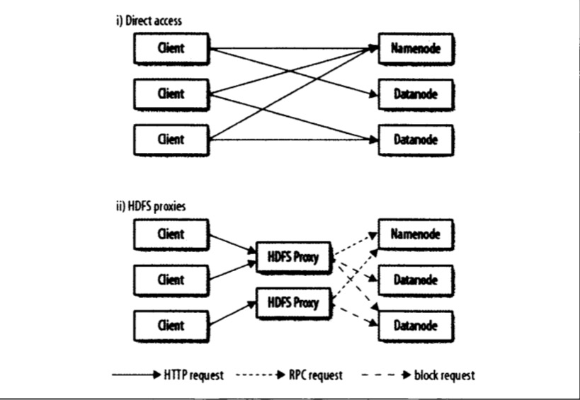
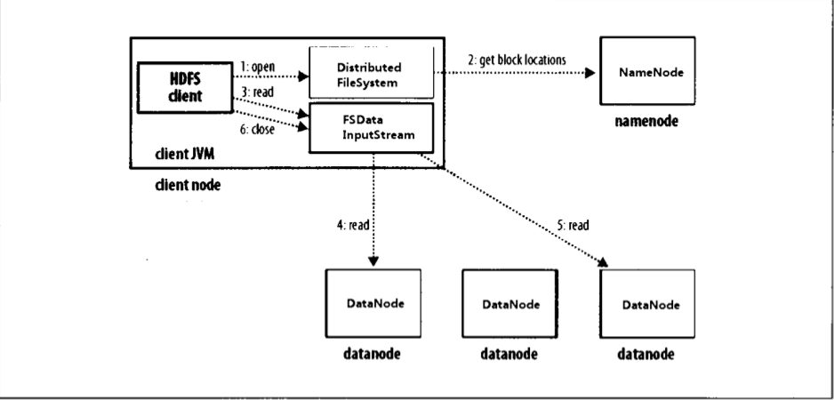
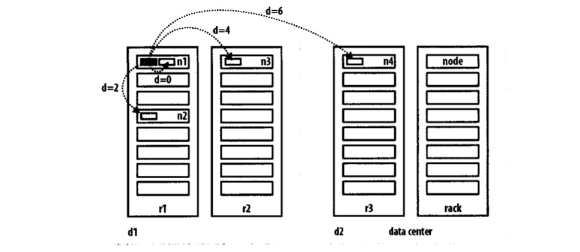

# 第三章 Hadoop分布式文件系统

当数据集大小超过一台独立的物理机器的存储能力时，就有必要对它进行分区（Partition）并存储在若干台单独的机器上。管理网络中跨多台计算机存储的文件系统称为分布式文件系统（distributed filesystem）。该系统架构于网络之上，因此会引入网络编程的复杂性，因此分布式文件系统比普通的磁盘文件系统更为复杂。

Hadoop的分布式文件系统称为Hadoop Distributed FileSystem，简称HDFS。

## 3.1 HDFS的设计

HDFS以流式数据访问模式来存储超大规模文件，运行与商用硬件集群上。

- **超大文件    **指的是以GB，TB，甚至PB级别的数据规模
- **流式数据访问     ** HDFS的设计思路是基于一次写入，多次读取的最高效模式。数据集通常是由数据源生成或从数据源复制迁移而来，接着长时间在数据集上进行各种分析，每次分析都会涉及大部分数据，甚至全部数据，因此读取整个数据集的时间延迟比读取第一条记录的时间延迟更为重要（我的理解是HDFS考虑整体数据加载的延迟，而业务系统关心单条数据加载的效率）。
- **商用硬件    **Hadoop并不需要运行在昂贵且高可靠的硬件上，HDFS具有High Avaliable，遇到故障时，能够继续运行且不会被用户察觉。
- **低时间延迟访问数据     **要求低时间延迟数据访问的应用，不适合在HDFS上运行。HDFS是为了高数据吞吐，高时间延迟应用优化的。目前，对于低时间延迟的应用可以使用**HBase**。
- **大量的小文件    ** 由于nameNode将文件系统元数据存储在内存，因此HDFS文件存储能力受限于nameNode的内存容量。根据经验，每个文件，目录和数据块的存储信息大约占150字节。假设存储100万个文件，每个文件占一个数据块，那么至少需要300MB内存，存储数亿文件就超出了当前硬件的能力。
- **多用户写入，任意修改文件    **HDFS中的文件可能只有一个Writer，而且写操作总是将数据添加在文件末尾。**HDFS不支持具有多个写入着的写入操作，也不支持文件的任意位置修改操作。**

## 3.2 HDFS的概念

### 3.2.1 数据块Block

每个磁盘都会有默认的数据块大小，这是磁盘进行数据读/写的最小单位，构建与单个磁盘之上的文件系统通过磁盘块来管理该文件系统中的块，文件系统的大小可以是块的整数倍。磁盘块大小一般是512字节。

HDFS也有**Block块**的概念，默认128MB（老版本是64MB），与单一文件磁盘相似，HDFS上的文件被划为多个块（chunk）作为独立存储单元，但与其他文件系统不同的是，HDFS中的一个块大小的文件不会占据整个块的空间。

​												**Tips  HDFS中的块为什么这么大**

HDFS中的文件块比磁盘块大，其目的是为了最小化寻址开销，如果块设置的足够大，从磁盘传输文件的文件会明显大于大于定位这个块所需要的时间。因此，传输一个由多个块组成的HDFS文件时间取决去磁盘传输速率。这种做法改变了文件传输效率的瓶颈。

如果寻址时间是10ms，传输速率为100MB/s，为了使寻址时间仅占传输时间的1%，需要将块的大小设置为100MB，随着磁盘驱动器传输速率的提升，块的大小会被设置成更大。但是不能设置过大，Hadoop MapReduce中的Map任务通常只处理一个块中的数据，因此如果任务太少，会影响作业的运行速度。

HDFS对文件块抽象的优点：

- 一个文件的大小可以大于Hadoop集群中任意一个磁盘的容量，同一文件的文件块并不需要存储在一个磁盘上，可以利用集群的任意磁盘进行存储。
- 简化了分布式文件系统的存储系统子设计，存储子系统控制单元为HDFS文件块，块的大小固定，计算单个磁盘能够存储多少个块很容易。
- 将文件权限信息，存储位置等元数据与文件实际数据块解耦，文件元数据与文件不必一起存储，可以使用其他系统管理元数据。
- HDFS文件块适用于数据备份，进而提供数据容错能力和提高可用性，HDFS高可用的原因之一。将每个块复制多个副本（默认3个）到集群中其他机器，可以确保在块、磁盘或机器发生故障后数据不会丢失。一个因损坏或机器故障而丢失的块，可以从其他副本存储地址复制到另一台机器，保证副本数量保持完整性。

与磁盘文件系统相似，Hadoop文件系统fsck指令可以显示块信息。

```sh
hadoop fsck / -files -blocks
```

### 3.2.2 namenode和datanode

HDFS集群有两类节点以管理者-工作者模式运行，即一个namenode（管理者）和多个datanode（工作者）。

- **namenode**管理文件系统的命名空间，维护文件系统树和树内所有的文件和目录。这些信息以两个文件形式永久保存在本地磁盘上：**命名空间镜像文件和编辑日志文件**。datanode也会记录每个文件中各个块所在数据节点信息，但它不会永久存储，这些信息会在系统启动时由数据节点重建。
- **客户端（Client）**代表用户通过namenode和datanode交互来访问整个文件系统。客户端提供一个类似于POSIX（可移植操作系统界面）的文件系统接口，因此用户无需知道namenode和datanode也可以操作文件系统。
- **datanode**是文件系统的工作节点，根据需要存储并检索数据块，受客户端与namenode调度，并且定期向namenode发送存储的块的列表。

没有namenode文件系统将无法使用，如果namenode服务的机器故障或namenode信息损坏，这个文件系统的文件将丢失（namenode存储元数据，我们不知道如何根据datanode的块重建文件）。对namenode块实现容错非常重要，Hadoop提供两种机制：

1. 第一种机制：**备份元数据持久状态的文件**。Hadoop可以通过配置使namenode在多个文件系统上保存元数据的持久状态。这些写入操作是同步的原子操作。一般配置是，将持久状态写入本地磁盘的同时，写入一个远程挂载的网络文件系统（NFS）。
2. 第二种机制：**运行备份namenode**。备份namenode不能被用作namenode，主要是定期通过编辑日志合并命名空间镜像文件，以防止编辑日志过大。备份namenode一般在另一台机器上，因为需要占用大量的CPU时间和磁盘执行合并操作。在主namenode出现故障时，启用备份namenode，但是编辑日志与命名空间文件同步总会有延迟，解决方法是：**把存储在NFS上的namenode元数据复制到备份namenode，并作为主namenode运行。**

### 3.2.3 联邦HDFS

namenode在内存中保存文件系统中每个文件和每个数据块的引用关系，对于保存大量文件的超大HDFS集群来说，内存成为限制集群横向扩展的瓶颈。Hadoop 2X版本引入联邦HDFS的概念，通过添加namenode实现扩展，每个namenode管理文件系统命名空间的一部分，例如：namenode A管理/user下所有文件的命名空间，namenode B管理/share下所有文件的命名空间。

每个namenode管理一个独立的命名空间卷（namespace volume）包括**命名空间的源数据和该命名中间下的所有文件的所有数据块的数据块池。**命名空间卷之间相互独立，两两不相互通信。数据块池不再切分，因此集群中的datanode需要注册到每个namenode。

### 3.2.4 HDFS高可用性

通过联合使用在多个文件系统中备份namenode的元数据和备份namenode创建监测点防止数据丢失，依旧无法实现文件系统的高可用性。namenode还是存在单点失效问题（SPOF）。

假设主namenode失效，系统运维人员需要启动一个拥有文件系统元数据副本的新namenode，配置datanode和客户端使用新namenode。新namenode需要满足以下情形才能重新相应服务：

- 将命名空间镜像导入内存汇总；
- 重新编辑日志；
- 收到足够多的datanode的数据块退出安全模式；

对于一个大型Hadoop集群，namenode冷启动大约需要30min，系统恢复时间太长。针对上述问题Hadoop 2.X版本在HDFS中增加了对HA的支持，当主namenode失效，备用namenode就会接管它的任务，不会有明显中断。Hadoop 2.X版本架构上有以下修改：

- namenode之间需要通过高可用的共享存储实现（NFS，基于Zookeeper的BookKeeper），当备用namenode接管工作后，会通读共享编辑日志直至末尾，并继续读取由活动namenode写入的新条目；
- datanode需要同时向两个namenode发送数据块处理报告，因为数据块的映射信息存储在namenode内存中；
- 客户端需要使用特定的机制处理namenode失效问题；

在主namenode失效后，备用namenode能够快速（几十秒）实现任务接管，因为最新的状态存储在内存中：包括最新的编辑日志条目和最新的数据块映射信息。

**故障切换与规避**

管理主/备namenode故障切换的管理器被称为故障转移器（failover controller），故障转移器是可插拔的，最初的实现是基于Zookeeper。每一个namenode运行一个轻量级的故障转移器，通过心跳检测监督宿主namenode是否失效，并在失效时，进行故障切换。

故障切换时分为平稳故障转移和非平稳故障转移两种情况。非平稳故障转移的情况下，无法确切知道知道失效namenode是否已经停止运行，例如：网速非常慢的情况下，心跳检验超时。为此HA机制做了进一步优化，确保之前活动的namenode不会执行危害系统并导致系统崩块的操作——称为“规避”(fencing)。规避机制包括：kill 之前namenode进程；收回共享存储目录权限；屏蔽网络端口等。

客户端故障切换通过客户端类库实现透明处理，最简单的实现是通过客户端的配置文件实现故障切换控制。HDFS URI使用一个逻辑主机名（配置Host），逻辑主机名映射到一个namenode地址，客户端会访问每个namenode类库。

## 3.3 命令行接口

搭建Hadoop伪分布式环境时，有两个配置：

- fs.default.name，用于设置Hadoop的默认文件系统，使用hdfs://localhost/设置HDFS为Hadoop默认文件系统，HDFS的守护程序通过该属性项来确定HDFS namenode的主机和端口，将在localhost的默认端口8020运行namenode。
-  Dis.replications：用于设计数据块副本的数量；伪分布式下可以设置为1，默认为3。

**HDFS中的文件访问权限**

针对文件和目录，HDFS的权限模式和POSIX非常相似。一共提供三类权限模式：只读权限（r），写入权限（w）和可执行权限（x）。写入、删除文件或删除、新建目录需要写入权限。可执行权限可以忽略，因为不能在HDFS中执行文件。

每个文件和目录都有所属用户（owner）、所属组别（group）以及模式（mode）。模式是由所属用户权限、组内成员的权限、以及其他用户权限组成。

![]

文件权限是否开启通过dfs.permissions.enabled属性来控制，这个属性默认为false，没有打开安全限制，因此不会对客户端做授权校验，如果开启安全限制，会对操作文件的用户做权限校验。特殊用户superuser是Namenode进程的标识，不会针对该用户做权限校验。

## 3.4 Hadoop文件系统

Hadoop有一个抽象的文件系统概念，HDFS只是其中的一种实现。Hadoop提供的实现如下表：

| 文件系统    | URI方案 | Java实现                       | 描述                                                         |
| ----------- | ------- | ------------------------------ | ------------------------------------------------------------ |
| Local       | file    | fs.LocalFileSystem             | 使用了客户端校验和本地磁盘文件系统                           |
| HDFS        | hdfs    | fdfs.DistributedFileSystem     | Hadoop的分布式文件系统                                       |
| HFTP        | Hftp    | fdfs.hftpFileSystem            | 在Http上提供对HDFS只读访问的文件系统                         |
| HSFTP       | hsftp   | hdfs.HsftpFileSystem           | 在HTTPS上提供对HDFS只读访问的文件系统                        |
| webHDFS     | webhdfs | hdfs.web.WebHDFSFileSystem     | 基于HTTp，对HDFS提供安全读写访问的文件系统，为了替代HFTP和HSFTP |
| HAR         | har     | fs.HarFileSystem               | 一个构建在其他文件系统之上用于文件存档的文件系统。Hadoop存档文件系统通常用于需要将HDFS中的文件进行存档时，以减少namenode内存的使用 |
| hfs(云存储) | kfs     | fs.kgs.kosmosFileSystem        | CloudStore是类似于HDFS或是谷歌的GFS文件系统                  |
| FTP         | ftp     | fs.ftp.FTPFileSystem           | 由FTP服务器支持的文件系统                                    |
| s3(原生)    | s3n     | fs.s3native.NativeS3FileSystem | 由Amazon S3支持的文件系统                                    |
| s3(基于块)  | s3      | fs.sa.S3FileSystem             | 由Amazon S3支持的文件系统，以块格式存储文件以解决S3的5GB文件大小限制 |
| 分布式RAID  | hdfs    | fdfs.DistributedRaidFileSystem | RAID版本的HDFS是为了存档而设计的，针对HDFS中每个文件创建一个校验文件，HDFS文件副本数目变为2，减少25%～30%的存储空间，数据丢失的概率不变。 |

Hadoop对文件系统提供了很多接口，一般使用URI方案来选取合适的文件系统实例进行交互。例：要想列出本地文件系统根目录下的文件，输入命令：　　

```sh
hadoop fs -ls file://
```

**接口**

Hadoop是用JAVA开发的，所以大多数的Hadoop文件系统交互都是以JAVA API作为中间沟通的桥梁。例如文件系统shell就是一个JAVA应用程序，使用JAVA类FileSystem来操作文件。其他的一些文件系统接口会在下面介绍，这些接口通常会与HDFS一同使用，因为Hadoop中其他文件系统一般都有访问基本文件系统的客户端，例如：FTP客户端，S3工具等，大多数都能用户Hadoop文件系统。

#### 1.HTTP

通过HTTP访问HDFS有两种方法：直接访问，HDFS后台进程直接服务于来自客户端的请求；通过代理（一个对多个）访问。客户端通常通常使用DisruributedFIleSystem API访问HDFS。



​								**图3-1 通过HTTP直接访问HDFS或者多个HDFS访问HDFS**

在第一种情况，由namenode内嵌的web服务器（端口：50070）上提供目录服务，目录列表以XML或者JSON格式存储，文件数据由datanode的web服务器（运行在端口：50075）以数据流的形式传输。

第二种方法依靠一个或多个代理服务器通过HTTP访问HDFS。由于代理服务器是无状态的，因此可以运行在标准的负载均衡服务器之后。使用代理服务器后，可以使用更严格的防火墙和带宽限制策略。通常情况下使用代理服务器，实现在不同数据中心部署的Hadoop集群之间的数据传输。

从1.0.0版本实现了一个HttpFS的代理服务器（具备读和写的能力），并且提供了和WebHDFS一样的HTTP接口，因此客户端可以通过webhdfs URI发膜很微妙这两类接口。

**3.FUSE**

用户空间文件系统（FileSystem in Userspace，FUSE）允许把按照用户空间实现的文件系统整合成一个Unix文件系统，通过使用Hadoop的FUSE-DFS功能模块，任何HDFS文件系统可以作为一个标准的文件系统进行挂载，随后便可以使用Unix工具，如ls，cat与文件系统交互。

## 3.5 Java接口

本节深入研究Hadoop的FileSystem类：它是与Hadoop的某个文件系统进行交互的API。

### 3.5.1 从Hadoop URI读取数据

从Hadoop文件系统读取文件最简单的方法是使用java.net.URL对象打开数据流，从中读取数据。为了让Java程序能够识别到Hadoop的hdfs URL，需要通过FsUrlStreamHandlerFactory实例调用ava.net.URL对象的setURLStreamHandlerFactory方法。每个Java虚拟机只能调用一次这个方法，因此通常在**静态方法**中调用。代码示例如下：

```java
static {
        URL.setURLStreamHandlerFactory(new FsUrlStreamHandlerFactory());
    }

    public static void main(String[] args){
        String filePath = args[0];
        InputStream in = null;
        try {
            in = new URL(filePath).openStream();
            IOUtils.copyBytes(in,System.out, 4096, false);
        } catch (MalformedURLException e) {
            e.printStackTrace();
        } catch (IOException e) {
            e.printStackTrace();
        }finally {
            IOUtils.closeStream(in);
        }
    }
```

注意：java.net.URL对象的setURLStreamHandlerFactory方法。每个Java虚拟机只能调用一次这个方法。如果其他第三方组件中，使用了FsUrlStreamHandlerFactory就会失效。

### 3.5.2  通过FileSystem API读取

上节的读取方法限制性很强，因此推荐使用FIleSystem API来打开一个文件的输入流。

Hadoop文件系统通过Hadoop Path对象来代表文件。可以将HDFS文件文件路径视为一个Hadoop文件系统URI。FileSystem是一个通用文件系统的APi，这里我们使用HDFS。获取FileSystem实例有以下几个静态方法：

```java
public static FileSystem get(Configuration conf) throws IOException
  
public static FileSystem get(URI uri, Configuration conf) throws IOException

public static FileSystem get(URI uri, Configuration conf, String user) throws IOException  
```

Configuration 对象封装了客户端或者服务器的配置，通过配置文件读取类路径来实现（如conf/core-site.xml）。

FileSystem调用open( )函数来获取文件的输入流。

```java
public static void main(String args[]){
        Configuration conf = new Configuration();
        String url = args[0];
        InputStream in = null;
        try {
            FileSystem fs = FileSystem.get(URI.create(url),conf);
            in = fs.open(new Path(url));
            IOUtils.copyBytes(in, System.out, 4096, false);
        } catch (IOException e) {
            e.printStackTrace();
        }finally {
            IOUtils.closeStream(in);
        }
    }
```

**FSDataInput对象**

FileSystem的open方法返回的是FSDataInputStream对象，继承java.io.DataInputStream接口，并支持随机访问，由此可以从流的任意位置访问数据。

```java
public class FSDataInputStream extends DataInputStream
    implements Seekable, PositionedReadable, 
      ByteBufferReadable, HasFileDescriptor, CanSetDropBehind, CanSetReadahead,
      HasEnhancedByteBufferAccess, CanUnbuffer {
```

seekable接口支持在文件中找到指定位置，并提供一个查询当前位置相对于文件起始位置偏移量（getPos）的查询方法。

```java
public interface Seekable {
  /**
   * Seek to the given offset from the start of the file.
   * The next read() will be from that location.  Can't
   * seek past the end of the file.
   */
  void seek(long pos) throws IOException;
  
  /**
   * Return the current offset from the start of the file
   */
  long getPos() throws IOException;

  /**
   * Seeks a different copy of the data.  Returns true if 
   * found a new source, false otherwise.
   */
  @InterfaceAudience.Private
  boolean seekToNewSource(long targetPos) throws IOException;
}
```

使用seek( )方法，将Hadoop文件系统中的文件读取两次：

```java
    public static void main(String args[]){
        Configuration conf = new Configuration();
        String url = args[0];
        FSDataInputStream in = null;
        try {
            FileSystem fs = FileSystem.get(URI.create(url),conf);
            in = fs.open(new Path(url));
            IOUtils.copyBytes(in, System.out, 4096, false);
            in.seek(0);
            IOUtils.copyBytes(in, System.out, 4096, false);
        } catch (IOException e) {
            e.printStackTrace();
        }finally {
            IOUtils.closeStream(in);
        }
    }
```

**Tips**

seek()方法是一个相对高开销的操作，需要谨慎使用，建议使用流数据来构建应用的访问模式（如使用MapReduce），而非执行大量seek方法。

### 3.5.3 写入数据

FileSystem类有一系列新建文件的方法。

- create方法，create方法有多个重栽版本，允许我们指定是否需要强制覆盖现有文件、文件备份数量、写入文件缓冲区大小、文件块大小以及权限。

	```java
	/**
	   * Create an FSDataOutputStream at the indicated Path.
	   * Files are overwritten by default.
	   * @param f the file to create
	   */
	  public FSDataOutputStream create(Path f) throws IOException {
	    return create(f, true);
	  }
	  
	  /**
	   * Create an FSDataOutputStream at the indicated Path.
	   * @param f the file to create
	   * @param overwrite if a file with this name already exists, then if true,
	   *   the file will be overwritten, and if false an exception will be thrown.
	   */
	  public FSDataOutputStream create(Path f, boolean overwrite)
	      throws IOException {
	    return create(f, overwrite, 
	                  getConf().getInt("io.file.buffer.size", 4096),
	                  getDefaultReplication(f),
	                  getDefaultBlockSize(f));
	  }
	
	/**
	   * Create an FSDataOutputStream at the indicated Path.
	   * Files are overwritten by default.
	   * @param f the file to create
	   * @param replication the replication factor
	   */
	  public FSDataOutputStream create(Path f, short replication)
	      throws IOException {
	    return create(f, true, 
	                  getConf().getInt("io.file.buffer.size", 4096),
	                  replication,
	                  getDefaultBlockSize(f));
	  }
	
	public FSDataOutputStream create(Path f,
	                                            boolean overwrite,
	                                            int bufferSize,
	                                            short replication,
	                                            long blockSize,
	                                            Progressable progress
	                                            ) throws IOException {
	    return this.create(f, FsPermission.getFileDefault().applyUMask(
	        FsPermission.getUMask(getConf())), overwrite, bufferSize,
	        replication, blockSize, progress);
	  }
	```

	Progressable progress用于传递回调接口，可以把数据写入datanode的进度通知给应用。每次Hadoop、调用progress方法时，就是每次将64KB数据写入datanode管线后。

- append方法在一个已有文件末尾追加数据。

	```java
	/**
	   * Append to an existing file (optional operation).
	   * @param f the existing file to be appended.
	   * @param bufferSize the size of the buffer to be used.
	   * @param progress for reporting progress if it is not null.
	   * @throws IOException
	   */
	  public abstract FSDataOutputStream append(Path f, int bufferSize,
	      Progressable progress) throws IOException;
	```

将本地文件复制到Hadoop文件系统实例：

```java
public static void main(String[] args) throws Exception {
        String localdir = args[0];
        String dst = args[1];
        InputStream in = new BufferedInputStream(new FileInputStream(localdir));
        Configuration configuration = new Configuration();
        FileSystem fs = FileSystem.get(URI.create(dst), configuration);
        OutputStream outputStream = fs.create(new Path(dst), new Progressable() {
            @Override
            public void progress() {
                System.out.println(new Date());
            }
        });
        IOUtils.copyBytes(in, System.out, 4096, true);
    }
```

**FSDataOutputStream**

FileSystem的create方法返回FSDataOutputStream对象，与FSDataInputStream相似，也有查询文件当前位置的方法：

```java
public long getPos() throws IOException {
      return position;                            // return cached position
    }
```

与FSDataInputStream不同的是，FSDataOutputStream类不允许在文件中定位，因为HDFS只允许对一个已打开的文件顺序写入，或在文件末尾追加数据，即**不支持在文件任意位置写入数据**。

### 3.5.4 目录

FileSystem提供mkdirs方法创建目录：

```java
  /**
   * Make the given file and all non-existent parents into
   * directories. Has the semantics of Unix 'mkdir -p'.
   * Existence of the directory hierarchy is not an error.
   * @param f path to create
   * @param permission to apply to f
   */
  public abstract boolean mkdirs(Path f, FsPermission permission
      ) throws IOException;
```

通常不需要显式的创建目录，因为调用create方法写入文件时会自动创建父目录。

### 3.5.5 查询文件系统

#### 1. 文件元数据：FileStatus

任何一个文件系统中的重要特征都是提供其目录结构浏览和检索它所在的文件和目录相关信息的功能。FileStatus类封装了文件系统中文件和目录的元数据，包括文件长度、块大小、副本、修改时间、所有者以及权限信息。

FileSystem的getFileStatus方法用于获取文件或目录的FileStatus对象，如例3-5所示：

```java
 public static void main(String[] args) throws IOException {
        String uri = args[0];
        Configuration configuration = new Configuration();
        FileSystem fs = FileSystem.get(URI.create(uri), configuration);
        FileStatus fileStatus = fs.getFileStatus(new Path(uri));
        // 获取文件长度
        System.out.println(fileStatus.getLen());
        System.out.println(fileStatus.getPath());
        // 获取复制的副本数量
        System.out.println(fileStatus.getReplication());
        // 最后更改时间
        System.out.println(fileStatus.getModificationTime());
        // BlockSize
        System.out.println(fileStatus.getBlockSize());
        System.out.println(fileStatus.getOwner());
        System.out.println(fileStatus.getGroup());
    }
```

如果文件目录均不存在，会抛出FileNotFoundException异常。

#### 2. 列出文件

在实际应用中，我们通常需要列出目录中的文件内容。在Hadoop使用FileSystem的lisSatus( )实现。具体方法功能如下：

```java
/**
   * Filter files/directories in the given list of paths using default
   * path filter.
   * 
   * @param files
   *          a list of paths
   * @return a list of statuses for the files under the given paths after
   *         applying the filter default Path filter
   * @throws FileNotFoundException when the path does not exist;
   *         IOException see specific implementation
   */
  public FileStatus[] listStatus(Path[] files)
      throws FileNotFoundException, IOException {
    return listStatus(files, DEFAULT_FILTER);
  }
  
  /**
   * Filter files/directories in the given list of paths using user-supplied
   * path filter.
   * 
   * @param files
   *          a list of paths
   * @param filter
   *          the user-supplied path filter
   * @return a list of statuses for the files under the given paths after
   *         applying the filter
   * @throws FileNotFoundException when the path does not exist;
   *         IOException see specific implementation
   */
  public FileStatus[] listStatus(Path[] files, PathFilter filter)
      throws FileNotFoundException, IOException {
    ArrayList<FileStatus> results = new ArrayList<FileStatus>();
    for (int i = 0; i < files.length; i++) {
      listStatus(results, files[i], filter);
    }
    return results.toArray(new FileStatus[results.size()]);
  }
  
  /**
   * List the statuses of the files/directories in the given path if the path is
   * a directory.
   * 
   * @param f given path
   * @return the statuses of the files/directories in the given patch
   * @throws FileNotFoundException when the path does not exist;
   *         IOException see specific implementation
   */
  public abstract FileStatus[] listStatus(Path f) throws FileNotFoundException, 
                                                         IOException;
   
   /**
   * Filter files/directories in the given path using the user-supplied path
   * filter.
   * 
   * @param f
   *          a path name
   * @param filter
   *          the user-supplied path filter
   * @return an array of FileStatus objects for the files under the given path
   *         after applying the filter
   * @throws FileNotFoundException when the path does not exist;
   *         IOException see specific implementation   
   */
  public FileStatus[] listStatus(Path f, PathFilter filter) 
                                   throws FileNotFoundException, IOException {
    ArrayList<FileStatus> results = new ArrayList<FileStatus>();
    listStatus(results, f, filter);
    return results.toArray(new FileStatus[results.size()]);
  }
  
```

当入参是一个文件时，会返回长度为1的FileStatus对象数组；当入参是一个目录时，会返回0或者多个FileStatus对象，表示此目录包含的文件和目录，其执行结果相当于依次轮流传递每条路径对其调用listStatus( )方法。

它的重载方法允许使用PathFilter对象来限制匹配的文件和目录。FileUtil中的stat2Paths( )方法，将FileStatus对象数组转换为Path对象数组。

```java
public static void main(String[] args) throws IOException {
        String uri = args[0];
        Configuration configuration = new Configuration();
        FileSystem fs = FileSystem.get(URI.create(uri), configuration);
        Path[] paths = new Path[args.length];
        for (int i = 0; i < paths.length; i++) {
            paths[i] = new Path(args[i]);
        }
        FileStatus[] statuses = fs.listStatus(paths);
        Path[] pathsTransform = FileUtil.stat2Paths(statuses);
        for (Path p : pathsTransform){
            System.out.println(p.getName());
        }
    }
```

#### 3. 文件模式

在单个操作中处理一批文件是一个常见需求，例如：处理日志的MapReduce作业中可能需要分析大量目录中的文件。在一个表达式中使用通配符来匹配多个文件是比较方便的，无需列举每个文件和目录作为指定输入，该操作称为**通配（globbing）**。Hadoop执行通配的方法如下：

```java
public FileStatus[] globStatus(Path pathPattern) throws IOException {
    return new Globber(this, pathPattern, DEFAULT_FILTER).glob();
  }
  
/**
   * Return an array of FileStatus objects whose path names match pathPattern
   * and is accepted by the user-supplied path filter. Results are sorted by
   * their path names.
   * Return null if pathPattern has no glob and the path does not exist.
   * Return an empty array if pathPattern has a glob and no path matches it. 
   * 
   * @param pathPattern
   *          a regular expression specifying the path pattern
   * @param filter
   *          a user-supplied path filter
   * @return an array of FileStatus objects
   * @throws IOException if any I/O error occurs when fetching file status
   */
  public FileStatus[] globStatus(Path pathPattern, PathFilter filter)
      throws IOException {
    return new Globber(this, pathPattern, filter).glob();
  }  
```

globStatus( )的方法返回与其路径匹配于指定模式的所有文件的FIleStatus对象数组，并按路径排序。PathFilter可以进一步对匹配结果限制。

Hadoop支持的通配符与Unix bash相同，如表3-2所示

| 通配符  | 名称       | 匹配                                       |
| ------- | ---------- | ------------------------------------------ |
| *       | 星号       | 匹配0个或多个字符                          |
| ？      |            | 匹配单一字符                               |
| [ab]    | 字符类     | 匹配{a, b}集合中的一个字符                 |
| [^ ab]  | 非字符类   | 匹配非{a, b}集合中的一个字符               |
| [a-b]   | 字符范围   | 匹配一个在{a, b}范围内的字符（包括a，b）   |
| [^ a-b] | 非字符范围 | 匹配一个不在{a, b}范围内的字符（包括a，b） |
| {a, b}  | 或         | 匹配a或b中的一个表达式                     |
| \c      | 转义字符   | 匹配元字符c                                |

#### 4. PathFilter对象

通配符模式并不总能精确地描述想要访问的文件集，FileSystem中的listStatus( )方法和globStatus( )方法提供可选择的PathFilter对象，以编程的方式控制通配符：

```java
public interface PathFilter {
  /**
   * Tests whether or not the specified abstract pathname should be
   * included in a pathname list.
   *
   * @param  path  The abstract pathname to be tested
   * @return  <code>true</code> if and only if <code>pathname</code>
   *          should be included
   */
  boolean accept(Path path);
}
```

PathFilter与java.io.PathFilter一样，入参是Path对象。示例如3-7所示：

```java
public class RegexExcludePathFilter implements PathFilter {
    
    private final String regex;

    public RegexExcludePathFilter(String regex) {
        this.regex = regex;
    }

    @Override
    public boolean accept(Path path) {
        return !path.toString().matches(regex);
    }
}
```

过滤器由Path表示，只能作用于文件名，不能针对文件的属性。

### 3.5.6 删除文件

使用FileSystem的delete( )方法可以永久删除文件或目录。

```java
/** Delete a file.
   *
   * @param f the path to delete.
   * @param recursive if path is a directory and set to 
   * true, the directory is deleted else throws an exception. In
   * case of a file the recursive can be set to either true or false. 
   * @return  true if delete is successful else false. 
   * @throws IOException
   */
  public abstract boolean delete(Path f, boolean recursive) throws IOException;
```

如果f是一个文件或空目录，那么recursive会被忽略，只有在recursive为true，且f为非空目录时，f下的目录与文件会被递归删除。注意：recursive默认为true，为了防止文件背递归删除，最好将其赋值为false。

## 3.6 数据流

### 3.6.1 剖析文件读取

客户端、HDFS、namenode、datanode之间数据流在文件读取时，事件发生顺序如下所示：



​													**图3-2 客户端读取HDFS数据**

1. 客户端通过调用FileSystem对象的open( )方法打开文件，对于HDFS来说这个文件是DIstributedFileSystem。
2. DistributedFileSystem对象通过RPC来调用namenode，以确定文件起始块的位置。对于每一个块，namenode返回存有该块副本的datanode地址。此外，这些datanode根据它们与客户端的距离来排序（根据集群的网络拓扑），如果客户端本身就是一个datanode（比如：在一个MapReduce任务中），并存有相应数据块的副本，该节点就会从本地datanode读取数据。
3. DistributedFileSystem类返回一个FSDataInputStream对象（支持文件定位的输入流）给客户端并读取数据，FSDataInputStream类转而封装DFSInputStream对象，该对象管理着Datanode和namenode的IO。客户端对DistributedFileSystem调用read方法，存储着文件起始几个块的datanode地址的DFSInputStream随即连接距离最近的datanode。
4. 通过对数据流反复调用read( )方法，可以将数据从datanode传输到客户端。到达块末端时，DFSInputStream会关闭与该datanode的连接；
5. 寻找下一个最佳的datanode，读取数据；客户端从流中读取数据时，块是按照打开DFSInputStream与datanode新建连接的顺序读取的，它也会根据需要询问namenode来检索下一批数据块的datanode的位置。
6. 读取完成，对FSDataInputStream调用close方法。

在读取数据时，如果DFSInputStream在与datanode通信时遇到错误，会尝试从这个块的另外一个最邻近datanode读取数据，也会记住故障datanode，保证以后不会反复读取该节点上的后续块。DFInputStream也会通过校验和确认从datanode发来数据是否完成，如果发现损坏块，DFSInputStream会试图从其他datanode读取其副本之前通知namenode。

这样设计的**重点是**：namenode告知客户端每个块中最佳的datanode，并让客户端直接连到该datanode检索数据，能使HDFS可扩展到大量的并发客户端，同时，namenode只需要相应块位置的请求，由于数据块信息均存储在内存中，因此相应高效。

**网络拓扑与Hadoop**

在海量数据处理中，其主要限制因素是节点之间数据的传输速率（带宽是稀缺资源），理想情况下，将两个节点之间的带宽作为距离的衡量标准。

实际情况中，很难衡量两个节点之间的带宽，Hadoop为此采用一个简单的方法：把网络看作一棵树，两个节点之间的距离是它们到最近共同祖先的距离总和。树的层次是没有预先设定的，但是相对于数据中心、机架和正在运行的节点可以设定优先级，具体想法是针对以下每个场景，可用带宽依次递减：

- 同一节点的进程；
- 同一机架的不同节点；
- 同一数据中心不同机架上的节点；
- 不同数据中心的节点

例如：假设数据中心为$d_1$，机架$r_1$中的节点$n_1$，该节点可以表示为：$/d_1/r_1/n_1$。数据中心为$d_1$。

同一机架$r_1$中的节点$n_2$与$n_1$的距离为:
$$
distance(/d_1/r_1/n_1, /d_1/r_1/n_2) = 0
$$
同一机架的不同节点：
$$
distance(/d_1/r_1/n_1, /d_1/r_2/n_2) = 2
$$
同一数据中心不同机架的节点：
$$
distance(/d_1/r_1/n_1, /d_1/r_2/n_2) = 4
$$
不同数据中心的节点：
$$
distance(/d_1/r_1/n_1, /d_2/r_2/n_2) = 4
$$
Hadoop无法自定义网络拓扑结构，需要用户理解并自定义，会在后续9.1.1的“网络拓扑”中详细介绍定义。

 

​													**图3-3 Hadoop中的网络距离**

