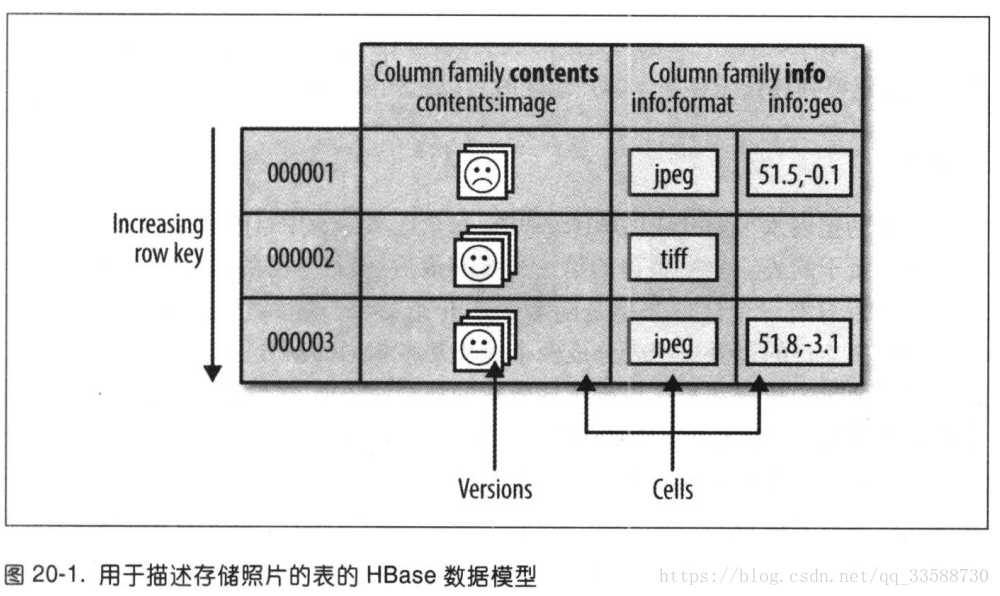

# 第二十章 关于HBase

## 20.1 HBase基础

HBase是一个在HDFS上开发的面向列的分布式数据库。如果需要实时地随机访问超大规模数据集，就可以使用HBase这一Hadoop应用。

虽然数据库存储和检索的实现是可以选择很多不同的策略，但是绝大多数解决办法，特别是关系型数据库技术的变种，不是为大规模可伸缩的分布式处理设计的，很多厂商提供了复制(replication)和分区(partitioning)解决方案，让数据库能够从单个节点上扩展出去(例如：MySQL的主从复制技术)，但是这些附加技术大多属于"事后"的解决方法，而且非常难以安装和维护，并且这些解决方法常常需要牺牲一些重要的RDBMS特性，在一个“扩展的”RDBMS上，连接、复杂查询、触发器、视图以及外键约束这些功能要么运行开销大，要么根本无法使用。

HBase从另一个方面来解决可伸缩性问题。它自底向上地进行构建，能够简单地通过增加节点来达到线性扩展。HBase并不是关系型数据库，它不支持SQL。在特定的问题空间，它能能够做RDBMS不能做的事：在廉价硬件构成的集群上管理超大规模的稀疏表。

HBase的一个典型应用事webtable，一个以网页URL为主键的表，其中包含爬取的页面和页面属性(例如语言和MIME类型)。webtable非常大，行数可以达到十亿级之级。在webtable上连续运行用于批处理分析和解析的MapReduce作业，能够获取相关的统计信息，增加验证的MIME类型列以提供搜索引擎进行索引的解析后的文本内容。同时，表格还会被以不同运行速度的爬取器随机访问，并随机更新其中的行，在用户点击访问网站的缓存页面时，需要实时地将这些被随机访问的页面提供给他们。

## 20.2 概念

### 20.2.1 数据模型的“旋风之旅”

应用把数据存放在带标签的表中。表由行和列组成。表格的单元格由行和列的坐标交叉决定，是有版本的。默认情况下，版本号是自动分配，为HBase插入单元格的时间戳，单元格内容是未解释的字节数组。例如：图20-1所示为用于存储照片的HBase表。

表中行的键也是字节数组。所以理论上，任何数据都可以通过表示为字符串或将二进制形式转化为长整型或直接对数据结构进行序列化，来作为键值。表中的行根据行的键值(也就是表的主键)进行排序。排序根据字节序进行，对所有表的访问都需要通过主键。

------

HBase不支持表中的其他列建立索引(也称为辅助索引)。不过，有几种策略可用于支持辅助索引提供的查询类型，每种策略在存储空间、处理负载和查询执行时间之间存在不同的利弊权衡。

------

行中的列被分成 **列族(column family)**。同一个列族的所有成员具有相同的前缀。因此，像列info:format和info:geo都是列族info的成员。而contents:image则是属于contens族。列族的前缀必须由 **可打印(printable)**字符组成。而修饰性的结尾字符，即列族修饰符，可以为任意字节。列族和修饰符之间始终以冒号(:)分隔。

一个表的列族必须作为表模式定义的一部分预先给出，但是新的列族成员可以随时按需要加入。例如：只要目标表中已经有了列族info，那么客户端就可以在更新时提供新的列info:camera，并存储它的值。

物理上，所有的列族都一起存放在文件系统中。所以，虽然前面把HBase描述为一个面向列的存储器，但实际上更准确的说法是：它是一个面向列族的存储器。由于调优和存储都是在列族这个层次上进行的，所以最好使用所有列族成员都有相同的访问模式(access pattern)和大小特征。对于存储照片的表，由与图像数据比较大，因而跟较小的元数据分别存储在不同的列族中。

换而言之，HBase表和RDBMS中的表类似，只不过它的单元格有版本，行是排序的，而只要列族预先存在，客户端随时可以把列添加到列族中去。

