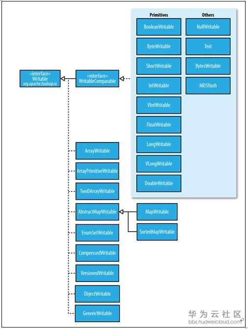
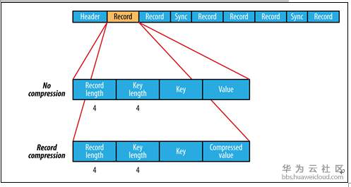
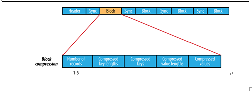
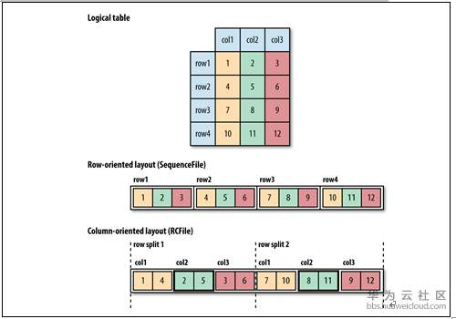

## 第五章 Hadoop的I/O操作

Hadoop自带一套原子操作用于数据I/O操作，其中有一些技术比Hadoop本身更加有用，如数据完整性和数据压缩，其他一些则是Hadoop工具或API，它们形成的模块可用于开发分布式文件系统。

## 5.1 数据完整性

检测数据是否损坏的常用方式是，在数据第一次引入系统时**计算校验和**(checkSum)并在数据通过一个不可靠通道进行传输时再次计算校验和，如果校验和不一致，则认为数据已经损坏。但该技术不能修复数据，因此应该避免使用低端硬件，具体来说，一定要使用ECC内存(应用了能够实现错误检查和纠正技术的内存条。一般多应用在服务器及图形工作站上，这将使系统在工作时更趋于安全稳定)。

常用的错误检测码是CRC-32(32位循环冗余校验)，任何大小的数据输入均计算得到一个32位的整数校验和。Hadoop的ChecksunFileSystem使用CRC-32计算校验和，HDFS使用变体CRC-32计算，

### 5.1.1 HDFS的数据完整性

HDFS会对所有写入的数据计算校验和，并在读取数据时验证校验和。HDFS针对每个由dfs.bytes-per-checksum指定字节数的数据计算校验和，默认512字节，由于CRC-32校验和是4个字节，所以校验和的额外开销低于1%。

datanode负责在收到数据后**存储该数据及其校验和**之前对数据进行验证。它在收到客户端数据或复制到其他datanode的数据时执行这个操作。正在写数据的客户端将数据及其校验和发送到一系列datanode组成的管线，管线中的最后一个datanode负责验证校验和，如果datanode检测到错误，客户端接收到一个IOException的子类，对于该异常应以应用程序特定的方式处理，比如重试这个操作。

**客户端从datanode读取数据**时，会验证校验和，将它们与datanode存储的校验和比较。每个datanode持久化保存有一个用于验证校验和日志(persistent log of checksum verification) 。客户端成功验证一个数据块后，datanode更新校验和日志，保存这些统计信息对与检测损坏的磁盘很有价值。

datanode自身运行后台线程DataBlockScanner，定期验证存储在datanode上所有数据块。该项措施是解决物理存储媒体上位损坏的有力措施。

由于HDFS存储着每个数据块的复本(replica)，因此可以通过数据复本来修复损坏数据。基本思路如下：客户端在读取数据时，验证校验和错误：

- 客户端向namenode报告已损坏数据及其正在尝试读操作的datanode，抛出ChecksumException。
- namenode将这个数据块复本标记为已损坏，不再将客户端处理请求直接发送到节点。
- Namenode安排这个数据块的一个复本复制到另一个datanode，如此一来，数据块的复本因子(replication factor)又回到期望水平，删除已损坏的数据块复本。

在使用open( )方法读取文件之前，将FileSystem对象的setVerifyChecksum( )方法设置为false，即可以禁用校验和验证。在命令解释器中使用带-get选项的-ignoreCrc命令或者使用等价的-copyToLocal命令，也可以达到相同的效果。

可以用hadoop 的命令fs –checksum来检查一个文件的校验和。这可用于在HDFS中检查两个文件是否具有相同内容，distcp命令也具有类似的功能。详情可以参见3.7节。

### 5.1.2 LocalFileSystem

Hadoop的LocalFileSystem执行客户端的校验和验证。在写入一个名为filename的文件时，文件系统客户端会明确在包含每个文件块校验和的同一目录新建一个filename.crc隐藏文件。文件块大小作为元数据存储在.crc文件中，即使数据块的大小的设置发生变化，仍然可以正确读回文件(理解：系统数据块大小设置发生改变，对于历史数据的兼容)。在**读取文件**时需要验证校验和，如果检测到错误，LocalFileSystem会抛出ChecksumException异常。

校验和的计算代价是相当低的(在Java中，它们是用本地代码实现的)，一般只是增加少许额外的读/写文件时间。对大多数应用来说，付出这样的额外开销以保证数据完整性是可以接受的。此外，可以禁用校验和，特别是底层系统本身就支持校验和，这种情况使用RawLocalFileSystem替代LocalFileSystem。要想在一个应用中实现**全局校验和验证，**需要将fs.file.impl属性设置为org.apache.hadoop.fs.RawLocalFileSystem进而实现对文件URI的重新映射。还有一个可选方案可以直接新建一个RawLocalFileSystem实例。如果想针对一些读操作禁用校验和，这个方案非常有用。示例如下：

```java
Configuration conf = ...
FileSystem fs = new RawLocalFileSystem();
fs.initialize(null, conf);
```

### 5.1.3 ChecksumFileSystem

LocalFileSystem通过ChecksumFileSystem来完成自己的任务，向其他文件系统(无校验和系统)加入校验和非常简单，因为ChecksumFileSystem类继承自FileSystem类。一般用法如下：

```java
FileSystem rawFs = ......
FileSystem checksummedFs = new ChecksumFileSystem(rawFs);
```

底层文件系统称为“源(raw)”文件系统，可以使用ChecksumFileSystem实例的getRawFileSystem( )方法获取。ChecksumFileSystem类还有其他一些与校验和有关的有用方法，比如getChecksumFile()可以获得任意一个文件的校验和文件路径。

如果ChecksumFileSystem类在读取文件时检测到错误，会调用自身reportChecksumFailure( )方法，默认实现方法为空。但LocalFileSystem类会将这个出错的文件及其校验和移到同一存储设备上一个名为*bad_files*的边际文件夹(side directory)中。管理员应该定期检查这些坏文件并采取相应的行动。

## 5.2 压缩

文件压缩有两大好处：

- 减少存储文件所需要的磁盘空间。
- 加速数据在网络和磁盘上的传输速度。

有很多种不同的压缩格式、工具和算法，它们各有千秋。表5-1列出了与Hadoop结合使用的常见压缩方法。

​															**表5-1. 压缩格式总结**

| 压缩格式 | 工具  | 算法    | 后缀名   | 是否可切分 |
| -------- | ----- | ------- | -------- | ---------- |
| DEFLATE  | 无    | DEALATE | .deflate | 否         |
| gzip     | gzip  | DEFLATE | .gz      | 否         |
| bzip2    | bzip2 | bzip2   | .bz2     | 是         |
| LZO      | lzop  | LZO     | .lzo     | 否         |
| LZ4      | 无    | LZ4     | .lz4     | 否         |
| Snappy   | 无    | Snappy  | .snappy  | 否         |

**注意：**DEFLATE是一个标准压缩算法，该算法的标准实现是zlib。没有可用于生成DEFLATE文件的常用命令行工具。因为通常都用gzip格式。注意，gzip文件格式只是在DEFLATE格式上增加了文件头和一个文件尾。.*deflate*文件扩展名是Hadoop约定的。

所有压缩算法都需要权衡空间/时间：压缩和解压缩速度更快，其代价通常是只能节省少量的空间。表5-1列出的所有压缩工具都提供9个不同的选项来控制压缩时必须考虑的权衡：选项-1为优化压缩速度，-9为优化压缩空间。例如，下述命令通过最快的压缩方法创建一个名为*file.gz*的压缩文件：

```sh
gzip -1 file
```

不同的压缩工具有不同的特性：

- gzip是一个通用的压缩工具，在空间/时间性能的权衡中，居于其他两个压缩方法之间。
- bzip2的压缩能力强于gzip，但压缩速度更慢一点。尽管bzip2的解压速度比压缩速度快，但仍比其他压缩格式要慢一些。
- LZO、LZ4和Snappy均优化压缩速度，其速度比gzip快一个数量级，但压缩效率稍逊一筹。Snappy和LZ4的解压缩速度比LZO高出很多。

表5-1中的“是否可切分”列表示对应的压缩算法是否支持切分(splitable)，即是否可以搜索数据流的任意位置并进一步往下读取数据。可切分压缩格式尤其适合MapReduce，更多讨论，可以参见5.2.2节。

### 5.2.1 codec

codec是压缩-解压缩算法的一种实现。在Hadoop中，一个对CompressionCodec接口的实现代表一个codec。例如，**GzipCodec**包装了gzip的压缩和解压缩算法。表5-2列举了Hadoop实现的codec。

​													**表5-2. Hadoop的压缩codec**

| 压缩格式 | HadoopCompressionCodec                     |
| -------- | ------------------------------------------ |
| DEFLATE  | org.apache.hadoop.io.compress.DefaultCodec |
| gzip     | org.apache.hadoop.io.compress.GzipCodec    |
| bzip2    | org.apache.hadoop.io.compress.Bzip2Codec   |
| LZO      | org.apache.hadoop.io.compress.LzopCodec    |
| LZ4      | org.apache.hadoop.io.compress.LZ4Codec     |
| Snappy   | org.apache.hadoop.io.compress.SnappyCodec  |

**注意**：LZO代码库拥有GPL许可，因而可能没有包含在Apache的发行版本中，因此，Hadoop的codec需要单独从Google(http://code.google.com/p/hadoop-gpl-compression)或GitHub(http://github.com/kevinweil/hadoop-lzo)下载。LzopCodec与lzop工具兼容，LzopCodec基本上是LZO格式的但包含额外的文件头，也有针对纯LZO格式的LzoCodec，并使用*.lzo_deflate*作为文件扩展名(类似于DEFLATE，是gzip格式但不包含文件头)。

**1. 通过CompressionCodec对数据流进行压缩和解压缩**

CompressionCodec包含两个函数：

- createOutptStream(OutputStream out)：对写入输入的数据流压缩，在底层的数据流中对需要以压缩格式写入在此之前尚未压缩压缩的数据新建一个CompressionOutputStream对象。
- createInputStream(InputStream in)：对输入数据流中读取的数据进行解压缩时，调用该方法获取CompressionInputStream对象，从底层数据流读取解压缩后的数据。

CompressionOutputStream和CompressionInputStream，类似于java.util. zip.DeflaterOutputStream和java.util.zip.DeflaterInputStream，只不过前两者能够重置其底层的压缩或解压缩方法，对于某些将部分数据流(section of data stream)压缩为单独数据块(block)的应用。

**范例5-1. 该程序压缩从标准输入读取的数据，然后将其写到标准输出**

``` java
public class StreamCompressor {
  
  public static void main(String[] args) throws Exception {
    String codecClassname = args[0];
    Class<?> codecClass = Class.forName(codecClassname);
    Configuration conf = new Configuration();
    CompressionCodec codec = (CompressionCodec);
    // 使用ReflectionUtils新建一个codec实例，并由此获得在System.out上支持压缩的一个包裹方法。
    ReflectionUtils.newInstance(codecClass, conf);
    CompressionOutputStream out = codec.createOutputStream(System.out);
    // 对IOUtils对象调用copyBytes()方法将输入数据复制到输出，输出由CompressionOutputStream对象压缩
    IOUtils.copyBytes(System.in, out, 4096, false);
    //CompressionOutputStream对象调用finish()方法，要求压缩方法完成到压缩数据流的写操作，但不关闭数据流
    out.finish();
  }
  
}
```

通过GzipCodec的StreamCompressor对象对字符串“Text”进行压缩，然后使用*gunzip*从标准输入中对它进行读取并解压缩操作：

```
hadoop StreamCompressor org.apache.hadoop.io.compress.GzipCodec \
gunzip Text
```

**2.  通过CompressionCodeFactory 推断CompressionCodec**

在读取一个压缩文件时，通常可以通过文件扩展名推断需要使用哪个codec。如果文件以*.gz*结尾，则可以用GzipCodec来读取，如此等等。前面的表5-1为每一种压缩格式列举了文件扩展名。

通过使用CompressionFactory的getCodec()方法，可以将文件扩展名映射到一个CompressionCodec的方法，该方法取文件的Path对象作为参数。

**范例5-2. 该应用根据文件扩展名选取codec解压缩文件**

```java
public class FileDecompressor {
  
  public static void main(String[] args) throws Exception {
    String uri = args[0];
    Configuration conf = new Configuration();
    FileSystem fs = FileSystem.get(URI.create(uri), conf);
    Path inputPath = new Path(uri);
    CompressionCodecFactory factory = new CompressionCodecFactory(conf);
    CompressionCodec codec = factory.getCodec(inputPath);
    if (codec == null) {
      System.err.println("No codec found for " + uri);
      System.exit(1);
    }
    // 去除文件扩展名形成输出文件名
    String outputUri =
				CompressionCodecFactory.removeSuffix(uri, codec.getDefaultExtension());
    InputStream in = null;
    OutputStream out = null;
    try {
      in = codec.createInputStream(fs.open(inputPath));
      out = fs.create(new Path(outputUri));
      IOUtils.copyBytes(in, out, conf);
    } finally {
      IOUtils.closeStream(in);
      IOUtils.closeStream(out);
    }
  }
  
}
```

按照这种方法，一个名为*file.gz*的文件可以通过调用该程序解压为名为*file*的文件：

```sh
hadoop FileDecompressor file.gz
```

CompressionCodecFactory加载表5-2除LZO之外的所有codec，同样也加载io.compression.codecs配置属性(参见表5-3)列表中的所有codec。在默认情况下，该属性列表是空的，可能只有在拥有一个希望注册的定制codec(例如外部管理的LZO codec)时才需要加以修改。

​															**表5-3. 压缩codec的属性**

| 属性名                | 属性           | 默认值 | 描述                                                  |
| --------------------- | -------------- | ------ | ----------------------------------------------------- |
| io.compression.codecs | 逗号分隔的类名 | 空     | 用于压缩/解压缩的额外自定义的CompressionCodec类的列表 |

**3. 原生类库**

为了提高性能，最好使用原生 (native)类库来实现压缩和解压缩。例如：在一个测试中，使用原生gzip类库与内置的Java实现相比可以减少约一半的解压缩时间和约10%的压缩时间。

​															**表5-4. 压缩代码库的实现**

| 压缩格式 | 是否有Java实现 | 是否有原生实现 |
| -------- | -------------- | -------------- |
| DEFLATE  | 是             | 是             |
| gzip     | 是             | 是             |
| bzip2    | 是             | 否             |
| LZO      | 否             | 是             |
| LZ4      | 否             | 是             |
| Snappy   | 否             | 是             |

可以通过Java的java.library.path属性指定原生代码库，HADOOP_HOME/ect/hadoop中的hadoop脚本可以设施该属性；也可以在代码中手动设置；

默认情况下，Hadoop会根据自身运行的平台搜索原生代码库，如果找到相应的代码库就会自动加载。这意味着，无需为了使用原生代码库而修改任何设置。但是，在某些情况下，例如调试一个压缩相关问题时，可能需要禁用原生代码库。将属性io.native.lib.available的值设置成false即可，这可确保使用内置的Java代码库(如果有的话)。

**4. CodecPool**

如果使用的是原生代码库并且需要在应用中执行大量压缩和解压缩操作，可以考虑使用CodecPool，它支持反复使用压缩和解压缩，以分摊创建这些对象的开销。

**范例5-3. 使用压缩池对读取自标准输入的数据进行压缩，然后将其写到标准输出**

```java
public class PooledStreamCompressor {
  
    public static void main(String[] args) throws Exception {
      String codecClassname = args[0]; 
      Class<?> codecClass = Class.forName(codecClassname);
	    Configuration conf = new Configuration();
	    CompressionCodec codec = (CompressionCodec)ReflectionUtils.newInstance(codecClass, conf);
      Compressor compressor = null;
      try {
        compressor = CodecPool.getCompressor(codec);
	      CompressionOutputStream out = codec.createOutputStream(System.out, compressor);
	      IOUtils.copyBytes(System.in, out, 4096, false);
	      out.finish();
    	} finally {
        // 在不同的数据流之间来回复制数据，出现异常时，则确保compressor对象返回池中
      	CodecPool.returnCompressor(compressor);
    	}
    }  
}
```

### 5.2.2 压缩和输入分片

在考虑如何压缩将由MapReduce处理数据时，压缩格式是否支持切分(splitting)十分重要。以一个存储在HDFS文件系统中且压缩前大小为1 GB的文件为例。如果HDFS的块大小设置为128 MB，那么该文件将被存储在8个块中，把这个文件作为输入数据的MapReduce作业，将创建8个输入分片，其中每个分片作为一个单独的map任务的输入被独立处理。

假设文件经过gzip压缩，且压缩后文件大小为1GB，与此前一样，HDFS将这个文件保存为8个数据块。但是，将每个数据块单独作为一个输入分片是无法实现工作的，因为无法实现从gizp压缩数据流的任意位置读取数据，所以让map任务独立于其他任务进行数据读取是行不通的。gzip格式使用DEFLATE算法来存储压缩后的数据，而DEFLATE算法将数据存储在一系列连续的压缩块中。每个块的起始位置没有任何形式的标记，以读取时无法从数据流的任意当前位置前进到下一块的起始位置读取下一个数据块，从而实现与整个数据流的同步。由于上述原因，**gzip并不支持文件切分**。

在这种情况下，MapReduce会采用正确的做法，不会尝试切分gzip压缩文件，因为知道输入是gzip压缩文件(通过文件扩展名看出)且gzip不支持切分。这是可行的，但**牺牲了数据的本地性**：一个map任务处理8个HDFS块，而其中大多数块并没有存储在执行该map任务的节点上。而且，map任务数越少，作业的粒度就较大，因而运行的时间可能会更长。bzip2文件提供不同数据块之间的同步标识(pi的48位近似值)，因而它支持切分。

**应该使用哪种压缩格式**

Hadoop应用处理的数据集非常大，因此需要借助压缩，使用哪种压缩格式与待处理的文件的大小、格式和所使用的工具相关。下面有一些建议，大致是按照效率从高到低排列的。

- 使用容器文件格式，例如顺序文件(见5.4.1节)、Avro数据文件、ORCFiles或者Parquet文件，所有这些文件格式同时支持压缩和切分，通常最好与一个快速压缩工具联合使用，如：LZO，LZ4或者Snappy。
- 使用支持切分的压缩格式，例如bzip2(尽管bzip2非常慢)，或者使用通过索引实现切分的压缩格式，例如LZO。
- 将应用中文件切分为块，并使用任意一种压缩格式为每个数据块建立压缩文件，这种情况下，需要合理选择数据块的大小，以确保压缩后数据块的大小近似于HDFS块的大小。
- 存储未压缩文件

**对于大文件来说，不要使用不支持切分和压缩的文件格式，因为会失去数据的本地特性，进而造成MapReduce应用效率低下**。

### 5.2.3 在MapReduce中使用压缩

前面讲到通过CompressionCodecFactory来推断CompressionCodec时指出，如果输入文件是压缩的，那么在根据文件扩展名推断出相应的codec后，**MapReduce会在读取文件时自动解压缩文件**。

若要压缩MapReduce作业的输出，有两种配置方案：

- 在作业配置过程中将mapreduce.output.fileoutputformat.compress属性设置为true，将map reduce.output.fileoutputformat.compress.codec属性设置为要使用的压缩codec类名。
- 在FileOutputFormat中使用更便捷的方法设置这些属性，如范例5-4所示。

**范例5-4. 对查找最高气温作业所产生输出进行压缩**

```java
public class MaxTemperatureWithCompression {
  
   public static void main(String[] args) throws IOException {
     if (args.length != 2) {
     	System.err.println("Usage: MaxTemperatureWithCompression <input path>" + "<output path>");
      System.exit(-1);
     }
     Job job = new Job();
     FileInputFormat.addInputPath(job, new Path(args[0]));
     FileOutputFormat.addOuputPath(job, new Path(args[1]));
     job.setOutputKey(Text.class);
     job.setOutputValueClass(IntWritable.class);
     FileOutputFormat.setCompressOutput(job, true);
     FileOutputFormat.setOutputCompressorClass(job, GzipCodec.class);
     job.setMapperClass(MaxTemperatureMapper.class);
     job.setCombinerClass(MaxTemperatureReducer.class);
     job.setReducerClass(MaxTemperatureReducer.class);
     System.exit(job.waitForCompletion(true) ? 0 : 1);
   }
  
}
```

按照如下指令对压缩后的输入运行程序：

```
 hadoop MaxTemperatureWithCompression input/ncdc/sample.txt.gz output
```

如果为输出生成顺序文件(sequence file)，可以设置mapreduce.out put.fileoutputformat.compress.type属性来控制限制使用压缩格式。默认值是RECORD，即针对每条记录进行压缩。如果将其改为BLOCK，将针对一组记录进行压缩，这是推荐的压缩策略，因为它的压缩效率更高(参见5.4.1节)。SequenceFileOutputFormat类另外还有一个静态方法putCompressionType()，可以用来便捷地设置该属性。

表5-5归纳概述了用于设置MpaReduce作业输出的压缩格式的配置属性。如果MapReduce驱动使用Tool接口(参见6.2.2节)，则可以通过命令行将这些属性传递给程序，这比通过程序代码来修改压缩属性更加简便。

​														**表5-5. MapReduce的压缩属性**

| 属性名                                           | 类型    | 默认值                                      | 描述                                                  |
| ------------------------------------------------ | ------- | ------------------------------------------- | ----------------------------------------------------- |
| mapreduce.output.fileoutputformat.compress       | boolean | false                                       | 是否压缩输出                                          |
| mapreduce.output.fileoutputformat.compress.codec | 类名称  | org.apache.hadoop.io. compress.DefaultCodec | map输出所用的压缩codec                                |
| mapreduce.output.fileoutputformat.compress.type  | String  | RECORD                                      | 顺序文件输出可以使用的压缩类型：NONE、RECORD或者BLOCK |

**对map任务输出进行压缩**

尽管mapreduce应用读/写的未经压缩的数据，但如果对map阶段的中间结果进行压缩，可以获得不少好处。由于map任务的输出需要写到磁盘文件并通过网络传输到redcuer节点，所以通过使用LZO、LZ4或者Snappy这样的快速压缩方式，可以获得性能的提升，因为需要传输的数据减少了，启用map任务输出压缩和设置压缩格式的配置属性如表5-6所示。

​													**表5-6. map任务输出的压缩属性**

| 属性名                              | 类型    | 默认值                                      | 描述                      |
| ----------------------------------- | ------- | ------------------------------------------- | ------------------------- |
| mapreduce.map.output.compress       | boolean | false                                       | 是否对map任务输出进行压缩 |
| mapreduce.map.output.compress.codec | class   | org.apache.hadoop.io. compress.DefaultCodec | map输出所用的压缩codec    |

在作业中启用map任务输出gzip压缩格式的代码：

``` java
Configuration conf = new Configuration();
conf.setBoolean(Job.MAP_OUTPUT_COMPRESS, true);
conf.setClass(Job.MAP_OUTPUT_COMPRESS_CODEC, GzipCodec.class,CompressionCodec.class);
Job job = new Job(conf);
```

## 5.3 序列化

序列化(Serialization)是指将结构化对象转化为字节流以便在网络上传输或写入到磁盘进行永久存储的过程。反序列化(deserialization)是指将字节流转回结构化对象的逆过程。

序列化用于分布式数据处理的两大领域：进程间通信和永久存储。

在Hadoop中，系统中多个节点上进程间的通信是通过远程过程调用(RPC, remote procedure call)实现的，RPC协议将消息序列化成二机制后发送到远程节点，远程节点接着将二进制流反序列化为原始消息。通常情况下，RPC序列化格式如下：

- **紧凑**，紧凑格式能够充分利用网络带宽(数据中心中最稀缺的资源)；
- **快速**，进程间通信形成了分布式系统的骨架，所以需要尽量减少序列化和反序列化的性能开销，这是最基本的。
- **可扩展**，为了满足新的需求，协议不断变化，所以在控制客户端和服务器的过程中，需要直接引进相应的协议。例如，需要能够在方法调用的过程中增添新的参数，并且新的服务器需要能够接受来自老客户端的老格式的消息(无新增的参数)。
- **支持互操作**，对于某些系统来说，希望能支持以不同语言写的客户端与服务器交互，所以需要设计需要一种特定的格式来满足这一需求。

RPC序列化格式的四大理想属性对持久存储格式而言也很重要。我们希望存储格式比较紧凑(进而高效使用存储空间)、快速(读/写数据的额外开销比较小)、可扩展(可以透明地读取老格式的数据)且可以互操作(以可以使用不同的语言读/写永久存储的数据)。

Hadoop使用的是自己的序列化格式Writable，它绝对紧凑、速度快，但不太容易用Java以外的语言进行扩展或使用。接下来的三个小节中，要进行深入探讨Writable，然后再介绍Hadoop支持的其他序列化框架。Avro(一个克服了Writable部分不足的序列化系统)将在第12章中讨论。

### 5.3.1 Writable接口

Writable接口定义了两个方法：一个将其状态写入DataOutput二进制流，另一个从DataInput二进制流读取状态：

```java
package org.apache.hadoop.io;
import java.io.DataOutput;
import java.io.DataInput;
import java.io.IOException;

public interface Writable {
  void write(DataOutput out) throws IOException;
  
  void readFields(DataInput in) throws IOException;
}
```

**WritableCompareble接口和Comparator**

IntWritable实现原始的WritableComparable接口，该接口继承自Writable和java.lang.Comparable接口：

```java
package org.apache.hadoop.io;

public interface WritableComparable<T> extends Writable, Comparable<T> {
}
```

 对于MapReduce来说，类型比较非常重要，因为中间有个基于键的排序阶段。Hadoop提供的一个优化接口是继承自Java Comparator的RawComparator接口：

```java
package org.apache.hadoop.io;

import java.util.Comparator;

public interface RawComparator<T> extends Comparator<T> {

public int compare(byte[] b1, int s1, int l1, byte[] b2, int s2, int l2);

}
```

该接口允许其实现直接比较数据流中的记录，无需先把数据流反序列化为对象，避免了新建对象的额外开销。例如：根据IntWritable接口实现的comparator实现原始的compare()方法，该方法可以从每个字节数组b1和b2中读取给定起始位置(s1和s2)以及长度(l1和l2)的一个整数进而直接进行比较。

WritableComparator是对继承自WritableComparable类的RawComparator类的一个通用实现。它提供两个主要功能。

- 第一，它提供了对原始compare()方法的一个默认实现，该方法能够反序列化将在流中进行比较的对象，并调用对象的compare()方法。

- 第二，它充当的是RawComparator实例的工厂(已注册Writable的实现)。例如，为了获得IntWritable的comparator，直接调用：

	```java
	RawComparator<IntWritable> comparator = WritableComparator.get (IntWritable.class);
	```

	这个comparator可以用于比较两个IntWritable对象：

	```java
	IntWritable w1 = new IntWritable(163);
	IntWritable w2 = new IntWritable(67);
	assertThat(comparator.compare(w1, w2), greaterThan(0));
	```

	或其序列化表示：

	```java
	byte[] b1 = serialize(w1);
	byte[] b2 = serialize(w2);
	assertThat(comparator.compare(b1, 0, b1.length, b2, 0, b2.length),greaterThan(0));
	```

### 5.2.3 Writable类

Hadoop自带的org.apache.hadoop.io包中有广泛的Writable类可供选择。它们的层次结构如图5-1所示。



​															**图5-1. Writable类的层次结构**

**1. Java基本了警的Wirtable封装器**

Writable类对所有Java基本类型(参见表5-7)提供封装，char类型除外(可以存储在IntWritable中)。所有的封装包含get()和set()两个方法用于读取或存储封装的值。

​												**表5-7. Java基本类型的Writable类**

| Java基本类型 | Writable实现    | 序列化大小(字节) |
| ------------ | --------------- | ---------------- |
| boolean      | BooleanWritable | 1                |
| byte         | ByteWritable    | 1                |
| Short        | ShortWritable   | 2                |
| int          | IntWritable     | 4                |
|              | VintWritable    | 1~5              |
| float        | FloatWritable   | 4                |
| long         | LongWritable    | 8                |
|              | VlongWritable   | 1～9             |
| double       | DoubleWritable  | 8                |

对整数进行编码时，有两种选择，即定长格式(IntWritale和LongWritable)和变长格式(VIntWritable和VLongWritable)。需要编码的数值如果相当小(在-127和127之间，包括-127和127)，变长格式就是只用一个字节进行编码；否则，使用第一个字节来表示数值的正负和后跟多少个字节。例如，值163需要两个字节：

```java
byte[] data = serialize(new VIntWritable(163));

assertThat(StringUtils.byteToHexString(data), is("8fa3"));
```

**如何在定长格式和变长格式之间进行选择呢**？定长格式编码很适合数值在整个值域空间中分布非常均匀的情况，例如使用精心设计的哈希函数。然而，大多数数值变量的分布都不均匀，一般而言变长格式会更节省空间。变长编码的另一个优点是可以在VIntWritable和VLongWritable转换，因为它们的编码实际上是一致的。所以选择变长格式之后，便有增长的空间，不必一开始就用8字节的long表示。

**2. Text类型**

Text是针对UTF-8序列的Writable类。一般可以认为它是java.lang.String的Writable等价。

Text类使用整型(通过变长编码的方式)来存储字符串编码中所需的字节数，因此该最大值为2 GB。另外，Text使用标准UTF-8编码，这使得能够更简便地与其他理解UTF-8编码的工具进行交互操作。

**3. BytesWritable**

BytesWritable是对二进制数据数组的封装。它的序列化格式为一个指定所含数据字节数的整数域(4字节)，后跟数据内容本身。例如，长度为2的字节数组包含数值3和5，序列化形式为一个4字节的整数(00000002)和该数组中的两个字节(03和05)：

```java
BytesWritable b = new BytesWritable(new byte[] { 3, 5 });

byte[] bytes = serialize(b);

assertThat(StringUtils.byteToHexString(bytes), is("000000020305"));
```

BytesWritable是可变的，其值可以通过set()方法进行修改。和Text相似，BytesWritable类的getBytes()方法返回的字节数组长度(容量)可能无法体现BytesWritable所存储数据的实际大小。可以通过getLength()方法来确定BytesWritable的大小。示例如下：

```java
b.setCapacity(11);
assertThat(b.getLength(), is(2));
assertThat(b.getBytes().length, is(11));
```

**4. NullWritable**

NullWritable是Writable的特殊类型，它的序列化长度为0。它并不从数据流中读取数据，也不写入数据。它充当占位符；例如，在MapReduce中，**如果不需要使用键或值的序列化地址**，就可以将键或值声明为NullWritable，这样可以高效存储常量空值。如果希望存储一系列数值，与键-值对相对，NullWritable也可以用作在SequenceFile中的键。它是一个不可变的单实例类型，通过调用NullWritable.get()方法可以获取这个实例。

**5. ObjectWirtable和GenericWritable**

ObjectWritable是对Java基本类型(String，enum，Writable，null或这些类型组成的数组)的一个通用封装。它在Hadoop RPC中用于对方法的参数和返回类型进行封装和解封装。

当一个字段包含多个类型，ObjectWritable非常有用：例如，如果SequenceFile中的值包含多个类型，就可以将值类型声明为ObjectWritable，并将每个类型封装在一个ObjectWritable中。作为一个通用的机制，每次序列化都写封装类型的名称，这非常浪费空间。如果封装的类型数量比较少并且能够提前知道，那么可以通过使用静态类型的数组，并使用对序列化后的类型的引用加入位置索引来提高性能。GenericWritable类采取的就是这种方式，所以你得在继承的子类中指定支持什么类型。

**6. Writable集合类**

org.apache.hadoop.io软件包有6个Writable集合类，分别是ArrayWritable、ArrayPrimitiveWritable、TwoDArrayWritable、MapWritable、SortedMapWritable以及EnumMapWritable。

ArrayWritable和TwoDArrayWritable是对Writable的数组和二维数组的实现。ArrayWritable或TwoDArrayWritable中所有元素必须是同一类的实例(在构造函数中指定)，如下所示：

```java
ArrayWritable writable = new ArrayWritable(Text.class);
```

如果Writable根据类型来定义，例如SequenceFile的键或值，或更多时候作为MapReduce的输入，则需要继承ArrayWritable(或相应的TwoDArray Writable类)并设置静态类型。示例如下：

```java
public class TextArrayWritable extends ArrayWritable {
  public TextArrayWritable() {
    super(Text.class);
  }
}
```

ArrayWritable和TwoDArrayWritable都有get()、set()和toArray()方法。toArray()方法用于新建该数组(或二维数组)的一个“浅拷贝”(shallow copy)。

ArrayPrimitiveWritable是对Java基本数组类型的一个封装。调用set()方法时，可以识别相应组件类型，因此无需通过继承该类来设置类型。

MapWritable和SortedMapWritable分别实现了java.util.Map<Writable，Writable>和java.util.SortedMap<WritableComparable, Writable>。每个键/值字段使用的类型是相应字段序列化形式的一部分。类型存储为单个字节(充当类型数组的索引)。

在org.apache.hadoop.io包中，数组经常与标准类型结合使用，而定制的Writable类型也通常结合使用，但对于非标准类型，则需要在包头指明所使用的数组类型。根据实现，MapWritable类和SortedMapWritable类通过正byte值来指示定制的类型，所以在MapWritable和SortedMapWritable实例中最多可以使用127个不同的非标准Wirtable类。下面显示使用了不同键值类型的MapWritable实例：

```java
MapWritable src = new MapWritable();
src.put(new IntWritable(1), new Text("cat"));
src.put(new VIntWritable(2), new LongWritable(163));
MapWritable dest = new MapWritable();
WritableUtils.cloneInto(dest, src);
assertThat((Text) dest.get(new IntWritable(1)), is(new Text("cat")));
assertThat((LongWritable) dest.get(new VIntWritable(2)),
is(new LongWritable(163)));
```

可以通过Writable集合类来实现集合和列表。可以使用MapWritable类型(或针对排序集合，使用SortedMapWritable类型)来枚举集合中的元素，用NullWritable类型枚举值。对集合的枚举类型可采用EnumSetWritable。对于单类型的Writable列表，使用ArrayWritable就足够了，但如果需要把不同的Writable类型存储在单个列表中，可以用GenericWritable将元素封装在一个ArrayWritable中。另一个可选方案是，可以借鉴MapWritable的思路写一个通用的ListWritable。

### 5.3.3 实现定制的Writable集合

Hadoop有一套非常有用的Writable实现可以满足大部分需求，但在有些情况下，需要根据自己的需求定制的Writable类型，就可以完全控制二进制表示和排序顺序。由于Writable是MapReduce数据路径的核心，所以调整二进制表示能对性能产生显著效果。如果希望将结构调整得更好，更好的做法往往是新建一个Writable类型(而不是**组合打包的类型**)。

**范例5-7. 存储一对Text对象的Writable实现**

```java
import java.io.*;

import org.apache.hadoop.io.*;

public class TextPair implements WritableComparable<TextPair> {

  private Text first;

  private Text second;

  public TextPair() {
    set(new Text(), new Text());
  }

  public TextPair(String first, String second) {
    set(new Text(first), new Text(second));
  }

  public TextPair(Text first, Text second) {
    set(first, second);
  }

  public void set(Text first, Text second) {
    this.first = first;
    this.second = second;
  }

  public Text getFirst() {
    return first;
  }

  public Text getSecond() {
    return second;
  }

  @Override
  public void write(DataOutput out) throws IOException {
    first.write(out);
    second.write(out);
  }

	@Override
  public void readFields(DataInput in) throws IOException {
    first.readFields(in);
    second.readFields(in);
  }

  @Override
  public int hashCode() {
    return first.hashCode() * 163 + second.hashCode();
  }

  @Override

  public boolean equals(Object o) {
    if (o instanceof TextPair) {
      TextPair tp = (TextPair) o;
      return first.equals(tp.first) && second.equals(tp.second);
    }
    return false;
  }

	@Override
  public String toString() {
    return first + "\t" + second;
  }

  @Override
  public int compareTo(TextPair tp) {
    int cmp = first.compareTo(tp.first);
    if (cmp != 0) {
      return cmp;
    }
    return second.compareTo(tp.second);
  }
}
```

所有Writable实现都必须有一个默认的构造函数以便MapReduce框架可以对它们进行实例化，然后再调用readFields()函数查看(填充)各个字段的值。Writable实例是可变的并且通常可以重用，所以应该尽量避免在write()或readFields()方法中分配对象。

通过让Text对象自我表示，TextPair类的write()方法依次将每个Text对象序列化到输出流中。类似的，通过每个Text对象的表示，readFields()方法对来自输入流的字节进行反序列化。**DataOutput和DataInput接口有一套丰富的方法可以用于对Java基本类型进行序列化和反序列化**，所以，在通常情况下，可以完全控制Writable对象在线上传输/交换(的数据)的格式(数据传输格式)。

需要重写java.lang.Object中的hashCode()、equals()和toString()方法。HashPartitioner (MapReduce中的默认分区类)通常用hashCode()方法来选择reduce分区，所以应该确保有一个比较好的哈希函数来保证每个reduce分区的大小相似。

即便使用TextOutputFormat和定制的Writable，也得动手实现toString()方法。**TextOutputFormat对键和值调用toString()方法，将键和值转换为相应的输出表示**。针对TextPair，将原始的Text对象作为字符串写到输出，各个字符串之间要用制表符来分隔。

TextPair是WritableComparable的一个实现，所以它提供了compareTo()方法，该方法可以强制数据排序：先按第一个字符排序，如果第一个字符相同，则按照第二个字符排序。

**注意：**除了可存储的Text对象数目， TextPair不同于TextArrayWritable(前一小节中已经提到)，因为TextArrayWritable只继承Writable，并没有继承WritableComparable。

**1. 为提高速度实现一个RawComparator**

范例5-7中的TextPair代码可以按照其描述的基本方式运行；但也可以进一步优化。按照5.3.1节的说明，当TextPair被用作MapReduce中的键时，需要将数据流反序列化为对象，然后再调用compareTo()方法进行比较。那么有没有可能在序列化表示就可以比较两个TextPair对象呢？

因为TextPair是两个Text对象连接而成的，而Text对象的二进制表示是一长度可变的整数，包含字符串UTF-8表示的字节数以及UTF-8字节本身。诀窍在于读取该对象的起始长度，由此得知第一个Text对象字节表示有多长；然后将该长度传给Text对象的RawComparator方法，最后通过计算第一个字符串和第二个字符串恰当的偏移量，这样便可以实现对象的比较。详细过程参见范例5-8 (注意，这段代码已嵌入TextPair类中)。

**范例5-8. 用于比较TextPair字节表示的RawComparator**

```java
public static class Comparator extends WritableComparator {
  	private static final Text.Comparator TEXT_COMPARATOR = new Text.Comparator();
  
    public Comparator() {
      super(TextPair.class);
    }
  
    @Override
    public int compare(byte[] b1, int s1, int l1, byte[] b2, int s2, int l2) {
       try {
        int firstL1 = WritableUtils.decodeVIntSize(b1[s1]) + readVInt(b1, s1);
        int firstL2 = WritableUtils.decodeVIntSize(b2[s2]) + readVInt(b2, s2);
        int cmp = TEXT_COMPARATOR.compare(b1, s1, firstL1, b2, s2, firstL2);
        if (cmp != 0) {
          return cmp;
        }
        return TEXT_COMPARATOR.compare(b1, s1 + firstL1, l1 - firstL1,                                         b2, s2 + firstL2, l2 - firstL2);
      } catch (IOException e) {
        throw new IllegalArgumentException(e);
      }
    }
  }

  static {
    WritableComparator.define(TextPair.class, new Comparator());
  }
```

事实上，我们采取的做法是**继承WritableComparable类**，而非实现RawComparator接口，因为它提供了一些比较好用的方法和默认实现。这段代码最本质的部分是计算firstL1和firstL2，这两个参数表示每个字节流中第一个Text字段的长度。两者分别由变长整数的长度(由WritableUtils的decodeVIntSize()方法返回)和编码值(由readVInt()方法返回)组成。

**2. 定制Comparator**

从TextPair可以看出，编写原始的comparator需要谨慎，因为必须要处理字节级别的细节。如果真的需要自己写comparator，有必要参考org.apache.hadoop.io包中对Writable接口的实现。**WritableUtils**提供的方法也比较好用。

定制的comparator也应该继承自RawComparator。这些comparator定义的排列顺序不同于默认comparator定义的自然排列顺序。例5-9显示了一个针对TextPair类型的comparator，称为FirstCompartator，它只考虑TextPair对象的第一个字符串。**注意，重载了针对该类对象的compare()方法，使两个compare()方法有相同的语法。**

**范例5-9. 定制的RawComparator用于比较TextPair对象字节表示的第一个字段**

```java
public static class FirstComparator extends WritableComparator {

    private static final Text.Comparator TEXT_COMPARATOR = new Text.Comparator();

    public FirstComparator() {
      super(TextPair.class);
    }

    @Override
    public int compare(byte[] b1, int s1, int l1, byte[] b2, int s2, int l2) {
      try {
        int firstL1 = WritableUtils.decodeVIntSize(b1[s1]) + readVInt (b1, s1);
        int firstL2 = WritableUtils.decodeVIntSize(b2[s2]) + readVInt (b2, s2);
        return TEXT_COMPARATOR.compare(b1, s1, firstL1, b2, s2, firstL2);
      } catch (IOException e) {
        throw new IllegalArgumentException(e);
      }
    }

    // 自定义比较方式  
    @Override
    public int compare(WritableComparable a, WritableComparable b) {
      if (a instanceof TextPair && b instanceof TextPair) {
        return ((TextPair) a).first.compareTo(((TextPair) b).first);
      }
      return super.compare(a, b);
    }
  }
```

### 5.3.4 序列化框架

尽管大多数MapReduce程序使用的都是Writable类型的键和值，但这并不是MapReduce API强制要求使用的。事实上，可以使用任何类型，只要能有一种机制对每个类型进行类型与二进制表示的来回转换就可以。

为了支持这一机制，Hadoop有一个针对可替换序列化框架(serialization framework)的API。序列化框架用一个Serialization实现(包含在org.apache.hadoop. io.serializer包中)来表示。例如，WritableSerialization类是对Writable类型的Serialization实现。

Serialization对象定义了从类型到Serializer实例(将对象转换为字节流)和Deserializer实例(将字节流转换为对象)的映射方式。

为了注册Serialization实现，需要将io.serizalizations属性设置为一个由逗号分隔的类名列表。它的默认值包括org.apache.hadoop.io.serializer. WritableSerialization和Avro指定(Specific)序列化及Reflect(自反)序列化类(详见12.1节)，这意味着只有Writable对象和Avro对象才可以在外部序列化和反序列化。

Hadoop包含一个名为JavaSerialization的类，该类使用Java Object Serialization。尽管它方便了我们在MapReduce程序中使用标准的Java类型，如Integer或String，但不如Writable高效，所以不建议使用。

**序列化IDL**

还有许多其他序列化框架从不同角度来解决该问题：不通过代码来定义类型，而使用**接口定义语言(IDL, Interface Description Language)**以不依赖于语言方式进行声明。

两个比较流行的序列化框架Apache Thrift和Google的Protocol Buffers ，常常用作二进制数据的永久存储格式。MapReduce格式对该类的支持有限，[1] 但在Hadoop内部，部分组件仍使用上述两个序列化框架来实现RPC和数据交换。

Avro是一个基于IDL的序列化框架，非常适用于Hadoop的大规模数据处理。我们将在第12章讨论Avro。

**Tips 为什么不使用Java Object Serialization**

Java有自己的序列化机制，称为“Java Object Serialization”(通常简称为“Java Serialization”)，该机制与编程语言紧密相关，所以我们很自然会问为什么不在Hadoop中使用该机制。针对这个问题，Doug Cutting是这样解释：

Java Serization看起来太复杂，而我认为需要有一个至精至简的机制，可以用于精确控制对象的读和写，这个机制将是Hadoop的核心。使用Java Serialization虽然可以获得一些控制权，但用起来非常纠结。

不用RMI(Remote  Method Invocation远程方法调用)也出于类似的考虑。高效、高性能的进程间通信是Hadoop的关键。我觉得我们需要精确控制连接、延迟和缓冲的处理方式，RMI对此无能为力。”

## 5.4 基于文件的数据结构

对于某些应用，我们需要一种特殊的数据结构来存储自己的数据。对于基于MapReduce的数据处理，将每个二进制数据大对象(blob)单独放在各自的文件中不能实现可扩展性，所以，Hadoop为此开发了很多更高层次的容器。

### 5.4.1 SequenceFile

SequenceFile为二进制键-值对提供了一个持久数据结构。

SequenceFiles也可以作为小文件的容器。HDFS和MapReduce是针对大文件优化的，所以通过SequenceFile类型将小文件包装起来，可以获得更高效率的存储和处理。在8.2.1节中，讲到将整个文件作为一条记录处理时，提供了一个程序，它将若干个小文件打包成一个SequenceFile类。

**1. SequenceFile写操作**

通过createWriter( )静态方法可以创建SequenceFile对象，并返回SequenceFile.Writer实例。该静态方法有多个重载版本，但都需要指定待写入的数据流(FSDataOutputStream或FileSystem对象和Path对象)，Configuration对象，以及键和值的类型。可选参数包括压缩类型以及相应的codec，Progressable回调函数用于通知写入的进度，以及在SequenceFile头文件中存储的Metadata实例。

存储在SequenceFile中的键和值并不一定是writable类型，只要能被Serialization序列化和反序列化，任何类型都可以。

一旦拥有SequenceFile.Writer实例，就可以通过append()方法在文件末尾附加键-值对。写完后，可以调用close()方法(SequenceFile.Writer实现了java.io.Closeable接口)。

**范例5-10. 写入SequenceFile对象**

```java
public class SequenceFileWriteDemo {
   private static final String[] DATA = {
   "One, two, buckle my shoe",
   "Three, four, shut the door",
   "Five, six, pick up sticks",
   "Seven, eight, lay them straight",
   "Nine, ten, a big fat hen"
  };

    public static void main(String[] args) throws IOException {
      String uri = args[0];
      Configuration conf = new Configuration();
      FileSystem fs = FileSystem.get(URI.create(uri), conf);
      Path path = new Path(uri);
      IntWritable key = new IntWritable();
      Text value = new Text();
      SequenceFile.Writer writer = null;
      try {
        writer = SequenceFile.createWriter(fs, conf, path,
            key.getClass(), value.getClass());
        for (int i = 0; i < 100; i++) {
          key.set(100 - i);
          value.set(DATA[i % DATA.length]);
          System.out.printf("[%s]\t%s\t%s\n", writer.getLength(), key, value);
          writer.append(key, value);
        }
      } finally {
        IOUtils.closeStream(writer);
      }
  }
}
```

顺序文件中存储的键-值对，键是从100到1降序排列的整数，表示为IntWritable对象，值是Text对象。在将每条记录追加到SequenceFile. Writer实例末尾之前，调用getLength()方法来获取文件的当前位置。把这个位置信息和键-值对输出到控制台。结果如下所示：

```xml
% hadoop SequenceFileWriteDemo numbers.seq

[128]   100     One, two, buckle my shoe
[173]   99      Three, four, shut the door
[220]   98      Five, six, pick up sticks
[264]   97      Seven, eight, lay them straight
[314]   96      Nine, ten, a big fat hen
[359]   95      One, two, buckle my shoe
[404]   94      Three, four, shut the door
[451]   93      Five, six, pick up sticks
[495]   92      Seven, eight, lay them straight
[545]   91      Nine, ten, a big fat hen
...
[1976]  60      One, two, buckle my shoe
[2021]  59      Three, four, shut the door
[2088]  58      Five, six, pick up sticks
[2132]  57      Seven, eight, lay them straight
[2182]  56      Nine, ten, a big fat hen
...
[4557]  5       One, two, buckle my shoe
[4602]  4       Three, four, shut the door
[4649]  3       Five, six, pick up sticks
[4693]  2       Seven, eight, lay them straight
[4743]  1       Nine, ten, a big fat hen
```

**2. SequenceFile的读操作**

从头到尾读取顺序文件不外乎创建SequenceFile.Reader实例后反复调用next( )方法迭代读取记录。读取的是哪条记录与使用的序列化框架相关。如果使用的是Writable类型，那么通过键和值作为参数的next()方法可以将数据流中的下一条键-值对读入变量中：

```java
public boolean next(Writable key, Writable val)
```

如果键-值对成功读取，则返回true，如果已读到文件末尾，则返回false。

对于其他非Writable类型的序列化框架(比如Apache Thrift)，则应该使用下面两个方法：

```java
public Object next(Object key) throws IOException

public Object getCurrentValue(Object val) throws IOException
```

如果next()方法返回的是非null对象，则可以从数据流中读取键、值对，并且可以通过getCurrentValue()方法读取该值。否则，如果next()返回null值，则表示已经读到文件末尾。

范例5-11中的程序显示了如何读取包含Writable类型键、值对的顺序文件。注意如何通过调用getKeyClass()方法和getValueClass()方法进而发现SequenceFile中所使用的类型，然后通过ReflectionUtils对象生成常见键和值的实例。通过这个技术，该程序可用于处理有Writable类型键、值对的任意一个顺序文件。

**范例5-11. 读取SequenceFile**

```java
public class SequenceFileReadDemo {
  public static void main(String[] args) throws IOException {
    String uri = args[0];
    Configuration conf = new Configuration();
    FileSystem fs = FileSystem.get(URI.create(uri), conf);
		Path path = new Path(uri);
    SequenceFile.Reader reader = null;
    try {
        reader = new SequenceFile.Reader(fs, path, conf);
        Writable key = (Writable)
        ReflectionUtils.newInstance(reader.getKeyClass(), conf);
        Writable value = (Writable)
        ReflectionUtils.newInstance(reader.getValueClass(), conf);
        long position = reader.getPosition();
        while (reader.next(key, value)) {
          String syncSeen = reader.syncSeen() ? "*" : "";
          System.out.printf("[%s%s]\t%s\t%s\n", position, syncSeen, key, value);
          position = reader.getPosition(); // beginning of next record
      }
    } finally {
      IOUtils.closeStream(reader);
}
  }
}
```

该程序的另一个特性是能够显示顺序文件中同步点的位置信息。同步点指的是数据读取迷路后能够再一次与记录边界同步的数据流中的某个位置，例如：在数据流中由于搜索而跑到任意位置后可采取此动作。

同步点是由SequenceFile.Writer记录的，后者在顺序文件写入过程中插入一个特殊项以便每隔几个记录便有一个同步标识。这样的特殊项非常小，因而只造成很小的存储开销，不到1%。同步点始终位于记录的边界处。

运行范例5-11的程序后，会显示星号表示的顺序文件中的同步点。

```xml
% hadoop SequenceFileReadDemo numbers.seq
[128]   100     One, two, buckle my shoe
[173]   99      Three, four, shut the door
[220]   98      Five, six, pick up sticks
[264]   97      Seven, eight, lay them straight
[314]   96      Nine, ten, a big fat hen
[359]   95      One, two, buckle my shoe
[404]   94      Three, four, shut the door
[451]   93      Five, six, pick up sticks
[495]   92      Seven, eight, lay them straight
[545]   91      Nine, ten, a big fat hen
[590]   90      One, two, buckle my shoe
...
[1976]  60      One, two, buckle my shoe
[2021*] 59      Three, four, shut the door
[2088]  58      Five, six, pick up sticks
[2132]  57      Seven, eight, lay them straight
[2182]  56      Nine, ten, a big fat hen
...
[4557]  5       One, two, buckle my shoe
[4602]  4       Three, four, shut the door
[4649]  3       Five, six, pick up sticks
[4693]  2       Seven, eight, lay them straight
[4743]  1       Nine, ten, a big fat hen
```

在顺序文件中搜索给定位置有两种方法：

第一种是调用seek()方法，该方法将读指针指向文件中指定的位置。例如，可以按如下方式搜查记录边界：

```java
reader.seek(2021);
assertThat(reader.next(key, value), is(true));
assertThat(((IntWritable) key).get(), is(95));
```

但如果给定位置不是记录边界，调用next()方法时就会出错：

```java
reader.seek(360);
reader.next(key, value); // fails with IOException
```

第二种方法通过同步点查找边界记录。SequenceFile.Reader对象的sync(long position)方法可以将读取位置定位到position之后的下一个同步点。如果position之后没有同步了，那么当前读取位置将指向文件末尾。这样可以对数据流中的任意位置调用sync()方法(不一定是一个记录的边界)而且可以重新定位到下一个同步点并继续向后读取：

```java
reader.sync(360);
assertThat(reader.getPosition(), is(2021L));
assertThat(reader.next(key, value), is(true));
assertThat(((IntWritable) key).get(), is(59));
```

SequenceFile.Writer对象有一个sync()方法，该方法可以在数据流的当前位置插入一个同步点。可以将加入同步点的顺序文件作为MapReduce的输入，因为该类顺序文件允许切分，由此该文件的不同部分可以由独立的map任务单独处理。

**1. 通过命令行接口现实SequenceFile**

hadoop fs命令有一个-text选项可以以文本形式显示顺序文件。该选项可以查看文件的代码，由此检测出文件的类型并将其转换成相应的文本。该选项可以识别gzip压缩文件、顺序文件和Avro数据文件；否则，便假设输入为纯文本文件。

```xml
% hadoop fs -text numbers.seq | head

100     One, two, buckle my shoe
99      Three, four, shut the door
98      Five, six, pick up sticks
97      Seven, eight, lay them straight
96      Nine, ten, a big fat hen
95      One, two, buckle my shoe
94      Three, four, shut the door
93      Five, six, pick up sticks
92      Seven, eight, lay them straight
91      Nine, ten, a big fat hen
```

**2. SequenceFile的排序和合并**

MapReduce是对多个顺序文件进行排序或合并最有效的方法。MapReduce本身是并行的，并且可以由你制定使用多少个reducer(决定输出分区数)。

例如，通过指定一个reducer，可以得到一个输出文件。我们可以使用Hadoop发行版自带的例子，通过指定键和值的类型来将输入和输出指定为顺序文件：

```sh
% hadoop jar \

$HADOOP_HOME/share/hadoop/mapreduce/hadoop-mapreduce-examples-*.jar \

sort -r 1 \

-inFormat org.apache.hadoop.mapreduce.lib.input.SequenceFileInputFormat \

-outFormat org.apache.hadoop.mapreduce.lib.output.SequenceFileOutputFormat \

 -outKey org.apache.hadoop.io.IntWritable \

 -outValue org.apache.hadoop.io.Text \

 numbers.seq sorted
```

输入如下：

```xml
% hadoop fs -text sorted/part-r-00000 | head
1       Nine, ten, a big fat hen
2       Seven, eight, lay them straight
3       Five, six, pick up sticks
4       Three, four, shut the door
5       One, two, buckle my shoe
6       Nine, ten, a big fat hen
7       Seven, eight, lay them straight
8       Five, six, pick up sticks
9       Three, four, shut the door
10      One, two, buckle my shoe
```

**3. SequenceFile的格式**

顺序文件由文件头和随后的一条或者多条记录组成，顺序文件的前三个字节为SEQ(顺序文件代码)，紧随其后的一个字节表示顺序文件的版本号。文件头还包括其他字段，例如：键/值类的名称，数据压缩细节、用户自定义元数据以及同步标识。同步标识用于在读取文件时能够从任意位置开始识别记录的边界，每个文件都有一个随机生成的同步标识，其值存储在文件头中。同步标识位于顺序文件中的记录与记录之间。同步标识的额外存储开销要求小于1%，所以没有必要在每条记录末尾添加该标识(特别是比较短的记录)。



​														**图5-2. 压缩前和压缩后的顺序文件的内部结构**

记录内部的结构取决于是否启用压缩，如果已经启用压缩，则结构取决于是记录压缩还是数据块压缩。

如果没有启用压缩(默认情况)，那么每条记录则由记录长度(字节数)、键长度、键和值组成。长度字段为4字节长的整数，遵循java.io.DataOutput类中writeInt()方法的协定。为写入顺序文件的类定义Serialization类，通过它来实现键和值的序列化。

记录压缩格式与无压缩情况基本相同，只不过值是用文件头中定义的codec压缩的。**注意，键没有被压缩**。

如图5-3所示，块压缩(Block compression)是指一次性压缩多条记录，因为它可以利用记录间的相似性进行压缩，所以相较于单条记录压缩方法，该方法的压缩效率更高。可以不断向数据块中压缩记录，直到块的字节数不小于io.seqfile. compress.blocksize属性中设置的字节数：默认为1 MB。每一个新块的开始处都需要插入同步标识。数据块的格式如下：首先是一个指示数据块中字节数的字段；紧接着是4个压缩字段(键长度、键、值长度和值)。



​										**图5-3. 采用块压缩方式之后，顺序文件的内部结构**

### 5.4.2 MapFile

MapFile是已经排过序的SequenceFile，它有索引，所以可以按键查找。索引自身就是一个SequenceFile，包含了map中的一小部分键（默认情况下，是每隔128个键）。由于索引能够加载进内存，因此可以提供对主数据文件的快速查找。主数据文件则是另一个SequenceFile，包含了所有的map条目，这些条目都按照键顺序进行了排序。

MapFile提供了一个用于读写的、与SequenceFile非常类似的接口，当使用MapFile.Writer进行写操作时，map条目必须顺序添加，否则会抛出IOException异常。

**1. MapFile变种**

Hadoop在通用的键-值对MapFile接口上提供了一些变种。

- SetFile：一个特殊的MapFile，用于存储Writable键的集合。键必须按照排好的顺序添加。
- ArrayFile：键是一个整型，用于表示数组中元素的索引，而值是一个Writable值。
- BloomMapFile：该变种提供了get()方法的一个高性能实现，对稀疏文件特别有用。该实现使用一个动态的布隆过滤器来检测某个给定的键是否在map文件中。这个测试非常快，因为是在内存中完成的，当且仅当key存在时，get()方法会被调用。

### 5.4.3 其他文件格式与面向列的格式

顺序文件和map文件是Hadoop中最早的、但并不是仅有的二进制文件格式，事实上，对于新项目而言，有更好的二进制文件格式可供选择。

Avro数据文件(详见12.3节)在某些方面类似顺序文件，是面向大规模数据处理而设计的(紧凑且可切分)。但是Avro数据文件又是可移植的，它们可以跨越不同的编程语言使用。Avro数据文件中存储的对象使用模式来描述，而不是像Writable对象的实现那样使用Java代码(例如顺序文件就是这样的情况，这样的弊端是过于以Java为中心)。Avro数据文件被Hadoop生态系统的各组件广为支持，因此它们被默认为是对二进制格式的一种比较好的选择。

顺序文件、map文件和Avro数据文件都是面向行的格式，意味着每一行的值在文件中是连续存储的。在面向列的格式中，文件中的行 (或等价的，Hive中的一张表)被分割成行的分片，然后每个分片以面向列的形式存储：首先存储每行第1列的值，然后是每行第2列的值，如此以往。该过程如图5-4所示。



​													**图5-4. 面向行的和面向列的存储**

面向列的存储布局可以使一个查询跳过那些不必访问的列。假设一个只需要处理图5-4中表的第2列的查询。在像顺序文件这样面向行的存储中，即使是只需要读取第二列，整个数据行(存储在顺序文件的一条记录中)将被加载进内存。虽然 **延迟反序列化(lazy deserialization)**策略通过只反序列化那些被访问的列字段能节省一些处理开销，但这仍然不能避免从磁盘上读入一个数据行所有字节而付出的开销。

如果使用面向列的存储，只需要把文件中第2列所对应的那部分(图中高亮部分)读入内存。一般来说，**面向列的存储格式对于那些只访问表中一小部分列的查询比较有效。相反，面向行的存储格式适合同时处理一行中很多列的情况。**

由于必须在内存中缓存行的分片，而不是单独一行，因此面向列的存储格式需要更多的内存用户读写。并且，当出现写操作时，这种缓存通常不太可能太被控制(因为流式数据结构复杂，且数据量大，哪些数据需要被加载到缓存，哪些需要清理，很难控制)。因此，面向列的格式不适合流的写操作，这是因为，如果writer处理失败的话，当前的文件无法恢复。另一方面，对于面向行的存储格式，如顺序文件和Avro数据文件，可以一直读取到writer失败后的最后的同步点。由于这个原因，Flume(详见第14章)使用了面向行的存储格式。

Hadoop的第一个面向列的文件格式是Hive的RCFile(Record Columnar File)，它已经被Hive的*ORCFile*(Optimized Record Columnar File)及*Parquet*取代(详见第13章)。*Parquet*是一个基于Google Dremel的通用的面向列的文件格式，被Hadoop组件广为支持。Avro也有一个面向列的文件格式，称为*Trevni*。