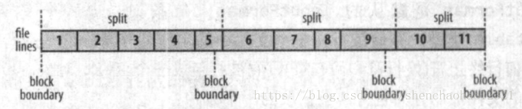
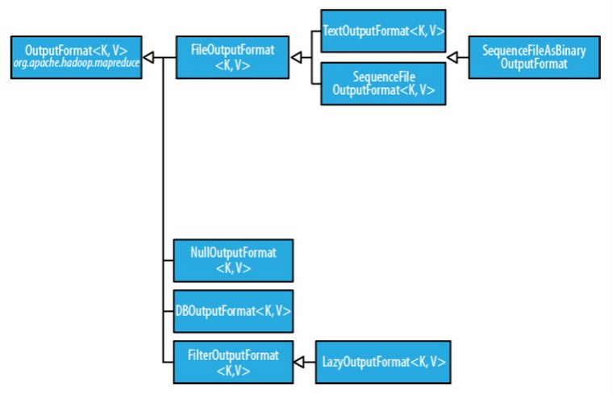

[TOC]

# 第八章 MapReduce类型与格式

MapReduce数据处理非常简单：map和reduce函数的输入和输出是键-值对。本章深入讨论MapReduce模型，重点介绍各类型的数据(从简单文本到结构化的二进制对象)如何在MapReduce中使用。

## 8.1 MapReduce类型

Hadoop的MapReduce中，map函数和reduce函数遵循如下常规格式：

```
map (K1, V1) --> list(K2, V2)
reduce(K2, list(V2)) --> list(K3, V3)
```

一般来说，map函数输入的键/值类型(K1,V1)不同于输出类型(K2, V2)。reduce函数的输入类型必须与map函数的输出类型相同，但reduce函数的输出类型(K3, V3)可以不同与输入类型。例如以下Java接口代码：

```java
public class Mapper<KEYIN, VALUEIN, KEYOUT, VALUEOUT> {
  public abstract class Context implements MapContext<KEYIN,VALUEIN,KEYOUT,VALUEOUT> {
  }
  
  protected void map(KEYIN key, VALUEIN value, Context context) throws IOException, InterruptedException {
    context.write((KEYOUT) key, (VALUEOUT) value);
  }
}

public class Reducer<KEYIN,VALUEIN,KEYOUT,VALUEOUT> {
  
  public abstract class Context implements ReduceContext<KEYIN,VALUEIN,KEYOUT,VALUEOUT> {
  }
  
  protected void reduce(KEYIN key, Iterable<VALUEIN> values, Context context) throws 	   IOException, InterruptedException {
    for(VALUEIN value: values) {
      context.write((KEYOUT) key, (VALUEOUT) value);
    }
  }
}
```

context对象用于输出键-值对，因此它们通过输出类型参数化，`wirte()`方法说明如下：

```java
public void write(KEYOUT key, VALUEOUT value) 
      throws IOException, InterruptedException;
```

由于Mapper和Reducer是单独的类，因此类型参数可能会不同，所以Mapper中KEYIN(say)的实际类型可能与Reducer中同名的类型参数（KEYIN）的类型不一致。例如，在前面章节的求最高温度例子中，Mapper中KEYIN为LongWritable类型，而Reducer中为Text类型。

如果使用combiner函数，它与reduce函数(Reducer的一个实现)的形式相同，不同之处是它的输出类型是中间的键-值对类型（K2和V2)，这些中间值可以输人reduce函数：

```
map:(K1,V1) -> list(K2,V2)
combiner:(K2 ,list(V2)) -> list(K2 , V2)
reduce:(K2，list(V2)) -> list(K3,V3)
```

combiner函数与reduce函数通常是一样的，在这种情况下，K3与K2类型相同，V3与V2类型相同。

partition函数对中间结果的键·值对（K2和V2）进行处理，并且返回一个分区索引(partition index)。实际上，分区由键单独决定(值被忽略)。

```
partition：（K2,V2) -> integer
```

Java实现

```java
public abstract class Partitioner<KEY, VALUE> {
    public abstract int getPartition(KEY var1, VALUE var2, int var3);
}
```

表8-1总结了MapReduce API的配置选项，把属性分为可设置类型的属性和必须与类型相容的属性。

输入数据类型由输入格式进行设置，例如：对应于TextInputFormat的键类型是LongWritable，值类型是Text。其他的类型通过调用Job类的方法来进行显式设置(旧版本API中使用JobConf类的方法)。如果没有显式设置，则中间的类型默认为(最终的)输出类型，即默认值Longwritable和Text。因此，如果K2与K3是相同类型，就不需要调用`setMap0utputKeyClass()`，因为它将调用`set0utputKeyClass()`来设置；同样，如果V2与V3相同，只需要使用`setOutputValueClass()`。

这些为中间和最终输出类型进行设置的方法似乎有些奇怪。为什么不能结合mapper和reducer导出类型呢？ 因为，Java的泛类型机制有很多限制：类型擦除(type erasure)导致运行过程中类型信息并非一直可见，所以Hadoop不得不进行明确设定。这也意味着可能会在MapReduce配置的作用中遇到不兼容的类型，因为这些配置在编译时无法检查。与MapReduce类型兼容的设置列在表8-1中。类型冲突是在作业执行过程中被检测出来的，所以一个比较明智的做法是先用少量数据跑一次测试任务，发现并修正任何一个类型不兼容的问题。

​														**表8-1 MapReduce API中的设置类型**

| 属性                                        | 属性设置方法                 | 输入类型K1 | V1   | 中间类型K2 | V2   | 输出类型K3 | V3   |
| ------------------------------------------- | ---------------------------- | ---------- | ---- | ---------- | ---- | ---------- | ---- |
| 可以设置类型的属性                          |                              |            |      |            |      |            |      |
| mapreduce.job.inputformat.class             | setInputFormatClass()        | *          | *    |            |      |            |      |
| mapreduce.map.output.key.class              | setMapOutputKeyClass()       |            |      | *          |      |            |      |
| mapreduce.map.output.value.class            | setMapOutputValueClass()     |            |      |            | *    |            |      |
| mapreduce.job.output.key.class              | setOutputKeyClass()          |            |      |            |      | *          |      |
| mapreduce.job.output.value.class            | setOutputValueClass()        |            |      |            |      |            | *    |
| 类型必须一致的属性                          |                              |            |      |            |      |            |      |
| mapreduce.job.map.class                     | setMapperClass()             | *          | *    | *          | *    |            |      |
| mapreduce.job.combine.class                 | setCombinerClass()           |            |      | *          | *    |            |      |
| mapreduce.job.partitioner.class             | setPartitionerClass()        |            |      | *          | *    |            |      |
| mapreduce.job.output.key.comparator.class   | setSortComparatorClass()     |            |      |            |      |            |      |
| mapreduce.job.output.group.comparator.class | setGroupingComparatorClass() |            |      | *          |      |            |      |
| mapreduce.job.reduce.class                  | setReducerClass()            |            |      | *          | *    | *          | *    |
| mapreduce.job.outputformat.class            | setOutputFormatClass()       |            |      |            |      | *          | *    |

### 8.1.1 默认的MapReduce作业

如果不指定mapper或reducer就运行MapReduce，会发生什么情况？运行一个最简单的MapReduce程序来看看：

```java
public class MinimalMapReduce extends Configured implements Tool {
 
    @Override
    public int run(String[] args) throws Exception {
        if(args.length!=2){
            System.err.printf("Usage: %s [generic options] <input> <output>\n",getClass().getSimpleName());
            ToolRunner.printGenericCommandUsage(System.err);
        }
        Job job=Job.getInstance(getConf());
        job.setJarByClass(getClass());
        FileInputFormat.addInputPath(conf,new Path(args[0]));
        FileOutputFormat.setOutputPath(conf,new Path(args[1]));
        return job.waitForCompletion(true)?0:1;
    }
 
    public static void main(String[] args) throws Exception {
        int exitCode=ToolRunner.run(new MinimalMapReduce(),args);
        System.exit(exitCode);
    }
}
```

唯一设置的是输入输出路径。在气象数据的子集上运行一下命令：

```sh
hadoop MinimalMapReduce  "input/ncdc/all/190{1,2}.gz" output
```

输出目录中得到命名为part-r-00000的输出文件。这个文件的前几行如下(为适应页面而进行了截断处理）:


每一行以整数开始，接着是制表符(Tab)，然后是一段原始气象数据记录。范例8．1的示例与前面MinimalMapReduce完成的事情一模一样，但是它显式地把作业环境设置为默认值。

```java
public class MinimalMapReduceWidthDefaults extends Configured implements Tool {
 
    @Override
    public int run(String[] args) throws Exception {
        if(args.length!=2){
            System.err.printf("Usage: %s [generic options] <input> <output>\n",getClass().getSimpleName());
            ToolRunner.printGenericCommandUsage(System.err);
        }
        Job job=Job.getInstance(getConf());
        job.setJarByClass(getClass());
        job.setInputFormatClass(TextInputFormat.class)
        job.setMapperClass(Mapper.class);
        job.setMapOutputKeyClass(LongWritable.class);
        job.setMapOutputValueClass(Text.class);
        job.setPartitionerClass(HashPartitioner.class);
        job.setNumReduceTasks(1);
        job.setReducerClass(Reducer.class);
        job.setOutputKeyClass(LongWritable.class);
        job.setOutputValueClass(Text.class);
        return job.waitForCompletion(true)?0:1;
    }
 
    public static void main(String[] args) throws Exception {
        int exitCode=ToolRunner.run(new MinimalMapReduce(),args);
        System.exit(exitCode);
    }
}
```

在默认的输人格式是TextInputFormat，它产生的键类型是LongWritable(文件中每行中开始的偏移量值)，值类型是Text(文本行)。

默认的mapper是Mapper类，它将输人的键和值原封不动地写到输出中：

```java
public class Mapper<KEYIN, VALUEIN, KEYOUT, VALUEOUT> {
    protected void map(KEYIN key, VALUEIN value, Mapper<KEYIN, VALUEIN, KEYOUT, VALUEOUT>.Context context) throws IOException, InterruptedException {
        context.write(key, value);
    }
}
```

Mapper是一个泛型类型(generictype)，它可以接受任何键或值的类型。在这个例子中，map的输人输出键是LongWritable类型，map的输人输出值是Text类型。

默认的partitioner是HashPartitioner，它对每条记录的键进行哈希操作以决定该记录应该属于哪个分区。每个分区由一个reduce任务处理，所以分区数等于作业的reduce任务个数：

```java
public class HashPartitioner<K, V> extends Partitioner<K, V> {
    public int getPartition(K key, V value, int numReduceTasks) {
        return (key.hashCode() & 2147483647) % numReduceTasks;
    }
}
```

键的哈希码被转换为一个非负整数，它由哈希值与最大的整型值做一次按位与操作而获得，然后用分区数进行取模操作，来决定该记录属于哪个分区索引。

默认情况下，只有一个reducer，因此，也就只有一个分区，在这种情况下，由于所有数据都放人同一个分区，partitioner操作将变得无关紧要了。然而，如果有多个reduce任务，了解HashPartitioner的作用就非常重要。假设基于键的散列函数足够好，那么记录将被均匀分到若干个reduce任务中，这样，具有相同键的记录将由同一个reduce任务进行处理。

map任务的数量等于输人文件被划分成的分块数，这取决于输人文件的大小以及文件块的大小(如果此文件在HDFS中)。关于控制块大小的操作，可以参见8.2.1节。

**选择Reducer个数**

对Hadoop新手而言，单个reducer的默认配置很容易上手。但在真实的应用中，几乎所有作业都把它设置成一个较大的数字，否则由于所有的中间数据都会放到一个reduce任务中，作业处理极其低效。

为一个作业选择多少个reducer与其说是一门技术，不如说更多是一门艺术。由于并行化程度提高，增加reducer数量能缩短reduce过程，然而，如果做过了，小文件将会更多，这又不够优化。一条经验法则是：**目标reducer保持在每个运行5分钟左右、且产生至少一个HDFS块的输出比较合适。**

默认的reducer是Reducer类型，它也是一个泛型类型，只是把所有的输人写到输出中：

```java
public class Reducer<KEYIN, VALUEIN, KEYOUT, VALUEOUT> {
       protected void reduce(KEYIN key, Iterable<VALUEIN> values, Reducer<KEYIN, VALUEIN, KEYOUT, VALUEOUT>.Context context) throws IOException, InterruptedException {
        Iterator var4 = values.iterator();
        while(var4.hasNext()) {
            VALUEIN value = var4.next();
            context.write(key, value);
        }
    }
}
```

对于这个任务来说，输出的键是LongWritable类型，而值是Text类型。事实上，对于这个MapReduce程序来说，所有键都是LongWritable类型，所有值都是Text类型，因为它们是输人键/值，并且map函数和reduce函数是恒等函数。然而，大多数MapReduce程序不会一直用相同的键或值类型，必须配置作业来声明使用的类型。

mapper结果在发送给reducer之前，会被MapReduce系统按照键排序。在这个例子中，键是按照数值的大小进行排序的，因此来自输人文件中的行会被交叉放人一个合并后的输出文件(因为默认只有一个reducer)。

默认的输出格式是Text0utputFormat，它将键和值转换成字符串并用制表符分隔开，然后一条记录一行地进行输出。这是TextOutputFormat的特点。

## 8.2 输入格式

从一般的文本文件到数据库，Hadoop可以吹很多不同类型的数据格式。

### 8.2.1 输入分片与记录

一个输入分片(Split)就是一个由单个map操作来处理的输入块。每一个map操作只处理一个输入分片，每个分片被划分为若干个记录，每条记录就是一个键-值对，map一个接一个处理。输入分片和记录都是逻辑概念，不必将它们对应到文件，尽管其常见形式都是文件。在数据库场景中，一个输入分片可以对应于一个表上的若干行，而一条记录对应到一行(如同DBInputFormat，这种输入格式用于从关系型数据库读取数据)。

输入分片在Java中表示为InputSplit接口（在org.apache.hadoop.mapreduce包中）。

```java
public abstract class InputSplit {
	public abstract long getLength() throws IOException, InterruptedException;
	public abstract String[] getLocations() throws IOException, InterruptedException;
}
```

InputSplit包含一个以字节为单位的长度和一组存储位置(即一组主机名)。注意，分片并不包含数据本身，而是指向数据的引用(reference)。存储位置供MapReduce系统使用以便将map任务尽量放在分片数据附近，而分片大小用来排序分片，以便优先处理最大的分片，从而最小化作业运行时间(这也是贪婪近似算法的一个实例)。

MapReduce应用开发人员不必直接处理InputSplit，因为它是由InputFormat创建的(InputFormat负责创建输入分片并将它们分隔成记录)，它在MapReduce中的用法。接口如下：

```java
public abstract class InputFormat<K,V> {
	public abstract List<InputSplit> getSplits(JobContext context)
		throws  IOException, InterruptedException;

	public abstract RecordReader<K,V> createRecordReader(InputSplit split, TaskAttemptContext context)
		throws IOException, InterruptedException;
}
```

运行作业的客户端通过调用`getSplit()`计算分片，然后将它门发送到application master，application master使用其存储位置信息调度map任务从而在集群上处理分片数据。map任务把输入分片传给`InputFormat`的`createRecordReader()`方法来获取分片的`RecordReader`。`RecordReader`就像是记录上的迭代器，map任务用一个RecordReader来生成记录的键-值对，然后再传递给map函数。Mapper的run()方法可以看到这些情况：

```java
protected void map(KEYIN key, VALUEIN value, 
                     Context context) throws IOException, InterruptedException {
    context.write((KEYOUT) key, (VALUEOUT) value);
}

public void run(Context context) throws IOException, InterruptedException {
	setup(context);
	while (context.netKeyValue()) {
		map(context.getCurrentKey(), context.getCurrentValue(), context);
	}
	cleanup(context);
}
```

运行setup()之后，再重复调用Context上的nextKeyValue()(委托给RecordReader的同名方法)为mapper产生键-值对象。通过Context，键/值从RecordReader中被检索出并传递给map()方法。当reader读到stream的结尾时，nextKeyValue()方法返回false，map任务运行其cleanup方法，然后结束。

```java
public abstract class RecordReader<KEYIN, VALUEIN> implements Closeable {
  
  /**
   * Read the next key, value pair.
   * @return true if a key/value pair was read
   * @throws IOException
   * @throws InterruptedException
   */
  public abstract 
  boolean nextKeyValue() throws IOException, InterruptedException;

  /**
   * Get the current key
   * @return the current key or null if there is no current key
   * @throws IOException
   * @throws InterruptedException
   */
  public abstract
  KEYIN getCurrentKey() throws IOException, InterruptedException;
  
  /**
   * Get the current value.
   * @return the object that was read
   * @throws IOException
   * @throws InterruptedException
   */
  public abstract 
  VALUEIN getCurrentValue() throws IOException, InterruptedException;
}
```

注意Mapper的run()方法是公共的，可以由用户定制。MultithreadedMapRunner是另一个MapRunnable接口的实现，可以用可配置个数的线程并发运行多个mapper(mapreduce.mapper.multithreadedmapper.threads设置）。对于大多数数据处理任务来说，默认的执行机制没有优势。但是，对于因为需要连接外部服务器而造成单个记录处理时间比较长的mapper来说，它允许多个mapper在同一个JVM下以尽量避免竞争的方式执行。

#### 1. FileInputFormat类

FileInputFormat是所有使用文件作为其数据源的InputFormat实现的基类，它提供两个功能：

- 用于指出作业的输入文件位置；
- 为输入文件生成分片的代码实现。把分片分割成记录的作业由其子类来完成。


​													**图 8.2 InputFormat 类的层次结构**

#### 2. FileInputFormat类的输入路径

作业的输入被设定为一组路径，这对限定输入提供了很强的灵活性。FileInputFormat提供四种静态方法来设定Job的输入路径：

```java
public static void addInputPath(Job job, Path path)
public static void addInputPaths(Job job, String commaSeparatedPaths)
public static void setInputPaths(Job job, Path... inputPaths)
public static void setInputPaths(Job job, String commaSeparatedPaths)
```

介绍：

- addInputPath 添加一个路径
- addInputPaths 添加多个路径
- setInputPaths 一次性设定完完整的路径(替换前面调用Job中所设置的路径)

一条路径可以表示一个文件，一个目录或是一个glob，即一个文件和目录的集合。路径是目录的话，表示要包含这个目录下的所有文件。

**注意：**一个被指定为输入路径的目录，其内容不会被递归处理。如果包含子目录，也会被解释为文件，从而产生错误。解决这个问题的方法是：

- 使用一个文件glob或一个过滤器根据命名模式(name pattern)限定选择目录中的文件。
- 将`mapreduce.input.fileinputformat.input.dir.recursive`设置为true，强制递归读取

add方法和set方法允许指定包含的文件。排除特定文件，可用`FileInputFormat`的`setInputPathFilter()`方法设置一个过滤器。过滤器的详细讨论参见3.5.5节中对PathFilter的讨论。

即使不设置过滤器，FileInputFormat也会使用一个默认的过滤器来排除隐藏文件（名称中以“.”和“_”开头的文件）。如果通过调用setInputPathFilter()设置了过滤器，它会在默认过滤器的基础上进行过滤。换句话说，自定义的过滤器只能看到非隐藏文件。

路径和过滤器也可以通过配置属性来设置，参见表8-4：

​													**表8-4 输入路径与过滤器属性**

| 属性名称                                 | 类型           | 默认值 | 描述                                                         |
| ---------------------------------------- | -------------- | ------ | ------------------------------------------------------------ |
| mapreduce.input.fileinputformat.inputdir | 逗号分隔的路径 | 无     | 作业的输人文件。包含逗号的路径中的逗号由“\”符号转义。例如，glob{a,b}变成了{a\,b} |
| mapreduce.input.pathFilter.class         | PathFilter类名 | 无     | 应用于作业输人文件的过滤器                                   |

#### 3. FileInputFormat类的输入分片

假设有一组文件，FileInputFormat如何把它们转换为输人分片呢？`FileInputFormat`只分割大文件。这里的“大”指的是文件超过HDFS块的大小。分片通常与HDFS块大小一样，这在大多应用中是合理的。这个值可以通过设置不同的Hadoop属性来改变，如表8-5所示：

​														**表 8-5 控制分片大小的属性**

| 属性名称                                      | 类型 | 默认值             | 描述                                     |
| --------------------------------------------- | ---- | ------------------ | ---------------------------------------- |
| mapreduce.input.fileinputformat.split.minsize | int  | 1                  | 一个文件分片最小的有效字节数             |
| mapreduce.input.fileinputformat.split.maxsize | long | Long.MAX_VALUE     | 一个文件分片中最大的有效字节数(以字节算) |
| dfs.blocksize                                 | long | 128MB，即134217728 | HDFS中块的大小(按字节)                   |

最大的分片大小默认是由Java的long类型表示的最大值。只有把它的值被设置成小于块大小才有效果，这将强制分片比块小。

分片大小由以下公式计算，参见FileInputFormat的computeSplitSize()方法：

```java
max(minimumSize，min(maximumSize,blockSize))
```

在默认情况下：

```
minimumSize < blockSize < maximumSize
```

分片的大小就是blocksize，参数的不同设置及其如何影响最终分片大小，请参见表8·6的详细说明。

​													**表8-6 举例说明如何控制分片的大小**

| 最小份片大小 | 最大分片大小             | 块的大小        | 分片大小 | 说明                                                         |
| ------------ | ------------------------ | --------------- | -------- | ------------------------------------------------------------ |
| 1(默认值)    | Long.MAX_VALUE（默认值） | 128MB（默认值） | 128MB    | 默认情况下，分片大小与块大小相同                             |
| 1（默认值）  | Long.MAX_VALUE（默认值） | 256MB           | 256MB    | 增加分片大小最自然的方法是提供更大的HDFS 块，通过dfs.blocksize或在构建文件时以单个文件为基础进行设置 |
| 256MB        | Long.MAX_VALUE（默认值） | 128MB（默认值） | 256MB    | 通过使最小分片大小的值大于块大小的方法来增大分片大小，但代价是增加了本地操作 |
| 1（默认值）  | 64MB                     | 128MB（默认值） | 64MB     | 通过使最大分片大小的值小于块大小的方法来减少分片大小         |

#### 4. 小文件与CombineFileInputFotmat

相对于处理大批量的小文件，Hadoop更适合处理少量的大文件。一个原因是FileInputFormat生成的块是一个文件或文件的一部分，如果文件很小（“小”意味着比HDFS的块要小很多），并且文件数量很多，那么每次map任务只处理很少的输人数据，一个文件就会有很多map任务，每次map操作都会造成额外的开销。请比较一下把1GB的文件分割成8个128MB块与分成1000个左右100KB的文件。1000个文件每个都需要使用一个map任务，作业时间比一个输人文件上用8个map任务慢几十倍甚至几百倍。

CombineFileInputFormat可以缓解这个问题，它是针对小文件而设计的。FileInputFomnat为每个文件产生1个分片，而CmbineFileInputFomat把多个文件打包到一个分片中以便每个mapper可以处理更多的数据。关键是，决定哪些块放人同一个分片时，CombineFileInputFormat会考虑到节点和机架的因素，所以在典型MapReduce作业中处理输人的速度并不会下降。

当然，如果可能的话应该尽量避免许多小文件的情况，因为：

- MapReduce处理数据的最佳速度最好与数据在集群中的传输速度相同，而处理小文件将增加运行作业而必需的寻址次数。
- HDFS集群中存储大量的小文件会浪费namenode的内存。

一个可以减少大量小文件的方法是使用顺序文件(sequence file)将这些小文件合并成一个或多个大文件，可以将文件名作为键(如果不需要键，可用NullWritable等常量代替)，文件的内容作为值。但如果HDFS中已经有大批小文件，可以使用CombineFileInputFormat方法。

CombineFileInputFormat不仅可以很好地处理小文件，在处理大文件的时候也有好处。这是因为，它在每个节点生成一个分片，分片可能由多个块组成。本质上，combineFileInputFormat使map操作中处理的数据量与HDFS中文件的块大小之间的耦合度降低了。

#### 5.避免切分

有些应用程序可能不希望文件被切分，而是用一个mapper完整处理每一个输人文件。例如，检查一个文件中所有记录是否有序，一个简单的方法是顺序扫描每一条记录并且比较后一条记录是否比前一条要小。如果将它实现为一个map任务，那么只有一个map操作整个文件时，这个算法才可行（SortValidator.RecordStatsChecker中的mapper就是这样实现的）。

有两种方法可以保证输入文件不被切分：

-  增加最小分片的大小，将它设置成要处理的最大文件大小，设置为最大值Long.MAX_VALUE即可；

- 使用FileInputFormat具体子类，并且重写isSplitable()方法。把返回值设置为false。例如，以下就是一个不可分割的TextInputFormat：

	```java
	public class NonSplittableTextInputFormat extends TextInputFormat{
	      @override
	       protected boolean isSplitable(JobContext context,Path file){
	                return false;
	       }
	}
	```

#### 6. mapper中的文件信息

处理文件输入分片的mapper可以从作业配置对象的某些特定属性中读取分片的有关信息，可以通过调用在Mapper的Context对象上的getInputSplit()方法来实现。当输人的格式源自于FileInputFormat时，该方法返回的InputSplit可以被强制转换为一个FileSplit，以此来访问表8-7列出的文件信息。

​																**表8-7 文件输入分片的属性**

| FileSplit方法 | 属性名称                 | 类型        | 说明                     |
| ------------- | ------------------------ | ----------- | ------------------------ |
| getPath()     | mapreduce.map.input.file | Path/String | 正在处理的输人文件的路径 |
| getStart()    | mapreducenp.input.start  | long        | 分片开始处的字节偏移量   |
| getLength()   | mapreducenp.input.length | long        | 分片的长度(按字节)       |

#### 7. 把整个文件作为一条记录处理

有时，mapper需要访问一个文件中的全部内容。即使不分割文件，仍然需要一个RecordReader来读取文件内容作为record的值。范例的WhoIeFiIeInputFormat展示了实现的方法。

**例8-2 把整个文件作为一条记录的InputFotmat**

```java
public class WholeFileInputFormat extends FileInputFormat<NullWritable,ByteWritable>{
        @Override
        protected boolean isSplitable(JobContext context, Path filename) {
            return false;
        }
        @Override
        public RecordReader<NullWritable, ByteWritable> createRecordReader(InputSplit inputSplit, TaskAttemptContext taskAttemptContext) throws IOException, InterruptedException {
            WholeFileRecordReader reader = new WholeFileRecordReader();
            reader.initalize(inputSplit,taskAttemptContext);
            return reader;
        }
    }
```

`WholeFileInputFormat`中没有使用键，此处表示为`NullWritable`，值是文件内容，表示成`BytesWritable`实例。它定义了两个方法：一个是将`isSplitable()`方法重写返回false值，以此来指定输人文件不被分片；另一个是实现了`createRecordReader()`方法，以此来返回一个定制的`RecordReader`实现，如范例8．3所示。

**范例8- 3 WholeFilelnputFormat使用RecordReader将整个文件读为一条记录**

```java
class WholeFileRecordReader extends RecordReader<NullWritable,BytesWritable>{
  			private FileSplit fileSplit;
        private Configuration conf;
        private BytesWritable value=new BytesWritable();
        private boolean processed=false;
  			
  			@Override
        public void initialize(InputSplit inputSplit, TaskAttemptContext taskAttemptContext) throws IOException, InterruptedException {
            this.fileSplit=(FileSplit) inputSplit;
            this.conf=taskAttemptContext.getConfiguration();
        }
  			
  			@Override
        public boolean nextKeyValue() throws IOException, InterruptedException {
            if(!processed){
                byte[] contents=new byte[(int)fileSplit.getLength()];
                Path file=fileSplit.getPath();
                FileSystem fs=file.getFileSystem(conf);
                FSDataInputStream in=null;
                try{
                    in=fs.open(file);
                    IOUtils.readFully(in,contents,0,contents.length);
                    value.set(contents,0,contents.length);
                }finally{
                    IOUtils.closeStream(in);
                }
                processed=true;
                return true;
            }
            return false;
        }
  			
  			@Override
        public NullWritable getCurrentKey() throws IOException, InterruptedException {
            return NullWritable.get();;
        }
 
        @Override
        public BytesWritable getCurrentValue() throws IOException, InterruptedException {
            return value;
        }
 
        @Override
        public float getProgress() throws IOException, InterruptedException {
            return processed?1.0f:0.0f;
        }
 
        @Override
        public void close() throws IOException {
            //do nothing
        }

}
```

WholeFileRecordReader负责将FileSplit转换成一条记录，该记录的键是null，值是这个文件的内容。因为只有一条记录，WholeFileRecordReader要么处理这条记录，要么不处理，所以它维护一个名称为processed的布尔变量来表示记录是否被处理过。如果当nextKeyvalue()方法被调用时，文件没有被处理过，就打开文件，产生一个长度是文件长度的字节数组，并用Hadoop的IOUtils类把文件的内容放人字节数组。然后再被传递到next()方法的BytesWritable实例上设置数组，返回值为true则表示成功读取记录。

其他一些方法都是一些直接的用来访问当前的键和值类型、获取reader进度的方法，还有一个close()方法，该方法由MapReduce框架在reader完成后调用。

现在演示使用WholeFileInputFormat。假设有一个将若干个小文件打包成顺序文件的MapReduce作业，键是原来的文件名，值是文件的内容。如例8-4所示

```java
public class SmallFilesToSequenceFileConverter extends Configured implements Tool{
        public static void main(String[] args) {
            int exitCode=ToolRunner.run(new SmallFilesToSequenceFileConverter(),args);
            System.exit(exitCode);
        }
        
        @Override
        public int run(String[] args) throws Exception {
            Job job=JobBuilder.parseInputAndOutput(this,getConf(),args);
            if(conf==null){
                return -1;
            }
            // 设置输入文件格式
            job.setInputFormatClass(WholeFileInputFormat.class);
            // 设置输出文件格式
            job.setOutputFormatClass(SequenceFileOutputFormat.class);
            job.setOutputKeyClass(Text.class);
            job.setOutputValueClass(BytesWritable.class);
            job.setMapperClass(SequenceFileMapper.class);
            return job.waitForCompletion(true)?0:1;
        }
 
        static class SequenceFileMapper extends Mapper<NullWritable,BytesWritable,Text,BytesWritable>{
            private Text filenameKey;
            @Override
            protected void setup(Context context) throws IOException, InterruptedException {
                InputSplit split=context.getInputSplit();
                // 强制转换为FileSplit，
                Path path=((FileSplit)split).getPath();
                filenameKey=new Text(path.toString());
            }
 
            @Override
            protected void map(NullWritable key, BytesWritable value, Context context) throws IOException, InterruptedException {
                context.write(filenameKey,value);
            }
        }
    }
```

由于输入格式是`wholeFileInputFormat`，所以mapper只需要找到文件输入分片的文件名，通过将InputSplit从context强制转换为FileSplit来实现。FileSplit包含一个可以获取文件路径的方法，路径存储在键对应的一个Text对象中，reducer的类型是相同的，输出格式是`SequenceFileOutputFormat`。

以下是在一些小文件上的运行样例。此处使用了两个reducer，所以生成两个输出顺序文件：

```sh
hadoop jar job.jar SmallFilesToSequenceFileConverter \
- conf conf/hadoop-localhost.xml -D mapreduce.job.reduces=2 \
input/smallfiles output
```

由此产生两部分文件，每一个对应一个顺序文件，可以通过文件系统shell的-text选项来进行检查：

```sh
hadoop fs -conf conf/hadoop-localhost.xml -text output/part-r-00000

hdfs://localhost/user/tom/input/smallfiles/a 61 61 61 61 61 61 61 61 61 61
hdfs://localhost/user/tom/input/smallfiles/c 63 63 63 63 63 63 63 63 63 63
hdfs://localhost/user/tom/input/smallfiles/a 

hadoop fs -conf conf/hadoop-localhost.xml -text output/part-r-00001

hdfs://localhost/user/tom/input/smallfiles/b 62 62 62 62 62 62 62 62 62 62
hdfs://localhost/user/tom/input/smallfiles/d 64 64 64 64 64 64 64 64 64 64
hdfs://localhost/user/tom/input/smallfiles/f 66 66 66 66 66 66 66 66 66 66
```

输人文件的文件名分别是a、b、c、d、e和 f，每个文件分别包含10个相应字母（比如，a文件中包含10个"a”字母），e文件例外，它的内容为空。可以看到这些顺序文件的文本表示，文件名后跟着文件的十六进制的表示。

至少有一种方法可以改进程序。前面提到，一个mapper处理一个文件的方法是低效的，所以较好的方法是继承CombineFileInputFormat而不是FileInputFormat。

### 8.2.2 文本输入

Hadoop非常擅长处理非结构化文本数据，本节讨论Hadoop提供的用于处理文本的不同InputFormat类。

#### 1. TextInputFormat

TextInputFormat是默认的InputFormat，每条记录是一行输入，键是LongWritable类型，存储该行在整个文件中的字节偏移量，值是这行的内容，不包括任何中行终止符(换行符和回车符)。它被打包成一个Text对象。所以，包含如下文本的文件被切分为包含4条记录的一个分片：

```
On the top of the Crumpetty Tree 
The Quangle Wangle sat, 
But his face you could not see, 
On account of his Beaver Hat. 
```

每条记录表示为以下键值：

```xml
(0, On the top of the Crumpetty Tree) 
(33, The Quangle Wangle sat,) 
(57, But his face you could not see,) 
(89, On account of his Beaver Hat. ) 
```

很明显，键并不是行号。一般情况下，很难取得行号，**因为文件按字节而不是按行切分为分片**。每个分片单独处理。行号实际上是一个顺序的标记，即每次读取一行的时候需要对行号计数。因此，在分片内知道行号是可能的，但在文件中是不可能的。

然而，每一行在文件中的偏移量是可以在分片内单独确定的，而不需要知道分片的信息，因为每个分片都知道上一个分片的大小，只需要加到分片内的偏移量上，就可以获得每行在整个文件中的偏移量了。通常，对于每行需要唯一标识的应用来说，有偏移量就足够了。如果再加上文件名，那么它在整个文件系统内就是唯一的。当然，如果每一行都是定长的，那么这个偏移量除以每一行的长度即可算出行号。

**输入分片与HDFS块之间的关系**

FileInputFormat定义的逻辑记录有时并不能很好的匹配HDFS的文件块。例如：TextInputFormat的逻辑记录是以行为单位的。那么很有可能某一行会跨文件块存放。虽然这对程序的功能没有什么影响，如行不会丢失或出错，但这种现象应该引起注意，因为这意味着那些“本地的”map(即map运行在输入数据所在的主机上）会执行一些远程的读操作，由此而来的额外开销一般不是特别明显。

图8·3展示了一个例子。一个文件分成几行，行的边界与HDFS块的边界没有对齐——分片的边界与逻辑记录的边界对齐(这里是行边界)，所以第一个分片包含第5行，即使第5行跨第一块和第二块·第二个分片从第6行开始。



​											**图8-3 TextInputFormat的逻辑记录和HDFS块**

#### 2. 控制一行最大的长度

如果正在使用这里讨论的文本输人格式中的一种，可以为预期的行长设一个最大值，对付被损坏的文件。文件的损坏可以表现为超长行，导致内存溢出，任务失败。将mapreduce.input.linerecordreader.line.maxlength设置为用字节数表示的、在内存范围内的值(适当超过输人数据中的行长)，可以确保记录reader跳过(长的)损坏的行，不会导致任务失败。

#### 3. 关于KeyVaIueTextlnputFormat

TextInputFormat的键，即每一行在文件中的字节偏移量，通常不是特别有用。通常情况下，文件中的每一行是一个键-值对，使用某个分界符进行分隔，比如制表符。例如由TextOutputFormat(Hadoop默认OutputFormat)产生的输出就是这种，如果要正确处理这类文件，KeyvalueTextInputFormat比较合适。

可以通过mapreduce.input.keyvaluelinerecordreader.key.value.separator属性来指定分隔符。它的默认是一个制表符。以下是一个范例，其中$\rightarrow$表示一个(水平方向的)制表符：

```
ine1->On the top of the Crumpetty Tree
line2->The QuangIe wangle sat，
line3->But his face you could not see，
line4->On account of his Beaver Hat．
```

与TextInputFormat类似，输人是一个包含4条记录的分片，不过此时的键是每行排在制表符之前的Text序列：

```
(line1,On the top of the Crumpetty Tree)
(line2,The QuangIe wangle sat，)
(line3,But his face you could not see，)
(line4,On account of his Beaver Hat．)
```

#### 4. 关于NLineInputFormat

通过TextInputFormat和KeyValueTextInputFormat，每个Mapper收到的输入行数不同，行数取决于输入分片大小和行长度，如果希望mapper收到固定行数的输人，需要将NLineInputFormat作为lnputFormat使用。与TextInputFormat一样，键是文件中行的字节偏移量，值是行本身。

N是每个Mapper收到的输入行数，默认值为1。mapreduce.input.lineinputformat.linespermap属性控制N值的设定。以刚才的4行输人为例：

```
On the top of the Crumpetty Tree
The QuangIe Wangle sat，
But his face you could not see，
On account of his Beaver Hat．
```

例如，如果N是2，则每个输人分片包含两行。一个mapper收到前两行键．值对：

```
（0，On the top of the Crumpetty Tree)
〈33，The QuangIe Wangle sat，）
```

另一个mapper则收到后两行：

```
（57，But his face you could not see,）
（89，On account of his Beaver Hat．）
```

键和值与TextInputFormat生成的一样。不同的是输人分片的构造方法。

通常来说，对少量输人行执行map任务是比较低效的（任务初始化的额外开销造成的），但有些应用程序会对少量数据做一些扩展的(即CPU密集型的)计算任务，然后产生输出。仿真是一个不错的例子。通过生成一个指定输人参数的输人文件，每行一个参数，便可以执行一个参数扫描分析（parameter sweep)：并发运行一组仿真试验，看模型是如何随参数不同而变化的。

另一个例子是用Hadoop引导从多个数据源（如数据库）加载数据。创建一个“种子”输人文件，记录所有的数据源，一行一个数据源。然后每个mapper分到一个数据源，并从这些数据源中加载数据到HDFS中。这个作业不需要reduce阶段，所以reducer的数量应该被设成0（通过调用Job的setNumReduceTasks()来设置）。进而可以运行MapReduce作业处理加载到HDFS中的数据。范例参见附录C。

#### 5. 关于XML

大多数XML解析器会处理整个XML文档，所以如果一个大型XML文档由多个输人分片组成，那么单独解析每个分片就相当有挑战。

由很多“记录”（此处是XML文档片断）组成的XML文档，可以使用简单的字符串匹配或正则表达式匹配的方法来查找记录的开始标签和结束标签，而得到很多记录。这可以解决由MapReduce框架进行分割的问题，因为一条记录的下一个开始标签可以通过简单地从分片开始处进行扫描轻松找到，就像TextInputFormat确定新行的边界一样。

Hadoop提供了`StreamXmIRecordReader`类（在org.apache.hadoop.streaming.mapreduce包中，还可以在Streaming之外使用）。通过把输人格式设为`StreamInputFormat`，把`stream.recordreader.class`属性设为`org.apache.hadoop.streaming.mapreduce.StreamXmlRecordReader`来用StreamXmlRecordReader类。reader的配置方法是通过作业配置属性来设reader开始标签和结束标签。

例如，维基百科用XML格式来提供大量数据内容，非常适合用MapReduce来并行处理。数据包含在一个大型的打包文档中，文档中有一些元素，例如包含每页内容和相关元数据的page元素。使用StreamXmlRecordReader后，这些page元素便可解释为一系列的记录，交由一个mapper来处理。

### 8.2.3 二进制输入

Hadoop的MapReduce还可以处理二进制格式的数据。

#### 1. 关于SequenceFileInputFormat类

Hadoop的顺序文件格式是存储二进制的健—值对的序列。由于它们是可分割的(它们有同步点，所以reader可以从文件中的任意一点与记录边界进行同步，例如分片的起点)。所以它们很符合MapReduce数据的格式要求，并且它们还支持压缩，可以使用一些序列化技术来存储任意类型。详情参见5.4.1节。

如果要用顺序文件数据作为MapReduce的输人，可以使用SequenceFileInputFormat键和值是由顺序文件决定，所以只需要保证map输人的类型匹配。例如，如果顺序文件中键的格式是lntwritable，值是Text，就像第5章中生成的那样，那么mapper的格式应该是Mapper<Intwritable,Text，K，V>，其中K和V是这个mapper输出的键和值的类型。

#### 2. 关于SequenceFileAsTextlnputFormat类

SequenceFileAsTextInputFormat是SequenceFileInputFormat的变体，它将顺序文件的键和值转换为Text对象。这个转换通过在键和值上调用toString()方法实现。

#### 3. 关于SequenceFiIeAsBinaryInputFormat类

`SequenceFileAsBinaryInputFormat`是`SequenceFileInputFormat`的一种变体，它获取顺序文件的键和值作为二进制对象。它们被封装为`BytesWritable`对象，因而应用程序可以任意解释这些字节数组。

与使用SequenceFile.Reader的`appenRaw()`方法或或SequenceFileAsBinaryOutputFormat创建顺序文件的过程相配合，可以提供在MapReduce中可以使用任意二进制数据类型的方法(作为顺序文件打包)。

#### 4. 关于FixedLengthInputFormat类

`FixedLengthInputFormat`用于从文件中读取固定宽度的二进制记录，当然这些记录没有用分隔符分开。必须通过`fixedlengthinputformat.record.length`设置每个记录的大小。

### 8.2.4 多个输入

一个MapReduce作业的输人可能包含多个输人文件(由文件glob、过滤器和路径组成)，但所有文件都由同一个InputFormat和同一个Mapper来解释。然而，数据格式往往会随时间演变，所以必须写自己的mapper来处理应用中的遗留数据格式问题。或者，有些数据源会提供相同的数据，但是格式不同。对不同的数据集进行连接(join)操作时，便会产生这样的问题。详情参见9.3.2节。例如，有些数据可能是使用制表符分隔的文本文件，另一些可能是二进制的顺序文件。即使它们格式相同，它们的表示也可能不同，因此需要分别进行解析。

这些问题可以用MultipleInputs类来妥善处理，它允许为每条输人路径指定InputFormat和Mapper。例如，我们想把英国Met Office的气象数据和NCDC的气象数据放在一起来分析最高气温，则可以按照下面的方式来设置输人路径：

```java
MultipleInputs.addInputPath(job,ncdcInputPath,TextInputFormat.class,maxTemperatureMapper.class);
MultipleInputs.addInputPath(job,metOfficeInputPath,TextInputFormat.class,MetofficeMaxTemperatureMapper.class);
```

这段代取代了对`FileInputFomat.addInputPath()`和`job.setMapperClass()`的常规调用。MetOfflce和NCDC的数据都是文本文件，所以对两者都使用`TextInputFormat`数据类型。但这两个数据源的行格式不同，所以我们使用了两个不一样的mapper。`MaxTemperatureMapper`读取NCDC的输人数据并抽取年份和气温字段的值。`MetOfficeMaxTemperatureMapper`读取Met Office的输人数据，抽取年份和气温字段的值。重要的是两个mapper的输出类型一样，因此，reducer看到的是聚集后的map输出，并不知道这些输人是由不同的mapper产生的。`MultipleInputs`类有一个重载版本的`addInputPath()`方法，它没有mapper参数：

```java
public static void addInputPath(Job job,Path path,class<? extends InputFormat> inputFormatClass)
```

如果有多种输人格式而只有一个mapper(通过Job的setMapperClass()方法设定)，这种方法很有用。

### 8.2.5 数据库输入/输出

DBInputFormat这种输入格式用于使用JDBC从关系型数据库中读取数据。因为它没有任何共享能力，所以在访问数据库的时候必须非常小心，在数据库中运行太多的mapper读数据可能会使数据库受不了。正是由于这个原因，DBInputFormat最好用于加载小量的数据集，如果要与来自HDFS的大数据集连接，要使用MultipleInputs。

输出格式是DBOutputFormat，它适用于将作业输出数据(中等规模数据)转储到数据库中。在关系型数据库和HDFS之间的数据移动另一个方法是：使用Sqoop。

HBase的`TableInputFormat`让MapReduce程序操作存放在HBase表中的数据。而`TableOutputFormat`则是把MapReduce的输出写到HBase表。

## 8.3 输出格式

对于前一节介绍的输入格式，Hadoop都有相对应的输出格式。OutputFormat 类的层次结构如图8-4所示。



​													**图8-4 OutputFormat类的层次结构**

**OuputFormat类**

- `RecordWriter<K, V> getRecordWriter(TaskAttemptContext var1)`：根据TaskAttemptContext（map及reduce函数的参数Context对象间接继承自该类）对象中的相关信息返回一个RecordWriter()对象（包含一个键值对数据）。后者负责键值对的写入操作。
- `void checkOutputSpecs(JobContext var1)`：用于检测作业输出规范有效性。比如FileOutputFormat中输出路径未设置、输出路径已存在时会抛出异常。该方法通常会在任务初始化阶段被调
- `OutputCommitter getOutputCommitter(TaskAttemptContext var1)`：方法来负责确保输出被正确提交

**FileOutputFormat类**

所有写入到文件系统的类都继承自该类，实现了一些公共方法。输入基类该类继承自`OutputFormat`类，实现了以上最后两个方法。

- `setOutputPath(Job job, Path outputDir`)：设置输出路径。
- `setCompressOutput(Job job, boolean compress)`：是否使用压缩算法压缩输出。
- `setOutputCompressorClass(Job job, Class<? extends CompressionCodec> codecClass)`：设置压缩算法所使用的类。
- `checkOutputSpecs(JobContext job)`：实现了OutputFormat，该方法会在输出路径未设置、输出路径存在时抛出异常。
- `getOutputCommitter(TaskAttemptContext var1)`其并未实现getRecordWriter()方法，由其子类实现。

### 8.3.1 文本输出

默认的输出格式是`TextOuputFormat`，它把每条记录写为文本行。它的键和值可以是任意类型，因为 TextOutputFormat 调用 toString() 方法把它们转换为字符串。每个键/值对由制表符进行分割，当然也可以设定 mapreduce.output.textoutputformat.separator 属性改变默认的分隔符。 与 TextOutputFormat 对应的输入格式是 KeyValueTextInputFormat，它通过可配置的分隔符将键/值对文本分割。

可以使用 NullWritable 来省略输出的键或值(或两者都省略，相当于 NullOutputFormat 输出格式，后者什么也不输出)。 这也会导致无分隔符输出，以使输出适合用 TextInputFormat 读取。

### 8.2.3 二进制输出

#### 1. 关于SequenceFileOutputFormat

SequenceFileOutputFormat 将它的输出写为一个顺序文件。如果输出需要作为后续 MapReduce 任务的输入，这便是一种好的输出格式， 因为它的格式紧凑，很容易被压缩。

#### 2. 关于SequenceFileAsBinaryOutputFormat

SequenceFileAsBinaryOutputFormat与SequenceFileAsBinaryInputFormat相对应，以原始的二进制格式把键-值对写入到一个顺序文件容器中。

#### 3. 关于MapFileOutputFormat

MapFileOutputFormat把map文件作为输入，MapFile中的键必须顺序添加，所以必须确保 reducer 输出的键已经排好序。

reduce输入的键一定是有序的，但是输出的键由reduce函数控制，MapReduce框架中没有硬性规定reduce输出键必须是有序的，所以reduce输出的键必须有序是对MapFileOutputFormat的一个额外限制。

### 8.3.3 多个输出

FileOutputFormat及其子类产生的文件放在输出目录下，每个reducer一个文件并且文件由分区号命名：part-r-00000，part-r-00001，等等。有时可能需要对输出的文件名进行控制或让每个reducer输出多个文件。MapReduce为此提供了MultipleOutputFormat类。

#### 1. 范例：数据分割

有这样一个需求：按气象站来区分气象数据，这需要运行一个作业，作业的输出是每个气象站一个文件，此文件包含该气象站的所有数据记录。

一种方法是每个气象站一个reducer。为此，必须做两件事：

- 自定义分区函数，把同一个气象站的数据放到同一个分区；
- 把作业的reducer数设为气象站的个数

自定义分区函数如下：

```java
import org.apache.hadoop.io.LongWritable;
import org.apache.hadoop.io.Text;
import org.apache.hadoop.mapreduce.Partitioner;

//vv StationPartitioner
public class StationPartitioner extends Partitioner<LongWritable, Text> {
  
  private NcdcRecordParser parser = new NcdcRecordParser();
  
  @Override
  public int getPartition(LongWritable key, Text value, int numPartitions) {
    parser.parse(value);
    return getPartition(parser.getStationId());
  }

  private int getPartition(String stationId) {
    /*...*/
// ^^ StationPartitioner
    return 0;
// vv StationPartitioner
  }

}
```

  这里没有给出getPartition(String)方法的实现，它将气象站ID转换为分区索引号，为此，它的输入是一个列出所有气象站ID的列表，返回列表中气象站ID的索引。

这样做有两个缺点：

- 需要在作业运行之前知道分区数和气象站的个数，虽然NCDC数据集提供了气象站的元数据，但是无法保证数据中的气象站ID与元数据匹配。解决这个问题的方法是写一个作业来抽取唯一的气象站ID，但是需要浪费额外的作业来实现。
- 让应用程序来严格限定分区数并不好，因为可能导致分区数少或分区不均。让很多reducer做少量工作不是一个高效的作业组织方法，比较好的办法是使用更少reducer做更多的事情，因为运行任务的额外开销减少了。分区不均的情况是很难避免的，不同气象站的数据量差异很大：有些气象站是一年前投入使用的，而有些气象站工作了一个世纪。即现实生产环境的数据倾斜问题，如有其中一些reduce任务运行时间远远超过另一些，作业执行时间将由他们决定，从而导致作业的运行时间超过预期。

在以下两种特殊情况下，让应用程序来设定分区数是有好处的

- 0个reducer，这是一个很罕见的情况：没有分区，因为应用只需要map任务
- 1个reducer，可以很方便的运行若干个小作业，从而把以前作业的输出合并成单个文件。前提是数据量足够小，以便一个reducer能轻松处理。

最好让集群为作业决定分区数：集群的可用资源越多，任务完后就越快。这就是默认HashPartitioner表现如此出色的原因，因为它处理的分区数不限，并且确保每个分区都有一个很好的键组合使分区更均匀。

如果使用HashPartitioner，每个分区就会包含多个气象站，因此，要实现每个气象站输出一个文件，必须安排一个reducer写多个文件，由此就有了MultipleOutput。

#### 2. 关于MultipleOutput

MultipleOutput类可以将数据写到多个文件，文件的名称源于输入的键和值或任意字符串。这允许每个reducer(或者只有map作业的mapper)创建多个文件。采用$name-m-nnnnn$形式的文件名用于map输出，$name-r-nnnnn$形式的文件名用于reduce输出，其中name是程序设定的任意名字，nnnnn是一个指明块号的整数(从00000开始)。块号保证从不同的分区(mapper或reducer)写的输出在相同名字情况下不会冲突。范例8-5显示了如何使用MultipleOutputs按照气象站划分数据。

**范例8-5 用MultipleOutput类将整个数据集分区间到以气象站ID命名的空间**

```java
mport java.io.IOException;

import org.apache.hadoop.conf.Configured;
import org.apache.hadoop.io.LongWritable;
import org.apache.hadoop.io.NullWritable;
import org.apache.hadoop.io.Text;
import org.apache.hadoop.mapreduce.Job;
import org.apache.hadoop.mapreduce.Mapper;
import org.apache.hadoop.mapreduce.Reducer;
import org.apache.hadoop.mapreduce.lib.output.MultipleOutputs;
import org.apache.hadoop.util.Tool;
import org.apache.hadoop.util.ToolRunner;

public class PartitionByStationYearUsingMultipleOutputs extends Configured
  implements Tool {
  
  static class StationMapper
    extends Mapper<LongWritable, Text, Text, Text> {
  
    private NcdcRecordParser parser = new NcdcRecordParser();
    
    @Override
    protected void map(LongWritable key, Text value, Context context)
        throws IOException, InterruptedException {
      parser.parse(value);
      context.write(new Text(parser.getStationId()), value);
    }
  }
  
  static class MultipleOutputsReducer
    extends Reducer<Text, Text, NullWritable, Text> {
    
    private MultipleOutputs<NullWritable, Text> multipleOutputs;
    private NcdcRecordParser parser = new NcdcRecordParser();

    @Override
    protected void setup(Context context)
        throws IOException, InterruptedException {
      multipleOutputs = new MultipleOutputs<NullWritable, Text>(context);
    }
    
    @Override
    protected void reduce(Text key, Iterable<Text> values, Context context)
        throws IOException, InterruptedException {
      for (Text value : values) {
        parser.parse(value);
        multipleOutputs.write(NullWritable.get(), value, key.toString());
     }
    }
    
    @Override
    protected void cleanup(Context context)
        throws IOException, InterruptedException {
      multipleOutputs.close();
    }
  }
  
  @Override
  public int run(String[] args) throws Exception {
    Job job = JobBuilder.parseInputAndOutput(this, getConf(), args);
    if (job == null) {
      return -1;
    }
    
    job.setMapperClass(StationMapper.class);
    job.setMapOutputKeyClass(Text.class);
    job.setReducerClass(MultipleOutputsReducer.class);
    job.setOutputKeyClass(NullWritable.class);

    return job.waitForCompletion(true) ? 0 : 1;
  }
  public static void main(String[] args) throws Exception {
    int exitCode = ToolRunner.run(new PartitionByStationYearUsingMultipleOutputs(),
        args);
    System.exit(exitCode);
  }
}
```

在生成输出的reducer中，在`setup()`方法中构造一个MultipleOutputs实例，`reduce()`方法中使用multipleOutputs实例来写输出，而不是context。`write()`方法作用于键、值、名字。最后产生的输出是：station_identifier_r-nnnnn。

运行产生的输入文件命名如下：

```
/output/010010-9999-r-00027
/output/010050-9999-r-00013
/output/010010-9999-r-00015
/output/010280-9999-r-00014
/output/010550-9999-r-00000
/output/010980-9999-r-00011
```

在MultipleOutputs的write()方法中指定的基本路径相对于输出路径进行解析，因为可以包含文件路径分隔符(/)，可以创建任意深度的子目录。例如，将数据根据气象站和年份进行划分，这样每年的数据就被包含在一个名为气象站ID的目录中：

**范例8-6 用MultipleOutput类将整个数据集分区间到以气象站ID，年份命名的空间**

```java
@Override
protected void reduce(Text key, Iterable<Text> values, Context context)
  throws IOException, InterruptedException {
  for (Text value : values) {
    parser.parse(value);
    String basePath = String.format("%s/%s/part",
                                    parser.getStationId(), parser.getYear());
    multipleOutputs.write(NullWritable.get(), value, basePath);
  }
}
```

MultipleOutput传递给mapper的OutputFormat，该例子中为TextOutputFormat，但是可能有更复杂的情况，例如，可以创建命名的输出，每个都有自己的OutputFormat、键和值的类型。

### 8.3.4 延迟输出

FileOutputFormat的子类会产生输出文件(part-r-nnnnn)，即使文件是空的。有些应用倾向于不创建空文件，可以使用LazyOutputFormat，当且仅当分区有数据是才产生输出。要使用它，用JobConf和相关输出格式作为参数来调用setOutputFormatClass()方法即可：

```java
job.setOutputFormatClass(LazyOutputFormat.class)
```

