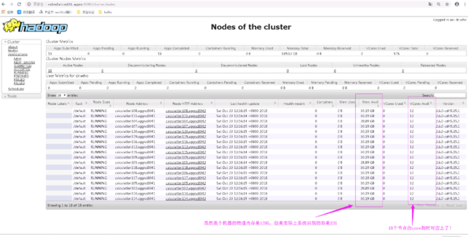
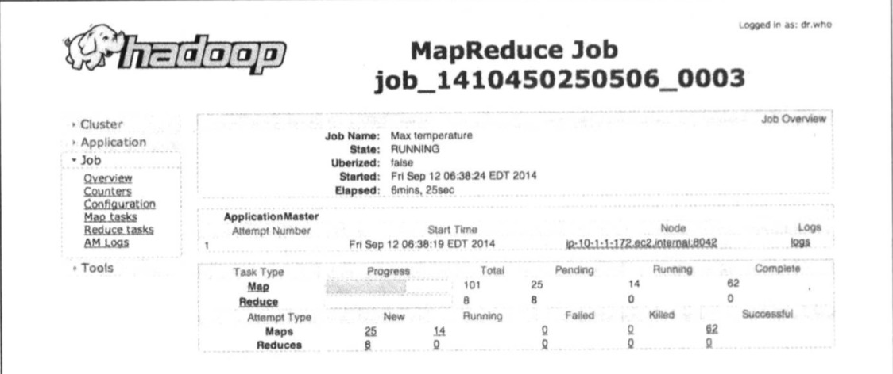
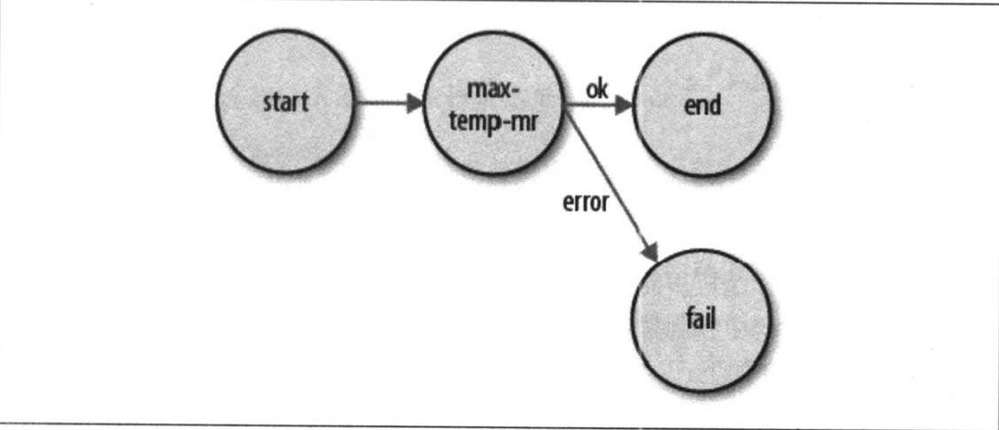

# 第六章 MapReduce应用开发

本章从实现层面介绍Hadoop中开发MapReduce程序。MapReduce编程遵循一个特征流程：

- 编写map函数与reduce函数；
- 编写mrUnit单元测试，确保map函数和reduce函数的运行符合预期；
- 编写驱动器程序来运行作业；
- 使用本地IDEA中的小的本地数据集运行并调试；
- 程序按照预期运行则打包部署在集群运行。在集群上运行调试程序具有一定难度，可以通过一些常用技术使其变得简单；
- 对程序优化调整，加快MapReduce运行速度，需要执行一些标准检查；
- 进行任务剖析(task profiling)，分布式程序的分析并不简单，Hadoop提供了钩子(hook)来辅助分析过程。

在开发MR程序前，需要设置和配置开发环境。

## 6.1 用于配置的API

Hadoop中的组件是通过Hadoop自己的配置API来配置的，org.apache.hadoop.conf包中的Confrguration类代表配置属性及其取值集合，每个属性由一个String来命名，值的类型可以是Java基本类型(如boolean、int、boolean)，其他类型(如：Class、java.io.File)以及String集合。

Configuration从资源文件中读取其属性值。参见例6-1:

**例6-1 configuration-1.xml**

```xml
<?xml version="1.0"?>
<configuration>
    <property>
        <name>color</name>
        <value>yellow</value>
    </property>
    <property>
        <name>size</name>
        <value>10</value>
    </property>
    <property>
        <name>weight</name>
        <value>heavy</value>
        <final>true</final>
      	<decription>weight</decription>
    </property>
    <property>
        <name>size-weight</name>
        <value>${size},${weight}</value>
    </property>
</configuration>
```

使用上述配置文件：

```java
Configuration conf = new Configuration();
conf.addReasource("configuration-1.xml");
assertThat(conf.get("color"), is("yellow"));
assertThat(conf.getInt("size", 0), is(10));
assertThat(conf.get("breadth", "wide"), is("wide")); // get()方法允许为XML文件中没有定义的属性指定默认值
```

### 6.1.1 资源合并

使用多个资源文件来定义一个Configuration时，后来添加到资源文件的属性会覆盖之前定义的属性，但是被标记为**final**的属性不能被后面的定义所覆盖。在Hadoop中，用于分离系统默认属性(core-default.xml内部定义的属性)与(core-site.xml文件定义的属性)位置相关的覆盖属性。

### 6.1.2 扩展变量

配置属性可以用其他属性或其他属性进行定义，例如文件`configuration-1.xml`中`size-weight`属性可以定义为`${size}`和`${weight}`,而且这些属性是用配置文件中的值来扩展的:

```java
conf.get("size-weight"), is("12,heavy")
```

系统属性的优先级高于资源文件中定义的属性，该特性特别适用于命令行方式下使用JVM参数-Dproperty=value来覆盖属性。

```java
System.setProperty("size", "14");
assertThat(conf.get("size-weight"), is("14,heavy"));
```

**注意：**虽然配置属性可以通过系统属性来定义,但除非系统属性使用配置属性重新定义,否则他们是无法通过配置API进行访问的，即系统属性重新定义的配置属性才能通过Configuration API访问

```java
System.setProperty("length", "2");
assertThat(conf.get("length"), is(String)null);
```

## 6.2  开发环境配置

新建Maven项目，在POM中定义编译和测试Map-Reduce程序所需依赖，如例6-3所示

**例6-3 编译和测试MapReduce应用的Maven POM**

```xml
<?xml version="1.0" encoding="UTF-8"?>
<project xmlns="http://maven.apache.org/POM/4.0.0"
         xmlns:xsi="http://www.w3.org/2001/XMLSchema-instance"
         xsi:schemaLocation="http://maven.apache.org/POM/4.0.0 http://maven.apache.org/xsd/maven-4.0.0.xsd">
    <modelVersion>4.0.0</modelVersion>

    <groupId>com.bovenson</groupId>
    <artifactId>mapreduce</artifactId>
    <version>1.0-SNAPSHOT</version>

    <properties>
        <project.build.sourceEncoding>UTF-8</project.build.sourceEncoding>
        <project.reporting.outputEncoding>UTF-8</project.reporting.outputEncoding>
        <hadoop.version>2.6.1</hadoop.version>
    </properties>

    <dependencies>
        <!-- Hadoop main artifact -->
        <dependency>
            <groupId>org.apache.hadoop</groupId>
            <artifactId>hadoop-core</artifactId>
            <version>${hadoop.version}</version>
        </dependency>
        <!-- Unit test artifacts -->
        <dependency>
            <groupId>junit</groupId>
            <artifactId>junit</artifactId>
            <version>4.10</version>
            <scope>test</scope>
        </dependency>
        <dependency>
            <groupId>org.hamcrest</groupId>
            <artifactId>hamcrest-all</artifactId>
            <version>1.1</version>
            <!--<scope>test</scope>-->
        </dependency>
        <!-- Hadoop test artifacts for running mini clusters -->
        <dependency>
            <groupId>org.apache.mrunit</groupId>
            <artifactId>mrunit</artifactId>
            <version>1.1.0</version>
            <classifier>hadoop2</classifier>
            <scope>test</scope>
        </dependency>
        <dependency>
            <groupId>org.apache.hadoop</groupId>
            <artifactId>hadoop-test</artifactId>
            <version>1.0.0</version>
            <<scope>test</scope>
        </dependency>
  			<!-- Hadoop test artifact running mini clusters-->
  			<dependency>
            <groupId>org.apache.hadoop</groupId>
            <artifactId>hadoop-minicluser</artifactId>
            <version>${hadoop.version}</version>
        </dependency>
        <!-- Missing dependency for running mini clusters -->
        <dependency>
            <groupId>com.sun.jersey</groupId>
            <artifactId>jersey-core</artifactId>
            <version>1.8</version>
            <!--<scope>test</scope>-->
        </dependency>
    </dependencies>

    <build>
        <finalName>hadoop-max-temperature-text</finalName>
        <plugins>
            <plugin>
                <groupId>org.apache.maven.plugins</groupId>
                <artifactId>maven-compiler-plugin</artifactId>
                <!--<version>2.3.2</version>-->
                <configuration>
                    <source>1.8</source>
                    <target>1.8</target>
                </configuration>
            </plugin>
            <plugin>
                <groupId>org.apache.maven.plugins</groupId>
                <artifactId>maven-jar-plugin</artifactId>
                <!--<version>2.4</version>-->
                <configuration>
                    <outputDirectory>${basedir}</outputDirectory>
                </configuration>
            </plugin>
        </plugins>
    </build>
</project>
```

- hadoop-client：包含了HDFS和MapReduce交互需要的所有Hadoop client-side类，用于构建MapReduce Job
- junit及两个辅助库：运行单元测试
- mrunit：用于写MapReduce测试
- Hadoop-minicluster：包含"mini-"集群，在单个JVM中运行Hadoop集群进行测试

### 6.2.1 管理配置

开发Hadoop应用时，经常需要在本地运行和集群运行之间进行切换，为了进行环境切换，常用的一种方法是：Hadoop的配置文件包含每个集群的连接配置，在运行Hadoop医用或工具时指定连接配置。Hadoop的配置文件最好放在Hadoop安装目录外，以便于轻松在Hadoop不同版本之间进行切换，从而避免重复和配置文件丢失。

假设conf目录有如下三个配置：hadoop-local.xml、hadoop-localhost.xml、hadoop-cluster.xml。

**hadoop-local.xml**：使用默认Hadoop配置

```xml
<?xml version="1.0" encoding="UTF-8"?>
<?xml-stylesheet type="text/xsl" href="configuration.xsl"?>
<configuration>
    <property>
        <name>fs.defaultFS</name>
        <value>file:///</value>
    </property>

    <property>
        <name>mapreduce.framework.name</name>
        <value>local</value>
    </property>
</configuration>
```

**hadoop-localhost.xml**：配置指向本地主机上运行的namenode和YARN

```xml
<?xml version="1.0" encoding="UTF-8"?>
<?xml-stylesheet type="text/xsl" href="configuration.xsl"?>
<configuration>
    <property>
        <name>fs.defaultFS</name>
        <value>hdfs://localhost</value>
    </property>

    <property>
        <name>mapreduce.framework.name</name>
        <value>yarn</value>
    </property>

    <property>
        <name>yarn.resourcemanager.address</name>
        <value>localhost:8032</value>
    </property>
</configuration>
```

**Hadoop-cluster.xml**：集群上namenode和YARN的详细信息

```xml
<?xml version="1.0" encoding="UTF-8"?>
<?xml-stylesheet type="text/xsl" href="configuration.xsl"?>
<configuration>
    <property>
        <name>fs.defaultFS</name>
        <value>hdfs://namenode:9000</value>
    </property>

    <property>
        <name>mapreduce.framework.name</name>
        <value>yarn</value>
    </property>

    <property>
        <name>yarn.resourcemanager.address</name>
        <value>resourcenode:8032</value>
    </property>
</configuration>
```

使用-conf命令行来使用各种配置，

```sh
hadoop jar xxx.jar -conf conf/hadoop-cluster.xml
hadoop jar xxx.jar -conf conf/hadoop-local.xml...
hadoop -fs -conf conf/hadoop-localhost.xml -ls .
```

缺省-conf选项，Hadoop默认从`${HADOOP_HOME/etc/hadoop}`下读取Hadoop配置信息，如果指定了`${HADOOP_CONF_DIR}`，则从执行配置文件目录读取。

**Tips 管理配置方法**

将etc/hadoop目录从Hadoop的安装位置拷贝至另一个位置，并将`*-site.xml`配置文件也放置在该位置，将`${HADOOP_CONF_DIR}`环境变量设置为该文件路径。这种管理方式的优点是不必要每个命令执行-conf。

Hadoop自带工具支持-conf选项，可以直接用程序(例如运行MapReduce作业的程序)通过使用Tool接口来支持-conf选项。

### 6.2.2 辅助类GenericOptionsParser、Tool和ToolRunner

为了简化命令行方式运行作业，Hadoop自带一些辅助类。GenericOptionsParse用来解释常用的Hadoop命令行选项，并根据需要，为Configuration对象设置相应的取值。通产不直接使用GenericOptionParser对象，可以直接实现Tool 类，因为Tool内部其实就是使用了GenericOptionParser 类，Tool类继承自Configurable类

```java
public interface Tool extends Configurable {
		int run(String [] args) throws Exception;
}
```

**范例6-4 Tool实现打印Configuration对象的属性**

```java
import org.apache.hadoop.conf.Configuration;
import org.apache.hadoop.conf.Configured;
import org.apache.hadoop.util.Tool;
import org.apache.hadoop.util.ToolRunner;

import java.util.Map;

public class ConfigurationPrinter extends Configured implements Tool {

    static
    {
        Configuration.addDefaultResource("hdfs-default.xml");
      	Configuration.addDefaultResource("hdfs-site.xml");
     		Configuration.addDefaultResource("yarn-default.xml");
      	Configuration.addDefaultResource("yarn-site.xml");
      	Configuration.addDefaultResource("mapred-default.xml");
      	Configuration.addDefaultResource("mapred-site.xml");
    }
    @Override
    public int run(String[] args) throws Exception {
        //这里可以直接调用getConf() 方法是因为：getConf()是从Configured 中继承来的
        //而 Configured 的方法是从 Configurable 中实现而来的。
        Configuration conf = getConf();
        for (Map.Entry<String, String> entry : conf) {
            System.out.printf("%s=%s\n", entry.getKey(), entry.getValue());
        }
        return 0;
    }

    public static void main(String[] args) throws Exception {
        int exitCode = ToolRunner.run(new ConfigurationPrinter(), args);
        System.exit(exitCode);
    }
}
```

所有的 `Tool`的实现类同时需要实现 `Configurable`类 (因为Tool 继承了该类)。其子类`Configured`是最简单的实现方式，`run()`方法通过`Configurable`的 `getConf()`方法获取`Configuration`。

但是代码里又用到了`ToolRunner` 类：

```java
/**
   * Runs the given <code>Tool</code> by {@link Tool#run(String[])}, after 
   * parsing with the given generic arguments. Uses the given 
   * <code>Configuration</code>, or builds one if null.
   * 
   * Sets the <code>Tool</code>'s configuration with the possibly modified 
   * version of the <code>conf</code>.  
   * 
   * @param conf <code>Configuration</code> for the <code>Tool</code>.
   * @param tool <code>Tool</code> to run.
   * @param args command-line arguments to the tool.
   * @return exit code of the {@link Tool#run(String[])} method.
   */
  public static int run(Configuration conf, Tool tool, String[] args) 
  throws Exception{
    if(conf == null) {
      conf = new Configuration();
    }
    GenericOptionsParser parser = new GenericOptionsParser(conf, args);
    //set the configuration back, so that Tool can configure itself
    tool.setConf(conf);

    //get the args w/o generic hadoop args
    String[] toolArgs = parser.getRemainingArgs();
    return tool.run(toolArgs);
}

/**
   * Runs the <code>Tool</code> with its <code>Configuration</code>.
   * 
   * Equivalent to <code>run(tool.getConf(), tool, args)</code>.
   * 
   * @param tool <code>Tool</code> to run.
   * @param args command-line arguments to the tool.
   * @return exit code of the {@link Tool#run(String[])} method.
   */
  public static int run(Tool tool, String[] args) 
    throws Exception{
    return run(tool.getConf(), tool, args);
  }
```

可以看到这个 `run()`其实底层调用了 另一个`run()`方法， 但是在运行之前添加了一个`tool.getConf()`参数，这个`getConf()`方法是用于得到一个`Configuration`实例，从而传递给`run()`方法作为参数。

**Tips 可以设置哪些属性**

ConfigurationPrinter 可以用于了解环境中的某个属性是如何设置的。YARN网络服务器的/conf页面可以查看运行中的守护进程(如：namenode)的配置情况。

Hadoop的默认配置文件在`${HADOOP_HOME}/share/doc$`目录中，包括：core-default.xml、hdfs-default.xml、yarn-default.xml和mappred-default.xml这几个文件，每个属性都有用来解释属性的作用的取值范围。

**表6-1 GenericOptionsParser选项和ToolRunner选项**

| 选项名称                       | 描述                                                         |
| ------------------------------ | ------------------------------------------------------------ |
| -D property=value              | 将指定值赋值给Hadoop配置选项，覆盖配置文件中的默认属性或站点属性，或通过-conf 选项设置的任何属性 |
| -conf filename...              | 将制定文件条件到配置资源列表中，这里设置站点属性或同时设置一组属性的简单方法 |
| -fs uri                        | 用指定的URI设置默认文件系统，是-D fs.default.FS=uri的快捷方式 |
| -jt host:port                  | 用指定主机和端口号设置YARN资源管理器，是-D yarn.resourcemanager.adderss=hostname:port的快捷方式 |
| -files file1,file2,...         | 从本地文件系统或任何指定模式的文件系统中复制指定文件到MapReduce所用文件系统，确保任务工作目录的MR程序可以访问到这些文件 |
| -archives archive1,archive2,.. | 从本地文件系统或任何指定模式的文件系统中复制指定存档到MapReduce所用文件系统，确保任务工作目录的MR程序可以访问到这些存档 |
| -libjars jar1,jar2,..          | 从本地文件系统或任何指定模式的文件系统中复制指定JAR文件到MapReduce所用文件系统，将其加入到MapReduce任务的类路径中，适用于传输作业需要的JAR包，也可以使用maven等打包工具将MR任务需要所有第三方JAR包打入MR任务JAR包。 |


## 6.3 用MRUnit写单元测试

在MapReduce中，map函数和reduce函数的独立测试非常方便，这是由函数风格决定的。MRUnit(http://incubator.apache.org/mrunit/)是一个测试库，它便于将已知的输入传递给mapper或者检查reducer的输出是否符合预期。MRUnit与标准的执行框架(如JUnit)-起使用，因此可以将MapReduce作业的测试作为正常开发环境的一部分运行。

### 6.3.1 关于Mapper

```java
import java.io.IOException;
 
import org.apache.hadoop.io.IntWritable;
import org.apache.hadoop.io.LongWritable;
import org.apache.hadoop.io.Text;
import org.apache.hadoop.mapreduce.Mapper;
 
public class MaxTemperatureMapper extends Mapper<LongWritable, Text, Text, IntWritable> {
	@Override
	protected void map(LongWritable key, Text value, Mapper<LongWritable, Text, Text, IntWritable>.Context context)
			throws IOException, InterruptedException {
		String line = value.toString();
		String year = line.substring(15, 19);
		int airTemperature;
 
		if (line.charAt(87) == '+') { // parseInt doesn't like leading plus
										// signs
			airTemperature = Integer.parseInt(line.substring(88, 92));
		} else {
			airTemperature = Integer.parseInt(line.substring(87, 92));
		}
 
		String quality = line.substring(92, 93);
		if (airTemperature != MISSING && quality.matches("[01459]")) {
			context.write(new Text(year), new IntWritable(airTemperature));
		}
	}
 
	private static final int MISSING = 9999;
}
```

使用MRUnit进行测试，首先需要创建MapDriver对象，并设置要测试的Mapper类，设定输入、期望输出。具体例子中传递一个天气记录作为mapper的输入，然后检查输出是否是读入的年份和气温。如果没有期望的输出值，MRUnit测试失败。

```java
import java.io.IOException;
 
import org.apache.hadoop.io.IntWritable;
import org.apache.hadoop.io.LongWritable;
import org.apache.hadoop.io.Text;
import org.apache.hadoop.mapreduce.Counters;
import org.apache.hadoop.mrunit.mapreduce.MapDriver;
import org.junit.Test;
 
import com.jliu.mr.intro.MaxTemperatureMapper;
 
public class MaxTemperatureMapperTest {
	@Test
	public void testParsesValidRecord() throws IOException {
		Text value = new Text("0043011990999991950051518004+68750+023550FM-12+0382" +
		// ++++++++++++++++++++++++++++++year ^^^^
				"99999V0203201N00261220001CN9999999N9-00111+99999999999");
		// ++++++++++++++++++++++++++++++temperature ^^^^^
		// 由于测试的mapper，所以适用MRUnit的MapDriver
		new MapDriver<LongWritable, Text, Text, IntWritable>()
				// 配置mapper
				.withMapper(new MaxTemperatureMapper())
				// 设置输入值
				.withInput(new LongWritable(0), value)
				// 设置期望输出：key和value
				.withOutput(new Text("1950"), new IntWritable(-11)).runTest();
	}
 
	@Test
	public void testParseMissingTemperature() throws IOException {
		// 根据withOutput()被调用的次数， MapDriver能用来检查0、1或多个输出记录。
		// 在这个测试中由于缺失的温度记录已经被过滤，保证对这种特定输入不产生任何输出
		Text value = new Text("0043011990999991950051518004+68750+023550FM-12+0382" +
		// ++++++++++++++++++++++++++++++Year ^^^^
				"99999V0203201N00261220001CN9999999N9+99991+99999999999");
		// ++++++++++++++++++++++++++++++Temperature ^^^^^
		new MapDriver<LongWritable, Text, Text, IntWritable>()
				.withMapper(new MaxTemperatureMapper())
				.withInput(new LongWritable(0), value)
				.runTest();
	}
}
```

### 6.3.2 关于Reducer

```java
import java.io.IOException;
 
import org.apache.hadoop.io.IntWritable;
import org.apache.hadoop.io.Text;
import org.apache.hadoop.mapreduce.Reducer;
 
public class MaxTemperatureReducer extends Reducer<Text, IntWritable, Text, IntWritable> {
	@Override
	protected void reduce(Text key, Iterable<IntWritable> values,
			Reducer<Text, IntWritable, Text, IntWritable>.Context context) throws IOException, InterruptedException {
 
		int maxValue = Integer.MIN_VALUE;
		for (IntWritable value : values) {
			maxValue = Math.max(maxValue, value.get());
		}
 
		context.write(key, new IntWritable(maxValue));
	}
}
```

对Reducer的测试，与Mapper类似，新建ReducerDriver

``` java
import org.apache.hadoop.mrunit.mapreduce.ReduceDriver;
import java.io.IOException;
import java.util.Arrays;
import org.apache.hadoop.io.*;
import org.junit.Test;
 
import com.jliu.mr.intro.MaxTemperatureReducer;
 
public class MaxTemperatureReducerTest {
	@Test
	public void testRetrunsMaximumIntegerValues() throws IOException {
		new ReduceDriver<Text, IntWritable, Text, IntWritable>()
		//设置Reducer
		.withReducer(new MaxTemperatureReducer())
		//设置输入key和List
		.withInput(new Text("1950"),  Arrays.asList(new IntWritable(10), new IntWritable(5)))
		//设置期望输出
		.withOutput(new Text("1950"), new IntWritable(10))
		//运行测试
		.runTest();
	}
}
```

通过MRUnit框架对MapReduce测试比较简单，配合JUnit，创建MapperDriver或ReduceDriver对象，设定需要测试的类，设置输入和期望的输出，通过runTest()来运行测试例。

## 6.4 本地运行测试数据

现在Mapper和Reducer已经能够在受控的输入上进行工作了，下一步是创建作业驱动器程序(job driver)，然后在开发机器上使用测试数据运行。

### 6.4.1 在本地作业运行器上运行作业

使用Tool接口，创建MapReduce作业驱动器，寻找最高气温。

**范例6-10 查找最高气温**

``` java
public class MaxTemperatureDriver extends Configured implements Tool {

  @Override
  public int run(String[] args) throws Exception {
    if (args.length != 2) {
      System.err.printf("Usage: %s [generic options] <input> <output>\n",
          getClass().getSimpleName());
      ToolRunner.printGenericCommandUsage(System.err);
      return -1;
    }
    
    Job job = new Job(getConf(), "Max temperature");
    job.setJarByClass(getClass());

    FileInputFormat.addInputPath(job, new Path(args[0]));
    FileOutputFormat.setOutputPath(job, new Path(args[1]));
    
    job.setMapperClass(MaxTemperatureMapper.class);
    job.setCombinerClass(MaxTemperatureReducer.class);
    job.setReducerClass(MaxTemperatureReducer.class);

    job.setOutputKeyClass(Text.class);
    job.setOutputValueClass(IntWritable.class);
    
    return job.waitForCompletion(true) ? 0 : 1;
  }
  
  public static void main(String[] args) throws Exception {
    int exitCode = ToolRunner.run(new MaxTemperatureDriver(), args);
    System.exit(exitCode);
  }
}
```

MaxTemperatureDriver实现了Tool接口，因此能够设置GenericOptionParser支持的选项。现在可以在一些本地文件上运行这个应用。Hadoop有个本地作业运行器，是在MapReduce执行引擎运行单个JVM上的MapReduce作业简化版本，为测试设计。

如果mapreduce.framework.name被设置为local，则使用本地作业运行器。

### 6.4.2 测试驱动程序

除了灵活的配置选项，还可以插入任意Configuration来增加可测试性，来编写测试程序，利用本地作业运行器在已知的输入数据上运行作业，借此来检查输出是否满足预期。

有两种方法可以实现：

- 使用本地作业运行器

	```java
	@Test
	  public void test() throws Exception {
	    Configuration conf = new Configuration();
	    conf.set("fs.defaultFS", "file:///");
	    conf.set("mapreduce.framework.name", "local");
	    conf.setInt("mapreduce.task.io.sort.mb", 1);
	    
	    Path input = new Path("input/ncdc/micro");
	    Path output = new Path("output");
	    
	    FileSystem fs = FileSystem.getLocal(conf);
	    fs.delete(output, true); // delete old output
	    
	    MaxTemperatureDriver driver = new MaxTemperatureDriver();
	    driver.setConf(conf);
	    
	    int exitCode = driver.run(new String[] {
	        input.toString(), output.toString() });
	    assertThat(exitCode, is(0));
	    
	    checkOutput(conf, output);
	  }
	```

	configuration设置了f s.defaultFs和mapreduce.framework.name使用本地文件系统和本地作业运行器。

- 使用mini集群运行。Hadoop有一组测试类MiniDFSCluster、MiniMRCluster和MiniYARNCluster，它以程序的方式创建正在运行的集群，不同于本地作业运行器，它允许在整个HDFS、MapReduce和YARN机器上运行测试。Hadoop的ClusterMapReduceTestCase抽象类提供了一个编写mini集群测试的基础，setUp()和tearDown( )方法可以处理启动和停止时间中的HDFS和YARN集群细节。

## 6.5 在集群上运行

目前，程序已经可以在少量测试数据上正确运行，下面可以准备在Hadoop集群的完整数据集上运行了。

### 6.5.1 打包作业

本地作业运行器使用单JVM运行一个作业，只需要作业所需要的类都在类路径上即可。分布式环境中，作业的类必须打包成一个作业JAR文件并发送给集群，Hadoop通过搜索驱动程序的类路径自动找到该作业的JAR文件，该类路径包含`JobConf`或 `Job`的`setJarByClass()`方法中设置的类。另一种方法，如果你想通过文件路径设置一个指定的JAR文件，可以使用setJar()方法。JAR文件路径可以是本地的，也可以是一个HDFS文件路径。

如果每个JAR文件都有一个作业，可以在JAR文件的manifest中指定要运行的类，如果主类不再manifest中，则必须在命令行指定。

```sh
hadoop jar \
	xxx.jar \ # 作业JAR包
	com.xxx.xxx.xxx # 运行主类
```

任何有依赖关系的JAR文件应该打包到作业的JAR文件的lib子目录中，资源文件也可以打包进classes子目录，这与Java Web application archive或WAR文件类似，只不过JAR文件是放在WAR文件的WEB-INF/Iib子目录下，而类则是放在WAR文件的WEB-INF/classes子目录中。

#### 1. 客户端的类路径

由`hadoop jar <jar>`设置的用户客户端类路径包括以下几个组成部分：

- 作业的JAR文件
- 作业JAR文件的目录中的所有JAR文件以及class目录（如果定义）
- HADOOP_CLASSPATH定义的类路径

这解释了如果在没有作业JAR(hadoop CLASSNAME）情况下使用本地作业运行器时，为什么必须设置HADOOP__CLASSPATH来指明依赖类和库。

**Tips**

HADOOP_CLASSPATH 是设置要运行的类的路径。否则当你用hadoop classname [args]方式运行程序时会报错，说找不到要运行的类。用hadoop jar jar_name.jar classname [args]方式运行程序时没问题。详细讲解见附录1 Hadoop classPath。

#### 2. 任务的类路径

在集群上(包括伪分布式)，map和reduce任务在各自的JVM上运行，它们的类路径不受`HADOOP_CLASSPATH`控制，`HADOOP_CLASSPATH`是客户端设置，并只针对驱动程序的JVM类路径进行设置。

用户任务的类路径有以下几个部分组成：

- 作业的JAR文件
- 作业JAR文件的lib目录中包含的所有JAR文件以及classes目录（如果存在的话）
- 使用-libjars选项（参见表）或DistributedCache的addFileToClassPath()方法（老版本的API)或Job（新版本的API)添加到分布式缓存的所有文件

#### 3. 打包依赖

给定这些不同的方法来控制客户端和类路径上的内容，也有相应的操作处理作业的库依赖：

- 将库解包和重新打包进作业JAR
- 将作业JAR和lib目录中的库打包(当前我常用的方法)
- 保持库与作业JAR分开，并且通过HADOOP_CLASSPATH将它们添加到客户端的类路径，通过-libjars将它们添加到任务的类路径

从创建的角度来看，最后使用分布式缓存的选项是最简单的，因为依赖不需要在作业的JAR中重新创建。同时，使用分布式缓存意味着在集群上更少的JAR文件转移，因为文件可能缓存在任务间的一个节点上了。

#### 4. 类路径优先权

用户的JAR文件被添加到客户端类路径和任务类路径的最后。如果Hadoop使用的库版本和你的代码使用的不同或不相容，在某些情况下可能会引发和Hadoop内置库的依赖冲突。需要控制任务类路径的次序，这样提交Jar 包的类能够被先提取出来。在客户端，可以通过设置环境变最HADOOP_USER_CLASSPATH_FIRST为true强制使Hadoop将用户的类路径优先放到搜索顺序中。对于任务的类路径，可以将mapreduce.job.user.classpath.first设为true。注意，设置这些选项就改变了针对Hadoop框架依赖的类（但仅仅对你的作业而言），这可能会引起作业的提交失败或者任务失败，因此请谨慎使用这些选项。

### 6.5.2 启动作业

为了启动作业，需要运行驱动程序，使用-conf选项来指定想要运行作业的集群（同样，也可以使用-fs和-jt选项）：

```sh
unset HADOOP_CLASSPATH
hadoop jar hadoop-examples.jar v2.MaxTemperatureDriver \
-conf conf/hadoop-cluster.xml \
input/ncdc/all max-temp
```

Job上的waitForCompletion()方法启动作业并检查进展情况。如果有任何变化，就输出一行map和reduce进度总结。

```sh
14/09/12 06:38:11 INFO input.FilelnputFormat: Total input paths to process : 101
14/09/12 06:38:11 INFO impl.YarnClientlmpl: Submitted application
application_1410450250506_0003
14/09/12 06:38:12 INFO mapreduce.Dob: Running job: job_1410450250S06_0003
14/09/12 06:38:26 INFO mapneduce.Dob: map 0% reduce 0%
14/09/12 06:45:24 INFO mapreduce.Dob: map 100% reduce 100%
14/09/12 06:45:24 INFO mapreduce.Dob: Dob job_1410450250506_0e03 completed successfully
14/09/12 06:45:24 INFO mapreduce.Dob: Counters: 49
   File System Counters
   FILE: Number of bytes read=93995   
   FILE: Number of bytes wnitten=10273563
   FILE: Number of read operations=0
   FILE: Number of large read operations=0
	 FILE: Number of write operations=0
	 HDFS: Number of bytes read=33485855415
	 HDFS: Number of bytes written=904
	 HDFS: Number of read operations=327 
	 HDFS: Number of large read operations=0 
	 HDFS: Number of write operations=16
3ob Counters
     Launched map tasks=101
     Launched reduce tasks=8
     Data-local map tasks=101
     Total time spent by all maps in occupied slots (ms)=5954495
     Total time spent by all reduces in occupied slots (ms)=749B4
     Total time spent by all map tasks (ms)=5954495
     Total time spent by all reduce tasks (ms)=74934
     Total vcore-seconds taken by all map tasks=5954495
     Total vcore-seconds taken by all reduce tasks=74934
     Total megabyte-seconds taken by all map tasks=6097402880
     Total megabyte-seconds taken by all reduce tasks=76732416
Map-Reduce Framework
Map input records=1209901509
Map output records=1143764653
Map output bytes=10293881877
Map output materialized bytes=14193
Input split bytes=14140
Combine input records=1143764772
Combine output records=234
Reduce input groups=100
Reduce shuffle bytes=14193
Reduce input records=115
Reduce output records=100
Spilled Records=B79
Shuffled Maps =808
Failed Shuffles=0
Merged Map outputs=808
GC time elapsed (ms)=101080
CPU time spent (ms)=5113180
Physical memory (bytes) snapshot=60509106176 Virtual memory (bytes) snapshot=167657209856 Total committed heap usage (bytes>=68220878848
Shuffle Errors
    BAD_ID=0
    CONNECTION=0
    IO_ERROR=0
    WRONG_LENGTH=0
    WRONG_MAP=0
    WRONG_REDUCE=0
File Input Format Counters
    Bytes Read=33485841275
File OutPut Format Counters
		Bytes Read=90
```

 输出的日志包含很多有用信息，在作业开始前，打印作业ID；作业完成后统计信息，从HDFS读取了34GB压缩文件(HDFS: Number of bytes read=33485855415)；输入数据备份成101个gzipped文件块(Launched map tasks=101)。

**作业、任务与任务尝试ID**

MapReduce2中，MapReduce作业ID由YARN资源管理器创建的YARN应用ID生成，一个应用ID的格式包含两个部分：**资源管理器开始时间**和唯一标识此应用的由资源管理器维护的**增量计数器**。例如：ID为application_1419459259596_0003的应用是资源管理器运行的第三个应用（0003，应用ID从1开始计数），时间戳1419459259596表示资源管理器开始时间。计数器的数字前面由0开始，以便于ID在目录列表中进行排序·然而，**计数器达到10000时，不能重新设置**，会导致应用ID更长（这些ID就不能很好地排序了）。

将应用ID的application前缀替换为job前缀即可得到相应的作业ID，如job_14194592595069993。

任务属于作业，任务ID是这样形成的，将作业ID的job前缀替换为task前缀，然后加上一个后缀表示是作业里的哪个任务。例如：task_1419459259596_0003_m_000003表示ID为job_1419459259596_0003的作业的第4个map任务(000003，任务ID从0开始计数）。作业的任务ID在作业初始化时产生，因此，任务ID的顺序不必是任务执行的顺序。

对于失败或推测执行，任务可以执行多次，所以，为了标识任务执行的不同实例，任务尝试(task attempt）都会被指定一个唯一的ID。例如：attempt_1419459259596_0003_m_000003_0示正在运行的task_1419459259596_0003_m_000003任务的第一个尝试（0，任务尝试ID从0开始计数）。任务尝试在作业运行时根据需要分配，所以，它们的顺序代表被创建运行的先后顺序。

### 6.5.3 MapReduce的Web界面

Hadoop的Web界面用来浏览作业信息，对于跟踪作业运行进度、查找作业完成后的统计信息和日志非常有用。

#### 1. 资源管理器界面

图6-1展示了主页的截屏。"Cluster Metrics”部分给出了集群的概要信息，包括当前集群上处于运行及其他不同状态的应用的数量，集群上可用的资源数量（"Memory Total”）及节点管理器的相关信息。



​																		**图6-1 资源管理器页面**

接下来的主表中列出了集群上所有曾经运行或正在运行的应用。有个搜索窗口可以用于过滤寻找所感兴趣的应用。主视图中每页可以显示100个条目，资源管理器在同一时刻能够在内存中保存近10000个已完成的应用（通过设置yarn.resourcemanager.max-completed-applications)，随后只能通过作业历史页面获取这些应用信息。注意，作业历史是永久存储的，因此也可以通过作业历史找到资源管理器以前运行过的作业。

**作业历史**

作业历史指已完成的MapReduce作业的事件和配置信息，不管作业是否成功执行，作业历史都将保存下来，为运行作业的用户提供有用信息。作业历史文件由MapReduce的applicationmaster存放在HDFS中，通过mapreduce.jobhistory.done-dir属性来设置存放目录。作业的历史文件会保存一周，随后被系统删除。历史日志包括作业、任务和尝试事件，所有这些信息以JSON格式存放在文件中。特定作业的历史可以通过作业历史服务器的web界面（通过资源管理器页面裢接）查看，或在命令行方法下用**mapredjob·history**（指向作业历史文件中）查看。

#### 2. MapReduce作业页面

单击"TrackingUI”链接进人application master的web界面（如果应用已经完成则进人历史页面）。在MapReduce中，将进人作业页面，如图6-2所示。



​																		 **图6-2 作业页面界面**

作业运行期间，可以在作业页面监视作业进度。底部的表展示map和reduce进度。"Total”显示该作业map和reduce的总数。其他列显示的是这些任务的状态：pending(等待运行）、Running(运行中）或Complete(成功完成）。

表下面的部分显示的是map或reduce任务中失败和被终止的任务尝试的总数。任务尝试(task attempt)可标记为被终止，如果它们是推测执行的副本，或它们运行的节点已结束，或它们已被用户终止。导航栏中还有许多有用的链接。例如，"Configuration"链接指向作业的统一配置文件，该文件包含了作业运行过程中生效的所有属性及属性值。如果不确定某个属性的设置值，可以通过该链接查看文件。

### 6.5.4  获取结果

一且作业完成，有许多方法可以获取结果。每个reducer产生一个输出文件，因此，在max-temp目录中会有30个部分文件（part file），命名为part-00000到00029。

正如文件名所示，这些"part"文件可以认为是”文件的一部分。如果输出文件很大（本例不是这种情况），那么把文件分为多个part文件很重要，这样才能使多个reducer并行工作。通常情况下，如果文件采用这种分割形式，使用起来仍然很方便：例如作为另一个MapReduce作业的输人。

在某些情况下，可以探索多个分割文件的结构来进行map端连接操作。这个作业产生的输出很少，所以很容易从HDFS中将其复制到开发机器上。hadoopfs命令的-getmerge选项在这时很有用，因为它得到了源模式指定目录下所有的文件，并将其合并为本地文件系统的一个文件：

```sh
hadoop fs -getmerge max-temp max-temp-local
sort max-temp-local丨tail
1991 607
1992 605
1993 567
1994 568
1995 567
1996 561
1997 565
1998 568
1999 568
2000 558
```

因为reduce的输出分区是无序的（使用哈希分区函数的缘故），我们对输出进行排序。对MapReduce的数据做些后期处理是很常见的，把这些数据送人分析工具（例如R、电子数据表甚至关系型数据库）进行处理。
如果输出文件比较小，另外一种获取输出的方式是使用-cat选项将输出文件打印到控制台：

```sh
hadoop fs -cat max-temp/*
```

**PS：**sort名利对文件内容排序，tail命令用于显示文件中末尾的内容。

### 6.5.5 作业调试

最经典的方法是通过打印语句到控制台来调试程序，这在Hadoop中同样适用，然而，考虑复杂的情况，当程序运行在几十台、几百台、甚至几千台节点上时，如何找到并检测调试语句分散在这些节点中的输出呢？可以用调试语句记录到一个**标准错误中**，同时配合更新任务状态信息以提示我们查看错误日志，WebUI简化了这个操作。

还需要创建一个自定义计数器来统计整个数据集中不合理的气温记录总数。如果不合理的数据总数很大，需要从中进一步了解事情发生的条件以及如何提取气温值，而不是简单的丢掉这些数据。

如果调试期间产生的日志数据规模较大，可以有多种选择：

- 将错误信息写入到map输出流供Reduce任务分析和汇总，而不是写到表准错误流；
- 使用MapReduce程序来分析作业产生的日志；

下面代码示例把调试加入Mapper，以找到导致异常输出的数据源：

```java
if(parser.isValidTempereture()){
  int airTemperature = parser.getAirTemperature();
  if(airTemperature > 1000){
    // 写入到错误流
    System.err.println("Temperature over 100 degrees for input："+value);
    // 修改mapper状态信息，引导查看日志
    context.setStatus("Detected possibly corrupt record see logs");
    // 增加计数器
    context.setCounter(Temperature.OVER_100.increment(1));
  }
  context.write(new Text(parser.getYear()),new IntWritable(airTemperature));
}
```

#### 1. 任务和任务尝试页面

作业页面包含了一些查看作业中任务细节的链接。例如：点击“Map”链接，将进入一个列举了所有map Task任务的信息的页面。


​																				**图6-3 任务页面**

点击任务链接将进入任务尝试页面，页面显示了该任务的每个任务尝试。每个任务尝试页面都有链接指向日志文件和计数器。如果进入成功任务尝试的日志文件链接，将发现记录的可以输入记录：

```sh
Temperature over 100 degrees for input：.......
```

 作业完成后，查看定义的计数器的值，检查在整个数据集中有多少记录是不合理温度，通过Web界面或命令行可以查看计数器：

```sh
% mapred job -counter job_xxx \
  'v3.MaxTemperatureMapper$Temperature' OVER_1003
```

-counter选项的输入参数包括作业ID，计数器的组名(一般是类名)和计数器名称(enum名)。直接扔掉不正确的记录，是许多大数据问题中的标准做法。

#### 2. 处理不合理的数据

捕获引发问题的输入数据很重要，可以使用异常数据检测mapper工作是否正常。

```java
@Test
  public void parsesMalformedTemperature() throws IOException,
      InterruptedException {
    Text value = new Text("0335999999433181957042302005+37950+139117SAO  +0004" +
                                  // Year ^^^^
        "RJSN V02011359003150070356999999433201957010100005+353");
                              // Temperature ^^^^^
    Counters counters = new Counters();
    new MapDriver<LongWritable, Text, Text, IntWritable>()
      .withMapper(new MaxTemperatureMapper())
      .withInput(new LongWritable(0), value)
      .withCounters(counters)
      .runTest();
    Counter c = counters.findCounter(MaxTemperatureMapper.Temperature.MALFORMED);
    assertThat(c.getValue(), is(1L));
  }
```

修改过后加入异常信息监控的mapper：

```java
public class MaxTemperatureMapper
  extends Mapper<LongWritable, Text, Text, IntWritable> {
  
  enum Temperature {
    MALFORMED
  }

  private NcdcRecordParser parser = new NcdcRecordParser();
  
  @Override
  public void map(LongWritable key, Text value, Context context)
      throws IOException, InterruptedException {
    
    parser.parse(value);
    if (parser.isValidTemperature()) {
      int airTemperature = parser.getAirTemperature();
      context.write(new Text(parser.getYear()), new IntWritable(airTemperature));
    } else if (parser.isMalformedTemperature()) {
      System.err.println("Ignoring possibly corrupt input: " + value);
      context.getCounter(Temperature.MALFORMED).increment(1);
    }
  }
}
```

### 6.5.6 Hadoop 日志

针对不同的用户，Hadoop在不同的地方生成日志。表6-2对此进行了总结：

​															**表6-4 Hadoop日志类型**

| 日志              | 主要对象 | 描述                                                         | 更多信息               |
| ----------------- | -------- | ------------------------------------------------------------ | ---------------------- |
| 系统守护进程日志  | 管理员   | 每个Hadoop守护进程产生一个日志文件和另一个文件合并标准输出和错误，这些文件分别写入到HADOOP_LOG_DIR环境变量定义的目录 | 详见10.3.2节和11.2.1节 |
| HDFS审计日志      | 管理员   | 记录所有HDFS请求，默认关闭状态，虽然该日志存放的位置可以配置，但一般写入namenode | 见11.1.3节             |
| MapReduce作业日志 | 用户     | 记录作业运行期间发生的事件，聚集保存在HDFS中                 |                        |
| MapReduce任务日志 | 用户     | 每个任务子进程都会产生一个日志文件，称作syslog，一个保存发到标准输出的数据文件，一个保存标准错误的文件，这些文件写入YARN_LOG_DIR定义的目录的userlogs子目录 | 见本小节               |

YARN有日志聚合(log aggregation)服务，可以取到已完成的应用的任务日志，并将其移动到HDFS中，在那里任务日志被存储在一个容器文件中用于存档。如果服务已被启用(通过集群上讲yarn.log-aggregation-enable 设置为true)，可以通过点击任务尝试web页面中logs链接，或使用mapred job -logs命令查看任务日志。

对于这些日志文件的写操作是很直观的，任何到标准输出或标准错误流的写操作都直接写到相关日志文件；在Streaming方式下，标准输出用于map或reduce的输出，所以不会出现在标准输出日志文件中。

**范例6-13 输出写入到日志文件中**

```java
import org.apache.commons.logging.Log;
import org.apache.commons.logging.LogFactory;
import org.apache.hadoop.mapreduce.Mapper;

public class LoggingIdentityMapper<KEYIN, VALUEIN, KEYOUT, VALUEOUT>
  extends Mapper<KEYIN, VALUEIN, KEYOUT, VALUEOUT> {
  
  private static final Log LOG = LogFactory.getLog(LoggingIdentityMapper.class);
  
  @Override
  @SuppressWarnings("unchecked")
  public void map(KEYIN key, VALUEIN value, Context context)
      throws IOException, InterruptedException {
    // Log to stdout file
    System.out.println("Map key: " + key);
    
    // Log to syslog file
    LOG.info("Map key: " + key);
    if (LOG.isDebugEnabled()) {
      LOG.debug("Map value: " + value);
    }
    context.write((KEYOUT) key, (VALUEOUT) value);
  }
}
```

默认的日志级别是INFO，可以设置mapreduce.map.log.level或mapreduce .reduce.log.level开来修日志级别。例如，针对范例6-13:

```sh
hadoop jar hadoop-example.jar LoggingDriver -conf conf/hadoop-cluster.xml \
-D mapreduce.map.log.level=DEBUG input/ncdc/sample.txt loging.txt
```

 默认情况下，日最短在3小时后删除，可以通过yarn.nodemanager.log.retain-seconds属性来设置，如果日志聚合被激活，这个时间无效。

如果调试问题中发现，问题运行在一个Hadoop命令的JVM上发生，而不是在集群上，可以通过如下调用将DEBUG级别日志发送给控制台：

```sh
HADOOP_ROOT_LOGGER=DEBUG.console hadoop fs -text /foo/bar
```

### 6.5.7 远程调试

当一个任务失败且没有足够多的记录信息来判断执行错误时，可以选择使用调试器运行该任务。在集群上运行作业时，很难使用调试器，因为不知道哪个节点处理哪部分输入，所以不能在错误发生前安装调试器。可以使用如下方法：

- **在本地重新产生错误**

	对于特定的输入，失败的任务通常总会失败，可以通过下载导致任务失败的文件到本地运行重现问题。，这可以使用到调试器(如：Visual VM)

- **使用JVM调试选项**

	失败常见原因是任务JVM的Java内存溢出，可以将mapreduce.child.java.opts设为包含 

	`-xx:HeapDumpOnOutOfMemoryError-XX:HeapDumpPath=/path/to/dumps`。该设置将产生一个堆存储(head dump)这样可以通过/jhat或Eclipse Memory Analyzer这样的工具来检查。

- **使用任务分析**

	Hadoop提供了分析作业中部分任务的机制，

- **保存失败的任务文件**

	将mapreduce.task.files.preserve.failedtasks设置为true来保存失败的任务文件。

- **保存任务成功的中间结果文件**

	将mapreduce.task.files.preserve.filepatern设置为一个正则表达式(与保留的任务ID匹配)。

## 6.6 作业调优

在开始对任务级别的分析或优化之前，必须仔细研究表6-3所示的检查内容。

​																	**表6-3  作业优化检查表**

| 范围         | 最佳实践                                                     | 更多参考信息 |
| ------------ | ------------------------------------------------------------ | ------------ |
| mapper数量   | mapper需要运行多长时间？如果平均只运行几秒钟，则可以看是否能用更少mapper运行更长的时间，通常是一分钟左右。时间长度取决于使用的输人格式 | 8.2.1节      |
| reducer数量  | 检查使用的reducer数目是不是超过1个。根据经验，Reduce任务应运行5分钟左右，且能生产出至少一个数据块的数据 | 8.1.1节      |
| comnbiner    | 作业能否充分利用combiner来减少通过shuffle传输的数据量        | 2.4.2节      |
| 中间值的压缩 | 对map输出进行压缩几乎总能使作业执行得更快                    | 5.2.3        |
| 自定义序列   | 如果使用自定义的Writab1e对象或自定义的comparator，则必须确保已实现RawComparator | 5.3.3        |
| 调整shuffle  | MapReduce的shuffle过程可以对一些内存管理的参数进行调整，以弥补性能的不足 | 7.3.3        |

#### 分析任务

正如调试一样，对MapReduce这类分布式系统上运行的作业进行分析也有诸多挑战。Hadoop允许分析作业中的一部分任务，并且在每个任务完成时，把分析信息放到用户的机器上，以便日后使用标准分析工具进行分析。

对于本地运行的作业进行分析可能稍微简单些。如果你有足够的数据运行map和reduce任务，那么对于提高mapper和reducer的性能有很大的帮助。但必须注意一些问题。本地作业运行器是一个与集群完全不同的环境，并且数据流模式也截然不同。如果MapReduce作业是I/O密集型的（很多作业都属于此类），那么优化代码的CPU性能是没有意义的。为了保证所有调整都是有效的，应该在实际集群上对比新老执行时间。这说起来容易做起来难，因为作业执行时间会随着与其他作业的资源争夺和调度器决定的任务顺序不同而发生改变。为了在这类情况下得到较短的作业执行时间，必须不断运行（改变代码或不改变代码），并检查是否有明显的改进。

有些问题（如内存溢出）只能在集群上重现，在这些情况下，必须能够在发生问题的地方进行分析。

#### HPROF分析工具

许多配置属性可以控制分析过程，这些属性也可以通过JobConf的简便方法获取。启用分析很简单，将属性mapreduce.task.profile设置为true即可：

```sh
hadoop jar hadoop-examples.jar v4.MaxTemperatureDriver \
    -conf conf/hadoop-cluster.xml \
    -D mapreduce.task.profile=true \
    input/ncdc/allmax-temp
```

上述命令正常运行作业，但是给用于启动节点管理器上的任务容器的Java命令增加了一个-agentlib参数。可以通过设置属性mapreduce.task.profile.params来精确地控制该新增参数。默认情况下使用HPROF，一个JDK自带的分析工具，虽然只有基本功能，但是能提供程序的CPU和堆使用情况等有价值的信息。

分析作业中的所有任务通常没有意义，因此，默认情况下，只有那些ID为0，1，2的map任务和reduee任务将被分析。可以通过设置mapreduce.task.profile.maps和mapreduce.task.profile.reduces两个属性来指定想要分析的任务ID的范围。

每个任务的分析输出和任务日志一起存放在节点管理器(node Manager)的本地日志目录的userlogs子目录下（和syslog，stdout，stderr）文件一起）。

## 6.7 MapReduce工作流

当处理变得非常复杂的时候，复杂性通过更多MapReduce任务，而不是更多的map和reduce函数来适应。换句话说，作为一个经验规则，考虑添加更多的jobs，而不是添加更多的复杂性给job。

对于更复杂的问题，值得考虑高层语言来代替MapReduce，如Pig、Hive、Cascading、Crunch或Spark。一个显而易见的好处是，这把你从把问题翻译成MR任务的过程中解放出来，允许你精力放在本身算法上。

### 6.7.1 将问题分解为MapReudce作业

假如想要找出每天和每个气象站的平均最大记录温度。具体来说，要计算029070-99999气象站的平均最大每日温度，也就是说，在1月1号，我们获取到这个气象站的在1901-01-01,1902-01-01等等，直到2000-01-01的日最高气温的平均值。怎样通过MapReduce来计算这个呢？计算的分解通常自然地分成两个阶段：

1. 为每一个气象站-日期对算出日最高气温。MapReduce在这个情况下就是年最高气温程序的一个变体，出了这里的键变成了气象站-日期对，而不是仅仅是年。

2. 计算每个station-day-month键的每日最高气温均值。

	mapper从上一个作业得到输出记录(station-date，最高气温值)，并把它转化为去除年份元素的记录（气象站-日-月份）。reducer为获取到每个气象站-日-月份键的最高气温平均值。

第一阶段的输出，范例中的mean_max_daily_temp.sh脚本提供了Hadoop Streaming的一个实现：

```sh
029070-99999    19010101    0
029070-99999    19020101    -94
....
```

前两个字段形成键，最后一列是这个气象站当日所有气温记录中的最高气温。第二个阶段在把年份去掉之后，按照日期和月份聚合平均这些日最高值：

```sh
029070-99999    0101    -68
```

以上是上个世纪气象站029070-99999在1月1号的日最高值的平均值为-6.8摄氏度。可以在一个MR阶段完成这个计算，但是让程序员花费更多的精力。

一个作业可以包含多个简单的MapReduce步骤，这样整个作业由多个可分解的，更易维护的mappers和reducers组成。22-24章的案例研究涉及到真实世界中用MR解决问题的实例，并且在每个实例中，数据处理任务是使用两个或者多个MR任务来实现的。那一章的细节对于感受怎么将处理的问题分解为MR流是非常有借鉴意义的。

相对于之前做的，Mapper和Reducer完全可以进一步分解。mapper通常做的是输入格式的解析、推算（获取相应的字段）和过滤（去除不感兴趣的记录）。在前面的mapper中，一个mapper是现在所有这些函数，可以将这些分成不同的mapper并且用Hadoop的**ChainMapper**库类将它们连接成一个Mapper。结合使用ChainReducer，可以在一个MapReduce任务里运行一系列的mappers，接着是一个reducer和其他mappers的链。

### 6.7.2 关于JobControl

当MapReduce作业流不止一个时，问题来了：怎样安排这些任务按照顺序执行？有几种方法，其中主要考虑是否有一个线性的作业链或一个更复杂的作业有向无环图(DAG, directed acyclic graph)。

对于线性链，最简单的方法就是一个接着一个任务运行，在一个任务完成之后，才开始运行另一个：

```java
JobClient.runJob(conf1);
JobClient.runJob(conf2);
```

如果一个任务失败，runJob()方法将抛出一个IOException，所以管道中的后来的任务不会执行。根据具体应用，你可能想捕获异常，并清除前一个作业输出的中间数据。

对于比线性链更复杂的情况，有库可以帮助合理安排、协调的工作流。最简单的就是org.apache.hadoop.mapred.jobcontrol包中的JobControl类。JobControl的一个实例代表一个作业的运行图。可以加入作业配置，然后告诉JobControl实例作业之间的依赖关系。在一个线程中运行JobControl时，它会根据依赖关系顺序执行这些任务。可以获得执行进程，并且在这些任务完成的时候，你可以查询所有任务的状态和相关的错误。如果一个任务失败，JobControl将不会执行依赖于它的任务。

### 6.7.3 关于Apache Oozie

Apache Oozie时一个运行工作流的系统，该工作流由相互依赖的作业组成。Oozie由两部分组成：一个工作流引擎，负责存储和运行不同类型的Hadoop作业(MapReduce、pig、Hive等)组成的工作流；一个coordinator引擎，负责基于预定义的调度策略及数据可用性运行工作流作业。

在Oozie里，一个工作流是一个由**动作节点和控制流节点**组成的有向无环图。动作节点执行工作流任务，例如在HDFS中移动文件，运行MapReduce、Streaming、Pig或Hive作业。执行Sqoop导入，又或者是运行Shell脚本或Java应用。控制节点通过构建条件逻辑或并行执行来管理活动之间的工作流执行的情况。

#### 1. 定义Oozie工作流

工作流定义是用Hadoop Process Difinition Language以XML格式来写的。范例6-14，maxTemperature工作流。

```xml
<workflow-app xmlns="uri:oozie:workflow:0.1" name="max-temp-workflow">
  <start to="max-temp-mr"/>
  <action name="max-temp-mr">
    <map-reduce>
      <job-tracker>${resourceManager}</job-tracker>
      <name-node>${nameNode}</name-node>
      <prepare>
        <delete path="${nameNode}/user/${wf:user()}/output"/>
      </prepare>
      <configuration>
        <property>
          <name>mapred.mapper.new-api</name>
          <value>true</value>
        </property>
        <property>
          <name>mapred.reducer.new-api</name>
          <value>true</value>
        </property>
        <property>
          <name>mapreduce.job.map.class</name>
          <value>MaxTemperatureMapper</value>
        </property>
        <property>
          <name>mapreduce.job.combine.class</name>
          <value>MaxTemperatureReducer</value>
        </property>
        <property>
          <name>mapreduce.job.reduce.class</name>
          <value>MaxTemperatureReducer</value>
        </property>
        <property>
          <name>mapreduce.job.output.key.class</name>
          <value>org.apache.hadoop.io.Text</value>
        </property>
        <property>
          <name>mapreduce.job.output.value.class</name>
          <value>org.apache.hadoop.io.IntWritable</value>
        </property>        
        <property>
          <name>mapreduce.input.fileinputformat.inputdir</name>
          <value>/user/${wf:user()}/input/ncdc/micro</value>
        </property>
        <property>
          <name>mapreduce.output.fileoutputformat.outputdir</name>
          <value>/user/${wf:user()}/output</value>
        </property>
      </configuration>
    </map-reduce>
    <ok to="end"/>
    <error to="fail"/>
  </action>
  <kill name="fail">
    <message>MapReduce failed, error message[${wf:errorMessage(wf:lastErrorNode())}]
    </message>
  </kill>
  <end name="end"/>
</workflow-app>
```

这个工作流有三个控制流节点和一个动作节点：start、kill、end三个控制流节点，map-reduce动作节点。节点间关系如图6-4所示：



​															**图6-4 一个Oozie工作流转移图**

