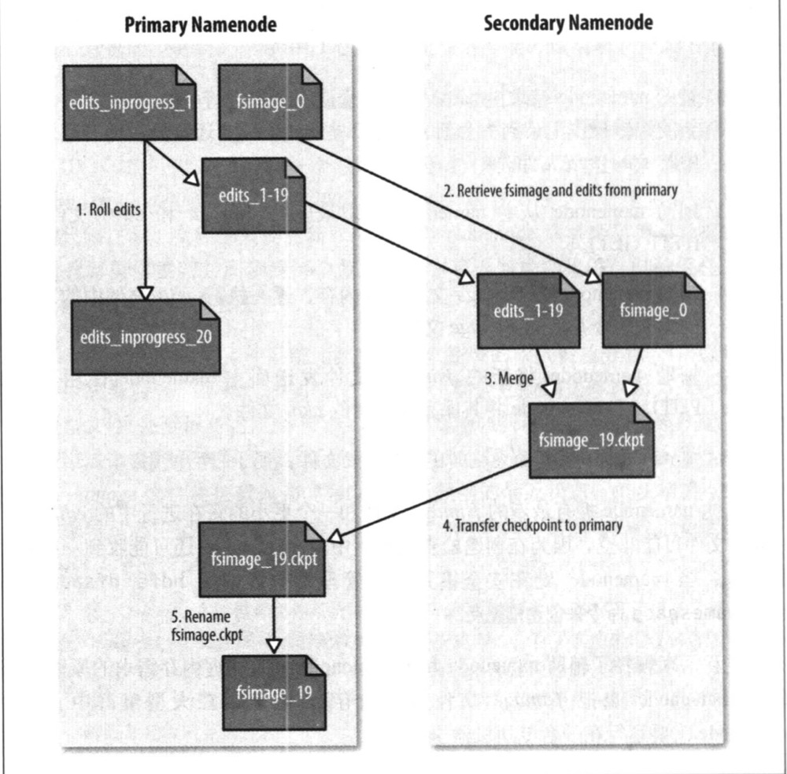

# 第十一章 管理Hadoop

第10章介绍如何搭建Hadoop集群，本章将关注如何保障系统平稳运行。

## 11.1 HDFS

### 11.1.1 永久性数据结构

作为管理员，深入了解namenode、辅助namenode和datanode等HDFS组件如何在磁盘上组织永久性数据结构非常重要。洞悉各文件的用法有助于进行故障诊断和故障检出。

#### 1. namenode的目录结构

运行中的namenode有如下所示目录：

```
 ${dfs.namenode.name.dir}
 |——————current
 |  |——————VERSION
 |  |——————edits_0000000000000000001-0000000000000000019
 |  |——————edits_inprogress_0000000000000000020
 |  |——————fsimage_0000000000000000000
 |  |——————fsimage_000000000000000000.md5
 |  |——————fsimage_0000000000e00000019
 |  |——————fsimage_0000000000e00000019md5 
 |  |______seen_txid
 |____in_use.lock
```

如第十章所述，dfs.namenode.name.dir属性描述了一组目录，各个目录存储着镜像内容，该机制使系统具备了一定的复原能力，特别是当其中一个目录是NFS的一个挂载时(推荐配置)。

VERSION文件是一个Java属性文件，其中包含正在运行的HDFS的版本信息。该文件一般包含以下内容：

```
#Mon Sep 29 09:54:36 BST 2014
namespaceID=1342387246
clusterID=CID-01b5c398-959c-4ea8-aae6-le0d9bd8bl42
cTime=0
storageType=NAME_NODE
blockpoolID=BP-526805057-127.0.0.1-1411980876842
layOutVersion=-57
```

属性layOutVersion是一个负整数，描述HDFS持久性数据结构(也成布局)的版本，但是该版本号与Hadoop发布包的版本号无关。只要布局变更，版本号就会递减(例如，版本号-57之后是-58)，此时，HDFS也需要升级，否则，磁盘仍使用的是旧版本的布局，新版本的namenode(或datanode)就无法正常工作。要想知道如何升级HDFS，请参见11.3.3节。

属性namespaceID是文件系统命名空间的唯一标识符，是在namenode首次格式化是创建的。clusterID是将HDFS集群作为一个整体赋予的唯一标识符，对于联邦HDFS(见3.2.4节)非常重要，这里一个集群有多个命名空间组成，每个命名空间有一个namenode管理。blockpoolID是数据块池的唯一标识符，数据块池包含了一个namenode管理的命名空间中的所有文件。

cTime属性标记了namenode存储系统的创建时间。对于刚刚格式化的存储系统，这个属性值为0；但是在文件系统升级之后，该值会更新到新的时间戳。

storageType属性说明该存储目录包含的是namenode的数据结构。

in_use.lock文件是一个锁文件，namenode使用该文件为存储目录加锁。可以避免其他namenode实例同时使用（可能会破坏）同一个存储目录的情况。

namenode的存储目录中还包含edits、fsimage和seen_txid等二进制文件。只有深人学习的工作机理，才能够理解这些文件的用途。

#### 2. 文件系统镜像和编辑日志

文件系统客户端执行写操作时(例如：创建或移动文件)，这些事务首先被记录到编辑日志中。namenode在内存中维护文件的元数据，当编辑日志被修改时，相关元数据信息也同步更新，内存中的元数据可以支持客户端的读请求。

编辑日志在概念上是单个实体，但是它体现在磁盘是的多个文件，每个文件称为一个 **段(segment)**，名称由前缀edits及后缀组成，后缀指示出该文件所包含的事务ID。任一时刻只有一个文件处于打开可写状态(前述例子中为edits_inprogress_0000000000000000020)，在每个事务完成之后，且向客户端发送成功代码前，文件都需要更新和同步，当namenode向多个目录写数据时，只有在所有写操作更新并同步到每个分布之后方可返回成功代码，以确保任何事务都不会因为机器故障而丢失。

每个fsimage文件都是文件系统元数据的一个完整的永久性检查点(前缀表示映像文件中的最后一个事务)并非每一个写操作都会更新该文件，因为fsimage是一个大型文件（甚至可高达几个GB)，如果频繁地执行写操作，会使系统运行极为缓慢。但这个特性根本不会降低系统的恢复能力，因为如果namenode发生故障，最近的fsimage文件将被载入到内存以重构元数据的最近状态，再从相关点开始，向前执行编辑日志中记录的每个事务。事实上，namenode在启动阶段正是这样做的(参见11.1.2节对安全模式的讨论)。

------

每个fsimage文件包含文件系统中的所有目录和文件inode的序列化信息。每个inode是一个文件或目录的元数据的内部描述方式。对于文件来说，包含的信息有“复本级别”(replicationlevel)、修改时间和访问时间、访问许可、块大小、组成一个文件的块等；对于目录来说，包含的信息有修改时间、访问许可和配额元数据等信息。

数据块存储在datanode中，fsimage文件并不描述datanode。取而代之的是，namenode将这种映射关系放在内存中，当datanode加入集群时，namenode向datanode索取块列表以建立映射关系，namenode还将定期征询datanode以确保它拥有最新的块映射。

------

如前所述，编辑日志会无限增长(即使物理上它是分布在多个edis文件中)，尽管这种情况对于namenode的运行没有影响，但由于需要恢复（非常长的）编辑日志中的各项事务，namenode的重启操作会比较慢。在这段时间内，文件系统将处于离线状态，这会有违用户的期望。

解决方案是运行辅助namenode，为主namenode内存中的文件系统元数据创建检查点。创建检查点的步骤如下所示(图11-1中也概略展现了前述的编辑日志和映像文件)。

（1）辅助namenode请求主namenode停止使用正在进行中的edits文件，这样新的编辑操作记录到一个新文件中，主namenode还会更新所有存储目录中的seen_txid文件；

（2）辅助namenode从主namenode获取最近的为口ge和文件（采用HTTP GET)。

（3）辅助namenode将fsiamge文件载入内存，逐一执行edits文件中的事务，创建新的合并后的fsimage文件。

（4）辅助namenode将新的fsimage文件发送回主namenode(使用HTTP PUT)，主namenode将其保存为临时的.ckpt文件。

（5）主namenode重新命名临时的fsimage文件，便于日后使用。

最终，主namenode拥有最新的fsimage文件和一个更小的正在进行中的edits文件(文件可能非空，因为在创建检查点过程中主namenode还可能收到一些编辑请求)。当namenode处在安全模式时，管理员也可调用`hdfs dfsadmin- saveNamespace`命令来创建检查点。

这个过程清晰解释了辅助namenode和主namenode拥有相近内存需求的原因（因为辅助namenode也把fsimage文件载人内存）。因此，在大型集群中，辅助namenode需要运行在一台专用机器上。

创建检查点的触发条件受两个配置参数控制：

- 通常情况下，辅助namenode每隔一小时（由dfs.namenode.checkpoint.period属性设置，以秒为单位）创建检查点；
- 从上一个检查点开始编辑日志大小已经达到100万个事务(dfs.namenode.checkpoint.txns属性设置)时，即使不到一小时，也会创建检查点，检查频率为每分钟一次(dfs.namenode.checkpoint.check.period属性设置，以秒为单位)。

------

实际用户可以使用-checkpoint选项来启动namenode，它将运行一个检查点过程以应对主namenode，这等价于运行一个辅助namenode。

------



​																	**图11-1 创建检查点过程**

#### 3. 辅助namenode的目录结构

辅助namenode的检查点目录(dfs.namenode.checkpoint.dir)的布局和主namenode的检查点目录的布局相同。这种设计方案的好处是，在主namenode发生故障时（假设没有及时备份，甚至在NFS上也没有），可以从辅助namenode恢复数据。

有两种实现方法：

- 将相关存储目录复制到新的namenode中；
- 使用`-importCheckpoint`选项启动namenode守护进程，从而将辅助namenode用作新的主namenode。借助该选项，仅当`dfs.namenode.name.dir`属性定义的目录中没有元数据时，辅助namenode会从`dfs.namenode.checkpoint.dir`属性定义的目录载人最新的检查点namenode元数据。

#### 4. datanode目录结构

和namenode不同的是，datanode的存储目录是初始阶段自动创建的，不需要额外格式化。datanode的关键文件和目录如下所示：

```
${dfs.datanode.data.dir}/
|— current
| |— BP-526805057-127.0.0.1-1411980876842
| |  |__current
| |  |— VERSION
| |  |— finalized
| |  |  |----blk_1073741825
| |  |  |----blk_1073741825_1001.meta
| |  |  |----blk_1073741826
| |  |  |----blk_1073741826_1002.meta
| |  |__ rbw
| |__VERSION
|_in_use.lock
```

HDFS数据块存储在以blk_为前缀名的文件中，文件名包含了该文件存储的块的原始字节数，每个块有一个相关联的带有后缀的元数据文件。元数据文件包括头部(含版本和类型信息)和该块各区段的一系列的校验和。

每一个块属于一个数据池，每个数据块都有自己的存储目录，目录根据数据块池ID形成和(namenode的VERSION文件中的数据块池ID相同)。

当目录中数据块的数量增加到一定规模时，datanode会创建一个子目录来存放新的数据块及其元数据信息。如果当前目录已经存储了64个(通过dfs.datanode.numblocks属性设置，默认值64)数据块时，就创建一个子目录。终极目标是设计一棵高扇出的目录树，即使文件系统中的块数量非常多，目录树的层数也不多。通过这种方式，datanode可以有效管理各个目录中的文件，避免大多数操作系统遇到的管理难题，即很多(成千上万个)文件放在同一个目录之中。

如果dfs.datanode.data.dir属性指定了不同磁盘上的多个目录，那么数据块会以**轮转(round-robin)**的方式写到各个目录中。注意，同一个datanode上的每个磁盘上的块不会重复，只有不同datanode之间的块才有可能重复。

### 11.1.2 安全模式

namenode启动时，首先将映像文件(fsimage)载入内存，并执行编辑日志(edits)中的各项编辑操作，一旦在内存中成功建立文件系统元数据的映像，则创建一个新的fsimage文件(该操作不需要借助辅助namenode)和一个空的编辑日志。在这个过程中，namenode运行在安全模式，意味着namenode的文件系统对于客户端来说是只读的。

------

严格来说，在安全模式下，只有那些访问文件系统元数据的文件系统操作是肯定成功执行的，例如显示目录列表等。对于读文件操作来说，只有集群中当前datanode上的块可用时，才能够工作。但文件修改操作（包括写、删除或重命名）均会失败。

------

需要强调的是，系统中的数据块的位置并不是由namenode维护的，而是以块列表的形式存储在datanode中(每个datanode存储的块组成的列表)。在系统的正常操作期间，namenode会在内存中保留所有块位置的映射信息。在安全模式下，各个datanode会向namenode发送最新的块列表信息，namenode了解到足够多的块位置信息之后，即可高效运行文件系统。如果namenode认为向其发送更新信息的datanode节点过少，则它会启动块复制进程，以将数据块复制到新的datanode节点。然而，在大多数情况下上述操作都是不之要的（因为实际上namenode只需继续等待更多datanode发送更新信息即可），并浪费了集群的资源。实际上，在安全模式下namenode并不向datanode发出任何块复制或块删除的指令。

如果满足 **最小复制条件(minimal replication condition)**，namenode会在30秒钟之后就退出安全模式，所谓的最小复本条件指的是在整个文件系统中有99.9％的块满足最小复本级别（默认值是1，由dfs.namenode.replication.min属性设置，参见表11-1)。

在启动一个刚刚格式化的HDFS集群时，因为系统中还没有任何块，所以namenode不会进人安全模式。

#### 进入和离开安全模式

要想查看namenode是否处于安全模式，可以运行以下dfsadmin命令：

```sh
hdfs dfsadmin -safemode get

Safe mode is ON
```

HDFS的网页界面也能够显示namenode是否处于安全模式。

​															**表11-1．安全模式的属性**

| 属性名称                            | 类型  | 默认值 | 说明                                                         |
| ----------------------------------- | ----- | ------ | ------------------------------------------------------------ |
| dfs.namenode.replication.min        | int   | 1      | 成功执行写操作所需要创建的最少复本数目（也称为最小复本级别） |
| dfs.namenode.safemode.threshold-pct | float | 0.999  | 在namenode退出安全模式之前，系统中满足最小复本级别（由dfs.namenode.replication.min定义）的块的比例。将这项值设为0更小会令namenode无法启动安全模式，设为高于1则永远不会退出安全模式 |
| dfs.namenode.safemode.extension     | int   | 30000  | 在满足最小复本条件(由dfs.namenode.safemode.threshold-pct定义）之后，namenode还需要处于安全模式的时间似毫秒为单位)。对于小型集群（几十个节点）来说，这项值可以设为0 |

有时，用户期望在执行某条命令之前namenode先退出安全模式，特别是在脚本中，使用wait选项能够达到这个目的：

```
%hdfs dfsadmin -safemde wait
# command to read or write a file
```

管理员随时可以让namenode进入或退出安全模式，这项功能在维护和升级集群时非常关键，因为需要确保数据在指定时段内是只读的。使用以下指令进人安全模式：

```sh
hdfs dfsadmin -safemde enter
```

前面提到过，namenode在启动阶段会处于安全模式。在此期间也可使用这条命令，从而确保namenode在启动完毕之后不禽开安仝模式。另一种使namenode永远处于安全模式的方法是将属性dfs.namenode.safemode.threshold-pct的值设为大于1。

运行以下指令即可使得namenode离开安全模式：

```sh
hdfs dfsadmin -safemde leave
Safe mode is OFF
```

### 11.1.3 日志审计

HDFS日志能够记录所有文件系统的访问请求，有些组织需要这项特性来进行审计。对日志进行审计是log4j在INFO级别实现的。在默认配置下，此项特性并未启用，但是通过在文件hadoop-env.sh中增加以下这行命令，很容易启动该日志审计特性：

```
export HDFS_AUDIT_LOGGER="INFO,RFAALDIT"
```

每个HDFS事件均在审计日志(pdfs-audit.log)中生成一行日志记录，下例说明如何对“/user/tom“目录执行list status命列出指定目录下的文件/目录的状态：

```
2014-09-30 21:33:30,484 INFO FSNamesystem.audit: allowed=true ugi=tom
(auth:SIMPLE) ip=/127.0.0.1 cmd=listStatus src=/user/tom dst=null
perm=null proto=rpc
```

### 11.1.4 工具

#### 1. dfsadmin工具

dfsadmin工具用途较广，既可以查找HDFS状态信息，又可在HDFS上执行管理操作。以hdfs dfsadmin形式调用，且需要超级用户权限。

表11-2列举了部分dfsadmin命令。要想进一步了解详情，可以用-help命令。

| 命令               | 说明                                                         |
| ------------------ | ------------------------------------------------------------ |
| -help              | 显示走命令的帮助，如果耒指明命令，则显示所有命令的帮助       |
| -report            | 显示文件系统的统计信息(类似于在网页界面上显示的内容)，以及所连接的各个datanode的信息 |
| -metasave          | 将某些信息存储到Hadoop日志目录中的一个文件中，包括正在被复制或删除的块的信息以及已连接的datanode列表 |
| -safemode          | 改变或查询安全模式，参见11.1.2节对安全模式的讨论             |
| -saveNamespace     | 将内存中的文件系统映像保存为一个新的fsimage文件，重置edits文件。该操作仅在安全模式下执行 |
| -fetchlmage        | 从namenode获取最新的fsimage文件，并保存为本地文件            |
| -refreshNodes      | 更新允许连接到namenode的datanode列表，参见11.3.2节对委任和解除节点的讨论 |
| -upgradeProgress   | 获取有关HDFS升级的进度信息或强制升级。参见11.3.3对升级的讨论 |
| -finalizeUpgrade   | 移除datanode和namenode的存储目录上的旧版本数据·这个操作一般在升级完成而且集群在新版本下运行正常的情况下执行。参见11.3.3节对升级的讨论 |
| -setQuota          | 设置目录的配额，即设置以该目录为根的整个目录树最多包含多少个文件和目录。这项配置能有效阻止用户创建大量小文件，从而保护namenode的内存（文件系统中的所有文件、目录和块的各项信息均存储在内存中） |
| -clrQuota          | 清理指定目录的配额                                           |
| -setSpaceQuota     | 设置目录的空间配额，以限制存储在目录树中的所有文件的总规模。分别为各用户指定有限的存储空间很有必要 |
| -clrSpaceQuota     | 清理指定的空间配额                                           |
| -refreshServiceAcl | 刷新namenode的服务级授权策略文件                             |
| -allowSnapshot     | 允许为指定的目录创建快照                                     |
| -disallowSnapshot  | 禁止为指定的目录创建快照                                     |

#### 2. 文件系统检查fsck工具

Hadoop提供fsck工具来检查HDFS中文件的健康情况，该工具会查找哪些在所有datanode中均缺失的块记忆多多或过少复本的块。如何检查某个小型集群的整个文件系统：

```sh
hdfs fsck /

.................... Status:HEALTHY
Total size:  511799225 B 
Total dirs: 10
Total files: 22
Total blocks (validated): 22 (avg. block size 23263601 B) 
Minimally replicated blocks: 22 (100.0%)
Over-replicated blocks: 0
Under-replicated blocks: 0
Mis-replicated blocks: 0
Default replication factor: 3
B Average block replication: 3.0 
Corrupt blocks: 0
Missing replicas: 
Number of data-nodes: 4
Number of racks: 1
The filesystem under path ‘/’ is HEALTHY
```

fsck然工具从给定路径(本例是文件系统的根目录)开始循环遍历文件系统的命名空间，并检查它所找到的所有文件。对于检查过的每个文件，都会打印一个点。并检查它所找到的所有文件。对于检查过的每个文件，都会打印一个点“.”。在此过程中，该工具获取文件数据块的元信息并找出问题或检查他们是否一致。注意，工具只是从namenode获取信息，并不与任何datanode进行交互，因此并不真正获取块数据。

Fsck输出文件的大部分内容都容易理解，以下仅说明部分信息。

- **过多复制的块**  指复本数超出最小复本级别的块。严格意义上讲，这并非一个大问题，HDFS会自动删除多余复本
- **仍需复制的块**  指复本数目低于最小复本级别的块。HDFS会自动为这些块创建新的复本，直到达到最小复本级别。可以调用hdfs dfsadmin -metasave指令了解正在复制的（或等待复制的）块的信息。
- **错误复制的块**    指违反块复本放置策略的块（参见3.6.2节“复本的放置”相关内容）。例如，在最小复本级别为3的多机架集群中，如果一个块的三个复本都存储在一个机架中，则可认定该块的复本放置错误，因为一个块的复本要分散在至少两个机架中，以提高可靠性。
- **损坏的块**  指所有复本均已损坏的块。如果虽然部分复本损坏，但至少还有一个复本完好，则该块就未损坏;namenode将创建新的复本，直到达到最小复本级别。
- **缺失的复本**   指在集群中没有任何复本的块。

损坏的块和缺失的块是最需要考虑的，因为这意味着数据已经丢失了。默认情况下，然猷不会对这类块进行任何操作，但也可以让执行如下某一项操作。

- **移动**  使用-move选项将受影响的文件移到HDFS的/lost+found目录。这些受影响的文件会分裂成连续的块链表，可以帮助用户挽回损失。
- **删除**   使用-delete选项删除受影响的文件。记住，在删除之后，这些文件无法恢复。

**查找一个文件的数据块** fsck工具能够帮助用户轻松找到属于特定文件的数据块。例如：

```sh
hdfs fsck /usr/tom/part-0007 -files -blocks  -racks

/user/tom/part-00007 25582428 bytes, 1 block(s): OK
0. blk_-B724870485760122836-1035 len=25582428 repl=3 [/default-rack/10.251.43.2:50010,
/default-rack/10.251.27.178:50010, /default-rack/10.251.123.163:50010] 
```

输出内容表示文件/user/tom/part-00007包含一个块，该块的三个复本存储在不同datanode。所使用的三个选项的含义如下。

- -files  选项显示第一行信息，包含文件名称、文件大小、块数量和健康情况
- -blocks 选项描述文件中各个块的信息，每个块一行
- -racks 选项显示各个块的机架位置和datanode的地址

如果不指定任何参数，运行不带参数的hdfsfsck命令会显示完整的使用说明。

#### 3. datanode块扫描器

每个datanode运行一个块扫描器，定期检测本节点上的所有块，从而在客户端读取到坏块之前及时地检测和修复坏块。可以依靠扫描器所维护的块列表依次扫描块，查看是否有校验和错误，扫描器还使用节流机制，来维持datanode的磁盘带宽(即，块扫描器工作时仅占用一小部分磁盘带宽)。

在默认情况下，块扫描器每隔三周就会检测块，以应对可能的磁盘故障，该周期由dfs.datanode.scan.period.hours属性设置，默认值是504小时。损坏的块被报给namenode，并被及时修复。

用户可以访问datanode的网页（http://datanode:50075/blockScannerReport）来获取该datanode的块检测报告。以下是一份报告的范例，很容易理解：

```
Total Blocks : 21131
Verified in last hour : 70
Verified in last day : 1767
Verified in last week : 7360
Verified in last four weeks : 20057
Verified in SCAN PERIOO : 20057
Not yet verified : 1074
Verified since restart : 35912
Scans since restart : 6S41
Scan errors since restart : 0
Transient scan errors : 0
Current scan rate limit KBps : 1024
Progress this period : 109%
Time leftlin cur period ：53.08%
```

通过指定listblocks参数，http://datanode:50075/blockScannerReport?Listblocks会在报告中列出该datanode上所有的块及其最新验证状态。下面节选部分内容（由于页面宽度限制，报告中的每行内容被显示成两行）：

```
blk_6035596358209321442 : status : ok type : none scan time :
0 not yet verified
blk_3065580480714947643 : status : ok type : remote scan time :
1215755306400 2008-07-11 05:48:26,400
blk_8729669677359108508 : status:ok type:local scan time :
1215755727B45 2008-07-11 05:55:27,345
```

第一列是块ID，接下来是一些键-值对：

- 块的状态(status)：failed(损坏的)或ok(良好的)。由最近一次块扫描是否检测到校验和来决定。
- 扫描类型(type)：local(本地的)、remote(远程的）或none(没有)。如果扫描操作由后台线程执行，则是local；如果扫描操作由客户端或其他datanode执行，则是remote；如果针对该块的扫描尚未执行，则是none。
- 扫描时间：从1970年1月1号午夜开始到扫描时间为止的毫秒数，另外也提供更易读的形式。

#### 4. 均衡器

随着时间的推移，多个datanode上的块分布会越来越不均匀，不均衡的集群会降低MapReduce的本地性，导致部分datanode相对更加繁忙。应避免出现这种情况。

均衡器(balancer)程序是一个Hadoop守护进程，它将块从忙碌的datanode移到相对空闲的datanode，从而重新分配块。同时坚持块复本的放置策略，将复本分散到不同的机架，以降低数据损坏率(参见3.6.2节)。它不断移动块，直到集群到达均衡。即每个datanode的使用率(该节点上已使用的空间和空间容量之间的比率)和集群的使用率(集群中已使用的空间与集群的空间容量之间的比率)非常接近，差距不超过给定的阀值。可调用下面指令启动均衡器：

```sh
start-balancer.sh
```

-threshold参数指定阈值(百分比格式)，以判定集群是否均衡。该标记是可选的；若省略，默认阈值是10％。任何时刻，集群中都只运行一个均衡器。

均衡器会一直运行，直到集群变得均衡为止，此时，均衡器不能移动任何块，或失去对namenode的联络。均衡器在标准日志目录中创建一个日志文件，记录它所执行的每轮重新分配过程（每轮次输出一行）。以下是针对一个小集群的日志输出(为适应页面显示要求稍微调整了格式)：

```
Time Stamp                 Iteration Bytes Already MovedLeft  To Move.        Being Moved
Mar 18, 2009 5:23:42 PM 0                  0 KB                219.21 MB        150.29 MB
Mar 18, 2009 5:27:14 PM 1                  195.24MB            22.45 MB         150.29 MB
The cluster is balanced. Exiting...
Balancing took 6.072933B333B333B minutes 
```

为了降低集群负荷、避免干扰其他用户，均衡器被设计为在后台运行。在不同节点之间复制数据的带宽也是受限的。默认值是很小的1MB/s，可以通过方hdfs-site.xml文件中的`dfs.datanode.balance.bandwidthPerSec`属性重新设定(单位是字节)。

## 11.2 监控

监控是系统管理的重要内容。在本小节中，概述Hadoop的监控工具，看它们如何与外部监控系统相结合。

监控的目标在于检测集群在何时未提供所期望的服务。主守护进程是最需要监控的，包括主namenode、辅助namenode和资源管理器。可以预期少数datanode和节点管理器会出现故障，特别是在大型集群中。因此，需要为集群预留额外的容量，即使有一小部分节点宕机，也不会影响整个系统的运作。

除了以下即将介绍的工具之外，管理员还可以定期运行一些测试作业来检查集群的健康状况。

### 11.2.1 日志

所有Hadoop的守护进程都会产生日志文件，这些文件非常有助于查明系统中已发生的事件。10.3.2节在i寸论系统日志文件时解释了如何配置这些文件。

#### 1. 设置日志级别


