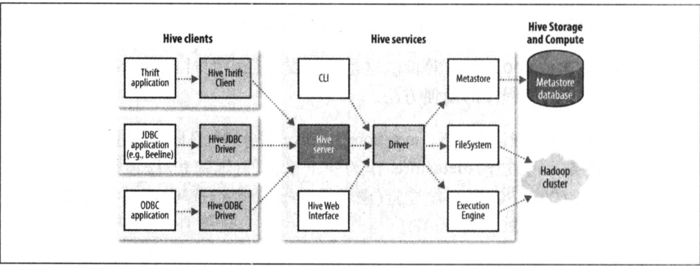
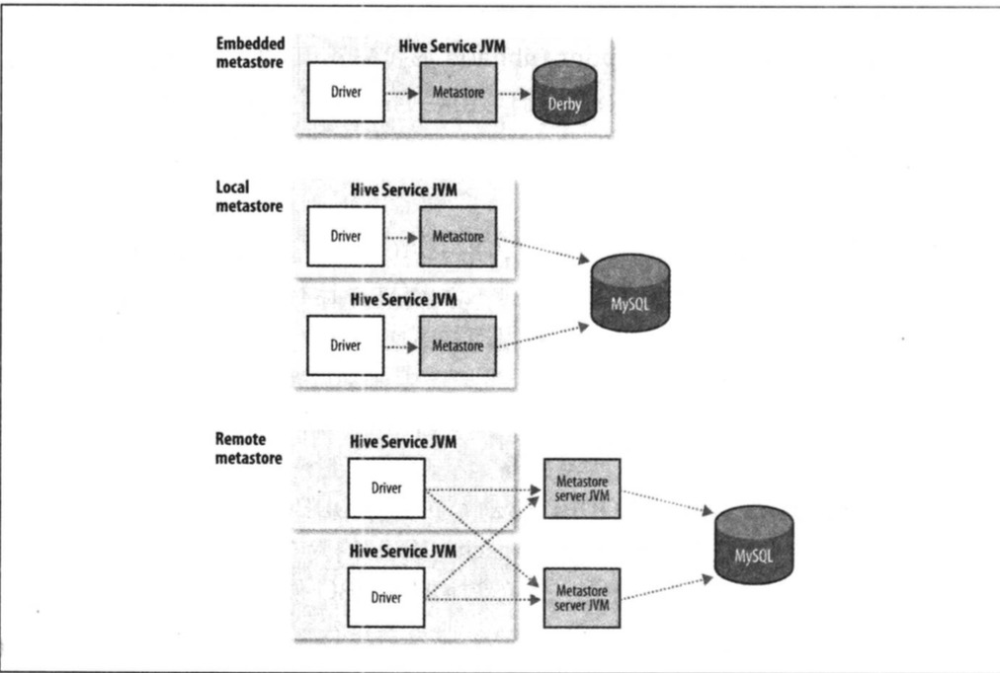

# 第十七章 关于Hive

HIve是一个构建在Hadoop上的数据仓库框架，其设计目的是让精通SQL技能但是编程较弱的数据分析师能够对存放在HDFS中的大规模数据集执行查询。目前，很多组织将Hive作为一个通用的，可伸缩的数据处理平台。

SQL适用于分析任务，不适合用来开发复杂的机器学习算法。其特点如下：

1. 简单、容易上手 (提供了类似 sql 的查询语言 hql)，使得精通 sql 但是不了解 Java 编程的人也能很好地进行大数据分析；
2. 灵活性高，可以自定义用户函数 (UDF) 和存储格式；
3. 为超大的数据集设计的计算和存储能力，集群扩展容易;
4. 统一的元数据管理，可与 presto／impala／sparksql 等共享数据；
5. 执行延迟高，不适合做数据的实时处理，但适合做海量数据的离线处理。

## 17.1 安装Hive

Hive一般在工作站上运行，把SQL查询站换位一系列在Hadoop集群上运行的作业，Hive把数据组织为表，通过这种方式为存储在HDFS上的数据赋予结构，元数据存储在metastore数据库中。

安装Hive非常简单，首先必须在本地安装和集群上相同版本的Hadoop。

**Tips Hive能和哪些版本的Hadoop共同工作**

每个Hive的发布版本都会被设计为能够和多个版本的Hadoop共同工作，一般而言，Hive支持Hadoop最新发布的稳定版本以及之前的老版本。

**1. 下载解压Hive**

下载所需版本的 Hive，这里我下载版本为 `cdh5.15.2`。下载地址：http://archive.cloudera.com/cdh5/cdh/5/

```shell
# 下载后进行解压
tar -zxvf hive-1.1.0-cdh5.15.2.tar.gz
```

**2. 配置环境变量**

```shell
vim /etc/profile
```

添加环境变量：

```shell
export HIVE_HOME=/usr/app/hive-1.1.0-cdh5.15.2
export PATH=$HIVE_HOME/bin:$PATH
```

使得配置的环境变量立即生效：

```shell
source /etc/profile
```

**3. 修改配置**

**(1) hive-env.sh**

进入安装目录下的 `conf/` 目录，拷贝 Hive 的环境配置模板 `flume-env.sh.template`

```shell
cp hive-env.sh.template hive-env.sh
```

修改 `hive-env.sh`，指定 Hadoop 的安装路径：

```shell
HADOOP_HOME=${your HADOOP_HOME}
```

**(2) hive-site.xml**

新建 hive-site.xml 文件，内容如下，主要是配置存放元数据的 MySQL 的地址、驱动、用户名和密码等信息：

```xml
<?xml version="1.0"?>
<?xml-stylesheet type="text/xsl" href="configuration.xsl"?>

<configuration>
  <property>
    <name>javax.jdo.option.ConnectionURL</name>
    <value>jdbc:mysql://hadoop001:3306/hadoop_hive?createDatabaseIfNotExist=true</value>
  </property>
  
  <property>
    <name>javax.jdo.option.ConnectionDriverName</name>
    <value>com.mysql.jdbc.Driver</value>
  </property>
  
  <property>
    <name>javax.jdo.option.ConnectionUserName</name>
    <value>root</value>
  </property>
  
  <property>
    <name>javax.jdo.option.ConnectionPassword</name>
    <value>root</value>
  </property>

</configuration>
```

**4. 拷贝数据库驱动**

将 MySQL 驱动包拷贝到 Hive 安装目录的 `lib` 目录下, MySQL 驱动的下载地址为：https://dev.mysql.com/downloads/connector/j/ , 在本仓库的[resources](https://github.com/heibaiying/BigData-Notes/tree/master/resources) 目录下我也上传了一份，有需要的可以自行下载。

**5. 初始化元数据库**

- 当使用的 hive 是 1.x 版本时，可以不进行初始化操作，Hive 会在第一次启动的时候会自动进行初始化，但不会生成所有的元数据信息表，只会初始化必要的一部分，在之后的使用中用到其余表时会自动创建；

- 当使用的 hive 是 2.x 版本时，必须手动初始化元数据库。初始化命令：

	```shell
	# schematool 命令在安装目录的 bin 目录下，由于上面已经配置过环境变量，在任意位置执行即可
	schematool -dbType mysql -initSchema
	```

这里我使用的是 CDH 的 `hive-1.1.0-cdh5.15.2.tar.gz`，对应 `Hive 1.1.0` 版本，可以跳过这一步。

**6. 启动**

由于已经将 Hive 的 bin 目录配置到环境变量，直接使用以下命令启动，成功进入交互式命令行后执行 `show databases` 命令，无异常则代表搭建成功。

```shell
hive
```

在 Mysql 中也能看到 Hive 创建的库和存放元数据信息的表


### Hive的Shell环境

Hive的shell环境是用户和Hive交互，发出HiveSQL命令的主要方式。HiveQL是HIve的查询语言。

第一次启动Hive时，可以通过列出Hive的表来检查Hive是否正常工作

```shell
hive > show tables;
OK
Time token: 0.473 seconds
```


使用-f选项可以运行指定文件的命令。

```hive
hive -f xxx.sql
```

相对于较短的脚本，可以使用-e选项在行内嵌入命令，此时不需要结束的分号。

```shell
hive -e 'select * from table'
```

## 17.2 示例

使用Hive查询数据集，步骤如下：

1. 把数据加载到Hive管理的存储，可以是本地，也可以是HDFS。

	```sql
	CREATE TABLE records (year STRING, temperature INT, quality INT)
	ROW FORMATE DELIMITED
		FILEDS TERMINATED BY '\t';
	```

	第一行声明一个records表，包含三列：year、temperature、quality，必须指明每列数据类型。第二行ROW FORMATE声明数据文件的每一行是由制表符分隔的文本，Hive按照这一格式读取数据：每行三个字段，分别对应于表中的三列，字段间使用制表符分割，每行以换行符分割。

2. 向Hive输入数据

	```sql
	load data local inpath "/usr/file/emp.txt" overwrite into table emp;
	```

	这一指令表示将指定的本地温江放入其仓库目录中，这只是个简单的文件系统操作，并不解析文件或把他存储为内部数据库格式，因为Hive并不强制使用人格特定文件格式，文件以原样逐字存储。

	在Hive的仓库目录中，表存储为目录，仓库目录由选项hive.metastore.warehouse.dir控制，默认值为：/usr/hive/warehouse。

3. 使用HQL语句操作数据

	```sql
	hive> select year, MAX(tempereture) from records where temperature != 9999 and quality in (0,1,4,5,9) Group by year;
	```

## 17.3 运行Hive

本节介绍运行Hive的一些实用技术，包括如何设置Hive使其能运行在Hadoop集群和共享的metastore上。

### 17.3.1 配置Hive

与Hadoop类似，Hive使用XML配置文件进行设置，配置文件为hivesite.xml，在conf目录下，通过这个文件，可以设置每次运行Hive时使用的选项。

可以通过四种方式对 Hive 的相关属性进行配置，分别介绍如下：

**1. 默认配置文件**

Hive默认值和Hadoop默认文件(core-default.xml、hdfs-default.xml、mapred-default.xml、yarn -site.xml)

**2. 自定义配置文件**

使用配置文件指定的配置是永久有效的。Hive 有以下三个可选的配置文件：

- hive-site.xml ：Hive 的主要配置文件；
- hivemetastore-site.xml： 关于元数据的配置；
- hiveserver2-site.xml：关于 HiveServer2 的配置。

****

**3. hiveconf**

在启动命令行 (Hive CLI / Beeline) 的时候使用 `--hiveconf` 指定配置，这种方式指定的配置作用于整个 Session。

```sh
hive -hiveconf fs.default=hdfs://localhost \
		 -hiveconf mapreduce.framework.name=yarn \
```

**4. set**

交互式环境下 (Hive CLI / Beeline)，使用 set 命令指定。这种设置的作用范围也是 Session 级别的，配置对于执行该命令后的所有命令生效。set 兼具设置参数和查看参数的功能。如下：

```sh
set hive.exec.scratchdir=/tmp/mydir;
No rows affected (0.025 seconds)
set hive.exec.scratchdir;
+----------------------------------+--+
|               set                |
+----------------------------------+--+
| hive.exec.scratchdir=/tmp/mydir  |
+----------------------------------+--+
```

配置的优先顺序如下 (由低到高)：
		hive-site.xml- >hivemetastore-site.xml`- > `hiveserver2-site.xml` - >` -- hiveconf`- > `set`

**执行引擎**

Hive的原始设计时以MapReduce作为执行引擎，目前，Hive的执行引擎还包括Apache Tez，此外Hive对Spark的支持也在开发中。Tez和Spark都是通用有向无环图 (DAG)引擎，比MapReduce更加灵活，性能更为优越。通过属性hive.execution.engine来控制。

**日志记录**

可以在本地文件系统的${java.io.tmpdir}/{user.name}/hive.log中找到Hive的错误日志。日志的配置放在conf/hive-log4j.properties中或者使用命令：hive -hiveconf hive.root.logger=DEBUG,console

### 17.3.2 Hive服务

Hive的shell环境只是Hive命令提供的其中一项服务，可以在运行时使用--service选项指明要使用哪种服务，hive --service help可以获得可用的服务列表：

- cli  Hive的命令行接口(Shell环境)，这是默认服务
- hivServer2 让Hive以提供Thrift服务的服务器形式运行，允许用不同语言编写的客户端进行访问，hiveserver2在支持认证和多用户并发方面比原始的hiveserver有很大改进。使用Thrift、JDBC和ODBC连接器的客户端需要运行Hive服务器和Hive通信，通过设置**hive.server2.thrift.port**属性来指明服务器监听的端口号。
- beeline 以嵌入方式工作的Hive命令接口，类似于常规的CLI或者使用JDBC连接到的一个hiveServer2进程。
- hwi Hive的Web接口，在没有安装任何客户端软件的情况下，这个简单的Web接口可以代替CLI
- jar 运行类路径中同时包含hadoop和hive类java程序的简便方法
- metastore 默认情况下，metastore和Hive服务运行在同一个进程里，使用这个服务可以让metastore作为一个单独(远程)进程运行，通过设置METASTORE_PORT环境变量指定服务器监听端口。

**Hive客户端**

如果以服务器方式运行Hive(hive --service hiveserver2)，可以在应用程序中以不同的机制连接到服务器：

- Thrift客户端 

	Hive服务器提供Thrift服务的运行，因此支持Thrift的编程语言都可以与之交互。

- JDBC驱动

	Hive提供了Type 4的JDBC驱动，定义在org.apache.hadoop.hive.jdbc.HiveDriver类中。在以jdbc:hive2://host:port/dbname形式配置JDBC URI以后，Java应用程序可以在指定主机和端口连接在另一个进程中运行的Hive服务器。

Beeline CLI使用JDBC驱动与Hive通信。

- ODBC通信 

	Hive的ODBC驱动允许支持ODBC协议的应用程序连接到Hive

Hive客户端与服务之间的联系如图17-1所示。



​																		**图17-1 Hive体系结构**

### 17.3.3 MeteStore

metastore是Hive元数据的集中存放池。metastore包括两部分：服务和后台数据的存储。默认情况下，metastore服务和Hive服务运行在同一个JVM中，它包含一个内嵌的以本地磁盘作为存储的Derby数据库实例，称为内嵌metastore配置(embedded metastore configuration)，如图17-2所示：



Hive metastore的三种方式：

- 内嵌metastore配置：Hive入门最简单的方法，但是每次只有一个内嵌Derby数据库可以访问磁盘上的数据库文件，每次只能为每个metastore打开一个Hive会话；
- 本地metastore配置：使用独立数据库支持多会话(多用户)，metastore服务和Hive服务仍然运行在同一个进程中，但是连接另一个进程中的数据库，在同一台机器上或远程机器上。
- 远程metastore配置：多个metastore服务器和Hive服务运行在不同的进程中，这样，数据库可以完全设置于防火墙后，客户端不需要数据库凭据(用户名和密码)，提供了更好的可管理性和安全。

任何JDBC兼容的数据库都可以通过表17-1列出的javax.jdo.option.*配置属性来供metastore使用：

| 属性名称                              | 类型          | 默认值                                        | 描述                                                         |
| ------------------------------------- | ------------- | --------------------------------------------- | ------------------------------------------------------------ |
| Hive.metastore.warehouse.dir          | URI           | /usr/hive/warehouse                           | 相对于f s.default.name的目录，存储托管表                     |
| Hive.metastore.uris                   | 逗号分隔的URI |                                               | 默认用当前metastore，或连接URI指定的一个或多个远程metastore服务 |
| Javax.jdo.option.ConnectionURL        | URI           | Jdbc:derby:databaseName=mestore b;create=true | metasore数据库的JDBC URI                                     |
| Javax.jdo.option.ConnectionDriverName | String        | org.apache.derby.jdbc.EmbeddedDriver          | JDBC驱动器类名                                               |
| Javax.jdo.option.ConnectionUserName   | String        | APP                                           | JDBC用户名                                                   |
| Javax.jdo.option.ConnectionPassword   | String        | mine                                          | JDBC密码                                                     |

对于独立的metastore，MySQL是比较常见选择，此时属性设置为：

```xml
Javax.jdo.option.ConnectionURL=jdbc:mysql//host/dbname?createDatabaseIfNotExist=true
Javax.jdo.option.ConnectionDriverName=com.mysql.jdbc.Driver
Javax.jdo.option.ConnectionUserName=${mysql_usernmae}
Javax.jdo.option.ConnectionPassword=${mysql_password}
```

将 MySQL 驱动包拷贝到 Hive 安装目录的 `lib` 目录下。

## 17.4 Hive与传统数据库相比

### 17.4.1 读时模式与写时模式

在传统数据库中，表模式是在数据加载时强制确定的，若加载时发现数据不符合模式，则拒绝加载数据，因为数据在写入数据库时对照模式进行检查，这一设计称为**写时模式(schema on wirte)**。

Hive对数据的验证不在写入时进行，而在查询时进行，称为**读时模式(schema on read)**。

读时模式加载数据非常迅速，因为不需要读取数据来进行解析，再进行序列化并以数据可内部格式存入粗盘，数据加载操作仅仅是**文件的复制或移动**。

写时模式有利于提升查询性能，因为数据库可以对列进行索引，并对数据进行压缩，但是加载数据时间较长。

### 17.4.2 更新、事务和索引

更新、事务和索引是传统数据库最重要的特性。Hive被设计为用MapReduce操作hdfs数据，全表扫描是常态操作，而表更新则是通过把数据变换后放入新表实现的。

随着Hive版本迭代，现支持Inster INTO语句为表添加新的数据文件，UPDATE、DELETE更新和删除操作。HDFS不提供就地文件更新，因此插入、更新和删除操作引起的一切变化都被保存在一个较小的增量文件中，由metastore后台运行的MapReduce作业会定期将这些增量文件合并到**基表文件**中。

Hive还引入表级(table-level)锁和分区级(partition-level)锁，可以防止一个进程删除另一个进程读取的表数据。默认未启用锁。

Hive的索引分为两类：紧凑（compact）索引和位图（bitmap）索引：

1）**紧凑索引存储每个值的hdfs块号**，因此存储不会占用很多空间，且值被聚集存储于相近行的情况，索引仍然有效

2）**位图索引使用压缩的位集合来高效存储具有某个特征值的行**，这种索引适用于具有较少可能值的列。

### 17.4.3 其他SQL-on-Hadoop技术

针对Hive的局限性，Clousdera Impala是升级的交互式SQL引擎，Impala在性能上比基于MapReduce的是Hive要高出一个数量级。

其他几个著名的开源Hive替代技术包括：FaceBook Presto、Apache Drill、Spark SQL。

## 17.5 HiveQL

Hive的SQL方言被称为HQL，是SQL-92、MySQL和Orale SQL语言的混合体。表17-2给出了sql与HiveQL较高层次的比较：

表17-2 SQL与HiveQL的概要比较

| 特性                     | sql                  | HiveQL                           |
| ------------------------ | -------------------- | -------------------------------- |
| 更新                     | insert update delete | insert                           |
| 事务                     | 支持                 | 支持（表级和分区级）             |
| 索引                     | 支持                 | 支持                             |
| 延迟                     | 亚秒级               | 分钟级                           |
| 函数                     | 支持                 | 支持                             |
| 多表插入                 | 不支持               | 支持                             |
| create table as select * | 有些支持             | 支持                             |
| 选择                     | SQL-92               | FRom子句中只能有一个表或视图     |
| 连接                     | SQL-92               | 内连接，外链接，半连接，映射连接 |
| 子查询                   | 任何子句             | 只能在FROM子句中                 |
| 视图                     | 可更新               | 只读                             |
| 扩展点                   | 用户定义函数         | 用户定义函数                     |
|                          | 存储过程             | MapReduce脚本                    |

### 17.5.1 数据类型

Hive支持原子和复杂数据类型，原子类型包括：**tinyint，smallint，int，bigint**，**float，double**，**boolean，string，binary，timestamp**；复杂类型包括：**array、map、struct**。

​															**表17-3 Hive数据类型**

| 大类                                    | 类型                                                         |
| --------------------------------------- | ------------------------------------------------------------ |
| **Integers（整型）**                    | TINYINT—1 字节的有符号整数 SMALLINT—2 字节的有符号整数 INT—4 字节的有符号整数 BIGINT—8 字节的有符号整数 |
| **Boolean（布尔型）**                   | BOOLEAN—TRUE/FALSE                                           |
| **Floating point numbers（浮点型）**    | FLOAT— 32位单精度浮点型 DOUBLE—64位双精度浮点型              |
| **Fixed point numbers（定点数）**       | DECIMAL—用户自定义任意精度定点数，比如 DECIMAL(7,2)          |
| **String types（字符串）**              | STRING—指定字符集的变长字符序列(最大2GB) VARCHAR—具有最大长度限制的字符序列 CHAR—固定长度的字符序列。 |
| **Date and time types（日期时间类型）** | TIMESTAMP — 储存精度为纳秒级时间戳     TIMESTAMP WITH LOCAL TIME ZONE — 时间戳，纳秒精度      DATE—日期类型，包括：年月日三部分； Hive提供了在Hive时间戳、Unix时间戳、字符串之间转换的UDF |
| **Binary types（二进制类型）**          | BINARY—变长二进制字节序列                                    |

| 类型       | 描述                                                         | 示例                                   |
| ---------- | ------------------------------------------------------------ | -------------------------------------- |
| **STRUCT** | 类似于对象，是字段的集合，字段的类型可以不同，可以使用 `名称.字段名` 方式进行访问 | STRUCT ('xiaoming', 12 , '2018-12-12') |
| **MAP**    | 键值对的集合，可以使用 `名称[key]` 的方式访问对应的值        | map('a', 1, 'b', 2)                    |
| **ARRAY**  | 数组是一组具有相同类型和名称的变量的集合，可以使用 `名称[index]` 访问对应的值 | ARRAY('a', 'b', 'c', 'd')              |

### 17.5.2 操作与函数

