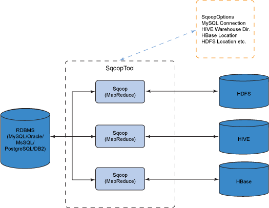
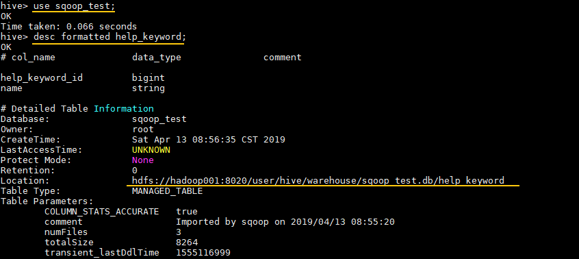

# 第十七章 关于Sqoop

Hadoop平台的最大优势在于它支持不同形式的数据，HDFS能够可靠地存储日志和来自不同渠道的数据，MaoReduce程序能够分析多种数据格式，抽取相关信息并将多个数据集组合成非常有用的结果。

通常，一个组织中有价值的数据都存储在关系型数据库(RDBMS)等结构化存储器中，Apache Sqoop允许用户将数据从结构化存储器抽取到Hadoop中，用于进一步处理。抽取的数据可以被MapReduce程序使用，可以被类似于Hive的工具使用，完成最终结果分析，Sqoop便可以将这些结果导回数据存储器。

- 导入数据：从 MySQL，Oracle 等关系型数据库中导入数据到 HDFS、Hive、HBase 等分布式文件存储系统中；
- 导出数据：从 分布式文件系统中导出数据到关系数据库中。

其原理是将执行命令转化成 MapReduce 作业来实现数据的迁移，如下图：



## 15.1 获取与安装Sqoop

版本选择：目前 Sqoop 有 Sqoop 1 和 Sqoop 2 两个版本，但是截至到目前，官方并不推荐使用 Sqoop 2，因为其与 Sqoop 1 并不兼容，且功能还没有完善，所以这里优先推荐使用 Sqoop1。


### 15.1.1 下载并解压

下载所需版本的 Sqoop ，这里我下载的是 `CDH` 版本的 Sqoop 。下载地址为：http://archive.cloudera.com/cdh5/cdh/5/

```sh
# 下载后进行解压
tar -zxvf  sqoop-1.4.6-cdh5.15.2.tar.gz
```

### 15.1.2 配置环境变量

```sh
# vim /etc/profile
```

添加环境变量：

```sh
export SQOOP_HOME=/usr/local/sqoop/sqoop-1.4.6-cdh5.15.2
export PATH=$SQOOP_HOME/bin:$PATH
```

使得配置的环境变量立即生效：

```sh
# source /etc/profile
```

###15.1.3 修改配置

进入安装目录下的 `conf/` 目录，拷贝 Sqoop 的环境配置模板 `sqoop-env.sh.template`

```sh
cp sqoop-env-template.sh sqoop-env.sh
```

修改 `sqoop-env.sh`，内容如下 (以下配置中 `HADOOP_COMMON_HOME` 和 `HADOOP_MAPRED_HOME` 是必选的，其他的是可选的)：

```sh
# Set Hadoop-specific environment variables here.
#Set path to where bin/hadoop is available
export HADOOP_COMMON_HOME=/usr/local/hadoop/hadoop-2.6.0-cdh5.15.2

#Set path to where hadoop-*-core.jar is available
export HADOOP_MAPRED_HOME=/usr/local/hadoop/hadoop-2.6.0-cdh5.15.2

#set the path to where bin/hbase is available
export HBASE_HOME=/usr/local/hbase/hbase-1.2.0-cdh5.15.2

#Set the path to where bin/hive is available
export HIVE_HOME=/usr/local/hive/hive-1.1.0-cdh5.15.2

#Set the path for where zookeper config dir is
export ZOOCFGDIR=/usr/local/zookeeper/zookeeper-3.4.13/conf
```

### 15.1.4 拷贝数据库驱动

将 MySQL 驱动包拷贝到 Sqoop 安装目录的 `lib` 目录下, 驱动包的下载地址为 https://dev.mysql.com/downloads/connector/j/ 。

### 15.1.5 验证

由于已经将 sqoop 的 `bin` 目录配置到环境变量，直接使用以下命令验证是否配置成功：

```sh
sqoop version
```

出现对应的版本信息则代表配置成功：


这里出现的两个 `Warning` 警告是因为我们本身就没有用到 `HCatalog` 和 `Accumulo`，忽略即可。Sqoop 在启动时会去检查环境变量中是否有配置这些软件，如果想去除这些警告，可以修改 `bin/configure-sqoop`，注释掉不必要的检查。

```sh
# Check: If we can't find our dependencies, give up here.
if [ ! -d "${HADOOP_COMMON_HOME}" ]; then
  echo "Error: $HADOOP_COMMON_HOME does not exist!"
  echo 'Please set $HADOOP_COMMON_HOME to the root of your Hadoop installation.'
  exit 1
fi
if [ ! -d "${HADOOP_MAPRED_HOME}" ]; then
  echo "Error: $HADOOP_MAPRED_HOME does not exist!"
  echo 'Please set $HADOOP_MAPRED_HOME to the root of your Hadoop MapReduce installation.'
  exit 1
fi

## Moved to be a runtime check in sqoop.
if [ ! -d "${HBASE_HOME}" ]; then
  echo "Warning: $HBASE_HOME does not exist! HBase imports will fail."
  echo 'Please set $HBASE_HOME to the root of your HBase installation.'
fi

## Moved to be a runtime check in sqoop.
if [ ! -d "${HCAT_HOME}" ]; then
  echo "Warning: $HCAT_HOME does not exist! HCatalog jobs will fail."
  echo 'Please set $HCAT_HOME to the root of your HCatalog installation.'
fi

if [ ! -d "${ACCUMULO_HOME}" ]; then
  echo "Warning: $ACCUMULO_HOME does not exist! Accumulo imports will fail."
  echo 'Please set $ACCUMULO_HOME to the root of your Accumulo installation.'
fi
if [ ! -d "${ZOOKEEPER_HOME}" ]; then
  echo "Warning: $ZOOKEEPER_HOME does not exist! Accumulo imports will fail."
  echo 'Please set $ZOOKEEPER_HOME to the root of your Zookeeper installation.'
fi
```

### 15.1.6 Sqoop名称

不带参数运行Sqoop没有什么意义，Sqoop组成一组工具或命令，Sqoop help查看所有命令：

```sh
Available commands:
  codegen            Generate code to interact with database records
  create-hive-table  Import a table definition into Hive
  eval               Evaluate a SQL statement and display the results
  export             Export an HDFS directory to a database table
  help               List available commands
  import             Import a table from a database to HDFS
  import-all-tables  Import tables from a database to HDFS
  import-mainframe   Import datasets from a mainframe server to HDFS
  job                Work with saved jobs
  list-databases     List available databases on a server
  list-tables        List available tables in a database
  merge              Merge results of incremental imports
  metastore          Run a standalone Sqoop metastore
  version            Display version information

See 'sqoop help COMMAND' for information on a specific command.
```

Sqoop help import查看导入数据命令详情：

```sh
Command arguments:
	--connect <jdbc-url> Specify JDBC connect String
	--driver <class-name> Manally specify JDBC driver class to use
	--hadoop-home <dir> Override $HADOOP_HOME
	--help 
	-p Read password from console
	--password <password> Set authentication password
	--username <username> Set authentication username
	--verbose
	...
```

## 15.2 Sqoop连接器

Sqoop拥有一个可扩展的框架，使得它能够从(向)任何支持批量数据传输的外部存储系统导入(导出)数据。Sqoop连接器就是这个框架下的一个模块化组件，用于支持Sqoop的导入和导出操作。Sqoop附带的连接器可以支持大多数常用的关系型数据库，包括MySQL、PostgreSQL、Oracle、SQL Server、DB2和Metzza，同时还有一个JDBC连接器，用于连接支持JDBC协议的数据库。

## 15.3 数据导入

在安装了Sqoop之后，可以用它将数据导入到Hadoop。

### 15.3.1 MySQL导入

**1. 查询MySQL所有数据库**

通常用于 Sqoop 与 MySQL 连通测试：

```sh
sqoop list-databases \
--connect jdbc:mysql://hadoop001:3306/ \
--username root \
--password root
```


**2. 查询指定数据库中所有数据表**

```sh
sqoop list-tables \
--connect jdbc:mysql://hadoop001:3306/mysql \
--username root \
--password root
```

**3. MySQL数据导入到HDFS**

示例：导出 MySQL 数据库中的 `help_keyword` 表到 HDFS 的 `/sqoop` 目录下，如果导入目录存在则先删除再导入，使用 3 个 `map tasks` 并行导入。

> 注：help_keyword 是 MySQL 内置的一张字典表，之后的示例均使用这张表。

```sh
sqoop import \
--connect jdbc:mysql://hadoop001:3306/mysql \     
--username root \
--password root \
--table help_keyword \           # 待导入的表
--delete-target-dir \            # 目标目录存在则先删除
--target-dir /sqoop \            # 导入的目标目录
--fields-terminated-by '\t'  \   # 指定导出数据的分隔符
-m 3                             # 指定并行执行的 map tasks 数量
```

日志输出如下，可以看到输入数据被平均 `split` 为三份，分别由三个 `map task` 进行处理。数据默认以表的主键列作为拆分依据，如果你的表没有主键，有以下两种方案：

- 添加 `-- autoreset-to-one-mapper` 参数，代表只启动一个 `map task`，即不并行执行；
- 若仍希望并行执行，则可以使用 `--split-by ` 指明拆分数据的参考列。


**4. 导入验证**

```sh
# 查看导入后的目录
hadoop fs -ls  -R /sqoop
# 查看导入内容
hadoop fs -text  /sqoop/part-m-00000
```

查看 HDFS 导入目录,可以看到表中数据被分为 3 部分进行存储，**这是由指定的并行度决定的**。


**MySQL数据导入到Hive**

Sqoop 导入数据到 Hive 是通过先将数据导入到 HDFS 上的临时目录，然后再将数据从 HDFS 上 `Load` 到 Hive 中，最后将临时目录删除。可以使用 `target-dir` 来指定临时目录。

```sh
sqoop import \
  --connect jdbc:mysql://hadoop001:3306/mysql \
  --username root \
  --password root \
  --table help_keyword \        # 待导入的表     
  --delete-target-dir \         # 如果临时目录存在删除
  --target-dir /sqoop_hive  \   # 临时目录位置
  --hive-database sqoop_test \  # 导入到 Hive 的 sqoop_test 数据库，数据库需要预先创建。不指定则默认为 default 库
  --hive-import \               # 导入到 Hive
  --hive-overwrite \            # 如果 Hive 表中有数据则覆盖，这会清除表中原有的数据，然后再写入
  -m 3                          # 并行度
```

导入到 Hive 中的 `sqoop_test` 数据库需要预先创建，不指定则默认使用 Hive 中的 `default` 库。

```sh
 # 查看 hive 中的所有数据库
 hive>  SHOW DATABASES;
 # 创建 sqoop_test 数据库
 hive>  CREATE DATABASE sqoop_test;
```

如果执行报错 `java.io.IOException: java.lang.ClassNotFoundException: org.apache.hadoop.hive.conf.HiveConf`，则需将 Hive 安装目录下 `lib` 下的 `hive-exec-**.jar` 放到 sqoop 的 `lib` 。

```sh
[root@hadoop001 lib]# ll hive-exec-*
-rw-r--r--. 1 1106 4001 19632031 11 月 13 21:45 hive-exec-1.1.0-cdh5.15.2.jar
[root@hadoop001 lib]# cp hive-exec-1.1.0-cdh5.15.2.jar  ${SQOOP_HOME}/lib
```

**MySQL导入数据到HBase**

将 `help_keyword` 表中数据导入到 HBase 上的 `help_keyword_hbase` 表中，使用原表的主键 `help_keyword_id` 作为 `RowKey`，原表的所有列都会在 `keywordInfo` 列族下，目前只支持全部导入到一个列族下，不支持分别指定列族。

```sh
sqoop import \
    --connect jdbc:mysql://hadoop001:3306/mysql \
    --username root \
    --password root \
    --table help_keyword \              # 待导入的表
    --hbase-table help_keyword_hbase \  # hbase 表名称，表需要预先创建
    --column-family keywordInfo \       # 所有列导入到 keywordInfo 列族下 
    --hbase-row-key help_keyword_id     # 使用原表的 help_keyword_id 作为 RowKey
```

导入的 HBase 表需要预先创建：

```sh
# 查看所有表
hbase> list
# 创建表
hbase> create 'help_keyword_hbase', 'keywordInfo'
# 查看表信息
hbase> desc 'help_keyword_hbase'
```

### 15.3.2 文本与二进制格式

Sqoop可以将数据导入成几种不同的格式：

- 文本文件是一种可读的数据表示格式，但是不能保存二进制字段
- 二进制文件格式，如SequenceFile格式，Avro格式或Parquet格式文件，这些格式支持数据压缩、MapReduce并行处理同一文件的不同部分

## 15.4 数据导出

### 15.4.1 HDFS导出到MySQL

```sh
sqoop export  \
    --connect jdbc:mysql://hadoop001:3306/mysql \
    --username root \
    --password root \
    --table help_keyword_from_hdfs \        # 导出数据存储在 MySQL 的 help_keyword_from_hdf 的表中
    --export-dir /sqoop  \
    --input-fields-terminated-by '\t'\
    --m 3 
```

表必须预先创建，建表语句如下：

```sql
CREATE TABLE help_keyword_from_hdfs LIKE help_keyword ;
```

### 15.4.2  Hive导出到MySQL

由于 Hive 的数据是存储在 HDFS 上的，所以 Hive 导入数据到 MySQL，实际上就是 HDFS 导入数据到 MySQL。

#### 1. 查看Hive表在HDFS的存储位置

```sh
# 进入对应的数据库
hive> use sqoop_test;
# 查看表信息
hive> desc formatted help_keyword;
```

`Location` 属性为其存储位置：



#### 2. 执行导出命令

```sh
sqoop export  \
    --connect jdbc:mysql://hadoop001:3306/mysql \
    --username root \
    --password root \
    --table help_keyword_from_hive \
    --export-dir /user/hive/warehouse/sqoop_test.db/help_keyword  \
    -input-fields-terminated-by '\001' \             # 需要注意的是 hive 中默认的分隔符为 \001
    --m 3 
```

MySQL 中的表需要预先创建：

```sql
CREATE TABLE help_keyword_from_hive LIKE help_keyword ;
```

### 15.4.3 全库导出

Sqoop 支持通过 `import-all-tables` 命令进行全库导出到 HDFS/Hive，但需要注意有以下两个限制：

- 所有表必须有主键；或者使用 `--autoreset-to-one-mapper`，代表只启动一个 `map task`;
- 你不能使用非默认的分割列，也不能通过 WHERE 子句添加任何限制。

**全库导出到 HDFS**：

```sh
sqoop import-all-tables \
    --connect jdbc:mysql://hadoop001:3306/数据库名 \
    --username root \
    --password root \
    --warehouse-dir  /sqoop_all \     # 每个表会单独导出到一个目录，需要用此参数指明所有目录的父目录
    --fields-terminated-by '\t'  \
    -m 3
```

**全库导出到 Hive：**

```sh
sqoop import-all-tables -Dorg.apache.sqoop.splitter.allow_text_splitter=true \
  --connect jdbc:mysql://hadoop001:3306/数据库名 \
  --username root \
  --password root \
  --hive-database sqoop_test \         # 导出到 Hive 对应的库   
  --hive-import \
  --hive-overwrite \
  -m 3
```

## 15.5 生成代码

为了能够将数据表的内容写入到HDFS，Sqoop同时还生成了一个Java源文件(widgets.java)，保存在当前的本地目录中。将关系型数据库中的表映射为一个Java类，在该类中有各列对应的各个字段。

```
qoop codegen \
--connect jdbc:mysql://node1:3306/databaseName \
--username root \
--password  \
--table staff \
--bindir /opt/module/sqoop/staff \    ###文件夹需要存在
--class-name Staff \
--fields-terminated-by "\t"
--outdir 
```

## 15.6 深入连接数据库导入

Sqoop是通过一个MapReduce作业从数据库导入一个表，MR作业从数据库抽取一行行记录，然后将记录写入HDFS。

图15-1粗略展示了Sqoop、数据库和HDFS交互的过程。Sqoop使用Java语言编写，Java提供了一个称为JDBC(Java Database Connectivity)的API，应用程序可以使用JDBC API访问RDBMS中的数据。大多数数据库厂商都提供了JDBC驱动工具。

																		**图15-1 Sqoop导入过程**

根据访问数据库链接的URL，Sqoop预测应该加载哪个驱动程序，如MySQL JDBC驱动，因此需要预先安装需要的数据库驱动程序在客户端(详见Sqoop安装与配置)。

在导入开始前，Sqoop使用JDBC来检查将要导入的表，将SQL列与列类型映射为Java数据类型和类属性。在MapReduce应用中，将使用这些对应的Java类型来保存字段中的值；Sqoop代码生成器使用生成的Java类文件，创建对应的表并抽取记录。

Hadoop的`DBWritable`接口提供序列化与反序列化方法，将Sqoop代码生成器所创建的类与JDBC进行交互：

```java
public interface DBWritable {

  /**
   * Sets the fields of the object in the {@link PreparedStatement}.
   * @param statement the statement that the fields are put into.
   * @throws SQLException
   */
	public void write(PreparedStatement statement) throws SQLException;
	
	/**
	 * Reads the fields of the object from the {@link ResultSet}. 
	 * @param resultSet the {@link ResultSet} to get the fields from.
	 * @throws SQLException
	 */
	public void readFields(ResultSet resultSet) throws SQLException ; 
}
```

JDBC的`ResultSet`接口提供从查询结果中检索出记录的游标，readFields( )方法用ResultSet中一行数据的列来填充Sqoop代码生成器生成的类对象字段；write( )方法导出数据，将新的生成类插入表。

Sqoop启动的MapReduce作业用到一个InputFormat，可以通过JDBC从一个数据库表中读取部分内容，Hadoop提供的DataDrivenDBInputFormat能够为几个Map任务对查询结果进行划分，以获得更好的导入性能。

```sql
SELECT col1, col2, col3,... FROM tablename
```

Sqoop回选择一个合适的列多位划分列(通常是表的主键)，主键列中的最大值和最小值会被读出，与任务目标数一起确定每个map任务要执行的查询。如果主键列不是均匀分布(数据倾斜)，那么有一部分map任务可能只有很少或没有工作要做，Sqoop使用`--split-column name`指定划分列。

在生成反序列化和配置InputFormat之后，Sqoop将作业发送到MapReduce集群，map任务执行查询，并将ResultSet中的数据反序列化到生成类的实例，保存在SequenceFile或文本中。

### 15.6.1 导入控制

Sqoop不需要每次都导入整张表，Sqoop支持

- 指定仅导入表的部分列；
- 在查询中加入WHERE子句(`--where`参数)
- `query` 参数定义查询 SQL

```sh
sqoop import \
  --connect jdbc:mysql://hadoop001:3306/mysql \
  --username root \
  --password root \
  --query 'select * from help_keyword where  $CONDITIONS and  help_keyword_id < 50' \  
  --delete-target-dir \            
  --target-dir /sqoop_hive  \ 
  --hive-database sqoop_test \           # 指定导入目标数据库 不指定则默认使用 Hive 中的 default 库
  --hive-table filter_help_keyword \     # 指定导入目标表
  --split-by help_keyword_id \           # 指定用于 split 的列      
  --hive-import \                        # 导入到 Hive
  --hive-overwrite \                     、
  -m 3         
```

在使用 `query` 进行数据过滤时，需要注意以下三点：

- 必须用 `--hive-table` 指明目标表；
- 如果并行度 `-m` 不为 1 或者没有指定 `--autoreset-to-one-mapper`，则需要用 `--split-by` 指明参考列；
- SQL 的 `where` 字句必须包含 `$CONDITIONS`，这是固定写法，作用是动态替换。

### 15.6.2 导入和一致性

在向HDFS导入数据时，重要的是要确保访问的是数据源的一致性快照，从一个数据库中并行读取数据的map任务分别运行在不同的进程中，因此不能共享同一个数据库的事务，保证一致性的最好方法是：**导入时不允许运行任何对表中现有数据进行更新的进程**。

### 15.6.3 增量导入

定期导入是一种很常见的方式，可以使HDFS中的数据与数据库的数据保持同步，为此，需要识别哪些数据是新数据，对于某一行来说，只有当特定列(由`--check-column`参数指定)大于指定值(`--last-value`参数设置)时，Sqoop才会导入该数据。

增量导入有两种模式：

- 通过`--last-value`指定列是严格递增的行号，所有大于 `last-value` 的值都会被导入。这种模式很适用于数据库表中只有新行添加，而不存在对现有列更新的情况，称为**append模式**。
- 通过`--last-value`指定列是`timestamp` 类型，且插入数据时候要在参考列插入当前时间戳，更新数据时也要更新参考列的时间戳，所有时间晚于 `last-value` 的数据都会被导入。这种模式称为基于时间的增量，`--check-column`指定记录最后一次更新时间。

`incremental` 参数有以下两个可选的选项：

- **append**：要求参考列的值必须是递增的，所有大于 `last-value` 的值都会被导入；
- **lastmodified**：要求参考列的值必须是 `timestamp` 类型，且插入数据时候要在参考列插入当前时间戳，更新数据时也要更新参考列的时间戳，所有时间晚于 `last-value` 的数据都会被导入。

```sh
sqoop import \
    --connect jdbc:mysql://hadoop001:3306/mysql \
    --username root \
    --password root \
    --table help_keyword \
    --target-dir /sqoop_hive  \
    --hive-database sqoop_test \         
    --incremental  append  \             # 指明模式
    --check-column  help_keyword_id \    # 指明用于增量导入的参考列
    --last-value 300  \                  # 指定参考列上次导入的最大值
    --hive-import \   
    -m 3  
```

通过上面的解释我们可以看出来，其实 Sqoop 的增量导入并没有太多神器的地方，就是依靠维护的参考列来判断哪些是增量数据。当然我们也可以使用上面介绍的 `query` 参数来进行手动的增量导出，这样反而更加灵活。