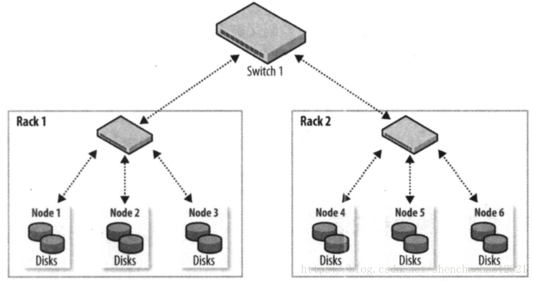

# 第十章 构建Hadoop集群

本章介绍如何在一个计算机集群上构建Hadoop系统，尽管在单机上运行HDFS、MapReduce和YARN有助于学习，但是要想执行一些有价值的工作，必须在多节点系统上运行。

有多个选择来获得一个Hadoop集群，从建立一个专属集群，到在租借的硬件设备上运行Hadoop系统，乃至于使用云端作为托管服务提供的Hadoop.被托管的选项数很多，这里就不逐一列举，但是即使你选择自己建立一个Hadoop集群，仍然会有很多安装选项要考虑。

**Apache tarball**

Apache Hadoop项目及相关的项目为每次发布提供了二进制（和源）压缩包(tarball)。用二进制压缩包安装最灵活，但工作量也最大，这是由于需要确定安装文件、配置文件和日志文件在文件系统中的位置、正确设置文件访问杖限等等。

**Packages**

从Apache Bigtop项目及所有Hadoop供应商那里都可以获取RPM和Debian包。这些包比压缩包有更多的优点，它们提供了一个一致性的文件系统布局，可以作为一个整体进行测试哒样可以知道Hadoop和Hive的多个版本能够在一起运行），并且它们可以和配置管理工具如Puppet一起运行。

**Hadoop 集群管理工具**

有一些工具用于Hadoop集群全生命期的安装和管理，Cloudera Manager和Apache Ambari就是这样的专用工具。它们提供了简单的WebUI，并且被推荐给大多数用户和操作者用以构建Hadoop集群。这些工具集成了Hadoop运行有关的操作知识。例如，它们基于硬件特点使用启发式方法来选择好的默认值用于Hadoop配置设置。对于更复杂的构建，例如：HA，或安全Hadoop，这些管理工具提供了经过测试的向导，能够帮助在短时间内建立一个能够工作的集群。最后，它们增加了额外的、其他安装选项没有提供的特性，例如统一监控和日志搜索，滚动升级（升级集群时不用经历停机）。

本章和下一章提供了足够的信息来构建和操作基础的Hadoop集群。然而，即使有些读者可能正在使用Hadoop集群管理工具或Hadoop服务，这些工具和服务帮助完成了大量常规的构建和维护工作，

## 10.1 集群规范

Hadoop运行在商业硬件上，用户可以选择普通硬件供应商生产的标准化、广泛有效的硬件来构建集群。无需使用特定供应商生产的昂贵、专用的硬件设备。

首先澄清两点。第一，商业硬件并不等同于低端硬件。低端机器常常使用便宜的零部件，其故障率远高于更贵一些（但仍是商业级别）的机器。当用户管理几十台、上百台，甚至几千台机器时，选择便宜的零部件并不划算，因为更高的故障率推高了维护成本。第二，也不推荐使用大型的数据库级别的机器，因为这类机器的性价比太低了。用户可能会虑使用少数几台数据库级别的机器来构建一个集群，使其性能达到一个中等规模的商业机器集群。然而，某一台机器所发生的故障会对整个集群产生更大的负面影响，因为大多数集群硬件将无法使用。

硬件规格很快就会过时。但为了举例说明，下面列举一下硬件规格。在2014年，运行Hadoop的和YARN节点管理器的典型机器有以下规格：

- 处理器，两个六核/八核 3GHz CPU
- 内存，64~512GB ECC RAM
- 存储器，12~24×1~4TB SATA硬盘
- 网络，带链路聚合的千兆以太网

尽管各个集群采用的硬件规格肯定有所不同，但是Hadoop一般使用多核CPU和多磁盘，以充分利用硬件的强大功能。

**为何不使用RAID?**

尽管建议采用RAID(Redundant Array of Independent Disk，即磁盘阵列)作为namenode的存储器以保护元数据，但是若将RAID作为datanode的存储设备则不会给HDFS带来益处。HDFS所提供的节点间数据复制技术已可满足数据复制，无需使用RAID的冗余机制。

此外，尽管RAID条带化技术（RAID 0）被广泛用于提升性能，但是其速度仍然比用在HDFS里的JBOD(Just aBunch Of Disks)配置慢。JBOD在所有磁盘之间循环调度HDFS块，RAID 0的读/写操作受限于磁盘阵列中响应最慢的盘片的速度。而JBOD的磁盘操作均独立，因而平均读/写速度高于最慢盘片的读/写速度。需要强调的是，各个磁盘的性能在实际使用中总存在相当大的差异，即使对于相同型号的磁盘。在一些针对某一雅虎集群的基准评测中，在一项测试(Gridmix)中，JBOD比RAID0快10％；在另一测试(HDFS写吞吐量)中，JBOD比RAID0快30％。

最后，若JBOD配置的某一磁盘出现故障，HDFS可以忽略该磁盘，继续工作·而RAID的某一盘片故障会导致整个磁盘阵列不可用，进而使相应节点失效。

### 10.1.1 集群规模

一个Hadoop集群到底应该多大？这个问题并无确切的答案。但是，Hadoop的魅力在于用户可以在初始阶段构建一个小集群（大约10个节点），并随存储与计算需求增长持续扩充。从某种意义上讲，更恰当的问题是“你的集群需要增长得多快？"用户可以通过下面这个关于存储的例子得到更深的体会。

加入数据每天增加1TB，如果采用三路HDFS复制技术，则每天需要增加3TB存储能力，再加上一些中间文件和日志文件(约占30%)所需空间，基本上相当于一台机器(2014年的典型机器)。实际上，用户一般不会每周购买一台新机器并将其加入集群。类似粗略计算的意义在于让用户了解集群的规模。本例中，个集群保存两年的数据大致需要100台机器。

#### Master节点场景

集群的规模不同，运行master守护进程的配置也不同，包括：namenode、辅助namenode、资源管理器及历史服务器。对于一个小集群(几十个节点)而言，在一台master机器上同时运行namenode和资源管理器是可接受的(只要至少一份namenode的元数据被另存在远程文件系统中)。然而，随着集群规模增大，完全有理由分离它们。

由于namenode在内存中保存整个命名空间中的所有文件元数据和块元数据，其实内存需求很大，辅助namenode在大多数时间里空闲，但是它在创建检查点时的内存需求与主namenode差不多。详情参见11.1.1节对文件系统映像和编辑日志的讨论。一旦文件系统包含大量文件，单台机器的物理内存便无法同时运行主namenode和辅助namenode。

除了简单的资源需求，在分开的机器上运行master的主要理由是为了高可用性，HDFS和YARN都支持以主备方式运行master配置。如果主master故障，在不同硬件上运行的备机将接替主机，且儿乎不会对服务造成干扰。在HDFS中，辅助namenode的检查点功能由备机执行，所以不需要同时运行备机和辅助namenode。

配置和运行HadoopHA不是本书的内容。可以参考Hadoop网站或供应商文档以获取更详细的信息。

### 10.1.2 网络拓扑

Hadoop集群架构通常包含两级网络拓扑，如图10-1所示，一般来说，各机架装配30～40个服务器，共享一个10GB的交换机(图中各机架只画了3个服务器)，各机架的交换机又通过上行链路与一个核心交换机或路由器（至少为10GB或更高）互联。该架构的突出特点是同一机架内部的节点之间的总带宽要远高于不同机架上的节点间的带宽。

#### 机架的注意事项

为了达到Hadoop的最佳性能，配置Hadoop系统以让其了解网络拓扑情况就极为关键。如果集群只包含一个机架，就无需做什么，因为这是默认配置。但是对于多机架的集群来说，面熟清楚节点-机架的映射关系就很重要。这是的Hadoop将MapReduce任务分配到各个节点时，会倾向于执行机架内的数据传输(拥有更多的带宽)，而非跨机架传输。HDFS还能够更加智能地放置副本(replica)，以获得性能和弹性的平衡。

																**图10-1 Hadoop集群的典型二级网络架构**

诸如节点和机架等的网络位置以树的形态来表示，从而能够体现出各个位置之间的网络“距离”。namenode使用网络位置来确定在哪里放置块的副本(参见3.6.1节)；MapReduce的调度器根据网络位置来查找最近的复本，将它作为map任务的输入。

在图10-1所示的网络中，机架拓扑由两个网络位置来描述，即/switch1/rack1和/switch1/rack2。由于该集群只有一个顶层路由器，这两个位置可以简写为/rack1和/rack2。

Hadoop配置需要通过一个Java接口`DNSToSwitchMapping`来指定节点地址和网络位置之间的映射关系。该接口定义如下：

```java
public interface DNSToSwitchMapping {
    List<String> resolve(List<String> var1);
    void reloadCachedMappings();
    void reloadCachedMappings(List<String> var1);
}
```

`resolve()`函数的输入参数names描述IP地址列表，返回响应的网络位置字符串列表。`net.topology.node.switch.mapping.impl`配属性实现了接口，namenode和资源管理器均采用它来解析工作节点的网络位置。

在上例的网络拓扑中，可将node1、node2和node3映射到/rack1，将node4、node5和node6映射到/rack2中。

但是，大多数安装并不需要自己实现接口，只需要使用默认的ScriptBasedMapping实现即可，它运行用户定义的脚本来描述映射关系，脚本的存放路径由属性`net.topology.script.file.name`控制，脚本接受一系列输入参数，描述带映射的主机名或IP地址，再将响应的网络位置以空格分开，输出到标准输出。

如果没有指定脚本位置，默认情况下会将所有节点映射到单个网络位置，即/default-rack。

## 10.2 集群的构建和安装

本节介绍如何在Linux操作系统下使用Apache Hadoop分发包安装和配置一个基础的Hadoop集群，用时也介绍一些在Hadoop安装过程中需要仔细思考的背景知识。

### 10.2.1 安装Java

Hadoop在Unix和Windows操作系统上都可以运行，但都需要安装Java。对于产品安装，应该选择一个经过Hadoop产品供应商认证的，操作系统、Java和Hadoop的组合。

### 10.2.2 创建Unix用户账号

最好创建特定的Unix用户帐号以区分各Hadoop进程，及区分同一机器上的其他服务。HDFS，MapReduce和YARN服务通常作为独立的用户运行，分别命名为hdfs，mapred和yarn。它们都属于同一hadoop组。

### 10.2.3 安装Hadoop

从Apache Hadoop的发布页面下载Hadoop发布包，并在某一本地目录解压缩，例如/usr/local（/opt是另一标准选项）。注意，鉴于hadoop用户的home目录可能挂载在NFS上，Hadoop系统最好不要安装在该目录上：

```sh
cd /usr/local
tar xzf hadoop-x.y.z.tar.gz
```

此外，还需将Hadoop文件的拥有者改为hadoop用户和组：

```sh
chown -R hadoop:hadoop hadoop-x.y.z
```

配置Hadoop环境变量，在/etc/profiles路径里添加Hadoop执行程序所在目录：

```sh
vim /etc/profiles
export HADOOP_HOME=/usr/local/hadoop-x.y.z
export PATH=$PATH:$HADOOP_HOME/bin:$HADOOP_HOME/sbin
source /etc/profiles
```

### 10.2.4 SSH配置

Hadoop控制脚本(并非守护进程)依赖SSH来执行针对整个集群的操作。例如，某个脚本能够终止并重启集群中的所有守护进程。值得注意的是，控制脚本并非唯一途径，用户也可以利用其他方法执行集群范围的操作，例如，分布式shell或专门的Hadoop管理应用）。

为了支持无缝式工作，SSH安装好之后，需要允许来自集群内机器的hdfs用户和yarn用户能够无需密码即可登陆。最简单的方法是创建一个公钥/私钥对，存放在NFS之中，让整个集群共享该密钥对。

首先，键人以下指令来产生一个RSA密钥对。你需要做两次，一次以hdfs用户身份，一次以yarn用户身份：

```sh
ssh-keygen -t rsa -f ~/.ssh/id_rsa
```

尽管期望无密码录，但密钥并不是一个好的选择（运行在本地伪分布集已保存群上时，倒也不妨使用一个空口令，参见附录A)。因此，当系统提示输人口令时，用户最好指定一个口令。可以使用ssh-agent以免为每个连接逐一输人密码。

私钥放在由-f选项指定的文件之中，例如~/.ssh/id_rsa。存放公钥的文件名称与私钥类似，但是以“.pub”作为后缀，例如 ~/.ssh/id_pub。

接下来，需确保公钥存放在用户打算连接的所有机器的~/.ssh/authorized_keys文件中。如果用户的home目录是存储在NFS文件系统中，则可以键人以下指令在整个集群内共享密钥（第一次作为hdfs用户，第二次作为yarn用户）:

```sh
cat ~/.ssh/id_rsa.pub >> ~/.ssh/authorized_keys
```

如果home目录并没有通过NFS共享，则需要利用其他方法共享公钥（比如ssh-copy-id）。测试是否可以从主机器SSH到工作机器。若可以，则表明ssh-agent正在运行，再运行ssh-add来存储口令。这样的话，用户即可不用再输人口令就能SSH到一台工作机器。

### 10.2.5 配置Hadoop

如果希望Hadoop以分布式模式在集群上运行，必须正确对其进行配置。10.3节中将详细讨论为达到此目的所需的重要配置。

### 10.2.6 格式化HDFS文件系统

在能够使用之前，全新的HDFS安装需要进行格式化。通过创建存储目录和初始版本的namenode持久数据结构，格式化进程将创建一个空的文件系统。由于namenode管理所有文件元数据，datanode可以动态加入或离开集群，所以初始的格式化进程不涉及到datanode。同样原因，创建文件系统时也无需指定大小，这是由集群中的datanode数目决定的，在文件系统格式化之后的很长时间内都可以根据需要增加。

格式化HDFS是一个快速操作。以hdfs用户身份运行以下命令：

```sh
％hdfs namenode -format
```

### 10.2.7 启动和停止守护进程

Hadoop自带脚本，可以运行命令并在整个集群范围内启动和停止守护进程。为使用这些脚本(在sbin目录下)，需要告诉Hadoop集群中有哪些机器。文件slaves正是用于此目的，该文件包含了机器主机名或IP地址的列表，每行代表一个机器信息。文件slaves列举了可以运行namenode和节点管理器的机器。文件驻留在Hadoop配置目录下，尽管通过修改hadoop-env.sh中的HADOOP_SLAVES设置可能会将文件放在别的地方（并赋予一个别的名称）。并且，**不需要将该文件分发给工作节点，因为仅有运行在namenode和资源管理器上的控制脚本使用它**。

以hdfs用户身份运行以下命令可以启动HDFS守护进程：

```sh
hdfs ./start-dfs.sh
```

namenode和secondaryNamenode运行所在的机器通过向Hadoop配置询问机器主机名来决定。例如：通过执行以下命令，脚本能够找到的主机名。

```sh
hdfs getconf -namenodes
```

默认情况下，该命令从fs.defaultFS中找到namenode的主机名。更具体一些start-dfs.sh脚本所做的事情如下：

- 在每台机器上启动一个namenode。这些机器由执行hdfs getconf -namenodes得到的返回值所确定。
- 在slaves文件中列举的每台机器上启动一个datanode。
- 在每台机器上启动一个辅助namenode，这些机器由执行hdfs getconf -secondarynamenodes得到的返回值所确定。

YARN守护进程已相同的方式启动，通过以YARN用户身份在托管资源管理的机器上运行以下命令：

```sh
yarn ./start-yarn.sh
```

在这种情况下，资源管理器总是和start-yarn.sh脚本运行在同一个机器上，脚本明确完成以下事情：

- 在本地机器上启动一个资源管理器
- 在slaves文件列举的每台机器上启动一个节点管理器。

同样，还提供了stop-dfs.sh和stop.yarn.sh脚本用于停止由相应的启动脚本启动的守护进程。

这些脚本是至上使用了hadoop-daemon.sh脚本(YARN中是yarn-daemon.sh脚本)启动和停止Hadoop守护进程。如果使用了前面提到的脚本，那么不能直接调用hadoop-deamon.sh。但是如果需要从另一个系统或从自己的脚本来控制Hadoop守护进程，hadoop-deamon.sh脚本是一个很好的切人点。类似的，当需要一个主机集上启动相同的守护进程时，使用hadoop-deamons.sh（带有"s”）会很方便。

最后，仅有一个MapReduce守护进程，即作业历史服务器，是以mapred用户身份以以下命令启动的：

```sh
mapred -jobhistory-daemon.sh start historyserver
```

### 10.2.8 创建用户目录

一旦建立并运行了Hadoop集群，就需要给用户提供访问手段。涉及到为每个用户创建home目录，给目录设置用户访问许可：

```bash
％hadoop fs -mkdir /user/username
％hadoop fs -chown username:username/user /user/name
```

此时是给目录设置空间限制的好时机。以下命令为给定的用户目录设置了1TB的容量限制：

```sh
％hdfs dfsadmin -setSpaceQuota 1t /user/username
```

## 10.3 Hadoop配置

有多个配置文件适用于Hadoop安装，表10-1列举出了最重要的几个文件。

​															**表10-1 Hadoop配置文件**

| 文件名称                   | 格式          | 描述                                                         |
| -------------------------- | ------------- | ------------------------------------------------------------ |
| hadoop-env.sh              | Bash脚本      | 脚本中要用到的环境变，以运行Hadoop                           |
| mapred-env.sh              | Bash脚本      | 脚本中要用到的环境变最，以运行MapReduce(覆盖hadoop-env.sh中设置的变量) |
| yarn-env.sh                | Bash脚本      | 脚本中要用到的环境变量，以运行YARN(覆盖hadoop-env.sh中设置的变量） |
| core-site.xml              | Hadoop配置XML | Hadoop Core的配置项，例如HDFS、MapReduce和YARN常用的I/O设置等 |
| hdfs-site.xml              | Hadoop配置XML | Hadoop守护进程的配置项，包括namenode、辅助namenode和datanode等 |
| mapred-site.xml            | Hadoop配置XML | MapReduce守护进程的配置项，包括作业历史服务器                |
| yarn-site.xml              | Hadoop配置XML | YARN守护进程的配置项，包括资源管理器、web应用代理服务器和节点管理器(node manager) |
| slaves                     | 纯文本        | 运行datanode和节点管理器的机器列表（每行一个）               |
| hadoop-metrics2.proterties | Java属性      | 控制如何在Hadoop上发布度量的属性（参11.2.2节）               |
| log4j.properties           | Java属性      | 系统日志文件、namenode审计日志、任务JVM进程的任务日志的属性,参见6.5.6节 |
| hadoop-policy.xml          | Hadoop配置XML | 安全模式下运行Hadoop时的访问控制列表的配置项                 |

这几个重要文件都放在Hadoop分发包的`/etc/hadoop`目录中。配置目录可以被重新安置在文件系统的其他地方(Hadoop安装路径以外，便于升级)，只要启动守护进程时使用`--config`选项(或等价使用`HADOOP_CONF_DIR`环境变量集)说明这个目录在本地文件系统的位置就可以了。

### 10.3.1 配置管理

Hadoop并没有将所有配置信息放在一个单独的全局位置中。反之，集群的每个Hadoop节点都各自保存一系列配置，并由管理员完成这些配置文件的同步工作。有并行shell工具完成同步工作，诸如dsh或pdsh。这方面，Hadoop集群管理工具例如Cloudera Manager和Apache Ambari表现突出，因为在集群间传递修改信息是它们的关注点。

Hadoop也支持为所有master机器和worker机器采用同一套配置文件。这个做法的最大优势在于简单，不仅体现在理论上(仅需处理一套配置文件)，也体现在可操作性上(使用Hadoop脚本就能进行管理)。

但是，这种一体使用的配置模型并不合适某些集群。以扩展集群为例，当试图为集群添加新机器，且新机器的硬件规格与现有机器不同时，则需要新建一套配置文件，以充分利用新硬件的额外资源。

在这种情况下，需要引入**机器类**的概念。为每一机器类维护单独的配置文件。Hadoop没有提供执行这个操作的工具，需要借助外部工具来执行该配置操作，例如Chef、Puppet、CFEngine和Bcfg2等。

对于任何规模的集群来说，同步所有机器上的配置文件都极具挑战性。例如：假设某台机器正好处于异常状态，而此时用户正好发出一条更新配置的指令，如何保证这台机器在恢复正常状态之后也能够更新配置？这个问题很严重，可能会导致集群中各机器的配置不一致。因此，尽管用户能够使用控制脚本来管理Hadoop，仍然推**荐使用控制管理工具管理集群**。使用这些工具也可以顺利完成日常维护，例如为安全漏洞打补丁、升级系统包等。

### 10.3.2 环境设置

本节探讨如何设置`hadoop-env.sh`文件中的变量。MapReduce和YARN(HDFS除外)都有类似的配置文件。分别为`mapred-env.sh`和`yarn-env.sh`，文件中的变量和组件相关，并且可以进行设置，注意：hadoop-env.sh文件里设置的值会被MapReduce和YARN文件覆盖。

#### 1. Java

需要设置Hadoop系统Java的安装位置：

- 方法一：在`Hadoop-env.sh`文件中设置`JAVA_HOME`项；
- 方法二：在shell中设置`JAVA_HOME`环境变量

相比之下，方法一更好，因为只需操作一次就能够保证整个集群使用同一版本的Java。

#### 2. 内存堆大小

在默认情况下，Hadoop为各个守护进程分配1000MB(1G)内存。该内存值由`hadoop-env.sh`文件的`HADOOP_HEAPSIZE`属性控制。可以通过设置坏境变量为单个守护进程修改堆大小。例如，在`yarn-env.sh`文件中设置`YARN_RESOURCEMANAGER_HEAPSIZE`，即可覆盖资源管理器的堆大小。

令人惊讶的是，尽管为namenode分配更多的堆空间是很常见的事情，但是对于HDFS守护进程而言并没有相应的环境变量。当然有别的途径可以设置namenode堆空间大小，见接下来的讨论。

除了守护进程对内存的需求，节点管理器还需为应用程序分配容器（container），因此需要综合考虑上述因素来计算一个工作机器的总体内存需求，详见10.3．3节中YARN和MapReduce内存设置的有关内容。

**一个守护进程究竟需要多少内存**

由于namenode会在内存中维护所有文件的每个数据块引用，因此namenode很有可能“吃光”所有分配给它的内存，很难套用一个共识来精确计算内存需求量，因为内存需求量取决于多个因素，包括：每个文件包含的数据块数、文件名称的长度、文件系统中的目录数等。此外，在不同Hadoop版本下，namenode内存需求也不同。

1000MB内存(默认配置)通常足够管理数百万个文件，但是根据经验来看，保守估计需要为每1百万个数据块分配1000MB内存空间。

以一个含200节点的集群为例，假设每个节点有24TB磁盘空间，数据块大小是128MB，复本数是3的话，则约有2百万个数据块(甚至更多)：$\frac{200 \times 24000000MB}{128MB \times 3}$。因此，在本例中，namenode的内存空间最好一开始设为12000MB。

也可以只增加namenode内存分配量而不改变其他Hadoop守护进程的内存分配，即设置`hadoop-env.sh`文件的`HADOOP_NAMENODE_OPTS`属性包含一个JVM选项以设定内存大小。`HADOOP_NAMENODE_OPTS`允许向namenode的JVM传递額外的选项。以SunJVM为例，`-Xmx2000m`选项表示为namenode分配2000MB内存空间。

由于辅助namenode的内存需求量和主namenode差不多，所以一旦更改namenode的内存分配的话还需对辅助namenode做相同更改(使用`HADOOP_SECONDARYNAMENODE_OPTS`变量)。

#### 3. 系统日志文件

默认情况下，Hadoop生成的系统日志文件存放在`/HADOOP_HOME/logs`目录之中，也可以通过`hadoop-env.sh`文件中的`HADOOP_LOG_DIR`来进行修改。建议修改默认设置，使之独立于Hadoop的安装目录。这样的话，即使Hadoop升级之后安装路径发生变化，也不会影响日志文件的位置。通常可以将日志文件存放在`/var/log/hadoop`目录中。实现方法很简单，就是在`hadoop-env.sh`中加人一行：

```bash
export HADOOP_LOG_DIR=/var/log/hadoop
```

如果日志目录并不存在，则会首先创建该目录(如果操作失败，请确认相关的Unix Hadoop用户是否有权创建该目录)。运行在各台机器上的各个Hadoop守护进程会产生两类日志文件：

- 第一类日志文件(以.log作为后缀名)是通过log4j记录的。鉴于大部分应用程序的日志消息都写到该日志文件中，故障诊断的首要步骤即为检查该文件。标准的Hadooplog4j配置采用日常滚动文件追加方式（daily rolling file appender)来循环管理日志文件。系统不自动删除过期的日志文件，而是留待用户定期删除或存档，以节约本地磁盘空间。
- 第二类日志文件后缀名为.out，记录标准输出和标准错误日志。由于Hadoop使用log4J记录日志，所以该文件通常只包含少量记录，甚至为空。重启守护进程时，系统会创建一个新文件来记录此类日志。系统仅保留最新的5个日志文件。旧的日志文件会附加一个介于1和5之间的数字后缀，5表示最旧的文件。

日志文件的名称（两种类型）包含运行守护进程的用户名称、守护进程名称和本地主机名等信息。例如`hadoop-hdfsdatanode-ip-10-45-174-112.log.2014-09-20`就是一个日志文件的名称。这种命名方法保证集群内所有机器的日志文件名称各不相同，从而可以将所有日志文件存到一个目录中。

日志文件名称中的“用户名称”部分实际对应`hadoop-env.sh`方文件中的`HADOOP_IDENT_STRING`项。如果想采用其他名称，可以修改`HADOOP_IDENT_STRING`项。

#### 4. SSH配置

借助SSH协议，用户在主节点上使用控制脚本就能在(远程)工作节点上运行一系列指令。自定义SSH设置会带来诸多益处。例如，减小连接超时设定(使用ConnectTimeout选项)可以避免控制脚本长时间等待宕机节点的响应。当然，也不可设得过低，否则会导致繁忙节点被跳过。

StrictHostKeyChecking也是一个很有用的SSH设置。设置为no会自动将新主机键加到已知主机文件之中。该项默认值是ask，提示用户确认是否已验证了“键指纹”(key fingemnnt)，因此不适合大型集群环境。

在hadoop-env.sh文件中定义HADOOP_SSH_OPTS环境变量还能够向SSH传递更多选项。参考ssh和ssh-config使用手册，了解更多SSH设置。