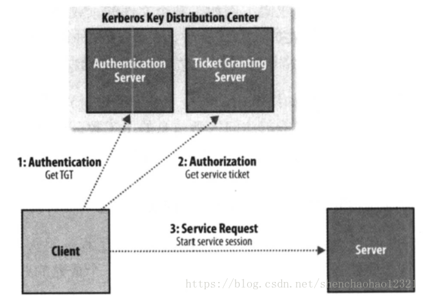

[TOC]

# 第十章 构建Hadoop集群

本章介绍如何在一个计算机集群上构建Hadoop系统，尽管在单机上运行HDFS、MapReduce和YARN有助于学习，但是要想执行一些有价值的工作，必须在多节点系统上运行。

有多个选择来获得一个Hadoop集群，从建立一个专属集群，到在租借的硬件设备上运行Hadoop系统，乃至于使用云端作为托管服务提供的Hadoop.被托管的选项数很多，这里就不逐一列举，但是即使你选择自己建立一个Hadoop集群，仍然会有很多安装选项要考虑。

**Apache tarball**

Apache Hadoop项目及相关的项目为每次发布提供了二进制（和源）压缩包(tarball)。用二进制压缩包安装最灵活，但工作量也最大，这是由于需要确定安装文件、配置文件和日志文件在文件系统中的位置、正确设置文件访问杖限等等。

**Packages**

从Apache Bigtop项目及所有Hadoop供应商那里都可以获取RPM和Debian包。这些包比压缩包有更多的优点，它们提供了一个一致性的文件系统布局，可以作为一个整体进行测试这样可以知道Hadoop和Hive的多个版本能够在一起运行），并且它们可以和配置管理工具如Puppet一起运行。

**Hadoop 集群管理工具**

有一些工具用于Hadoop集群全生命期的安装和管理，Cloudera Manager和Apache Ambari就是这样的专用工具。它们提供了简单的WebUI，并且被推荐给大多数用户和操作者用以构建Hadoop集群。这些工具集成了Hadoop运行有关的操作知识。例如，它们基于硬件特点使用启发式方法来选择好的默认值用于Hadoop配置设置。对于更复杂的构建，例如：HA，或安全Hadoop，这些管理工具提供了经过测试的向导，能够帮助在短时间内建立一个能够工作的集群。最后，它们增加了额外的、其他安装选项没有提供的特性，例如统一监控和日志搜索，滚动升级（升级集群时不用经历停机）。

本章和下一章提供了足够的信息来构建和操作基础的Hadoop集群。然而，即使有些读者可能正在使用Hadoop集群管理工具或Hadoop服务，这些工具和服务帮助完成了大量常规的构建和维护工作，

## 10.1 集群规范

Hadoop运行在商业硬件上，用户可以选择普通硬件供应商生产的标准化、广泛有效的硬件来构建集群。无需使用特定供应商生产的昂贵、专用的硬件设备。

首先澄清两点。第一，商业硬件并不等同于低端硬件。低端机器常常使用便宜的零部件，其故障率远高于更贵一些（但仍是商业级别）的机器。当用户管理几十台、上百台，甚至几千台机器时，选择便宜的零部件并不划算，因为更高的故障率推高了维护成本。第二，也不推荐使用大型的数据库级别的机器，因为这类机器的性价比太低了。用户可能会虑使用少数几台数据库级别的机器来构建一个集群，使其性能达到一个中等规模的商业机器集群。然而，某一台机器所发生的故障会对整个集群产生更大的负面影响，因为大多数集群硬件将无法使用。

硬件规格很快就会过时。但为了举例说明，下面列举一下硬件规格。在2014年，运行Hadoop的和YARN节点管理器的典型机器有以下规格：

- 处理器，两个六核/八核 3GHz CPU
- 内存，64~512GB ECC RAM
- 存储器，12~24×1~4TB SATA硬盘
- 网络，带链路聚合的千兆以太网

尽管各个集群采用的硬件规格肯定有所不同，但是Hadoop一般使用多核CPU和多磁盘，以充分利用硬件的强大功能。

**为何不使用RAID?**

尽管建议采用RAID(Redundant Array of Independent Disk，即磁盘阵列)作为namenode的存储器以保护元数据，但是若将RAID作为datanode的存储设备则不会给HDFS带来益处。HDFS所提供的节点间数据复制技术已可满足数据复制，无需使用RAID的冗余机制。

此外，尽管RAID条带化技术（RAID 0）被广泛用于提升性能，但是其速度仍然比用在HDFS里的JBOD(Just aBunch Of Disks)配置慢。JBOD在所有磁盘之间循环调度HDFS块，RAID 0的读/写操作受限于磁盘阵列中响应最慢的盘片的速度。而JBOD的磁盘操作均独立，因而平均读/写速度高于最慢盘片的读/写速度。需要强调的是，各个磁盘的性能在实际使用中总存在相当大的差异，即使对于相同型号的磁盘。在一些针对某一雅虎集群的基准评测中，在一项测试(Gridmix)中，JBOD比RAID0快10％；在另一测试(HDFS写吞吐量)中，JBOD比RAID0快30％。

最后，若JBOD配置的某一磁盘出现故障，HDFS可以忽略该磁盘，继续工作·而RAID的某一盘片故障会导致整个磁盘阵列不可用，进而使相应节点失效。

### 10.1.1 集群规模

一个Hadoop集群到底应该多大？这个问题并无确切的答案。但是，Hadoop的魅力在于用户可以在初始阶段构建一个小集群（大约10个节点），并随存储与计算需求增长持续扩充。从某种意义上讲，更恰当的问题是“你的集群需要增长得多快？"用户可以通过下面这个关于存储的例子得到更深的体会。

加入数据每天增加1TB，如果采用三路HDFS复制技术，则每天需要增加3TB存储能力，再加上一些中间文件和日志文件(约占30%)所需空间，基本上相当于一台机器(2014年的典型机器)。实际上，用户一般不会每周购买一台新机器并将其加入集群。类似粗略计算的意义在于让用户了解集群的规模。本例中，个集群保存两年的数据大致需要100台机器。

#### Master节点场景

集群的规模不同，运行master守护进程的配置也不同，包括：namenode、辅助namenode、资源管理器及历史服务器。对于一个小集群(几十个节点)而言，在一台master机器上同时运行namenode和资源管理器是可接受的(只要至少一份namenode的元数据被另存在远程文件系统中)。然而，随着集群规模增大，完全有理由分离它们。

由于namenode在内存中保存整个命名空间中的所有文件元数据和块元数据，其实内存需求很大，辅助namenode在大多数时间里空闲，但是它在创建检查点时的内存需求与主namenode差不多。详情参见11.1.1节对文件系统映像和编辑日志的讨论。一旦文件系统包含大量文件，单台机器的物理内存便无法同时运行主namenode和辅助namenode。

除了简单的资源需求，在分开的机器上运行master的主要理由是为了高可用性，HDFS和YARN都支持以主备方式运行master配置。如果主master故障，在不同硬件上运行的备机将接替主机，且儿乎不会对服务造成干扰。在HDFS中，辅助namenode的检查点功能由备机执行，所以不需要同时运行备机和辅助namenode。

配置和运行HadoopHA不是本书的内容。可以参考Hadoop网站或供应商文档以获取更详细的信息。

### 10.1.2 网络拓扑

Hadoop集群架构通常包含两级网络拓扑，如图10-1所示，一般来说，各机架装配30～40个服务器，共享一个10GB的交换机(图中各机架只画了3个服务器)，各机架的交换机又通过上行链路与一个核心交换机或路由器（至少为10GB或更高）互联。该架构的突出特点是同一机架内部的节点之间的总带宽要远高于不同机架上的节点间的带宽。

#### 机架的注意事项

为了达到Hadoop的最佳性能，配置Hadoop系统以让其了解网络拓扑情况就极为关键。如果集群只包含一个机架，就无需做什么，因为这是默认配置。但是对于多机架的集群来说，面熟清楚节点-机架的映射关系就很重要。这是的Hadoop将MapReduce任务分配到各个节点时，会倾向于执行机架内的数据传输(拥有更多的带宽)，而非跨机架传输。HDFS还能够更加智能地放置副本(replica)，以获得性能和弹性的平衡。

																**图10-1 Hadoop集群的典型二级网络架构**

诸如节点和机架等的网络位置以树的形态来表示，从而能够体现出各个位置之间的网络“距离”。namenode使用网络位置来确定在哪里放置块的副本(参见3.6.1节)；MapReduce的调度器根据网络位置来查找最近的复本，将它作为map任务的输入。

在图10-1所示的网络中，机架拓扑由两个网络位置来描述，即/switch1/rack1和/switch1/rack2。由于该集群只有一个顶层路由器，这两个位置可以简写为/rack1和/rack2。

Hadoop配置需要通过一个Java接口`DNSToSwitchMapping`来指定节点地址和网络位置之间的映射关系。该接口定义如下：

```java
public interface DNSToSwitchMapping {
    List<String> resolve(List<String> var1);
    void reloadCachedMappings();
    void reloadCachedMappings(List<String> var1);
}
```

`resolve()`输入参数描述IP地址列表，返回响应网络位置。`net.topology.node.switch.mapping.impl`配属性实现了接口，namenode和资源管理器均采用它来解析工作节点的网络位置。

在上例的网络拓扑中，可将node1、node2和node3映射到/rack1，将node4、node5和node6映射到/rack2中。

但是，大多数安装并不需要自己实现接口，只需要使用默认的ScriptBasedMapping实现即可，它运行用户定义的脚本来描述映射关系，脚本的存放路径由属性`net.topology.script.file.name`控制，脚本接受一系列输入参数，描述带映射的主机名或IP地址，再将响应的网络位置以空格分开，输出到标准输出。

如果没有指定脚本位置，默认情况下会将所有节点映射到单个网络位置，即/default-rack。

## 10.2 集群的构建和安装

本节介绍如何在Linux操作系统下使用Apache Hadoop分发包安装和配置一个基础的Hadoop集群，用时也介绍一些在Hadoop安装过程中需要仔细思考的背景知识。

### 10.2.1 安装Java

Hadoop在Unix和Windows操作系统上都可以运行，但都需要安装Java。对于产品安装，应该选择一个经过Hadoop产品供应商认证的，操作系统、Java和Hadoop的组合。

### 10.2.2 创建Unix用户账号

最好创建特定的Unix用户帐号以区分各Hadoop进程，及区分同一机器上的其他服务。HDFS，MapReduce和YARN服务通常作为独立的用户运行，分别命名为hdfs，mapred和yarn。它们都属于同一hadoop组。

### 10.2.3 安装Hadoop

从Apache Hadoop的发布页面下载Hadoop发布包，并在某一本地目录解压缩，例如/usr/local（/opt是另一标准选项）。注意，鉴于hadoop用户的home目录可能挂载在NFS上，Hadoop系统最好不要安装在该目录上：

```sh
cd /usr/local
tar xzf hadoop-x.y.z.tar.gz
```

此外，还需将Hadoop文件的拥有者改为hadoop用户和组：

```sh
chown -R hadoop:hadoop hadoop-x.y.z
```

配置Hadoop环境变量，在/etc/profiles路径里添加Hadoop执行程序所在目录：

```sh
vim /etc/profiles
export HADOOP_HOME=/usr/local/hadoop-x.y.z
export PATH=$PATH:$HADOOP_HOME/bin:$HADOOP_HOME/sbin
source /etc/profiles
```

### 10.2.4 SSH配置

Hadoop控制脚本(并非守护进程)依赖SSH来执行针对整个集群的操作。例如，某个脚本能够终止并重启集群中的所有守护进程。值得注意的是，控制脚本并非唯一途径，用户也可以利用其他方法执行集群范围的操作，例如，分布式shell或专门的Hadoop管理应用）。

为了支持无缝式工作，SSH安装好之后，需要允许来自集群内机器的hdfs用户和yarn用户能够无需密码即可登陆。最简单的方法是创建一个公钥/私钥对，存放在NFS之中，让整个集群共享该密钥对。

首先，键人以下指令来产生一个RSA密钥对。你需要做两次，一次以hdfs用户身份，一次以yarn用户身份：

```sh
ssh-keygen -t rsa -f ~/.ssh/id_rsa
```

尽管期望无密码录，但密钥并不是一个好的选择（运行在本地伪分布集已保存群上时，倒也不妨使用一个空口令，参见附录A)。因此，当系统提示输人口令时，用户最好指定一个口令。可以使用ssh-agent以免为每个连接逐一输人密码。

私钥放在由-f选项指定的文件之中，例如~/.ssh/id_rsa。存放公钥的文件名称与私钥类似，但是以“.pub”作为后缀，例如 ~/.ssh/id_pub。

接下来，需确保公钥存放在用户打算连接的所有机器的~/.ssh/authorized_keys文件中。如果用户的home目录是存储在NFS文件系统中，则可以键人以下指令在整个集群内共享密钥（第一次作为hdfs用户，第二次作为yarn用户）:

```sh
cat ~/.ssh/id_rsa.pub >> ~/.ssh/authorized_keys
```

如果home目录并没有通过NFS共享，则需要利用其他方法共享公钥（比如ssh-copy-id）。测试是否可以从主机器SSH到工作机器。若可以，则表明ssh-agent正在运行，再运行ssh-add来存储口令。这样的话，用户即可不用再输人口令就能SSH到一台工作机器。

### 10.2.5 配置Hadoop

如果希望Hadoop以分布式模式在集群上运行，必须正确对其进行配置。10.3节中将详细讨论为达到此目的所需的重要配置。

### 10.2.6 格式化HDFS文件系统

在能够使用之前，全新的HDFS安装需要进行格式化。通过创建存储目录和初始版本的namenode持久数据结构，格式化进程将创建一个空的文件系统。由于namenode管理所有文件元数据，datanode可以动态加入或离开集群，所以初始的格式化进程不涉及到datanode。同样原因，创建文件系统时也无需指定大小，这是由集群中的datanode数目决定的，在文件系统格式化之后的很长时间内都可以根据需要增加。

格式化HDFS是一个快速操作。以hdfs用户身份运行以下命令：

```sh
％hdfs namenode -format
```

### 10.2.7 启动和停止守护进程

Hadoop自带脚本，可以运行命令并在整个集群范围内启动和停止守护进程。为使用这些脚本(在sbin目录下)，需要告诉Hadoop集群中有哪些机器。文件slaves正是用于此目的，该文件包含了机器主机名或IP地址的列表，每行代表一个机器信息。文件slaves列举了可以运行namenode和节点管理器的机器。文件驻留在Hadoop配置目录下，尽管通过修改hadoop-env.sh中的HADOOP_SLAVES设置可能会将文件放在别的地方（并赋予一个别的名称）。并且，**不需要将该文件分发给工作节点，因为仅有运行在namenode和资源管理器上的控制脚本使用它**。

以hdfs用户身份运行以下命令可以启动HDFS守护进程：

```sh
hdfs ./start-dfs.sh
```

namenode和secondaryNamenode运行所在的机器通过向Hadoop配置询问机器主机名来决定。例如：通过执行以下命令，脚本能够找到的主机名。

```sh
hdfs getconf -namenodes
```

默认情况下，该命令从fs.defaultFS中找到namenode的主机名。更具体一些start-dfs.sh脚本所做的事情如下：

- 在每台机器上启动一个namenode。这些机器由执行hdfs getconf -namenodes得到的返回值所确定。
- 在slaves文件中列举的每台机器上启动一个datanode。
- 在每台机器上启动一个辅助namenode，这些机器由执行hdfs getconf -secondarynamenodes得到的返回值所确定。

YARN守护进程已相同的方式启动，通过以YARN用户身份在托管资源管理的机器上运行以下命令：

```sh
yarn ./start-yarn.sh
```

在这种情况下，资源管理器总是和start-yarn.sh脚本运行在同一个机器上，脚本明确完成以下事情：

- 在本地机器上启动一个资源管理器
- 在slaves文件列举的每台机器上启动一个节点管理器。

同样，还提供了stop-dfs.sh和stop.yarn.sh脚本用于停止由相应的启动脚本启动的守护进程。

这些脚本实质上使用了hadoop-daemon.sh脚本(YARN中是yarn-daemon.sh脚本)启动和停止Hadoop守护进程。如果使用了前面提到的脚本，那么不能直接调用hadoop-deamon.sh。但是如果需要从另一个系统或从自己的脚本来控制Hadoop守护进程，hadoop-deamon.sh脚本是一个很好的切人点。类似的，当需要一个主机集上启动相同的守护进程时，使用hadoop-deamons.sh(带有"s")会很方便。

最后，仅有一个MapReduce守护进程，即作业历史服务器，是以mapred用户身份以以下命令启动的：

```sh
mapred -jobhistory-daemon.sh start historyserver
```

### 10.2.8 创建用户目录

一旦建立并运行了Hadoop集群，就需要给用户提供访问手段。涉及到为每个用户创建home目录，给目录设置用户访问许可：

```bash
％hadoop fs -mkdir /user/username
％hadoop fs -chown username:username/user /user/name
```

此时是给目录设置空间限制的好时机。以下命令为给定的用户目录设置了1TB的容量限制：

```sh
％hdfs dfsadmin -setSpaceQuota 1t /user/username
```

## 10.3 Hadoop配置

有多个配置文件适用于Hadoop安装，表10-1列举出了最重要的几个文件。

​															**表10-1 Hadoop配置文件**

| 文件名称                   | 格式          | 描述                                                         |
| -------------------------- | ------------- | ------------------------------------------------------------ |
| hadoop-env.sh              | Bash脚本      | 脚本中要用到的环境变量，以运行Hadoop                         |
| mapred-env.sh              | Bash脚本      | 脚本中要用到的环境变最，以运行MapReduce(会覆盖hadoop-env.sh中设置的变量) |
| yarn-env.sh                | Bash脚本      | 脚本中要用到的环境变量，以运行YARN(覆盖hadoop-env.sh中设置的变量） |
| core-site.xml              | Hadoop配置XML | Hadoop Core的配置项，例如HDFS、MapReduce和YARN常用的I/O设置等 |
| hdfs-site.xml              | Hadoop配置XML | Hadoop守护进程的配置项，包括namenode、辅助namenode和datanode等 |
| mapred-site.xml            | Hadoop配置XML | MapReduce守护进程的配置项，包括作业历史服务器                |
| yarn-site.xml              | Hadoop配置XML | YARN守护进程的配置项，包括资源管理器、web应用代理服务器和节点管理器(node manager) |
| slaves                     | 纯文本        | 运行datanode和节点管理器的机器列表(每行一个)                 |
| hadoop-metrics2.proterties | Java属性      | 控制如何在Hadoop上发布度量的属性(参11.2.2节)                 |
| log4j.properties           | Java属性      | 系统日志文件、namenode审计日志、任务JVM进程的任务日志的属性,参见6.5.6节 |
| hadoop-policy.xml          | Hadoop配置XML | 安全模式下运行Hadoop时的访问控制列表的配置项                 |

这几个重要文件都放在Hadoop分发包的`/etc/hadoop`目录中。配置目录可以被重新安置在文件系统的其他地方(Hadoop安装路径以外，便于升级)，只要启动守护进程时使用`--config`选项(或等价使用`HADOOP_CONF_DIR`环境变量集)说明这个目录在本地文件系统的位置就可以了。

### 10.3.1 配置管理

Hadoop并没有将所有配置信息放在一个单独的全局位置中。反之，集群的每个Hadoop节点都各自保存一系列配置，并由管理员完成这些配置文件的同步工作。有并行shell工具完成同步工作，诸如dsh或pdsh。这方面，Hadoop集群管理工具例如Cloudera Manager和Apache Ambari表现突出，因为在集群间传递修改信息是它们的关注点。

Hadoop也支持为所有master机器和worker机器采用同一套配置文件。这个做法的最大优势在于简单，不仅体现在理论上(仅需处理一套配置文件)，也体现在可操作性上(使用Hadoop脚本就能进行管理)。

但是，这种一体使用的配置模型并不合适某些集群。以扩展集群为例，当试图为集群添加新机器，且新机器的硬件规格与现有机器不同时，则需要新建一套配置文件，以充分利用新硬件的额外资源。

在这种情况下，需要引入**机器类**的概念。为每一机器类维护单独的配置文件。Hadoop没有提供执行这个操作的工具，需要借助外部工具来执行该配置操作，例如Chef、Puppet、CFEngine和Bcfg2等。

对于任何规模的集群来说，同步所有机器上的配置文件都极具挑战性。例如：假设某台机器正好处于异常状态，而此时用户正好发出一条更新配置的指令，如何保证这台机器在恢复正常状态之后也能够更新配置？这个问题很严重，可能会导致集群中各机器的配置不一致。因此，尽管用户能够使用控制脚本来管理Hadoop，仍然推**荐使用控制管理工具管理集群**。使用这些工具也可以顺利完成日常维护，例如为安全漏洞打补丁、升级系统包等。

### 10.3.2 环境设置

本节探讨如何设置`hadoop-env.sh`文件中的变量。MapReduce和YARN(HDFS除外)都有类似的配置文件。分别为`mapred-env.sh`和`yarn-env.sh`，文件中的变量和组件相关，并且可以进行设置，注意：hadoop-env.sh文件里设置的值会被MapReduce和YARN文件覆盖。

#### 1. Java

需要设置Hadoop系统Java的安装位置：

- 方法一：在`Hadoop-env.sh`文件中设置`JAVA_HOME`项；
- 方法二：在shell中设置`JAVA_HOME`环境变量

相比之下，方法一更好，因为只需操作一次就能够保证整个集群使用同一版本的Java。

#### 2. 内存堆大小

在默认情况下，Hadoop为各个守护进程分配1000MB(1G)内存。该内存值由`hadoop-env.sh`文件的`HADOOP_HEAPSIZE`属性控制。可以通过设置坏境变量为单个守护进程修改堆大小。例如，在`yarn-env.sh`文件中设置`YARN_RESOURCEMANAGER_HEAPSIZE`，即可覆盖资源管理器的堆大小。

令人惊讶的是，尽管为namenode分配更多的堆空间是很常见的事情，但是对于HDFS守护进程而言并没有相应的环境变量。当然有别的途径可以设置namenode堆空间大小，见接下来的讨论。

除了守护进程对内存的需求，节点管理器还需为应用程序分配容器（container），因此需要综合考虑上述因素来计算一个工作机器的总体内存需求，详见10.3．3节中YARN和MapReduce内存设置的有关内容。

**一个守护进程究竟需要多少内存**

由于namenode会在内存中维护所有文件的每个数据块引用，因此namenode很有可能“吃光”所有分配给它的内存，很难套用一个共识来精确计算内存需求量，因为内存需求量取决于多个因素，包括：每个文件包含的数据块数、文件名称的长度、文件系统中的目录数等。此外，在不同Hadoop版本下，namenode内存需求也不同。

1000MB内存(默认配置)通常足够管理数百万个文件，但是根据经验来看，保守估计需要为每1百万个数据块分配1000MB内存空间。

以一个含200节点的集群为例，假设每个节点有24TB磁盘空间，数据块大小是128MB，复本数是3的话，则约有2百万个数据块(甚至更多)：$\frac{200 \times 24000000MB}{128MB \times 3}$。因此，在本例中，namenode的内存空间最好一开始设为12000MB。

也可以只增加namenode内存分配量而不改变其他Hadoop守护进程的内存分配，即设置`hadoop-env.sh`文件的`HADOOP_NAMENODE_OPTS`属性包含一个JVM选项以设定内存大小。`HADOOP_NAMENODE_OPTS`允许向namenode的JVM传递額外的选项。以SunJVM为例，`-Xmx2000m`选项表示为namenode分配2000MB内存空间。

由于辅助namenode的内存需求量和主namenode差不多，所以一旦更改namenode的内存分配的话还需对辅助namenode做相同更改(使用`HADOOP_SECONDARYNAMENODE_OPTS`变量)。

#### 3. 系统日志文件

默认情况下，Hadoop生成的系统日志文件存放在`/HADOOP_HOME/logs`目录之中，也可以通过`hadoop-env.sh`文件中的`HADOOP_LOG_DIR`来进行修改。建议修改默认设置，使之独立于Hadoop的安装目录。这样的话，即使Hadoop升级之后安装路径发生变化，也不会影响日志文件的位置。通常可以将日志文件存放在`/var/log/hadoop`目录中。实现方法很简单，就是在`hadoop-env.sh`中加人一行：

```bash
export HADOOP_LOG_DIR=/var/log/hadoop
```

如果日志目录并不存在，则会首先创建该目录(如果操作失败，请确认相关的Unix Hadoop用户是否有权创建该目录)。运行在各台机器上的各个Hadoop守护进程会产生两类日志文件：

- 第一类日志文件(以.log作为后缀名)是通过log4j记录的。鉴于大部分应用程序的日志消息都写到该日志文件中，故障诊断的首要步骤即为检查该文件。标准的Hadooplog4j配置采用日常滚动文件追加方式（daily rolling file appender)来循环管理日志文件。系统不自动删除过期的日志文件，而是留待用户定期删除或存档，以节约本地磁盘空间。
- 第二类日志文件后缀名为.out，记录标准输出和标准错误日志。由于Hadoop使用log4J记录日志，所以该文件通常只包含少量记录，甚至为空。重启守护进程时，系统会创建一个新文件来记录此类日志。系统仅保留最新的5个日志文件。旧的日志文件会附加一个介于1和5之间的数字后缀，5表示最旧的文件。

日志文件的名称（两种类型）包含运行守护进程的用户名称、守护进程名称和本地主机名等信息。例如`hadoop-hdfsdatanode-ip-10-45-174-112.log.2014-09-20`就是一个日志文件的名称。这种命名方法保证集群内所有机器的日志文件名称各不相同，从而可以将所有日志文件存到一个目录中。

日志文件名称中的“用户名称”部分实际对应`hadoop-env.sh`方文件中的`HADOOP_IDENT_STRING`项。如果想采用其他名称，可以修改`HADOOP_IDENT_STRING`项。

#### 4. SSH配置

借助SSH协议，用户在主节点上使用控制脚本就能在(远程)工作节点上运行一系列指令。自定义SSH设置会带来诸多益处。例如，减小连接超时设定(使用ConnectTimeout选项)可以避免控制脚本长时间等待宕机节点的响应。当然，也不可设得过低，否则会导致繁忙节点被跳过。

StrictHostKeyChecking也是一个很有用的SSH设置。设置为no会自动将新主机键加到已知主机文件之中。该项默认值是ask，提示用户确认是否已验证了“键指纹”(key fingemnnt)，因此不适合大型集群环境。

在hadoop-env.sh文件中定义HADOOP_SSH_OPTS环境变量还能够向SSH传递更多选项。参考ssh和ssh-config使用手册，了解更多SSH设置。

### 10.3.3 Hadoop守护进程的关键属性

Hadoop的配置属性之多简直让人眼花缭乱。本节讨论对于真实的工作集群来说非常关键的一些属性(或至少能够理解默认属性的含义)，这些属性分散在Hadoop的站点文件之中，包括core-site.xml、hdfs-site.xml和yarn-site.xml。范例10-1、10-2和10-3分别列举了这些文件的典型实例。要想进一步了解Hadoop配置文件的格式，可参见6.1节。

对于一个正在运行的守护进程，要想知道其实际配置，可以访问该进程的web服务器上的`/conf`页面，例如，`http://resource-manager-host:8088/conf`表示资源管理器当前的运行配置。该页面展示了守护进程正在运行的组合站点和默认配置文件，并给出了每个属性的来源文件。

**范例10-1 典型的core-site.xml文件**

```xml
<?xml version="1.0" encoding="UTF-8"?>
<?xml-stylesheet type="text/xsl" href="configuration.xsl"?>
<!--
  Licensed under the Apache License, Version 2.0 (the "License");
  you may not use this file except in compliance with the License.
  You may obtain a copy of the License at

    http://www.apache.org/licenses/LICENSE-2.0

  Unless required by applicable law or agreed to in writing, software
  distributed under the License is distributed on an "AS IS" BASIS,
  WITHOUT WARRANTIES OR CONDITIONS OF ANY KIND, either express or implied.
  See the License for the specific language governing permissions and
  limitations under the License. See accompanying LICENSE file.
-->

<!-- Put site-specific property overrides in this file. -->

<configuration>
	<property>
        <name>fs.defaultFS</name>
     	<value>hdfs://namenode</value>
    </property>
</configuration>
```

**范例10-2 典型的hdfs-site.xml**

```xml
<?xml version="1.0" encoding="UTF-8"?>
<?xml-stylesheet type="text/xsl" href="configuration.xsl"?>
<!--
  Licensed under the Apache License, Version 2.0 (the "License");
  you may not use this file except in compliance with the License.
  You may obtain a copy of the License at

    http://www.apache.org/licenses/LICENSE-2.0

  Unless required by applicable law or agreed to in writing, software
  distributed under the License is distributed on an "AS IS" BASIS,
  WITHOUT WARRANTIES OR CONDITIONS OF ANY KIND, either express or implied.
  See the License for the specific language governing permissions and
  limitations under the License. See accompanying LICENSE file.
-->

<!-- Put site-specific property overrides in this file. -->

<configuration>
	<property>
        <name>dfs.replication</name>
        <value>1</value>
    </property>
  <property>
      <!--namenode 节点数据（即元数据）的存放位置，可以指定多个目录实现容错，多个目录用逗号分隔-->
    <name>dfs.namenode.name.dir</name>
    <value>/disk1/hdfs/name,/remote/hdfs/name</value>
	</property>
  <property>
        <!--datanode 节点数据（即数据块）的存放位置-->
      <name>dfs.datanode.data.dir</name>
      <value>/disk1/hdfs/data,/disk2/hdfs/data</value>
  </property>
  <property>
      <name>dfs.namenode.checkpoint.dir</name>
      <value>/disk1/hdfs/namesecondary,/disk2/hdfs/namesecondary</value>
  </property>
</configuration>
```

**范例10-3 典型的yarn-site.xml配置文件**

```xml
<?xml version="1.0"?>
<!--
  Licensed under the Apache License, Version 2.0 (the "License");
  you may not use this file except in compliance with the License.
  You may obtain a copy of the License at

    http://www.apache.org/licenses/LICENSE-2.0

  Unless required by applicable law or agreed to in writing, software
  distributed under the License is distributed on an "AS IS" BASIS,
  WITHOUT WARRANTIES OR CONDITIONS OF ANY KIND, either express or implied.
  See the License for the specific language governing permissions and
  limitations under the License. See accompanying LICENSE file.
-->
<configuration>
  
  <property>
    <name>yarn.resourcemanager.hostname</name>
    <value>resourcemanager</value>
  </property>
  
  <!--存储本地化文件的目录列表 -->
  <property>
    <name>yarn.nodemanager.local-dirs</name>
    <value>/disk1/nm-local-dir,/disk2/nm-local-dir</value>
  </property>
  
	<property>
        <!--配置 NodeManager 上运行的附属服务。需要配置成 mapreduce_shuffle 后才可以在 Yarn 上运行 MapReduce 程序。-->
        <name>yarn.nodemanager.aux-services</name>
        <value>mapreduce_shuffle</value>
  </property>
  
  <proerty>
    <name>yarn.nodemanager.resource.memory-mb</name>
    <value>16384</value>
  </proerty>
  
  <property>
    <name>yarn.nodemanager.resource.cpu-vcores</name>
    <value>16</value>
  </property>
</configuration>
```

#### 1. HDFS

运行HDFS需要将一台机器指定为namenode。在本例中，配置文件`core-site.xml`的 属性`fs.defaultFS`描述HDFS文件系统的URI，其主机是namenode的主机名称或IP地址，端口是namenode监听RPC的端口。如果没有指定，那么默认端口是8020。

属性`fs.defaultFS`也指定了默认文件系统，可以解析相对路径。相对路径的长度更短，使用更便捷(不需要了解特定namenode的地址)。假设默认文件系统如范例10.1所示， 相对URI`/a/b`解析为`hdfs://namenode/a/b`。

当用户在运行HDFS时，鉴于`fs.defaultFS`指定了HDFS的namenode和默认文件系统，则HDFS必须是服务器配置的默认文件系统。值得注意的是，为了操作方便，也允许在客户端配置中将其他文件系统指定为默认文件系统。例如，假设系统使用HDFS和S3两种文件系统，则可以在客户端配置中将任一文件系统指定为默认文件系统。这样的话，就能用相对URI指向默认文件系统，用绝对URI指向其他文件系统。

还有一些HDFS的配置选项，包括namenode和datanode存储目录的属性。属性项`dfs.namenode.name.dir`指定一系列目录来供namenode存储永久性的文件系统元数据(编辑日志和文件系统镜像)。这些元数据文件会同时备份在所有指定目录中。通常情况下，通过配置`dfs.namenode.name.dir`属性可以将namenode元数据写到一两个本地磁盘和一个远程磁盘(例如NFS挂载目录)之中。这样的话，即使本地磁盘发生故障，甚至整个namenode发生故障，都可以恢复元数据文件并且重构新的namenode。辅助namenode只是定期保存namenode的检查点，不维护namenode的最新备份。

属性`dfs.datanode.data.dir`可以设定datanode存储数据块的目录列表。`dfs.namenode.name.dir`描述一系列目录，其目的是支持namenode进行冗余备份。虽然`dfs.datanode.data.dir`也描述了一系列目录，但是其目的是使datanode循环地在各个目录中写数据。因此，为了提高性能，最好分别为各个本地磁盘指定一个存储目录。这样，数据块跨磁盘分布，针对不同数据块的读操作可以并发执行，从而提升读取性能。

------

**注意：**为了充分发挥性能，需要使用noatime选项挂载磁盘。该选项意味着执行读操作时，所读文件的最近访问时间信息并不刷新，从而显著提高性能。

文件挂载时设置这两个属性可以明显提高性能。默认情况下，Linux ext2/ext3 文件系统在文件被访问、创建、修改时会记录下文件的时间戳，比如：文件创建时间、最近一次修改时间和最近一次访问时间。如果系统运行时要访问大量文件，关闭这些操作，可提升文件系统的性能。Linux 提供了 noatime 这个参数来禁止记录最近一次访问时间戳。

------

最后，还需要指定辅助namenode存储文件系统的检查点的目录。属性`dfs.namenode.checkpoint.dir`指定一系列目录来保存检查点。与namenode类似，检查点镜像文件会分别存储在各个目录中，以支持冗余备份。表10-2总结了HDFS的关键配置属性。

​													**表10-2 HDFS守护进程的关键属性**

| 属性名称                    | 类型                 | 默认值                                     | 说明                                                         |
| --------------------------- | -------------------- | ------------------------------------------ | ------------------------------------------------------------ |
| fs.defaultFS                | URI                  | file:///namenode:port                      | 默认文件系统。URI定义主机名称和namenode的RPC服务器工作的端口号，默认值是8020。本属性保存在core-site.xml中 |
| dfs.namenode.name.dir       | 以逗号分隔的目录名称 | file:///${hadoop.tmp.dir}/dfs/name         | namenode存储永久性元数据的目录列表。namenode在列表上的各个目录中均存放相同的元数据文件(冗余备份)。 |
| dfs.datanode.data.dir       | 以逗号分隔的目录名称 | file://${hadoop.tmp.dir}/dfs/data          | datanode存放数据块的目录列表。各个数据块分别存放于某一个目录中。 |
| dfs.namenode.checkpoint.dir | 以逗号分隔的目录名称 | file://${hadoop.tmp.dir}/dfs/namesecondary | 辅助namenode存放检查点的目录列表。在所列每个目录中均存放一份检查点文件的副本 |

#### 2. YARN

为了运行YARN，要指定一台机器作为资源管理器。最简单做法是将属性`yarn.resourcemanager.hostname`设置为用于运行资源管理器的机器主机名或IP地址。资源管理器服务器地址基本都可以从属性获得，例如，`yarn.resourcemanager.address`的格式为主机—端口对，`yarn.resourcemanager.hostname`表示默认主机。在MapReduce客户端配置中，需要通过RPC连接到资源管理器时，会用到这个属性。

在执行MapReduce作业的过程中所产生的中间数据和工作文件被写到临时本地文件之中。由于这些数据包括Map任务输出数据，数据量可能非常大，因此必须保证YARN容器本地临时存储空间(`yarn.nodemanager.local-dirs`属性设置)的容量空间足够大。`yarn.nodemanager.local-dirs`属性使用一个逗号分隔的目录名称列表，最好将这些目录分散到所有本地磁盘，以提升磁盘I/O操作的效率。通常情况下，YARN本地存储会使用与datanode块存储相同的磁盘和分区(但是不同的目录) 。如前所述，datanode数据块存储目录由dfs.datanode.data.dir属性项指定。

与MapReduce1不同，YARN没有tasktracker，它依赖于shuffle句柄将map任务的输出送给reduce任务。shuffle句柄是长期运行在节点管理器的附加服务。由于YARN是一个通用目的的服务，因此要通过将`yarn.xml`文件中的`yarn.nodemanager.aux-services`属性设置为`mapreduce_shuffle`来显式启用MapReduce的shuffle句柄。表10-3总结了YARN的关键配置属性。

​													**表10-3 YARN守护进程的关键属性**

| 属性名称                            | 类型                | 默认值                         | 说明                                                         |
| ----------------------------------- | ------------------- | ------------------------------ | ------------------------------------------------------------ |
| yarn.resourcemanager.hostname       | 主机名              | 0.0.0.0                        | 运行资源管理器的机器主机名                                   |
| yarn.resourcemanager.address        | 主机名和端口号      | ${yarn.hostname}:8032          | 运行资源管理器的RPC服务器的主机名和端口                      |
| yarn.nodemanager.local-dirs         | 逗号分隔的 目录名称 | ${hadoop.tmp.dir}/nm-local-dir | 目录列表，节点管理器允许容器将中间数据和工作文件存于其中。当应用结束时，数据被清除 |
| yarn.nodemanager.aux-services       | 逗号分隔的 服务名称 |                                | 节点管理器运行的附加服务列表。每项服务由属性所定义的类实现。默认情况下，不指定附加服务 |
| yarn.nodemanager.resource.memorymb  | int                 | 8192                           | 节点管理器运行的容器可以分配到的物理内存容量(单位是MB)       |
| yarn.nodemanager.vmem-pmem-ratio    | float               | 2.1                            | 容器所占的虚拟内存和物理内存之比。该值指示了虚拟内存的使用可以超过所分配内存的量 |
| yarn.nodemanager.resource.cpuvcores | int                 | 8                              | 节点管理器运行的容器可以分配到的CPU核数目                    |

#### 3. YARN和MapReduce中的内存设置

与MapReduce1的基于slot的模型相比，YARN以更精细化的方式来管理内存。YARN不会立刻指定一个节点上可以运行的map和reduce slot的最大数目，相反，它允许应用程序为一个任务请求任意规模的内存(在限制范围内)。在YARN管理模型中，节点管理器从一个内存池中分配内存，因此，在一个特定节点上运行的任务数量取决于这些任务对内存的总需求量，而不简单取决于固定的slot数量。

计算为一个运行容器的节点管理器分配多少内存要取决于机器上的物理内存。每个Hadoop守护进程使用1000MB内存，因此需要2000MB内存来运行1个datanode和1个节点管理器。为机器上运行的其他进程留出足够的内存后，通过将配置属性`yarn.nodemanager.resource.memory.mb`设置为总分配量(单位是MB)，剩余的内存就可以被指定给节点管理器的容器使用了。默认是8192MB，对于大多数设置来说太低了。

接下来是确定如何为单个作业设置内存选项。有两种主要控制方法：

- 控制YARN分配的容器大小；
- 控制容器中运行的Java进程堆大小。

------

**注意：**MapReduce作业的内存控制都由客户端在作业中配置。YARN设置是集群层面的设置，客户端不能更改。

------

容器大小由属性`mapreduce.map.memory.mb`和`mapreduce.reduce.memory.mb`决定，默认值都为1024MB。application master会使用这些设置以从集群中请求资源；此外，节点管理器也会使用这些设置来运行、监控任务容器。Java进程的堆大小由mapred.child.java.opts设置，默认是200MB。也可以单独为map和reduce任务设置Java选项（参见表10-4)。

​										**表10-4 MapReduce作业内存属性(由客户端设置)**

| 属性名称                   | 类型   | 默认值   | 说明                                                         |
| -------------------------- | ------ | -------- | ------------------------------------------------------------ |
| mapreduce.map.memory.mb    | int    | 1024     | map容器所用的内存容最                                        |
| mapreduce.reduce.memory.mb | int    | 1024     | reduce容器所用的内存容量                                     |
| mapred.child.java.opts     | String | -Xmx200m | JVM选项，用于启动运行map和reduce任务的容器进程。除了用于设置内存，该属性还包括JVM属性设置，以支持调试 |
| mapreduce.map.java.opts    | String | -Xmx200m | JVM选项，针对运行map任务的子进程                             |
| mapreduce.reduce.java.opts | String | -Xmx200m | JVM选项，针对运行reduce任务的子进程                          |

例如，假设`mapred.child.java.opts`被设为`-Xmx 800m`，`mapreduce.map.java.opts`被设置为默认1024MB，当map任务启动时，节点管理器会为该任务分配一个1024MB的容器(在该任务运行期间，节点管理器的内存池也会相应降低1024MB，并启动配置为最大堆为800MB的任务JVM。注意，JVM进程内存的开销将比堆的规模大，开销依赖于所使用的本地库(native libraries)、永久生成空间(permanent generation space)等因素。需要注意的是，JVM进程(包括它创建的任何进程，如Streaming)所使用的物理内存必须不超出分配给它的内存大小(1024MB)。如果一个容器使用的内存超过所分配的量，就会被节点管理器终止，并标记为失败。

YARN有一个最小和最大内存分配量。默认情况下，最小内存分配量是1024MB(由`yarn.scheduler.minimum-allocation-mb`设置)，最大分配量是8192MB(由`yarn.scheduler.maximum-allocation-mb`设置）。

容器还需要满足对虚拟内存的限制，如果容器所使用的虚拟内存量超出预定系数和所分配的物理内存的乘积，则节点管理器也会终止进程。该系数由`yarn.nodemanager.vmem-pmem-ratio`属性指定，默认值是2.1。在前面的例子中，虚拟内存规模的上限值为2150MB，即2.1×1024MB。

除了使用参数来配置内存使用之外，还可以使用MapReduce任务计数器来监控任务执行过程中的真实内存消费量。这些计数器包括：`PHYSICAL-EMORY-BYTES`、`VIRTUAL_MEMORY_BYTES`和``COMMITTED_HEAP_BYTES`(参见表9-2），分别描述了在某一时刻各种内存的使用情况，因此也适用于在任务尝试期间的观察。

Hadoop也提供了一些设置方法，用于控制MapReduce操作的内存使用。这些设置可以针对每个作业进行，详情参见7.3节。

#### 4. YARN和MapReduce中的CPU设置

出了内存外，YARN将CPU的使用作为一种资源进行管理，应用程序可以申请需要的核数量。通过属性`yarn.nodemanager.resource.cpuvcores`可以设置节点管理器分配给容器的核数量。应该设置为机器的总核数减去机器上运行的每个守护进程(datanode，datanodeManager和其他长期运行的进程)占用的核数(每个进程占用1个核)。

通过设置属性`mapreduce.map.cpu.vcores`和`mapreduce.reduce.cpu.vcores`，MapReduce作业能够控制分配给map和reduce容器的核数量。两者的默认值均为1，适合通常的单线程MapReduce任务，因为这些任务使用单核就足够了。

------

**注意：**当调度过程中对核数量进行掌控后(当机器没有空余核时，一个容器将不会分到核)，节点管理器默认情况下将不会限制运行中的容器对CPU的实际使用，这意味着一个容器可能会出现滥用配額的情况，例如使用超额的CPU，而这可能会饿死在同一主机上运行的其他容器。YARN提供了基于Linux的cgroup技术的、强制实施CPU限制的手段。为此，节点管理器的容器执行类`yarn.nodemanager.containerexecutor.class`必须被设置为`LinuxContainerExecutor`类，并且必须将`LinuxContainerExecutor`类配置为使用cgroup，详情查阅`under yarn.nodemanager.linux-container-executor`的属性介绍。

------

### 10.3.4 Hadoop守护进程地址和端口

Hadoop守护进程一般同时运行RPC和HTTP两个服务器，RPC服务(表10-5)支持守护进程间通信，HTTP服务器则提供与用户交互的Web界面(表10-6所示)。需要分别为各个服务器配置网络地址和监听端口。端口号0表示服务器会选择一个空闲的端口号：但由于这种做法与集群范围的防火墙策略不兼容，所以通常不推荐。

​													**表10-5 RPC服务器属性**

| 属性名称                                     | 默认值               | 说明                                                         |
| -------------------------------------------- | -------------------- | ------------------------------------------------------------ |
| fs.defaultFS                                 | file:///             | 设为一个HDFS的URI时，该属性描述namenode的RPC服务器地址和端口。如果不指定，则默认的端口号是8020 |
| dfs.namenode.rpc-bind-host                   |                      | namenode的RPC服务器将绑定的地址。如果没有设置（默认情况），绑定地址由fs.defaultFS决定。**可以设为0.0.0.0，使得namenode可以监听所有接口** |
| dfs.datanode.ipc.address                     | 0.0.0.0:50020        | datanode的RPC服务器地址和端口                                |
| mapreduce.jobhistory.address                 | 0.0.0.0:10020        | 作业历史服务器的RPC服务器地址和端口，客户端(一般在集群外部)用于查询作业历史 |
| mapreduce.jobhistory.bind-host               |                      | 作业历史服务器的RPC和HTTP服务器将绑定的地址                  |
| yarn.resourcemanager.hostname                | 0.0.0.0              | 资源管理器运行所在的机器主机名。以下缩写为${yrm.hostname}    |
| yarn.resourcemanager.bind-host               |                      | 资源管理器的RPC和HTTP服务器将绑定的地址                      |
| yarn.resourcemanager.address                 | ${yrm.hostname}:8032 | 资源管理器的RPC服务器地址和端口。客户端(一般在集群外部)通过它与资源管理器通信 |
| yarn.resourcemanager.admin.address           | ${yrm.hostname}:8033 | 资源管理器的adminRPC服务器地址和端口。admin客户端(由yarn rmadmin调用，一般在集群外部)借此与资源管理器通信 |
| yarn.resourcemanager.schduler.address        | ${yrm.hostname}:8030 | 资源管理器的调度器RPC服务器地址和端口。application master(在集群内部)借此与资源管理器通信 |
| yarn.resourcemanager.resourcetracker.address | ${yrm.hostname}:8031 | 资源管理器的resourcetracker的RPC服务器地址和端口。节点管理器(在集群内)借此与资源管理器通信 |
| yarn.nodemanager.hostname                    | 0.0.0.0              | 节点管理器运行所在的机器的机名。以下缩写为${ynm.hostname)    |
| yarn.nodemanager.bind-host                   |                      | 节点管理器的RPC和HTTP服务器将绑定的地址                      |
| yarn.nodemanager.address                     | ${ynm.hostname}:0    | 节点管理器的RPC服务器地址和端口。application master(在集群内部）借此与节点管理器通信 |
| yarn.nodemanager.localizer.address           | ${ynm.hostname}:8040 | 节点管理器的localizer的RPC服务器地址和端                     |

​												**表10-6 HTTP服务器的属性**

| 属性名称                            | 默认值               | 说明                                                         |
| ----------------------------------- | -------------------- | ------------------------------------------------------------ |
| dfs.namenode.http-address           | 0.0.0.0:50070        | namenode的HTTP服务器地址和端口                               |
| dfs.namenode.http-bind-host         |                      | namenode的HTTP服务器将绑定的地址                             |
| dfs.namenode.secondary.http-address | 0.0.0.0:50090        | 辅助namenode的HTTP服务器地址和端口                           |
| dfs.datanode.http.address           | 0.0.0.0:50075        | datanode的HTTP服务器地址和端口。注意，属性名和namenode的属性名不一样 |
| mapreduce.jobhistory.webapp.address | 0.0.0.0:19888        | MapReduce作业历史服务器地址和端口。该属性在mapred-site.xml文件中设置 |
| mapreduce.shuffle.port              | 13562                | Shuffle句柄的HTTP端口号·。map输出结果服务，但不是用户可访问的webUI。该属性在mapred-site.xml文件中设置 |
| yarn.resourcemanager.webapp.address | ${yrm.hostname}:8088 | 资源管理器的HTTP服务器地址和端口                             |
| yarn.nodemanager.webapp.address     | ${ynm.hostname}:8042 | 节点管理器的HTTP服务器地址和端口                             |

通常，用于设置服务器RPC和HTTP地址的属性负担着双重责任：第一，决定了服务器将绑定的网络接口，第二，客户端或集群中的其他机器使用它们连接服务器。例如，节点管理器使用`yarn.resourcemanager.resource-tracker.address`属性来确定它们的资源管理器的地址。

用户通常希望服务器同时可以绑定多个网络接口，将网络地址设为0.0.0.0可以达到这个目的，但是却破坏了上述第二种情况，因为这个地址无法被客户端或集群中的其他机器解析。一种解决方案是将客户端和服务器的配置分开，但是更好的一种方案为是服务器绑定主机，通过将`yarn.resourcemanager.hostname`设定为主机名或IP地址，`yarn.resourcemanager.bind-host`设定为0.0.0.0，可以确保资源管理器能够与机器上所有地址绑定，且同时能为节点管理器和客户端提供可解析的地址。

出了RPC服务器之外，多个datanode还运行TCP/IP服务器以支持块传输，服务器地址和端口号由属性`dfs.datanode.address`设定，默认值是0.0.0.0:50010。

有多个网络接口时，还可以为各个datanode选择某一个网络接口作为IP地址(针对HTTP和RPC服务器)，相关属性是`dfs.datanode.dns.interface`，默认值是default，表示使用默认的网络接口。可以修改该属性项来变更网络接口的地址（例如，eth0)。

### 10.3.5 Hadoop其他属性

本节讨论其他一些可能会用到的Hadoop属性。

#### 1. 集群成员

为了便于在将来添加或移除节点，可以通过文件来指定一些允许作为datanode或datanode Manager加人集群的经过认证的机器。属性`dfs.hosts`记录允许作为datanode加人集群机器列表，属性`yarn.resourcemanager.nodes.include-path`记录允许作为节点管理器加人集群的机器列表。与之相对应的，属性`dfs.hosts.exclude`和`yarn.resourcemanager.nodes.exclude-path`所指定的文件分别包含待解除的机器列表。更深人的讨论可以参见11.3.2节。

#### 2. 缓冲区大小

Hadoop使用一个4KB(4096字节)的缓冲区辅助I/O操作，对于现代硬件和操作系统来说，这个容量实在过于保守了。增大缓冲区容量会显著提高性能，例如128KB(131072字节）更常用。可以通过`core-site.xml`文件中的`io.file.buffer.size`属性来设置缓冲区大小(以字节为单位)。

#### 3. HDFS块大小

在默认情况下，HDFS块大小是128MB，但是需要集群把块大小设置为更大(如256MB，268435456字节)，以降低namenode的内存压力，并向mapper传输更多数据。通过`hdfs-site.xml`文件中的`dfs.blocksize`属性设置块的大小(以字节为单位)。

#### 4. 保留的存储空间

默认情况下，datanode能够使用存储目录上的所有闲置空间。如果计划将部分空间留给其他应用程序（非HDFS)，则需要设置dfs.datanode.du.reserved属性来指定待保留空间大小(以字节为单位）。

#### 5. 回收站

Hadoop文件系统也有回收站设置，被删除的文件并未被真正删除，仅只转移到回收站中(一个特定的文件夹)中。回收站中的文件在永久被删除之前至少保留一段时间。由`core-site.xml`文件中的`fs.trash.interval`属性(以分钟为单位)设置。默认情况下，该属性的值是0，表示回收站特性无效。

与许多操作系统类似，Hadoop的回收站设施是用户级特性，即只有文件系统shell直接删除的文件才会被放在回收站中，用程序删除的文件会被直接删除。当然，也有例外的情况，如使用Trash类。构造一个Trash实例，调用moveToTrash()方法会把指定路径的文件移到回收站中。如果操作成功，该方法返回一个值；否则，如果回收站特性未被启动，或该文件已经在回收站中，该方法返回false。当回收站特性被启用时，每个用户都有独立的回收站目录，即：home目录下的.Trash目录。恢复文件也很简易：在.Trash的子目录中找到文件，并将其移出.Trash目录。

当回收站特性被启用时，每个用户都有独立的回收站目录，即：home目录下的`.Trash`目录。恢复文件也很简易：在`.Trash`的子目录中找到文件，并将其移出`.Trash`目录。

HDFS会自动删除回收站中的文件，但是其他文件系统并不具备这项功能。对于这些文件系统，必须定期手动删除。执行以下命令可以删除已在回收站中超过最小时限的所有文件：

```bash
％hadoop fs -expunge
```

Trash类的expunge()方法也具有相同的效果。

#### 6. 作业调度

在针对多用户的设置中，可以考虑升级作业调度器队列配置，以反映在组织方面的需求。例如：可以为使用集群的每个组设置一个队列。详见4.3节中对作业调度的讨论。

#### 7. 慢启动reduce

在默认情况下，调度器会一直等待，直到该作业的5%的map任务已经结束了才会调度reduce任务。对于大型作业来水，这可能会降低集群的利用率，因为在等待map任务执行完毕的过程中，占用了reduce容器，可以将`mapreduce.job.reduce.slowstart.completedmaps`的值设得更大，例如0.80(80％)，能够集群提升吞吐率。

#### 8. 短回路本地读

当从HDFS读取文件时，客户端联系datanode，然后数据通过TCP连接发送给客户端。如果正在读取的数据块和客户端在同一节点上，那么客户端绕过网络从磁盘上直接读取数据效率会更高，这称作 **短回路本地读(short -circuit local read)**，这种方式能够让应用程序如HBase执行效率更高。

将属性`dfs.client.read.shortcircuit`设置为true，即可启动短回路本地读。读操作基于Unix域套接字实现，在客户端和datanode之间通信使用了一个本地路径。该路径使用属性`dfs.domain.socket.path`进行设置，且必须是一条仅有datanode用户(典型的为hdfs)或root用户能够创建的路径，如：/var/run/hadoop-hdfs/dn_socket。

## 10.4 安全性

早起版本的Hadoop假定HDFS和MapReduce集群运行在安全环境中，由一组相互合作的用户所操作，因而访问控制措施的目标是防止偶然的数据丢失，而非阻止非授权的数据访问。例如，HDFS中的文件许可模块会阻止用户由于程序漏洞而损坏整个文件系统，也会阻止运行不小心输人的hadoop fs -rmr /指令，但却无法阻止某个恶意用户假冒root身份来访问或删除集群中的某些数据。

从安全角度分析，Hadoop缺乏一个安全的认证机制，以确保正在操作集群的用户恰是所声称的安全用户。Hadoop的文件许可模块只提供一种简单的认i证机制来决定各个用户对特定文件的访问权限。例如，某个文件的读杖限仅开放给某一组用户，从而阻止其他用户组的成员读取该文件。然而，这种认证机制仍然远远不够，恶意用户只要能够通过网络访问集群，就有可能伪造合法身份来攻击系统。

包含个人身份信息的据（例如终端用户的全名或IP地址腓常敏感。一般情况下，需要严格限制组织内部的能够访问这类信息的员工数。相比之下，敏感性不强（或匿名化）的数据则可以开放给更多用户。如果把同一集群上的数据划分不同的安全级别，在管理上会方便很多，且低安全级别的数据也能够被广泛共享。然而，为了迎合数据保护的常规需求，共享集群的安全认证是不可或缺的。

雅虎公司在2009年就遇到了该难题，因此组织了一个工程师团队来实现Hadoop的安全认证。这个团队提出了一个方案：用Kerberos(一个成熟的开源网络认证胁议）实现用户认证，Hadoop不直接管理用户隐私，而Kerberos也不关心用户的授权细节。换句话说，Kerberos的职责在于鉴定登陆账号是否是所声称的用户，Hadoop决定该用户用户多少权限。

### 10.4.1 Kerberos与Hadoop

从宏观角度来看，使用Kerberos时，一个客户端要经过三个步骤才可以获得服务。在各个步骤，客户端需要和一个服务器交换报文。

1. **认证**。客户端向认证服务器发送一条报文，并获取一个含时间戳的票据授予票据(Ticket-GrantingTicket，TGT)。
2. **授权**。客户端使用TGT向票据授予服务器(Ticket-GrantingServer，TGS)请求一个服务票据。
3. **服务请求**。客户端向服务器出示服务票据，以证实自己的合法性。该服务器提供客户端所需服务，在Hadoop应用中，服务器可以是namenode或资源管理器。

同时，认证服务器和票据授予服务器构成了密钥分配中心(Key Distribution Center, KDC)，整个过程如图10-2所示。



​															**图10-2 Kerberos票据交换协议的三个步骤**

授权和服务请求步骤并非用户级别的行为：客户端会代替用户来执行这些步骤，但是认证步骤通常需要由用户调用kinit命令执行，该过程会提示用户输入密码，需要指出的是，这并不意味着每次运行一个作业或访问HDFS的时候都会强迫用户键人密码，因为用户所申请到的TGT具备一定的有效期。TGT有效期的默认值是10个小时(可以更新至一周)。更通用的做法是采用自动认证：即在登录操作系统的时候自动执行认证操作，从而只需单次录(singlesign-on)到Hadoop。

如果用户需期望被提示输入密码(例如，运行一个无人值守的MapReduce作业)，则可以使用ktutil命令创建一个Kerberos的keytab文件，该文件保存了用户密码并且可以通过-t选项应用于kinit命令。

**示例**

下面来看一个例子。首先，将`core-site.xml`文件中的`hadoop.security.authentication`属性项设置为kerberos，启用Kerberos认证。该属性项的默认是simple，表示将采用传统的向后兼容(但是不安全)方式，即利用操作系统用户名称来决定登录者的身份。

其次，还需要将同一文件中的`hadoop.security.authorization`属性项设置为true，以启用服务级别的授权。可以配置`hadoop-policy.xml`文件中的访问控制列表（ACL）以决定哪些用户和组能够访问哪些Hadoop服务。这些服务在协议级别定义，包括针对MapReduce作业提交的服务、针对namenode通信的服务等。默认情况下，各个服务的ACL都被设置为*，表示所有用户能够访问所有服务。但在现实情况下，还是有必要充分考虑ACL策略，控制访问服务的用户和组的范围。

ACL的格式很简单，前一段是以逗号隔开的用户名称列表，后一段是以逗号隔开的组名列表，两段间都以空格隔开。例如：ACL片段`preston,howard,directors,inventors`会将某服务的访问权限授予用户person或用户howard，或组directors或组inventors。

当Keberos认证启用后，以下输出内容显示了从本地复制一个文件到HDFS中时系统反馈的结果。

```bash
% hadoop fs -put quangle.txt

10/07/03 15:44:58 WARN ipc.Client: Exception encountered while connecting to the
server: javax.security.sasl.SaslException: GSS initiate failed [Caused by GSSEx
ception: No valid credentials provided (Mechanism level: Failed to find any Ker beros
tgt)]
Bad connection to FS. cannand aborted, exception: Call to lcx^lhost/127.0.0.1:80
20 failed on local exception: java.io.IOException: javax.security.sasl.SaslExcep
tion: GSS initiate failed [Caused by GSSException: No valid credentials provided
(Mechanism level: Failed to find any Kerberos tgt)]
```

用于用户没有Kerbeos票据，所以上述操作失败。用户可以用kinit命令指向KDC认证，并获得一张票据：

```sh
%kinit
Password for hadoop-user@LOCALDOAMIN:passowrd
% hadoop fs -put quangle.txt
% hadoop fs -stat %n quangle.txt
quangle.txt
```

现在，可以看到文件已成功写人HDFS。注意，由于Kerberos票据的有效期是10小时，所以尽管执行的是两条文件系统指令，但实际上只需调用一次kinit命令。另外，klist命令能查看票据的过期时间，kdestroy指令可销毁票据。在获取票据之后，各项工作与平常无异。

#### 10.4.2 委托令牌

在诸如HDFS或MapReduce的分布式系统中，客户端和服务器之间频繁交互，且每次交互均需认证。例如，一个HDFS读操作不仅会与namenode多次交互、还会与一个或多个datanode交互。如果在一个高负载集群上采用三步骤Kerberos票据交换协议来认证每次交互，则会对KDC造成很大压力。因此，Hadoop使用**委托令牌**来支持后续认证访问，避免了多次访问KDC。委托令牌的创建和使用过程均由Hadoop代表用户透明地进行，因而用户执行kinit命令登录之后，无需再做额外的操作。当然，了解委托令牌的基本用法仍然是有必要的。

委托令牌由服务器创建(这里指namenode)，可以视为客户端和服务器之间共享的一个密文。当客户端首次通过RPC访问namenode时，客户端并没有委托令牌，因此需要利用Kerberos进行认证。之后，客户端从namenode获取一个委托令牌。在后续RPC调用中，客户端只需要出示委托令牌，namenode就能验证委托令牌的真伪(因为该命令是由namenode使用密钥创建的)，并因此向服务器认证客户端的身份。

客户端需要使用一种特殊类型的委托令牌来执行HDFS块操作，称为 **块访问令牌(Block access token)**，当客户端向namenode发出元数据请求时，namenode创建相应的块访问令牌并发送回客户端。客户端使用块访问命令向datanode认证自己的访问权限。由于namenode会和datanode分享它创建块访问令牌时使用的密钥(通过心跳消息传送)，datanode也能够验证这些块访问令牌。这样的话，仅当客户端已经从namenode获取了针对某一个HDFS块的块访问令牌时，才可以访问该块。相比之下，在不安全的Hadoop系统中，客户端只需要知道块ID就能访问一个块了，可以通过将`dfs.block.access.token.enable`的值设置为true来启用块访问令牌特性。

在MapReduce中，application master共享HDFS中的作业资源和元数据(例如：JAR文件，输入分片和配置文件)。用户代码运行在节点管理器上，并可以访问HDFS上的文件(该过程在7.1节中介绍过)。在作业运行过程中，这些组件使用委托令牌访问HDFS，作业结束时，委托令牌失效。

默认的HDFS实例会自动获得委托令牌，但是若一个作业试图访问其他HDFS作业集群，则用户必须将`mapreduce.job.hdfs-servers`作业属性设置为一个由逗号隔开的HDFS URI列表，才能够获取相应的委托令牌。

### 10.4.3 其他安全性改进

Hadoop已经全面强化了安全措施，以阻止用户在未授权的情况下访问资源，一些显著的变化如下：

- 任务可以由提交作业的用户以操作系统账号启动运行，而不一定要运行节点管理器的用户启动。这意味着，在这种情况下，可以借助操作系统来隔离正在运行的任务，使它们之间无法相互传送指令(例如，终止其他用户的任务)，这样的话，诸如任务数据等本地信息的隐私即可通过本地文件系统的安全性得到保护。

	要启用这项特性，需要将`yarn.nodemanager.containerexecutor.class`设为`org.apache.hadoop.yarn.server.nodemanager.LinuxContainerExecutoro`。此外，管理员还需确保各用户在集群的每个节点上都已经分配帐号(一般用LDAP)。

- 当任务由提交作业的用户启动运行时，分布式缓存(参见9.4.2节)是安全的：把所有用户均可读的文件放在贡献缓存中(默认的非安全方式)，把其他文件放在私有缓存中，仅限拥有者读取。

- 用户只能查看和修改自己的作业，无法操控他人的作业。需要将`mapreduce.cluster.acls.enabled`属性项设为true。另外，mapreduce.job.acl-view-job和mapreduce.job.acl-modify-job属性分别对应一个逗号分隔的用户列表，描述能够查看或修改指定作业的所有用户。

- shuffle是安全的，可以阻止恶意用户请求获取其他用户的map输出。

- 正确配置之后，可以阻止恶意的辅助namenode、datanode或节点管理器加人集群，从而破坏集群中的数据。这可以通过要求master节点对试图与之连接的守护进程进行认证来实现。

- 为了启用该特性，需要使用先前由ktutil命令创建的keytab文件来配置Hadoop。以datanode为例，首先，把`dfs.datanode.keytab.file`属性设置为keytab文件名称；其次，把dfs.datanode.kerberos.principal属性设置为要用的datanode用户名称；最后，把hadoop-policy.xml文件中security.datanode.protocol.acl属性设置为datanode的用户名称，以设置DataNodeProtocol的ACL。DatanodeProtocoI是datanode用于和namenode通信的协议类。

- datanode最好运行在特权端口（端口号小于1024），使客户端确信它是安全启动的。

- 任务只与其父application master通信，从而阻止攻击者经由其他用户的作业获取MapReduce数据。

- Hadoop的多个不同部件都提供了配置属性以支持网络数据加密，包括RPC(hadoop.rpc.protection)，HDFS块传输(dfs.encrypt.data.transfer)、MapReduce shume(mapreduce.shuffle.ssl.enabled)和UI(hadokop.ssl.enabled)。并且，在数据休息期间对数据的加密也是持续进行的，例如，通过这种方式，HDFS块能够以加密方式进行存储。

## 10.5 利用基准评测程序测试Hadoop集群

集群是否已被正确建立？这个问题最好通过实验来回来：运行若干个作业，并确信获得了预期的结果。基准评测程序能获得满意的测试结果，用户可以拿结果数据和其他集群做比较，以检测新集群是否达到预期效果。此外，还可以据此调整集群设置以优化整体性能。这点一般通过监控系统实现（参见11.2节），用户可以监测集群中的资源使用情况。

为了获得最佳评测结果，最好不要在运行基准评测程序时还同时运行其他任务。实际上，在集群人役之前进行评测最为合适，此时用户尚未对集群有依赖性。旦用户已经依赖集群执行常规性作业，想要找到集群完全空闲的时间就非常困难了(除非和所有其他用户协商一个停止服务的时间段)。总而言之，基准评测程序最好在此之前就执行。

实践表明，硬盘驱动器故障是新系统最常见的硬件故障。通过运行含有高强度I/O操作的基准砰测程序，例如即将提到的基准i平测程序，就能在系统正式上线前对集群做“烤机”测试。

### 10.5.1 Hadoop基准评测程序

Hadoop自带若干基准评测程序，安装开销小、运行方便。基准评测程序打包为一个名为tests.jar的文件，经无参数解压缩之后，就可以获取文件列表和说明文档：

```sh
％hadoop jar $HADOOP_HOME/share/hadoop/mapreduce/hadoop-mapreduce-*-tests.jar
```

如果不指定参数，大多数基准测试程序都会显示具体用法。示例如下：

```sh
％hadoop jar $HADOOP_HOME/share/hadoop/mapreduce/hadoop-mapreduce-*-tests.jar TestDFSIO

TestDFSIO.1·7
Missing arguments．
Usage：TestDFSIO [genericOptions] -read [-random丨-backward|
-skip[-skipSize Size]] | -write | -append丨-clean [ -compression codecClassName]

[-nrFiles N] [-size Size[B|KB|MBlGB|TB]] [-resFile resultFileName]
[-bufferSize Bytes] [-rootDir]
```

#### 1. 使用TeraSort来评测HDFS

Hadoop自带一个名为TeraSort的Mapreduce程序，该程序对输人进行全排序。由于全部输人数据集通过shuftle传输，所以TeraSort对于同时评测HDFS和MapReduce非常有用。测评分为三步：生成随机数据、执行排序和验证结果。

首先，使用teragen生成随机数据（可以在示例JAR文件中找到，而不是测试用JAR文件）。teragen运行一个仅有map任务的作业，可以生成指定行数的二进制数据。每一行是100字节长，这样使用1000个map任务可生成ITB的数据，执行命令如下(10t是10TB的缩写)：

```bash
％hadoop jar $HADOOP_HOME/share/hadOOP/mapreduce/hadoop-mapreduce-examples.*.jar \ 
teragen -Dmapreduce.job.maps=1000 10t random-data
```

接下来，运行Terasort：

```bash
％hadoop jar $HADOOP_HOME/share/hadoop/mapreduce/hadoop-mapreduce-examples-*..jar \ 
terasort random-data sorted-data
```

排序的总执行时间会是用户感兴趣的度量值。此外，通过web界面(http://resource-manager-host:8088/）来观察作业的进度更有意义，这样可以了解作业在各个阶段的开销。在此基础上，可以练习如何调整系统参数（参见6，6节对作业调优的讨论）。

最后，需要验证在“文件中的数据是否已经排好序：

```bash
％hadoop jar $HADOOP_HOME/share/hadoop/mapreduce/hadoop-mapreduce-examples-*.jar \
teravalidate sorted-data report
```

该命令运行了一个小的MapReduce作业，对排序后的数据执行一系列检查，以验证排序结果是否正确。任何错误都可以在输出文件report/part-r-00000中找到。

#### 2. 其他基准评测程序

- TestDFSIO主要用于测试HDFS的I/O性能。该程序使用一个MapReduce作业作为并行读/写文件的一种便捷途径。
- MRBench使用mrbench会多次运行一个小型作业。与TeraSort相互映衬，该基准的主要目的是检验小型作业能否快速响应。
- NNBench(使用nnbench)测试namenode硬件的加载过程。
- Gridmix而是一个基准平测程序套装。通过模拟一些真实常见的数据访问模式，Gridmix能逼真地为一个集群的负载建模。用户可参阅分发包中的文档来了解如何运行Gridmix。
- SWIM(StatisticaI WorkIoad lnjector for MapReduce)，是一个真实的MapReduce工作负载库，可以用来为被测系统生成代表性的测试负载。
- TPCx-HS，基于TeraSort的标准基准评测程序，来自事务处理性能委员会(Transaction Processing Performance Council)。

### 10.5.2 用户作业

出于对集群性能调优目的，最好包含若干代表性强，使用频繁的作业，这样的话，调优操作可以更有针对性，而不只是对通用场景进行调优。但如果待测集群是用户的第一个Hadoop集群，且还没有任何作业，则Gridmix或SWIM都不失为一个好的评测方案。

如果想把自己的作业作为基准评测时，用户还需要为作业选择数据集合。这样的话，不管运行多少次，作业始终都基于相同的数据集合，便于分析、比较性能变迁。当新建或升级集群时，使用同一数据集合还可以比较新旧集群的性能。

