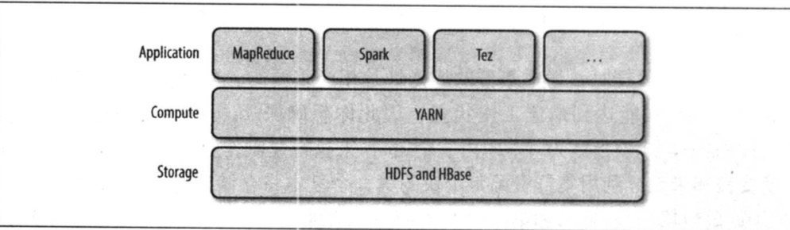

# 第四章 关于YARN

Apache YARN(Yet Another Resource Negotiator)是Hadoop集群资源管理系统。YARN被引入Hadoop2，最初为了改善MapReduce的实现，具有足够的通用性，可以支持其他的分布式计算模型。

YARN提供请求和使用资源的API，但这些API很少用于用户代码，相反，用户代码中用的是分布式计算框架的高层API，这些API建立在YARN之上且向用户隐藏了资源管理细节，使用户更加关注与计算逻辑的实现。图4-1对此进行了描述，分布式计算框架(MapReduce，Spark等)作为YARN的应用运行在集群计算层(YARN)和集群存储层(HDFS、HBASE)上。

 

​																	**图4-1 YARN应用**

还有一层建立在图4-1所示的Application计算框架之上，如：Pig，Hive和Crunch都是运行在MapReduce、Spark或Tez之上的处理框架，它们不直接操作YARN。

本章将介绍YARN特性。