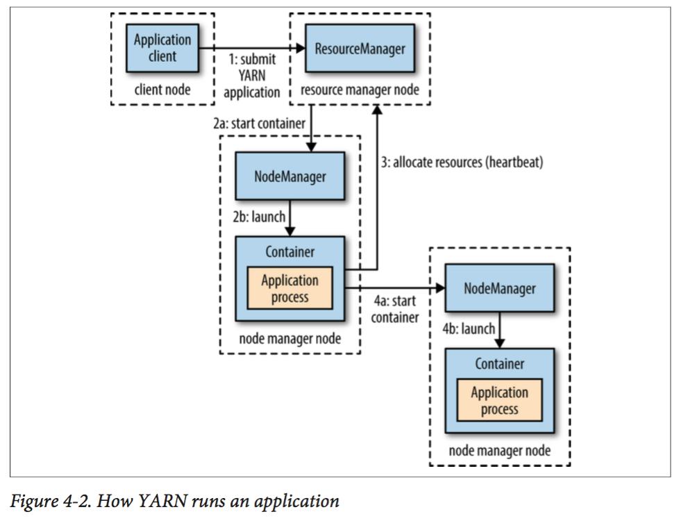

# 第四章 关于YARN

Apache YARN(Yet Another Resource Negotiator)是Hadoop集群资源管理系统。YARN被引入Hadoop2，最初为了改善MapReduce的实现，具有足够的通用性，可以支持其他的分布式计算模型。

YARN提供请求和使用资源的API，但这些API很少用于用户代码，相反，用户代码中用的是分布式计算框架的高层API，这些API建立在YARN之上且向用户隐藏了资源管理细节，使用户更加关注与计算逻辑的实现。图4-1对此进行了描述，分布式计算框架(MapReduce，Spark等)作为YARN的应用运行在集群计算层(YARN)和集群存储层(HDFS、HBASE)上。

 

​																	**图4-1 YARN应用**

还有一层建立在图4-1所示的Application计算框架之上，如：Pig，Hive和Crunch都是运行在MapReduce、Spark或Tez之上的处理框架，它们不直接操作YARN。

本章将介绍YARN特性。为后续关于Hadoop分布式处理框架相关内容提供理论支持。

## 4.1 剖析YARN应用运行机制

YARN通过两类长期运行的守护进程提供自己的核心服务：管理集群上资源使用的资源管理器(Resource Manager)、运行在集群所有节点上且能够启动和监控容器(container)的节点管理器(Node Manager) 。容器用于执行特定应用程序的进程，每个容器都有资源限制(内存、CPU等)。一个容器可以时一个Unix进程，也可以是一个Linux CGroup，取决于YARN的配置(见10.3.3节)。图4-2描述了YARN运行Application的过程，

 												**图 4-2 YARN应用的运行机制**

具体步骤说明如下：

1. 客户端联系Resource Manager(资源管理器)，要求它运行一个application master进程；客户端启动的application master在集群外，或在与客户端相同的JVM中。
2. Resource Manager找到一个能够在容器中启动application master的节点管理器(步骤2a，2b)；
3. application master一旦运行起来后能做些什么依赖于应用本身，并将计算结果返回给客户端；
4.  向Resource Manager请求更多资源，以运行一个分布式计算(4a，4b)；

YARN本身不会为Application的各部分(客户端，master和进程)彼此之间通信提供任何手段，YARN应用使用某种形式的远程通信机制，如Hadoop的RPC层来向客户端传递状态更新和返回结果，但是这些通信机制是专属于各个应用的，比如：Hadoop的RPC机制，Spark的RPC机制。

### 4.1.1 资源请求

YARN有一个灵活的资源请求模型，当请求多个容器时，可以指定每个容器需要的计算机资源数量(内存、CPU)，还可以指定对容器的本地限制要求。

本地化对于确保分布式数据处理算法高效使用集群带宽非常重要，因此，YARN允许一个应用为所申请的容器指定本地限制。本地限制可用于申请位于指定节点、机架或集群中任何位置 (该机架)外的容器。

如果本地限制无法满足，则不分配资源或者放宽本地话化限制。例如，一个节点由于已经运行了别的容器而无法启动新的容器，则从同一机架的其他节点启动一个容器；如果依然失败，则从集群其他机架上的任意节点启动容器。这里有启动容器的优先级顺序：本地节点 > 同一机架其他节点 > 其他机架节点。

通常情况下，当启动一个容器用于处理HDFS数据块，应用会向以下节点请求容器：

- 存储该数据块副本的任意节点；
- 存储副本节点机架中的一个节点
- 集群中任意节点

YARN应用可以在运行中的任意时刻提出申请资源，提供动态、灵活的方式在需要资源时提出请求，以提高资源利用率。例如，可以在最开始提出所有请求的资源，或者是运行中使用动态的方式申请资源。

Spark在集群上启动固定数量的执行器(最开始提出所有请求的资源)。MapReduce则分两步走，在最开始时申请map任务容器，reduce任务容器的启动则放在后期。

### 4.1.2 应用生命周期

YARN应用的生命周期差异很大，因此关注应用运行时长无太大意义，我们将应用到用户运行的作业之间的映射关系对应用分类：

- 第一种模型：一个用户作业对应一个应用，MapReduce即采取这种方式；
- 第二种模型：作业的每个工作流或每个用户对话对应一个应用，这种方法要比第一种模型效率更高，因此容器可以在作业之间迭代使用，并且能缓存作业之间的中间数据。Spark采取这样的模型。
- 第三种容器：多个用户共享一个长期运行的应用，这种应用通常是作为一种协调者的角色在运行。Impala使用这种模型提供一个代理应用，Impala守护进程通过该代理请求集群资源，由于避免了启动新application master带来的开销，一个总是开启的application master意味着用户将得到低延迟的查询响应。

### 4.1.3 构建YARN应用

从无到有编写一个YARN应用是一个相当复杂的事情，有很多现成的应用，在符合要求的情况下可以直接使用。例如：Spark和Tez运行一个作业的有向无环图；Spark Streaming、Storm可以处理流式数据。

许多项目都简化了构建YARN应用的过程。Apache Slider使用YARN上运行现有的分布式应用成为可能，Silder提供了控制手段，可以修改应用运行所在节点的数量，也可以暂停和恢复应用运行。

## 4.2 YARN与MapReduce 1对比

MapReduce1中，有两类守护进程控制着作业执行过程：一个**jobtracker**与多个**tasktracker**。jobtracker通过调度tasktracker上运行的任务来协调所有运行在系统上的作业。tasktracker在运行任务的同时将运行进度报告发送给jobtracker，jobtracker由此记录每项作业任务的整体进度情况，如果其中一个任务失败，jobtracker可以在另一个tasktracker节点上重新调度该任务。

MapReduce 1中jobtracker同时负责作业调度(将任务与tasktracker匹配)和任务进度监控(跟踪任务、重启失败或延迟任务；记录任务流水)。YARN中，这些职责由不同的实体负担的，它们分别是Resource Manager(资源管理器)和application master(每MapReduce作业一个)。jobtracker也负责存储已完成作业的作业历史，但是也可以运行一个作业历史服务器作为一个独立的守护进程来取代jobtracker。在YARN中，时间轴服务器(timeline server)负责存储应用历史信息，在Hadoop 2.5.1中，YARN的timeline server依旧不存储MapReduce作业历史，因此仍需要MapReduce作业历史服务器守护进程。

YARN中node manager对应MapReduce1的tasktracker。

​									**表4-1 MapReduce1和Yarn在组成上的比较**

| MapReduce1  | YARN                                                  |
| ----------- | ----------------------------------------------------- |
| Jobtracker  | Resource Manager、application master、timeline server |
| Tasktracker | node manager                                          |
| Slot        | container                                             |

YARN的很多设计是为了解决MapReduce1的局限性：

**可扩展性(Scalability)**

与MapReduce1相比，YARN可以在更大规模的集群上运行。当节点数达到4000，任务数达到40000时，MapReduce1会遇到可扩展性瓶颈，瓶颈源于jobtracker必须同时管理作业和任务。YARN利用Resource Manager和application master 分离的架构优点克服这个局限性，可以扩展到近1w个节点和10w个任务。

与jobtracker相比，一个MapReduce应用的每个实例都对应一个专门的application master，master管理进程在应用的持续期间运行。这个模型实际上与初始的Google MapReduce论文中描述的如何启动一个管理进程(master)运行一系列工作(worker)上的map和reduce任务。