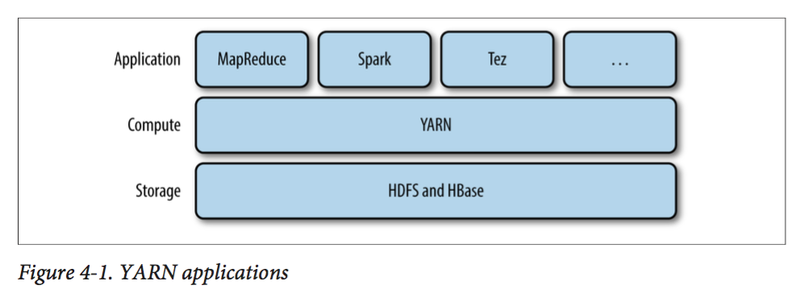

# 第四章 关于YARN

Apache YARN(Yet Another Resource Negotiator)是Hadoop集群资源管理系统。YARN被引入Hadoop2，最初为了改善MapReduce的实现，具有足够的通用性，可以支持其他的分布式计算模型。

YARN提供请求和使用资源的API，但这些API很少用于用户代码，相反，用户代码中用的是分布式计算框架的高层API，这些API建立在YARN之上且向用户隐藏了资源管理细节，使用户更加关注与计算逻辑的实现。图4-1对此进行了描述，分布式计算框架(MapReduce，Spark等)作为YARN的应用运行在集群计算层(YARN)和集群存储层(HDFS、HBASE)上。

 

​																	**图4-1 YARN应用**

还有一层建立在图4-1所示的Application计算框架之上，如：Pig，Hive和Crunch都是运行在MapReduce、Spark或Tez之上的处理框架，它们不直接操作YARN。

本章将介绍YARN特性。为后续关于Hadoop分布式处理框架相关内容提供理论支持。

## 4.1 剖析YARN应用运行机制

YARN通过两类长期运行的守护进程提供自己的核心服务：管理集群上资源使用的资源管理器(Resource Manager)、运行在集群所有节点上且能够启动和监控容器(container)的节点管理器(Node Manager) 。容器用于执行特定应用程序的进程，每个容器都有资源限制(内存、CPU等)。一个容器可以时一个Unix进程，也可以是一个Linux CGroup，取决于YARN的配置(见10.3.3节)。图4-2描述了YARN运行Application的过程，


 												**图 4-2 YARN应用的运行机制**

具体步骤说明如下：

1. 客户端联系Resource Manager(资源管理器)，要求它运行一个application master进程；客户端启动的application master在集群外，或在与客户端相同的JVM中。
2. Resource Manager找到一个能够在容器中启动application master的节点管理器(步骤2a，2b)；
3. application master一旦运行起来后能做些什么依赖于应用本身，并将计算结果返回给客户端；
4.  向Resource Manager请求更多资源，以运行一个分布式计算(4a，4b)；

YARN本身不会为Application的各部分(客户端，master和进程)彼此之间通信提供任何手段，YARN应用使用某种形式的远程通信机制，如Hadoop的RPC层来向客户端传递状态更新和返回结果，但是这些通信机制是专属于各个应用的，比如：Hadoop的RPC机制，Spark的RPC机制。

### 4.1.1 资源请求

YARN有一个灵活的资源请求模型，当请求多个容器时，可以指定每个容器需要的计算机资源数量(内存、CPU)，还可以指定对容器的本地限制要求。

本地化对于确保分布式数据处理算法高效使用集群带宽非常重要，因此，YARN允许一个应用为所申请的容器指定本地限制。本地限制可用于申请位于指定节点、机架或集群中任何位置 (该机架)外的容器。

如果本地限制无法满足，则不分配资源或者放宽本地话化限制。例如，一个节点由于已经运行了别的容器而无法启动新的容器，则从同一机架的其他节点启动一个容器；如果依然失败，则从集群其他机架上的任意节点启动容器。这里有启动容器的优先级顺序：本地节点 > 同一机架其他节点 > 其他机架节点。

通常情况下，当启动一个容器用于处理HDFS数据块，应用会向以下节点请求容器：

- 存储该数据块副本的任意节点；
- 存储副本节点机架中的一个节点
- 集群中任意节点

YARN应用可以在运行中的任意时刻提出申请资源，提供动态、灵活的方式在需要资源时提出请求，以提高资源利用率。例如，可以在最开始提出所有请求的资源，或者是运行中使用动态的方式申请资源。

Spark在集群上启动固定数量的执行器(最开始提出所有请求的资源)。MapReduce则分两步走，在最开始时申请map任务容器，reduce任务容器的启动则放在后期。

### 4.1.2 应用生命周期

YARN应用的生命周期差异很大，因此关注应用运行时长无太大意义，我们将应用到用户运行的作业之间的映射关系对应用分类：

- 第一种模型：一个用户作业对应一个应用，MapReduce即采取这种方式；
- 第二种模型：作业的每个工作流或每个用户对话对应一个应用，这种方法要比第一种模型效率更高，因此容器可以在作业之间迭代使用，并且能缓存作业之间的中间数据。Spark采取这样的模型。
- 第三种容器：多个用户共享一个长期运行的应用，这种应用通常是作为一种协调者的角色在运行。Impala使用这种模型提供一个代理应用，Impala守护进程通过该代理请求集群资源，由于避免了启动新application master带来的开销，一个总是开启的application master意味着用户将得到低延迟的查询响应。

### 4.1.3 构建YARN应用

从无到有编写一个YARN应用是一个相当复杂的事情，有很多现成的应用，在符合要求的情况下可以直接使用。例如：Spark和Tez运行一个作业的有向无环图；Spark Streaming、Storm可以处理流式数据。

许多项目都简化了构建YARN应用的过程。Apache Slider使用YARN上运行现有的分布式应用成为可能，Silder提供了控制手段，可以修改应用运行所在节点的数量，也可以暂停和恢复应用运行。

## 4.2 YARN与MapReduce 1对比

MapReduce1中，有两类守护进程控制着作业执行过程：一个**jobtracker**与多个**tasktracker**。jobtracker通过调度tasktracker上运行的任务来协调所有运行在系统上的作业。tasktracker在运行任务的同时将运行进度报告发送给jobtracker，jobtracker由此记录每项作业任务的整体进度情况，如果其中一个任务失败，jobtracker可以在另一个tasktracker节点上重新调度该任务。

MapReduce 1中jobtracker同时负责作业调度(将任务与tasktracker匹配)和任务进度监控(跟踪任务、重启失败或延迟任务；记录任务流水)。YARN中，这些职责由不同的实体负担的，它们分别是Resource Manager(资源管理器)和application master(每MapReduce作业一个)。jobtracker也负责存储已完成作业的作业历史，但是也可以运行一个作业历史服务器作为一个独立的守护进程来取代jobtracker。在YARN中，时间轴服务器(timeline server)负责存储应用历史信息，在Hadoop 2.5.1中，YARN的timeline server依旧不存储MapReduce作业历史，因此仍需要MapReduce作业历史服务器守护进程。

YARN中node manager对应MapReduce1的tasktracker。

​									**表4-1 MapReduce1和Yarn在组成上的比较**

| MapReduce1  | YARN                                                  |
| ----------- | ----------------------------------------------------- |
| Jobtracker  | Resource Manager、application master、timeline server |
| Tasktracker | node manager                                          |
| Slot        | container                                             |

YARN的很多设计是为了解决MapReduce1的局限性：

**可扩展性(Scalability)**

与MapReduce1相比，YARN可以在更大规模的集群上运行。当节点数达到4000，任务数达到40000时，MapReduce1会遇到可扩展性瓶颈，瓶颈源于jobtracker必须同时管理作业和任务。YARN利用Resource Manager和application master 分离的架构优点克服这个局限性，可以扩展到近1w个节点和10w个任务。

与jobtracker相比，一个MapReduce应用的每个实例都对应一个专门的application master，master管理进程在应用的持续期间运行。这个模型实际上与初始的Google MapReduce论文中描述的如何启动一个管理进程(master)运行一系列工作(worker)上的map和reduce任务。

**可用性(Avaliability)**

当服务守护进程失败时，通过另一个守护进程复制接管工作所需状态以便其继续提供服务，从而可以获取高可用性(HA，High Avaliability)。然而，jobtracker内存中大量快速变化的复杂状态，例如：每个任务状态每几秒会更新一次使得改进jobtracker服务获得高可用性非常困难。

由于YARN中jobtracker在资源管理器和application master之间进行了职责划分，高可用服务随之成为分而治之的问题：先为资源管理器提供高可用性；再为YARN应用(针对每个应用)提供高可用性。对于资源管理器和apllication master，Hadoop 2都支持MapReduce作业的高可用性。

**利用率(Utilization)**

MapReduce1中，每个tasktracker都配置有若干固定长度的slot，这些slot都是静态分配的，在分配时分划分为mapslot和reduce slot，map slot只能用于map任务，reduce slot只能用于reduce任务。

YARN中，一个节点管理器(node manager)管理一个资源池，而不是固定数目的slot，YARN上运行的MapRecude不会由于集群仅有map slot可用导致reduce任务必须等待的情况，如果能够获取运行任务所需资源，那么应用就会正常进行。

更进一步，YARN中的资源是精细化管理的，这样一个应用能够按需请求资源，而不是请求一个不可分割的、对于特定任务而言可能会太大(浪费资源)或太小(可能会导致失败)的slot。

**多租户(Multitenancy)**

在某种程度上，可以说YARN最大优点在于向MapReduce以外的其他类型的分布式应用开放了Hadoop，MapReduce仅是众多YARN应用中的一个。

用户甚至可以在同一个YARN集群上运行不同版本的MapReduce，这使得升级MapReduce的过程更好管理。注意：MapReduce的一些组件，例如作业历史服务器和shuffle句柄，和YARN自身一样，仍需要在集群范围内升级。

## 4.3 YARN中的调度

理想情况下，YARN应用发出的资源请求应该被立刻满足。然而现实中资源是有限的，一个繁忙的集群上，一个应用经常需要等待才能得到所需的资源。YARN调度器的工作就是根据既定策略为应用分配资源。调度通常是一个难题，并且没有所谓“最好”的策略，这也是为什么YARN提供了多种调度器和可配置策略供选择的原因。

### 4.3.1 调度选项

YARN中有三种调度器可用：FIFO调度器(FIFO Scheduler)，容量调度器(Capacity Scheduler)和公平调度器(Fair Scheduler)。FIFO调度器将应用放置在一个队列中，然后按照提交的顺序(先进先出)运行应用。首先为队列中第一个应用的请求分配资源，第一个应用请求被满足后再依次为队列下一个应用服务。

FIFO调度器的优点是，简单易懂，不需要任何配置，但是不适用于共享集群，大的应用会占据集群中的所有资源，每个应用必须按照提交顺序等待执行。在一个共享集群中，更适合使用容量调度器或公平调度器，这两种调度器都允许长时间运行的作业能够及时完成，同时也允许进行较小临时查询的用户能够在合理时间内得到返回结果。

调度器的差异如图4-3所示。

- 使用FIFO调度器的小作业一直被阻塞；

- 使用容量调度器时，一个独立的专门队列保证小作业一提交就可以启动，由于需要预留一定量的资源为小作业队列，因此这种策略是以整个集群利用率为代价的，与FIFO相比，大作业执行时间要长。

- 使用公平调度器，不需要预留一定量的资源，因为调度器会在所有运行的作业之间动态平衡资源。当第一个作业(大作业)启动时，作为集群唯一运行的作业，会被分配所有资源；当第二个作业(小作业)启动时，会被分配集群的一半资源，这样每个作业都会共享资源。

	注意：从第二个作业启动到获取公平共享资源之间会时间滞后，因为它必须登台第一个作业使用的容器用完并释放出资源，当小作业结束且不再申请资源后，大作业将回去在此使用全部的集群资源。最终效果是：既得到了较高的集群资源利用率，又能保证小作业全部及时完成。


​					**图4-3 使用FIFO调度器、Capacity调度器和Fair调取器运行大小作业时集群的利用率**

### 4.3.2 容量调度器配置

容量调度器允许多个组织共享一个Hadoop集群，每个组织可以分配到全部集群资源的一部分。每个组织被配置一个专门的队列，每个队列被配置为可以使用一定的集群资源。队列可以进一步按层次划分，组织内不同用户能够共享该组织队列所分配的资源，一个队列内，使用**FIFO调度策略**对应用进行调度。

如图4-3所示，单个作业使用资源不会超过其队列容量，然而，如果队列中有多个作业导致容量不够用。这时，容量调度器可能会降空余的资源分配给队列中的作业，及时超过队列容量，这称为**弹性队列(queue elasticity)**。如果属性yarn.scheuler.capacity.< queue-path >.user-limit-factor设置大于1，那么一个作业可以使用超过其队列容量的资源。

正常操作时，容量调度器不会通过强行中止来抢占容器。因此，如果一个队列随着需求增加，资源不够用时，那么这个队列就只能等待其他队列释放容器资源。缓解这种情况的做法是：为队列设置一个最大容量限制，这样这个队列就不会侵占其他队列过多资源，这是以牺牲队列弹性为代价的。

假设一个队列结构如下：

```xml
root
|---prod
|___dev
		|---eng
		|___science
```

 例4-1是一个基于上述队列层次的容量调度配置文件，文件名为：capacity-scheduler.xml ，位于HADOOP_HOME/ect/hadoop/下在root队列下定义两个队列：prod和dev，分别占40%和60%的容量。注意：对特定队列进行配置时，是通过以下形式的配置属性yarn.scheuler.capacity.< queue-path >.< sub-property>进行设置，< queue-path>表示队列的层次路径，例如：root.prod。

例4-1 容量调度器的基本配置文件

```xml
<?xml version="1.0">
<configuration>
	<!-- 设置root队列下的两个队列 -->
	<property>
		<name>yarn.scheduler.capacity.root.quque</name>
		<value>prod,dev</value>
	</property>
	<!-- 设置dev队列下的两个队列 -->
	<property>
		<name>yarn.scheduler.capacity.root.dev.quque</name>
		<value>eng,science</value>
	</property>
	<!-- 设置root.prod在root队列占据的队列容量 -->
	<property>
		<name>yarn.scheduler.capacity.root.prod.capacity</name>
		<value>40</value>
	</property>
	<!-- 设置root.dev在root队列占据的队列容量	 -->
	<property>
		<name>yarn.scheduler.capacity.root.dev.capacity</name>
		<value>60</value>
	</property>
	<!-- 设置root.dev队列最大队列容量 -->
	<property>
		<name>yarn.scheduler.capacity.root.dev.maximum-capacity</name>
		<value>75</value>
	</property>
	<!-- 设置root.dev.eng队列容量 -->
	<property>
		<name>yarn.scheduler.capacity.root.dev.eng.capacity</name>
		<value>50</value>
	</property>
	<!-- 设置root.dev.science队列容量 -->
	<property>
		<name>yarn.scheduler.capacity.root.dev.science.capacity</name>
		<value>50</value>
	</property>
</configuration>
```

dev队列进一步划分为eng和science两个容量相等的队列，dev队列最大容量为75%，因此即使prod队列空闲，dev队列也只会最多占用集群75%的资源。由于没有对与其他队列设置最大容量限制，eng或sicence中的作业可能会占用dev队列的所有容量(75%的集群资源)，而prod队列实际可能会占用全部集群资源。

除了可以配置队列层次和容量，还可以控制单个用户或者应用能被分配到的最大资源数量、同时运行的应用数量及队列的ACL认证。

**队列放置**

将应用放置到哪个队列中，取决人应用本身。例如：MapReduce中，可以通过设置属性mapreduce.job.queuename来指定要用的队列，如果队列不存在，则提交时会报错；如果不指定队列，则应用被放到一个名为**default**的默认队列中。

**Tips 容量调度器识别队列名**

容量调度器的队列名应该是队列层次名的最后一部分，完整的队列层次名是不会被识别的。例如：对于上述配置范围，prod和eng是合法的队列名，root.dev.eng和dev.eng是不会被识别的。

### 4.3.3 公平调度器配置

公平调度器旨在为所有运行的应用公平分配资源。图4-3展示了同一个队列中的资源公平共享。资源共享也可以在多个队列间工作。

如图4-4，假设两个用户*A*和*B*，分别拥有自己的队列。A启动一个作业，在B没有需求时A会分配到全部的可用资源；当A的作业仍在运行时，B启动一个作业，一段时间后，A和B中的每个作业都得到一半的可用资源。这时，如果B启动第二个作业且其他作业仍在运行，则B的第二个作业和B的其他运行作业共享B中资源，因此B的第二个作业占用1/4的集群资源，A仍继续占据1/2的集群资源。这样最终实现资源在用户之间的公平共享。


​																	**图4-4 用户队列间的公平共享**

**1. 启用公平调度器**

公平调度器的使用由属性yarn.resourcemanager.scheduler.class的设置决定，默认使用容量调度器，但是在一些Hadoop的分布式项目，如CDH中是默认使用公平调度器。将yarn-site.xml文件中的yarn.resourcemaneger.scheduler.class设置为org.apache.hadoop.yarn.server.resourcemanager.scheduler.fair.FairScheduler，即可使用公平调度器。

**2. 队列配置**

通过一个名为通过一个叫 fair-scheduler.xml的文件来进行配置。如果没有该配置文件，公平调度器的工作策略同之前描述的一样：每个应用放置在一个以用户名命名的队列中，队列是用户提交第一个应用时动态创建的。

通过配置文件可以对每个队列进行配置，这样可以对容量调度器支持的层次结构进行配置。如例4-2所示：

例4-2 公平调度器分配文件

```xml
<?xml version="1.0"?>
<allocations>
	<defaultQueueSchedulingPolicy>fair</defaultQueueSchedulingPolicy>

	<queue name="prod">
		<weight>40</weight>
		<schedulingPolicy>fifo</schedulingPolicy>
	</queue>

	<!-- 设置队列层次 -->
	<queue name="prod">
		<weight>60</weight>
		<queue name="eng"/>
		<queue name="science"/>
	</queue>

	<queuePlacementPolicy>
		<rule name="specified" created="false"/>
		<rule name="priamryGroup" created="false"/>
		<rule name="default" queue="dev.eng"/>
	</queuePlacementPolicy>
</allocations>
```

队列的层次使用嵌套queue元素定义，这里所有队列都是root队列的孩子。队列中的有权重元素，用于公平共享计算。本例中集群资源按照40:60分配给pro和dev队列。如果省略，默认使用公平调度。