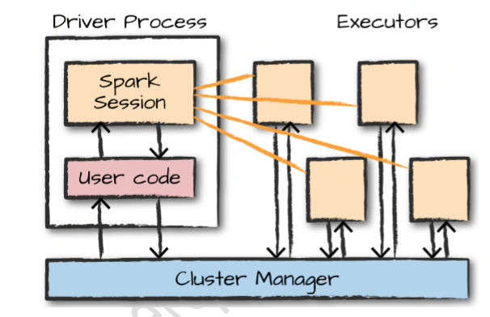
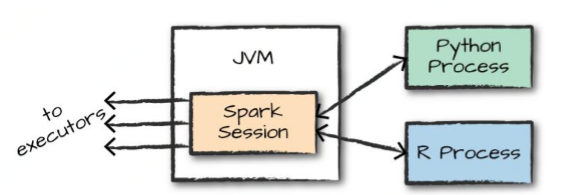
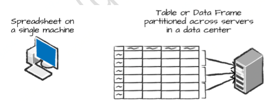
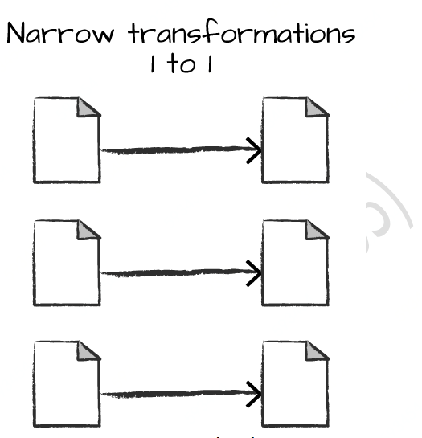
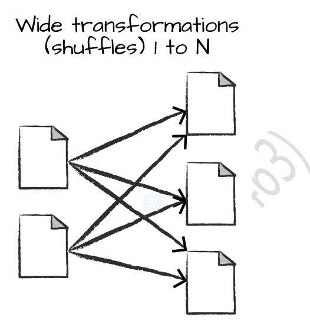
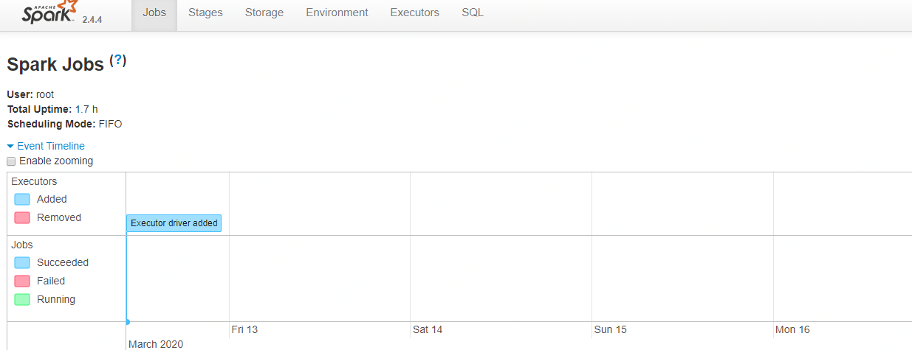

# 第二章 Spark简介

本章对 Spark 进行了一个简要的介绍，将介绍集群的核心架构、Spark 应用程序和使用DataFrames和SQL的 Spark 的结构化API。

## 2.1 Spark基本架构

单个机器没有足够的能力和资源来执行大量的信息(或者用户可能没有时间等待计算完成)。计算机的集群或组，将许多计算机的资源集合在一起，能够像使用一台计算机一样使用所有的累积资源。一组机器本身并不强大，需要一个框架来协调它们之间的 工作。Spark就是这样的框架，它管理和协调跨集群计算机上的数据执行任务。

Spark 将用于执行任务的集群交由集群管理器管理，如 Spark Standalone 集群管理器、 YARN 集群管理器、Mesos 集群管理器。客户端向这些集群管理器提交 Spark应用程序，资源管理器为应用程序提供资源，保证应用完成。

### 2.1.1 Spark应用程序

Spark应用程序由一个dirver进程(驱动器程序)和一组Executor进程组成。driver进程负责运行main函数，此进程位于Spark集群中的一个节点上。负责三件事：

- 维护有关Spark应用程序的信息；
- 相应用户的程序或输入；
- 分析、分配和调度Executor工作；

driver程序是 Spark 应用程序的核心，并在应用程序的生命周期内维护所有相关信息。 Executor进程实际执行driver分配给它们的工作，每个executor负责两件事: 

- 执行驱动器分配的代码；
- 将启动器Driver的计算状态报告给驱动节点；

图 2-1 演示了集群管理器(cluster manager)如何控制物理机器并分配资源给 spark 应用程序与执行器。集群管理器可以是四个核心集群管理器之一：Spark Standalone cluster manager、YARN、Kubermetas或Mesos。可以同时在集群上运行多个 Spark 应用程序。



​																**图2-1 Spark应用程序组成**

在图 2-1 中，可以看到左边的驱动程序和右边的四个执行器。在这个图中，我们删除
了集群节点的概念。用户可以通过配置指定每个节点上有多少个执行器。 

Spark除了集群cluster模式外，还具有本地local模式。driver驱动程序和executor执行器是简单的进程，这意味着它们可以在集群或者同一台机器上运行。local模式下，driver和executor以线程的方式在本地计算机上运行。

## 2.2 Spark语言API

Spark 的语言 api 使您可以使用各种编程语言运行 Spark 代码。在很大程度上，Spark 在每种语言中都呈现了一些核心的“概念”;然后将这些概念转换成在机器集群上运行。Spark 代码。如果只使用结构化 api，那么所有语言都具有类似的性能特征。

图 2-2 给出了这种关系的简单说明。 



每个语言 API 都维护相同的核心概念。用户可以使用 SparkSession 对象，这是运行 Spark 代码的入口点。当使用来自 Python 或 R的 Spark时，不会编写显式的JVM 指令; 相反，编写的 Python 和 R 代码可以将 Spark转换为代码，然后可以在executor jvm 上运行。 

### Spark’s APIs 

Spark 有两个基本的 api 集: low-level 的“非结构化”api，以及 higher-level 高级的结构化 api。

## 2.3 启动Spark

当开始编写 Spark 应用程序时，需要一种方法来将用户命令和数据发送给 spark，让其计算结果。首先需要创建一个 `SparkSession`，老版本是创建一个`SparkContext`。

 **注意：**启动 Spark 的本地模式，意味着运行`./bin/spark-shell `访问 Scala 控制台以启动交互式会话。还可以使用`./bin/pyspark`启动 Python 控制台。这将启动一个交互式 Spark 应用程序。还有一个方式，可以提交独
立的应用程序到 Spark，称为 `Spark -submit`，这样就可以提交一个预编译的应用程序到 spark 集群。

当在交互模式中启动 Spark 时，将隐式地创建一个 `SparkSession `来管理 Spark 应用程序。如果通过一个独立的应用程序启动它时，则必须在应用程序代码中创建`SparkSession `对象。

## 2.4 SparkSession

用户通过一个名为 `SparkSession `的驱动程序控制Spark应用程序。。SparkSession 实例是 Spark 在集群中执行用户定义操作的方式。在 Scala 和Python 中，当您启动控制台时，SparkSession 被实例化为 spark 变量，可以直接使用，Scala 和/或 Python 中的SparkSession: 

**Python**

```shell
___ _____/ /__
    _\ \/ _ \/ _ `/ __/  '_/
   /__ / .__/\_,_/_/ /_/\_\   version 2.4.4
      /_/

Using Python version 3.6.8 (default, Aug  7 2019 17:28:10)
SparkSession available as 'spark'.
>>> spark
<pyspark.sql.session.SparkSession object at 0x7f3fc935b7b8>
```

**scala**

```shell
Spark context Web UI available at http://master:4040
Spark context available as 'sc' (master = local, app id = local-1583979777475).
Spark session available as 'spark'.
Welcome to
      ____              __
     / __/__  ___ _____/ /__
    _\ \/ _ \/ _ `/ __/  '_/
   /___/ .__/\_,_/_/ /_/\_\   version 2.4.4
      /_/
         
Using Scala version 2.11.12 (Java HotSpot(TM) 64-Bit Server VM, Java 1.8.0_231)
Type in expressions to have them evaluated.
Type :help for more information.

scala> spark
res0: org.apache.spark.sql.SparkSession = org.apache.spark.sql.SparkSession@5aec151b
```

使用Spark创建一系列数字，这一系列数字就像电子表格中的一个命名列：

**Scala**

```scala
scala> val myRange=spark.range(1000).toDF("number");
myRange: org.apache.spark.sql.DataFrame = [number: bigint]
```

 **Python**

```python
>>> myrange=spark.range(1000).toDF("number");
>>> myrange
DataFrame[number: bigint]
```

这一系列数字代表一个分布式集合，当在一个集群上运行时，这个范围的每个部分都存在于一个不同的 executor 上。

## 2.5 DataFrames

DataFrames是最常见的结构化API，表示包含行和列的数据表，定义列和列类型的列表称为schema模式。可以将DataFrames看做指定列的电子表格。

Spark 有几个核心抽象: Datasets、DataFrames、SQL 表和弹性分布式数据集(RDDs)。这些不同的抽象都表示数据的分布式集合。最简单和最有效的是 DataFrames，它在所有语言中都可用。

图 2-3 说明了基本的区别：位于一台计算机上的电子表格，存在一个特定位置上。而`Spark DataFrame `可以跨越数千台计算机。把数据放在一台以上电脑上的原因如下：

- 数据太大而无法存储在一台机器上；
- 一台机器上执行计算花费时间太长 。



​														**图2-3 单机DataFrames与Spark DataFrames**

`DataFrame` 的概念并不是 Spark 特有的。R 和 Python都有类似的概念。然而，Python/R DataFrames(有一些例外)存在于一台机器上，而不是多台机器上。这限制了给定的 `DataFrame `只能使用某一台特定机器上存在的资源。因为 Spark 具有 Python接口，很容易将 `Pandas(Python) DataFrames`、`R DataFrames` 转换为
`Spark DataFrames`。 

### 2.5.1 Partitions

为了使每个Executor执行器并行执行任务，Spark将数据分解成块，这些数据块称为**partition(分区)**。一个分区是集群中的一个物理机器上的行集合，DataFrame 的分区表示了在执行过程中数据是如何在机器集群中物理分布的。如果只有一个分区，Spark 将只有一个并行任务，即使有数千个 Executor 执行器。如果您有多个分区，但只有一个Executor 执行器，Spark 仍然只有一个并行任务，因为只有一个计算资源。 

对于DataFrames不必手动或单独操作分区。只需在物理分区中指定数据的高级转换，Spark 将确定该工作将如何在集群上执行。

## 2.6 Transformations

在 Spark 中，核心数据结构是不可变的，这意味着它们在创建之后无法更改。可以使用Transformation操作对核心数据结构转换，生成新的核心数据结构。

例如，执行查找转换操作：

**Scala**

```scala
val divisBy2 = myRange.where("number % 2 = 0") 
```

**Python**

```python
divisBy2 = myRange.where("number % 2 = 0") 
```

**注意：**这些返回没有输出。这是因为只声明了一个抽象转换 where。Spark 将不会对`Transformation`进行操作，直到调用一个 action 操作，这被称为Spark**lazy**特性(延迟加载)。

**窄依赖转换(Narrow Transformation)**

窄依赖的转换是每个输入数据分区只对一个数据输出分区。如图 2-4 所示：



​												**图2-4 窄依赖(Narrow Transformation)**

**宽依赖转换(Wide Transformation)**

宽依赖的转换，一个输入数据分区对应多个输出分区。图 2-5显示宽依赖转换： 



​														**图2-5 Wide Transformation**

### 2.6.1 Lazy Evaluation

Lazy Evaluation意味着 Spark将等到最后一刻才执行一些计算指令。在 Spark中，不会在执行某个转换操作时立即修改数据，Spark会构建应用于源数据的逻辑转换计划，再将逻辑执行计划从原始的 DataFrame转换到一个流线型的物理计划，该计划将在整个集群中尽可能高效地运行。

Lazy Evaluation优点：避免加载和处理不需要的数据。例如，构建一个大型的 Spark 作业，但在最后指定一个过滤器，只需要从源数据中获取一行。最有效的执行方式是访问所需要的单个记录。。Spark 实际上是通过自动将过滤器向下推来优化它的。 

Spark 可以从端到端优化整个数据流。其中一个例子是 DataFrames 上的**谓词下推 pushdown**。

## 2.7 Actions

`transformation `转换允许Spark构建逻辑转换计划。为了触发计算，需要运行一个 `action`操作。`action `操作指示 `Spark `通过执行一系列 `transformation`转换计算结果。

有三种类型的action操作：

- 在控制台中查看数据的 action操作； 
- 数据收集的 action 操作；
- 输出到第三方存储系统的 action 操作；

最简单的action 操作是 count，它给出了 DataFrame 中记录的总数：

```
divisBy2.count()
```

在指定这个`count()`操作时，启动了一个Spark Job，运行过滤器 filter 转换(一个窄依赖转换)，然后是一个聚合(一个宽依赖转换)，它在每个分区基础上执行计数；最后通过一个收集 action，它将结果返回给driver端。

## 2.8 Spark UI

可以通过 Spark web UI 监视作业的进度。Spark UI 在 driver 节点的 4040 端口上可用。如果在本地模式下运行，则将是 http://localhost:4040。Spark UI 显示关于您的 Spark作业状态、环境和集群状态的信息。它非常有用，特别是对于调优和调试。图 2-6 展示了一个 Spark job 的示例 UI。 



## 2.9 Spark完整示例

