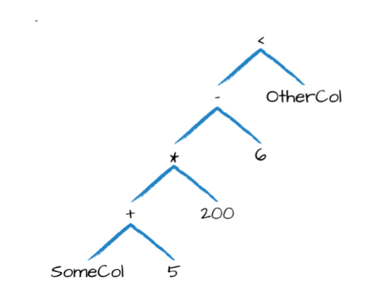

# 第五章 基本结构的操作

在第四章中，介绍了结构化API的核心抽象， 本章从体系结构概念转向使用战术工具，将使用这些工具来操纵DataFrame及其中的数据。 本章专门介绍DataFrame除聚合，窗口函数和连接(在后续章节介绍)的基本操作。从定义上讲，DataFrame由一系列记录（如表中的行）组成，这些记录的类型为Row，以及许多列（如电子表格中的列），模式定义每列中的名称和数据类型。 DataFrame的分区定义了整个集群中DataFrame或Dataset物理分布的布局。 分区方案定义了如何分配。

创建一个DataFrame：

**Scala**

```scala
val df = spark.read.format("json").load("/data/flight-data/json/2015-summary.json")
```

**Python**

```python
df = spark.read.format("json").load("/data/flight-data/json/2015-summary.json")
```

DataFame将具有列，并使用一种模式来定义它们，看一下当前DataFrame上的模式：

```
df.printSchema()
```

## 5.1 Schemas模式

Schemas模式定义了DataFrame的列名和类型。可以让数据源定义模式（称为读取时的模式schema-on-read），也可以自己显示定义。

在读取数据前，根据数据使用场景决定是否需要定义Schema。对于临时分析，读取时模式(schema-on-read)通常效果很好(尽管有时使用CSV或JSON等纯文本文件格式可能会有点慢)。但是，这也可能导致精度问题，例如在读取文件时将long类型错误地设置为整数。当使用Spark进行生产ETL时，自定义Schema比较好，尤其是在使用CSV和JSON等无类型数据源时，因为模式推断会根据所读取的数据类型的不同而有所不同。

从第4章中看到的简单文件开始，让以行分隔JSON的半结构化性质定义结构。这是来自美国运输局统计数据的航班数据：

**Scala**

```scala
spark.read.format("json").load("/data/flight-data/json/2015-summary.json").schema

Scala returns the following:
org.apache.spark.sql.types.StructType = ...
StructType(StructField(DEST_COUNTRY_NAME,StringType,true),
StructField(ORIGIN_COUNTRY_NAME,StringType,true),
StructField(count,LongType,true))
```

**Python**

```python
spark.read.format("json").load("/data/flight-data/json/2015-summary.json").schema

Python returns the following:
StructType(List(StructField(DEST_COUNTRY_NAME,StringType,true),
StructField(ORIGIN_COUNTRY_NAME,StringType,true),
StructField(count,LongType,true)))
```

模式是一种 `StructType`，由多个`StructField`字段组成，`StructField`具有名称、类型、布尔值标志，用于指定该列可以包含缺失值还是null值。最后，用户可以选择指定与该列关联的元数据 。 元数据是一种存储有关此列的信息的方式（Spark在其机器学习库中使用此信息）。

模式可以包含其他 `StructType`(Spark的复杂类型)。如果数据中的类型(在运行时)与模式不匹配，Spark将引发错误。下面的示例演示如何在DataFrame上创建特定的模式。

**Python**

```python
from pyspark.sql.types import StructField, StructType, StringType, LongType

myManualSchema = StructType([
StructField("DEST_COUNTRY_NAME", StringType(), True),
StructField("ORIGIN_COUNTRY_NAME", StringType(), True),
StructField("count", LongType(), False, metadata={"hello":"world"})
])
df = spark.read.format("json").schema(myManualSchema)\
.load("/data/flight-data/json/2015-summary.json")
```

**Scala**

```scala
import org.apache.spark.sql.types.{StructField, StructType, StringType, LongType}
import org.apache.spark.sql.types.Metadata

val myManualSchema = StructType(Array(
StructField("DEST_COUNTRY_NAME", StringType, true),
StructField("ORIGIN_COUNTRY_NAME", StringType, true),
StructField("count", LongType, false,
Metadata.fromJson("{"hello":"world"}"))
))

val df = spark.read.format("json").schema(myManualSchema).load("/data/flight-data/json/2015-summary.json")
```

正如第4章所讨论的，不能简单地通过每种语言类型设置类型，因为 Spark 维护了它自己的类型信息。现在讨论一下scheme 定义的内容：columns。 

## 5.2 列和表达式(Columns 和 Expressions) 

Spark中的列类似于电子表格中的列。可以从DataFrame 中选择列、操作列和删除列，这些操作称为
Expressions 表达式。

对于Spark而言，列是逻辑构造，仅表示通过表达式基于每个记录计算的值。这意味着，如果计算一列的值，需要有DataFrames的一行数据。不能在DataFrame上下文之外操作单个列；必须在DataFrame中使用Spark转换来修改列的内容。

**Scala**

```scala
import org.apache.spark.sql.functions.{col, column}

col("someColumnName")
column("someColumnName")
```

**Python**

```python
from pyspark.sql.functions import col, column

col("someColumnName")
column("someColumnName")
```

在这本书中将使用`col( )`函数。如前所述，这个列可能存在于DataFrames中，也可能不存在。在将列名称与 Catalog 中维护的列进行比较之前，列不会被解析，即列是 unresolved。

**显式列引用**

如果需要引用特定的DataFrame 的列，可以在特定的DataFrame上使用col方法。

### 5.2.2 表达式Expressions

上一节提到过，列是表达式，但表达式是什么? 表达式是在 DataFrame 中数据记录的一个或多个值上的一组转换。把它想象成一个函数，它将一个或多个列名作为输入，解析它们，然后潜在地应用更多的表达式，为数据集中的每个记录创建一个单一值。这个单一值可以是Map或Array之类的复杂类型。在最简单的情况下，通过expr函数创建的表达式仅是DataFrame列引用。在最简单的情况下，`expr("someCol")`等同于`col("someCol")`。

#### Columns as expressions 列作为表达式

列提供了表达式功能的子集。如果使用 `col()` 并想在该列上执行转换，那必须在该列引用上执行转换，使用表达式时，expr函数实际上解析字符串中的转换和列引用，并且可以将其传递到进一步转换中。举例：`expr("someCol - 5")`， `col("someCol") - 5` 与`expr("someCol") - 5` 是相同转换。

这是因为Spark将这些内容编译为指定操作顺序的逻辑树，有以下几个关键点：

- 列只是表达式
- 列和列的转换操作编译为与经过解析的表达式拥有相同的逻辑计划

举例说明：

```
(((col("someCol") + 5) * 200) - 6) < col("otherCol") 
```

图 5-1 展示一个逻辑树的整体概述。



这看起来很熟悉，因为它是一个有向无环图。此图等价于以下代码：

**Scala**

```scala
import org.apache.spark.sql.functions.expr
expr("(((someCol + 5) * 200) - 6) < otherCol")
```

**Python**

```python
from pyspark.sql.functions import expr
expr("(((someCol + 5) * 200) - 6) < otherCol")
```

需要查看DataFrame的列，可以使用诸如`printSchema`之类的方法来完成；但是，如果要以编程方式访问列，则可以使用columns属性查看DataFrame上的所有列：

```
spark.read.format("json").load("/data/flight-data/json/2015-summary.json").columns
```

