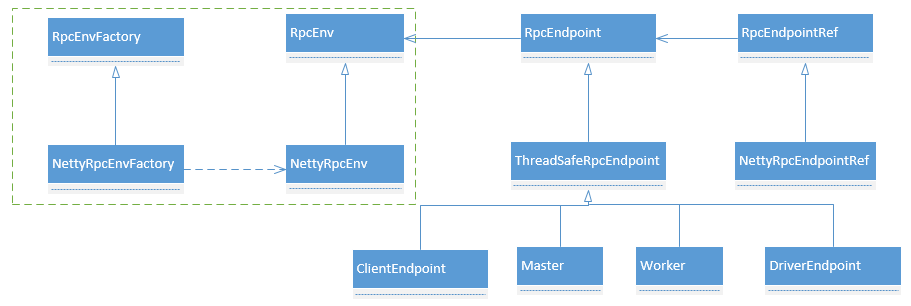
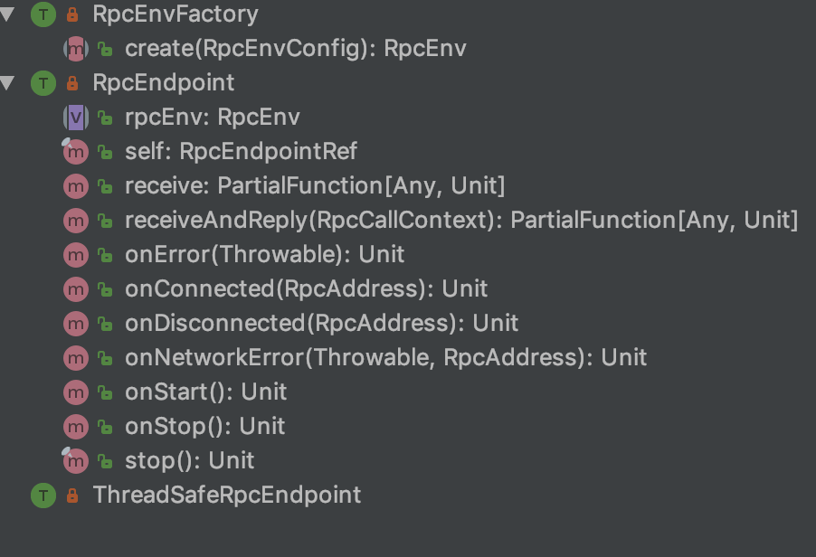
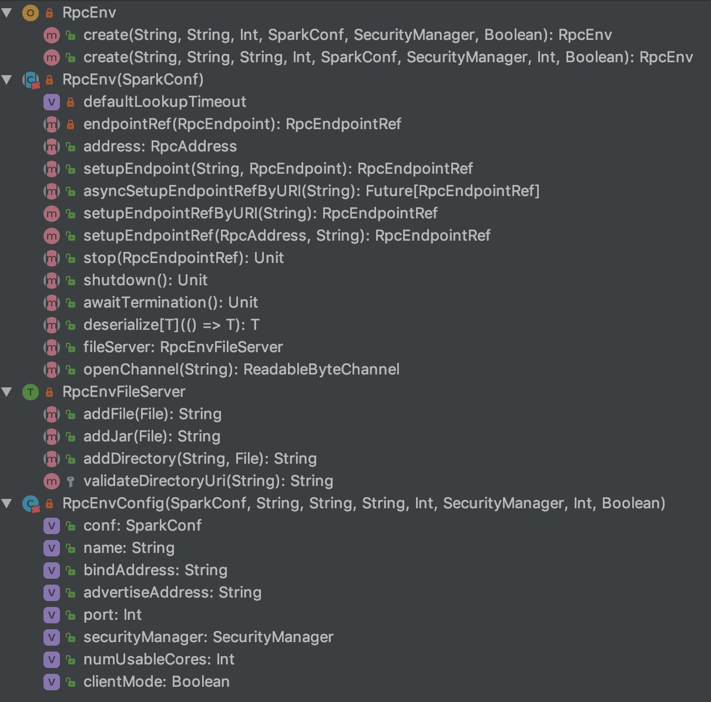
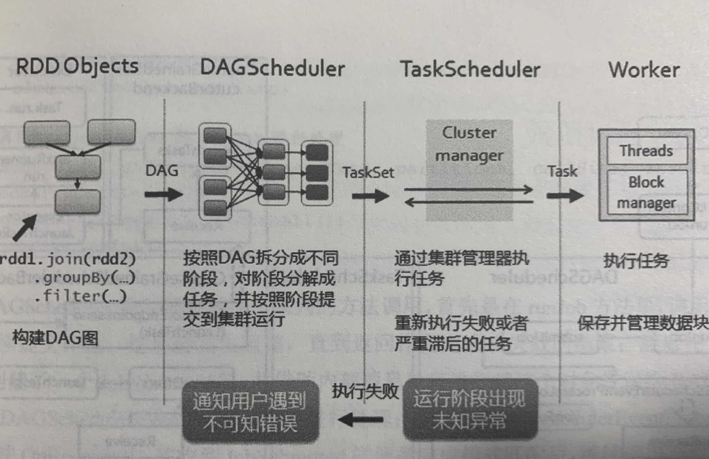
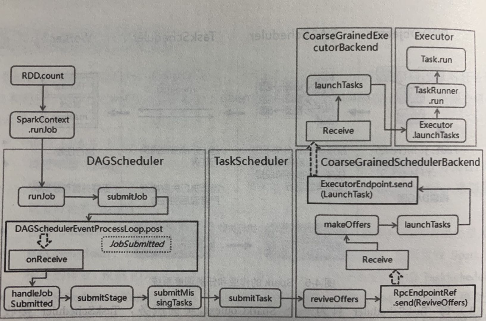

# 第四章 Spark核心原理

在描述Spark运行基本流程前，我们先介绍Spark基本概念，如图4-1所示：


​																		**图4-1 Spark运行结构图**

- **Applocation(应用程序)：**是指用户编写的Spark应用程序，包含驱动程序(Driver)和分布在集群多个节点上运行的Executor代码，在执行过程中由一到多个作业组成。
- **Driver( 驱动程序)：**Spark中的Driver即运行上述Application的main函数并创建SparkContext，其中创建SparkContext的目的是为了准备Spark Application的运行环境。SparkContext负责与ClusterManager通信，进行资源申请、任务分配和监控等。当Executor执行完毕，Driver负责将SparkContext关闭。
- **Cluster Manager(集群资源管理器)：**是指在集群上获取资源的外部服务，目前有以下几种资源管理器：
	1. **Standalone：**Spark原生资源管理，由Master节点负责资源管理
	2. **Hadoop Yarn：**由Yarn的ResourceManager负责资源的管理
	3. **Mesos：**由Mesos中的Mesos Master负责管理
- **Worker(工作节点)：**集群中任何可以运行Application代码的节点。在Yarn和Spark on Yarn模式中指的是NodeManager；在Standalone中指的是通过Slave文件配置的Worker节点。
- **Master(总控进程)：**Spark Standalone模式下的主节点，负责管理和分配集群资源来运行Spark Application。
- **Executor(执行进程)：**Aplication运行在Worker节点上的一个进程，该进程负责从线程池中抽取空余线程运行Task，Task并行的数量取决于分配给Executor进程的CPU数量。最终Executor将结果写入内存或磁盘中，每个Application都独立拥有一批Executor。

## 4.1 消息通信原理

### 4.1.1 Spark消息通信架构

Spark中定义了通信框架接口，接口实现中调用Netty的具体方法（Spark 2.0版本之后）。在框架中以RpcEndPoint和RpcEndPointRef实现了Actor和ActorRef相关动作，RpcEndPointRef是RpcEndPoint的引用，它们关系如图4-2所示：



​																	**图4-2 Spark消息通讯类图**

消息通讯框架使用工厂模式，实现了对Netty的结偶，能够根据需要引入其他消息通讯工具。Spark具体实现步骤如下：

- 定义RpcEnvFactory与RpcEnv两个抽象类，类的描述如图4-3，4-4所示。RpcEnv定义了RPC通信框架启动、关闭和停止等抽象方法，RpcEnvFactory定义了创建抽象方法；

	

	​															**图4-3 RpcEnvFactory**

	

	​																	**图4-4 RpcEnv**

- NettyRpcEnv和NettyRpcFactory使用Netty对继承方法进行了实现，NettyRpcEnv中的setupEndPoint方法将RpcEndpoint和RpcEndpointRef已键值对的方式存放在线程安全的ConcurrentHashMap中。

- 在RpcEnv类中通过反射的方式实现了创建RpcEnv实例的静态方法。

在各模块使用中，如Master、Worker等，会先使用RpcEnv的静态方法创建RpcEnv实例，然后实例化Master，由于Master继承于ThreadSafeRpcEndpoint，因此创建的Master实例是一个线程安全的终端点，接着调用RpcEnv的setupEndPoint方法，把Master的终端点和其对应的引用注册到RpcEnv中。在消息通信中，只要其他对象获取了Master终端点的引用，就可以与Master通信。

Master.scala类的startRpcEnvAndEndPoint方法启动消息通信框架代码如下：

```scala
/**
   * Start the Master and return a three tuple of:
   *   (1) The Master RpcEnv
   *   (2) The web UI bound port
   *   (3) The REST server bound port, if any
   */
  def startRpcEnvAndEndpoint(
      host: String,
      port: Int,
      webUiPort: Int,
      conf: SparkConf): (RpcEnv, Int, Option[Int]) = {
    val securityMgr = new SecurityManager(conf)
    val rpcEnv = RpcEnv.create(SYSTEM_NAME, host, port, conf, securityMgr)
    val masterEndpoint = rpcEnv.setupEndpoint(ENDPOINT_NAME,
      new Master(rpcEnv, rpcEnv.address, webUiPort, securityMgr, conf))
    val portsResponse = masterEndpoint.askSync[BoundPortsResponse](BoundPortsRequest)
    (rpcEnv, portsResponse.webUIPort, portsResponse.restPort)
  }
```

Spark运行过程中，Master、Driver、Worker以及Executor等模块之间由实践驱动消息的发送。下面以Standalone为例，分析Spark启动过程和Application运行过程中如何通信。

### 4.1.2 Spark启动消息通信

## 4.2 作业执行原理

Spark的作业和任务调度系统是其核心，能够有效地进行调度根本原因是对任务划分有向无环图（DAG）和容错，使得从底层到顶层的各个模块之间调用和处理游刃有余。

- **作业（Job）：**RDD中由行动操作生成的一个或者多个调度阶段。
- **调度阶段（Stage）：**每个Job会因为RDD之间的依赖关系拆分成多组任务集合（TaskSet），调度阶段的划分是由DAGScheduler来划分的，调度阶段有Shuffle Map Stage和Result Stage两种。
- **任务（Task）：**分发到Executor上的工作任务，是Spark实际执行应用的最小单元。
- **DAGScheduler：**DAGScheduler是面向调度阶段的任务调度器，负责接收Spark应用提交的作业，根据RDD的依赖关系划分调度阶段，并提交调度阶段给TaskScheduler。，
- **TaskScheduler：**TaskScheduler是面向任务的调度器，接收DAGScheduler提交过来的调度阶段，把Task任务分发到worker节点执行，由Worker节点的Executor来实际运行任务。

### 4.2.1 概述

Spark的作业调度主要指的是基于RDD的一系列操作构成一个作业，然后在Executor中执行。RDD的操作算子分为转换操作和行动操作，由于转换操作的Lazy机制，因此只有行动操作会提交作业。Spark任务调度中最重要的是DAGScheduler和TaskScheduler，DAGScheduler负责任务的逻辑调度，将作业拆分成不同阶段的具有有依赖关系的任务集，TaskScheduler负责具体任务的调度执行。通过图4-5进行详细说明。



​																	**图4-5 Spark作业和任务调度系统**

1. Spark应用中进行各种转换操作，通过行动操作触发作业提交运行。提交后根据RDD之间的依赖关系构建DAG图，提交给DAGScheduler解析；

2. DAGScheduler是面向调度阶段的高层次调度器，DAGScheduler根据是否为宽依赖将DAG拆分为相互依赖的调度阶段（Stage），当遇到宽依赖就划分为新的调度阶段。每个Stage有一个或多个Task任务，形成任务集（TaskSet）提交给底层调度器TaskScheduler进行调度。另外，DAGScheduler还会：

	（1）记录RDD被存入磁盘等物化操作；

	（2）寻求任务的最优调度，例如：数据本地性，**移动数据不如移动计算**；

	（3）监控调度阶段运行过程，如果某个调度阶段失败，则重新提交调度阶段；

3. 一个SparkContext只有一个TaskScheduler，TaskScheduler接收来自DAGScheduler的TaskSet（任务集），负责把TaskSet以Task形式一个个分发到集群Worker节点的Executor上运行，如果某个Task运行失败，TaskScheduler将重试分发该Task，重新执行；如果TaskScheduler发现某个Task一直未运行结束，则在集群Worker节点中再启动同样的任务，看哪个任务先结束就是用哪个任务，即**Spark推测执行(speculative)机制**；

4. Worker中的Executor接收到TaskScheduler发送过来的任务后，以多线程方式运行，每个线程负责一个任务，执行完毕，结果返回给TaskScheduler，不同任务类型返回结果不同。

Spark系统实现类图如4-6所示：



​											**图4-6 Spark独立运行模式作业执行类调用关系图**