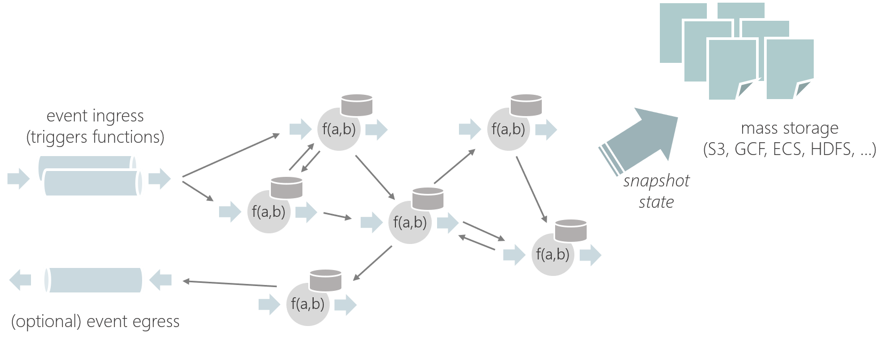
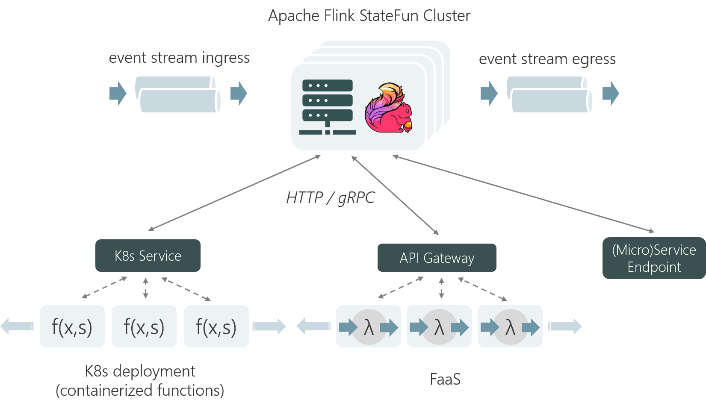
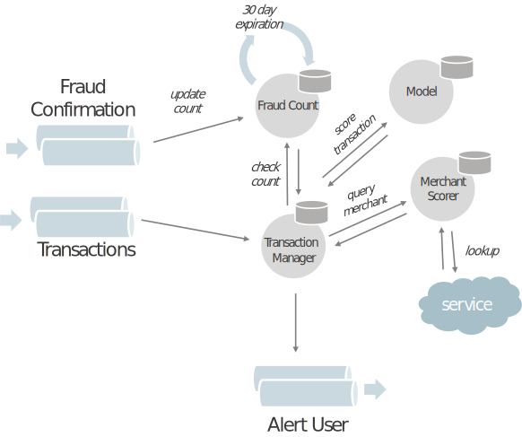

# Stateful Functions - Event-driven Applications on Apache Flink

Stateful Function是一种能够简化构建分布式有状态应用程序的API。它基于持久化状态，能够以强一致性来保证动态交互。

## 1. Stateful Functions Applications

有状态功能是存在于代表实体的多个实例中的一小段逻辑/代码，类似于参与者。通过消息调用函数，它们是：

- **Stateful**

	函数具有嵌入式的容错状态，可以像变量一样在本地访问

- **Virtual**

	非常类似于Faas，函数不保留资源——不活动的函数不会消耗CPU/内存

应用由多个功能模块的方法组成，可以与以下任意交互：

-  **Exactly-once Semantics**

	状态和消息传递齐头并进，提供了一次精确的消息/状态语义。

-  **Logical Addressing**

	函数通过逻辑地址相互传递消息。 无需发现服务

- **Dynamic and Cyclic Messaging**

	消息传递模式无需预先定义为数据流(动态)，也不限于DAG(循环)。

## 2. A Runtime built for Serverless Architectures

有状态功能运行时旨在提供一组类似于无服务器功能的属性。

运行时基于ApacheFlink构建，具有以下设计原则：

-  **Logical Compute/State Co-location:**

	消息，状态访问/更新和功能调用被紧密地管理在一起。 这确保了开箱即用的高度一致性。

-  **Physical Compute/State Separation:**

	功能可以远程执行，消息和状态访问作为调用请求的一部分提供。 这样，可以像无状态流程一样管理功能，并支持快速扩展，滚动升级和其他常见的操作模式。

-  **Language Independence**

	函数调用使用简单的基于HTTP/gRPC的协议，因此可以以各种语言轻松地实现。

这样就可以在Kubernetes部署，FaS平台或（微）服务后面执行功能，同时在功能之间提供一致的状态和轻量级消息传递。

## 3. 主要优点

- **Dynamic Messaging**  

	该API可以构建和组合可以相互动态任意通信的函数。与传统流处理拓扑的非循环性质相比，提供了更大的灵活性。

- **Consistent State**  

	方法可以将本地状态持久化，并且与方法间的消息集成在一起。提供了精准一次性的状态访问/更新和保证开箱即用的有效消息传递。

- **Multi-language Support**

- **No Database Required**

	状态持久性和容错能力基于Apache Flink强大的分布式快照模型。 这只需要简单的Blob存储层(例如S3，GCS，HDFS)来存储状态快照。

- **Cloud Native**

	Stateful Function的状态和构成可以与Kubernetes，Knative和AWS Lambda等现代无服务器平台的功能结合使用。

- **"Stateless" Operation**

	状态访问是函数调用的一部分，因此有状态函数应用程序的行为就像无状态进程，可以以相同的简单性和好处进行管理，例如快速可伸缩性，从零扩展到零和滚动/零停机升级。

## 4. 使用示例：欺诈检测的交易平分

想象一个应用程序接收财务信息并针对超过给定阈值欺诈分数(即欺诈)的每笔交易发出警报。 要使用状态功能构建此示例，可以定义四个不同的功能，每个功能跟踪其自身的状态：

- **Fraud Count**  跟踪在连续30天的时间内针对某个帐户进行的举报欺诈交易的总数

- **Merchant Scorer**   依靠第三方服务返回每个商人的可信赖度分数

- **Transaction Manager**  丰富交易记录以创建用于评分的特征向量，并发出欺诈警报事件

- **Model**  评分模型，根据来自交易管理器的输入特征向量对交易进行评分

- **Keeping track of fraudulent reports**

	该应用程序的入口点是“欺诈确认”和“交易”入口(例如Kafka主题)。 当事件从“欺诈确认”流入时，“欺诈计数”功能会递增其内部计数器，并在此状态上设置30天的到期计时器。 在这里，将存在多个“欺诈计数”实例。例如：每个客户帐户一个。 30天后，“欺诈计数”功能将(从其自身)接收到到期消息并清除其状态。

- **Enriching and scoring transactions**

	在从“交易”入口接收事件时，交易管理器调取欺诈计数器获取当前客户账户的欺诈案件的当前计数。 它还向Merchant Score发送有关交易商户的信誉分数的消息。 “交易管理器”使用报告的欺诈案件数和商户分数创建特征向量，然后将其发送到模型进行评分。

- **Emitting alerts**

	根据交易管理器返回的分数是否超过阈值，向”Alert User“出口发出警报事件。