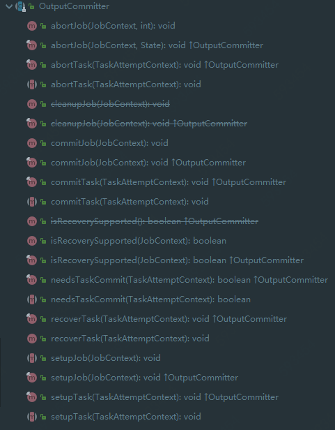

# MapReduce Tutorial

## 1. 使用条件

确定Hadoop集群已经安装、配置并启动，伪分布和集群模式配置详情：

- [Single Node Setup](https://hadoop.apache.org/docs/stable/hadoop-project-dist/hadoop-common/SingleCluster.html)
- [Cluster Setup](https://hadoop.apache.org/docs/stable/hadoop-project-dist/hadoop-common/ClusterSetup.html) 

## 2. 概述

Hadoop MapReduce是一个软件框架，用于轻松编写分布式应用程序，应用程序以可靠，容错的方式并行处理大型硬件集群(数千个节点)上的大量数据(数TB数据集)。

MapReduce作业通常将输入数据集分成独立的块，这些任务由map任务以完全并行的方式处理。 计算框架对map任务输出排序，然后将其输入到reduce任务。通常作业的输入和输出都存储在文件系统中。 该框架负责安排任务，监视任务并重新执行失败的任务。

通常，计算节点和存储节点是相同的，即MapReduce框架和Hadoop分布式文件系统在同一组节点上运行。 此配置使框架可以在已经存在数据的节点上有效地调度任务，从而在整个群集中产生很高的聚合带宽。

MapReduce框架由一个master ResourceManager，集群每个节点上的nodeManager和每个应用的MRAppMaster构成。

应用程序通过适当的接口或抽象类来实现map、reduce方法并制定输入/输出路径。上述以及其他作业参数构成作业配置。

然后，Hadoop作业客户端将作业(jar/可执行文件等)和配置提交给ResourceManager，然后由ResourceManager负责将软件/配置分发给worker节点，调度任务并对其进行监视，向客户端提供应用的状态和运行诊断信息。

尽管Hadoop框架使用Java编写，但是MapReduce应用不必使用Java：

- Hadoop Streaming是一个实用程序，允许用户使用任何可执行文件(例如shell)，作为mapper和/或reducer来创建和运行作业。
- Hadoop Pipes是SWIG兼容的C ++ API，用于实现MapReduce应用程序(基于JNI™)

## 3. 输入与输出

MapReduce框架仅在<key，value>对上操作，即该框架将作业的输入视为一组<key，value>对，并生成一组<key，value>对作为任务的输出。map输入<K,V>的类型与reduce输出的<K,V>类型可能不相同。

键和值类必须由框架序列化，因此需要实现Writable接口。 另外，key的实体类必须实现WritableComparable接口，以方便框架进行排序。

MapReduce作业的输入和输出类型：

```
(input) <k1, v1> -> map -> <k2, v2> -> combine -> <k2, v2> -> reduce -> <k3, v3> (output)

```

## 4. WordCount v1.0示例

在进入细节之前，让我们来看一个MapReduce应用程序示例，以了解其工作方式。

WordCount是一个简单的应用程序，可以计算给定输入集中每个单词的出现次数。

### 4.1 代码

```java
import java.io.IOException;
import java.util.StringTokenizer;

import org.apache.hadoop.conf.Configuration;
import org.apache.hadoop.fs.Path;
import org.apache.hadoop.io.IntWritable;
import org.apache.hadoop.io.Text;
import org.apache.hadoop.mapreduce.Job;
import org.apache.hadoop.mapreduce.Mapper;
import org.apache.hadoop.mapreduce.Reducer;
import org.apache.hadoop.mapreduce.lib.input.FileInputFormat;
import org.apache.hadoop.mapreduce.lib.output.FileOutputFormat;

public class WordCount {

  public static class TokenizerMapper
       extends Mapper<Object, Text, Text, IntWritable>{

    private final static IntWritable one = new IntWritable(1);
    private Text word = new Text();

    public void map(Object key, Text value, Context context
                    ) throws IOException, InterruptedException {
      StringTokenizer itr = new StringTokenizer(value.toString());
      while (itr.hasMoreTokens()) {
        word.set(itr.nextToken());
        context.write(word, one);
      }
    }
  }

  public static class IntSumReducer
       extends Reducer<Text,IntWritable,Text,IntWritable> {
    private IntWritable result = new IntWritable();

    public void reduce(Text key, Iterable<IntWritable> values,
                       Context context
                       ) throws IOException, InterruptedException {
      int sum = 0;
      for (IntWritable val : values) {
        sum += val.get();
      }
      result.set(sum);
      context.write(key, result);
    }
  }

  public static void main(String[] args) throws Exception {
    Configuration conf = new Configuration();
    Job job = Job.getInstance(conf, "word count");
    job.setJarByClass(WordCount.class);
    job.setMapperClass(TokenizerMapper.class);
    job.setCombinerClass(IntSumReducer.class);
    job.setReducerClass(IntSumReducer.class);
    job.setOutputKeyClass(Text.class);
    job.setOutputValueClass(IntWritable.class);
    FileInputFormat.addInputPath(job, new Path(args[0]));
    FileOutputFormat.setOutputPath(job, new Path(args[1]));
    System.exit(job.waitForCompletion(true) ? 0 : 1);
  }
}
```

### 4.2 运行

配置环境变量

```sh
export JAVA_HOME=/usr/java/default
export PATH=${JAVA_HOME}/bin:${PATH}
export HADOOP_CLASSPATH=${JAVA_HOME}/lib/tools.jar
```

打包WordCount

```sh
bin/hadoop com.sun.tools.javac.Main WordCount.java
jar cf wc.jar WordCount*.class
```

输入/输出文件路径：

```sh
/user/joe/wordcount/input - input directory in HDFS
/user/joe/wordcount/output - output directory in HDFS

$ bin/hadoop fs -ls /user/joe/wordcount/input/
/user/joe/wordcount/input/file01
/user/joe/wordcount/input/file02

$ bin/hadoop fs -cat /user/joe/wordcount/input/file01
Hello World Bye World

$ bin/hadoop fs -cat /user/joe/wordcount/input/file02
Hello Hadoop Goodbye Hadoop
```

运行应用：

```sh
bin/hadoop jar wc.jar WordCount /user/joe/wordcount/input /user/joe/wordcount/output
```

输出结果：

```sh
hadoop fs -cat /user/joe/wordcount/output/part-r-00000

Bye 1
Goodbye 1
Hadoop 2
Hello 2
World 2
```

应用程序可以使用-files选项指定以逗号分隔的本地文件路径列表，这些路径将上传至任务的当前工作目录中。-libjars选项允许应用程序将jar添加到map、reduce类路径下。-archives选项将逗号分隔的归档列表作为参数传递，并且在当前任务工作目录中创建了带有归档文件名称的链接。 有关命令行选项的更多详细信息，请参见[Commands Guide](https://hadoop.apache.org/docs/stable/hadoop-project-dist/hadoop-common/CommandsManual.html)。

使用-libjars，-files和-archives运行wordcount示例：

```sh
hadoop jar hadoop-mapreduce-examples-<ver>.jar wordcount -files cachefile.txt -libjars mylib.jar -archives myarchive.zip input output
```

在这里，myarchive.zip将被放置并解压缩到名为myarchive.zip的目录中。

用户可以使用＃为通过-files和-archives选项传递的文件和归档指定不同的别名。

```sh
bin/hadoop jar hadoop-mapreduce-examples-<ver>.jar wordcount -files dir1/dict.txt#dict1,dir2/dict.txt#dict2 -archives mytar.tgz#tgzdir input output
```

在这里，任务可以分别使用符号名称dict1和dict2访问文件dir1/dict.txt和dir2/dict.txt。 归档文件mytar.tgz将被放入名为tgzdir的目录下并取消归档。

应用程序可以通过在命令行上使用-Dmapreduce.map.env，-Dmapreduce.reduce.env和-Dyarn.app.mapreduce.am.env选项在命令行上分别指定map，reduce和appMaster的环境变量。

```sh
bin/hadoop jar hadoop-mapreduce-examples-<ver>.jar wordcount -Dmapreduce.map.env.FOO_VAR=bar -Dmapreduce.map.env.LIST_VAR=a,b,c -Dmapreduce.reduce.env.FOO_VAR=bar -Dmapreduce.reduce.env.LIST_VAR=a,b,c input output
```

### 4.3 Walk-through

WordCount应用程序非常简单。

```java
public void map(Object key, Text value, Context context) throws IOException, InterruptedException {
  StringTokenizer itr = new StringTokenizer(value.toString());
  while (itr.hasMoreTokens()) {
    word.set(itr.nextToken());
    context.write(word, one);
  }
}
```

Mapper实现通过map方法一次处理一行，这由指定的TextInputFormat提供。 然后，它通过StringTokenizer将行拆分为用空格分隔的标记，并发出键值对<word,1>。

对于给定的样本输入，第一个map Task发出：

```java
< Hello, 1>
< World, 1>
< Bye, 1>
< World, 1>
```

第二个mapTask发出：

```
< Hello, 1>
< Hadoop, 1>
< Goodbye, 1>
< Hadoop, 1>
```

在本教程的后面部分，将详细了解为给定任务生成的map数量，以及如何以准确的方式控制它们。

```java
    job.setCombinerClass(IntSumReducer.class);
```

WordCount还指定一个combiner， 因此，在对键进行排序之后，每个map的输出将通过本地combiner(根据作业配置与Reducer相同)进行本地聚合。

第一个mapTask输出：

```
< Bye, 1>
< Hello, 1>
< World, 2>
```

第二个mapTask输出：

```
< Goodbye, 1>
< Hadoop, 2>
< Hello, 1>
```

```java
public void reduce(Text key, Iterable<IntWritable> values,
                   Context context
                   ) throws IOException, InterruptedException {
  int sum = 0;
  for (IntWritable val : values) {
    sum += val.get();
  }
  result.set(sum);
  context.write(key, result);
}
```

通过reduce方法的Reducer实现对值的求和，这些值是每个键的出现次数，即本示例中的单词。

```
< Bye, 1>
< Goodbye, 1>
< Hadoop, 2>
< Hello, 2>
< World, 2>
```

main方法指定作业的各个方面，例如作业中的输入/输出路径(通过命令行传递)、键/值类型、输入/输出格式等。 然后，它调用job.waitForCompletion提交作业并监视其进度。

在本教程的稍后部分，将详细了解Job、InputFormat、OutputFormat和其他接口和类。

### 4.4 MapReduce- User Interfaces

本节提供有关MapReduce框架每个面向用户方面合理配置参数的详细信息。 这应该可以帮助用户以细粒度的方式实现，配置和调整作业。 

- 首先使用Mapper和Reducer接口。 应用程序通常实现它们以提供映射和归约方法。
- 然后讨论其他核心接口，包括Job，Partitioner，InputFormat，OutputFormat等。
- 最后讨论框架的一些有用功能，例如DistributedCache，IsolationRunner等，作为总结。

#### 4.4.1 PayLoad

应用程序通常实现Mapper和Reducer接口以提供映射和reduce方法。 这些构成了工作的核心。

##### Mapper

Mapper的maps将输入键值对转换成一系列中间结果键值对。

Map 是将输入记录转换为中间记录的单个任务。转换后的中间记录不必与输入记录具有相同的类型。给定的输入对可能映射为零或许多输出对。

Hadoop MapReduce框架为作业的InputFormat生成的每个InputSplit生成一个map任务。

总体而言，mapper实现是通过`Job.setMapperClass(Class)`方法传递给作业。然后，框架针对该任务的`InputSplit`中的每个键/值对调用`map(WritableComparable, Writable, Context)`。然后，应用程序可以覆盖`cleanup(Context)`方法以执行任何必需的清理。

输出对不必与输入对具有相同的类型，输入对映射为零或许多输出对。context.write(WritableComparable，Writable)收集输出对。

应用程序可以使用计数器报告其统计信息。

随后，与给定输出键关联的所有中间值都由框架进行分组，并传递给Reducer，以确定最终输出。用户可以通过`Job.setGroupingComparatorClass(Class)`指定一个Comparator来控制分组。

映射器的输出经过排序，然后按每个Reducer进行分区。分区总数与作业的reduce任务数相同。用户可以通过实现自定义分区程序来控制将哪些键(记录)传输到哪个Reducer。

用户可以选择通过`Job.setCombinerClass(Class)`指定一个组合器，以执行中间输出的本地聚合(在Mapper端进行聚合)，这有助于减少从Mapper传递给Reducer的数据量。

排序的中间输出始终以简单的格式存储(key-len, key, value-len, value)。应用程序可以通过配置控制是否以及如何使用CompressionCodec压缩中间输出。

##### How Many Maps?

map数量通常由输入的总大小(即输入文件的块总数)决定。

map的正确并行度似乎是每个节点大约10-100个，尽管它已经为light-cpu map任务设置了300个映射。任务启动需要一段时间，因此，最好至少花费一分钟来执行map。

因此，如果期望输入数据为10TB，块大小为128MB，那么最终将获得82,000个映射，除非使用`Configuration.set(MRJobConfig.NUM_MAPS, int)`将它设置更高。

#### Reducer

Reduce处理一系列相同key的中间记录。

用户可以通过 *Job.setNumReduceTasks(int)* 来设置*reduce*的数量。

总的来说，通过 *Job.setReducerClass(Class)* 可以给 *job* 设置 *recuder* 的实现类并且进行初始化。框架将会调用 *reduce* 方法来处理每一组按照一定规则分好的输入数据，应用可以通过复写*cleanup* 方法执行任何清理工作。

Reducer有3个主要阶段：shuffle、sort和reduce。

##### Shuffle

输出到*Reducer*的数据都在*Mapper*阶段经过排序的。在这个阶段框架将通过HTTP从恰当的*Mapper*的分区中取得数据。

##### Sort

这个阶段框架将对输入到的 *Reducer* 的数据通过*key*(不同的 *Mapper* 可能输出相同的 *key*)进行分组。

混洗和排序阶段是同时进行；*map*的输出数据被获取时会进行合并。

##### Secondary Sort

如果想要对中间记录实现与 *map* 阶段不同的排序方式，可以通过*Job.setSortComparatorClass(Class)* 来设置一个比较器 。*Job.setGroupingComparatorClass(Class)* 被用于控制中间记录的排序方式，这些能用来进行值的二次排序。

##### Reduce

在这个阶段*reduce*方法将会被调用来处理每个已经分好的组键值对。

*reduce* 任务一般通过 *Context.write(WritableComparable, Writable)* 将数据写入到*FileSystem。*

应用可以使用 *C**ounter* 进行统计。

*Recuder* 输出的数据是不经过排序的。

##### How Many Reduces?

Reducer正确数量是0.95或1.75*(<节点数> * <每个节点的最大容器数>)。

当设定值为0.95时，*map*任务结束后所有的 *reduce* 将会立刻启动并且开始转移数据，当设定值为1.75时，处理更多任务的时候将会快速地一轮又一轮地运行 *reduce* 达到负载均衡。

*reduce* 的数目的增加将会增加框架的负担(天花板)，但是会提高负载均衡和降低失败率。

整体的规模将会略小于总数，因为有一些 *reduce slot* 用来存储推测任务和失败任务。

##### Reducer NONE

当没有 *reduction* 需求的时候可以将 *reduce-task* 的数目设置为0，是允许的。

在这种情况当中，*map*任务将直接输出到 *FileSystem*，可通过  *FileOutputFormat.setOutputPath(Job, Path)* 来设置。MR框架不会对输出的 *FileSystem* 的数据进行排序。

#### Partitioner

Partitioner对key进行分区。

Partitioner 对 map 输出的中间值的 key(Recuder之前)进行分区。分区采用的默认方法是对 key取 hashcode。分区数等于job的reduce任务数。因此这会根据中间值的 key 将数据传输到对应的 reduce。

HashPartitioner 是默认的的分区器。

#### Counter

**计数器是一个工具用于报告** *Mapreduce* **应用的统计。**

*Mapper* **和** *Reducer* **实现类可使用计数器来报告统计值。**

Hadoop Map/Reduce框架附带了一个包含多种实用型的mapper、reducer和partitioner 的类库。


#### 4.4.2 任务配置

JobConf代表一个Map/Reduce作业的配置。

 JobConf是用户向Hadoop框架描述一个Map/Reduce作业如何执行的主要接口。框架会按照JobConf描述的信息忠实地去尝试完成这个作业，然而：

- 一些参数可能会被管理者标记为 final，这意味它们不能被更改。
- 一些作业的参数可以被直截了当地进行设置(例如： setNumReduceTasks(int))，而另一些参数则与框架或者作业的其他参数之间微妙地相互影响，并且设置起来比较复杂(例如： setNumMapTasks(int))。

通常，JobConf会指明Mapper、Combiner(如果有的话)、 Partitioner、Reducer、InputFormat和 OutputFormat的具体实现。JobConf还能指定一组输入文件setInputPaths(JobConf, Path...)以及输出文件路径etOutputPath(Path)。

JobConf可选择地对作业设置一些高级选项，例如：设置Comparator； 放到DistributedCache上的文件；中间结果或者作业输出结果是否需要压缩以及怎么压缩； 利用用户提供的脚本setMapDebugScript(String) /setReduceDebugScript(String)进行调试；作业是否允许推测任务执行setMapSpeculativeExecution(boolean)) /(setReduceSpeculativeExecution(boolean)；每个任务最大的尝试次数 setMaxMapAttempts(int) /setMaxReduceAttempts(int))；一个作业能容忍的任务失败的百分比 setMaxMapTaskFailuresPercent(int) /setMaxReduceTaskFailuresPercent(int))等等。

用户能使用set(String, String)/get(String, String)来设置或者取得应用程序需要的任意参数。注意：DistributedCache的使用是面向大规模只读数据的应用。

#### 4.4.3 任务的执行和环境

MRAppMaster在单独的jvm中将Mapper/Reducer任务作为子进程执行。

子任务继承了父MRAppMaster的环境。 用户可以通过作业中的mapreduce.{map|reduce}.java.opts和配置参数为child-jvm指定额外参数。例如： 通过-Djava.library.path=<> 将一个非标准路径设为运行时的链接用以搜索共享库，等等。如果mapred.child.java.opts包含一个符号@taskid@， 它会被替换成map/reduce的taskid的值。

下面是一个包含多个参数和替换的例子，其中包括：记录jvm GC日志； JVM JMX代理程序以无密码的方式启动，这样它就能连接到jconsole上，从而可以查看子进程的内存和线程，得到线程的dump；还设置了map和reduce的最大堆大小，将其子jvm分别设置为512MB和1024MB，并为子jvm的java.library.path添加了一个附加路径。

```xml
<property>
  <name>mapreduce.map.java.opts</name>
  <value>
  -Xmx512M -Djava.library.path=/home/mycompany/lib -verbose:gc -Xloggc:/tmp/@taskid@.gc
  -Dcom.sun.management.jmxremote.authenticate=false -Dcom.sun.management.jmxremote.ssl=false
  </value>
</property>

<property>
  <name>mapreduce.reduce.java.opts</name>
  <value>
  -Xmx1024M -Djava.library.path=/home/mycompany/lib -verbose:gc -Xloggc:/tmp/@taskid@.gc
  -Dcom.sun.management.jmxremote.authenticate=false -Dcom.sun.management.jmxremote.ssl=false
  </value>
</property>
```

##### 内存管理

用户或管理员也可以使用mapred.child.ulimit设定运行的子任务的最大虚拟内存。mapred.child.ulimit的值以（KB)为单位，并且必须大于或等于-Xmx参数传给JavaVM的值，否则VM会无法启动。

注意：mapreduce.{map | reduce} .java.opts仅用于配置从MRAppMaster启动的子任务。 [Configuring the Environment of the Hadoop Daemons](https://hadoop.apache.org/docs/stable/hadoop-project-dist/hadoop-common/ClusterSetup.html#Configuring_Environment_of_Hadoop_Daemons).中介绍了配置守护程序的内存选项。

框架的一些组成部分的内存也是可配置的。在map和reduce任务中，性能可能会受到并发数的调整和写入到磁盘的频率的影响。文件系统计数器监控作业的map输出和输入到reduce的字节数对于调整上述参数是具有参考性的。

##### Map Parameters

Map发出的数据将会被序列化在缓存中，元数据将会储存在统计缓存。正如接下来的配置所描述的，当序列化缓存和元数据超过设定的临界值，缓存中的内容将会后台中写入到磁盘中而map将会继续输出记录。当缓存完全满了溢出之后，map线程将会阻塞。当map任务结束，所有剩下的记录都会被写到磁盘中并且磁盘中所有文件块会被合并到一个单独的文件。减小溢出值将减少map的时间，但更大的缓存会减少mapper的内存消耗。

| Name                             | Type  | Description                                                  |
| :------------------------------- | :---- | :----------------------------------------------------------- |
| mapreduce.task.io.sort.mb        | int   | 从map发出记录和元数据缓序列化缓冲区的累积大小(以字节为单位)。 |
| mapreduce.map.sort.spill.percent | float | 序列化缓冲区中的软限制。 一旦到达，线程将开始将内容溢出到后台的磁盘中 |

如果在进行溢写的过程中超过了任一溢写阈值，收集将继续进行直到溢写完成为止。 例如，如果将mapreduce.map.sort.spill.percent设置为0.33，那么剩余的缓存将会继续填充而溢写会继续运行，而下一个溢写将会包含所有的收集的记录，而当值为0.66，将不会产生另一个溢写。也就是说，临界值是定义触发器，而不是阻塞溢写。

##### Shuffle/Reduce Parameters

正如前面提到的，每个reduce都会通过HTTP在内存中拿到Partitioner分配好的数据并且定期地合并数据写到磁盘中。如果map输出的中间值都进行压缩，那么每个输出都会减少内存的压力。下面这些设置将会影响reduce之前的数据合并到磁盘的频率和reduce过程中分配给map输出的内存。

| Name                                          | Type  | Description                                                  |
| :-------------------------------------------- | :---- | :----------------------------------------------------------- |
| mapreduce.task.io.soft.factor                 | int   | 指定磁盘上要同时合并的段数。 它限制了合并期间打开的文件和压缩编解码器的数量。 如果文件数超过此限制，则合并将分几次进行。 尽管此限制也适用于map，应该配置大多数作业，以便在那里不太可能达到此限制。 |
| mapreduce.reduce.merge.inmem.thresholds       | int   | 在合并到磁盘之前提取到内存中的已排序reduce输出的数量。 像前面map的溢写阈值一样，这不是定义分区的单位，而是触发器。 实际上，通常将其设置为很高 (1000)或禁用(0)，因为合并内存段通常比从磁盘合并代价小。 此阈值仅影响shuffle期间内存中合并的频率。 |
| mapreduce.reduce.shuffle.merge.percent        | float | 在内存中合并开始之前，map输出到内存的阈值，表示为分配用于在内存中存储map输出的内存百分比。 由于无法容纳在内存中的map输出可能会停顿，因此将其设置为高可能会降低获取和合并之间的并行度。 相反，1.0的值可有效减少其输入完全适合内存的情况。 此参数仅影响shuffle期间内存中合并的频率。 |
| mapreduce.reduce.shuffle.input.buffer.percent | float | 相对于最大堆(通常在`mapreduce.reduce.java.opts'中指定)的内存所占的百分比，在shuffle期间分配该值来存储map输出。尽管应该为框架留出一些内存，但是通常最好将其设置得足够高以存储大量的大量map输出 |
| mapreduce.reduce.input.buffer.percent         | float | 相对于最大堆大小的内存百分比，在reduce过程中可以保留的map输出。当reduce开始时，map输出将合并到磁盘，直到剩余的输出低于此定义的资源限制。默认情况下，在reduce开始最大化可用于reduce的内存之前，所有映射输出都将合并到磁盘。当Reduce需要的内存比较少的时候，可以适当调大该值以减少访问磁盘的次数 |

**其他说明：**

- 如果一个map输出大于分配给用于复制map输出的内存的25%，那么将会直接写到磁盘不会通过内存进行临时缓存。
- 当运行一个combiner，高的临界值和大的缓存的设置可能没效果。在map输出进行合并之前，combiner将会进行溢出写到磁盘的操作。 在某些情况下，可以通过花费大量资源来合并map输出(使磁盘溢出量较小并并行化溢出和获取)，而不是大幅度增加缓冲区大小，从而缩短时间。
- 当合并内存中的map数据到磁盘来开始recuder时，如果磁盘中已经存在部分切片数据的话，那么必须将内存中的数据作为磁盘中间数据的一部分来进行合并操作。

##### Configured Parameters

以下属性在作业配置中本地化，以执行每个任务：

| Name                       | Type    | Description                                    |
| :------------------------- | :------ | :--------------------------------------------- |
| mapreduce.job.id           | String  | The job id                                     |
| mapreduce.job.jar          | String  | job.jar location in job directory              |
| mapreduce.job.local.dir    | String  | The job specific shared scratch space          |
| mapreduce.task.id          | String  | The task id                                    |
| mapreduce.task.attempt.id  | String  | The task attempt id                            |
| mapreduce.task.is.map      | boolean | Is this a map task                             |
| mapreduce.task.partition   | int     | The id of the task within the job              |
| mapreduce.map.input.file   | String  | The filename that the map is reading from      |
| mapreduce.map.input.start  | long    | The offset of the start of the map input split |
| mapreduce.map.input.length | long    | The number of bytes in the map input split     |
| mapreduce.task.output.dir  | String  | The task’s temporary output directory          |

说明：流式任务的执行过程中，名字以mapreduce开头的参数会被改变。符号（.）会变成（_）。例如，mapreduce.job.id会变成mapreduce_job_id和mapreduce.job.jar会变成mapreduce_job_jar。在Mapper/Reducer中使用带下划线的参数名来获得对应的值。

##### Task Log

NodeManager 会读取stdout、sterr和任务的syslog并写到${HADOOP_LOG_DIR}/userlogs。

##### **Distributing Libraries**

分布是缓存也可以在map/reduce任务中用来分布式存储jars和本地库。子JVM经常将它的工作路径添加到java.librarypath和LD_LIBRARY_PATH。因此缓存的库能通过System.loadLibrary 或者 System.load 来加载。更多关于如何通过分布式缓存来加载第三方库参考Native Libraries.

#### 4.4.4 作业的提交与监控

Job类是用户Job与ResourceManager交互的主要接口。

Job提供了提交作业，跟踪其进度，访问组件任务的报告和日志，获取MapReduce集群的状态信息等工具。

Job的提交过程涉及：

- 检查作业的输入和输出
- 计算作业的InputSplit值
- 如果必要的话，设置分布式缓存
- 将作业的jar和配置复制到FileSystem上的MapReduce系统目录
- 将作业提交到ResourceManager并可以选择监视其状态

作业历史记录文件也记录到用户指定的目录mapreduce.jobhistory.intermediate-done-dir和mapreduce.jobhistory.done-dir中，默认为作业输出目录。

用户可以使用以下命令查看指定目录中的历史日志摘要：mapred job -history output.jhist此命令将打印作业详细信息，失败和终止的提示详细信息。 可以使用以下命令查看有关作业的更多详细信息，例如成功的任务和为每个任务进行的任务尝试，如下所示：mapred job -history all output.jhist

 通常，用户使用Job类来创建应用程序，描述作业的各个方面，提交作业并监视其进度。

#### Job Control

用户可能需要链接MapReduce作业才能完成无法通过单个MapReduce作业完成的复杂任务。 这是相当容易的，因为作业的输出通常写入分布式文件系统，并且该输出又可以用作下一个作业的输入。

这也意味着确保Job完成(成功/失败)的责任完全落在用户身上。在这种情况下，各种作业控制选项是

- Job.submit()：将作业提交到集群并立即返回。
- Job.waitForCompletion(boolean)：将作业提交到集群并等待其完成。

### 4.5 Job Input

InputFormat描述了MapReduce作业的输入规范。

MapReduce框架依靠作业的InputFormat来：

- 验证作业的输入规范
- 将输入文件拆分为逻辑InputSplit实例，然后将每个实例分配给一个单独的Mapper
- 提供RecordReader实现，该实现用于从逻辑InputSplit中收集输入记录，以供Mapper处理

基于文件的InputFormat实现(通常是FileInputFormat的子类)的默认行为是根据输入文件的总大小(以字节为单位) 将输入拆分为逻辑InputSplit实例。 但是，输入文件的FileSystem块大小被视为输入拆分的上限。 可以通过`mapreduce.input.fileinputformat.split.minsize`设置拆分大小的下限。

显然，对于许多应用程序而言，基于输入大小的逻辑拆分是不够的，因为必须遵守记录边界。 在这种情况下，应用程序应实现一个RecordReader，后者负责记录边界，并向单个任务提供逻辑InputSplit的面向记录的视图。

TextInputFormat是默认的InputFormat。

如果TextInputFormat是给定作业的InputFormat，则框架将检测带有.gz扩展名的输入文件，并使用适当的CompressionCodec自动将其解压缩。 但是，必须注意，具有上述扩展名的压缩文件无法拆分，并且每个压缩文件均由单个映射器完整处理。

#### InputSplit

InputSplit表示要由单个Mapper处理的数据。

通常，InputSplit呈现输入的面向字节的视图，RecordReader负责处理和呈现面向记录的视图。

FileSplit是默认的InputSplit。 它将mapreduce.map.input.file设置为逻辑split的输入文件路径。

#### RecordReader

RecordReader从InputSplit读取<key, value>对。

通常，RecordReader会转换InputSplit提供的输入的面向字节的视图，并将面向记录的形式呈现给Mapper实现以进行处理。 因此，RecordReader承担处理记录边界的责任，并为任务提供键和值。

### 4.6 Job Output

OutputFormat描述MapReduce作业的输出规范。

MapReduce框架依靠作业的OutputFormat来：

- 验证作业的输出规格； 例如，检查输出目录是否不存在
- 提供用于写入作业输出文件的RecordWriter实现。 输出文件存储在FileSystem中

OutputFormat的默认实现是TextOutputFormat。

#### OutputCommitter

OutputCommitter描述了MapReduce作业输出任务的提交和初始化。



MapReduce框架在以下几个方面依赖于作业的OutputCommitter：

1. 初始化期间设置job，例如：在作业初始化期间创建临时输出目录。当作业处于PREP状态时，并且完成初始化任务之后，再由单独的任务来完成作业设置。 设置任务完成后，作业将移至“运行中”状态(共计三个阶段)。
2. 作业完成后清理作业。 例如，在作业完成后删除临时输出目录。 作业清理由作业结束时的单独任务完成。 清理任务完成后，作业被声明为SUCCEDED / FAILED / KILLED。
3. 设置任务临时输出。 在任务初始化期间，任务设置是同一任务的一部分。
4. 提交任务输出。 任务完成后，任务将根据需要提交其输出。
5. 放弃任务提交。 如果任务失败/被杀死，输出将被清除。 如果任务无法清除(在异常块中)，将启动单独任务使用相同的attempt-id进行清除。

FileOutputCommitter是默认的OutputCommitter。 作业设置/清除任务会占用map或reduce容器，导致NodeManager上可用容器减少。

并且JobCleanup任务，TaskCleanup任务和JobSetup任务具有最高优先级，且顺序最高。

#### Task Side-Effect Files

在某些应用中，组件任务需要创建/写入side-file，这些文件与实际的作业输出文件不同。

在这种情况下，当同一Mapper或Reducer的两个实例(例如：推测任务)尝试同时打开和/或写入文件系统上的同一文件(路径)时，则会发生问题。因此，应用程序不得不不仅为每个任务分配唯一名称，还需要为每个推测任务分配attemptid，例如：attempt_200709221812_0001_m_000000_0。

为避免这些问题，当OutputCommitter为FileOutputCommitter时，MapReduce框架维护一个特殊的` {mapreduce.output.fileoutputformat.outputdir}/_ temporary/_ {taskid}`子目录。{mapreduce.task.output.dir}存储所有推测任务的输出。成功完成任务尝试后， {mapreduce.output.fileoutputformat.outputdir}/_ temporary /_ ​{taskid}中的文件将升级为​{mapreduce.output.fileoutputformat.outputdir}。当然，该框架将放弃尝试失败的子目录。此过程对应用程序完全透明。

#### RecordWriter

RecordWriter将输出<key, value>对写入输出文件。

RecordWriter实现将作业输出写入FileSystem。

## 5. 其他有用特性

#### Submitting Jobs to Queues

用户将作业提交到队列。 队列作为作业的集合，允许系统提供特定的功能。 例如，队列使用ACL来控制哪些用户可以向其提交作业。 队列预计主要由Hadoop Scheduler使用。

Hadoop设置了默认强制性队列。 队列名称在mapreduce.job.queuename属性中定义。 某些作业调度程序(例如，容量调度器)支持多个队列。

作业通过mapreduce.job.queuename或Configuration.set(MRJobConfig.QUEUE_NAME, String)API提交到的队列。 设置队列名称是可选的。 如果提交的作业没有关联的队列名称，则将其提交到“默认”队列。

#### Counters

计数器代表由MapReduce框架或应用程序定义的全局计数器。每个Counter可以是任何Enum类型。 特定Enum的计数器被分成Counters.Group类型的组。

应用可以定义任意计数器(类型为Enum)，并通过map/reduce方法中的Counters.incrCounter方法更新它们。 最后，这些计数器由框架全局汇总。

### **DistributedCache**

分布式缓存有效地分布存储应用专用的、大的、只读的文件。

分布是缓存是MapReduce框架提供给应用用于缓存文件(文本，档案、jar包和其他)。

应用通过urls (hdfs://)在Job中指定文件的缓存路径。分布式缓存假设指定hdfs://urls中的文件在当前的FileSystem已经存在。

MR框架将在工作节点上执行任何任务之前将必要的文件复制到工作节点。它高效的原因如下：每个任务只复制一次文件，并且能够缓存未存档的存档。

DistributedCache跟踪缓存文件的修改时间戳。显然，在执行作业时，应用程序或外部不应该修改缓存文件。

DistributedCache可用于分发简单的只读数据/文本文件和更复杂的类型，如归档文件和jar。归档文件(zip、tar、tgz和tar.gz文件)指的是未存档到worker节点的文件。文件有执行权限设置。

文件可以通过设置mapreduce.job.cache.{files|archives}属性来分发文件/归档文件。如果有更多的文件需要存储，那么在用逗号隔开路径即可。该属性还可以通过`Job.addCacheFile(URI)]/Job.addCacheArchive(URI)[Job.setCacheFiles(URI[])/ [Job.setCacheArchives(URI[\])`来设置，URL的格式为`hdfs://host:port/absolute-path#link-name`。文件可以通过命令`- cacheFile/- cacheArchive`分发文件。

分布式缓存也可以用作一个基本的软件分发机制用于map/reduce任务。它也可以用来分布存储jar包和本地库。Job.addArchiveToClassPath(Path)或Job.addFileToClassPath(Path) api可以用来缓存文件/jars并且子Jvm也会将它们添加到类路径下。通过设置`mapreduce.job.classpath.{files|archives}`属性也可以达到同样效果。类似地，链接到任务的工作目录中的缓存文件可用于分发本机库并加载它们。

### Private and Public DistributedCache Files

- 私有分布式缓存文件被缓存在局部路径属于运行作业需要这些文件的用户。这些文件只可以被指定用户的所有任务和Job使用，而这些节点的其他用户就不能使用。分布式缓存文档在它所上传的文件系统(通常为HDFS)中的权限因此也变成私有的。如果这些文档没有全局读取权限，或者它的路径没有全局的可执行查找权限，那么这些文档就是私有的。
- 公有分布式缓存文档被缓存在一个全局路径并且文件被设置为对所有用户都可见。这些文件可以被所有节点上的所有用户分享。分布式缓存文件在它所上传的文件系统(通常为HDFS)上的权限变成公有的。如果文件具有全局可读权限，并且他的路径具有全局的可执行查找权限，那么它就是公有的。即，如果用户想要使文件对所有用户可见可操作，那么文件权限必须是全局可读且其路径权限必须是全局可执行。

#### Profiling

分析器是一个工具可以用来获取2到3个Java内置分析器关于map和reduce的分析样本。

用户可以通过 mapreduce.task.profile来指定系统是否要收集某个作业的一些任务分析信息。这个值也可以通过`Configuration.set(MRJobConfig.TASK_PROFILE, boolean) `api来设置。如果这个值为真，那么任务分析将会生效。分析器的信息将储存在用户的log路径下。该属性默认是不生效的。

一旦用户配置了该属性，那么就可以通过 `mapreduce.task.profile.{maps|reduces} `来设置MapReduce任务的范围。这个值也可以通过`Configuration.set(MRJobConfig.NUM_{MAP|REDUCE}_PROFILES, String) `api来设置。默认的值为0-2。

用户也可以通过配置`mapreduce.task.profile.params`属性来指定分析器的的参数。这个值也可以通过api `Configuration.set(MRJobConfig.TASK_PROFILE_PARAMS, String)`来设置。假如字符串里面包含%s，那么将会在任务执行时被替换成分析输出文件的名字。这些参数将会在命令行中传输给任务所在的子JVM。默认的参数的值为`- agentlib:hprof=cpu=samples,heap=sites,force=n,thread=y,verbose=n,file=%s`。

### Debugging

MapReduce框架提供一个工具用来运行用户提供的脚本用于调试。当一个MapReduce任务失败，用户可以运行调试脚本，去处理任务log。脚本可以读取任务的stdout、stderr输出、syslog和jobconf。调试脚本的stdout和sterr输出将会作为Job UI的一部分显示出来。

接下来的部分我们将讨论如何提交一个调试脚本到作业中。脚本文件需要提交和存储在框架中。

### How to distribute the script file

用户需要使用分布式缓存来分发和符号链接脚本文件。

### How to submit the script

通过mapreduce.map.debug.script 和nd mapreduce.reduce.debug.script属性来分别设置map和reduce调试脚本是快速的提交调试脚本的方法。这些属性可以通过Configuration.set(MRJobConfig.MAP_DEBUG_SCRIPT, String)和Configuration.set(MRJobConfig.REDUCE_DEBUG_SCRIPT, String)来设置。在流式编程模式，可以通过命令行选项 -mapdebug 和 –reducedebug来分别设置map和reduce的调试脚本用于调试。

脚本的参数是任务的标准输出、标准错误、系统日志和作业配置文档。调试命令，运行在某个Mapreduce任务失败的节点上，是`$script $stdout $stderr $syslog $jobconf $program`。

拥有C++程度的Pipes项目在命令中增加第五个参数。因此命令如下：`$script $stdout $stderr $syslog $jobconf $program`

### Data Compression

Hadoop MapReduce提供一个功能让应用开发指定压缩方式用于map输出的中间数据和job-outputs(reduce的输出)。它也捆绑着实现zlib压缩算法的压缩编码器。支持gzip、bzip2、snappy和lz4文件格式的文档。

Hadoop也提供上述编码器的本地实现，因为性能和Java库不支持的原因。更多关于它们的使用细节和可用性可参考官方文档。

### Intermediate Outputs

应用可以通过`Configuration.set(MRJobConfig.MAP_OUTPUT_COMPRESS, boolean) `api来设置是否对map的输出进行压缩和`Configuration.set(MRJobConfig.MAP_OUTPUT_COMPRESS_CODEC, Class) `api指定压缩编码器。

### Job Outputs

应用可以通过`FileOutputFormat.setCompressOutput(Job, boolean) `api来控制是否对作业输出进行压缩和通过`FileOutputFormat.setOutputCompressorClass(Job, Class)` api来设置压缩编码器。

如果作业的输出是以SequenceFileOutputFormat格式存储的，那么需要序列化。压缩类型通过SequenceFileOutputFormat.setOutputCompressionType(Job, SequenceFile.CompressionType) api来指定。

### Skipping Bad Records

Hadoop提供一个选项当执行map输入时可以跳过某一组确定的坏数据。应用可以通过SkipBadRecords 类来控制特性。

当map任务中某些输入一定会导致崩溃时可以使用这个属性。这通常发生在map函数中的bug。通常地，用户会修复这些bug。然而，某些时候不一定有用。这个bug可能是第三方库导致的，例如那些源代码看不了的。在这些情况当中，尽管经过多次尝试都没有办法完成任务，作业也会失败。通过这个属性，只有一小部分的坏数据周边数据会丢失，这对于某些应用是可以接受的。

这个属性默认是失效的。可以通过SkipBadRecords.setMapperMaxSkipRecords(Configuration, long)和SkipBadRecords.setReducerMaxSkipGroups(Configuration, long)使其生效。

当这个属性生效，框架在一定数量的map失败后会进入“跳过模式”。在跳过模式中，map任务维持被处理数据的范围，看看SkipBadRecords.setAttemptsToStartSkipping(Configuration, int)。为了达到这个目标，框架依赖于记录计数器。看看[SkipBadRecords.COUNTER_MAP_PROCESSED_RECORDS](http://hadoop.apache.org/docs/r2.6.5/api/org/apache/hadoop/mapred/SkipBadRecords.html) 和 [SkipBadRecords.COUNTER_REDUCE_PROCESSED_GROUPS](http://hadoop.apache.org/docs/r2.6.5/api/org/apache/hadoop/mapred/SkipBadRecords.html)的说明。这个计数器是的框架可以知道有多少条记录被成功处理了，因此来找出哪些记录范围会引起任务崩溃。在进一步的尝试中，这些范围的记录会被跳过。**

跳过记录的数目取决于运行的记录计数器的增长频率。建议这个计数器在每天记录处理增加。这在批量处理中可已不太可能实现。在这些情况当中，框架会跳过不良记录附近的额外数据。用户可以通过SkipBadRecords.setMapperMaxSkipRecords(Configuration, long)和SkipBadRecords.setReducerMaxSkipGroups(Configuration, long)来控制跳过记录的数量。框架会试图使用二进制搜索方式来缩窄跳过记录的范围。跳过范围被分成两部分并且只有其中一半会被拿来执行。在接下来的错误当中，框架将会指出哪一半范围包含不良数据。一个任务将会重新执行直到跳过记录或者尝试次数用完。可以通过Job.setMaxMapAttempts(int)和Job.setMaxReduceAttempts(int)来增加尝试次数。

跳过的记录将会以序列化的形式写到HDFS中。可以通过SkipBadRecords.setSkipOutputPath(JobConf, Path)来修改路径。

