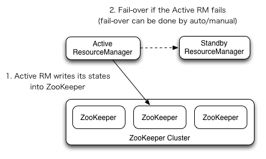

# ResourceManager High Availability

 ## 1. 概述

本指南概述了YARN ResourceManager的高可用性，并详细介绍了如何配置和使用此功能。 ResourceManager(RM)负责跟踪集群中的资源，并调度应用程序(例如MapReduce作业)。 在Hadoop 2.4之前，ResourceManager是YARN群集中的单点故障。 高可用性功能以活动/备用ResourceManager对的形式添加了冗余，以消除此单点故障。

## 2. 体系架构



### 2.1 RM故障转移

ResourceManager的高可用性是通过主/备架构实现的，在任何时间点，其中一个RM处于活动状态，并且一个或多个RM处于备用模式在活动RM故障时接管RM。 启用自动故障转移后，转换为活动状态的触发来自管理员(通过CLI)或集成的故障转移控制器。

#### 手动转换和故障转移

当故障自动转移机制没有开启，管理员需要手动切换活动RM。要从一个RM到另一个RM进行故障转移，首先需要将Active-RM转换为StandBy，再将standby-RM转换为Active。 所有这些都可以使用“ yarn rmadmin” CLI完成。

#### 自动故障转移

RM可以选择基于Zookeeper的ActiveStandbyElector，选举Active-RM。 当Active发生故障或无响应时，另一个RM将自动选作Active，然后接管。 请注意，无需像HDFS那样运行单独的ZKFC守护程序，因为嵌入在RM中的ActiveStandbyElector充当故障检测器和领导选举人，而不是单独的ZKFC守护进程。

#### Client, ApplicationMaster and NodeManager on RM failover

当有多个RM时，客户端和节点使用的配置(yarn-site.xml)会列出所有RM。 客户端，ApplicationMaster(AM)和NodeManager(NM)尝试以循环方式连接RM，直到遇到Active-RM。如果Active-RM出现故障，他们将继续轮询，直到他们命中新Active-RM为止。 此默认重试逻辑实现为`org.apache.hadoop.yarn.client.ConfiguredRMFailoverProxyProvider`。 

可以通过实现org.apache.hadoop.yarn.client.RMFailoverProxyProvider并将yarn.client.failover-proxy-provider的值设置为类名来覆盖默认逻辑。

### 2.2 恢复以前Active-RM状态

启用RM重新启动后，根据RM重新启动功能，被转换为活动状态的RM会加载RM内部状态，并继续从上一个活动状态中断的地方继续操作。对于先前提交给RM的每个托管应用程序，都会重试。应用程序可以定期检查点以避免丢失任何工作。状态存储必须在Active/standby的RM中均可见。当前，有两种用于持久性的RMStateStore实现FileSystemRMStateStore和ZKRMStateStore。

ZKRMStateStore隐式允许在任何时间点对单个RM进行写访问，因此建议在HA群集中使用ZKRMStateStore存储。使用ZKRMStateStore时，不需要单独的防护机制来解决潜在的裂脑情况，在这种情况下，多个RM可以潜在地充当主动角色。使用ZKRMStateStore时，建议不要在Zookeeper群集上设置zookeeper.DigestAuthenticationProvider.superDigest属性，以确保Zookeeper管理员无法访问YARN应用程序/用户凭证信息。

## 3. 部署

### 3.1 配置

大多数故障转移功能都可以使用各种配置属性进行调整。 以下是必需/重要的列表。 yarn-default.xml带有完整的列表。 有关更多信息，包括默认值，请参见yarn-default.xml。 另请参阅 ResourceManager重新启动文档，以获取有关设置状态存储的说明。

| 配置项                                              | 描述                                                         |
| --------------------------------------------------- | ------------------------------------------------------------ |
| hadoop.zk.address                                   | zk-quorum的地址。同时用于状态存储和leader选举                |
| yarn.resourcemanager.ha.enabled                     | 启用RM HA                                                    |
| yarn.resourcemanager.ha.rm-ids                      | RM 的逻辑 ID, 比如 `rm1`, `rm2`                              |
| yarn.resourcemanager.hostname.rm-id                 | 为每个 rm-id 声明一个对应的主机名, 也可以声明 RM 的服务地址来替换 |
| yarn.resourcemanager.address.rm-id                  | 为每个 rm-id 声明一个对应的 RM 服务地址, 也可以声明 rm 对应主机名来替换 |
| `yarn.resourcemanager.scheduler.address.`rm-id      |                                                              |
| yarn.resourcemanager.resource-tracker.address.rm-id |                                                              |
| `yarn.resourcemanager.admin.address.`*rm-id*        |                                                              |
| `yarn.resourcemanager.webapp.address.`*rm-id*       |                                                              |
| `yarn.resourcemanager.webapp.https.address.`*rm-id* |                                                              |
| yarn.resourcemanager.ha.id                          |                                                              |
| yarn.resourcemanager.ha.automatic-failover.enabled  |                                                              |
| yarn.resourcemanager.ha.automatic-failover.embedded | 启用后, 通过内置的 leader 选举来选 Active RM。 启用 RM HA 时默认开启 |
| yarn.resourcemanager.cluster-id                     |                                                              |
| yarn.client.failover-proxy-provider                 | Client、AM、NM 连接 Active RM 故障转移的类                   |
| yarn.client.failover-max-attempts                   | `FailoverProxyProvider` 尝试故障转移的最大次数               |
| yarn.client.failover-sleep-base-ms                  | 故障转移之间计算延迟的 sleep 毫秒数                          |
| yarn.client.failover-sleep-max-ms                   | 故障转移之间的 sleep 最大毫秒数                              |
| yarn.client.failover-retries                        | 每次连接 RM 的重试次数                                       |
| yarn.client.failover-retries-on-socket-timeouts     | 每次连接 RM 的 socket 超时重试次数                           |

#### 3.2 简单配置示例

以下是手动启用RM故障转移器的示例：

```xml
<property>
  <name>yarn.resourcemanager.ha.enabled</name>
  <value>true</value>
</property>
<property>
  <name>yarn.resourcemanager.cluster-id</name>
  <value>cluster1</value>
</property>
<property>
  <name>yarn.resourcemanager.ha.rm-ids</name>
  <value>rm1,rm2</value>
</property>
<property>
  <name>yarn.resourcemanager.hostname.rm1</name>
  <value>master1</value>
</property>
<property>
  <name>yarn.resourcemanager.hostname.rm2</name>
  <value>master2</value>
</property>
<property>
  <name>yarn.resourcemanager.webapp.address.rm1</name>
  <value>master1:8088</value>
</property>
<property>
  <name>yarn.resourcemanager.webapp.address.rm2</name>
  <value>master2:8088</value>
</property>
<property>
  <name>hadoop.zk.address</name>
  <value>zk1:2181,zk2:2181,zk3:2181</value>
</property>
```

### 4. 管理员命令

yarn rmadmin具有一些特定于HA的命令选项，用于检查RM的运行状况，并转换Active/Standby状态。 HA的命令将使用yarn.resourcemanager.ha.rm-ids设置的RM服务ID作为参数：

```
yarn rmadmin -getServiceState rm1
active
 
yarn rmadmin -getServiceState rm2
standby
```

如果开启了自动故障转移，就不能使用手动转移命令， 尽管可以通过–forcemanual标志覆盖此设置，但仍需要注意：

```sh
$ yarn rmadmin -transitionToStandby rm1

Automatic failover is enabled for org.apache.hadoop.yarn.client.RMHAServiceTarget@1d8299fd
Refusing to manually manage HA state, since it may cause
a split-brain scenario or other incorrect state.
If you are very sure you know what you are doing, please
specify the forcemanual flag.
```

## 5. RM web界面服务

假设备用RM已启动并正在运行，则备用RM会自动将所有Web请求重定向到活动RM。

## 6. web服务

假设备用RM已启动并正在运行，则在备用RM上调用ResourceManager REST API中RM Web服务时，会将它们自动重定向到活动RM。

## 7. 负载均衡器设置

如果正在负载均衡器(例如Azure或AWS)后面运行一组ResourceManager，并且希望负载均衡器指向活动RM，则可以将/isActive HTTP端点用作运行状况探测器。 如果RM处于活动HA状态，则`http:// RM_HOSTNAME/isActive`将返回200状态代码响应，否则返回405。