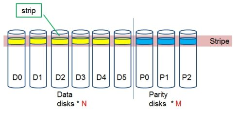

# Erasure coding纠删码

## 1. 简介

Erasure coding纠删码技术简称EC，是一种数据保护技术，最早用于通信行业中数据传输中的数据恢复，是一种编码容错技术。通过在原始数据中加入新的校验数据，使得各个部分的数据产生依赖关联性。在一定范围的数据出错情况下，通过纠删码技术都可以进行恢复。下面结合图片进行简单的演示，首先有原始数据n个，然后加入m个校验数据块。如下图所示:

Parity部分就是校验数据块，我们把一行数据块组成为Stripe条带，每行条带由n个数据块和m个校验块组成，原始数据块和校验数据块都可以通过现有的数据块进行恢复，原则如下：

- 如果校验数据块发生错误，对原始数据块进行编码重新生成；
- 如果原始数据块发生错误，通过校验数据块的解码可以重新生成；

而且m和n的值并不是固定不变的，可以进行相应的调整。其原理是什么呢？可以把上图看做一个矩阵，由于矩阵的运算具有可逆性，所以就能使数据进行恢复。矩阵图如下所示：
$$
\left[
 \begin{matrix}
   m_{00} & m_{01} & m_{02} & m_{03}\\
   m_{10} & m_{11} & m_{12} & m_{13} \\
    m_{20} & m_{21} & m_{22} & m_{23}\\
    m_{30} & m_{31} & m_{32} & m_{33}
  \end{matrix} 
\right] \cdot \left[
 \begin{matrix}
   D_{0} \\
   D_{1} \\
    D_{2}\\
    D_{3}
  \end{matrix} 
\right] = \left[
 \begin{matrix}
   C_{0} \\
   C_{1} \\
    C_{2}\\
    C_{3} \\
    C_{4}\\
    C_{5}
  \end{matrix} 
\right]
$$

## 2. Erasure Coding技术的优劣势

### 2.1 优势

纠删码技术作为一门数据保护技术,自然有许多的优势,首先可以解决的就是目前分布式系统,云计算中采用副本来防止数据的丢失.副本机制确实可以解决数据丢失的问题,但是翻倍的数据存储空间也必然要被消耗.这一点却是非常致命的.EC技术的运用就可以直接解决这个问题.

### 2.2 劣势

EC技术的优势确实明显,但是他的使用也是需要一些代价的,一旦数据需要恢复,他会造成2大资源的消耗:

- 网络带宽的消耗,因为数据恢复需要去读其他的数据块和校验块
- 进行编码,解码计算需要消耗CPU资源

 概况来讲一句话,就是既耗网络又耗CPU,看来代价也不小.所以这么来看,将此计数用于线上服务可能会觉得不够稳定,所以最好的选择是用于冷数据集群,有下面2点原因可以支持这种选择

- 冷数据集群往往有大量的长期没有被访问的数据,体量确实很大,采用EC技术,可以大大减少副本数
- 冷数据集群基本稳定,耗资源量少,所以一旦进行数据恢复,将不会对集群造成大的影响

## 3. Erasure Coding技术在Hadoop中的实现

Hadoop作为一个成熟的分布式系统，用的也是3副本策略，EC技术对于Hadoop来说意义非凡。

### 3.1 EC概念在Hadoop中的演变

EC概念指的是data block数据块,parity block校验块,stripe条带等这些概念在HDFS中是如何进行转化的,因为要想实现EC技术,至少在概念上相同的.

 