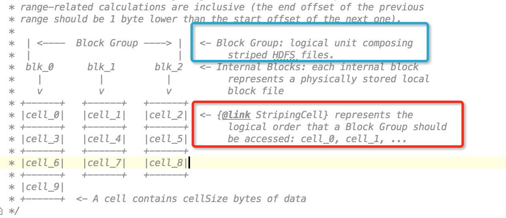

# Erasure coding纠删码

## 1. 简介

Erasure coding纠删码技术简称EC，是一种数据保护技术，最早用于通信行业中数据传输中的数据恢复，是一种编码容错技术。通过在原始数据中加入新的校验数据，使得各个部分的数据产生依赖关联性。在一定范围的数据出错情况下，通过纠删码技术都可以进行恢复。下面结合图片进行简单的演示，首先有原始数据n个，然后加入m个校验数据块。如下图所示:


Parity部分就是校验数据块，我们把一行数据块组成为Stripe条带，每行条带由n个数据块和m个校验块组成，原始数据块和校验数据块都可以通过现有的数据块进行恢复，原则如下：

- 如果校验数据块发生错误，对原始数据块进行编码重新生成；
- 如果原始数据块发生错误，通过校验数据块的解码可以重新生成；

而且m和n的值并不是固定不变的，可以进行相应的调整。其原理是什么呢？可以把上图看做一个矩阵，由于矩阵的运算具有可逆性，所以就能使数据进行恢复。矩阵图如下所示：
$$
\left[
 \begin{matrix}
   m_{00} & m_{01} & m_{02} & m_{03}\\
   m_{10} & m_{11} & m_{12} & m_{13} \\
    m_{20} & m_{21} & m_{22} & m_{23}\\
    m_{30} & m_{31} & m_{32} & m_{33}
  \end{matrix} 
\right] \cdot \left[
 \begin{matrix}
   D_{0} \\
   D_{1} \\
    D_{2}\\
    D_{3}
  \end{matrix} 
\right] = \left[
 \begin{matrix}
   C_{0} \\
   C_{1} \\
    C_{2}\\
    C_{3} \\
    C_{4}\\
    C_{5}
  \end{matrix} 
\right]
$$

## 2. Erasure Coding技术的优劣势

### 2.1 优势

纠删码技术作为一门数据保护技术,自然有许多的优势,首先可以解决的就是目前分布式系统,云计算中采用副本来防止数据的丢失.副本机制确实可以解决数据丢失的问题,但是翻倍的数据存储空间也必然要被消耗.这一点却是非常致命的.EC技术的运用就可以直接解决这个问题.

### 2.2 劣势

EC技术的优势确实明显,但是他的使用也是需要一些代价的,一旦数据需要恢复,他会造成2大资源的消耗:

- 网络带宽的消耗,因为数据恢复需要去读其他的数据块和校验块
- 进行编码,解码计算需要消耗CPU资源

 概况来讲一句话,就是既耗网络又耗CPU,看来代价也不小.所以这么来看,将此计数用于线上服务可能会觉得不够稳定,所以最好的选择是用于冷数据集群,有下面2点原因可以支持这种选择

- 冷数据集群往往有大量的长期没有被访问的数据,体量确实很大,采用EC技术,可以大大减少副本数
- 冷数据集群基本稳定,耗资源量少,所以一旦进行数据恢复,将不会对集群造成大的影响

## 3. Erasure Coding技术在Hadoop中的实现

Hadoop作为一个成熟的分布式系统，用的也是3副本策略，EC技术对于Hadoop来说意义非凡。

### 3.1 EC概念在Hadoop中的演变

EC概念指的是data block数据块,parity block校验块,stripe条带等这些概念在HDFS中是如何进行转化的,因为要想实现EC技术,至少在概念上相同的。

- data block，parity block在HDFS中的展现就是普通的block数据块
- stripe条带的概念需要将每个block进行分裂，每个block由若干个相同大小的cell组成，然后每个stripe由于一行cell构成，相当于所有的data block和parity block抽取出了一行

以下是直观展示：


 上面的横竖结构可以看出来很像之前提到的矩阵，为什么要有stripe条带概念就是因为矩阵运算就会读到每行的数据。接下来放大上面这个图：



要对应上面的3种概念,需要设计几种逻辑上的单元概念,有下面2个逻辑概念

- Block Group的组：图中蓝色矩阵中的部分，逻辑上代表者一个hdfs文件
- cell概念；就是从逻辑上将每个block块进行cell大小的拆分，因为不同block大小不同,所以不同block块的cell数量可能也会不同

中间的internal blocks才是最终存储数据的block块，也就是平常说的HDFS中的block块。

stripe的大小在HDFS中的计算逻辑如下:

```java
// Size of each stripe (only counting data blocks)
final int stripeSize = cellSize * numDataBlocks;
```

就是一行的大小。获取block长度的实现逻辑如下

```java
// Size of each stripe (only counting data blocks)
final int stripeSize = cellSize * numDataBlocks;
// If block group ends at stripe boundary, each internal block has an equal
// share of the group
final int lastStripeDataLen = (int)(dataSize % stripeSize);
if (lastStripeDataLen == 0) {
	return dataSize / numDataBlocks;
}

final int numStripes = (int) ((dataSize - 1) / stripeSize + 1);
return (numStripes - 1L)*cellSize + lastCellSize(lastStripeDataLen, cellSize, numDataBlocks, i);
```

### 3.2 HDFS Erasure Coding实现

了解了上述提到的概念,就可以开始真正了解ec在hdfs的实现,实现步骤主要在ErasureCodingWorker#ReconstructAndTransferBlock类中.从注释中可以看出,主要分为3大步.

- step1: read bufferSize data from minimum number of sources required by reconstruction.
- step2: decode data for targets.
- step3: transfer data to targets.

#### Step 1

看官方注释中对第一步骤的描述：

```
   In step1, try to read bufferSize data from minimum number of sources , if there is corrupt or stale sources, read from new source will be scheduled. The best sources are remembered for next round and may be updated in each round.
```

概况的说，首先会从sources node源节点中选出符合最好的n个节点，如果节点中有坏的或是慢节点，则会重新进行选择一次，代码如下

```java
 // step1: read from minimum source DNs required for reconstruction.
    // The returned success list is the source DNs we do real read from
    Map<ExtendedBlock, Set<DatanodeInfo>> corruptionMap = new HashMap<>();
    try {
        success = readMinimumStripedData4Reconstruction(success,
        toReconstruct, corruptionMap);
    } finally {
        // report corrupted blocks to NN
        reportCorruptedBlocks(corruptionMap);
    }
```

然后会对每个source node新建相应的striperReader进行远程读，远程读会用到striperReader的blockReader和buffer缓冲。

```java
private StripedReader addStripedReader(int i, long offsetInBlock) {
  final ExtendedBlock block = getBlock(blockGroup, liveIndices[i]);
  StripedReader reader = new StripedReader(liveIndices[i], block, sources[i]);
  stripedReaders.add(reader);

  BlockReader blockReader = newBlockReader(block, offsetInBlock, sources[i]);
  if (blockReader != null) {
    initChecksumAndBufferSizeIfNeeded(blockReader);
    reader.blockReader = blockReader;
  }
  reader.buffer = allocateBuffer(bufferSize);
  return reader;
}

```


第一步执行顺序如下：


#### Step2

官方源码注释：

```
  In step2, typically if source blocks we read are all data blocks, we need to call encode, and if there is one parity block, we need to call decode. Notice we only read once and reconstruct all missed striped block if they are more than one.
```

第二个步骤主要在于编解码数据的过程，第一个步骤已经把数据读到缓冲区了，第二步就是计算的过程了。这里提到了很关键的一点：

```
if source blocks we read are all data blocks, we need to call encode, and if there is one parity block, we need to call decode.
```

```java
   // step2: decode to reconstruct targets
   reconstructTargets(success, targetsStatus, toReconstruct);
```

#### Step 3

transfering data的操作，将buffer中的缓冲数据写入到目标节点：

```
  In step3, send the reconstructed data to targets by constructing packet and send them directly. Same as continuous block replication, we don't check the packet ack. Since the datanode doing the reconstruction work are one of the source datanodes, so the reconstructed data are sent remotely.
```

写的方式很简单，直接远程写即可，因为此类写操作只涉及到1个节点，无须构建后续pipeline的动作。


## 4. 改进与优化点

在官方注释中已经提到了2个改进点，在后续应该会被完善：

- 目前的数据没有采用本地读的方式，一律用远程方式进行数据读取
- 目标数据恢复传输没有返回packet数据包的ack确认码，不像pipeline那样有很健全的一套体系.