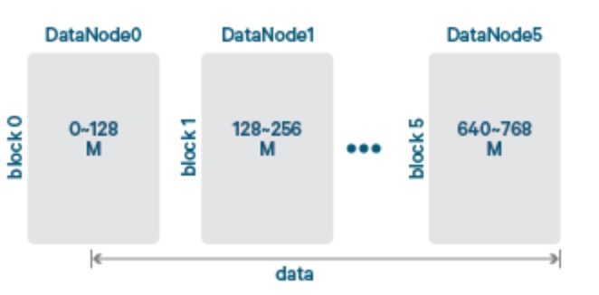
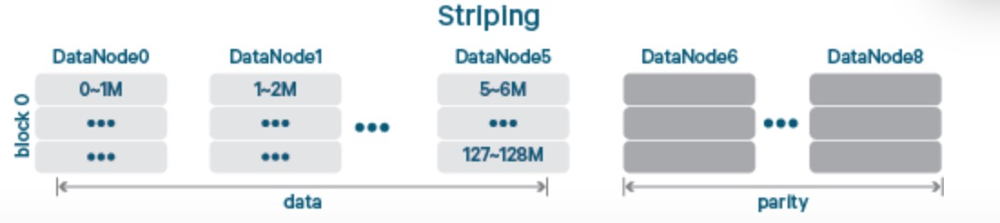
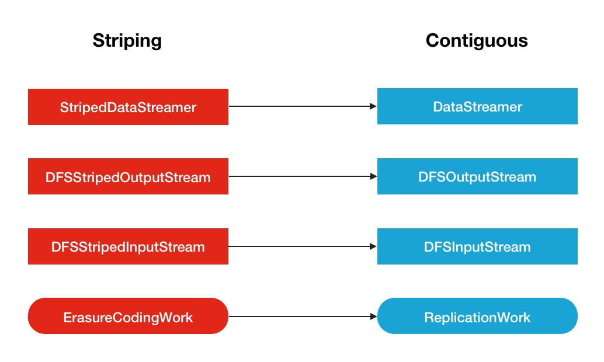
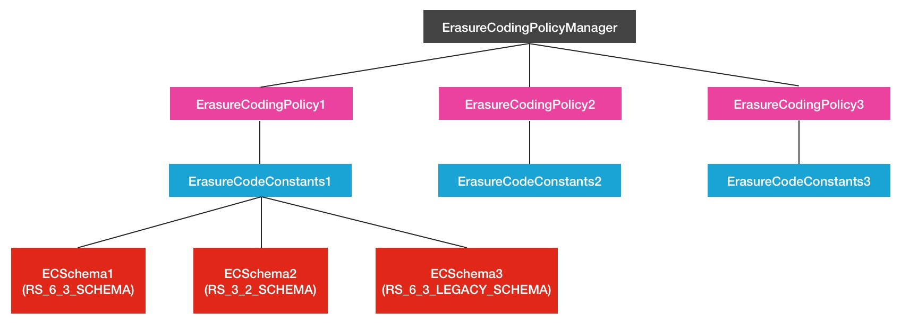
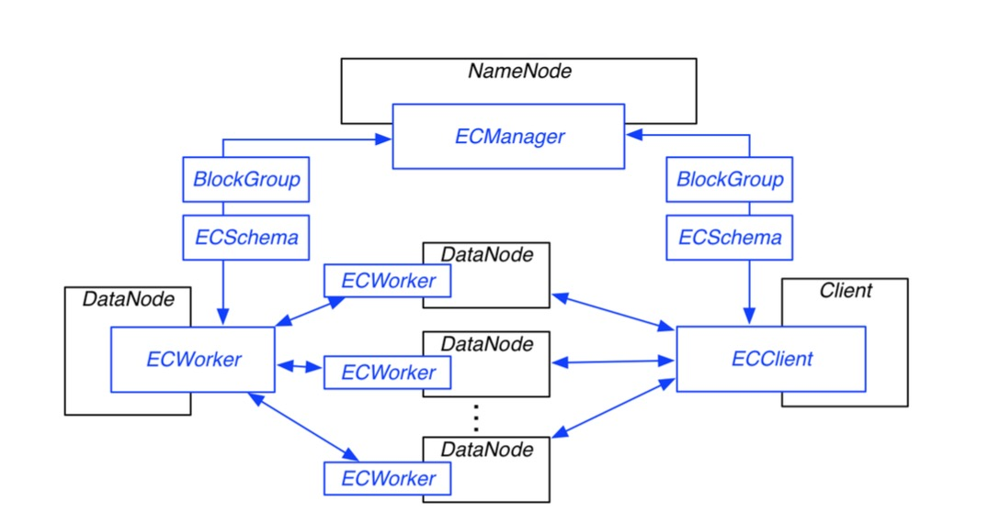

# HDFS的连续存储与EC的条带式存储

## 1. Erasure Coding技术

EC是Erasure Coding的缩写，中文名叫做纠删码，是一种能够进行数据错误纠正的技术。EC比较常见的一个使用场景是用于信号通信传输方面。在数据通信过程中，数据信号发生错误是时有发生的事情。EC编码技术是如何做到数据自动纠正的呢？这里就不得不引出EC中使用非常广泛的一个算法：XOR码。

### 1.1 XOR码

XOR是”异或”的意思，XOR码的原理如下:

数据编码时按照位进行异或运算，数据恢复的时候也就是解码时则通过结果与其他数据位进行异或操作的逆运算。

```
1 ⊕ 1 = 0;
0 ⊕ 0 = 0;
1 ⊕ 0 = 1;
0 ⊕ 1 = 1;
0 ⊕ 1 ⊕ 1 = 0;
```

现在假设最后一个式子中的第二位，就是数字第一个数字1丢失了，变成了下面这个式子:

```
0 ⊕ ? ⊕ 1 = 0;
```

可以通过异或操作的逆运算恢复数据，因为最后结果为0，所以$0\oplus ?$的结果应该为1,也就是$0\oplus? = 1$,因为异或运算，不同才为1，所以这里丢失的数据就是1，数据成功恢复。但是这里暴露出了一个问题，如果丢失或损坏的数据位超过1位的时候，数据好像就不是那么好恢复了，比如丢失了头2位:

```
? ⊕ ? ⊕ 1 = 0;
```

### 1.2 Reed-Solomon Codes

Reed-Solomon Codes也是EC编码中的一种，Reed-Solomon Codes缩写为RS码，中文名称里德所罗门码。下面说说RS码在HDFS中的使用原理：RS码在使用的时候需要指定2个参数的，$RS(k, m)$k代表的是data cell数据块的数量，m代表的是parity cell块的数量，parity cell可理解为加密块，因为它是由数据块编码产生的。RS码的恢复原理如下:

- 数据块如果发生损坏，则可以通过parity cell和其他data cell的解码计算重新恢复
- 如果加密块发生损坏，则可以通过data cell重新进行编码生成

以上数据块与加密块的编解码原理与矩阵运算有点关联，数据块最大容错数量为m。数字可以进行调整，比如RS(6, 3)或RS(10, 4)等。这里的数据块与加密块的存储方式与传统的数据存放方式略有不同，**它是横向式的条带式存储,而不是传统的连续存储方式**。

## 2. HDFS的连续存储与EC的条带式存储

### 2.1 连续存储: Contiguous

连续存储方式就是我们平常所熟知的HDFS的文件存储方式，以Block块为单位，如果文件写数据大小超出了1个块，则新创建一个块继续写，直到写完整个数据。整个存储的逻辑结构如下图所示:



上图是标准的128M一个块大小的连续存储图。

### 2.2 条带式存储: Striping

Stripe在这里是条带式的意思。虽然说还是以Block作为一个存储的单，但是数据是横向式的保存在各个Block上。换句话说，同一个Block上的不同分段的数据是完全不连续的。条带式的存储结构图如下:


在每个Block块中的一个横块，就是上文讲述RS码时的data cell的概念。下面是基于HDFS下的data cell结合parity cell加密块的条带式存储的展示效果图：



**上图对应的EC编码类型是RS(6, 3)。前面从DataNode0-5总共6个节点存数据块，后面的DataNode6~8存的则是加密块**。

## 3. HDFS EC的架构设计

**EC纠删码技术作为一项数据保护技术，本身存在一定的学习成本，要把它引入到HDFS中，也绝对不是一件简单的事情**。要做非常多的适配改造工作。

### 3.1 数据读写相关类的适配

Striping条带式存储方式的引入会带来数据读写逻辑的转变，所以这里需要引入针对HDFS EC特有的条带式的输入输出数据流的读写类。主要是下图所示的几个类：



通过类名称可以直接看出它是适用于哪一类存储方式的数据读写。这里额外提一下ErasureCodingWork的服务，ErasureCodingWork与ReplicationWork类似，ReplicationWork的作用是将新的待复制的副本块任务分配到对应的DataNode节点上。ErasureCodingWork则对应的是分配EC编码任务到相应的DataNode节点上。

### 3.2 HDFS EC的架构设计

HDFS EC的架构设计同样遵从主从结构，一个中心的管理对象(**ECManager**)，然后有对应的worker对象(**ECWorker**)。这2大角色类有明确的分工：

- ECManager：EC管理对象会做许多事情。比如：协调数据恢复，健康检测，blockGroup的管理等等。
- ECWorker：EC数据恢复相关的操作

HDFS是通过EC Policy控制EC编解码算法，每个EC策略对应一种ECSchema参数配置的EC算法。这些EC Policy策略对象被ErasureCodingPolicyManager对象管理，目前ErasureCodingPolicyManager对象中维护了以下3种EC策略：

```java
private static final ErasureCodingPolicy SYS_POLICY1 =
      new ErasureCodingPolicy(ErasureCodeConstants.RS_6_3_SCHEMA,
          DEFAULT_CELLSIZE, HdfsConstants.RS_6_3_POLICY_ID);

private static final ErasureCodingPolicy SYS_POLICY2 =
      new ErasureCodingPolicy(ErasureCodeConstants.RS_3_2_SCHEMA,
          DEFAULT_CELLSIZE, HdfsConstants.RS_3_2_POLICY_ID);

private static final ErasureCodingPolicy SYS_POLICY3 =
      new ErasureCodingPolicy(ErasureCodeConstants.RS_6_3_LEGACY_SCHEMA,
          DEFAULT_CELLSIZE, HdfsConstants.RS_6_3_LEGACY_POLICY_ID);

```

以上几个对象的上下层级关系图如下：



HDFS EC设计文档中的总架构设计图：



EC的使用也是非常的方便，**能够通过外部命令的方式直接对指定路径下的数据做EC/Replication之间的灵活装换。还能设置不同path下的不同EC Policy**。