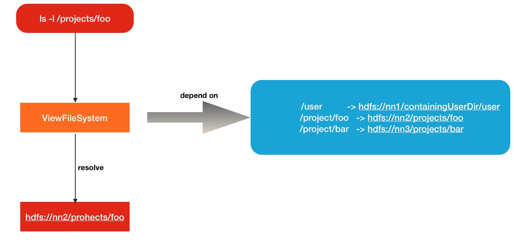
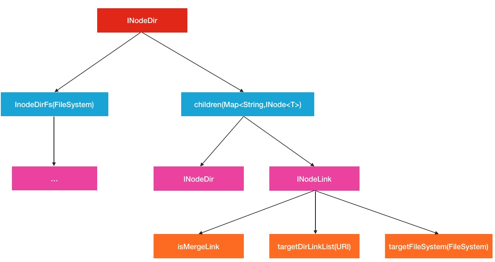
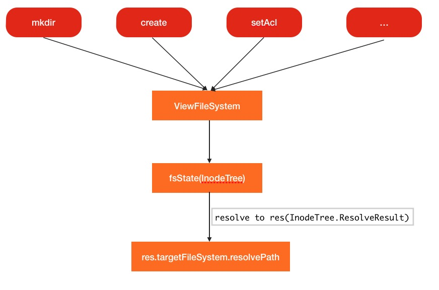

# HDFS跨集群数据合并方案之ViewFileSystem

在很多时候，会碰到数据融合的需求,比如说原先有A集群，B集群,后来管理员认为有2套集群，数据访问不方便，于是设法将A,B集群融合为一个更大的集群，将他们的数据都放在同一套集群上。一种办法就是用Hadoop自带的distcp工具，将数据进行跨集群的拷贝。当然这会带来很多的问题，如果数据量非常庞大的话。本文给大家介绍另外一种解决方案，叫做视图文件系统(ViewFileSystem)。就是让不同集群间维持视图逻辑上的唯一性,不同集群间具有独立性。

## 1. 传统数据合并方案

为了形成对比,下面描述一下数据合并中常用的数据合并的做法,就是搬迁数据.举例在HDFS中,也会想到用distcp工具进行远程拷贝.虽然discp本身就是用来干这种事情的,但是随着数据量规模的升级,会有以下问题的出现:

1. **拷贝周期太长,如果数据量非常大,在机房总带宽有限的情况,拷贝的时间将会非常长**
2. **数据在拷贝的过程中,一定会有原始数据的变更与改动,如何同步这方面的数据也是需要考虑的方面**

ViewFileSystem: 视图文件系统是Hadoop解决跨集群数据合并问题的解决方案

## 2. ViewFileSystem: 视图文件系统

ViewFileSystem不是一个新的文件系统，只是逻辑上的一个视图文件系统，在逻辑上是唯一的。Hadoop ViesFs将各个集群的真实文件路径与ViewFileSystem的新定义的路径进行关联映射，类似于文件系统中的**mount**(挂载)的意思。**进一步地说,ViewFileSystem会在每个客户端中维护一份mount-table挂载关系表,就是上面说的集群物理路径->视图文件系统路径这样的指向关系.但是在mount-table中,关系当然不止1个,会有很多个**。比如下面所示的多对关系：

```
/user          -> hdfs://nn1/containingUserDir/user
/project/foo   -> hdfs://nn2/projects/foo
/project/bar   -> hdfs://nn3/projects/bar
```

前面是ViewFileSystem中的路径,后者才是代表的真正集群路径.所以你可以理解为**ViewFileSystem核心就是路径的路由解析**。原理图如下：



## 3. ViewFileSystem内部实现原理

ViewFileSystem的作用基本是一个路由解析的角色,真实的请求处理还是在各自真实的集群上.这小节探讨的内容是ViewFileSystem内部是如何实现**路由解析**。

### 3.1 目录挂载点

因为要做的是路由解析,所以挂载点的设计就显得非常重要了.下面看一下ViewFileSystem中是如何定义此类的.

```java
static public class MountPoint {
    // 源路径
    private Path src;       // the src of the mount
    // 目录指向路径,也就是真实路径,可以为多个
    private URI[] targets; //  target of the mount; Multiple targets imply mergeMount
    MountPoint(Path srcPath, URI[] targetURIs) {
      src = srcPath;
      targets = targetURIs;
    }
    Path getSrc() {
      return src;
    }
    URI[] getTargets() {
      return targets;
    }
}
```

一般情况下,挂载节点是一对一的,但是如果存在不同集群间有相同名称目录的情况,也是可以进行一对多的,在Hadoop中叫做**MergeCount**,

### 3.2 挂载点的解析与存放

在ViewFileSystem初始化操作中,挂载点的解析与存放其中一个非常重要的过程.其中的过程执行又是在下面这个变量中进行的:

```java
InodeTree<FileSystem> fsState;  // the fs state; ie the mount table
```

进入ViewFileSystem的initialize实现:

```java
public void initialize(final URI theUri, final Configuration conf)
      throws IOException {
    super.initialize(theUri, conf);
    setConf(conf);
    config = conf;
    // Now build  client side view (i.e. client side mount table) from config.
    final String authority = theUri.getAuthority();
    try {
      myUri = new URI(FsConstants.VIEWFS_SCHEME, authority, "/", null, null);
      // 传入conf信息进行fsState初始化
      fsState = new InodeTree<FileSystem>(conf, authority) {
        ...
```

然后进入InodeTree的构造方法中

```java
protected InodeTree(final Configuration config, final String viewName)
      throws UnsupportedFileSystemException, URISyntaxException,
    ...

    final String mtPrefix = Constants.CONFIG_VIEWFS_PREFIX + "." + 
                            vName + ".";
    final String linkPrefix = Constants.CONFIG_VIEWFS_LINK + ".";
    final String linkMergePrefix = Constants.CONFIG_VIEWFS_LINK_MERGE + ".";
    boolean gotMountTableEntry = false;
    final UserGroupInformation ugi = UserGroupInformation.getCurrentUser();
    for (Entry<String, String> si : config) {
      final String key = si.getKey();
      // 判断源key名是否是前缀fs.viewfs.mounttable开头的
      if (key.startsWith(mtPrefix)) {
        ...
        // 获取目标映射的真实路径,可能为多个,以','隔开
        final String target = si.getValue(); // link or merge link
        createLink(src, target, isMergeLink, ugi); 
      }
    }
    ...
```

真正实现挂载点关系的存储其实是在createLink方法中,进入此方法

```java
private void createLink(final String src, final String target,
      final boolean isLinkMerge, final UserGroupInformation aUgi)
      throws URISyntaxException, IOException,
    FileAlreadyExistsException, UnsupportedFileSystemException {
    // Validate that src is valid absolute path
    final Path srcPath = new Path(src); 
    if (!srcPath.isAbsoluteAndSchemeAuthorityNull()) {
      throw new IOException("ViewFs:Non absolute mount name in config:" + src);
    }

    // 将待添加的路径按照'/'分隔符进行拆分
    final String[] srcPaths = breakIntoPathComponents(src);
    // 设置当前节点为根节点
    INodeDir<T> curInode = root;
    ...
```

注意上面执行的最后一行代码处,出现了INodeDir的类,**而且设置了当前curInode为根节点.这实际上是非常有用意的**.继续查看INodeDir类的定义.

```java
/**
   * Internal class to represent an internal dir of the mount table
   * @param <T>
   */
  static class INodeDir<T> extends INode<T> {
    // 孩子节点
    final Map<String,INode<T>> children = new HashMap<String,INode<T>>();
    // 与此挂载目录相关的文件系统
    T InodeDirFs =  null; // file system of this internal directory of mountT
    boolean isRoot = false;
    ...
```

从上面,可以看出这里是**一个父亲-孩子的关系,并且每个目录会有对应自身的目标文件系统,而且孩子中可能还是InodeDir或是INode的子类.再联系到之前路径按照符号’/’进行划分,我们大致可以推测出,ViewFileSystem是按照书写结构的存放方式进行挂载点的存储的**。

后面的代码基本上也验证了此时的猜想,下面是**最相近的目录树的寻找**:

```java
...
    int i;
    // Ignore first initial slash, process all except last component
    // 忽略第一个空字符串,遍历其后的每一个子段
    for (i = 1; i < srcPaths.length-1; i++) {
      // 获取当前的子段字符串
      final String iPath = srcPaths[i];
      // 从当前的目录Inode中进行查找,
      INode<T> nextInode = curInode.resolveInternal(iPath);
      // 如果没有查找到,意味着当前的节点中没有此路径下对应的信息
      if (nextInode == null) {
        // 新增此路径对应的targetFileSystem的信息
        INodeDir<T> newDir = curInode.addDir(iPath, aUgi);
        newDir.InodeDirFs = getTargetFileSystem(newDir);
        // 并以此作为下个节点的,即为找到的目标节点
        nextInode = newDir;
      }
      // 如果此节点已经是INodeLink信息,则抛异常
      if (nextInode instanceof INodeLink) {
        // Error - expected a dir but got a link
        throw new FileAlreadyExistsException("Path " + nextInode.fullPath +
            " already exists as link");
      } else {
        // 如果还是Inode目录,则将子目录作为当前目录,往下寻找
        assert(nextInode instanceof INodeDir);
        curInode = (INodeDir<T>) nextInode;
      }
    }
    ...
```

**找到最近一层的目录树后,在此下加入新的URI的Link关联信息**

```java
...
    // 到此基本找到了最底层的目录,然后在此目录下添加INodeLink链接
    final INodeLink<T> newLink;
    final String fullPath = curInode.fullPath + (curInode == root ? "" : "/")
        + iPath;
    // 将目录URL链接等信息全部传入INodeLink中,
    if (isLinkMerge) { // Target is list of URIs
      String[] targetsList = StringUtils.getStrings(target);
      URI[] targetsListURI = new URI[targetsList.length];
      int k = 0;
      for (String itarget : targetsList) {
        targetsListURI[k++] = new URI(itarget);
      }
      newLink = new INodeLink<T>(fullPath, aUgi,
          getTargetFileSystem(targetsListURI), targetsListURI);
    } else {
      newLink = new INodeLink<T>(fullPath, aUgi,
          getTargetFileSystem(new URI(target)), new URI(target));
    }
    //将构造完毕的INodeLink作为子节点加入到当前节点中
    curInode.addLink(iPath, newLink);
    // 同时加入到挂载节点列表中
    mountPoints.add(new MountPoint<T>(src, newLink));
```

所以可以看到,最终的指向文件系统和具体信息都在INodeLink中.然后所有的挂载目录点的位置都被以key字符串被树形的拆开存放.换句话说,在viewFileSystem中输入一个viewFileSystem中配置的查询路径,会被逐层解析到对应的InodeDir,最终取出对应的InodeLink存储模型图如下:




## 4. ViewFileSystem的请求处理

viewFileSystem是如何处理客户端发来的各种HDFS的请求的呢?以mkdir为例：

```java
@Override
public boolean mkdirs(final Path dir, final FsPermission permission)
      throws IOException {
    // 通过fsState对象进行解析
    InodeTree.ResolveResult<FileSystem> res = 
      fsState.resolve(getUriPath(dir), false);
    // 获取目标真实文件系统进行对应的请求处理
   return  res.targetFileSystem.mkdirs(res.remainingPath, permission);
}
```

**这里的fsState.resolve就会到之前提到的INodeDir中进行逐层寻找.找到的对应的文件系统后,就会把后面最终起作用的路径作为参数传入真实的文件系统中**。

此过程的调用流程图如下:



## 5. ViewFileSystem的路径包装

ViewFileSystem作为一个视图文件系统,要保持在逻辑上的完全一致,所有对于文件的返回属性信息,要做一层包装和适配。比如下面这个例子:

事先设定了挂载信息：

```
 /project/viewFsTmp   -> hdfs://nn1/projects/Tmp
```

前者是ViewFileSystem路径，后者是真实文件系统存放路径.在真实文件系统中假设存在3个子文件:

```
/projects/Tmp/child1
/projects/Tmp/child2
/projects/Tmp/child3
```

在viewFileSystem的情况下，用hadoop fs -ls /project/viewFsTmp的命令下去看,出现的信息应该是这样的

```
/projects/viewFsTmp/child1
/projects/viewFsTmp/child2
/projects/viewFsTmp/child3
```

因为挂掉点信息文件路径已经被变更了，一切都会安装viewFileSystem中所配置的路径来。所以这需要对真实返回的FileStatus做一层包装，对应一些大小、修改时间等基本属性信息，直接返回原来的就行，当时对于一些Path的返回,就要做一层修改了。
于是就衍生出了ViewFsFileStatus这个类：

```java
class ViewFsFileStatus extends FileStatus {
   // 原FileStatus信息
   final FileStatus myFs;
   // 修改的路径信息
   Path modifiedPath;
   ViewFsFileStatus(FileStatus fs, Path newPath) {
     myFs = fs;
     modifiedPath = newPath;
   }
   ...
```

在此类中就对getPath做了改动：

```java
@Override
public Path getPath() {
	// 重载返回Path的方法,返回的是修改过的Path信息
	return modifiedPath;
}
```

对于其他的基本属性方法,直接调用原来的

```java
..
   @Override
   public short getReplication() {
     return myFs.getReplication();
   }

   @Override
   public long getModificationTime() {
     return myFs.getModificationTime();
   }

   @Override
   public long getAccessTime() {
     return myFs.getAccessTime();
   }
...
```


## 6. ViewFileSystem的使用

**第一步：创建viewfs名称**

在core-site.xml中配置fs.defaultFS属性。如下

```xml
<property>
    <name>fs.defaultFS</name>
    <value>viewfs://MultipleCluster</value>
</property>
```

**第二步：添加挂载关系**

```xml
<property>
  <name>fs.viewfs.mounttable.MultipleCluster.link./viewfstmp</name>
	<value>hdfs://nn1/tmp</value>
</property>
```


这里的nn1就是真实的集群路径.注意这里的fs.viewfs.mounttable.MultipleCluster.link中的link前面的名称必须与之前viewfs中定义的名称一致.

经过这2个步骤，就基本完成了viewFileSystem的配置，其实非常的简单.