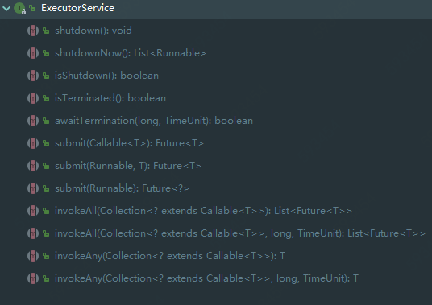
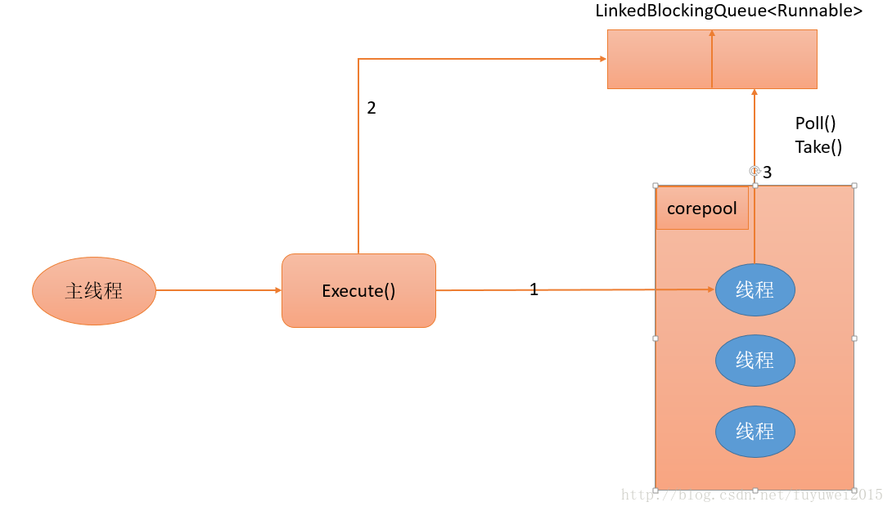
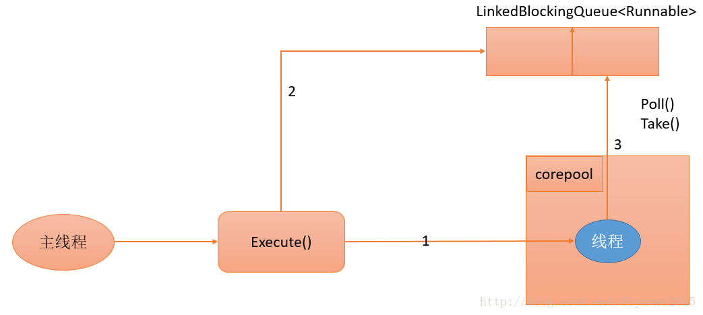
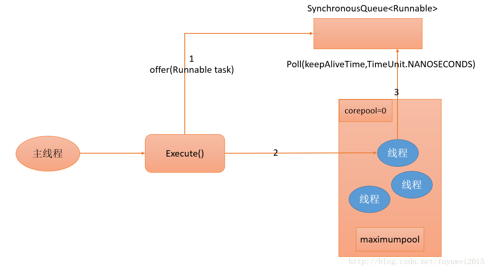
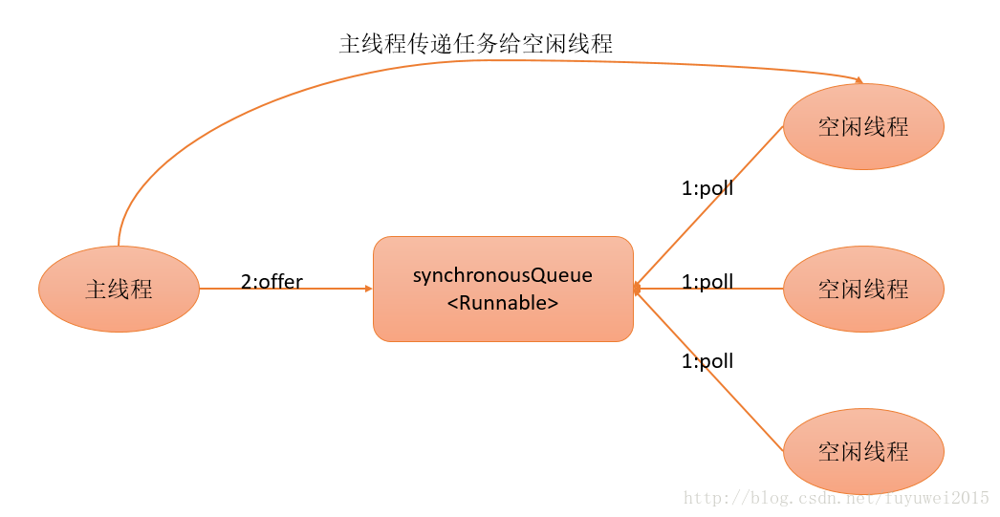
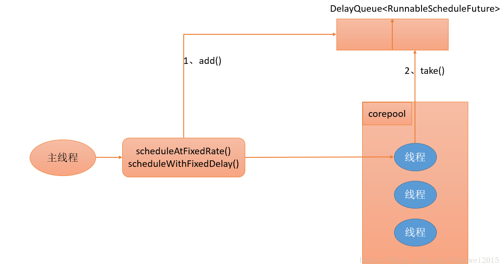
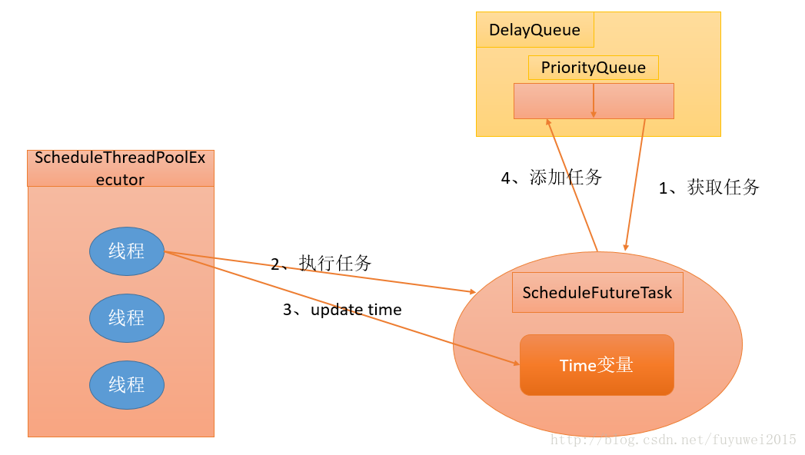
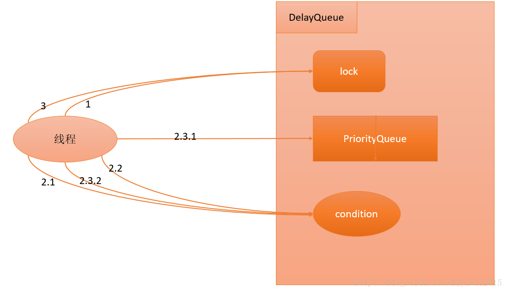
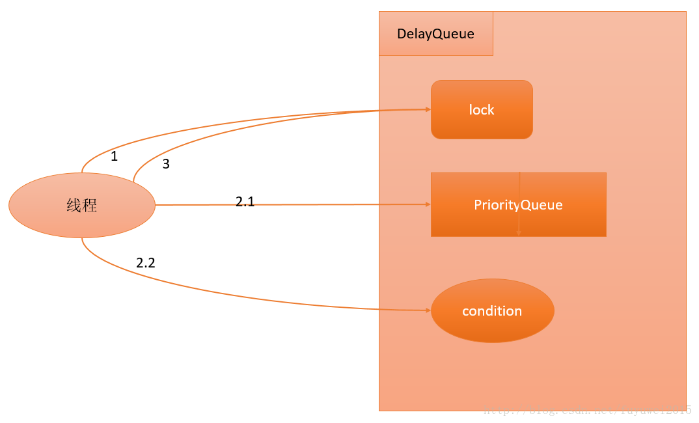

# Java线程Executor框架详解与使用

## 1. Executor 框架简介

在HotSpot VM的线程模型中，Java线程被一对一映射为本地操作系统线程。Java线程启动时会创建一个本地操作系统线程；当该Java线程终止时，这个操作系统线程也会被回收，在JVM中我们可以通过-Xss设置每个线程的大小。操作系统会调度所有线程并将它们分配给可用的CPU。

在上层，Java多线程程序通常把应用分解为若干个任务，然后使用用户级的调度器（Executor框架）将这些任务映射为固定数量的线程；在底层，操作系统内核将这些线程映射到硬件处理器上。这种两级调度模型的示意图如下图所示：


Executor 框架是 Java 5 中引入的，其内部使用了线程池机制，它在 java.util.cocurrent 包下，通过该框架来控制线程的启动、执行和关闭，可以简化并发编程的操作。在 Java 5之后，通过 Executor 来启动线程比使用 Thread 的 start 方法更好，除了更易管理，效率更好（用线程池实现，节约开销）外，还有关键的一点：有助于避免 this 逃逸问题——如果我们在构造器中启动一个线程，因为另一个任务可能会在构造器结束之前开始执行，此时可能会访问到初始化了一半的对象用 Executor 在构造器中。



## 2. Executor结构

executor结构主要包括任务、任务的执行和异步结果的计算。

- **任务**：包括被执行任务需要实现的接口Runnable接口或Callable接口
- **任务的执行**：包括任务执行机制的核心接口Executor，以及继承自Executor的ExecutorService接口。Executor框架两个关键类实现了ExecutorService接口——ThreadPoolExecutor和ScheduledThreadPoolExecutor
- **异步计算的结果**：包括接口Future和实现Future接口的FutureTask类

executor类图如下所示：


在Executor使用过程中，主线程首先要创建实现Runnable或者Callable接口的任务对象。工具类Executors可以把一个Runnable对象封装为一个Callable对象（Executors.callable（Runnable task）或Executors.callable（Runnable task，Object resule））。

如果执行ExecutorService.submit（…），ExecutorService将返回一个实现Future接口的对象(FutureTask)。由于FutureTask实现了Runnable，我们也可以创建FutureTask，然后直接交给ExecutorService执行。最后，主线程可以执行FutureTask.get()方法来等待任务执行完成。主线程也可以执行FutureTask.cancel(boolean mayInterruptIfRunning)来取消此任务的执行。

## 3. Java 线程池实现类

### 3.1 FixedThreadPool

#### 初始化

```java
public static ExecutorService newFixedThreadPool(int nThreads) {
        return new ThreadPoolExecutor(nThreads, nThreads,
                                      0L, TimeUnit.MILLISECONDS,
                                      new LinkedBlockingQueue<Runnable>());
}

public static ExecutorService newFixedThreadPool(int nThreads, ThreadFactory threadFactory) {
        return new ThreadPoolExecutor(nThreads, nThreads,
                                      0L, TimeUnit.MILLISECONDS,
                                      new LinkedBlockingQueue<Runnable>(),
                                      threadFactory);
}
```

FixedThreadPool的corePoolSize和maximumPoolSize都被设置为创建FixedThreadPool时指定的参数nThreads。当线程池中的线程数大于corePoolSize时，keepAliveTime为多余的空闲线程等待新任务的最长时间，超过这个时间后多余的线程将被终止。这里把keepAliveTime设置为0L，意味着多余的空闲线程会被立即终止

#### 运行过程

下面是FixedThreadPool运行过程示意图：



执行步骤说明：

（1）如果当前运行的线程数少于corePoolSize，则创建新线程来执行任务

（2）在线程池完成预热之后(当前运行的线程数等于corePoolSize)，将任务加入LinkedBlockingQueue

（3）线程执行完1中的任务后，会在循环中反复从LinkedBlockingQueue获取任务来执行

FixedThreadPool使用无界队列LinkedBlockingQueue作为线程池的工作队列(队列的容量为Integer.MAX_VALUE)。使用无界队列作为工作队列会对线程池带来如下影响：

- 当线程池中的线程数达到corePoolSize后，新任务将在无界队列中等待，因此线程池中的线程数不会超过corePoolSize
- 由于1，使用无界队列时maximumPoolSize将是一个无效参数
- 由于1和2，使用无界队列时keepAliveTime将是一个无效参数
- 由于使用无界队列，运行中的FixedThreadPool(未执行方法shutdown()或shutdownNow())不会拒绝任务（不会调用RejectedExecutionHandler.rejectedExecution方法）

#### 使用场景

FixedThreadPool适用于为了满足资源管理的需求，而需要限制当前线程数量的应用场景，它适用于负载比较重的服务器

### 3.2 SingleThreadExecutor

#### 初始化

创建使用单个线程的SingleThread-Executor

```java
public static ExecutorService newSingleThreadExecutor() {
        return new FinalizableDelegatedExecutorService
            (new ThreadPoolExecutor(1, 1,
                                    0L, TimeUnit.MILLISECONDS,
}
                                    
public static ExecutorService newSingleThreadExecutor(ThreadFactory threadFactory) {
        return new FinalizableDelegatedExecutorService
            (new ThreadPoolExecutor(1, 1,
                                    0L, TimeUnit.MILLISECONDS,
                                    new LinkedBlockingQueue<Runnable>(),
                                    threadFactory));
}

```

SingleThreadExecutor的corePoolSize和maximumPoolSize被设置为1。其他参数与FixedThreadPool相同。SingleThreadExecutor使用无界队列LinkedBlockingQueue作为线程池的工作队列（队列的容量为Integer.MAX_VALUE）。SingleThreadExecutor使用无界队列作为工作队列对线程池带来的影响与FixedThreadPool相同。

#### 运行过程

下图是SingleThreadExecutor的运行过程示意图：



（1）如果当前运行的线程数少于corePoolSize（即线程池中无运行的线程），则创建一个新线程来执行任务。

（2）在线程池完成预热之后（当前线程池中有一个运行的线程），将任务加入LinkedBlockingQueue

（3）线程执行完1中的任务后，会在一个无限循环中反复从LinkedBlockingQueue获取任务来执行。

#### 使用场景

SingleThreadExecutor适用于需要保证顺序地执行各个任务；并且在任意时间点，不会有多个线程是活动的应用场景。

### 3.3 CachedThreadPool

#### 初始化

```java
public static ExecutorService newCachedThreadPool() {
        return new ThreadPoolExecutor(0, Integer.MAX_VALUE,
                                      60L, TimeUnit.SECONDS,
                                      new SynchronousQueue<Runnable>());
    }
public static ExecutorService newCachedThreadPool(ThreadFactory threadFactory) {
        return new ThreadPoolExecutor(0, Integer.MAX_VALUE,
                                      60L, TimeUnit.SECONDS,
                                      new SynchronousQueue<Runnable>(),
                                      threadFactory);
    }
```

CachedThreadPool的corePoolSize被设置为0，即corePool为空；maximumPoolSize被设置为Integer.MAX_VALUE，即maximumPool是无界的。这里把keepAliveTime设置为60L，意味着CachedThreadPool中的空闲线程等待新任务的最长时间为60秒，空闲线程超过60秒后将会被终止。

FixedThreadPool和SingleThreadExecutor使用无界队列LinkedBlockingQueue作为线程池的工作队列。CachedThreadPool使用没有容量的SynchronousQueue作为线程池的工作队列，但CachedThreadPool的maximumPool是无界的。这意味着，如果主线程提交任务的速度高于maximumPool中线程处理任务的速度时，CachedThreadPool会不断创建新线程。极端情况下，CachedThreadPool会因为创建过多线程而耗尽CPU和内存资源。

#### 运行过程

下图是CachedThreadPool的运行过程示意图



（1）首先执行SynchronousQueue.offer(Runnable task)。如果当前maximumPool中有空闲线程正在执行SynchronousQueue.poll(keepAliveTime，TimeUnit.NANOSECONDS)，那么主线程执行offer操作与空闲线程执行的poll操作配对成功，主线程把任务交给空闲线程执行，execute()方法执行完成；否则执行下面的步骤2)。

（2）当初始maximumPool为空，或者maximumPool中当前没有空闲线程时，将没有线程执行SynchronousQueue.poll(keepAliveTime，TimeUnit.NANOSECONDS)。这种情况下，步骤1）将失败。此时CachedThreadPool会创建一个新线程执行任务，execute()方法执行完成。

（3）在步骤2）中新创建的线程将任务执行完后，会执行SynchronousQueue.poll（keepAliveTime，
TimeUnit.NANOSECONDS）。这个poll操作会让空闲线程最多在SynchronousQueue中等待60秒钟。如果60秒钟内主线程提交了一个新任务（主线程执行步骤1）），那么这个空闲线程将执行主线程提交的新任务；否则，这个空闲线程将终止。由于空闲60秒的空闲线程会被终止，因此长时间保持空闲的CachedThreadPool不会使用任何资源。

SynchronousQueue是一个没有容量的阻塞队列。每个插入操作必须等待另一个线程的对应移除操作，反之亦然。CachedThreadPool使用SynchronousQueue，把主线程提交的任务传递给空闲线程执行。CachedThreadPool中任务传递的示意图如下图所示：



CachedThreadPool可以创建一个可根据需要创建新线程的线程池，但是在以前构造的线程可用时将重用它们，对于执行很多短期异步任务的程序而言，这些线程池通常可提高程序性能。调用 execute 将重用以前构造的线程（如果线程可用）。如果现有线程没有可用的，则创建一个新线程并添加到池中。

CachedThreadPool是大小无界的线程池，适用于执行很多的短期异步任务的小程序，或者是负载较轻的服务器。

## 3.4 ScheduledThreadPoolExecutor

ScheduledThreadPoolExecutor继承自ThreadPoolExecutor。它主要用来在给定的延迟之后运行任务，或者定期执行任务。ScheduledThreadPoolExecutor的功能与Timer类似，但ScheduledThreadPoolExecutor功能更强大、更灵活。Timer对应的是单个后台线程，而ScheduledThreadPoolExecutor可以在构造函数中指定多个对应的后台线程数。

#### 初始化

ScheduledThreadPoolExecutor通常使用工厂类Executors来创建。Executors可以创建2种类型的
ScheduledThreadPoolExecutor，如下：

- ScheduledThreadPoolExecutor：包含若干个线程的ScheduledThreadPoolExecutor。
- SingleThreadScheduledExecutor：只包含一个线程的ScheduledThreadPoolExecutor。

```java
public ScheduledThreadPoolExecutor(int corePoolSize,
                                       ThreadFactory threadFactory,
                                       RejectedExecutionHandler handler) {
        super(corePoolSize, Integer.MAX_VALUE, 0, TimeUnit.NANOSECONDS,
              new DelayedWorkQueue(), threadFactory, handler);
    }
 public ScheduledThreadPoolExecutor(int corePoolSize) {
        super(corePoolSize, Integer.MAX_VALUE, 0, TimeUnit.NANOSECONDS,
              new DelayedWorkQueue());
    }
```

直接调用父类ThreadPoolExecutor构造方法进行初始化。ScheduledThreadPoolExecutor适用于需要多个后台线程执行周期任务，同时为了满足资源管理的需求而需要限制后台线程的数量的应用场景。

```java
public static ScheduledExecutorService newSingleThreadScheduledExecutor() {
        return new DelegatedScheduledExecutorService
            (new ScheduledThreadPoolExecutor(1));
    }
  public static ScheduledExecutorService newSingleThreadScheduledExecutor(ThreadFactory threadFactory) {
        return new DelegatedScheduledExecutorService
            (new ScheduledThreadPoolExecutor(1, threadFactory));
    }
```

#### 运行过程

DelayQueue是一个无界队列，所以ThreadPoolExecutor的maximumPoolSize在ScheduledThreadPoolExecutor中没有什么意义（设置maximumPoolSize的大小没有什么效果）。ScheduledThreadPoolExecutor的执行主要分为两大部分。

- 当调用ScheduledThreadPoolExecutor的scheduleAtFixedRate()方法或者scheduleWithFixedDelay()方法时，会向ScheduledThreadPoolExecutor的DelayQueue添加一个实现了RunnableScheduledFuture接口的ScheduledFutureTask
- 线程池中的线程从DelayQueue中获取ScheduledFutureTask，然后执行任务



ScheduledThreadPoolExecutor为了实现周期性的执行任务，对ThreadPoolExecutor做了如下
的修改：

- 使用DelayQueue作为任务队列
- 获取任务的方式不同
- 执行周期任务后，增加了额外的处理

#### 实现过程分析

ScheduledThreadPoolExecutor会把待调度的任务（ScheduledFutureTask）放到一个DelayQueue中。ScheduledFutureTask主要包含3个成员变量，如下：

- long time，表示这个任务将要被执行的具体时间
- long sequenceNumber，表示这个任务被添加到ScheduledThreadPoolExecutor中的序号
- long period，表示任务执行的间隔周期

DelayQueue封装了一个PriorityQueue，这个PriorityQueue会对队列中的ScheduledFutureTask进行排序。排序时，time小的排在前面(时间早的任务将被先执行)。如果两个ScheduledFutureTask的time相同，就比较sequenceNumber，sequenceNumber小的排在前面(也就是说，如果两个任务的执行时间相同，那么先提交的任务将被先执行)。首先，ScheduledThreadPoolExecutor中的线程执行周期任务的过程。如下图所示



1. 线程1从DelayQueue中获取已到期的ScheduledFutureTask（DelayQueue.take()）。到期任务是指ScheduledFutureTask的time大于等于当前时间
2. 线程1执行这个ScheduledFutureTask。
3. 线程1修改ScheduledFutureTask的time变量为下次将要被执行的时间
4. 线程1把这个修改time之后的ScheduledFutureTask放回DelayQueue中(DelayQueue.add())

DelayQueue.take()的源码如下：

```java
public E take() throws InterruptedException {
    final ReentrantLock lock = this.lock;
    lock.lockInterruptibly(); // 1
    try {
        for (;;) {
            E first = q.peek();
            if (first == null) {
                available.await(); // 2.1
            } else {
                long delay = first.getDelay(TimeUnit.NANOSECONDS);
                if (delay > 0) {
                    long tl = available.awaitNanos(delay); // 2.2
                } else {
                    E x = q.poll(); // 2.3.1
                    assert x != null;
                    if (q.size() != 0)
                        available.signalAll(); // 2.3.2
                    return x;
                }
            }
        }
    } finally {
        lock.unlock(); // 3
    }
}
```



1. 获取Lock

2. 获取周期任务

	2.1 如果PriorityQueue为空，当前线程到Condition中等待；否则执行下面的2.2

	2.2  如果PriorityQueue的头元素的time时间比当前时间大，到Condition中等待到time时间；否则执行下面的2.3

	2.3  获取PriorityQueue的头元素(2.3.1)；如果PriorityQueue不为空，则唤醒在Condition中等待的所有线程(2.3.2)

3. 释放Lock

DelayQueue.add()源码如下：

```java
 public boolean offer(E e) {
        final ReentrantLock lock = this.lock;
        lock.lock(); // 1
        try {
            E first = q.peek();
            q.offer(e); // 2.1
            if (first == null || e.compareTo(first) < 0)
                available.signalAll(); // 2.2
            return true;
        } finally {
            lock.unlock(); // 3
        }
    }
```

代码执行流程如下：



1. 获取Lock

2. 添加任务

	​	2.1 向PriorityQueue添加任务

	​    2.2  如果在上面2.1中添加的任务是PriorityQueue的头元素，唤醒在Condition中等待的所有线程

3. 释放Lock

