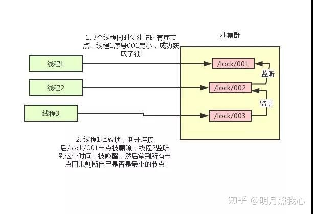

# 分布式锁

## 1. 什么是锁

- 在单进程的系统中，当存在多个线程可以同时改变某个变量（可变共享变量）时，就需要对变量或代码块做同步，使其在修改这种变量时能够线性执行消除并发修改变量。
- 而同步的本质是通过锁来实现的。为了实现多个线程在一个时刻同一个代码块只能有一个线程可执行，那么需要在某个地方做个标记，这个标记必须每个线程都能看到，当标记不存在时可以设置该标记，其余后续线程发现已经有标记了则等待拥有标记的线程结束同步代码块取消标记后再去尝试设置标记。这个标记可以理解为锁。
- 不同地方实现锁的方式也不一样，只要能满足所有线程都能看得到标记即可。如 Java 中 synchronize 是在对象头设置标记，Lock 接口的实现类基本上都只是某一个 volitile 修饰的 int 型变量其保证每个线程都能拥有对该 int 的可见性和原子修改，linux 内核中也是利用互斥量或信号量等内存数据做标记。
- 除了利用内存数据做锁其实任何互斥的都能做锁(只考虑互斥情况)，如流水表中流水号与时间结合做幂等校验可以看作是一个不会释放的锁，或者使用某个文件是否存在作为锁等。只需要满足在对标记进行修改能保证原子性和内存可见性即可。

## 2. 什么是分布式

分布式的 CAP 理论告诉我们：

------

任何一个分布式系统都无法同时满足一致性(Consistency)、可用性(Availability)和分区容错性(Partition tolerance)，最多只能同时满足两项。

------

目前很多大型网站及应用都是分布式部署的，分布式场景中的数据一致性问题一直是一个比较重要的话题。基于 CAP理论，很多系统在设计之初就要对这三者做出取舍。在互联网领域的绝大多数的场景中，都需要牺牲强一致性来换取系统的高可用性，系统往往只需要保证**最终一致性**。

## 3. 分布式场景

在分布式场景中，多个相同的服务同时开启。为了保证数据的最终一致性，需要例如分布式事务，分布式锁等技术方案的支持，很多时候需要保证一个方法在同一时间内只能被同一个线程执行。在单机环境中，通过 Java 提供的并发 API 我们可以解决，但是在分布式环境下，就没有那么简单啦。

- 分布式与单机情况下最大的不同在于其不是多线程而是**多进程**。
- 多线程由于可以共享堆内存，因此可以简单的采取内存作为标记存储位置，而进程之间甚至可能都不在同一台物理机上，因此需要将标记存放在一个所有进程都能看得见的地方。

## 4. 什么是分布式锁

- 当在分布式模型下，数据只有一份（或有限制），此时需要利用锁的技术控制某一时刻修改数据的进程数。
- 与单机模式下的锁不仅需要保证进程可见，还需要考虑进程与锁之间的网络问题。（我觉得分布式情况下之所以问题变得复杂，主要就是需要考虑到**网络的延时和不可靠**。）
- 分布式锁还是可以将标记存在内存，只是该内存不是某个进程分配的内存而是公共内存如 Redis、Memcache。至于利用数据库、文件等做锁与单机的实现是一样的，只要保证标记能互斥就行。

## 5. 需要怎样的分布式锁

- 可以保证在分布式部署的应用集群中，同一个方法在同一时间只能被一台机器上的一个线程执行。
- 这把锁要是一把可重入锁（避免死锁）
- 这把锁最好是一把阻塞锁（根据业务需求考虑要不要这条）
- 这把锁最好是一把公平锁（根据业务需求考虑要不要这条）
- 有高可用的获取锁和释放锁功能
- 获取锁和释放锁的性能要好

## 6. 实现分布式锁的几种主要方式

### 6.1 基于数据库的分布式锁

#### 6.1.1 基于乐观锁

**基于表主键唯一做分布式锁**

利用主键唯一的特性，如果有多个请求同时提交到数据库的话，数据库会保证只有一个操作可以成功，那么就可以认为操作成功的那个线程获得了该方法的锁，当方法执行完毕之后，想要释放锁的话，删除这条数据库记录即可。

上面这种简单的实现有以下几个问题：

- 这把锁强依赖数据库的可用性，数据库是一个单点，一旦数据库挂掉，会导致业务系统不可用。
- 这把锁没有失效时间，一旦解锁操作失败，就会导致锁记录一直在数据库中，其他线程无法再获得到锁。
- 这把锁只能是非阻塞的，因为数据的 insert 操作，一旦插入失败就会直接报错。没有获得锁的线程并不会进入排队队列，要想再次获得锁就要再次触发获得锁操作。
- 这把锁是非重入的，同一个线程在没有释放锁之前无法再次获得该锁。因为数据中数据已经存在了。
- 这把锁是非公平锁，所有等待锁的线程凭运气去争夺锁。
- 在 MySQL 数据库中采用主键冲突防重，在大并发情况下有可能会造成锁表现象。

当然，我们也可以有其他方式解决上面的问题。

- 数据库是单点？搞两个数据库，数据之前双向同步，一旦挂掉快速切换到备库上。
- 没有失效时间？只要做一个定时任务，每隔一定时间把数据库中的超时数据清理一遍。
- 非阻塞的？搞一个 while 循环，直到 insert 成功再返回成功。
- 非重入的？在数据库表中加个字段，记录当前获得锁的机器的主机信息和线程信息，那么下次再获取锁的时候先查询数据库，如果当前机器的主机信息和线程信息在数据库可以查到的话，直接把锁分配给他就可以了。
- 非公平的？再建一张中间表，将等待锁的线程全记录下来，并根据创建时间排序，只有最先创建的允许获取锁。
- 比较好的办法是在程序中生产主键进行防重。

**基于表字段版本号做分布式锁**

这个策略源于 mysql 的 mvcc 机制，使用这个策略其实本身没有什么问题，唯一的问题就是对数据表侵入较大，我们要为每个表设计一个版本号字段，然后写一条判断 sql 每次进行判断，增加了数据库操作的次数，在高并发的要求下，对数据库连接的开销也是无法忍受的。

#### 6.1.2 基于悲观锁

**基于数据库排他锁做分布式锁**

在查询语句后面增加`for update`，数据库会在查询过程中给数据库表增加排他锁 (注意： InnoDB 引擎在加锁的时候，只有通过索引进行检索的时候才会使用行级锁，否则会使用表级锁。这里我们希望使用行级锁，就要给要执行的方法字段名添加索引，值得注意的是，这个索引一定要创建成唯一索引，否则会出现多个重载方法之间无法同时被访问的问题。重载方法的话建议把参数类型也加上)。当某条记录被加上排他锁之后，其他线程无法再在该行记录上增加排他锁。

可以认为获得排他锁的线程即可获得分布式锁，当获取到锁之后，可以执行方法的业务逻辑，执行完方法之后，通过`connection.commit()`操作来释放锁。

这种方法可以有效的解决上面提到的无法释放锁和阻塞锁的问题。

- 阻塞锁？ `for update`语句会在执行成功后立即返回，在执行失败时一直处于阻塞状态，直到成功。
- 锁定之后服务宕机，无法释放？使用这种方式，服务宕机之后数据库会自己把锁释放掉。

但是还是无法直接解决数据库单点和可重入问题。

这里还可能存在另外一个问题，虽然我们对方法字段名使用了唯一索引，并且显示使用 for update 来使用行级锁。但是，MySQL 会对查询进行优化，即便在条件中使用了索引字段，但是否使用索引来检索数据是由 MySQL 通过判断不同执行计划的代价来决定的，如果 MySQL 认为全表扫效率更高，比如对一些很小的表，它就不会使用索引，这种情况下 InnoDB 将使用表锁，而不是行锁。如果发生这种情况就悲剧了。。。

还有一个问题，就是我们要使用排他锁来进行分布式锁的 lock，那么一个排他锁长时间不提交，就会占用数据库连接。一旦类似的连接变得多了，就可能把数据库连接池撑爆。

#### 6.1.2 优缺点

**优点**：简单，易于理解

**缺点**：会有各种各样的问题（操作数据库需要一定的开销，使用数据库的行级锁并不一定靠谱，性能不靠谱）

### 6.2 基于Redis做分布式锁

#### 6.2.1 基于 redis 的 setnx()、expire() 方法做分布式锁

**setnx()**

setnx 的含义就是 SET if Not Exists，其主要有两个参数 setnx(key, value)。该方法是原子的，如果 key 不存在，则设置当前 key 成功，返回 1；如果当前 key 已经存在，则设置当前 key 失败，返回 0。

**expire()**

expire 设置过期时间，要注意的是 setnx 命令不能设置 key 的超时时间，只能通过 expire() 来对 key 设置。

**使用步骤**

1. setnx(lockkey, 1) 如果返回 0，则说明占位失败；如果返回 1，则说明占位成功
2. expire() 命令对 lockkey 设置超时时间，为的是避免死锁问题
3. 执行完业务代码后，可以通过 delete 命令删除 key

这个方案其实是可以解决日常工作中的需求的，但从技术方案的探讨上来说，可能还有一些可以完善的地方。**比如，如果在第一步 setnx 执行成功后，在 expire() 命令执行成功前，发生了宕机的现象，那么就依然会出现死锁的问题，所以如果要对其进行完善的话，可以使用 redis 的 setnx()、get() 和 getset() 方法来实现分布式锁。**

#### 6.2.2 基于 redis 的 setnx()、get()、getset()方法做分布式锁

这个方案的背景主要是在 setnx() 和 expire() 的方案上针对可能存在的死锁问题，做了一些优化。

**getset()**

这个命令主要有两个参数 getset(key，newValue)。该方法是原子的，对 key 设置 newValue 这个值，并且返回 key 原来的旧值。假设 key 原来是不存在的，那么多次执行这个命令，会出现下边的效果：

- getset(key, "value1") 返回 null 此时 key 的值会被设置为 value1
- getset(key, "value2") 返回 value1 此时 key 的值会被设置为 value2

**使用步骤**

1. setnx(lockkey, 当前时间+过期超时时间)，如果返回 1，则获取锁成功；如果返回 0 则没有获取到锁，转向 2。
2. get(lockkey) 获取值 oldExpireTime ，并将这个 value 值与当前的系统时间进行比较，如果小于当前系统时间，则认为这个锁已经超时，可以允许别的请求重新获取，转向 3。
3. 计算 newExpireTime = 当前时间+过期超时时间，然后 getset(lockkey, newExpireTime) 会返回当前 lockkey 的值currentExpireTime。
4. 判断 currentExpireTime 与 oldExpireTime 是否相等，如果相等，说明当前 getset 设置成功，获取到了锁。如果不相等，说明这个锁又被别的请求获取走了，那么当前请求可以直接返回失败，或者继续重试。
5. 在获取到锁之后，当前线程可以开始自己的业务处理，当处理完毕后，比较自己的处理时间和对于锁设置的超时时间，如果小于锁设置的超时时间，则直接执行 delete 释放锁；如果大于锁设置的超时时间，则不需要再锁进行处理。

```java
public final class RedisLockUtil {

    private static final int defaultExpire = 60;

    private RedisLockUtil() {
        //
    }

    /**
     * 加锁
     * @param key redis key
     * @param expire 过期时间，单位秒
     * @return true:加锁成功，false，加锁失败
     */
    public static boolean lock(String key, int expire) {

        RedisService redisService = SpringUtils.getBean(RedisService.class);
        long status = redisService.setnx(key, "1");

        if(status == 1) {
            redisService.expire(key, expire);
            return true;
        }

        return false;
    }

    public static boolean lock(String key) {
        return lock2(key, defaultExpire);
    }

    /**
     * 加锁
     * @param key redis key
     * @param expire 过期时间，单位秒
     * @return true:加锁成功，false，加锁失败
     */
    public static boolean lock2(String key, int expire) {

        RedisService redisService = SpringUtils.getBean(RedisService.class);

        long value = System.currentTimeMillis() + expire;
        long status = redisService.setnx(key, String.valueOf(value));

        if(status == 1) {
            return true;
        }
        long oldExpireTime = Long.parseLong(redisService.get(key, "0"));
        if(oldExpireTime < System.currentTimeMillis()) {
            //超时
            long newExpireTime = System.currentTimeMillis() + expire;
            long currentExpireTime = Long.parseLong(redisService.getSet(key, String.valueOf(newExpireTime)));
            if(currentExpireTime == oldExpireTime) {
                return true;
            }
        }
        return false;
    }

    public static void unLock1(String key) {
        RedisService redisService = SpringUtils.getBean(RedisService.class);
        redisService.del(key);
    }

    public static void unLock2(String key) {    
        RedisService redisService = SpringUtils.getBean(RedisService.class);    
        long oldExpireTime = Long.parseLong(redisService.get(key, "0"));   
        if(oldExpireTime > System.currentTimeMillis()) {        
            redisService.del(key);    
        }
   }
}
public void drawRedPacket(long userId) {
    String key = "draw.redpacket.userid:" + userId;

    boolean lock = RedisLockUtil.lock2(key, 60);
    if(lock) {
        try {
            //领取操作
        } finally {
            //释放锁
            RedisLockUtil.unLock(key);
        }
    } else {
        new RuntimeException("重复领取奖励");
    }
}
```

#### 6.2.3 基于 Redlock 做分布式锁

Redlock 是 Redis 的作者 antirez 给出的集群模式的 Redis 分布式锁，它基于 N 个完全独立的 Redis 节点(通常情况下 N 可以设置成 5)。

算法的步骤如下：

1. 客户端获取当前时间，以毫秒为单位
2. 客户端尝试获取 N 个节点的锁(每个节点获取锁的方式和前面说的缓存锁一样)，N 个节点以相同的 key 和 value 获取锁。客户端需要设置接口访问超时，接口超时时间需要远远小于锁超时时间，比如锁自动释放的时间是 10s，那么接口超时大概设置 5-50ms。这样可以在有 redis 节点宕机后，访问该节点时能尽快超时，而减小锁的正常使用。
3. 客户端计算在获得锁的时候花费了多少时间，方法是用当前时间减去在步骤一获取的时间，只有客户端获得了超过 3 个节点的锁，而且获取锁的时间小于锁的超时时间，客户端才获得了分布式锁。
4. 客户端获取的锁的时间为设置的锁超时时间减去步骤三计算出的获取锁花费时间。
5. 如果客户端获取锁失败了，客户端会依次删除所有的锁。 使用 Redlock 算法，可以保证在挂掉最多 2 个节点的时候，分布式锁服务仍然能工作，这相比之前的数据库锁和缓存锁大大提高了可用性，由于 redis 的高效性能，分布式缓存锁性能并不比数据库锁差。

**优点：**

性能高

**缺点：**

失效时间设置多长时间为好？如何设置的失效时间太短，方法没等执行完，锁就自动释放了，那么就会产生并发问题。如果设置的时间太长，其他获取锁的线程就可能要平白的多等一段时间。

#### 6.2.4 基于 redisson 做分布式锁

redisson 是 redis 官方的分布式锁组件。GitHub 地址：[https://github.com/redisson/redisson](https://zhuanlan.zhihu.com/write)

上面的这个问题 ——> 失效时间设置多长时间为好？这个问题在 redisson 的做法是：每获得一个锁时，只设置一个很短的超时时间，同时起一个线程在每次快要到超时时间时去刷新锁的超时时间。在释放锁的同时结束这个线程。

### 6.3 基于Zookeeper做分布式锁

#### 6.3.1 zookeeper 锁相关基础知识

- zk 一般由多个节点构成(单数)，采用 zab 一致性协议。因此可以将 zk 看成一个单点结构，对其修改数据其内部自动将所有节点数据进行修改而后才提供查询服务
- zk 的数据以目录树的形式，每个目录称为 znode， znode 中可存储数据(一般不超过 1M)，还可以在其中增加子节点
- 子节点有三种类型。序列化节点，每在该节点下增加一个节点自动给该节点的名称上自增。临时节点，一旦创建这个 znode 的客户端与服务器失去联系，这个 znode 也将自动删除。最后就是普通节点
- Watch 机制，client 可以监控每个节点的变化，当产生变化会给 client 产生一个事件

#### 6.3.2 zk基本锁

**原理**

利用临时节点与 watch 机制。每个锁占用一个普通节点 /lock，当需要获取锁时在 /lock 目录下创建一个临时节点，创建成功则表示获取锁成功，失败则 watch/lock 节点，有删除操作后再去争锁。临时节点好处在于当进程挂掉后能自动上锁的节点自动删除即取消锁。

**缺点**

所有取锁失败的进程都监听父节点，很容易发生羊群效应，即当释放锁后所有等待进程一起来创建节点，并发量很大。

#### 6.3.3 zk锁优化

**原理**

上锁改为创建临时有序节点，每个上锁的节点均能创建节点成功，只是其序号不同。只有序号最小的可以拥有锁，如果这个节点序号不是最小的则 watch 序号比本身小的前一个节点 (公平锁)。

**步骤**

- 使用 ZK 的临时节点和有序节点，每个线程获取锁就是在 ZK 创建一个临时有序的节点，比如在 /lock/ 目录下。
- 创建节点成功后，获取 /lock 目录下的所有临时节点，再判断当前线程创建的节点是否是所有的节点的序号最小的节点。
- 如果当前线程创建的节点是所有节点序号最小的节点，则认为获取锁成功，删除临时节点，释放锁
- 如果当前线程创建的节点不是所有节点序号最小的节点，则对节点序号的前一个节点添加一个事件监听。

比如当前线程获取到的节点序号为 /lock/003，然后所有的节点列表为[/lock/001，/lock/002，/lock/003]，则对 /lock/002 这个节点添加一个事件监听器。

如果锁释放了，会唤醒下一个序号的节点，然后重新执行第 3 步，判断是否自己的节点序号是最小。

比如 /lock/001 释放了，/lock/002 监听到时间，此时节点集合为[/lock/002，/lock/003]，则 /lock/002 为最小序号节点，获取到锁。

整个过程如下：



**优缺点**

**优点：**

有效的解决单点问题，不可重入问题，非阻塞问题以及锁无法释放的问题。实现起来较为简单。

**缺点：**

性能上可能并没有缓存服务那么高，因为每次在创建锁和释放锁的过程中，都要动态创建、销毁临时节点来实现锁功能。ZK 中创建和删除节点只能通过 Leader 服务器来执行，然后将数据同步到所有的 Follower 机器上。还需要对 ZK的原理有所了解。

## 7. Redis与Zk实现分布式锁方式比较

对于 Redis 的分布式锁而言，它有以下缺点：

- 它获取锁的方式简单粗暴，获取不到锁直接不断尝试获取锁，比较消耗性能。
- 另外来说的话，Redis 的设计定位决定了它的数据并不是强一致性的，在某些极端情况下，可能会出现问题。锁的模型不够健壮。
- 即便使用 Redlock 算法来实现，在某些复杂场景下，也无法保证其实现 100% 没有问题，关于 Redlock 的讨论可以看 How to do distributed locking。
- Redis 分布式锁，其实需要自己不断去尝试获取锁，比较消耗性能。

但是另一方面使用 Redis 实现分布式锁在很多企业中非常常见，而且大部分情况下都不会遇到所谓的“极端复杂场景”。

所以使用 Redis 作为分布式锁也不失为一种好的方案，最重要的一点是 Redis 的性能很高，可以支撑高并发的获取、释放锁操作。

对于 ZK 分布式锁而言:

- ZK 天生设计定位就是分布式协调，强一致性。锁的模型健壮、简单易用、适合做分布式锁。
- 如果获取不到锁，只需要添加一个监听器就可以了，不用一直轮询，性能消耗较小。

但是 ZK 也有其缺点：如果有较多的客户端频繁的申请加锁、释放锁，对于 ZK 集群的压力会比较大。

小结：综上所述，Redis 和 ZK 都有其优缺点。我们在做技术选型的时候可以根据这些问题作为参考因素。

## 8. 使用分布式锁的注意事项

- 注意分布式锁的开销
- 注意加锁的粒度
- 加锁的方式