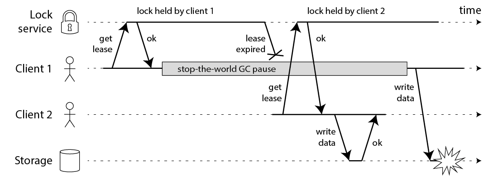
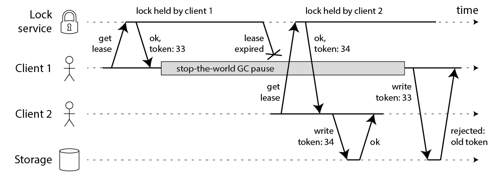

# 基于Redis的分布式锁到底安全吗（上）

借助Redis来实现一个分布式锁(Distributed Lock)的做法，已经有很多人尝试过。人们构建这样的分布式锁的目的，是为了对一些共享资源进行互斥访问。

但是，这些实现虽然思路大体相近，但实现细节上各不相同，它们能提供的安全性和可用性也不尽相同。所以，Redis的作者antirez给出了一个更好的实现，称为Redlock，算是Redis官方对于实现分布式锁的指导规范。Redlock的算法描述就放在Redis的官网上：

- https://redis.io/topics/distlock

在Redlock之前，很多人对于分布式锁的实现都是基于单个Redis节点的。而Redlock是基于多个Redis节点（都是Master）的一种实现。为了能理解Redlock，我们首先需要把简单的基于单Redis节点的算法描述清楚，因为它是Redlock的基础。

## 1. 基于单Redis节点的分布式锁

首先，Redis客户端为了**获取锁**，向Redis节点发送如下命令：

```
SET resource_name my_random_value NX PX 30000
```

上面的命令如果执行成功，则客户端成功获取到了锁，接下来就可以**访问共享资源**了；而如果上面的命令执行失败，则说明获取锁失败。

注意，在上面的`SET`命令中：

- `my_random_value`是由客户端生成的一个随机字符串，它要保证在足够长的一段时间内在所有客户端的所有获取锁的请求中都是唯一的。
- `NX`表示只有当`resource_name`对应的key值不存在的时候才能`SET`成功。这保证了只有第一个请求的客户端才能获得锁，而其它客户端在锁被释放之前都无法获得锁。
- `PX 30000`表示这个锁有一个30秒的自动过期时间。当然，这里30秒只是一个例子，客户端可以选择合适的过期时间。

最后，当客户端完成了对共享资源的操作之后，执行下面的Redis Lua脚本来**释放锁**：

```
if redis.call("get",KEYS[1]) == ARGV[1] then
    return redis.call("del",KEYS[1])
else
    return 0
end
```

这段Lua脚本在执行的时候要把前面的`my_random_value`作为`ARGV[1]`的值传进去，把`resource_name`作为`KEYS[1]`的值传进去。

至此，基于单Redis节点的分布式锁的算法就描述完了。这里面有好几个问题需要重点分析一下。1.5与1.6两个是单节点Redis锁未解决的问题。

### 1.1 锁必须要设置一个过期时间

这个锁必须要设置一个过期时间。否则的话，当一个客户端获取锁成功之后，假如它崩溃了，或者由于发生了网络分割（network partition）导致它再也无法和Redis节点通信了，那么它就会一直持有这个锁，而其它客户端永远无法获得锁了。antirez在后面的分析中也特别强调了这一点，而且把这个过期时间称为锁的有效时间(lock validity time)。**获得锁的客户端必须在这个时间之内完成对共享资源的访问**。

### 1.2 原子获取锁操作

第一步**获取锁**的操作，网上不少文章把它实现成了两个Redis命令：

```
SETNX resource_name my_random_value
EXPIRE resource_name 30
```

虽然这两个命令和前面算法描述中的一个`SET`命令执行效果相同，但却不是原子的。如果客户端在执行完`SETNX`后崩溃了，那么就没有机会执行`EXPIRE`了，导致它一直持有这个锁。

### 1.3 设置随机字符串

设置一个随机字符串`my_random_value`是很有必要的，它保证了一个客户端释放的锁必须是自己持有的那个锁。假如获取锁时`SET`的不是一个随机字符串，而是一个固定值，那么可能会发生下面的执行序列：

1. 客户端1获取锁成功。
2. 客户端1在某个操作上阻塞了很长时间。
3. 过期时间到了，锁自动释放了。
4. 客户端2获取到了对应同一个资源的锁。
5. 客户端1从阻塞中恢复过来，释放掉了客户端2持有的锁。

之后，客户端2在访问共享资源的时候，就没有锁为它提供保护了。

### 1.4 释放锁的操作必须使用Lua脚本来实现

释放锁其实包含三步操作：’GET’、判断和’DEL’，用Lua脚本来实现能保证这三步的原子性。否则，如果把这三步操作放到客户端逻辑中去执行的话，就有可能发生与前面第三个问题类似的执行序列：

1. 客户端1获取锁成功。
2. 客户端1访问共享资源。
3. 客户端1为了释放锁，先执行’GET’操作获取随机字符串的值。
4. 客户端1判断随机字符串的值，与预期的值相等。
5. 客户端1由于某个原因阻塞住了很长时间。
6. 过期时间到了，锁自动释放了。
7. 客户端2获取到了对应同一个资源的锁。
8. 客户端1从阻塞中恢复过来，执行`DEL`操纵，释放掉了客户端2持有的锁。

实际上，在上述第三个问题和第四个问题的分析中，如果不是客户端阻塞住了，而是出现了大的网络延迟，也有可能导致类似的执行序列发生。

### 1.5 锁有效时间设置问题？

锁的有效时间(lock validity time)设置成多少合适呢？如果设置太短的话，锁就有可能在客户端完成对于共享资源的访问之前过期，从而失去保护；如果设置太长的话，一旦某个持有锁的客户端释放锁失败，那么就会导致所有其它客户端都无法获取锁，从而长时间内无法正常工作。

### 1.6 单节点Redis锁存在问题？

假如单节点Redis宕机了，那么所有客户端就都无法获得锁了，服务变得不可用。为了提高可用性，我们可以给这个Redis节点挂一个Slave，当Master节点不可用的时候，系统自动切到Slave上（failover）。但由于Redis的主从复制（replication）是异步的，这可能导致在failover过程中丧失锁的安全性。考虑下面的执行序列：

1. 客户端1从Master获取了锁。
2. Master宕机了，存储锁的key还没有来得及同步到Slave上。
3. Slave升级为Master。
4. 客户端2从新的Master获取到了对应同一个资源的锁。

于是，客户端1和客户端2同时持有了同一个资源的锁。锁的安全性被打破。针对这个问题，antirez设计了Redlock算法。

## 2. 分布式锁Redlock

由于前面介绍的基于单Redis节点的分布式锁在failover的时候会产生解决不了的安全性问题，因此antirez提出了新的分布式锁的算法Redlock，它基于N个完全独立的Redis节点（通常情况下N可以设置成5）。

运行Redlock算法的客户端依次执行下面各个步骤，来完成**获取锁**的操作：

1. 获取当前时间（毫秒数）。
2. 按顺序依次向N个Redis节点执行**获取锁**的操作。这个获取操作跟前面基于单Redis节点的**获取锁**的过程相同，包含随机字符串`my_random_value`，也包含过期时间(比如`PX 30000`，即锁的有效时间)。为了保证在某个Redis节点不可用的时候算法能够继续运行，这个**获取锁**的操作还有一个超时时间(time out)，它要远小于锁的有效时间（几十毫秒量级）。客户端在向某个Redis节点获取锁失败以后，应该立即尝试下一个Redis节点。这里的失败，应该包含任何类型的失败，比如该Redis节点不可用，或者该Redis节点上的锁已经被其它客户端持有（注：Redlock原文中这里只提到了Redis节点不可用的情况，但也应该包含其它的失败情况）。
3. 计算整个获取锁的过程总共消耗了多长时间，计算方法是用当前时间减去第1步记录的时间。如果客户端从大多数Redis节点（>= N/2+1）成功获取到了锁，并且获取锁总共消耗的时间没有超过锁的有效时间(lock validity time)，那么这时客户端才认为最终获取锁成功；否则，认为最终获取锁失败。
4. 如果最终获取锁成功了，那么这个锁的有效时间应该重新计算，它等于最初的锁的有效时间减去第3步计算出来的获取锁消耗的时间。
5. 如果最终获取锁失败了（可能由于获取到锁的Redis节点个数少于N/2+1，或者整个获取锁的过程消耗的时间超过了锁的最初有效时间），那么客户端应该立即向所有Redis节点发起**释放锁**的操作（即前面介绍的Redis Lua脚本）。

**释放锁**的过程比较简单：客户端向所有Redis节点发起**释放锁**的操作，不管这些节点当时在获取锁的时候成功与否。

由于N个Redis节点中的大多数能正常工作就能保证Redlock正常工作，因此理论上它的可用性更高。我们前面讨论的单Redis节点的分布式锁在failover的时候锁失效的问题，在Redlock中不存在了。下面重点说下Redlock的几个问题：

### 2.1 问题1：集群某节点发生崩溃重启问题

如果有节点发生崩溃重启，还是会对锁的安全性有影响的。具体的影响程度跟Redis对数据的持久化程度有关。

假设一共有5个Redis节点：A, B, C, D, E。设想发生了如下的事件序列：

1. 客户端1成功锁住了A, B, C，**获取锁**成功（但D和E没有锁住）。
2. 节点C崩溃重启了，但客户端1在C上加的锁没有持久化下来，丢失了。
3. 节点C重启后，客户端2锁住了C, D, E，**获取锁**成功。

这样，客户端1和客户端2同时获得了锁（针对同一资源）。

在默认情况下，Redis的AOF持久化方式是每秒写一次磁盘(即执行fsync)，因此最坏情况下可能丢失1秒的数据。为了尽可能不丢数据，Redis允许设置成每次修改数据都进行fsync，但这会降低性能。当然，即使执行了fsync也仍然有可能丢失数据（这取决于系统而不是Redis的实现）。所以，上面分析的由于节点重启引发的锁失效问题，总是有可能出现的。

为了应对这一问题，antirez又提出了**延迟重启**(delayed restarts)的概念。也就是说，一个节点崩溃后，先不立即重启它，而是等待一段时间再重启，这段时间应该大于锁的有效时间(lock validity time)。这样的话，这个节点在重启前所参与的锁都会过期，它在重启后就不会对现有的锁造成影响。

### 2.2 问题2：释放锁时需要向所有redis节点发起请求

在最后**释放锁**的时候，antirez在算法描述中特别强调。客户端应该向所有Redis节点发起**释放锁**的操作。也就是说，即使当时向某个节点获取锁没有成功，在释放锁的时候也不应该漏掉这个节点。这是为什么呢？设想这样一种情况，客户端发给某个Redis节点的**获取锁**的请求成功到达了该Redis节点，这个节点也成功执行了`SET`操作，但是它返回给客户端的响应包却丢失了。这在客户端看来，获取锁的请求由于超时而失败了，但在Redis这边看来，加锁已经成功了。因此，释放锁的时候，客户端也应该对当时获取锁失败的那些Redis节点同样发起请求。实际上，这种情况在异步通信模型中是有可能发生的：客户端向服务器通信是正常的，但反方向却是有问题的。

### 2.3 客户端获取锁有遇到问题长期阻塞问题

如果客户端长期阻塞导致锁过期，那么它接下来访问共享资源就不安全了（没有了锁的保护）。这个问题在Redlock中是否有所改善呢？显然，这样的问题在Redlock中是依然存在的。

另外，在算法第4步成功获取了锁之后，如果由于获取锁的过程消耗了较长时间，重新计算出来的剩余的锁有效时间很短了，那么我们还来得及去完成共享资源访问吗？如果我们认为太短，是不是应该立即进行锁的释放操作？那到底多短才算呢？又是一个选择难题。

## 3.Martin的fencing token方式实现分布式锁

Martin Kleppmann在2016-02-08这一天发表了一篇blog，名字叫”How to do distributed locking “，地址如下：

- https://martin.kleppmann.com/2016/02/08/how-to-do-distributed-locking.html

Martin在这篇文章中谈及了分布式系统的很多基础性的问题（特别是分布式计算的异步模型），对分布式系统的从业者来说非常值得一读。这篇文章大体可以分为两大部分：

- 前半部分，与Redlock无关。Martin指出，即使我们拥有一个完美实现的分布式锁（带自动过期功能），在没有共享资源参与进来提供某种fencing机制的前提下，我们仍然不可能获得足够的安全性。
- 后半部分，是对Redlock本身的批评。Martin指出，由于Redlock本质上是建立在一个同步模型之上，对系统的记时假设(timing assumption)有很强的要求，因此本身的安全性是不够的。

首先我们讨论一下前半部分的关键点。Martin给出了下面这样一份时序图：



在上面的时序图中，假设锁服务本身是没有问题的，它总是能保证任一时刻最多只有一个客户端获得锁。上图中出现的lease这个词可以暂且认为就等同于一个带有自动过期功能的锁。客户端1在获得锁之后发生了很长时间的GC pause，在此期间，它获得的锁过期了，而客户端2获得了锁。当客户端1从GC pause中恢复过来的时候，它不知道自己持有的锁已经过期了，它依然向共享资源（上图中是一个存储服务）发起了写数据请求，而这时锁实际上被客户端2持有，因此两个客户端的写请求就有可能冲突（锁的互斥作用失效了）。

初看上去，有人可能会说，既然客户端1从GC pause中恢复过来以后不知道自己持有的锁已经过期了，那么它可以在访问共享资源之前先判断一下锁是否过期。但仔细想想，这丝毫也没有帮助。因为GC pause可能发生在任意时刻，也许恰好在判断完之后。

也有人会说，如果客户端使用没有GC的语言来实现，是不是就没有这个问题呢？Martin指出，系统环境太复杂，仍然有很多原因导致进程的pause，比如虚存造成的缺页故障(page fault)，再比如CPU资源的竞争。即使不考虑进程pause的情况，网络延迟也仍然会造成类似的结果。

总结起来就是说，即使锁服务本身是没有问题的，而仅仅是客户端有长时间的pause或网络延迟，仍然会造成两个客户端同时访问共享资源的冲突情况发生。而这种情况其实就是我们在前面已经提出来的“客户端长期阻塞导致锁过期”的那个疑问。

为了解决这个问题，Martin给出了一种方法，称为**fencing token**。fencing token是一个单调递增的数字，当客户端成功获取锁的时候它随同锁一起返回给客户端。而客户端访问共享资源的时候带着这个fencing token，这样提供共享资源的服务就能根据它进行检查，拒绝掉延迟到来的访问请求（避免了冲突）。如下图：



在上图中，客户端1先获取到的锁，因此有一个较小的fencing token，等于33，而客户端2后获取到的锁，有一个较大的fencing token，等于34。客户端1从GC pause中恢复过来之后，依然是向存储服务发送访问请求，但是带了fencing token = 33。存储服务发现它之前已经处理过34的请求，所以会拒绝掉这次33的请求。这样就避免了冲突。

Martin在文中构造了一些事件序列，能够让Redlock失效（两个客户端同时持有锁）。为了说明Redlock对系统记时(timing)的过分依赖，他首先给出了下面的一个例子（还是假设有5个Redis节点A, B, C, D, E）：

1. 客户端1从Redis节点A, B, C成功获取了锁（多数节点）。由于网络问题，与D和E通信失败。
2. 节点C上的时钟发生了向前跳跃，导致它上面维护的锁快速过期。
3. 客户端2从Redis节点C, D, E成功获取了同一个资源的锁（多数节点）。
4. 客户端1和客户端2现在都认为自己持有了锁。

上面这种情况之所以有可能发生，本质上是因为Redlock的安全性(safety property)对系统的时钟有比较强的依赖，一旦系统的时钟变得不准确，算法的安全性也就保证不了了。Martin在这里其实是要指出分布式算法研究中的一些基础性问题，或者说一些常识问题，即好的分布式算法应该基于异步模型(asynchronous model)，算法的安全性不应该依赖于任何记时假设(timing assumption)。在异步模型中：进程可能pause任意长的时间，消息可能在网络中延迟任意长的时间，甚至丢失，系统时钟也可能以任意方式出错。一个好的分布式算法，这些因素不应该影响它的安全性(safety property)，只可能影响到它的活性(liveness property)，也就是说，即使在非常极端的情况下(比如系统时钟严重错误)，算法顶多是不能在有限的时间内给出结果而已，而不应该给出错误的结果。这样的算法在现实中是存在的，像比较著名的Paxos，或Raft。但显然按这个标准的话，Redlock的安全性级别是达不到的。

### 2.1 Martin文章总结

第一：Martin认为Redlock会失效的情况主要有三种：

- 时钟发生跳跃。
- 长时间的GC pause。
- 长时间的网络延迟。

第二：对锁的用途的区分。他把锁的用途分为两种：

- 为了效率(efficiency)，协调各个客户端避免做重复的工作。即使锁偶尔失效了，只是可能把某些操作多做一遍而已，不会产生其它的不良后果。比如重复发送了一封同样的email。
- 为了正确性(correctness)。在任何情况下都不允许锁失效的情况发生，因为一旦发生，就可能意味着数据不一致(inconsistency)，数据丢失，文件损坏，或者其它严重的问题。

最后，Martin得出了如下的结论：

- 如果是为了效率(efficiency)而使用分布式锁，允许锁的偶尔失效，那么使用单Redis节点的锁方案就足够了，简单而且效率高。Redlock则是个过重的实现(heavyweight)。
- 如果是为了正确性(correctness)在很严肃的场合使用分布式锁，那么不要使用Redlock。它不是建立在异步模型上的一个足够强的算法，它对于系统模型的假设中包含很多危险的成分(对于timing)。而且，它没有一个机制能够提供fencing token。那应该使用什么技术呢？Martin认为，应该考虑类似Zookeeper的方案，或者支持事务的数据库。

## 4. antirez的反驳

antirez就在博客上贴出了对于此事(第三部分Martin观点)的反驳文章，名字叫"Is Redlock safe?"，地址如下:

- http://antirez.com/news/101

antirez围绕两点对Martin进行了反驳：

- 带有自动过期功能的分布式锁，必须提供某种fencing机制来保证对共享资源的真正的互斥保护。Redlock提供不了这样一种机制。
- Redlock构建在一个不够安全的系统模型之上。它对于系统的记时假设(timing assumption)有比较强的要求，而这些要求在现实的系统中是无法保证的。

### 4.1 第一点 fencing token

关于fencing机制。antirez对于Martin的这种论证方式提出了质疑：既然在锁失效的情况下已经存在一种fencing机制能继续保持资源的互斥访问了，那为什么还要使用一个分布式锁并且还要求它提供那么强的安全性保证呢？即使退一步讲，Redlock虽然提供不了Martin所讲的递增的fencing token，但利用Redlock产生的随机字符串( `my_random_value` )可以达到同样的效果。这个随机字符串虽然不是递增的，但却是唯一的，可以称之为unique token。antirez举了个例子，可以用它来实现“Check and Set”操作，原话是：

When starting to work with a shared resource, we set its state to “ <token>`` ”, then we operate the read-modify-write only if the token is still the same when we write. （译文：当开始和共享资源交互的时候，我们将它的状态设置成“ `<token>` ”，然后仅在token没改变的情况下我们才执行“读取-修改-写回”操作。）