# Apache Kylin VS Apache Doris

Apache Kylin 和 Apache Doris 都是优秀的开源OLAP系统，本文将全方位地对比Kylin和Doris。Kylin和Doris分别是MOALP和ROLAP的代表，对比这两个系统的目的不是为了说明哪个系统更好，**只是为了明确每个系统的设计思想和架构原理，让大家可以根据自己的实际需求去选择合适的系统，也可以进一步去思考我们如何去设计出更优秀的OLAP系统**。

## 1. 系统架构

### 1.1 Kylin

Kylin的核心思想是**预计算**，**利用空间换时间来加速查询模式固定的OLAP查询**。

Kylin的理论基础是Cube理论，每一种维度组合称之为Cuboid，所有Cuboid的集合是Cube。 其中由所有维度组成的Cuboid称为Base Cuboid，图中(A,B,C,D)即为Base Cuboid，所有的Cuboid都可以基于Base Cuboid计算出来。 在查询时，Kylin会自动选择满足条件的最“小”Cuboid，比如下面的SQL就会对应Cuboid（A,B）:

> select xx from table where A=xx group by B

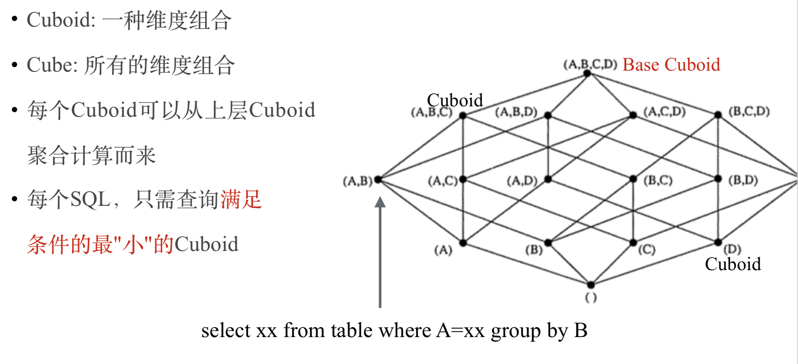

下图是Kylin数据流转的示意图，Kylin自身的组件只有两个：**JobServer和QueryServer**。Kylin的JobServer主要负责将数据源(Hive，Kafka)的数据通过计算引擎(MapReduce，Spark)生成Cube存储到存储引擎(HBase)中；QueryServer负责SQL解析，逻辑计划的生成和优化，向HBase的多个Region发起请求，并对多个Region的结果进行汇总，生成最终的结果集。

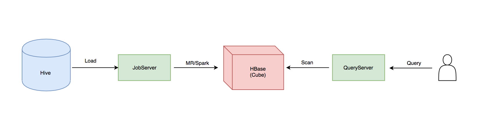

下图是Kylin可插拔的架构图, 在架构设计上，Kylin的**数据源**，构建Cube的**计算引擎**，**存储引擎**都是可插拔的。Kylin的核心就是这套可插拔架构，Cube数据模型和Cuboid的算法。

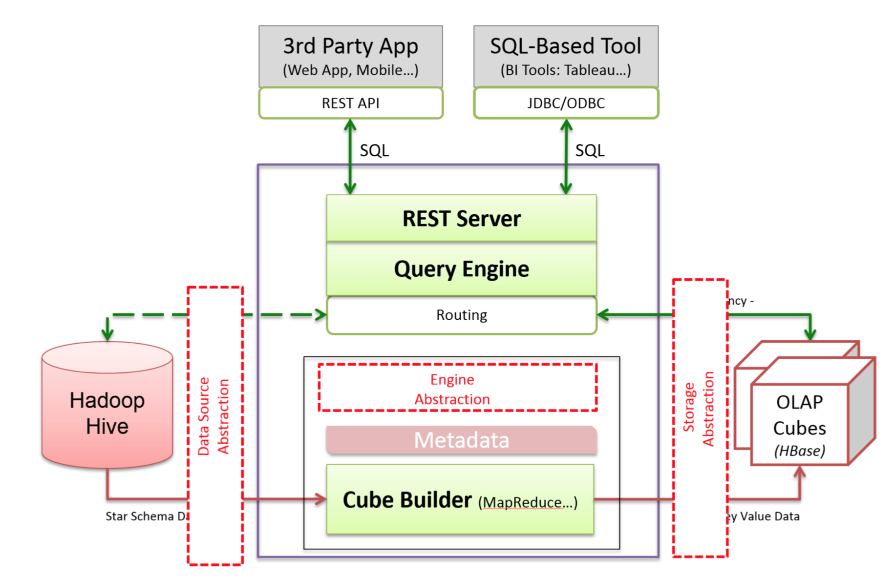

## 1.2 Doris

Doris是一个MPP的OLAP系统，主要整合了**Google Mesa**（数据模型），**Apache Impala**（MPP Query Engine)和**Apache ORCFile** (存储格式，编码和压缩) 的技术。

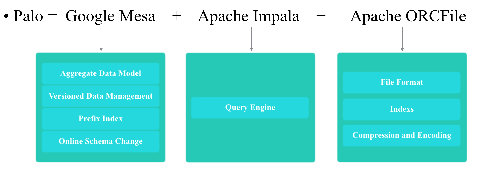

Doris的系统架构如下，Doris主要分为FE和BE两个组件，FE主要负责查询的编译，分发和元数据管理(基于内存，类似HDFS NN)；BE主要负责查询的执行和存储系统。

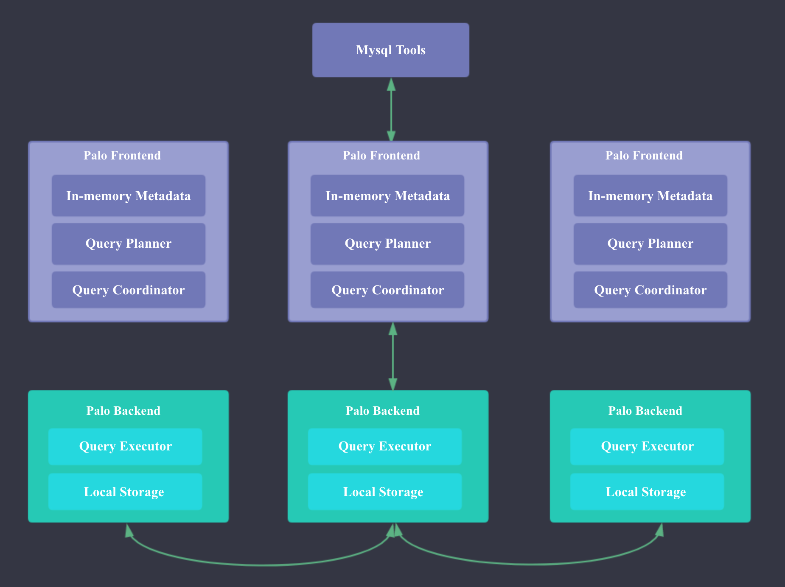

## 2. 数据模型

### 2.1 Kylin数据模型

Kylin将表中的列分为维度列和指标列。在数据导入和查询时相同维度列中的指标会按照对应的聚合函数(Sum, Count, Min, Max, 精确去重，近似去重，百分位数，TOPN)进行聚合。

在存储到HBase时，**Cuboid+维度 会作为HBase的Rowkey, 指标会作为HBase的Value**，一般所有指标会在HBase的一个列族，每列对应一个指标，但对于较大的去重指标会单独拆分到第2个列族。

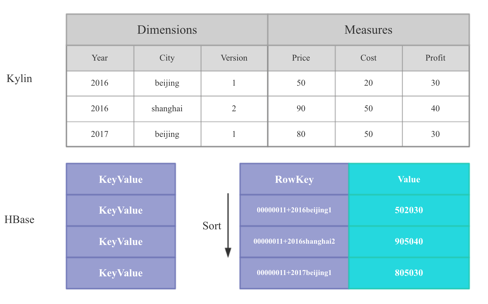

### 2.2 Doris的混合模型

Doris的聚合模型借鉴自Mesa，但本质上和Kylin的聚合模型一样，只不过Doris中将维度称作Key，指标称作Value。

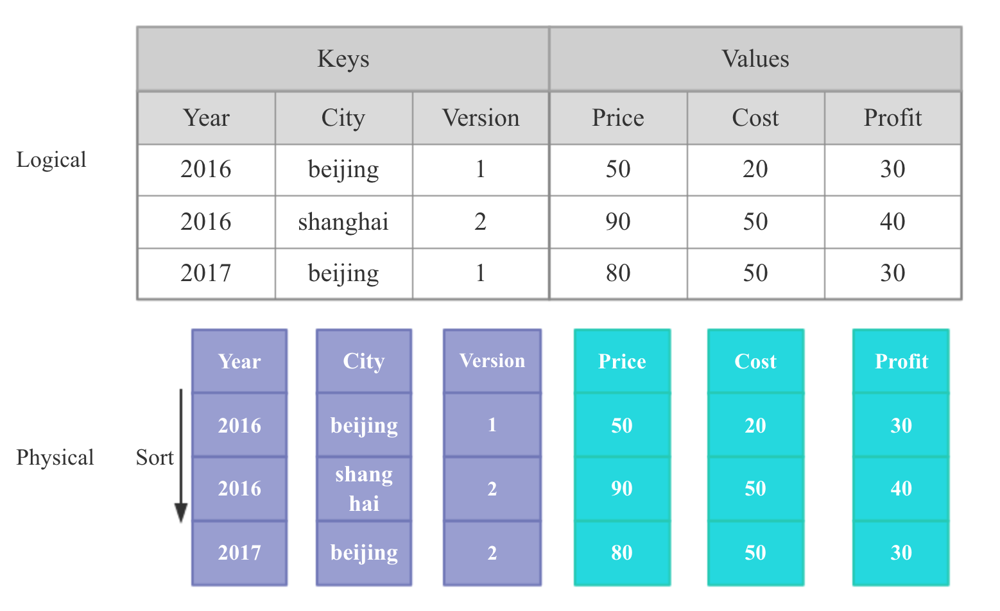

Doris中比较独特的聚合函数是Replace函数，这个聚合函数能够**保证相同Keys的记录只保留最新的Value**，可以借助这个Replace函数来实现**点更新**。一般OLAP系统的数据都是只支持Append的，但是像电商中交易的退款，广告点击中的无效点击处理，都需要去更新之前写入的单条数据，在Kylin这种没有Relpace函数的系统中我们必须把包含对应更新记录的整个Segment数据全部重刷，但是有了Relpace函数，我们只需要再追加1条新的记录即可。 但是Doris中的Repalce函数有个缺点：**无法支持预聚合**，就是说只要你的SQL中包含了Repalce函数，即使有其他可以已经预聚合的Sum，Max指标，也必须现场计算。

为什么Doirs可以支持点更新呢？

Kylin中的Segment是不可变的，也就是说HFile一旦生成，就不再发生任何变化。但是Doirs中的Segment文件和HBase一样，是可以进行Compaction的。

Doris的聚合模型相比Kylin有个缺点：**就是一个Column只能有一个预聚合函数，无法设置多个预聚合函数**。 不过Doris可以现场计算出其他的聚合函数。 Apache Doris的开发者Review时提到，针对这个问题，Doris还有一种解法：由于**Doris支持多表导入的原子更新**，所以1个Column需要多个聚合函数时，可以在Doris中建多张表，同一份数据导入时，Doris可以同时原子更新多张Doris表，缺点是多张Doris表的查询路由需要应用层来完成。

Doris中和Kylin的Cuboid等价的概念是RollUp表，**Cuboid和RollUp表都可以认为是一种Materialized Views或者Index**。Doris的RollUp表和Kylin的Cuboid一样，**在查询时不需要显示指定**，系统内部会根据查询条件进行路由。 如下图所示：

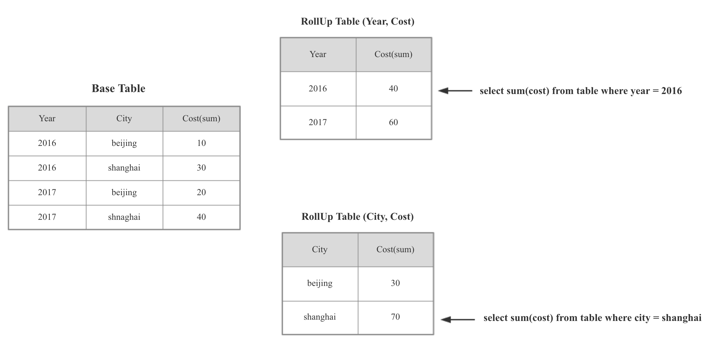

Doris中RollUp表的路由规则如下：

- 选择包含所有查询列的RollUp表
- 按照过滤和排序的Column筛选最符合的RollUp表
- 按照Join的Column筛选最符合的RollUp表
- 行数最小的
- 列数最小的

### 2.3 Kylin Cuboid VS Doris RollUp

|              | Doris RollUp                                     | Kylin Cuboid                                                 |
| ------------ | ------------------------------------------------ | ------------------------------------------------------------ |
| 定义的成本   | 需要手动逐个定义                                 | 系统根据Web上维度，聚集组的设置自动定义出所有Cuboid          |
| 定义的灵活性 | 维度列和指标列可以自由选择                       | 只可以选择维度列，每个Cuboid都必须包含所有指标列             |
| 计算方式     | 从原数据直接生成每个RollUp表的数据               | 根据Cuboid Tree分层构建Cuboid，每个Cuborid的输入时Parent cuboid，不是原始数据 |
| 物理存储     | 每个RollUp是独立存储的                           | 多个Cuborid会存储到一个HFile中(按照大小)                     |
| 查询路由     | 会根据过滤列、排序列、Join列、行数、列数进行路由 | 仅会根据维度列进行路由                                       |

### 2.4 Doris的明细模型

由于Doris的聚合模型存在下面的缺陷，Doris引入了明细模型：

- 必须区分维度列和指标列
- 维度列很多时，Sort的成本很高
- Count成本很高，需要读取所有维度列（可以参考Kylin的解决方法进行优化）

Doris的明细模型不会有任何预聚合，不区分维度列和指标列，但是在建表时需要指定Sort Columns，**数据导入时会根据Sort Columns进行排序，查询时根据Sort Column过滤会比较高效**。

如下图所示，Sort Columns是Year和City。

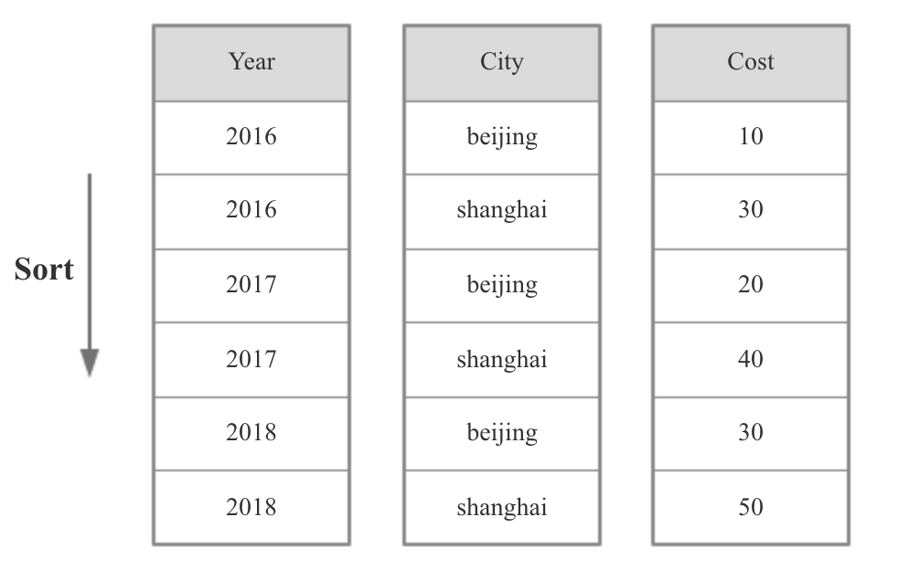

这里需要注意一点，**Doris中一张表只能有一种数据模型**，即要么是聚合模型，要么是明细模型，而且**Roll Up表的数据模型必须和Base表一致**，也就是说明细模型的Base表不能有聚合模型的Roll Up表

## 3. 存储引擎

### 3.1 Kylin存储引擎HBase

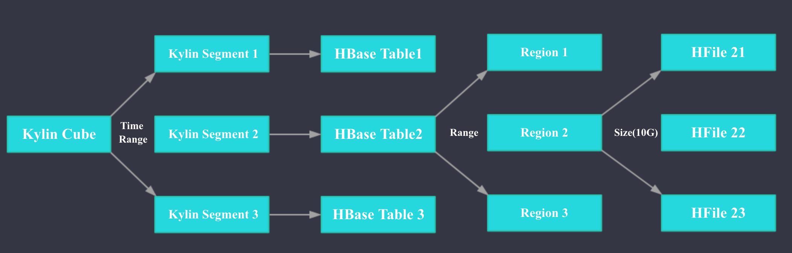

如上图所示，在Kylin中1个Cube可以按照时间拆分为多个Segment,**Segment是Kylin中数据导入和刷新的最小单位**。Kylin中1个Segment对应HBase中一张Table。 HBase中的Table会按照Range分区拆分为多个Region,每个Region会按照大小拆分为多个HFile。

### 3.2 Doris存储引擎

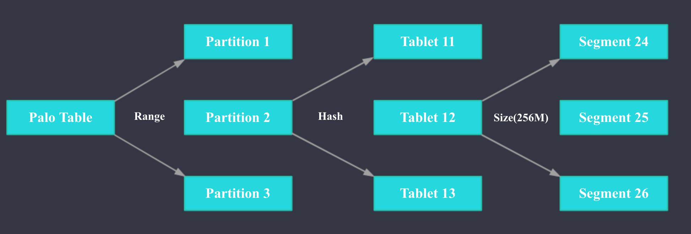

如上图所示，Doris的Table支持二级分区，可以先按照日期列进行一级分区，再按照指定列Hash分桶。具体来说，1个Table可以按照日期列分为多个Partition，每个Partition包含多个Tablet，**Tablet是数据移动，复制等操作的最小物理存储单位**，各个Tablet之间的数据没有交集，并且在物理上独立存储。Partition可以视为逻辑上最小的管理单元，**数据的导入与删除，仅能针对一个 Partition进行**。Table中Tablet的数量= Partition num * Bucket num。Tablet会按照一定大小(默认256M)拆分为多个Segment文件，Segment是列存的，但是会按行（1024）拆分为多个Rowblock。

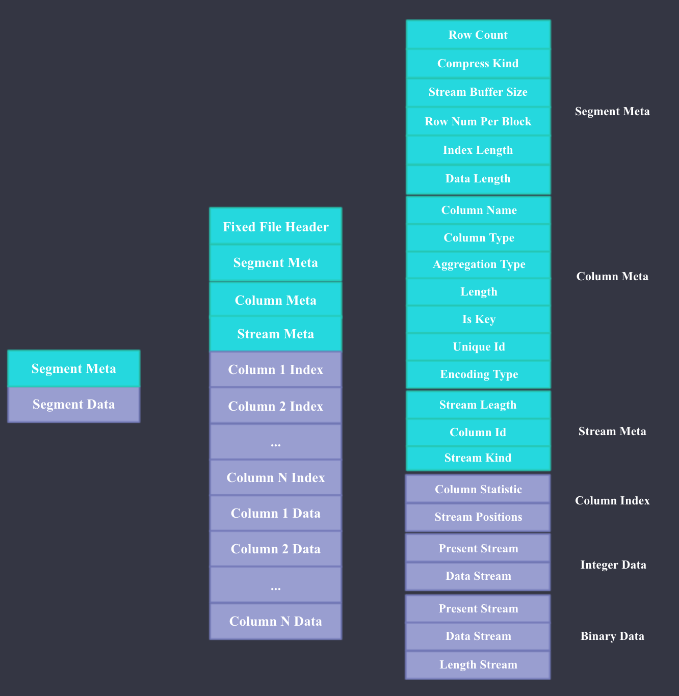

Doris文件格式主要参考了Apache ORC，如上图所示，Doris文件主要由Meta和Data两部分组成，Meta主要包括文件本身的Header，Segment Meta，Column Meta，和每个Column 数据流的元数据，每部分的具体内容大家看图即可，比较详细。 Data部分主要包含每一列的Index和Data，这里的Index指每一列的Min,Max值和数据流Stream的Position；Data就是每一列具体的数据内容，Data根据不同的数据类型会用不同的Stream来存储，Present Stream代表每个Value是否是Null，Data Stream代表二进制数据流，Length Stream代表非定长数据类型的长度。 下图是String使用字典编码和直接存储的Stream例子。

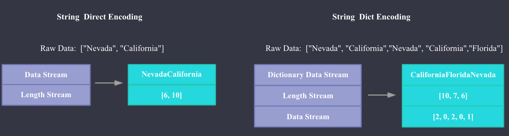

**Doris前缀索引**

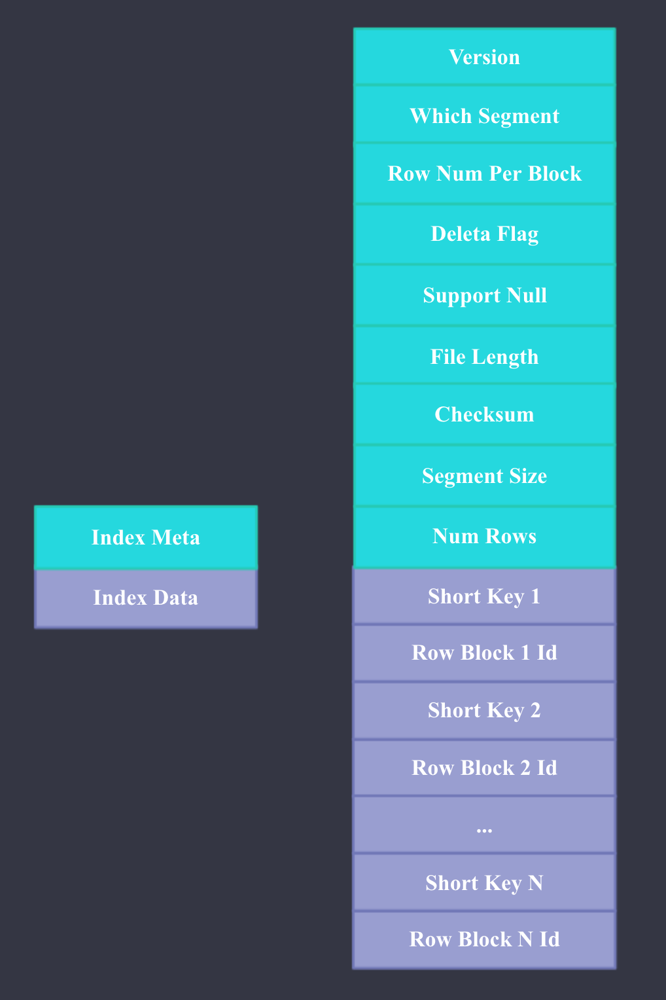

本质上，Doris 的数据存储是类似 SSTable（Sorted String Table）的数据结构。该结构是一种有序的数据结构，可以按照指定的列有序存储。在这种数据结构上，以排序列作为条件进行查找，会非常的高效。而前缀索引，即在排序的基础上，实现的一种根据给定前缀列，快速查询数据的索引方式。前缀索引文件的格式如上图所示，**索引的Key是每个Rowblock第一行记录的Sort Key的前36个字节，Value是Rowblock在Segment文件的偏移量**。

有了前缀索引后，我们查询特定Key的过程就是两次二分查找：

1. 先加载Index文件，二分查找Index文件获取包含特定Key的Row blocks的Offest,然后从Sement Files中获取指定的Rowblock；
2. 在Rowblocks中二分查找特定的Key

## 4. 数据导入

### 4.1 Kylin数据导入

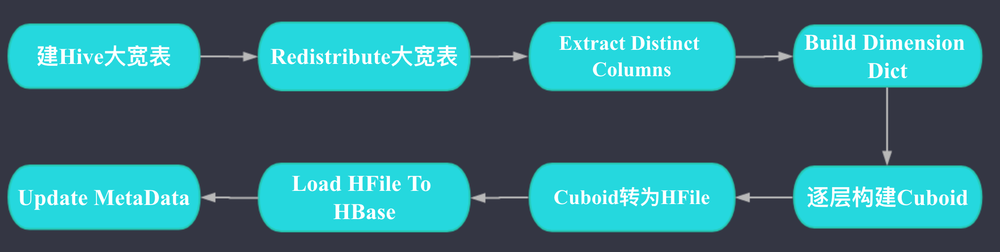

如上图，Kylin数据导入主要是分为建Hive大宽表(这一步会处理Join)；维度列构建字典；逐层构建Cuboid；Cuboid转为HFile；Load HFile To HBase; 元数据更新这几步。

其中Redistribute大宽表这一步的作用是为了将整个表的数据搞均匀，避免后续的步骤中有数据倾斜，Kylin有配置可以跳过这一步。

其中Extract Distinct Columns这一步的作用是获取需要构建字典的维度列的Distinct值。假如一个ID维度列有`1，2，1，2，2，1，1，2`这8行，那么经过这一步后ID列的值就只有1，2两行，做这一步是为了下一步对维度列构建字典时更快速。

### 4.2 Doris数据导入

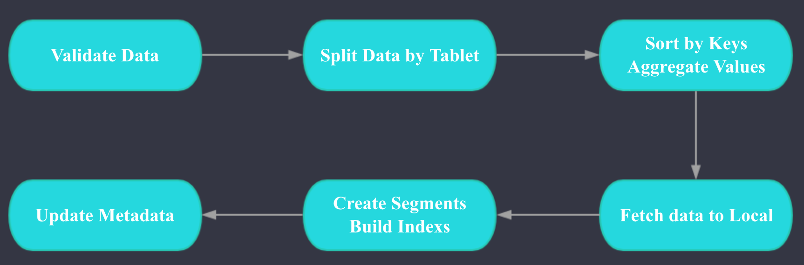

Doris 数据导入的两个核心阶段是ETL和LOADING, ETL阶段主要完成以下工作：

- 数据类型和格式的校验
- 根据Teblet拆分数据
- 根据Rollup表定义，按照Key列进行排序，对Value进行聚合

LOADING阶段主要完成以下工作：

- 每个Tablet对应的BE拉取排序好的数据
- 进行数据的格式转换，生成索引

LOADING完成后会进行元数据的更新。

## 5. 查询

### 5.1 Kylin查询

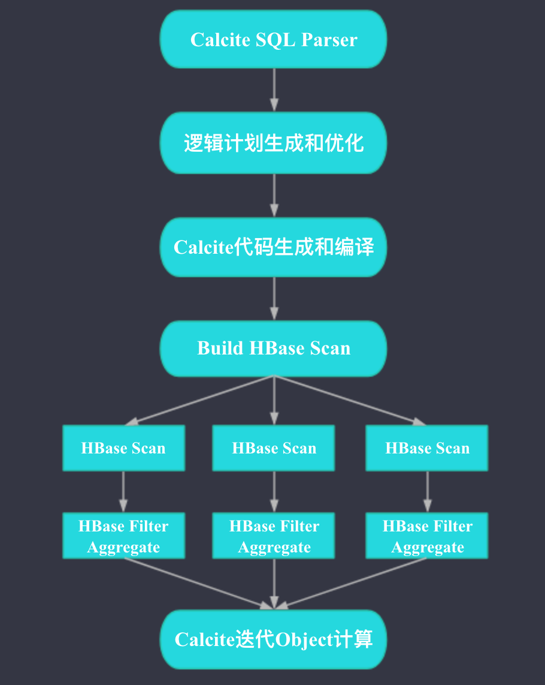

如上图，整个Kylin的查询过程比较简单，是个Scatter-Gather的模型。图中圆形框的内容发生在Kylin QueryServer端，方形框的内容发生在HBase端。Kylin QueryServer端收到SQL后，会先进行SQL的解析，然后生成和优化Plan，再根据Plan生成和编译代码，之后会根据Plan生成HBase的Scan请求，如果可能，HBase端除了Scan之外，还会进行过滤和聚合（基于HBase的Coprocessor实现），Kylin会将HBase端返回的结果进行合并，交给Calcite之前生成好的代码进行计算。

### 5.2 Doris查询

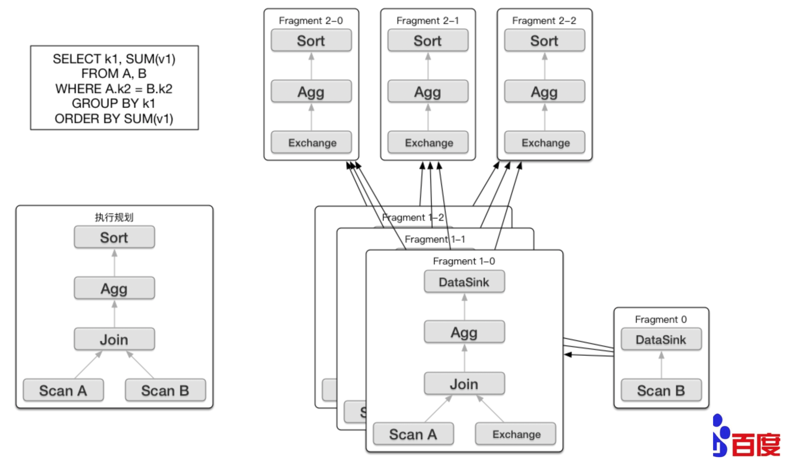

Doris的查询引擎使用的是Impala，是MPP架构。 Doris的FE 主要负责SQL的解析，语法分析，查询计划的生成和优化。查询计划的生成主要分为两步：

1. 生成单节点查询计划 （上图左下角）
2. 将单节点的查询计划分布式化，生成PlanFragment（上图右半部分）

第一步主要包括Plan Tree的生成，谓词下推， Table Partitions pruning，Column projections，Cost-based优化等。

第二步 将单节点的查询计划分布式化，分布式化的目标是**最小化数据移动和最大化本地Scan**。分布式计算基本思想之一：移动计算而不是移动数据。分布式化的方法是增加ExchangeNode，执行计划树会以ExchangeNode为边界拆分为PlanFragment，1个PlanFragment封装了在一台机器上对同一数据集的部分PlanTree。如上图所示：各个Fragment的数据流转和最终的结果发送依赖：**DataSink**。

当FE生成好查询计划树后，BE对应的各种Plan Node（Scan, Join, Union, Aggregation, Sort等）执行自己负责的操作即可。

## 6. 精确去重

### 6.1 Kylin的精确去重

Kylin的精确去重是基于全局字典和RoaringBitmap实现的基于预计算的精确去重。具体可以参考 [Apache Kylin 精确去重和全局字典权威指南](https://blog.bcmeng.com/post/kylin-distinct-count-global-dict.html)

### 6.2 Doris的精确去重

Doris的精确去重是现场精确去重，Doris计算精确去重时会拆分为两步：

1. 按照所有的group by 字段和精确去重的字段进行聚合
2. 按照所有的group by 字段进行聚合

```
SELECT a, COUNT(DISTINCT b, c), MIN(d), COUNT(*) FROM T GROUP BY a
* - 1st phase grouping exprs: a, b, c
* - 1st phase agg exprs: MIN(d), COUNT(*)
* - 2nd phase grouping exprs: a
* - 2nd phase agg exprs: COUNT(*), MIN(<MIN(d) from 1st phase>), SUM(<COUNT(*) from 1st phase>)
```

下面是个简单的等价转换的例子：

```
select count(distinct lo_ordtotalprice) from ssb_sf20.v2_lineorder;

select count(*) from (select count(*) from ssb_sf20.v2_lineorder group by lo_ordtotalprice) a;
```

Doris现场精确去重计算性能和**去重列的基数**、**去重指标个数**、**过滤后的数据大小**成**负相关**；

## 7. 元数据

**Kylin的元数据** ：

Kylin的元数据是利用HBase存储的，可以很好地横向扩展。Kylin每个具体的元数据都是一个Json文件，HBase的Rowkey是文件名，Value是Json文件的内容。Kylin的元数据表设置了IN_MEMORY => 'true' 属性, 元数据表会常驻HBase RegionServer的内存，所以元数据的查询性能很好，一般在几ms到几十ms。

Kylin元数据利用HBase存储的一个问题是，在Kylin可插拔架构下，即使我们实现了另一种存储引擎，我们也必须部署HBase来存储元数据，所以Kylin要真正做到存储引擎的可插拔，就必须实现一个独立的元数据存储。

**Doris的元数据**：

Doris的元数据是基于内存的，这样做的好处是性能很好且不需要额外的系统依赖。 缺点是单机的内存是有限的，扩展能力受限，但是根据Doris开发者的反馈，由于Doris本身的元数据不多，所以元数据本身占用的内存不是很多，目前用大内存的物理机，应该可以支撑数百台机器的OLAP集群。 此外，OLAP系统和HDFS这种分布式存储系统不一样，我们部署多个集群的运维成本和1个集群区别不大。

## 8. 高性能

### 8.1 Kylin 

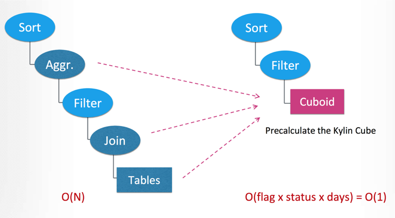

Kylin查询快的核心原因就是预计算，如图(图片出处 [Apache kylin 2.0: from classic olap to real-time data warehouse](https://www.slideshare.net/YangLi43/apache-kylin-20-from-classic-olap-to-realtime-data-warehouse))**，Kylin现场查询时不需要Join，也几乎不需要聚合，主要就是Scan + Filter**。

### Doris 

1. In-Memory Metadata。 Doris的元数据就在内存中，元数据访问速度很快。
2. 聚合模型可以在数据导入时进行预聚合。
3. 和Kylin一样，也支持预计算的RollUp Table。
4. MPP的查询引擎。
5. 向量化执行。相比Kylin中Calcite的代码生成，向量化执行在处理高并发的低延迟查询时性能更好，**Kylin的代码生成本身可能会花费几十ms甚至几百ms**。
6. 列式存储 + 前缀索引。

## 9. 高可用

**Kylin高可用：**

**Kylin JobServer的高可用**： Kylin的JobServer是无状态的，一台JobServer挂掉后，其他JobServer会很快接管正在Running的Job。JobServer的高可用是基于Zookeeper实现的，具体可以参考[Apache Kylin Job 生成和调度详解](https://blog.bcmeng.com/post/kylin-job.html)。

**Kylin QueryServer的高可用**：Kylin的QueryServer也是无状态的，其高可用一般通过Nginx这类的负载均衡组件来实现。

**Kylin Hadoop依赖的高可用**： 要单纯保证Kylin自身组件的高可用并不困难，但是要保证Kylin整体数据导入和查询的高可用是**十分困难的**，因为必须同时保证HBase，Hive，Hive Metastore，Spark，Mapreduce，HDFS，Yarn，Zookeeper，Kerberos这些服务的高可用。

**Doris高可用：**

**Doris FE的高可用**： Doris FE的高可用主要基于BerkeleyDB java version实现，BDB-JE实现了**类Paxos一致性协议算法**。

**Doris BE的高可用：** Doris会保证每个Tablet的多个副本分配到不同的BE上，所以一个BE down掉，不会影响查询的可用性。

## 10. 功能

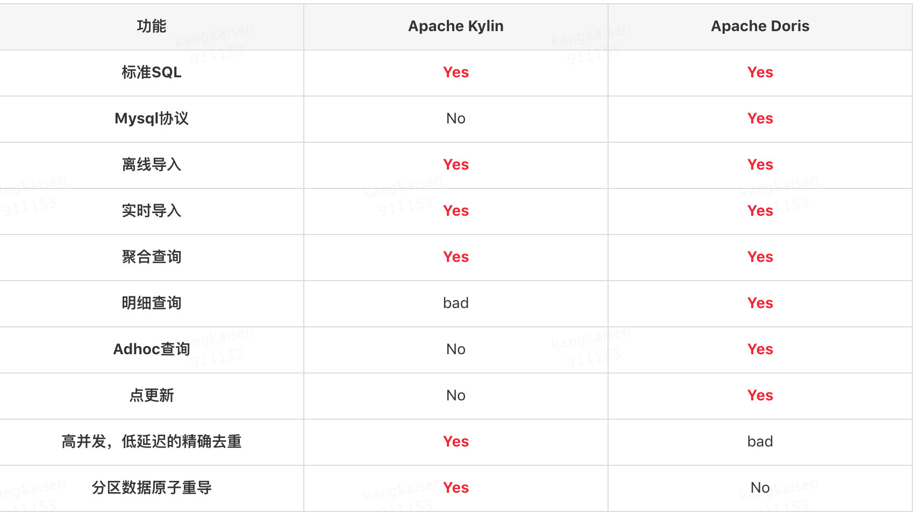

关于Kylin的明细查询，Kylin本身只有聚合模型，但是也可以**通过将所有列作为维度列，只构建Base Cuboid来实现明细查询**， 缺点是效率比较低下。

虽然Doirs理论上可以同时支持高并发，低延迟的OLAP查询和高吞吐的Adhoc查询，但显然这两类查询会相互影响。所以Baidu在实际应用中也是用两个集群分别满足OLAP查询和Adhoc查询需求。