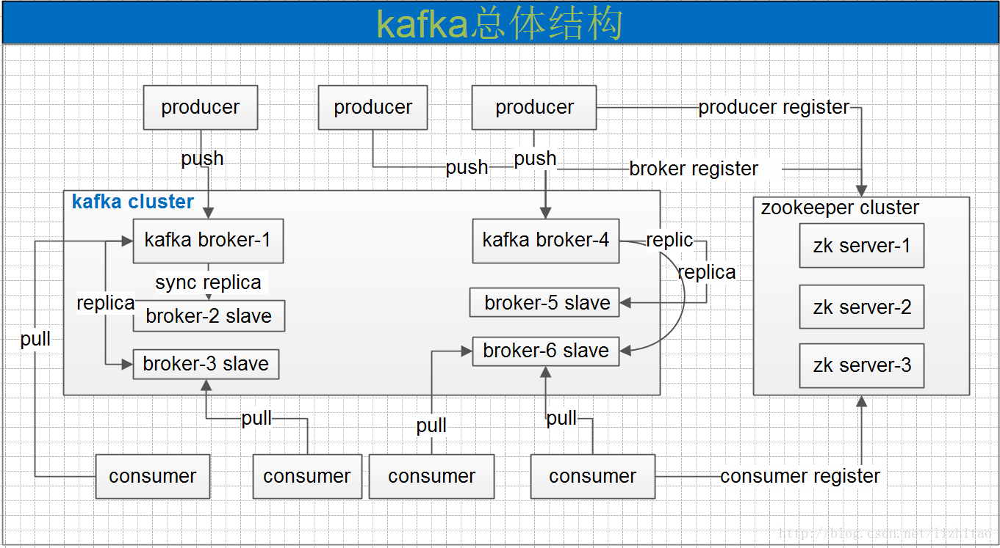

# apache Kafka概要介绍

## 1. 消息队列分类

**点对点**

消息生产者生产消息发送到queue中，然后消息消费者从queue中取出并且消费消息。这里要注意：

- 消息被消费以后，queue中不再有存储，所以消息消费者不可能消费到已经被消费的消息
- Queue支持存在多个消费者，但是对一个消息而言，只会有一个消费者可以消费、

**发布/订阅模式**

消息生产者发布消息到Topic中，同时有多个消息消费者(订阅)消费该消息，点对点方式不同，发布到topic的消息会被所有订阅者消费。

## 2. Apache Kafka简介

### 2.1 总体架构

### 2.2 Kafka名词解释

- producer：消息生产者，向kafka broker发消息的客户端
- consumer：消息消费者，向kafka broker取消息的客户端
- Topic：可以理解为一个消息队列
- Consumer Group：这是Kafka用来实现一个topic消息的广播(发送给所有的consumer)和单播(发给任意一consumer)的手段，一个topic可以有多个CG。topic的消息会复制(不是真的复制，是概念上的)到所有的CG，但每个CG只会把消息发给该CG中的一个consumer。如果要实现广播只要每个consumer有一个独立的CG就可以了。要实现单播只要所有的consumer在同一个CG。用CG还可以将consumer进行自由的分组而不需要多次发送消息到不同的topic。
- Broker ：一台kafka服务器就是一个broker。一个集群由多个broker组成。一个broker可以容纳多个topic。
- Partition：为了实现扩展性，一个非常大的topic可以分布到多个broker(即服务器)上，一个topic可以分为多个partition，每个partition是一个有序的队列。partition中的每条消息都会被分配一个有序的id(offset)，kafka只保证按一个partition中的顺序将消息发给consumer，不保证一个topic的整体(多个partition间)的顺序。
- Offset：Partition消息偏移量或位点，kafka的存储文件都是按照offset.kafka来命名，用offset做名字的好处是方便查找。例如你想找位于2049的位置，只要找到2048.kafka的文件即可。当然the first offset就是00000000000.kafka

### 2.3 Kafka特性

- 通过O(1)的磁盘数据结构提供消息的持久化，这种结构对于即使数以TB的消息存储也能够保持长时间的稳定性能
- 高吞吐量：即使是非常普通的硬件kafka也可以支持每秒数十万的消息
- 支持同步和异步复制两种HA
- Consumer客户端pull，随机读,利用sendfile系统调用，zero-copy ,批量拉数据
- 消费状态保存在客户端，消费状态由Borker管理
- 消息存储顺序写
- 数据迁移、扩容对用户透明
- 支持Hadoop并行数据加载
- 支持online和offline的场景
- 持久化：通过将数据持久化到硬盘以及replication防止数据丢失
- scale out：无需停机即可扩展机器
- 定期删除机制，支持设定partitions的segment file保留时间

**可靠性(一致性)**

Kafka要实现从producer到consumer之间的可靠的消息传送和分发，传统的MQ系统通常都是通过broker和consumer间的确认(ack)机制实现的，并在broker保存消息分发的状态。

即使这样一致性也是很难保证的（参考原文）。kafka的做法是由consumer自己保存状态，也不要任何确认。这样虽然consumer负担更重，但其实更灵活了。

因为不管consumer上任何原因导致需要重新处理消息，都可以再次从broker获得。

**kafak系统扩展性**

kafka使用zookeeper来实现动态的集群扩展，不需要更改客户端(producer和consumer)的配置。broker会在zookeeper注册并保持相关的元数据(topic，partition信息等)更新。

而客户端会在zookeeper上注册相关的watcher。一旦zookeeper发生变化，客户端能及时感知并作出相应调整。这样就保证了添加或去除broker时，各broker间仍能自动实现负载均衡。

**kafka设计目标**

高吞吐量是其核心设计之一。

- 数据磁盘持久化：消息不在内存中cache，直接写入到磁盘，充分利用磁盘的顺序读写性能
- zero-copy：减少IO操作步骤
- 支持数据批量发送和拉取
- 支持数据压缩
- Topic划分为多个partition，提高并行处理能力 

**Producer负载均衡和HA机制**

- producer根据用户指定的算法，将消息发送到指定的partition
- 存在多个partiiton，每个partition有自己的replica，每个replica分布在不同的Broker节点上
- 多个partition需要选取出lead partition，lead partition负责读写，并由zookeeper负责fail over
- 通过zookeeper管理broker与consumer的动态加入与离开

**Consumer的pull机制**

由于Kafka broke会持久化数据，broker没有cahce压力，因此，consumer比较适合采取pull的方式消费数据，具体特别如下：

- 简化kafka设计，降低了难度。
- Consumer根据消费能力自主控制消息拉取速度。
- consumer根据自身情况自主选择消费模式，例如批量，重复消费，从指定partition或位置(offset)开始消费等

**Consumer与topic关系以及机制**

本质上Kafka只支持Topic，每个consumer属于一个consumer group，反过来说，每个group中可以有多个consumer。对于Topic中的一条特定的消息，只会被订阅此Topic的每个group中的一个consumer消费，此消息不会发送给给一个group的多个consumer；即一个group中所有的consumer将会交错的消费整个Topic。

如果所有的consumer都具有相同的group,这种情况和JMS queue模式很像;消息将会在consumers之间负载均衡。

如果所有的consumer都具有不同的group,那这就是"发布-订阅";消息将会广播给所有的消费者。

在kafka中，一个partition中的消息只会被group中的一个consumer消费(同一时刻)；每个group中consumer消息消费互相独立；我们可以认为一个group是一个"订阅"者。

一个Topic中的每个partions，只会被一个"订阅者"中的一个consumer消费，不过一个consumer可以同时消费多个partitions中的消息。

