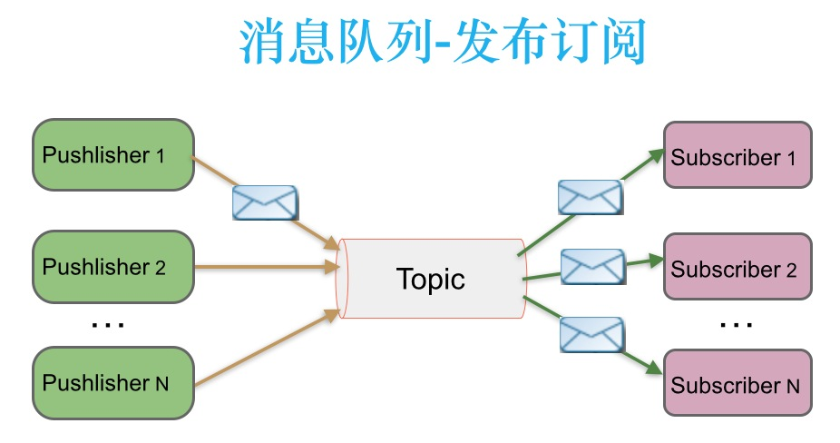

# 消息队列中点对点与发布订阅

## 1. 背景知识

JMS一个在 Java标准化组织（JCP）内开发的标准（代号JSR 914）。2001年6月25日，Java消息服务发布JMS 1.0.2b，2002年3月18日Java消息服务发布 1.1。

Java消息服务（Java Message Service，JMS）应用程序接口是一个Java平台中关于面向消息中间件(MOM)的API，用于在两个应用程序之间，或分布式系统中发送消息，进行异步通信。

**点对点与发布订阅**最初是由JMS定义的。这两种模式主要区别或解决的问题就是发送到队列的消息能否重复消费(多订阅)。

## 2. JMS中定义

JMS规范目前支持两种消息模型：点对点(point to point， queue)和发布/订阅(publish/subscribe，topic)。

**点对点**

消息生产者生产消息发送到queue中，然后消息消费者从queue中取出并且消费消息。这里要注意：消息被消费以后，queue中不再有存储，所以消息消费者不可能消费到已经被消费的消息。Queue支持存在多个消费者，但是对一个消息而言，只会有一个消费者可以消费。

**发布/订阅**

消息生产者(发布)将消息发布到topic中，同时有多个消息消费者(订阅)消费该消息。和点对点方式不同，发布到topic的消息会被所有订阅者消费。

## 3. 二者分析与区别

### 3.1 点对点模式

生产者发送一条消息到queue，只有一个消费者能收到。

### 3.2  发布订阅模式

发布者发送到topic的消息，只有订阅了topic的订阅者才会收到消息。

### 3.3 总结

**点对点模式**

queue实现了负载均衡，一个消息只能被一个消费者接受，当没有消费者可用时，这个消息会被保存直到有 一个可用的消费者，一个queue可以有很多消费者，他们之间实现了负载均衡， 所以Queue实现了一个可靠的负载均衡。

**发布订阅模式**

topic实现了发布和订阅，当你发布一个消息，所有订阅这个topic的服务都能得到这个消息，所以从1到N个订阅者都能得到一个消息的拷贝，只有在消息代理收到消息时有一个有效订阅时的订阅者才能得到这个消息的拷贝。

### 3.4 疑问

发布订阅模式下，是否能实现订阅者负载均衡消费呢？当发布者消息量很大时，显然单个订阅者的处理能力是不足的。实际上现实场景中是**多个订阅者节点组成一个订阅组**，负载均衡消费topic消息即分组订阅，这样订阅者很容易实现消费能力线性扩展。

## 4. 流行消息队列的消息模型比较

传统企业型消息队列ActiveMQ遵循了JMS规范，实现了点对点和发布订阅模型，但其他流行的消息队列RabbitMQ、Kafka并没有遵循老态龙钟的JMS规范，是通过什么方式实现消费负载均衡、多订阅呢？

### 4.1 RabbitMQ

RabbitMQ实现了AQMP协议，AQMP协议定义了消息路由规则和方式。生产端通过路由规则发送消息到不同queue，消费端根据queue名称消费消息。此外RabbitMQ是向消费端**推送消息**，订阅关系和消费状态保存在服务端。 

生产端发送一条消息通过路由投递到Queue，只有一个消费者能消费到。

当RabbitMQ需要支持多订阅时，发布者发送的消息通过路由同时写到多个Queue，不同订阅组消费此消息。

RabbitMQ既支持内存队列也支持持久化队列，**消费端为推模型**，消费状态和订阅关系由服务端负责维护，消息消费完后立即删除，不保留历史消息。所以支持多订阅时，**消息会多个拷贝**。

### 4.2 Kafka

Kafka只支持消息持久化，消费端为拉模型，消费状态和订阅关系由客户端端负责维护，消息消费完后不会立即删除，会保留历史消息。因此支持多订阅时，消息只会存储一份就可以。

同一个订阅组会消费topic所有消息，每条消息只会被同一个订阅组的一个消费节点消费，同一个订阅组内不同消费节点会消费不同消息

