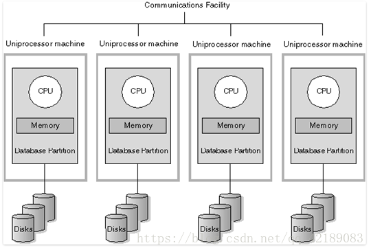
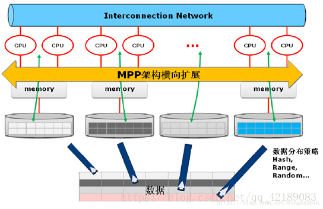

# MPP(大规模并行处理)简介

## 1. MPP概念

MPP (Massively Parallel Processing)，即大规模并行处理，在数据库非共享集群中，每个节点都有独立的磁盘存储系统和内存系统，业务数据根据数据库模型和应用特点划分到各个节点上，每台数据节点通过专用网络或者商业通用网络互相连接，彼此协同计算，作为整体提供数据库服务。非共享数据库集群有完全的可伸缩性、高可用、高性能、优秀的性价比、资源共享等优势。

简单来说，MPP是将任务并行的分散到多个服务器和节点上，在每个节点上计算完成后，将各自部分的结果汇总在一起得到最终的结果(与Hadoop相似)。

## 2. **MPP(大规模并行处理)架构**

## 3. **MPP架构特征**

- 任务并行执行
- 数据分布式存储(本地化)
- 分布式计算
- 私有资源
- 横向扩展
- Shared Nothing架构

## 4. MPP服务器架构

它由多个SMP服务器通过一定的节点互联网络进行连接，协同工作，完成相同的任务，从用户的角度来看是一个服务器系统。其基本特征是由多个SMP服务器(每个SMP服务器称节点)通过节点互联网络连接而成，每个节点只访问自己的本地资源(内存、存储等)，是一种完全无共享(Share Nothing)结构，因而扩展能力最好，理论上其扩展无限制。

## 5. MPPDB

MPPDB是一款 Shared Nothing架构的分布式并行结构化数据库集群，具备高性能、高可用、高扩展特性，可以为超大规模数据管理提供高性价比的通用计算平台，并广泛地用于支撑各类数据仓库系统、BI系统和决策支持系统。

## 6. MPPDB架构

MPP采用完全并行的MPP + Shared Nothing的分布式扁平架构，这种架构中的每一个节点(node)都是独立的、自给的、节点之间对等，而且整个系统中不存在单点瓶颈，具有非常强的扩展性。

## 7. MPPDB特征

MPP 具备以下技术特征：

- 低硬件成本：完全使用 x86 架构的 PC Server，不需要昂贵的 Unix 服务器和磁盘阵列；
- 集群架构与部署：完全并行的 MPP + Shared Nothing 的分布式架构，采用 Non-Master 部署，节点对等的扁平结构；
- 海量数据分布压缩存储：可处理 PB 级别以上的结构化数据，采用 hash分布、random 存储策略进行数据存储；同时采用先进的压缩算法，减少存储数据所需的空间，可以将所用空间减少 1~20 倍，并相应地提高 I/O 性能；例如：Doris使用Hadoop ORC列存储压缩数据。
- 数据加载高效性：基于策略的数据加载模式，集群整体加载速度可达2TB/h
- 高扩展、高可靠：支持集群节点的扩容和缩容，支持全量、增量的备份/恢复
- 高可用、易维护：数据通过副本提供冗余保护，自动故障探测和管理，自动同步元数据和业务数据。提供图形化工具，以简化管理员对数据库的管理工作；
- 高并发：读写不互斥，支持数据的边加载边查询，单个节点并发能力大于 300 用户；
- 行列混合存储：提供行列混合存储方案，从而提高了列存数据库特殊查询场景的查询响应耗时；
- 标准化：支持SQL92 标准，支持 C API、ODBC、JDBC、ADO.NET 等接口规范。

## 8. **MPPDB、Hadoop与传统数据库技术对比与适用场景**

MPPDB与Hadoop都是将运算分布到节点中独立运算后进行结果合并(分布式计算)，但由于依据的理论和采用的技术路线不同而有各自的优缺点和适用范围。两种技术以及传统数据库技术的对比如下：

| 特征               | Hadoop                         | MPPDB              | 传统数据仓库       |
| ------------------ | ------------------------------ | ------------------ | ------------------ |
| 平台开放性         | 高                             | 低                 | 低                 |
| 运维负责度         | 高                             | 中                 | 中                 |
| 扩展能力           | 高                             | 中                 | 低                 |
| 拥有成本           | 低                             | 中                 | 高                 |
| 系统和数据管理成本 | 高                             | 中                 | 中                 |
| 应用开发维护成本   | 高                             | 中                 | 中                 |
| SQL支持            | 中(低)                         | 高                 | 高                 |
| 数据规模           | PB级别                         | 部分PB             | TB级别             |
| 计算性能           | 对非关系型操作效率高           | 对关系型操作效率高 | 对关系型操作效率中 |
| 数据结构           | 结构化、半结构化和非机构化数据 | 结构化数据         | 结构化数据         |

- Hadoop在处理非结构化和半结构化数据上具备优势，尤其适合海量数据批处理等应用要求
- MPP适合替代现有关系数据机构下的大数据处理，具有较高的效率

MPP适合多维度数据自助分析、数据集市等；Hadoop适合海量数据存储查询、批量数据ETL、非机构化数据分析(日志分析、文本分析)等。