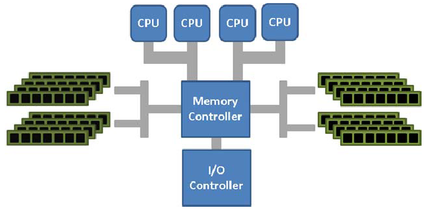

# 服务器体系(SMP, NUMA, MPP)与共享存储器架构(UMA和NUMA)

从系统架构来看，目前的商用服务器大体可以分为三类，即对称多处理器结构(SMP：Symmetric Multi-Processor)，非一致性内存架构(NUMA：Non-uniform Memory Architecture)，以及海量并行处理结构(MPP：Massive Parallel Processing)。

共享存储型多处理机有两种模型：均匀存储器存取(Uniform-Memory-Access，简称UMA)模型；非均匀存储器存取(Nonuniform-Memory-Access，简称NUMA)模型。

## 1. SMP(Symmetric Multi-Processor)

所谓对称多处理器结构，是指服务器中多个CPU对称工作，无主次或从属关系。各CPU共享相同的物理内存，每个 CPU访问内存中的任何地址所需时间是相同的，因此SMP也被称为一致存储器访问结构(UMA：Uniform Memory Access)。对SMP服务器进行扩展的方式包括增加内存、使用更快的CPU、增加CPU、扩充I/O(槽口数与总线数)以及添加更多的外部设备(通常是磁盘存储)。

SMP服务器的主要特征是共享，系统中所有资源(CPU、内存、I/O等)都是共享的。也正是由于这种特征，导致了SMP服务器的主要问题，那就是它的扩展能力非常有限。对于SMP服务器而言，每一个共享的环节都可能造成SMP服务器扩展时的瓶颈，而最受限制的则是内存。由于每个CPU必须通过相同的内存总线访问相同的内存资源，因此随着CPU数量的增加，内存访问冲突将迅速增加，最终会造成CPU资源的浪费，使 CPU性能的有效性大大降低。实验证明，SMP服务器CPU利用率最好的情况是2至4个CPU。 

## 2.非一致性内存架构(NUMA)

NUMA系统拥有多条内存总线，于是将几个处理器通过内存总线与一块内存相连构成一个组，这样整个庞大的系统就可以被分为若干个组，这个组的概念在NUMA系统中被称为节点(node)。处于该节点中的内存被称为本地内存(local memory)，处于其他节点中的内存对于该组而言被称为外部内存(foreign memory)。而节点又可以分为三类，即本地节点(local node)，邻居节点(neighbour node)和远端节点(remote node).

本地节点：对于某个节点中的所有CPU，此节点称为本地节点；

邻居节点：与本地节点相邻的节点称为邻居节点；

远端节点：非本地节点或邻居节点的节点，称为远端节点。

超立方体可以作为一种有效的拓扑来描述NUMA系统，它将系统中的节点数限制在2^C内，C是每个节点拥有的邻居节点数，如下图所示：

