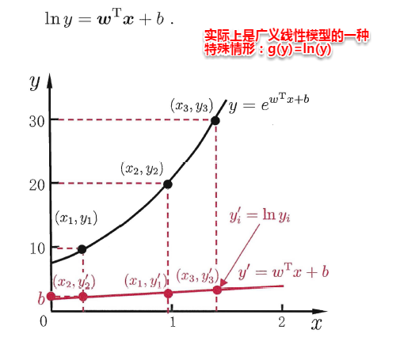
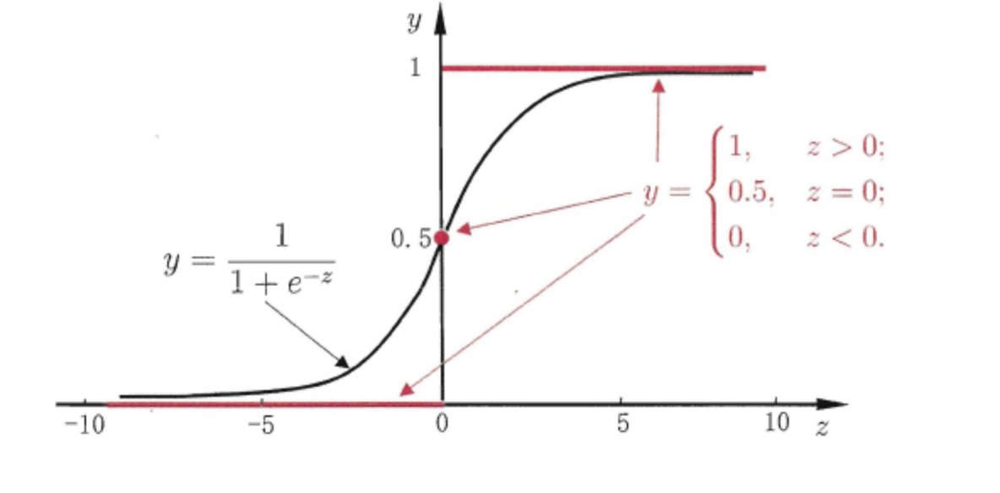
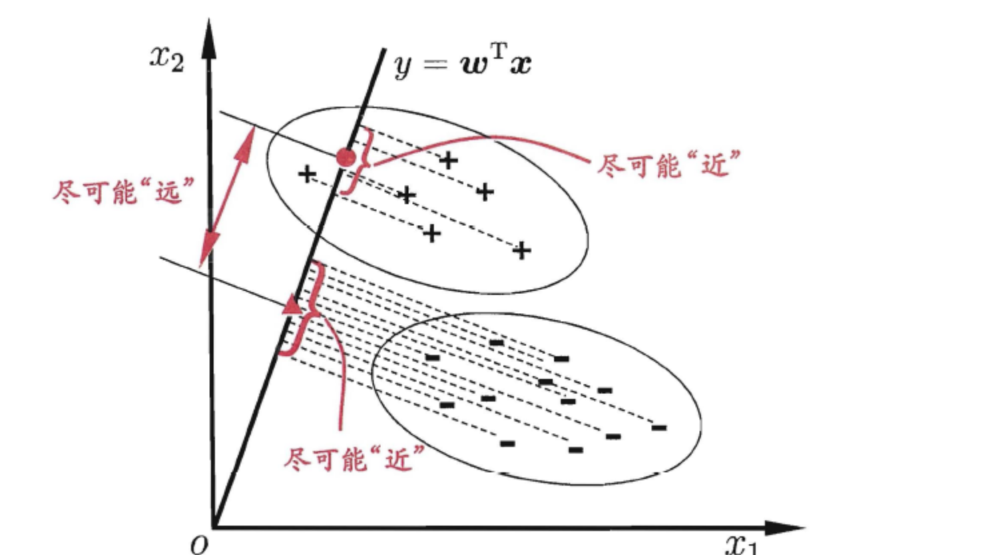
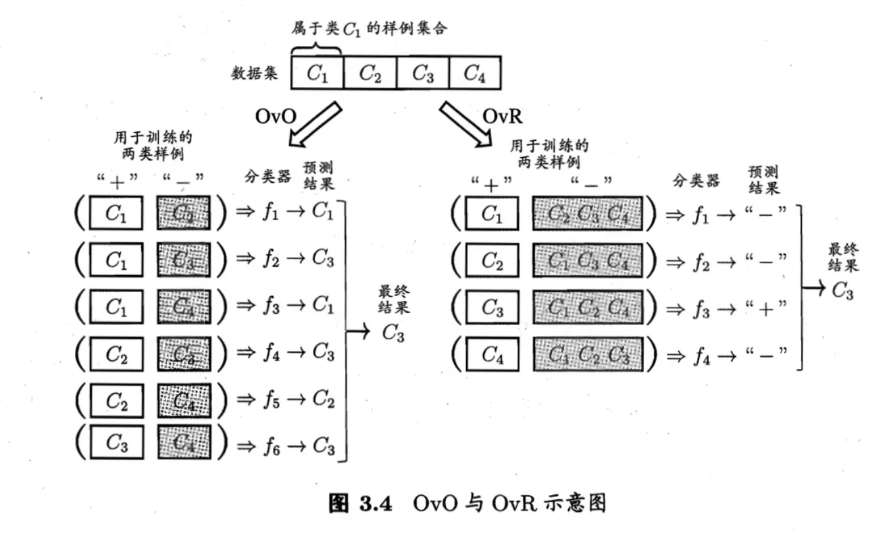
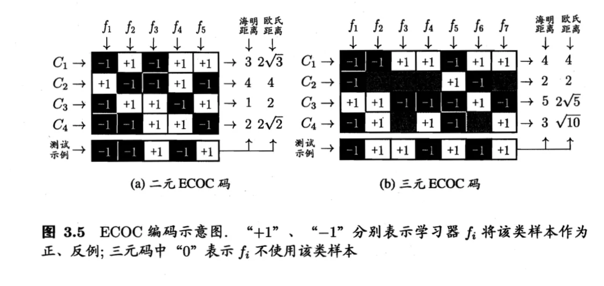

[TOC]

笔记的前一部分主要是对机器学习预备知识的概括，包括机器学习的定义/术语、学习器性能的评估/度量以及比较，本篇之后将主要对具体的学习算法进行理解总结，本篇则主要是第3章的内容--线性模型。

# 3.1 基本形式

给定由$d$个属性描述的实例$x=\{x_1,x_2,\cdots, x_d\}$，$x_i$是$x$在第$i$个属性上的取值，线性模型(linear model)试图学得一个通过属性的线形组合来进行**预测**的函数：
$$
f(x) = w_1x_1+w_2x_2+ \dots +w_ix_i \tag{3.1}
$$
将权重$w$和属性$x$使用向量的方式表示为：
$$
f(x) = W^TX+b \tag{3.2}
$$
线性模型的形式简单，易于建模，许多非线形模型可以在线性模型的基础上引入层级结构和高纬映射而得，此外权重$w$直观表达了预测过程中，各个属性的重要程度，有很好的可解释性。

# 3.2 线性回归

给定数据集$D=\{(x_1, y_1),(x_2, y_2),\dots,(x_m,y_m)\}$，其中$x_i=\{x_{i1},x_{i2},\dots ,x_{id}\},y_i \in \mathbb{R}$，线性回归试图学得一个模型尽可能准确地预测输出标记，即：
$$
f(x_i)=w_ix_i+b,使得f(x_i)\simeq y_i \tag{3.3}
$$

## 3.2.1 离散属性连续化

**注意：**对于属性中的离散型变量，通过将无序离散属性和有序离散属性连续化来处理。

- 若属性值之间存在“序关系”，则可以将其转化为连续值，例如：身高属性分为“高”“中等”“矮”，可转化为数值：{1， 0.5， 0}。
- 若属性值之间不存在“序关系”，则通常将其转化为向量的形式，例如：性别属性分为“男”“女”，可转化为二维向量：{（1，0），（0，1）}。

## 3.2.2 最小二乘法

那么如何确定模型参数$w$和$b$呢？均方差时回归任务中常用的性能度量，因而通过将均方误差最小化，求得模型参数：
$$
\begin{aligned}
(w^*,b^*) &=\underset{(w,b)}{argmin}\sum_{i=1}^{m}(f(x_i)-y_i)^2 \\
&=\underset{(w,b)}{argmin}\sum_{i=1}^{m}(wx_i+b-y_i)^2 \\
\end{aligned} \tag{3.4}
$$
均方差对应欧几里得距离，即欧氏距离，基于均方误差最小化进行模型求解的方法称为**最小二乘法**，线性回归中，最小二乘法 试图求得一条直线，使得训练集空间中的样本点到直线的欧式距离最小。

通过对损失函数分别求参数 $w$ 和 $b$ 的偏导：
$$
\frac{\partial E_{w,b}}{\partial w} = 2(w\sum_{i=1}^{m}x_i^2-\sum_{i=1}^{m}(y_i-b)x_i) \tag{3.5}
$$

$$
\frac{\partial E_{w,b}}{\partial b}=2(mb-\sum_{i=1}^{m}(y_i-wx_i)) \tag{3.6}
$$

令偏导数等于0，可以得到这两个参数的**闭式（closed-form）解**（也即**解析解**）：
$$
w = \frac{\sum_{i=1}^m y_i(x_i - \bar{x})}{\sum_{i=1}^m x_i^2 - \frac{1}{m}(\sum_{i=1}^m x_i)^2} \tag{3.7}
$$

$$
b = \frac{1}{m} \sum_{i=1}^m (y_i-wx_i) \tag{3.8}
$$

其中$\overline{x}=\frac{1}{m}\sum_{i=1}^{m}x_i$为$x$的均值。

**[推导]**：令式（3.5）等于0： 
$$
0 = w\sum_{i=1}^{m}x_i^2-\sum_{i=1}^{m}(y_i-b)x_i \tag{3.7.1}\\

 w\sum_{i=1}^{m}x_i^2 = \sum_{i=1}^{m}y_ix_i-\sum_{i=1}^{m}bx_i 
$$
 由于令式（3.6）等于0可得 ，
$$
b=\cfrac{1}{m}\sum_{i=1}^{m}(y_i-wx_i) \tag{3.7.2}
$$
又$\cfrac{1}{m}\sum_{i=1}^{m}y_i=\bar{y}$，$ \cfrac{1}{m}\sum_{i=1}^{m}x_i=\bar{x} $，则$ b=\bar{y}-w\bar{x} $，代入上式可得：
$$
 \begin{aligned} 
 w\sum_{i=1}^{m}x_i^2 & = \sum_{i=1}^{m}y_ix_i-\sum_{i=1}^{m}(\bar{y}-w\bar{x})x_i \\
 w\sum_{i=1}^{m}x_i^2 & = \sum_{i=1}^{m}y_ix_i-\bar{y}\sum_{i=1}^{m}x_i+w\bar{x}\sum_{i=1}^{m}x_i \\ w(\sum_{i=1}^{m}x_i^2-\bar{x}\sum_{i=1}^{m}x_i) 
 & = \sum_{i=1}^{m}y_ix_i-\bar{y}\sum_{i=1}^{m}x_i \\ 
 w & = \cfrac{\sum_{i=1}^{m}y_ix_i-\bar{y}\sum_{i=1}^{m}x_i}{\sum_{i=1}^{m}x_i^2-\bar{x}\sum_{i=1}^{m}x_i} \end{aligned} \tag{3.7.3}
$$
 又
$$
 \bar{y}\sum_{i=1}^{m}x_i=\cfrac{1}{m}\sum_{i=1}^{m}y_i\sum_{i=1}^{m}x_i=\bar{x}\sum_{i=1}^{m}y_i \\

\bar{x}\sum_{i=1}^{m}x_i=\cfrac{1}{m}\sum_{i=1}^{m}x_i\sum_{i=1}^{m}x_i=\cfrac{1}{m}(\sum_{i=1}^{m}x_i)^2 \tag{3.7.4}
$$
代入上式即可得式（3.7）： 
$$
w=\cfrac{\sum_{i=1}^{m}y_i(x_i-\bar{x})}{\sum_{i=1}^{m}x_i^2-\cfrac{1}{m}(\sum_{i=1}^{m}x_i)^2} \tag{3.7.5}
$$
【注】：式（3.7）还可以进一步化简为能用向量表达的形式，将$ \cfrac{1}{m}(\sum_{i=1}^{m}x_i)^2=\bar{x}\sum_{i=1}^{m}x_i $代入分母可得：
$$
\begin{aligned}
w & = \cfrac{\sum_{i=1}^{m}y_i(x_i-\bar{x})}{\sum_{i=1}^{m}x_i^2-\bar{x}\sum_{i=1}^{m}x_i} \\ & = \cfrac{\sum_{i=1}^{m}(y_ix_i-y_i\bar{x})}{\sum_{i=1}^{m}(x_i^2-x_i\bar{x})} \end{aligned} \tag{3.7.6}
$$
 又因为
$$
\bar{y}\sum_{i=1}^{m}x_i=\bar{x}\sum_{i=1}^{m}y_i=\sum_{i=1}^{m}\bar{y}x_i=\sum_{i=1}^{m}\bar{x}y_i=m\bar{x}\bar{y}=\sum_{i=1}^{m}\bar{x}\bar{y} \\

\sum_{i=1}^{m}x_i\bar{x}=\bar{x}\sum_{i=1}^{m}x_i=\bar{x}\cdot m \cdot\frac{1}{m}\cdot\sum_{i=1}^{m}x_i=m\bar{x}^2=\sum_{i=1}^{m}\bar{x}^2 \tag{3.7.7} 
$$
则上式可化为： 
$$
\begin{aligned} w & = \cfrac{\sum_{i=1}^{m}(y_ix_i-y_i\bar{x}-x_i\bar{y}+\bar{x}\bar{y})}{\sum_{i=1}^{m}(x_i^2-x_i\bar{x}-x_i\bar{x}+\bar{x}^2)} \\ & = \cfrac{\sum_{i=1}^{m}(x_i-\bar{x})(y_i-\bar{y})}{\sum_{i=1}^{m}(x_i-\bar{x})^2} \end{aligned} \tag{3.7.8}
$$
 若令$ \boldsymbol{x}=(x_1,x_2,...,x_m)^T $，$ \boldsymbol{x}*{d}=(x_1-\bar{x},x_2-\bar{x},...,x_m-\bar{x})^T $为去均值后的$ \boldsymbol{x} $，$ \boldsymbol{y}=(y_1,y_2,...,y_m)^T $，$ \boldsymbol{y}*{d}=(y_1-\bar{y},y_2-\bar{y},...,y_m-\bar{y})^T $为去均值后的$ \boldsymbol{y} $，其中$ \boldsymbol{x} $、$ \boldsymbol{x}*{d} $、$ \boldsymbol{y} $、$ \boldsymbol{y}*{d} $均为m行1列的列向量，代入上式可得： 
$$
w=\cfrac{\boldsymbol{x}*{d}^T\boldsymbol{y}*{d}}{\boldsymbol{x}*d^T\boldsymbol{x}*{d}} \tag{3.7.9}
$$

## 3.2.3 多元线性回归

前面是直线拟合，样例只有一个属性。对于样例包含多个属性的情况，我们就要用到**多元线性回归（multivariate linear regression）**（又称作多变量线性回归）了。

为了便于计算，将$w$和$b$组合，令 $\mathbf{\hat{w}} = (\mathbf{w};b)$。把数据集表示为 $m \times (d+1)$ 大小的矩阵，每一行对应一个样例，前 $d$ 列是样例的 $d$ 个属性，**最后一列恒置为1**，即为：

$$
X=\left[
\begin{matrix}
 x_{11}      & x_{12}
& \cdots & x_{1d}&1      \\
  x_{21}      & x_{22}      & \cdots & x_{2d}&1     \\
 \vdots & \vdots & \ddots & \vdots \\
  x_{m1}      & x_{m2}      & \cdots & x_{md}&1    \\
\end{matrix}
\right]=\left[
\begin{matrix}
 x_{1}^T      &1      \\
  x_{2}^T  &1     \\
 \vdots & \vdots \\
  x_{m}^T  &1    \\
\end{matrix}
\right]
\tag{3.9}
$$
此时的损失函数如下：
$$
E_{\mathbf{\hat{w}}} = (\mathbf{y} - X\mathbf{\hat{w}})^T (\mathbf{y} - X\mathbf{\hat{w}}) \tag{3.10}
$$
同样使用最小二乘法进行参数估计，首先对 $\mathbf{\hat{w}}$ 求导：
$$
\frac{\partial E_{\mathbf{\hat{w}}}}{\partial \mathbf{\hat{w}}} = 2 X^T(X\mathbf{\hat{w}} - \mathbf{y}) \tag{3.11}
$$
令该式值为0可得到 $\mathbf{\hat{w}}$ 的闭式解：
$$
\mathbf{\hat{w}}^* = (X^TX)^{-1}X^T\mathbf{y} \tag{3.12}
$$
**[推导]**：将
$$
 E_{\hat{\boldsymbol w}}=(\boldsymbol{y}-\mathbf{X}\hat{\boldsymbol w})^T(\boldsymbol{y}-\mathbf{X}\hat{\boldsymbol w})  \tag{3.12.1}
$$
展开可得： 
$$
 E_{\hat{\boldsymbol w}}= \boldsymbol{y}^T\boldsymbol{y}-\boldsymbol{y}^T\mathbf{X}\hat{\boldsymbol w}-\hat{\boldsymbol w}^T\mathbf{X}^T\boldsymbol{y}+\hat{\boldsymbol w}^T\mathbf{X}^T\mathbf{X}\hat{\boldsymbol w}  \tag{3.12.2}
$$
 对$ \hat{\boldsymbol w} $求导可得： 
$$
 \cfrac{\partial E_{\hat{\boldsymbol w}}}{\partial \hat{\boldsymbol w}}= \cfrac{\partial \boldsymbol{y}^T\boldsymbol{y}}{\partial \hat{\boldsymbol w}}-\cfrac{\partial \boldsymbol{y}^T\mathbf{X}\hat{\boldsymbol w}}{\partial \hat{\boldsymbol w}}-\cfrac{\partial \hat{\boldsymbol w}^T\mathbf{X}^T\boldsymbol{y}}{\partial \hat{\boldsymbol w}}+\cfrac{\partial \hat{\boldsymbol w}^T\mathbf{X}^T\mathbf{X}\hat{\boldsymbol w}}{\partial \hat{\boldsymbol w}}  \tag{3.12.3}
$$
 由向量的求导公式可得： 
$$
 \cfrac{\partial E_{\hat{\boldsymbol w}}}{\partial \hat{\boldsymbol w}}= 0-\mathbf{X}^T\boldsymbol{y}-\mathbf{X}^T\boldsymbol{y}+(\mathbf{X}^T\mathbf{X}+\mathbf{X}^T\mathbf{X})\hat{\boldsymbol w} \tag{3.12.4}
$$

$$
\cfrac{\partial E_{\hat{\boldsymbol w}}}{\partial \hat{\boldsymbol w}}=2\mathbf{}^T(\mathbf{X}\hat{\boldsymbol w}-\boldsymbol{y}) \tag{3.12.5}
$$
这就要求 $X^TX$ 必须是可逆矩阵，也即必须是**满秩矩阵（full-rank matrix）**，这是线性代数方面的知识，书中并未展开讨论。但是！**现实任务中 $X^TX$ 往往不是满秩的**，很多时候 $X$ 的列数很多，甚至超出行数（例如推荐系统，商品数是远远超出用户数的），此时 $X^TX$ 显然不满秩，会解出多个 $\mathbf{\hat{w}}$。这些解都能使得均方误差最小化，这时就需要由学习算法的**归纳偏好**决定了，常见的做法是引入**正则化（regularization）**项。

## 3.2.3 广义线性模型

有时像上面这种原始的线性回归可能并不能满足需求，例如：y值并不是线性变化，而是在指数尺度上变化。这时我们可以采用线性模型来逼近y的衍生物，**对数线性回归（log-linear regression）**，此时模型预测值对应的是**实值标记在指数尺度上的变化**：
$$
\ln y = \mathbf{w^Tx} + b \tag{3.13}
$$

​															**图3.1 对数线性回归示意图**

更一般地，考虑所有y的衍生物的情形，除了直接让模型预测值逼近实值标记 $y$，我们还可以让它逼近 $y$ 的衍生物，这就是**广义线性模型（generalized linear model）**的思想，也即：
$$
y = g^{-1}(\mathbf{w^Tx} + b) \tag{3.14}
$$
其中 $g(\cdot)$ 称为**联系函数（link function）**，要求单调可微。使用广义线性模型我们可以实现强大的**非线性函数映射**功能。

# 3.3  对数几率回归

上一节讨论了如何使用线性模型和最小二乘法进行回归预测，但是如何使用线性模型进行**分类预测**？答案就在式(3.14)的广义线性回归模型中，寻找一个单调可微的联系函数，将分类任务的真实标记$y$与线性模型的预测值联系起来。

先从最简单的二分类任务入手，其输出标记为$y\in\{1,-1\}$，因此需要将线性模型的预测值$y=w^Tx+b$映射为$0/1$值，最理想的**单位跃迁函数(unit-step funcation)**：
$$
x= \begin{cases} 
0, & x <0 \\ 
0.5, & x=0 \\ 
1, & x>0
\end{cases} \tag{3.15}
$$
但是单位阶跃函数不连续，所以不能直接用作联系函数。这时思路转换为**如何近似单位阶跃函数**呢？**对数几率函数（logistic function）**正是我们所需要的（注意这里的 $y$ 依然是实值），对数几率引入了一个对数几率函数（logistic function）,将预测值投影到0-1之间，从而将线性回归问题转化为二分类问题。
$$
y = \frac{1}{1+e^{-z}} \tag{3.16}
$$

​													**图3.2 单位跃迁函数与对数几率函数**

如图3.2所示，对数几率函数式一种**sigmoid**函数（即形似S的函数，对数函数式sigmoid函数的典型代表），将z值转换为$0-1$的值。将它作为 $g^-(\cdot)$ 代入广义线性模型可得：
$$
y = \frac{1}{1+ e^{-(\mathbf{w^Tx} + b)}} \tag{3.17}
$$
类似于式(3.13)，式(3.17)可变化为：
$$
\ln{\frac{y}{1-y}} = \mathbf{w^Tx} + b \tag{3.18}
$$
**[推导]**：
$$
y = \frac{1}{1+ e^{-(\mathbf{w^Tx} + b)}} \\
\ln{y} = ln{\frac{1}{1+ e^{-(\mathbf{w^Tx} + b)}}}\\
\ln{y} = \ln{1}-\ln{(1+ e^{-(\mathbf{w^Tx} + b)})} \\
\ln{(1+ e^{-(\mathbf{w^Tx} + b)})} = \ln{\frac{1}{y}}

\tag{3.18.1}
$$
其中， $y$ 理解为该样本是正例的概率，把 $1-y$ 理解为该样本是反例的概率，两者的比值称作**几率（odds）**。而几率表示的就是**该样本作为正例的相对可能性**
$$
\frac{y}{1-y} \tag{3.19}
$$
若几率大于1，则表明该样本更可能是正例。几率的对数就得到**对数几率（log odds，也称为logit）**。几率大于1时，对数几率是正数。
$$
\ln{\frac{y}{1-y}} \tag{3.20}
$$
由此可以看出，式(3.17)实际是用线性回归模型的预测去逼近真实标记的对数几率，因此称为对数几率回归(logistic Regression)。它有几个优点：

1. 直接对分类的概率建模，无需实现假设数据分布，从而避免了假设分布不准确带来的问题；
2. 不仅可预测出类别，还能得到该预测的概率，这对一些利用概率辅助决策的任务很有用；
3. 对数几率函数是任意阶可导的凸函数，有许多数值优化算法都可以求出最优解(凸函数优化)。

## 3.3.1 极大似然法

下面我们来看如何计算式(3.7)中的$w$和$b$，将(3.7)中的$y$视为类后弦概率估计：$p(c=1|\mathbf{x})$ 和 $p(c=0|\mathbf{x})$ 分别代表 $y$ 和 $1-y$。注：书中写的是 $y=1$ 和 $y=0$，这里为了和前面的 $y$ 区别开来，我用了 $c$ 来代表标记）。简单变换一下公式，可以得到：
$$
\ln{\frac{p(c=1|\mathbf{x})}{p(c=0|\mathbf{x})}}=w^Tx+b \tag{3.21}
$$

$$
p(c=1|\mathbf{x}) = \frac{e^{\mathbf{w^Tx} + b}}{1+e^{\mathbf{w^Tx} + b}}\tag{3.22}
$$

$$
p(c=0|\mathbf{x}) = \frac{1}{1+e^{\mathbf{w^Tx} + b}} \tag{3.23}
$$

**[推导]**：
$$
p(c=1|\mathbf{x}) +p(c=0|\mathbf{x}) = 1 \\
\frac{p(c=1|\mathbf{x})}{1-p(c=1|\mathbf{x})}=e^{w^Tx+b} \\
p(c=1|\mathbf{x})(1+e^{w^Tx+b}) = e^{w^Tx+b} \\
p(c=1|\mathbf{x}) = \frac{e^{w^Tx+b}}{(1+e^{w^Tx+b})} \tag{3.22.1}
$$
我们可以通过**极大似然法(max likelihood method)**来估计$w$和$b$，对于给定数据集，对数回归模型最大化**对数似然函数**（此时变为所有样本出现真实值概率之和最大）：
$$
\ell(\mathbf{w},b) = \sum_{i=1}^m \ln p(c_i | \mathbf{x_i;w};b)\ = \sum_{i=1}^m \ln (c_ip_1(\hat{\mathbf{x_i}};\beta) + (1-c_i)p_0(\hat{\mathbf{x_i}};\beta)) \tag{3.24}
$$
由于预测概率都是小于1的，如果直接对所有样本的预测概率求积，所得的数会非常非常小，当样例数较多时，会超出精度限制。所以，一般来说会对概率去对数，得到**对数似然（log-likelihood）**，此时**求所有样本的预测概率之积就变成了求所有样本的对数似然之和**。令$\beta=(w;b),\hat{x}=(x;1)$，则$w^Tx+b$可以写为：$\beta^T\hat{x}$，似然项可以重写为：
$$
p(c_i|x_i;w,b)=c_ip_1(\hat{x},\beta)+(1-c_i)p_0(\hat{x},\beta) \tag{3.25}
$$
将 式(3.25)带入到式(3.24)，最大化式(3.24)等价于最小化：
$$
\ell(\boldsymbol{\beta})=\sum_{i=1}^{m}(-y_i\boldsymbol{\beta}^T\hat{\boldsymbol x}_i+\ln(1+e^{\boldsymbol{\beta}^T\hat{\boldsymbol x}_i}))\tag{3.26}
$$
[推导]：将式（3.25）代入式（3.24）可得： 
$$
 \ell(\boldsymbol{\beta})=\sum_{i=1}^{m}\ln\left(y_ip_1(\hat{\boldsymbol x}_i;\boldsymbol{\beta})+(1-y_i)p_0(\hat{\boldsymbol x}_i;\boldsymbol{\beta})\right)  \tag{3.26.1}
$$
 其中
$$
p_1(\hat{\boldsymbol x}_i;\boldsymbol{\beta})=\cfrac{e^{\boldsymbol{\beta}^T\hat{\boldsymbol x}_i}}{1+e^{\boldsymbol{\beta}^T\hat{\boldsymbol x}_i}},p_0(\hat{\boldsymbol x}_i;\boldsymbol{\beta})=\cfrac{1}{1+e^{\boldsymbol{\beta}^T\hat{\boldsymbol x}*i}} \tag{3.26.2}
$$
代入上式可得： 
$$
\begin{aligned} 
\ell(\boldsymbol{\beta})&=\sum_{i=1}^{m}\ln\left(\cfrac{y_ie^{\boldsymbol{\beta}^T\hat{\boldsymbol x}_i}+1-y_i}{1+e^{\boldsymbol{\beta}^T\hat{\boldsymbol x}*i}}\right) \\
&=\sum_{i=1}^{m}\left(\ln(y_ie^{\boldsymbol{\beta}^T\hat{\boldsymbol x}_i}+1-y_i)-\ln(1+e^{\boldsymbol{\beta}^T\hat{\boldsymbol x}*i})\right) \end{aligned} \tag{3.26.3}
$$
 由于$ y_i $=0或1，则： 
$$
\ell(\boldsymbol{\beta}) = \begin{cases} \sum_{i=1}^{m}(-\ln(1+e^{\boldsymbol{\beta}^T\hat{\boldsymbol x}*i})), & y_i=0 \\ \sum_{i=1}^{m}(\boldsymbol{\beta}^T\hat{\boldsymbol x}_i-\ln(1+e^{\boldsymbol{\beta}^T\hat{\boldsymbol x}*i})), & y_i=1 \end{cases} \tag{3.26.4}
$$
 两式综合可得： 
$$
\ell(\boldsymbol{\beta})=\sum_{i=1}^{m}\left(y_i\boldsymbol{\beta}^T\hat{\boldsymbol x}_i-\ln(1+e^{\boldsymbol{\beta}^T\hat{\boldsymbol x}_i})\right) \tag{3.26.5}
$$
 由于此式仍为极大似然估计的似然函数，所以最大化似然函数等价于最小化似然函数的相反数，也即在似然函数前添加负号即可得式（3.26）。

这是一个关于 $\beta$ 的高阶可导连续凸函数：
$$
\beta^* = \underset{\beta}{argmax}\ell(\beta) \tag{3.27}
$$
可以用最小二乘求（要求矩阵的逆，计算开销较大），也可以用数值优化算法如**梯度下降法（gradient descent method）**、**牛顿法（Newton method）**等逐步迭代来求最优解（可能陷入局部最优解）。

## 3.3.2 梯度下降

## 3.3.3 牛顿法

拟牛顿法是求解非线性优化问题最有效的方法之一，DFP方法、BFGS方法和L-BFGS算法都是重要的拟牛顿法，考虑如下无约束的极小化问题：
$$
\underset{\chi}{min}f(\chi) \tag{1}
$$
其中$\chi=\{x_1, x_2, \dots , x_N\}^T \in \mathbb{R}^N$，假设目标函数$f :\mathbb{R}^N\rightarrow \mathbb{R}$为凸函数，且二阶连续可微，此外记极小问题式(1)的解为：$x^*$。

**原始牛顿法**

首先考虑$N=1$的简单情形（此时目标函数变为：$f(\chi) \rightarrow f(x)$）， 牛顿法的基本思想是：在现有极小点估计值的附近对$f(x)$做二阶泰勒展开，进而找到极小点的下一个估计值。设$x_k$为当前的极小点估计值，则：
$$
\psi(x) = f(x_k)+f\dot(x_k)(x-x_k)+\frac{1}{2}f\ddot(x_k)(x-x_k)^2 \tag{2}
$$
表示$f(x)$在$x_k$附近的二阶泰勒展开，由于是求极值，根据极值的必要条件：$\psi \dot (x)=0$ 即：
$$
\frac{\partial \psi(x)}{\partial x} = f\dot(x)+f\ddot (x)(x-x_k)=0 \tag{3}
$$
解得：
$$
x = x_k-\frac{f\dot(x)}{f\ddot(x)} \tag{4}
$$
于是，若给定初值$x_0$，则可以构造如下的迭代格式：
$$
x_{k+1} = x_k-\frac{f\dot(x_k)}{f\ddot(x_k)} \quad k=1,2,3,\dots \tag{5}
$$
  产生序列$\{x_k\}$来逼近$f(x)$的极小点，在一定条件下。$\{x_k\}$可以收敛到$f(x)$的极小点。

**对于$N >1$**的情形，二阶泰勒展开式(2)可以推广为：
$$
\psi(x)=f(x_k)+\bigtriangledown f(x_k)\cdot f(x-x_k)+\frac{1}{2}(x-x_k)^T\bigtriangledown ^2f(x_k) \cdot(x-x_k) \tag{6}
$$
其中$\bigtriangledown f$为$f$的梯度向量，$\bigtriangledown ^2f$为$f$的海森矩阵（Hessian matrix），定义分别为：
$$
\bigtriangledown f=\begin{bmatrix}
\frac{\partial f(x_1)}{\partial x_1} \\
\frac{\partial f(x_2)}{\partial x_2} \\
 \vdots \\
\frac{\partial f(x_N)}{\partial x_N} \\
 \end{bmatrix} \
 \bigtriangledown^2 f=\begin{bmatrix}
 \frac{\partial f}{\partial x_1^2} & \frac{\partial f}{\partial x_1\partial x_2} & \cdots & \frac{\partial f}{\partial x_1\partial x_N} \\
 \frac{\partial f}{\partial x_2x_1} & \frac{\partial f}{\partial x_2^2} & \cdots & \frac{\partial f}{\partial x_2\partial x_N}\\
 \vdots & \vdots & \ddots & \vdots \\
  \frac{\partial f}{\partial x_Nx_1} & \frac{\partial f}{\partial x_N\partial x_2} & \cdots & \frac{\partial f}{\partial x_1N^2} \\
 \end{bmatrix} \tag{7}
$$
将$\bigtriangledown f$和$\bigtriangledown ^2f$分别记为$g$和$H$，海森矩阵为对称矩阵。$\bigtriangledown f(\chi_k)$和$\bigtriangledown ^2f(\chi_k)$表示将$\chi$取值为$\chi_k$的实值向量和矩阵，简称$g_k$和$H_k$。

同样是极值点的必要条件是$\psi(x)$的驻点：
$$
g_k +H_k(x_{k+1}-x_k)=0 \tag{8}
$$
因此
$$
x_{k+1} = x_{k}-H_k^{-1}g_k \\
x_{k+1} = x_{k}+p_k \\
-g_k = p_k H_k
\tag{9}
$$
上面就是从$N=1 \rightarrow N>1$的情况下，原始**牛顿迭代法**的计算过程。

**牛顿算法步骤**

输入：目标函数$f(x)$，梯度$g(x) =\bigtriangledown f(x)$，海森矩阵$H(x)=\bigtriangledown ^2f(x)$，精度要求：$\varepsilon$

输出：$f(x)$的极小点$x^*$

（1）取初值点$x^{(0)}，k=0$，

  (2) 计算$g_k=g(x^{(k)})$

（3）若$||g_k|| < \varepsilon $，则停止计算，得到近似解$x^*=x^{(k)}$

 （4）计算$H_k = H(x^{(k)})$，并求$p_k=-g_kH_k^{-1}$

 （5）计算$x^{(k+1)}=x^{(k)}+p_k$

 （6）k += 1，转（2）

 原始牛顿法的优点：

1. 当目标函数为二次函数，由于二次泰勒展开函数与原目标函数完全相同，因此海森矩阵退化为一个常数矩阵，从任意初始点除法每一步迭代达到极小点$x^*$
2. 对于非二次函数，若二次函数性较强或跌点点已经进入极小点的邻域，则收敛速度很快

原始牛顿法缺点：

1. 迭代公式没有步长因子，因此不能保证**函数值稳定地下降**。

阻尼牛顿法

# 3.4 线性判别分析

**线性判别分析（Linear Discriminant Analysis，简称LDA）**，同样是利用线性模型的学习方法。LDA的核心思想是：给定训练样本集，不再是拟合数据分布的曲线，而是**将所有的数据点投影到一条直线上**，使得**同类点的投影尽可能近，不同类点的投影尽可能远**。对于预测数据，也讲其投影到直线上，根据投影点的位置，判断所属类别。二分类LDA最早有Fisher提出，因此也称为**Fisher判别分析**。

​											**图3.3** +表示正例，-表示反例

给定数据集$\{(x_i,y_i)\}_{i=1}^{m}$，令$X_i,\mu_i,\Sigma_i$分别表示类实例的集合，均值向量和协方差矩阵，若将数据投影到直线$w$上，则两类样本的中心在直线上的投影分别是：$w^T\mu_0$和$w^T\mu_1$；若将所有样本点都投影到直线上，则两类样本的协方差分别为：$w^T\Sigma_0w$和$w^T\Sigma_1w$ 。

我们希望同类样例投影点的协方差尽可能小，即$w^T\Sigma_0w+w^T\Sigma_1w$尽可能小；而异类样本的投影点尽可能远离，则可以让异类样本的中心点距尽可能大，即$||w^T\mu_0-w^T\mu_1||_2^2$，同时可率两者则可以得到最大化目标：
$$
J = \frac{\Vert \mathbf{w}^T\mu_0 - \mathbf{w}^T\mu_1 \Vert^2_2}{\mathbf{w}^T\Sigma_0\mathbf{w}+\mathbf{w}^T\Sigma_1\mathbf{w}}\\ = \frac{\mathbf{w}^T(\mu_0 - \mu_1)(\mu_0 - \mu_1)^T\mathbf{w}}{\mathbf{w}^T(\Sigma_0+\Sigma_1)\mathbf{w}} \tag{3.28}
$$
**[推导]**：分子表示的是两类样例的均值向量投影点（也即类中心）之差的 $\ell_2$ 范数的平方，这个值越大越好。 分母中的 $\Sigma_i$ 表示第i类样例的**协方差矩阵**。 
$$
\begin{aligned} J &= \cfrac{\big|\big|\boldsymbol w^T\mu_0-\boldsymbol w^T\mu_1\big|\big|_2^2}{\boldsymbol w^T(\Sigma_0+\Sigma_1)\boldsymbol w} \\ 
&= \cfrac{\big|\big|(\boldsymbol w^T\mu_0-\boldsymbol w^T\mu_1)^T\big|\big|_2^2}{\boldsymbol w^T(\Sigma_0+\Sigma_1)\boldsymbol w} \\ 
&= \cfrac{\big|\big|(\mu_0-\mu_1)^T\boldsymbol w\big|\big|_2^2}{\boldsymbol w^T(\Sigma_0+\Sigma_1)\boldsymbol w} \\
&= \cfrac{[(\mu_0-\mu_1)^T\boldsymbol w]^T(\mu_0-\mu_1)^T\boldsymbol w}{\boldsymbol w^T(\Sigma_0+\Sigma_1)\boldsymbol w} \\ 
&= \cfrac{\boldsymbol w^T(\mu_0-\mu_1)(\mu_0-\mu_1)^T\boldsymbol w}{\boldsymbol w^T(\Sigma_0+\Sigma_1)\boldsymbol w} \end{aligned} \tag{3.28.1}
$$
定义**类内散度矩阵（within-class scatter matrix）**：
$$
S_w = \Sigma_0 + \Sigma_1\ = \sum_{x \in X_0} (\mathbf{x} - \mu_0)(\mathbf{x} - \mu_0)^T + \sum_{x \in X_1} (\mathbf{x} - \mu_1)(\mathbf{x} - \mu_1)^T \tag{3.30}
$$
定义**类间散度矩阵（between-class scatter matrix）**：
$$
S_b = (\mu_0 - \mu_1)(\mu_0 - \mu_1)^T \tag{3.31}
$$
式(3.28)可以重写为：
$$
J = \frac{\mathbf{w}^T S_b \mathbf{w}}{\mathbf{w}^T S_w \mathbf{w}} \tag{3.32}
$$
式(3.32)是LDA的最大化目标，即 $S_b$ 和 $S_w$ 的**广义瑞利熵（generalized Rayleigh quotient）**。

从而分类问题转化为最优化求解w的问题，当求解出w后，对新的样本进行分类时，只需将该样本点投影到这条直线上，根据与各个类别的中心值进行比较，从而判定出新样本与哪个类别距离最近。如何确定$w$呢？式(3.32)的分子与分母都是关于$w$的二次项，因此式(3.32)的**最优解与 $w$ 的大小无关，只与方向有关**。令$\mathbf{w}^T S_w \mathbf{w}=1$，则式(3.32)变化为：
$$
\underset{w}{min}-\mathbf{w}^T S_b \mathbf{w} \\
s.t \qquad\mathbf{w}^T S_w \mathbf{w}=1 \tag{3.33}
$$
使用拉格朗日子乘法，上式等价于：
$$
\boldsymbol S_b\boldsymbol w=\lambda\boldsymbol S_w\boldsymbol w \tag{3.33}
$$
**[推导]**：由3.32可列拉格朗日函数： 
$$
l(\boldsymbol w)=-\boldsymbol w^T\boldsymbol S_b\boldsymbol w+\lambda(\boldsymbol w^T\boldsymbol S_w\boldsymbol w-1) \tag{3.33.1}
$$
 对$\boldsymbol w$求偏导可得： 
$$
\begin{aligned} \cfrac{\partial l(\boldsymbol w)}{\partial \boldsymbol w} &= -\cfrac{\partial(\boldsymbol w^T\boldsymbol S_b\boldsymbol w)}{\partial \boldsymbol w}+\lambda \cfrac{(\boldsymbol w^T\boldsymbol S_w\boldsymbol w-1)}{\partial \boldsymbol w} \\ 
&= -(\boldsymbol S_b+\boldsymbol S_b^T)\boldsymbol w+\lambda(\boldsymbol S_w+\boldsymbol S_w^T)\boldsymbol w \end{aligned} \tag{3.33.2}
$$
 又$\boldsymbol S_b=\boldsymbol S_b^T,\boldsymbol S_w=\boldsymbol S_w^T$，则： $$\cfrac{\partial l(\boldsymbol w)}{\partial \boldsymbol w} = -2\boldsymbol S_b\boldsymbol w+2\lambda\boldsymbol S_w\boldsymbol w$$ 令导函数等于0即可得式3.34。
$$
S_b\mathbf{w} = \lambda S_w\mathbf{w} \tag{3.34}
$$

可以将LDA推广到多分类任务中，假设存在$N$个类，且第$i$个类的实例数目为$m_i$，我们先定义全局散度矩阵：
$$
S_t = S_b+S_w=\sum_{i=1}^{m}(x_i-\mu)(x_i-\mu)^T \tag{3.34}
$$
其中$\mu$是所有实例的均值向量，将类内散度矩阵$S_w$定义为每个类别的散度矩阵之和，即：
$$
S_w = \sum_{i=1}^{N}S_{wN} \tag{3.35}
$$
其中
$$
S_{wi}=\sum_{x \in X_i}(x-\mu_i)(x-\mu_i)^T \tag{3.36}
$$
由式(3.34)—式(3.36)得：
$$
S_b = S_t - S_w = \sum_{i=1}^{N}m_i(\mu_i-\mu)(\mu_i-\mu)^T \tag{3.37}
$$
**[推导]**：
$$
\begin{aligned} \boldsymbol S_b &= \boldsymbol S_t - \boldsymbol S_w \\ 
&= \sum_{i=1}^m(\boldsymbol x_i-\boldsymbol\mu)(\boldsymbol x_i-\boldsymbol\mu)^T-\sum_{i=1}^N\sum_{\boldsymbol x\in X_i}(\boldsymbol x-\boldsymbol\mu_i)(\boldsymbol x-\boldsymbol\mu_i)^T \\ 
&= \sum_{i=1}^N\left(\sum_{\boldsymbol x\in X_i}\left((\boldsymbol x-\boldsymbol\mu)(\boldsymbol x-\boldsymbol\mu)^T-(\boldsymbol x-\boldsymbol\mu_i)(\boldsymbol x-\boldsymbol\mu_i)^T\right)\right) \\ 
&= \sum_{i=1}^N\left(\sum_{\boldsymbol x\in X_i}\left((\boldsymbol x-\boldsymbol\mu)(\boldsymbol x^T-\boldsymbol\mu^T)-(\boldsymbol x-\boldsymbol\mu_i)(\boldsymbol x^T-\boldsymbol\mu_i^T)\right)\right) \\ 
&= \sum_{i=1}^N\left(\sum_{\boldsymbol x\in X_i}\left(\boldsymbol x\boldsymbol x^T - \boldsymbol x\boldsymbol\mu^T-\boldsymbol\mu\boldsymbol x^T+\boldsymbol\mu\boldsymbol\mu^T-\boldsymbol x\boldsymbol x^T+\boldsymbol x\boldsymbol\mu_i^T+\boldsymbol\mu_i\boldsymbol x^T-\boldsymbol\mu_i\boldsymbol\mu_i^T\right)\right) \\ 
&= \sum_{i=1}^N\left(\sum_{\boldsymbol x\in X_i}\left(- \boldsymbol x\boldsymbol\mu^T-\boldsymbol\mu\boldsymbol x^T+\boldsymbol\mu\boldsymbol\mu^T+\boldsymbol x\boldsymbol\mu_i^T+\boldsymbol\mu_i\boldsymbol x^T-\boldsymbol\mu_i\boldsymbol\mu_i^T\right)\right) \\ 
&= \sum_{i=1}^N\left(-\sum_{\boldsymbol x\in X_i}\boldsymbol x\boldsymbol\mu^T-\sum_{\boldsymbol x\in X_i}\boldsymbol\mu\boldsymbol x^T+\sum_{\boldsymbol x\in X_i}\boldsymbol\mu\boldsymbol\mu^T+\sum_{\boldsymbol x\in X_i}\boldsymbol x\boldsymbol\mu_i^T+\sum_{\boldsymbol x\in X_i}\boldsymbol\mu_i\boldsymbol x^T-\sum_{\boldsymbol x\in X_i}\boldsymbol\mu_i\boldsymbol\mu_i^T\right) \\ 
&= \sum_{i=1}^N\left(-m_i\boldsymbol\mu_i\boldsymbol\mu^T-m_i\boldsymbol\mu\boldsymbol\mu_i^T+m_i\boldsymbol\mu\boldsymbol\mu^T+m_i\boldsymbol\mu_i\boldsymbol\mu_i^T+m_i\boldsymbol\mu_i\boldsymbol\mu_i^T-m_i\boldsymbol\mu_i\boldsymbol\mu_i^T\right) \\ 
&= \sum_{i=1}^N\left(-m_i\boldsymbol\mu_i\boldsymbol\mu^T-m_i\boldsymbol\mu\boldsymbol\mu_i^T+m_i\boldsymbol\mu\boldsymbol\mu^T+m_i\boldsymbol\mu_i\boldsymbol\mu_i^T\right) \\ 
&= \sum_{i=1}^Nm_i\left(-\boldsymbol\mu_i\boldsymbol\mu^T-\boldsymbol\mu\boldsymbol\mu_i^T+\boldsymbol\mu\boldsymbol\mu^T+\boldsymbol\mu_i\boldsymbol\mu_i^T\right) \\
&= \sum_{i=1}^N m_i(\boldsymbol\mu_i-\boldsymbol\mu)(\boldsymbol\mu_i-\boldsymbol\mu)^T \end{aligned} \tag{3.37.1}
$$
显然，多分类LDA可以有多种实现方法，使用$S_b,S_w,S_t$三者中的任何两个即可，常见的一种实现是采用优化目标：
$$
\max\limits_{\mathbf{W}}\cfrac{ tr(\mathbf{W}^T\boldsymbol S_b \mathbf{W})}{tr(\mathbf{W}^T\boldsymbol S_w \mathbf{W})} \tag{3.38}
$$
 **[解析]**：此式是式3.32的推广形式，证明如下：

设$\mathbf{W}=[\boldsymbol w_1,\boldsymbol w_2,...,\boldsymbol w_i,...,\boldsymbol w_{N-1}]$，其中$\boldsymbol w_i$为$d$行1列的列向量，则： 
$$
\begin{cases} tr(\mathbf{W}^T\boldsymbol S_b \mathbf{W})=\sum_{i=1}^{N-1}\boldsymbol w_i^T\boldsymbol S_b \boldsymbol w_i \\ tr(\mathbf{W}^T\boldsymbol S_w \mathbf{W})=\sum_{i=1}^{N-1}\boldsymbol w_i^T\boldsymbol S_w \boldsymbol w_i \end{cases} \tag{3.38.1}
$$
所以式3.44可变形为： 
$$
\max\limits_{\mathbf{W}}\cfrac{ \sum_{i=1}^{N-1}\boldsymbol w_i^T\boldsymbol S_b \boldsymbol w_i}{\sum_{i=1}^{N-1}\boldsymbol w_i^T\boldsymbol S_w \boldsymbol w_i} \tag{3.38.2}
$$
式(3.38)可以通过如下广义特征值来求解：
$$
S_bW = \lambda S_wW \tag{3.39}
$$
$W$的闭式解则是$S_W^{-1}S_b$的$d\dot{}$个最大非零广义特征值所对应的特征向量组成的矩阵，$d \leq N-1$。若将$W$看作一个矩阵，则多分类LDA将样本投影到了$d\dot{}$维空间，因此LDA也通常用于**降维**。

### 3.4.1 矩阵的导数

本文来做个科普，分作两篇，上篇讲标量对矩阵的求导数，下篇讲矩阵对矩阵的求导数。本文使用小写字母x表示标量，粗体小写字母$\chi$表示（列）向量，大写字母$X$表示矩阵。

标量对矩阵

		标量f对矩阵$X$的导数，定义为$\frac{\partial{f}}{\partial{X}}=[\frac{\partial{f}}{\partial{X_{xj}}}]$，即f对X逐元素求导排成与X尺寸相同的矩阵。然而，这个定义在计算中并不好用，实用上的原因是对函数较复杂的情形难以逐元素求导；哲理上的原因是逐元素求导破坏了**整体性**。试想，为何要将f看做矩阵X而不是各元素![[公式]](https://www.zhihu.com/equation?tex=X_%7Bij%7D)的函数呢？答案是用矩阵运算更整洁。所以在求导时不宜拆开矩阵，而是要找一个从整体出发的算法。
	
		一元微积分中的导数（标量对标量的导数）与微分有联系：$df=\dot{f}(x)dx$；多元微积分中的梯度（标量对向量的导数）也与微分有联系：
$$
df=\sum_{i=1}^{n}\frac{\partial f}{x_i}dx_i=\frac{\partial  f}{\partial \chi}^Td\chi \tag{1}
$$
		这里第一个等号是全微分公式，第二个等号表达了梯度与微分的联系：全微分$d f$是梯度向量$\frac{\partial  f}{\partial \chi}(n\times 1)$与微分向量$d\chi(n \times 1)$的内积；

受此启发，我们将矩阵导数与微分建立联系：
$$
df = \sum_{i=1}^{m}\sum_{j=1}^{n}\frac{\partial f}{\partial X_{i,j}}dX_{i,j}=tr(\frac{\partial f}{\partial X}^T dX) \tag{2}
$$
其中tr代表迹(trace)是方阵对角线元素之和，满足性质：对尺寸相同的矩阵$A,B$：
$$
tr(A^TB)=\sum_{i,j}A_{i,j}B_{i,j} \tag{3}
$$
与梯度相似，这里第一个等号是全微分公式，第二个等号表达了矩阵导数与微分的联系：全微分$d f$是导数$\frac{\partial f}{\partial X}(m \times n)$与全微分$dX(m \times n)$的内积。

# 3.5 多分类学习

现实中我们经常遇到不只两个类别的分类问题，即多分类问题，有些二分类问题可以直接推广到多分类如LDA可以直接推广到多分类，但现实中我们更多地是**基于一些策略，把多分类任务分解为多个二分类任务**，利用二分类模型来解决问题。有三种最经典的拆分策略，分别是一对一，一对其余，和多对多。

#### 一对一

**一对一（One vs. One，简称OvO）**的意思是把所有类别两两配对。假设样例有N个类别，OvO会产生 $\frac{N(N-1)}{2}$ 个子任务，**每个子任务只使用两个类别的样例**，并产生一个对应的二分类模型。测试时，新样本输入到这些模型，产生 $\frac{N(N-1)}{2}$ 个分类结果，最终预测的标记由投票产生，也即把被预测得最多的类别作为该样本的类别。

给定数据集$D=\{(x_1,y_1),(x_2,y_2), \cdots, (x_,,y_m)\},y_i\in\{C_1,C_2, \cdots,C_N\}$

#### 一对其余

**一对其余（One vs. Rest，简称OvR）在有的文献中也称为一对所有（One vs. All，简称OvA）**，但这种说法并不严谨。因为OvR产生 $N$ 个子任务，**每个任务都使用完整数据集**，把一个类的样例当作正例，其他类的样例当作反例，所以应该是一对其余而非一对所有。OvR产生 $N$ 个二分类模型，测试时，新样本输入到这些模型，产生 $N$ 个分类结果，若只有一个模型预测为正例，则对应的类别就是该样本的类别；若有多个模型预测为正例，则选择置信度最大的类别（参考模型评估与选择中的**比较检验**）。

OvO和OvR各有优劣：OvO需要训练的分类器较多，因此**OvO的存储开销和测试时间开销通常比OvR更大**；OvR训练时要用到所有样例，因此**OvR的训练时间开销通常比OvO更大**。测试性能取决于具体的数据分布，大多情况下这两个拆分策略都差不多。

#### 多对多

**多对多（Many vs. Many，简称MvM）**是每次将多个类作为正例，其他的多个类作为反例。OvO和OvR都是MvM的特例。书中介绍的是一种比较常用的MvM技术——**纠错输出码（Error Correcting Outputs Codes，简称ECOC）**。

MvM的正反例划分不是任意的，必须有特殊的构造，否则组合起来时可能就无法定位到预测为哪一类了。ECOC的工作过程分两步：

- 编码：对应于训练。假设有N个类别，计划做M次划分，每次划分把一部分类别划为正类，一部分类别划分为反类，最终训练出M个模型。而每个类别在M次划分中，被划为正类则记作+1，被划为负类则记作-1，于是可以表示为一个M维的编码。
- 解码：对应于预测。把新样本输入M个模型，所得的M个预测结果组成一个预测编码。把这个预测编码和各个类别的编码进行比较，跟哪个类别的编码距离最近就预测为哪个类别。

类别划分由**编码矩阵（coding matrix）指定，编码矩阵有多重形式，常见的有二元码（正类为+1，负类为-1）和三元码（多出了停用类**，用0表示，因为有停用类的存在，**训练时可以不必使用全部类别的样例**）。举个三元码的例子：

|                       | f1 $\downarrow$ | f2 $\downarrow$ | f3 $\downarrow$ | f4 $\downarrow$ | f5 $\downarrow$ | 海明距离 $\downarrow$ | 欧氏距离 $\downarrow$ |
| --------------------- | --------------- | --------------- | --------------- | --------------- | --------------- | --------------------- | --------------------- |
| $C_1\rightarrow$      | -1              | +1              | -1              | +1              | +1              | 4                     | 4                     |
| $C_2\rightarrow$      | +1              | -1              | -1              | +1              | -1              | 2                     | 2                     |
| $C_3\rightarrow$      | -1              | +1              | +1              | -1              | +1              | 5                     | 2$\sqrt{5}$           |
| $C_4\rightarrow$      | -1              | -1              | +1              | +1              | -1              | 3                     | $\sqrt{10}$           |
| 测试样本$\rightarrow$ | -1              | -1              | +1              | -1              | +1              | -                     | -                     |

这里一共有4个类别，对应每一行。计划做5次划分，得到f1至f5共五个二分类器，对应每一列。可以看到每一个类别有一个5位的编码表示。测试时，把新样本输入到5个模型，得到预测编码。然后计算这个预测编码和每个类别编码的距离。这里举了海明距离（不同的位数的数目）和欧氏距离作为例子。可以看到测试样本与类别2的距离最近，因此预测该样本为类别2。

特别地，为什么称这种方法为**纠错**输出码呢？因为**ECOC编码对分类器的错误有一定的容忍和修正能力**。即使预测时某个分类器预测成了错误的编码，在解码时仍然有机会产生正确的最终结果。具体来说，对同一个学习任务，**编码越长，纠错能力越强**。但是相应地也需要训练更多分类器，增大了计算和存储的开销。

对同等长度的编码来说，理论上**任意两个类别之间的编码距离越远，纠错能力越强**。但实际任务中我们一般不需要获取最优编码，一方面非最优编码已经能产生不错的效果；另一方面，**即使获得理论上最优的编码，实际性能也不一定最好**。因为机器学习还涉及其他一些方面，在划分多个类时产生的新问题难度往往也不同，有可能理论最优的编码产生的类别子集难以区分，问题难度更大，从而使得性能下降。

# 3.6 类别不均衡问题

本章之前的算法都是基于一个共同的基本假设：不同类别的训练样本集数目相当，如果不同类别的训练样本数目差别很大，则会影响学习的效果。类别不均衡问题指的是分类任务中不同类别的训练样本数目差距很大。

**类别不平衡（class-imbalance）**问题非常普遍，比方说推荐系统中用户购买的商品（通常视作正例）和用户未购买的商品（通常视作反例）比例是极为悬殊的。如果直接用类别不平衡问题很严重的数据集进行训练，所得模型会严重偏向所占比例较大的类别。**本节默认正类样例较少，负类样例较多**。这里主要介绍三种做法：

##3.6.1  欠采样

**欠采样（undersampling）针对的是负类，也即移取训练集的部分反例，使得正类和负类的样例数目相当。由于丢掉了大量反例，所以时间开销也大大减少**。但是带来一个问题就是，**随机丢弃反例可能会丢失一些重要信息**。书中提到一种解决方法是利用**集成学习机制**，将反例划分为多个集合，用于训练不同的模型，从而使得**对每个模型来说都进行了欠采样，但全局上并无丢失重要信息**。

##3.6.2 过采样

**过采样（oversampling）针对的是正类，也即增加训练集的正例，使得正类和负类的样例数目相当。过采样的时间开销会增大很多**，因为需要引入很多正例。注意！过采样**不能简单地通过重复正例来增加正例的比例**，这样会引起严重的过拟合问题。一种较为常见的做法是对已有正例进行**插值**来产生新的正例。

##3.6.3 阈值移动

**阈值移动（threshold-moving）利用的是再缩放**思想。回想前面对数几率回归中，几率 $\frac{y}{1-y}$ 表示正例的相对可能性，我们默认以1作为阈值，其实是假设了样本的真实分布为正例反例各一半。但这可能不是真相，假设我们有一个存在类别不平衡问题的训练集，正例数目为 $m^+$，反例数目为 $m^-$，可以重定义：
$$
\frac{y'}{1-y'} = \frac{y}{1-y} \times \frac{m^-}{m^+} \tag{3.40}
$$
这就是**再缩放（rescaling）**。当几率大于 $\frac{m^+}{m^-}$ 时就预测为正例。但必须注意，这种思想是**基于观测几率近似真实几率这一假设**的，现实任务中这一点未必成立。

