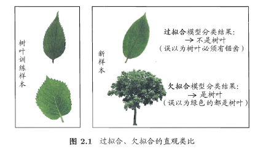
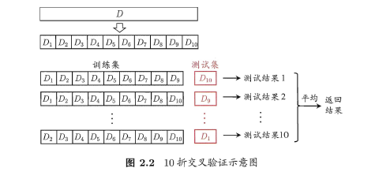
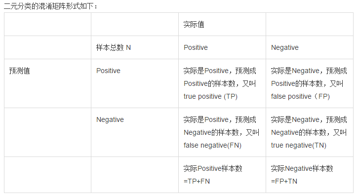
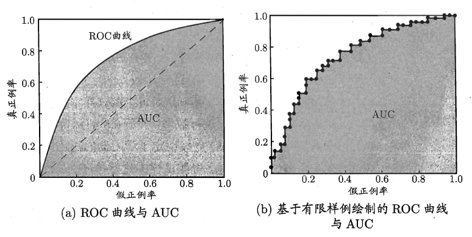
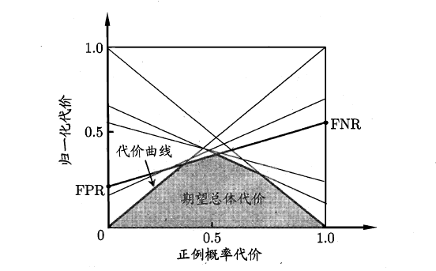
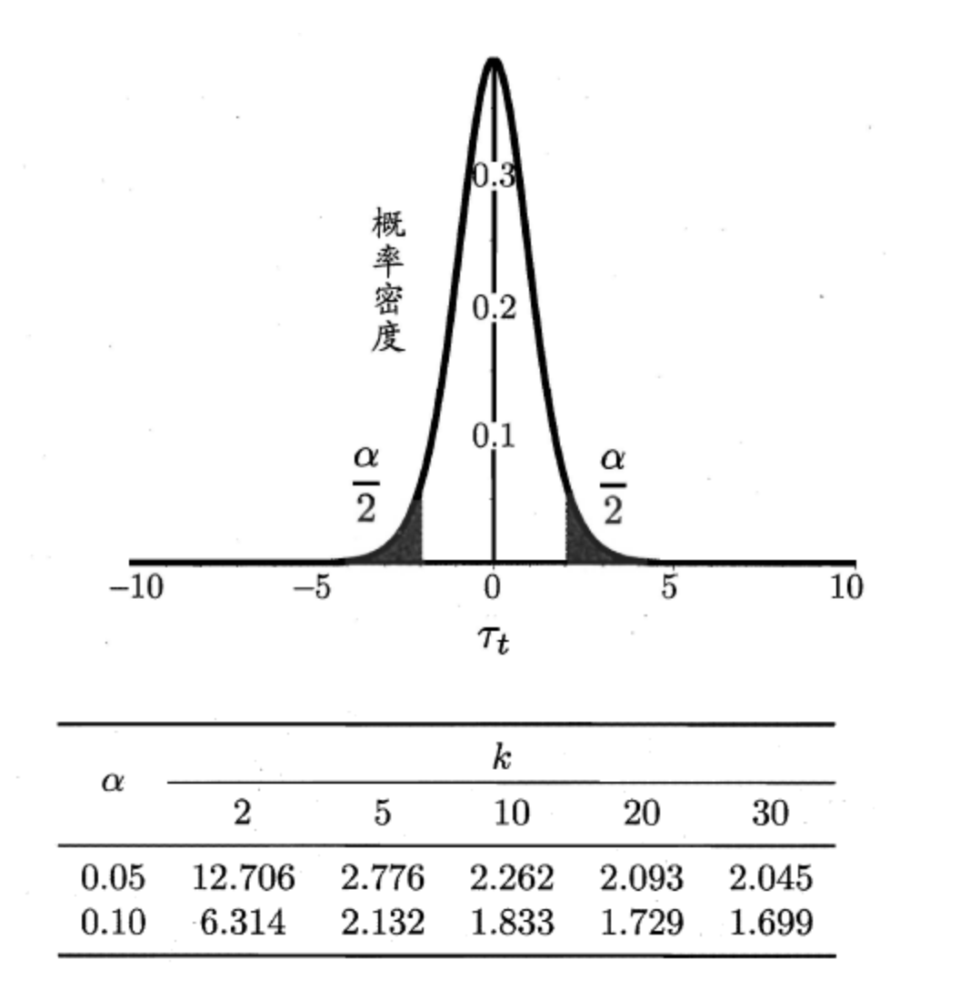

[TOC]

了评估学习器泛化性能的方法，即用测试集的“测试误差”作为“泛化误差”的近似，当我们划分好训练/测试集后，那如何计算“测试误差”呢？这就是性能度量，例如：均方差，错误率等，即“测试误差”的一个评价标准。有了评估方法和性能度量，就可以计算出学习器的“测试误差”，但由于“测试误差”受到很多因素的影响，例如：算法随机性或测试集本身的选择，那如何对两个或多个学习器的性能度量结果做比较呢？这就是比较检验。最后偏差与方差是解释学习器泛化性能的一种重要工具。

# 2.1 经验误差与过拟合

在机器学习任务中，我们将学习器实际输出与样本真实值之间的差异称为“误差（error）”，定义：

- 在训练集上的误差称为训练误差（training error）或经验误差（empirical error）。
- 在测试集上的误差称为测试误差（test error）。
- 学习器在所有新样本上的误差称为泛化误差（generalization error）。

显然，我们希望得到的是在新样本上表现得很好的学习器，即泛化误差小的学习器。因此，我们应该让学习器尽可能地从训练集中学出普适性的“一般特征”，这样在遇到新样本时才能做出正确的判别。然而，当学习器把训练集学得“太好”的时候，即把一些训练样本的自身特点当做了普遍特征；同时也有学习能力不足的情况，即训练集的基本特征都没有学习出来。我们定义：

- 学习能力过强，以至于把训练样本所包含的不太一般的特性都学到了，称为：过拟合（overfitting）。
- 学习能太差，训练样本的一般性质尚未学好，称为：欠拟合（underfitting）。

可以得知：在过拟合问题中，训练误差十分小，但测试误差教大；在欠拟合问题中，训练误差和测试误差都比较大。导致欠拟合的因素主要是学习器的学习能力过于低下，例如在决策树中增加新分支或在神经网络中增加训练次数或隐藏层数量。

过拟合很难解决，而且**过拟合是无法避免的，我们只能缓解或减小其风险**。

​																	**图2.1** 过拟合，欠拟合的直观类比

在实际应用中，解决问题有多种算法，同一种算法又可以有不同的参数，理论上应该选择泛化误差最小的学习模型，但是我们误差直接获取泛化误差，而训练误差由于过拟合现象不适合作为标准，那么我们如何评估并选择学习模型？

# 2.2 评估方法

由于无法直接获取泛化误差，因此采用测试集 (testing set)来测试学习模型的泛化性能，使用测试误差作为泛化误差的**近似**。机器学习过程假设训练集与测试集都是从数据集的样本空间**独立同分布采样**构建而成，训练集与测试集应该是互斥的，即测试样本尽量不出现在训练集中。

如上所述：对于一个包含$m$个样本的数据集$D=\{(x_1,y_1),(x_2, y_2), \dots , (x_m, y_m)\}$，我们希望用一个“测试集”的“测试误差”来作为“泛化误差”的近似，因此我们需要对初始数据集进行有效划分，划分出互斥的“训练集$S$”和“测试集$T$”。下面介绍几种常用的划分方法：

## 2.2.1 留出法

留出法(hold-out)直接将数据集$D$划分为两个互斥的集合：训练集$S$和测试集$T$，即$D = S \cup T, S \cap T=\empty$，留出法需要注意三个问题：

1. 训练集与测试集的划分要尽可能的保持数据分布的一致性，避免由于数据划分过程引入额外的偏差而对最终结果有影响，例如在分类任务中，训练集，测试集与样本集类别样本比例应当保持一致，从采样的角度上来看，这种保留类别比例的采样方式称为分层采样(stratified sampling)。
2. 在给定训练集和测试集的样本比例后，仍存在多种划分方式，由于划分的随机性，单次的留出法结果往往不够稳定，一般要采用若干次随机划分，重复实验取平均值的做法。
3. 留出法划分比例，若令训练集$S$包含$D$中大部分样本，则模型泛化性评估结果可能不足，若令测试集$T$包含大部分样本，则模型的学习能力不足，这个问题没有完美的解决方案，常见的划分为：大约2/3-4/5的样本用作训练，剩下的用作测试（按照经验定下的划分比例）。

## 2.2.2 交叉验证法

交叉验证法将数据集$D$划分为$k$个大小相似的互斥子集，$D = D_1 \cup D_2 \cup D_3 \dots \cup D_k,D_i \cap D_j = \empty$，每个子集$D_i$都尽量保持数据分布的一致性，因此从$D$中分层采样获得。交叉验证法的思想是：每次用$k-1$个子集的并集作为训练集，余下的那个子集作为测试集，这样就$k$种训练集/测试集划分的情况，从而可进行$k$次训练和测试，最终返回$k$次测试结果的均值。交叉验证法也称“$k$折交叉验证”，$k$最常用的取值是10，下图给出了10折交叉验证的示意图。

​																**图2.2** 10折交叉验证示意图

与留出法类似，将数据集$D$划分为$k$个子集的过程具有随机性，因此$K$折交叉验证通常也要重复$p$次，称为$p$次$k$折交叉验证，常见的是10次10折交叉验证，即进行了100次训练/测试。特殊地当划分的k个子集的每个子集中只有一个样本时，称为“留一法”，显然，留一法的评估结果比较准确，但对计算机的消耗也是巨大的。**不适用样本集巨大的情况**。

## 2.2.3 自助法

我们希望评估的是用整个$D$训练出的模型。但在留出法和交叉验证法中，由于保留了一部分样本用于测试，因此实际评估的模型所使用的训练集比$D$小，这必然会引入一些因训练样本规模不同而导致的估计偏差。留一法受训练样本规模变化的影响较小，但计算复杂度又太高了。“自助法(bootstrapping)”正是解决了这样的问题。

自助法是一个比较好的解决方案，它以自主采样法为基础，其基本思想是：给定包含$m$个样本的数据集$D$，每次随机从$D$中挑选一个样本，将其拷贝放入$D'$，然后再将该样本放回初始数据集$D$中，使得该样本在下次采样时仍有可能被采到。重复执行$m$次，就可以得到了包含$m$个样本的数据集$D'$。可以得知在$m$次采样中，样本始终不被采到的概率取极限为：
$$
\lim_{m \rightarrow \infty}(1-\frac{1}{m})^m=\frac{1}{e}=0.368 \tag{2.1}
$$
这样，通过自助采样，初始样本集$D$中大约有$36.8%$的样本没有出现在采样数据集$D'$中，于是可以将$D'$作为训练集，$D-D'$作为测试集。这样，实际评估的模型与期望评估的模型都使用$m$个训练样本，而我们仍有数量总量约$\frac{1}{3}$的数据作为测试集，这样称为“包外估计(out-of-bag-estimate)“。自助法在数据集较小，难以有效划分训练集/测试集时很有用，但由于自助法产生的数据集（随机抽样）**改变了初始数据集的分布**，因此引入了估计偏差。在初始数据集足够时，留出法和交叉验证法更加常用。

## 2.2.4 调参与最终模型

大多数学习算法都有些参数(parameter) 需要设定，参数配置不同，学得模型的性能往往有显著差别，这就是通常所说的"参数调节"或简称"调参" (parameter tuning)。

学习算法的很多参数是在实数范围内取值，因此，对每种参数取值都训练出模型来是不可行的。常用的做法是：对每个参数选定一个范围和步长λ，这样使得学习的过程变得可行。例如：假定算法有3 个参数，每个参数仅考虑5 个候选值，这样对每一组训练/测试集就有5*5*5= 125 个模型需考察，由此可见：拿下一个参数（即经验值）对于算法人员来说是有多么的重要。

最终模型有两个问题需要注意：

1. 当选定好模型和调参完成后，我们需要使用初始的数据集D重新训练模型，即让最初划分出来用于评估的测试集也被模型学习，增强模型的学习效果。
2. 为了区分测试集，我们将模型评估与选择用于参数调节的数据集称为“验证集(validation set)“，因此我们将数据划分为训练集，验证集和测试集，在验证集上进行参数调节和模型选择。

# 2.3 性能度量

性能度量（performance measure）是衡量模型泛化能力的评价标准，在对比不同模型的能力时，使用不同的性能度量往往会导致不同的评判结果。

## 2.3.1 回归任务性能度量

回归任务最常用的性能度量方式是“均方误差(mean squared error)“
$$
E(f;D)=\frac{1}{m}\sum_{i=1}^{m}(f(x_i)-y_i)^2 \tag{2.2}
$$
更一般的，对于数据分布$D$和概率密度函数$p(.)$，均方误差可以描述为：
$$
E(f;D)=\int_{x ～ D}(f(x)-y)^2p(x)dx \tag{2.3}
$$

## 2.3.2 错误率与精度

在分类任务中，即预测离散值的问题，最常用的是错误率和精度，错误率是分类错误的样本数占样本总数的比例，精度则是分类正确的样本数占样本总数的比例，易知：错误率+精度=1。

错误率的定义为：
$$
E(f,D)=\frac{1}{m}\sum_{i=1}^{m}\mathbb{I}(f(x_i)\neq y_i) \tag{2.4}
$$
精度的定义为：
$$
acc(f;D)=\frac{1}{m}\sum_{i=1}^{m}\mathbb{I}(f(x_i)= y_i) \tag{2.4}
$$
更一般的，对于数据分布D和概率密度函数$p(.)$，错误率和精度可分别描述为：
$$
E(f;D)=\int_{x ～ D}\mathbb{I}(f(x)\neq y)p(x)dx \tag{2.4}
$$

$$
E(f;D)=\int_{x ～ D}\mathbb{I}(f(x)= y)p(x)dx \tag{2.7}
$$

##2.3.3 查准率与查全率

错误率和精度虽然常用，但不能满足所有的需求，例如：在推荐系统中，我们只关心推送给用户的内容用户是否感兴趣（即查准率），或者说所有用户感兴趣的内容我们推送出来了多少（即查全率）。因此，使用查准/查全率更适合描述这类问题。对于二分类问题，可以将样例根据其真实类别分为：真正例(true positive, TP)，假正例(false positive, FP)，真反例(true negative, TN)与假反例(false negative, FN) ，二分类结果的混淆矩阵为：

| 真实情况\预测结果 | 正例 | 反例 |
| :---------------- | ---- | ---- |
| 正例              | TP   | FN   |
| 反例              | FP   | TN   |

查准率和查全率的定义为：
$$
P=\frac{TP}{TP+FP} \tag{2.8}
$$

$$
R=\frac{TP}{TP+FN} \tag{2.9}
$$

查准率与查全率是一对矛盾的度量，一般来说，查准率高的时候，查全率往往偏低。例如：

1. 如果希望所有的好瓜都希望尽可能多的被选出来，则可通过增加选择的数量来实现，自然，好瓜的准确率就会降低。
2. 我们想让推送的内容尽可能用户全都感兴趣，那只能推送我们把握高的内容，这样就漏掉了一些用户感兴趣的内容，查全率就低了；如果想让用户感兴趣的内容都被推送，那只有将所有内容都推送上，宁可错杀一千，不可放过一个，这样查准率就很低了。

查准率—查全率曲线(P-R曲线)可以直观的描述查准率与查全率的变化，P-R曲线定义如下：根据学习器的预测结果（一般为一个实值或概率）对测试样本进行排序，将最可能是“正例”的样本排在前面，最不可能是“正例”的排在后面，按此顺序逐个把样本作为“正例”进行预测，每次计算出当前的P值和R值，以查准率为纵轴，查全率为横轴制图。P-R图如下图所示：

.png)

​																		**图2.3** P-R曲线与平衡点示意图

P-R曲线的评价标准：若一个学习器A的P-R曲线被另一个学习器B的P-R曲线完全包住，则称：B的性能优于A。若A和B的曲线发生了交叉，则谁的曲线下的面积大，谁的性能更优。但是曲线下的面积不大容易估算，因此使用：

- 平衡点(Break-Event Point, BEP)作为度量，当两条P-R曲线相交时，**BEP较大的曲线更优**。

- F1值作为度量，F1值的计算公式如下：
	$$
	F1=\frac{2 \times P \times R}{P + R} = \frac{2\times TP}{样例总数+TP-FN} \tag{2.10}
	$$
	

但是在一些应用中，对查准率和查全率的重视程度有所不同，衍生出F1度量的更一般形式$F_{\beta}$度量：
$$
F_{\beta}=\frac{(1+\beta^2)\times P \times R}{(\beta^2 \times P)+R} \tag{2.11}
$$
其中$\beta > 0$度量了查全率对查准率的相对重要性：

- $\beta = 1$，为F1度量
- $\beta >1$，查全率有更大影响
- $\beta < 1$，查准率有更大影响

有时候我们会有多个二分类混淆矩阵，例如：多次训练或者在多个数据集上训练，或者多分类问题，两两类别组合对应一个混淆矩阵，那么估算全局性能的方法有两种，分为宏观和微观。

1. 宏观：先算出每个混淆矩阵的$P$值和$R$值，记为：$(P_1, R_1),(P_2,R_2),\dots ,(P_N,R)$，然后取得平均$P$值macro-P和平均R值macro-R，在算出$F_{\beta}$或$F1$，称之为宏查准率(macro-P)，宏查全率(macro-R)和宏F1(macro-F1)。

$$
macro-P=\frac{1}{n}\sum_{i=1}^{m}P_i \tag{2.12}
$$

$$
macro-R=\frac{1}{n}\sum_{i=1}^{m}R_i \tag{2.13}
$$

$$
macro-F1=\frac{2 \times macro-P \times macro-R}{macro-P + macro-R}
$$

2. 微观：将各个混淆矩阵的对应元素进行平均，得到：$\overline{TP},\overline{FP},,\overline{TN},\overline{FN}$，从而计算出微查准率(micro-P)，微查全率(micro-R)和微F1(micro-F1)。

$$
micro-P=\frac{\overline{TP}}{\overline{TP}+\overline{FP}} \tag{2.15}
$$

$$
micro-R=\frac{\overline{TP}}{\overline{TP}+\overline{NP}} \tag{2.16}
$$

$$
micro-F1=\frac{2\times micro-P \times micro-R}{micro-P+micro-R} \tag{2.17}
$$

## 2.3.4 ROC与AUC

学习器对测试样本的评估结果一般为一个实值或概率，设定一个阈值，大于阈值为正例，小于阈值为负例，实值与预测结果的好坏直接决定了学习器的泛化性能。我们可以将测试样本进行排序，最有可能的正例排在最前面，这样分类的过程就是在这个有序序列中，寻找截断点的过程。可以根据任务的需求，采用不同的截断点，例如若更重视查准率，则截断点靠前，若更重视查全率，则截断点靠后。

排序本身质量的好坏，体现了综合考虑学习器在不同任务下的**期望泛化性能**的好坏，ROC曲线正是从这个角度出发来研究学习器的泛化性能。

ROC曲线与P-R曲线十分类似，都是按照排序的顺序逐一按照正例预测，不同的是ROC曲线以“真正例率”（True Positive Rate，简称TPR）为横轴，纵轴为“假正例率”（False Positive Rate，简称FPR）。ROC偏重研究基于测试样本评估值的排序好坏。
$$
TPR=\frac{TP}{TP+FN} \tag{2.18}
$$

$$
FPR=\frac{FP}{TN+FP} \tag{2.19}
$$

​														**图2.4** ROC曲线与AUC示意图

简单分析图像，可以得知：当$FN=0$时，$TN$也必须0，反之也成立，我们可以画一个队列，试着使用不同的截断点（即阈值）去分割队列，来分析曲线的形状，$(0,0)$表示将所有的样本预测为负例，$(1,1)$则表示将所有的样本预测为正例，$(0,1)$表示正例全部出现在负例之前的理想情况，$(1,0)$则表示负例全部出现在正例之前的最差情况。

现实任务中，使用有限个测试样例来绘制ROC图，得到有限个(TPR, FPR)坐标对，由此得到图b，ROC曲线的绘制步骤如下：

1. 给定$m^+$个正例与$m^-$ 个反例，根据学习期预测结果对测试集排序；
2. 将分类阈值设置为最大，此时所有的样例均为反例，FPR与TPR均为0，对应原点坐标；
3. 将分类阈值依次设置为每个样例的预测值，即依次将每个样例划分为正例，假设前一点的坐标为：$(x,y)$，若当前样例为真正例，则当前点的坐标为：$(x,y+\frac{1}{m^+})$；若当前样例为真反例，则当前点的坐标为：$(x+\frac{1}{m^-},y)$；
4. 将所有点用线段相连；

同样地，进行模型的性能比较时，若一个学习器A的ROC曲线被另一个学习器B的ROC曲线完全包住，则称B的性能优于A。若A和B的曲线发生了交叉，则谁的曲线下的面积大，谁的性能更优，如果一定要进行比较，则较为合理的 是比较ROC曲线下的面积。ROC曲线下的面积定义为AUC（Area Uder ROC Curve），不同于P-R的是，这里的AUC是可估算的，即AOC曲线下每一个小矩形的面积之和。易知：AUC越大，证明排序的质量越好，AUC为1时，证明所有正例排在了负例的前面，AUC为0时，所有的负例排在了正例的前面。AUC的面积估算公式如下：
$$
AUC=\cfrac{1}{2}\sum_{i=1}^{m-1}(x_{i+1} - x_i)\cdot(y_i + y_{i+1}) \tag{2.20}
$$
**[解析]**：由于图2.4(b)中给出的ROC曲线为横平竖直的标准折线，所以乍一看这个式子的时候很不理解其中的$ \cfrac{1}{2} $和$ (y_i + y_{i+1}) $代表着什么，因为对于横平竖直的标准折线用$ AUC=\sum_{i=1}^{m-1}(x_{i+1} - x_i) \cdot y_i $就可以求出AUC了，但是图2.4(b)中的ROC曲线只是个特例罢了，因为此图是所有样例的预测值均不相同时的情形，也就是说每次分类阈值变化的时候只会划分新增**1个**样例为正例，所以下一个点的坐标为$ (x+\cfrac{1}{m^-},y) $或$ (x,y+\cfrac{1}{m^+}) $，然而当模型对某个正样例和某个反样例给出的预测值相同时，便会划分新增**两个**样例为正例，于是其中一个分类正确一个分类错误，那么下一个点的坐标为$ (x+\cfrac{1}{m^-},y+\cfrac{1}{m^+}) $（当没有预测值相同的样例时，若采取按固定梯度改变分类阈值，也会出现一下划分新增两个甚至多个正例的情形，但是此种阈值选取方案画出的ROC曲线AUC值更小，不建议使用），此时ROC曲线中便会出现**斜线**，而不再是只有横平竖直的折线，所以用**梯形面积公式**就能完美兼容这两种分类阈值选取方案，也即 **(上底+下底)\*高\*$ \cfrac{1}{2} $**

AUC考虑的是样本预测的排序质量，因此它与排序误差有紧密的联系，给定$m^+$个正例与$m^-$ 个反例，令$D^+$和$D^-$分别表示正，反样例集合，则排序的损失($loss$)定义为：
$$
l_{rank}=\cfrac{1}{m^+m^-}\sum_{x^+ \in D^+}\sum_{x^- \in D^-}(\mathbb{I}(f(x^+)<f(x^-))+\cfrac{1}{2}\mathbb{I}(f(x^+)=f(x^-))) \tag{2.21}
$$
**[解析]：**若正例的预测值小于反例，则记一个罚分，若相等，则记$0.5$个罚分。$ l_{rank} $为ROC曲线**之上**的面积，假设某ROC曲线如下图所示：

.png)

观察ROC曲线易知：

- 每增加一条绿色线段对应着有**1个**正样例（$ x^+_i $）被模型正确判别为正例，且该线段在Y轴的投影长度恒为$ \cfrac{1}{m^+} $；
- 每增加一条红色线段对应着有**1个**反样例（$ x^-_i $）被模型错误判别为正例，且该线段在X轴的投影长度恒为$ \cfrac{1}{m^-} $；
- 每增加一条蓝色线段对应着有a个正样例和b个反样例**同时**被判别为正例，且该线段在X轴上的投影长度=$ b * \cfrac{1}{m^-} $，在Y轴上的投影长度=$ a * \cfrac{1}{m^+} $；
- 任何一条线段所对应的样例的预测值一定**小于**其左边和下边的线段所对应的样例的预测值，其中蓝色线段所对应的a+b个样例的预测值相等。

公式里的$ \sum_{x^+ \in D^+} $可以看成一个遍历$ x^+_i $的循环：

for $ x^+_i $ in $ D^+ $:

　         $\cfrac{1}{m^+}\cdot\cfrac{1}{m^-}\cdot\sum_{x^- \in D^-}(\mathbb{I}(f(x^+_i)$ 记为式S

由于每个$ x^+_i $都对应着一条绿色或蓝色线段，所以遍历$ x^+_i $可以看成是在遍历每条绿色和蓝色线段，并用式S来求出每条绿色线段与Y轴构成的面积（例如上图中的m1)或者蓝色线段与Y轴构成的面积（例如上图中的m2+m3）。

**对于每条绿色线段：** 将其式S展开可得： 
$$
\cfrac{1}{m^+}\cdot\cfrac{1}{m^-}\cdot\sum_{x^- \in D^-}\mathbb{I}(f(x^+*i) \tag{2.22}
$$
其中$ x^+*i $此时恒为该线段所对应的正样例，是一个定值。$ \sum*{x^- \in D^-}\cfrac{1}{2}\mathbb{I}(f(x^+_i)=f(x^-) $是在通过遍历所有反样例来统计和$ x^+_i $的预测值相等的反样例个数，由于没有反样例的预测值和$ x^+*i $的预测值相等，所以$ \sum*{x^- \in D^-}\cfrac{1}{2}\mathbb{I}(f(x^+*i)=f(x^-)) $此时恒为0，于是其式S可以化简为：$$ \cfrac{1}{m^+}\cdot\cfrac{1}{m^-}\cdot\sum*{x^- \in D^-}\mathbb{I}(f(x^+*i)<f(x^-)) $$其中$ \cfrac{1}{m^+} $为该线段在Y轴上的投影长度，$ \sum*{x^- \in D^-}\mathbb{I}(f(x^+_i)<f(x^-)) $同理是在通过遍历所有反样例来统计预测值大于$ x^+*i $的预测值的反样例个数，也即该线段左边和下边的红色线段个数+蓝色线段对应的反样例个数，所以$ \cfrac{1}{m^-}\cdot\sum*{x^- \in D^-}(\mathbb{I}(f(x^+)<f(x^-))) $便是该线段左边和下边的红色线段在X轴的投影长度+蓝色线段在X轴的投影长度，也就是该绿色线段在X轴的投影长度，观察ROC图像易知**绿色线段与Y轴围成的面积=该线段在Y轴的投影长度 * 该线段在X轴的投影长度**。

**对于每条蓝色线段：** 将其式S展开可得： 
$$
\cfrac{1}{m^+}\cdot\cfrac{1}{m^-}\cdot\sum_{x^- \in D^-}\mathbb{I}(f(x^+*i) \tag{2.23}
$$
 其中前半部分表示的是蓝色线段和Y轴围成的图形里面矩形部分的面积，后半部分表示的便是剩下的三角形的面积，矩形部分的面积公式同绿色线段的面积公式一样很好理解，而三角形部分的面积公式里面的$ \cfrac{1}{m^+} $为底边长，$ \cfrac{1}{m^-}\cdot\sum*{x^- \in D^-}\mathbb{I}(f(x^+_i)=f(x^-)) $为高。

综上分析可知，式S既可以用来求绿色线段与Y轴构成的面积也能求蓝色线段与Y轴构成的面积，所以遍历完所有绿色和蓝色线段并将其与Y轴构成的面积累加起来即得$ l_{rank} $。

## 2.3.5 代价敏感错误率与代价曲线

上面的方法中，将学习器的犯错同等对待，但在现实生活中，将正例预测成假例与将假例预测成正例的代价常常是不一样的，例如：将无疾病-->有疾病只是增多了检查，但有疾病-->无疾病却是增加了生命危险。以二分类为例，由此引入了“代价矩阵”（cost matrix）。

​																**表2.2** 代价矩阵

<table>
	<tr>
	    <th rowspan="2" align="center">真实类别</th>
	    <th colspan="2" align="center">预测类别</th>
	</tr >
<tr>
    <td>第0类</td>
	    <td>第1类</td>
</tr>
<tr>
    <td>第0类</td>
	    <td>0</td>
    <td>cost01</td>
</tr>
<tr>
    <td>第1类</td>
    <td>cost10</td>
	    <td>0</td>
</tr>
</table>

其中$cost_{ij}$表示将第$i$类样本划分为第$j$类样本的代价。前面介绍的例如P-R曲线，ROC曲线都隐式地假设各个类别代价函数均等。在非均等错误代价下，我们希望的是最小化“总体代价”，这样“代价敏感”的错误率为：
$$
E(f;D;cost) = \frac{1}{m}(\sum_{x_i \in D^+}\mathbb{I}(f(x_i) \neq y_i)\times cost_{01}+\sum_{x_i \in D^-}\mathbb{I}(f(x_i) \neq y_i)\times cost_{10}) \tag{2.24}
$$
 将$i,j$的取值不限于$0,1$则可以定义出多分类任务的代价敏感性能度量。在非等价下，ROC曲线不能直接反映出学习器的期望总体代价，而代价曲线可以表示，代价曲线横轴是取值在[0,1]之间的正例概率代价：
$$
P(+)cost = \frac{p \times cost_{01}}{p \times cost_{01} + (1-p)\times cost_{10}} \tag{2.25}
$$
式中p表示正例的概率，纵轴是取值为[0,1]的归一化代价：
$$
cost_{norm}=\frac{FNR\times p \times cost_{01}+FPR\times (1-p)\times cost_{10}}{p \times cost_{01} + (1-p)\times cost_{10}} \tag{2.26}
$$
其中$FPR$是式(2.19)定义的假正例率，$FNR = 1-FPR$表示假反例率。代价曲线绘制的步骤如下：

1. 设ROC曲线上一点的坐标为(TPR，FPR) ，则可相应计算出FNR；
2. 在代价平面上绘制一条从(0，FPR) 到(1，FNR) 的线段，线段下的面积即表示了该条件下的期望总体代价；
3. 将ROC 曲线土的每个点转化为代价平面上的一条线段，然后取所有线段的下界，围成的面积即为在所有条件下学习器的期望总体代价，如下图所示：

# 2.4 比较检验

有了实验评估方法和性能度量，貌似可以对学习器性能进行评估比较，步骤如下：

1. 使用某种实验评估方法(留出法，交叉验证法，自助法)测得学习器某个性能度量(准确率，错误率，查全率，查准率，F1值，P-R，ROC)的结果；
2. 对各个学习器结果进行比较，那么如何比较呢？直接比较大小？？机器学习中性能比较要比这个**复杂**的多，具体原因如下：
	- 我们希望比较的是**泛化性能**，但是通过实验评估方法获取到的是测试集上的性能，两者结果存在一定的差异；
	- 测试集上的性能与测试集本身有绝对的关系，不同大小的测试集结果未必相同；
	- 机器学习很多模型具有随机性，例如常见的K-Means，使得同一模型**相同参数和测试集**每次得到的结果也不尽相同，

那如何对单个或多个学习器在不同或相同测试集上的性能度量结果做比较呢？这就是**比较检验**。通过**假设检验(hypothesis test)**我们可以推断出，若测试集上观察到的学习器A比B好，则A的泛化性能是否在**统计意义**上优于B，以及这种结论的把握有多大。本节默认以错误率为性能度量，用$\varepsilon$表示。

## 2.4.1 假设检验

假设检验中的**假设**是对学习器泛化错误率分布的某种判断或者猜想，例如：$\varepsilon =\varepsilon_0$，但是现实中，我们不知道学习器的泛化错误率，只能获知其测试错误率$\hat{\varepsilon}$，泛化错误率与测试错误率未必相同，但是测试集是样本空间独立同分布采样获得，理论上两个相似的可能性比较大，因此可根据测试错误率推出泛化错误率，这就是一种假设检验。

泛化错误率$\varepsilon$的学习器在一个样本上犯错的概率为$\varepsilon$；测试错误率$\hat{\varepsilon}$意味着在$m$个测试样本中有$\hat{\varepsilon} \times m$个样本被错误分类。假设测试样本是从样本总体分布中独立采样获得，那么泛化错误率$\varepsilon$的学习器将其中$m^{’}$个样本误分类，则剩余样本全部分类正确的概率为：
$$
P(\varepsilon)=
\begin{pmatrix}
{m}\\
{m^{'}}
\end{pmatrix}\varepsilon^{m^{'}}(1-\varepsilon)^{m-m^{'}} \tag{2.27}
$$
由此可得出泛化错误率为$\varepsilon$的学习器被测得测试错误率为$\hat{\varepsilon}$的概率为：
$$
P(\hat{\varepsilon};\varepsilon)=
\begin{pmatrix}
{m}\\
{\hat{\varepsilon}\times m}
\end{pmatrix}\varepsilon^{\hat{\varepsilon}\times m}(1-\varepsilon)^{m-\hat{\varepsilon}\times m} \tag{2.28}
$$
可以看出，当给定泛化错误率后，对 $\epsilon$ 求偏导会发现，给定这些条件时，**$\epsilon = \hat{\epsilon}$ 的概率是最大的**，$|\varepsilon-\hat{\varepsilon}|$增大时，$P(\hat{\varepsilon};\varepsilon)$减小，这个概率符合二项分布。因此使用二项检验(binomial test)的方法。

假设泛化错误率 $\epsilon \leq \epsilon_0$，并且设定置信度为 $1-\alpha$。则可以这样定义错误率的阈值 $\overline{\epsilon}$：

$$\overline{\epsilon} = \max{\epsilon} \qquad s.t. \qquad \sum_{i=\epsilon_0 \times m+1}^m \binom{m}{i}\epsilon^i (1-\epsilon)^{m-i} < \alpha$$

其中 $s.t.$ 表示左式在右边条件满足时成立。右式计算的是发生不符合假设的事件的总概率，如果我们要有 $1-\alpha$ 的把握认为假设成立，那么发生不符合假设的事件的总概率就必须低过 $\alpha$。

在满足右式的所有 $\epsilon$ 中，选择最大的作为阈值 $\overline{\epsilon}$。如果在测试集中观测到的测试错误率 $\hat{\epsilon}$ 是小于阈值 $\overline{\epsilon}$的， 我们就能以$1-\alpha$ 的把握认为假设成立，即该模型的泛化误差 $\epsilon \leq \epsilon_0$。

### ①二项分布参数$p$的检验[[1\]](https://github.com/datawhalechina/pumpkin-book/blob/master/docs/chapter2/chapter2.md#ref1)

设某事件发生的概率为$p$，$p$未知，作$m$次独立试验，每次观察该事件是否发生，以$X$记该事件发生的次数，则$X$服从二项分布$B(m,p)$，现根据$X$检验如下假设： 
$$
H_0:p\leq p_0 \\ H_1:p > p_0 \tag{2.29}
$$
 由二项分布本身的特性可知：$p$越小，$X$取到较小值的概率越大。因此，对于上述假设，一个直观上合理的检验为 ：$\varphi$当$X\leq C$时接受$H_0$，否则就拒绝$H_0$，其中，$C\in N$表示事件最大发生次数。此检验对应的功效函数为：
$$
\begin{aligned} \beta_{\varphi}(p)&=P(X>C)\\ &=1-P(X\leq C) \\ &=1-\sum_{i=0}^{C}\left(\begin{array}{c}{m} \\ {i}\end{array}\right) p^{i} (1-p)^{m-i} \\ &=\sum_{i=C+1}^{m}\left(\begin{array}{c}{m} \\ {i}\end{array}\right) p^{i} (1-p)^{m-i} \\ \end{aligned} \tag{2.30}
$$
 由于“$p$越小，$X$取到较小值的概率越大”可以等价表示为：$P(X\leq C)$是关于$p$的减函数（更为严格的数学证明参见[[1\]](https://github.com/datawhalechina/pumpkin-book/blob/master/docs/chapter2/chapter2.md#ref1)[[1\]](https://github.com/datawhalechina/pumpkin-book/blob/master/docs/chapter2/chapter2.md#ref1)

## 2.4.2 t检验

二项检验只用于检验某一次测试的性能度量，但实际任务中我们会进行多次的训练/测试，得到多个测试错误率，比方说进行了k次测试，得到 $\hat{\epsilon}_1$,$\hat{\epsilon}_2$, ... ,$\hat{\epsilon}_k$。这次就会用到**t检验(t-test)**。

定义这 $k$ 次测试的平均错误率 $\mu$ 和方差 $\sigma^2$：
$$
\mu = \frac{1}{k} \sum_{i=1}^k \hat{\epsilon_i} \tag{2.29}
$$

$$
\sigma^2 = \frac{1}{k-1} \sum_{i=1}^k (\hat{\epsilon_i} - \mu)^2 \tag{2.30}
$$

**注意：**这里使用的是**无偏估计**的**样本方差**，分母是 $k-1$，因为当均值确定，并且已知 $k-1$ 个样本的值时，第 $k$ 个样本的值是可以算出来的，也可以说是**受限的**。

假设泛化错误率 $\epsilon = \epsilon_0$，并且设定显著度为 $\alpha$。计算统计量t：
$$
\Gamma_t = \frac{\sqrt{k}(\mu-\epsilon_0)}{\sigma} \tag{2.31}
$$

​																		**图2.7** t分布示意图

## 2.4.3 **交叉验证t检验**

对两个模型A和B，各使用k折交叉验证分别得到k个测试错误率，即$\hat{\epsilon}_1^A$,$\hat{\epsilon}_2^A$, ... ,$\hat{\epsilon}_k^A$ 和 $\hat{\epsilon}_1^B$,$\hat{\epsilon}_2^B$, ... ,$\hat{\epsilon}_k^B$。使用**k折交叉验证成对t检验（paired t-tests）**来进行比较检验。

对于这两组k个测试错误率，计算两组之间的每一对的差，即 $\triangle_i = \hat{\epsilon}_k^A - \hat{\epsilon}_k^B$，从而得到k个 $\triangle$。我们可以计算 $\triangle$ 的均值 $\mu$ 和方差 $\sigma^2$，定义统计量t：
$$
t = \lvert \frac{\sqrt{k}\mu}{\sigma} \rvert \tag{2.32}
$$
可以看到，和前面的t检验相比，这里的分子没有被减项，其实是省略了。因为我们假设两个模型的泛化错误率相同，实际上是假设 $\lvert \epsilon^A - \epsilon^B \rvert = 0$，这个 $0$ 被省略了。

类似地，这个统计量服从自由度 $v = k-1$ 的t分布。我们设定好显著度 $\alpha$，查表获取临界值范围，如果计算出的t统计量落在在范围内，就能以$1-\alpha$ 的把握认为假设成立，即两个模型的泛化性能无显著差别，否则认为平均测试错误率较低的模型更胜一筹。

## 2.4.4 **McNemar检验**

## 2.4.5 Friedman检验与Nemenyi后续检验

# 2.5 方差与偏差

偏差-方差分解是解释学习器泛化性能的重要工具。偏差-方差分解试图对机器学习算法的期望泛化错误率进行拆解，对测试样本$x$，令$y_D$为$x$在数据集$D$中的标记，$y$为 $x$的真实标记，数据噪声有可能导致$y_D \neq y$，$f(x;D)$为训练集$D$上学得的模型在样本$x$上的预测输出，以回归任务为例：学习算法的期望预测为：
$$
\overline{f}(x)=\mathbb{E}_D[f(x;D)] \tag{2.37}
$$
使用样本数相同的不同训练集产生的方差为：
$$
var(x)=\mathbb{E}[(f(x;D)-\overline{f}(x))^2] \tag{2.38}
$$
噪声为：
$$
\varepsilon^2 = \mathbb{E}_D[(y_D-y)^2] \tag{2.39}
$$
期望输出与真实标记的偏差(bias)为：
$$
bias^2(x)=(\overline{f}(x)-y)^2 \tag{2.40}
$$
j假设噪声的期望：$\mathbb{E}_D[y_D-y]=0$，则通过简单的多项式展开合并，可以对算法的期望泛化误差进行分解：
$$
\begin{aligned}
E(f;D)&=\mathbb{E}_D[(f(x;D)-y_D)^2] \\
&=\mathbb{E}_D[(f(x;D)-\overline{f}(x)+\overline{f}(x)-y_D)^2] \\
&=\mathbb{E}_D[(f(x;D)-\overline{f}(x))^2]+\mathbb{E}_D[(\overline{f}(x)-y_D)^2]+2\mathbb{E}_D[2(f(x;D)-\overline{f}(x))(\overline{f}(x)-y_D)] \\
&= bias^2(x)+var(x)+\varepsilon^2
\end{aligned} \tag{2.41}
$$
泛化误差可以分解为：偏差，方差和噪声之和。其意义如下：

- 偏差：度量了学习算法的期望值与真实结果的偏离程度，即算法本身的拟合程度；
- 方差：度量了同样样本数量大小的不同训练集的变动导致的学习性能变化，即数据扰动造成的影响，也度量了学习器的稳定性；
- 噪声：表达当前任务上任何学习算法能达到的期望泛化误差的下届，即学习问题本身的难度

方差和偏差具有矛盾性，这就是常说的偏差-方差窘境（bias-variance dilamma），如图2.9所示

.jpg)

给定学习任务，通过设定模型参数来控制学习器的训练程度，例如：决策树的深度与叶子节点个数，神经网络的训练轮数，集成学习的基础学习器个数等，在训练不足的情况下，学习器对数据集拟合程度不够，训练数据的扰动不足以使学习器发生显著变化，此时偏差住到了泛化错误率；随着训练程度的提升，期望预测值与真实值之间的差异越来越小，即偏差越来越小，学习器的拟合能力增强，训练集的数据扰动逐渐被学习器学到，此时方差主导了泛化错误率；在训练到一定程度，学习器的拟合能力已经很强，训练集轻微的数据波动就会导致学习器显著的变化。