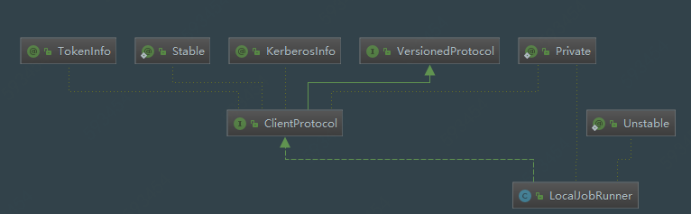

# MapReduce LocalJobRunner源码分析

## 1. LocalJobRunner UML类图



## 2. LocalJobRunner 概述

用于MapReduce本地运行，进行debug调试。

## 3. LocalJobRunner源码

### 3.1 类属性

```java
@InterfaceAudience.Private
@InterfaceStability.Unstable
public class LocalJobRunner implements ClientProtocol {
  public static final Logger LOG =
      LoggerFactory.getLogger(LocalJobRunner.class);

  /** The maximum number of map tasks to run in parallel in LocalJobRunner */
  public static final String LOCAL_MAX_MAPS =
    "mapreduce.local.map.tasks.maximum";

  /** The maximum number of reduce tasks to run in parallel in LocalJobRunner */
  public static final String LOCAL_MAX_REDUCES =
    "mapreduce.local.reduce.tasks.maximum";
  
  // mapreduce shuffle过程加密算法
  public static final String INTERMEDIATE_DATA_ENCRYPTION_ALGO = "HmacSHA1";

  // 当前文件系统  
  private FileSystem fs;
  private HashMap<JobID, Job> jobs = new HashMap<JobID, Job>();
  private JobConf conf;
  private AtomicInteger map_tasks = new AtomicInteger(0);
  private AtomicInteger reduce_tasks = new AtomicInteger(0);
  final Random rand = new Random();
  
  private LocalJobRunnerMetrics myMetrics = null;

  private static final String jobDir =  "localRunner/";
  }
```

### 3.2 submitJob方法(重点!!!)

```java
public org.apache.hadoop.mapreduce.JobStatus submitJob(
    org.apache.hadoop.mapreduce.JobID jobid, String jobSubmitDir,
    Credentials credentials) throws IOException {
    // 组装Job实例，注意：这里的Job类与客户端提交的Job不同
    Job job = new Job(JobID.downgrade(jobid), jobSubmitDir);
    
    job.job.setCredentials(credentials);
    // local模式下job相当于一个线程，此处开启本地线程
    return job.status;
}
```

### 3.3 内部Job类

```java
 public Job(JobID jobid, String jobSubmitDir) throws IOException {
     // job上传文件路径
      this.systemJobDir = new Path(jobSubmitDir);
     // job配置文件
      this.systemJobFile = new Path(systemJobDir, "job.xml");
     
      this.id = jobid;
      JobConf conf = new JobConf(systemJobFile);
      // 本地文件系统
      this.localFs = FileSystem.getLocal(conf);
      String user = UserGroupInformation.getCurrentUser().getShortUserName();
      // 本地作业目录
      this.localJobDir = localFs.makeQualified(new Path(
          new Path(conf.getLocalPath(jobDir), user), jobid.toString()));
     // 本地作业文件
      this.localJobFile = new Path(this.localJobDir, id + ".xml");
     
     // Manage the distributed cache.  If there are files to be copied,
      // this will trigger localFile to be re-written again.
      localDistributedCacheManager = new LocalDistributedCacheManager();
      localDistributedCacheManager.setup(conf, jobid);
      
      // Write out configuration file.  Instead of copying it from
      // systemJobFile, we re-write it, since setup(), above, may have
      // updated it.
      OutputStream out = localFs.create(localJobFile);
      try {
        conf.writeXml(out);
      } finally {
        out.close();
      }
      this.job = new JobConf(localJobFile);

      // Job (the current object) is a Thread, so we wrap its class loader.
      if (localDistributedCacheManager.hasLocalClasspaths()) {
        setContextClassLoader(localDistributedCacheManager.makeClassLoader(
                getContextClassLoader()));
      }
     // profile属性构建
      profile = new JobProfile(job.getUser(), id, systemJobFile.toString(), 
                               "http://localhost:8080/", job.getJobName());
      status = new JobStatus(id, 0.0f, 0.0f, JobStatus.RUNNING, 
          profile.getUser(), profile.getJobName(), profile.getJobFile(), 
          profile.getURL().toString());

      jobs.put(id, this);
     if (CryptoUtils.isEncryptedSpillEnabled(job)) {
        try {
          int keyLen = conf.getInt(
              MRJobConfig.MR_ENCRYPTED_INTERMEDIATE_DATA_KEY_SIZE_BITS,
              MRJobConfig
                  .DEFAULT_MR_ENCRYPTED_INTERMEDIATE_DATA_KEY_SIZE_BITS);
          KeyGenerator keyGen =
              KeyGenerator.getInstance(INTERMEDIATE_DATA_ENCRYPTION_ALGO);
          keyGen.init(keyLen);
          Credentials creds =
              UserGroupInformation.getCurrentUser().getCredentials();
          TokenCache.setEncryptedSpillKey(keyGen.generateKey().getEncoded(),
              creds);
          UserGroupInformation.getCurrentUser().addCredentials(creds);
        } catch (NoSuchAlgorithmException e) {
          throw new IOException("Error generating encrypted spill key", e);
        }
      }
      // 当前LocalJobRunner线程启动，执行LocalJobRunner的run方法
      this.start();
 }
```

### 3.4 LocalJobRunner对象的run方法(重点！！)

```java
 public void run() {
      JobID jobId = profile.getJobID();
      // 作业上下文
      JobContext jContext = new JobContextImpl(job, jobId);
      
      org.apache.hadoop.mapreduce.OutputCommitter outputCommitter = null;
      try {
        // 创建提交类
        outputCommitter = createOutputCommitter(conf.getUseNewMapper(), jobId, conf);
      } catch (Exception e) {
        LOG.info("Failed to createOutputCommitter", e);
        return;
      }
      
      try {
        // 读取创建任务拆分的元信息
        TaskSplitMetaInfo[] taskSplitMetaInfos = 
          SplitMetaInfoReader.readSplitMetaInfo(jobId, localFs, conf, systemJobDir);

        // 获取reduce数量
        int numReduceTasks = job.getNumReduceTasks();
        outputCommitter.setupJob(jContext);
        status.setSetupProgress(1.0f);

        // 线程安全的map输出文件集合
        Map<TaskAttemptID, MapOutputFile> mapOutputFiles =
            Collections.synchronizedMap(new HashMap<TaskAttemptID, MapOutputFile>());
        // 创建Runnable封装的供执行程序服务使用的map任务
        List<RunnableWithThrowable> mapRunnables = getMapTaskRunnables(
            taskSplitMetaInfos, jobId, mapOutputFiles);

        // 初始化计数器
        initCounters(mapRunnables.size(), numReduceTasks);
        // 创建map任务的执行器
        ExecutorService mapService = createMapExecutor();
        // 执行map任务，并等待map任务全部完成，如果执行过程中抛出异常，则取消所有map任务
        runTasks(mapRunnables, mapService, "map");

        try {
          if (numReduceTasks > 0) {
            // 根据配置的reduce任务数量创建Runnables封装的供执行程序服务使用的reduce任务
            List<RunnableWithThrowable> reduceRunnables = getReduceTaskRunnables(
                jobId, mapOutputFiles);
            ExecutorService reduceService = createReduceExecutor();
            // 执行所有reduce任务
            runTasks(reduceRunnables, reduceService, "reduce");
          }
        } finally {
          for (MapOutputFile output : mapOutputFiles.values()) {
            // 清除所有map输出的中间输出目录
            output.removeAll();
          }
        }
        // delete the temporary directory in output directory
        outputCommitter.commitJob(jContext);
        status.setCleanupProgress(1.0f);

        if (killed) {
          this.status.setRunState(JobStatus.KILLED);
        } else {
          this.status.setRunState(JobStatus.SUCCEEDED);
        }

        JobEndNotifier.localRunnerNotification(job, status);
      } catch (Throwable t) {
        try {
          // 作业运行异常，Delete the temporary directory, including all of the work directories.
          outputCommitter.abortJob(jContext, 
            org.apache.hadoop.mapreduce.JobStatus.State.FAILED);
        } catch (IOException ioe) {
          LOG.info("Error cleaning up job:" + id);
        }
        status.setCleanupProgress(1.0f);
        if (killed) {
          this.status.setRunState(JobStatus.KILLED);
        } else {
          this.status.setRunState(JobStatus.FAILED);
        }
        LOG.warn(id.toString(), t);

        JobEndNotifier.localRunnerNotification(job, status);

      } finally {
        try {
          try {
            // Cleanup distributed cache
            localDistributedCacheManager.close();
          } finally {
            try {
              fs.delete(systemJobFile.getParent(), true); // delete submit dir
            } finally {
              localFs.delete(localJobFile, true);         // delete local copy
            }
          }
        } catch (IOException e) {
          LOG.warn("Error cleaning up "+id+": "+e);
        }
      }
    }
```

