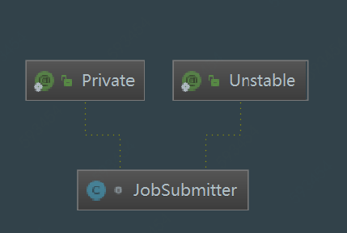
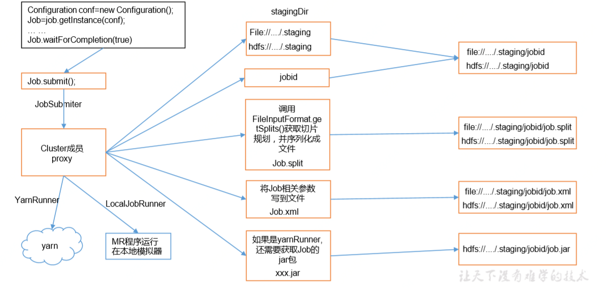

# JobSubmiter源码解析

## 1. JobSubmitter UML类图



```
@InterfaceAudience.Private // Hadoop注解，表示此类仅在Hadoop内部使用

@InterfaceStability.Unstable // Hadoop注解，表示对于任何级别的发布粒度，都无法保证可靠性或稳定性
```

## 2. JobSubmitter类概述

 JobSubmitter是MapReduce中作业提交者，而实际上JobSubmitter除了构造方法外，对外提供的唯一一个非private成员变量或方法就是`submitJobInternal()`方法，它是提交Job的内部方法，实现了提交Job的所有业务逻辑，是本文的分析重点。



## 3. JobSubmitter源码详解

### 3.1 JobSubmitter静态属性

```java
@InterfaceAudience.Private
@InterfaceStability.Unstable
class JobSubmitter {
  protected static final Log LOG = LogFactory.getLog(JobSubmitter.class);
  private static final String SHUFFLE_KEYGEN_ALGORITHM = "HmacSHA1";
  private static final int SHUFFLE_KEY_LENGTH = 64;
  private FileSystem jtFs;    //文件系统FileSystem实例
  private ClientProtocol submitClient;  //客户端通信协议ClientProtocol实例
  private String submitHostName;        //提交作业的主机名
  private String submitHostAddress;     //提交作业的主机

  //构造器
  JobSubmitter(FileSystem submitFs, ClientProtocol submitClient) 
  throws IOException {
    this.submitClient = submitClient;
    this.jtFs = submitFs;
  }

 ...
} 
```

### 3.2 JobSubmitter构造方法

```java
JobSubmitter(FileSystem submitFs, ClientProtocol submitClient) 
    throws IOException {
    this.submitClient = submitClient;
    this.jtFs = submitFs;
}
```

### 3.3 submitJobInternal 提交作业到集群(重点！！)

JobSubmitter唯一的对外核心功能方法**submitJobInternal()**，它被用于提交作业至集群。

```java
JobStatus submitJobInternal(Job job, Cluster cluster) 
  throws ClassNotFoundException, InterruptedException, IOException {}
```

作业提交过程包括：

- 检查作业中指定的输入/输出目录
- 使用`InputSplit`计算作业输入分片
- 使用`DistributedCache`为作业设置accounting information
- 将作业的jar和配置复制到分布式文件系统上的map-reduce系统目录
- 作业提交，并可以选择监视其状态

#### 3.3.1 检查输出目录

检查作业输出路径是否配置并且是否存在。正确情况是已经配置且不存在。输出路径的配置参数为`mapreduce.output.fileoutputformat.outputdir`。

```java
checkSpecs(job);

private void checkSpecs(Job job) throws ClassNotFoundException, InterruptedException, 			IOException {
    JobConf jConf = (JobConf)job.getConfiguration();
    // 根据作业中设置的reduce任务数量和mapper/reducer任务是否使用新API，使用不同的方法
    if (jConf.getNumReduceTasks() == 0 ? 
        jConf.getUseNewMapper() : jConf.getUseNewReducer()) {
      org.apache.hadoop.mapreduce.OutputFormat<?, ?> output =
        ReflectionUtils.newInstance(job.getOutputFormatClass(),
          job.getConfiguration());
      // 确定输出目录已经配置但是不存在于当前集群中
      output.checkOutputSpecs(job);
    } else {
      // 确定输出目录已经配置但是不存在于当前集群中
      jConf.getOutputFormat().checkOutputSpecs(jtFs, jConf);
    }
}
```

#### 3.3.2 添加分布式缓存

添加应用框架路径到分布式缓存中。

```java
//获取配置信息
Configuration conf = job.getConfiguration();
 //添加应用框架路径到分布式缓存中
addMRFrameworkToDistributedCache(conf);

@SuppressWarnings("deprecation")
private static void addMRFrameworkToDistributedCache(Configuration conf)
    throws IOException {
    // mapreduce.application.framework.path来指定文档被放的位置
    String framework =
        conf.get(MRJobConfig.MAPREDUCE_APPLICATION_FRAMEWORK_PATH, "");
    if (!framework.isEmpty()) {
        URI uri;
        try {
            uri = new URI(framework);
        } catch (URISyntaxException e) {
            throw new IllegalArgumentException("Unable to parse '" + framework
                                               + "' as a URI, check the setting for "
                                               + MRJobConfig.MAPREDUCE_APPLICATION_FRAMEWORK_PATH, e);
        }

        String linkedName = uri.getFragment();

        // 解析URI路径中的任何符号链接，因此使用“当前”符号链接指向特定版本会在分布式缓存配置中显示特定版本
        FileSystem fs = FileSystem.get(uri, conf);
        Path frameworkPath = fs.makeQualified(
            new Path(uri.getScheme(), uri.getAuthority(), uri.getPath()));
        FileContext fc = FileContext.getFileContext(frameworkPath.toUri(), conf);
        frameworkPath = fc.resolvePath(frameworkPath);
        uri = frameworkPath.toUri();
        try {
            uri = new URI(uri.getScheme(), uri.getAuthority(), uri.getPath(),
                          null, linkedName);
        } catch (URISyntaxException e) {
            throw new IllegalArgumentException(e);
        }

        DistributedCache.addCacheArchive(uri, conf);
    }
}
```

#### 3.3.3 设置作业执行时资源存放

```java
//通过静态方法getStagingDir()获取作业执行时相关资源的存放路径
//参数未配置时默认是/tmp/hadoop-yarn/staging/提交作业用户名/.staging
Path jobStagingArea = JobSubmissionFiles.getStagingDir(cluster, conf);
//configure the command line options correctly on the submitting dfs
//在提交dfs上正确配置命令行选项
InetAddress ip = InetAddress.getLocalHost(); // 获取本机IP
if (ip != null) {
    // 记录提交作业的主机IP、主机名，并且设置配置信息conf
    submitHostAddress = ip.getHostAddress();
    submitHostName = ip.getHostName();
    conf.set(MRJobConfig.JOB_SUBMITHOST,submitHostName);
    conf.set(MRJobConfig.JOB_SUBMITHOSTADDR,submitHostAddress);
}
```

#### 3.3.4 获取/设置作业ID

```java
JobID jobId = submitClient.getNewJobID();
job.setJobID(jobId);
```

ClientProtocol的实现类有两个：`LocalJobRunner`和`YARNRunner`，两者生成JobId的方式不同。

- `LocalJobRunner`

	```java
	/**
	* jobid：LocalJobRunner维护的自增Job数量
	* randid：作业运行毫秒数
	*/
public synchronized org.apache.hadoop.mapreduce.JobID getNewJobID() {
	    return new org.apache.hadoop.mapreduce.JobID("local" + randid, ++jobid);
	}
	```
	
	上述方法是线程安全的方法。
	
- YARNRunner

	```java
	// 提交作业客户端与YARN
	public JobID getNewJobID() throws IOException, InterruptedException {
	    try {
	        this.application = client.createApplication().getApplicationSubmissionContext();
	        this.applicationId = this.application.getApplicationId();
	        return TypeConverter.fromYarn(applicationId);
	    } catch (YarnException e) {
	        throw new IOException(e);
	    }
	}
	```

	****

#### 3.3.5 设置作业提交路径与参数

```java
//Job工作目录,jobStagingArea后接/jobID
Path submitJobDir = new Path(jobStagingArea, jobId.toString());
JobStatus status = null;
try {//设置一些作业参数
    conf.set(MRJobConfig.USER_NAME,
             UserGroupInformation.getCurrentUser().getShortUserName());
    conf.set("hadoop.http.filter.initializers",              "org.apache.hadoop.yarn.server.webproxy.amfilter.AmFilterInitializer");
    conf.set(MRJobConfig.MAPREDUCE_JOB_DIR, submitJobDir.toString());
    LOG.debug("Configuring job " + jobId + " with " + submitJobDir 
              + " as the submit dir");
    // get delegation token for the dir 获得路径的授权令牌
    TokenCache.obtainTokensForNamenodes(job.getCredentials(),
                                        new Path[] { submitJobDir }, conf);
    //获取秘钥和令牌，并将它们存储到令牌缓存TokenCache中
    populateTokenCache(conf, job.getCredentials());
    // 生成一个秘密来验证shuffle
    if (TokenCache.getShuffleSecretKey(job.getCredentials()) == null) {
        KeyGenerator keyGen;
        try {
            keyGen = KeyGenerator.getInstance(SHUFFLE_KEYGEN_ALGORITHM);
            keyGen.init(SHUFFLE_KEY_LENGTH);
        } catch (NoSuchAlgorithmException e) {
            throw new IOException("Error generating shuffle secret key", e);
        }
        SecretKey shuffleKey = keyGen.generateKey();
        TokenCache.setShuffleSecretKey(shuffleKey.getEncoded(),
                                       job.getCredentials());
    }
    // 
    if (CryptoUtils.isEncryptedSpillEnabled(conf)) {
        conf.setInt(MRJobConfig.MR_AM_MAX_ATTEMPTS, 1);
        LOG.warn("Max job attempts set to 1 since encrypted intermediate" +
                 "data spill is enabled");
    }
}
```

#### 3.3.6 复制并配置相关文件

```java
//复制并配置相关文件
copyAndConfigureFiles(job, submitJobDir);

/**
   * 使用以下命令行选项配置用户的jobconf
   * -libjars, -files, -archives.
   * @param job
   * @throws IOException
   */
private void copyAndConfigureFiles(Job job, Path jobSubmitDir) 
    throws IOException {
    Configuration conf = job.getConfiguration();
    // 是否应使用通配目录对libjars缓存文件进行本地化
    boolean useWildcards = conf.getBoolean(Job.USE_WILDCARD_FOR_LIBJARS,
                                           Job.DEFAULT_USE_WILDCARD_FOR_LIBJARS);
    JobResourceUploader rUploader = new JobResourceUploader(jtFs, useWildcards);

    rUploader.uploadResources(job, jobSubmitDir);

    // Get the working directory. If not set, sets it to filesystem working dir
    // This code has been added so that working directory reset before running
    // the job. This is necessary for backward compatibility as other systems
    // might use the public API JobConf#setWorkingDirectory to reset the working
    // directory.
    job.getWorkingDirectory();
}
```

#### 3.3.7 writeSplits作业切片

```java
//获取配置文件路径
Path submitJobFile = JobSubmissionFiles.getJobConfPath(submitJobDir);
// Create the splits for the job
LOG.debug("Creating splits at " + jtFs.makeQualified(submitJobDir));
// 关键方法，获取分片数量，分片数量对应MapReduce中的map任务数
int maps = writeSplits(job, submitJobDir);
```

**writeSplits方法详解：**

```java
@SuppressWarnings("unchecked")
private <T extends InputSplit>
    int writeNewSplits(JobContext job, Path jobSubmitDir) throws IOException,
InterruptedException, ClassNotFoundException {
    Configuration conf = job.getConfiguration();
    // 获取job中配置的InputFormat
    InputFormat<?, ?> input =
        ReflectionUtils.newInstance(job.getInputFormatClass(), conf);
    // 不同的InputFormat实现类有不同的getSplits方法，获取文件切片
     List<InputSplit> splits = input.getSplits(job);
    
    T[] array = (T[]) splits.toArray(new InputSplit[splits.size()]);
    // 按照切分文件长度排序，最长切片放在最前端
    Arrays.sort(array, new SplitComparator());
    // 将split信息持久化到文件中
    JobSplitWriter.createSplitFiles(jobSubmitDir, conf, 
        jobSubmitDir.getFileSystem(conf), array);
    return array.length;
}
```

**FileInputFormat.getSplits(JobContext job)**

生成文件列表，并将其放入FileSplits。

```java
public List<InputSplit> getSplits(JobContext job) throws IOException {
    StopWatch sw = new StopWatch().start();
    /**
    * 获取文件切片最小长度
    * getFormatMinSplitSize == 1
    */
    long minSize = Math.max(getFormatMinSplitSize(), getMinSplitSize(job));
    long maxSize = getMaxSplitSize(job);
    
    // generate splits
    List<InputSplit> splits = new ArrayList<InputSplit>();
    List<FileStatus> files = listStatus(job);
    
    boolean ignoreDirs = !getInputDirRecursive(job)
        && job.getConfiguration().getBoolean(INPUT_DIR_NONRECURSIVE_IGNORE_SUBDIRS, false);
    // 遍历输入文件，分别对每个文件进行切片处理
     for (FileStatus file: files) {
         if (ignoreDirs && file.isDirectory()) {
             continue;
         }
         Path path = file.getPath();
         long length = file.getLen();
         if (length != 0) {
             // 获文件block所在的位置
             BlockLocation[] blkLocations;
             if (file instanceof LocatedFileStatus) {
                 blkLocations = ((LocatedFileStatus) file).getBlockLocations();
             } else {
                 FileSystem fs = path.getFileSystem(job.getConfiguration());
                 blkLocations = fs.getFileBlockLocations(file, 0, length);
             }
             // 文件时可切分判断，对于有些文件格式不支持MapRedcue切片
             if (isSplitable(job, path)) {
                 // 获取当前作业配置的块大小
                 long blockSize = file.getBlockSize();
                 // 计算当前作业应该切片大小
                 long splitSize = computeSplitSize(blockSize, minSize, maxSize);
                 long bytesRemaining = length;
                 /** 关键点来了！开始从切片起始位置计算切片数量和每个切片结束位置
                 * 当文件长度除以切片长度大于SPLIT_SLOP = 1.1时才会切片成两片以上
                 */
                 while (((double) bytesRemaining)/splitSize > SPLIT_SLOP) {
                     int blkIndex = getBlockIndex(blkLocations, length-bytesRemaining);
                     splits.add(makeSplit(path, length-bytesRemaining, splitSize,
                                          blkLocations[blkIndex].getHosts(),
                                          blkLocations[blkIndex].getCachedHosts()));
                     bytesRemaining -= splitSize;
                 }
                 if (bytesRemaining != 0) {
                     int blkIndex = getBlockIndex(blkLocations, length-bytesRemaining);
                     splits.add(makeSplit(path, length-bytesRemaining, bytesRemaining,
                                          blkLocations[blkIndex].getHosts(),
                                          blkLocations[blkIndex].getCachedHosts()));
                 }
             }else{
                 // 如果不可切分，则整个文件会当做一个map任务，这样会造成map任务处理数据过大；
                 // 推进尽量使用可以切分的文件格式
                 if (LOG.isDebugEnabled()) {
                     // Log only if the file is big enough to be splitted
                     if (length > Math.min(file.getBlockSize(), minSize)) {
                         LOG.debug("File is not splittable so no parallelization "
                                   + "is possible: " + file.getPath());
                     }
                 }
                 splits.add(makeSplit(path, 0, length, blkLocations[0].getHosts(),
                                      blkLocations[0].getCachedHosts()));
             }
         }else { 
             //Create empty hosts array for zero length files
             splits.add(makeSplit(path, 0, length, new String[0]));
         }
     }
    // 设置文件数量
    job.getConfiguration().setLong(NUM_INPUT_FILES, files.size());
    // 记录分片操作使用时间
    sw.stop();
    if (LOG.isDebugEnabled()) {
        LOG.debug("Total # of splits generated by getSplits: " + splits.size()
                  + ", TimeTaken: " + sw.now(TimeUnit.MILLISECONDS));
    }
    // 返回切片信息
    return splits;
}


```

FileInputFormat获取当前文件格式下默认最小切片长度，注意不同的文件格式(例如：FileInputFormat与SequenceFileInputFormat)的返回值不同。

```java
  /**
   * Get the lower bound on split size imposed by the format.
   * @return the number of bytes of the minimal split for this format
   */
  protected long getFormatMinSplitSize() {
    return 1;
  }
```

```java
  /**
   * Get the minimum split size
   * @param job the job
   * @return the minimum number of bytes that can be in a split
   */
  public static long getMinSplitSize(JobContext job) {
    return job.getConfiguration().getLong(SPLIT_MINSIZE, 1L);
  }

  /**
   * 根据配置和默认值获取最大切片大小
   * @param context the job to look at.
   * @return the maximum number of bytes a split can include
   */
  public static long getMaxSplitSize(JobContext context) {
    return context.getConfiguration().getLong(SPLIT_MAXSIZE, 
                                              Long.MAX_VALUE);
  }
```

computeSplitSize

```java
protected long computeSplitSize(long blockSize, long minSize,
                                long maxSize) {
    // minSize——最小切屏长度；maxSize——最大切片长度
    // blockSize 作业配置的切片大小
    return Math.max(minSize, Math.min(maxSize, blockSize));
}
```

#### 3.3.8 map任务与提交队列设置

```java
conf.setInt(MRJobConfig.NUM_MAPS, maps);
LOG.info("number of splits:" + maps);
conf.setInt(MRJobConfig.NUM_MAPS, maps);
LOG.info("number of splits:" + maps);
// 与设置的map Task最大数量相比
int maxMaps = conf.getInt(MRJobConfig.JOB_MAX_MAP,
                          MRJobConfig.DEFAULT_JOB_MAX_MAP);
if (maxMaps >= 0 && maxMaps < maps) {
    throw new IllegalArgumentException("The number of map tasks " + maps +
                                       " exceeded limit " + maxMaps);
}
// write "queue admins of the queue to which job is being submitted" to job file.
// 设置作业提交的队列名称，默认是default队列
String queue = conf.get(MRJobConfig.QUEUE_NAME,
                        JobConf.DEFAULT_QUEUE_NAME);
AccessControlList acl = submitClient.getQueueAdmins(queue);
conf.set(toFullPropertyName(queue,
                            QueueACL.ADMINISTER_JOBS.getAclName()), acl.getAclString());
//在将jobconf复制到HDFS之前，请先删除jobtoken引用，
//因为这些任务不需要此设置，实际上，如果存在引用，任务可能会因此中断，
//因为该引用将指向其他作业。
TokenCache.cleanUpTokenReferral(conf);
```

#### 3.3.9 提交作业配置文件

```java
// 向作业提交目录写入配置文件
writeConf(conf, submitJobFile);

// job tracking ID
if (conf.getBoolean(
    MRJobConfig.JOB_TOKEN_TRACKING_IDS_ENABLED,
    MRJobConfig.DEFAULT_JOB_TOKEN_TRACKING_IDS_ENABLED)) {
    // Add HDFS tracking ids
    ArrayList<String> trackingIds = new ArrayList<String>();
    for (Token<? extends TokenIdentifier> t :
         job.getCredentials().getAllTokens()) {
        trackingIds.add(t.decodeIdentifier().getTrackingId());
    }
    conf.setStrings(MRJobConfig.JOB_TOKEN_TRACKING_IDS,
                    trackingIds.toArray(new String[trackingIds.size()]));
}
```

```java
private void writeConf(Configuration conf, Path jobFile) 
    throws IOException {
    // Write job file to JobTracker's fs        
    FSDataOutputStream out = 
        FileSystem.create(jtFs, jobFile, 
                          new FsPermission(JobSubmissionFiles.JOB_FILE_PERMISSION));
    try {
        conf.writeXml(out);
    } finally {
        out.close();
    }
}
```


#### 3.3.10 提交作业

```java
//
// Now, actually submit the job (using the submit name) 
// 现在，实际提交作业
//
printTokens(jobId, job.getCredentials());
status = submitClient.submitJob(
    jobId, submitJobDir.toString(), job.getCredentials());
if (status != null) {
    return status;
} else {
    throw new IOException("Could not launch job");
}   
```

#### 3.3.11 作业提交完毕

抛出无法加载作业的IOException前，调用文件系统FileSystem实例jtFs的delete()方法，删除作业提交的相关资源目录或者文件submitJobDir。

```java
finally {
    // 如果作业提交失败，则删除Job清理暂存区
    if (status == null) {
        LOG.info("Cleaning up the staging area " + submitJobDir);
        if (jtFs != null && submitJobDir != null)
            jtFs.delete(submitJobDir, true);
    }
}
```

## 4. 作业提交集群目录跟踪分析

### 4.1 获取暂存路径

```java
//通过静态方法getStagingDir()获取作业执行时相关资源的暂存路径
//参数未配置时默认是/tmp/hadoop-yarn/staging/提交作业用户名/.staging
Path jobStagingArea = JobSubmissionFiles.getStagingDir(cluster, conf);
```

### 4.2 生成JobID后生成当前作业资源暂存路径

```java

// 根据暂存路径和jobID获取作业提交/上传路径
Path submitJobDir = new Path(jobStagingArea, jobId.toString());

// 上传作业配置与-libjars, -files, -archives指定文件到作业上传路径
// 创建工作目录，向HDFS提交资源数据：
// 分别在submitJorDir的目录下创建临时文件、Jar包文件、归档文件的目录
copyAndConfigureFiles(job, submitJobDir);

Path submitJobFile = JobSubmissionFiles.getJobConfPath(submitJobDir);
// Write job file to submit dir
writeConf(conf, submitJobFile);
```

#### 4.3 上传作业配置中的资源文件

上传作业配置与-libjars, -files, -archives指定文件到作业上传路径

```java
   copyAndConfigureFiles(job, submitJobDir);
```

#### 4.4 Job配置文件

创建Job配置文件,所有配置信息最终会由客户端JobClient生成后创建于HDFS的Staging目录下，即job.xml文件，主要包含任务参数，记录如Reduce数量等：

```
Path submitJobFile = JobSubmissionFiles.getJobConfPath(submitJobDir);

```

