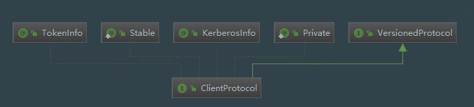

# MapReduce ClientProtocol源码分析

## 1. ClientProtocol UML图



## 2. ClientProtocol概述

clientProtocol是客户端与集群的通信协议。JobClient可以使用clientProtocol中的方法来提交Job，获取作业的运行状态。

## 3. ClientProtocol版本迭代

每当更新ClientProtocol类时，就会对类内维护的版本号属性+1，当前版本号是37；

```java
  public static final long versionID = 37L;
```

| 版本号 | 版本变化概述                                                 |
| ------ | ------------------------------------------------------------ |
| 2      | 修改`getTaskCompletionEvents`方法                            |
| 4      | 新增`killTask(String,boolean)`方法                           |
| 5      | 使用max_map_tasks和max_reduce_tasks替换集群max_tasks属性     |
| 6      | change the counters representation for HADOOP-2248           |
| 7      | 新增getAllJobs                                               |
| 8      | 更改{job\|task} id以使用相应的对象而不是字符串。             |
| 9      | change the counter representation for HADOOP-1915            |
| 10     | 新增getSystemDir                                             |
| 11     | 更改JobProfile以包括队列名称                                 |
| 12     | 为JobStatus新增getCleanupTaskReports和cleanupProgress        |
| 13     | 新增getJobQueueInfos、getJobQueueInfo(queue name) 和getAllJobs(queue) |
| ...    | .......                                                      |
| 36     | 为mapreduce计算框架新增getJobTrackerStatus()方法             |
| 37     | 框架计数器更有效的序列化方法                                 |
| 38     | 新增getLogFilePath(JobID, TaskAttemptID)                     |

## 4. ClientProtocol 接口方法

ClientProtocol是一个接口，其方法描述了客户端对job的操作、与集群的通信以及job运行时状态信息获取的相关方法。下面对主要方法列举和说明：

```java
@KerberosInfo(
    serverPrincipal = JTConfig.JT_USER_NAME)
@TokenInfo(DelegationTokenSelector.class)
@InterfaceAudience.Private
@InterfaceStability.Stable
public interface ClientProtocol extends VersionedProtocol {
     public static final long versionID = 37L;

  /**
   * 为作业分配唯一名称.
   * @return a unique job name for submitting jobs.
   * @throws IOException
   */
  public JobID getNewJobID() throws IOException, InterruptedException;

  /**
   * Submit a Job for execution.  Returns the latest profile for
   * that job.
   */
  public JobStatus submitJob(JobID jobId, String jobSubmitDir, Credentials ts)
      throws IOException, InterruptedException;

  /**
   * Get the current status of the cluster
   * 
   * @return summary of the state of the cluster
   */
  public ClusterMetrics getClusterMetrics() 
  throws IOException, InterruptedException;

  /**
   * Get the JobTracker's status.
   * 
   * @return {@link JobTrackerStatus} of the JobTracker
   * @throws IOException
   * @throws InterruptedException
   */
  public JobTrackerStatus getJobTrackerStatus() throws IOException,
    InterruptedException;

  public long getTaskTrackerExpiryInterval() throws IOException,
                                               InterruptedException;
  
  /**
   * Get the administrators of the given job-queue.
   * This method is for hadoop internal use only.
   * @param queueName
   * @return Queue administrators ACL for the queue to which job is
   *         submitted to
   * @throws IOException
   */
  public AccessControlList getQueueAdmins(String queueName) throws IOException;

  /**
   * Kill the indicated job
   */
  public void killJob(JobID jobid) throws IOException, InterruptedException;

  /**
   * Set the priority of the specified job
   * @param jobid ID of the job
   * @param priority Priority to be set for the job
   */
  public void setJobPriority(JobID jobid, String priority) 
  throws IOException, InterruptedException;
  
  /**
   * Kill indicated task attempt.
   * @param taskId the id of the task to kill.
   * @param shouldFail if true the task is failed and added to failed tasks list, otherwise
   * it is just killed, w/o affecting job failure status.  
   */ 
  public boolean killTask(TaskAttemptID taskId, boolean shouldFail) 
  throws IOException, InterruptedException;
  
  /**
   * Grab a handle to a job that is already known to the JobTracker.
   * @return Status of the job, or null if not found.
   */
  public JobStatus getJobStatus(JobID jobid) 
  throws IOException, InterruptedException;

  /**
   * Grab the current job counters
   */
  public Counters getJobCounters(JobID jobid) 
  throws IOException, InterruptedException;
    
  /**
   * Grab a bunch of info on the tasks that make up the job
   */
  public TaskReport[] getTaskReports(JobID jobid, TaskType type)
  throws IOException, InterruptedException;

  /**
   * A MapReduce system always operates on a single filesystem.  This 
   * function returns the fs name.  ('local' if the localfs; 'addr:port' 
   * if dfs).  The client can then copy files into the right locations 
   * prior to submitting the job.
   */
  public String getFilesystemName() throws IOException, InterruptedException;

  /** 
   * Get all the jobs submitted. 
   * @return array of JobStatus for the submitted jobs
   */
  public JobStatus[] getAllJobs() throws IOException, InterruptedException;
  
  /**
   * Get task completion events for the jobid, starting from fromEventId. 
   * Returns empty array if no events are available. 
   * @param jobid job id 
   * @param fromEventId event id to start from.
   * @param maxEvents the max number of events we want to look at 
   * @return array of task completion events. 
   * @throws IOException
   */
  public TaskCompletionEvent[] getTaskCompletionEvents(JobID jobid,
    int fromEventId, int maxEvents) throws IOException, InterruptedException;
    
  /**
   * Get the diagnostics for a given task in a given job
   * 获取给定任务的诊断信息
   * @param taskId the id of the task
   * @return an array of the diagnostic messages
   */
  public String[] getTaskDiagnostics(TaskAttemptID taskId) 
  throws IOException, InterruptedException;

  /** 
   * Get all active trackers in cluster. 
   * @return array of TaskTrackerInfo
   */
  public TaskTrackerInfo[] getActiveTrackers() 
  throws IOException, InterruptedException;

  /** 
   * Get all blacklisted trackers in cluster. 
   * @return array of TaskTrackerInfo
   */
  public TaskTrackerInfo[] getBlacklistedTrackers() 
  throws IOException, InterruptedException;

  /**
   * Grab the jobtracker system directory path 
   * where job-specific files are to be placed.
   * 
   * 获取放置作业文件的系统目录
   * @return the system directory where job-specific files are to be placed.
   */
  public String getSystemDir() throws IOException, InterruptedException;
  
  /**
   * Get a hint from the JobTracker 
   * where job-specific files are to be placed.
   * 
   * @return the directory where job-specific files are to be placed.
   */
  public String getStagingAreaDir() throws IOException, InterruptedException;

  /**
   * Gets the directory location of the completed job history files.
   * @throws IOException
   * @throws InterruptedException
   */
  public String getJobHistoryDir() 
  throws IOException, InterruptedException;

  /**
   * Gets set of Queues associated with the Job Tracker
   * 
   * @return Array of the Queue Information Object
   * @throws IOException 
   */
  public QueueInfo[] getQueues() throws IOException, InterruptedException;
  
  /**
   * Gets scheduling information associated with the particular Job queue
   * 
   * @param queueName Queue Name
   * @return Scheduling Information of the Queue
   * @throws IOException 
   */
  public QueueInfo getQueue(String queueName) 
  throws IOException, InterruptedException;
  
  /**
   * Gets the Queue ACLs for current user
   * @return array of QueueAclsInfo object for current user.
   * @throws IOException
   */
  public QueueAclsInfo[] getQueueAclsForCurrentUser() 
  throws IOException, InterruptedException;
  
  /**
   * Gets the root level queues.
   * @return array of JobQueueInfo object.
   * @throws IOException
   */
  public QueueInfo[] getRootQueues() throws IOException, InterruptedException;
  
  /**
   * Returns immediate children of queueName.
   * @param queueName
   * @return array of JobQueueInfo which are children of queueName
   * @throws IOException
   */
  public QueueInfo[] getChildQueues(String queueName) 
  throws IOException, InterruptedException;

  /**
   * Get a new delegation token.获取新的委托令牌
   * @param renewer the user other than the creator (if any) that can renew the 
   *        token
   * @return the new delegation token
   * @throws IOException
   * @throws InterruptedException
   */
  public 
  Token<DelegationTokenIdentifier> getDelegationToken(Text renewer
                                                      ) throws IOException,
                                                          InterruptedException;
  
  /**
   * Renew an existing delegation token
   * @param token the token to renew
   * @return the new expiration time
   * @throws IOException
   * @throws InterruptedException
   */
  public long renewDelegationToken(Token<DelegationTokenIdentifier> token
                                   ) throws IOException,
                                            InterruptedException;
  
  /**
   * Cancel a delegation token.
   * @param token the token to cancel
   * @throws IOException
   * @throws InterruptedException
   */
  public void cancelDelegationToken(Token<DelegationTokenIdentifier> token
                                    ) throws IOException,
                                             InterruptedException;
  
  /**
   * Gets the location of the log file for a job if no taskAttemptId is
   * specified, otherwise gets the log location for the taskAttemptId.
   * @param jobID the jobId.
   * @param taskAttemptID the taskAttemptId.
   * @return log params.
   * @throws IOException
   * @throws InterruptedException
   */
  public LogParams getLogFileParams(JobID jobID, TaskAttemptID taskAttemptID)
      throws IOException, InterruptedException;
    
}
```

