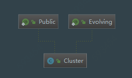
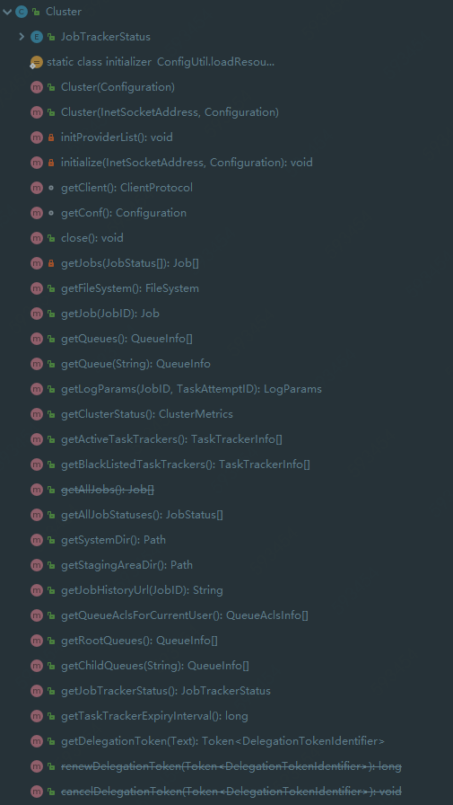

# MapReduce Cluster源码分析

## 1. Cluster UML类图



## 2. 类成员信息

```java
package org.apache.hadoop.mapreduce;

import ...
/**
 * Provides a way to access information about the map/reduce cluster.
 */
@InterfaceAudience.Public
@InterfaceStability.Evolving
public class Cluster {

  @InterfaceStability.Evolving
  public static enum JobTrackerStatus {INITIALIZING, RUNNING};
  private ClientProtocolProvider clientProtocolProvider;  //客户端通信协议提供者
  private ClientProtocol client;        //客户端通信协议实例
  private UserGroupInformation ugi;     //用户组信息
  private Configuration conf;           //配置信息
  private FileSystem fs = null;         //文件系统实例
  private Path sysDir = null;           //系统路径
  private Path stagingAreaDir = null;   //作业资源存放路径
  private Path jobHistoryDir = null;    //作业历史路径
  private static final Log LOG = LogFactory.getLog(Cluster.class);  //日志
  //客户端通信协议提供者加载器
  private static ServiceLoader<ClientProtocolProvider> frameworkLoader =
      ServiceLoader.load(ClientProtocolProvider.class);

  static {
    // 加载mapred-default.xml，mapred-site.xml，
    // yarn-default.xml，yarn-site.xml配置文件
    ConfigUtil.loadResources();
  }

  public Cluster(Configuration conf) throws IOException {
    this(null, conf);
  }

  public Cluster(InetSocketAddress jobTrackAddr, Configuration conf) 
      throws IOException {
    this.conf = conf;  //设置配置信息
    this.ugi = UserGroupInformation.getCurrentUser(); //获取当前用户
    initialize(jobTrackAddr, conf);  //完成初始化
  }

  ...
}
```

Cluster最重要的两个成员变量是客户端通信协议提供者ClientProtocolProvider实例clientProtocolProvider和客户端通信协议ClientProtocol实例client，而后者是依托前者的create()方法生成的。 Cluster类提供了两个构造函数。

## 3. 关键方法

### 3.1 initialize()方法

```java
private void initialize(InetSocketAddress jobTrackAddr, Configuration conf)
      throws IOException {
    
    // 初始化客户端通信协议：LocalRunner或YarnRunner
    initProviderList();
    final IOException initEx = new IOException(
        "Cannot initialize Cluster. Please check your configuration for "
            + MRConfig.FRAMEWORK_NAME
            + " and the correspond server addresses.");
    if (jobTrackAddr != null) {
      LOG.info(
          "Initializing cluster for Job Tracker=" + jobTrackAddr.toString());
    }
    // 依次取出每个ClientProtocolProvider，通过其create()方法构造ClientProtocol实例
    for (ClientProtocolProvider provider : providerList) {
      LOG.debug("Trying ClientProtocolProvider : "
          + provider.getClass().getName());
      ClientProtocol clientProtocol = null;
      try {
        if (jobTrackAddr == null) {
          clientProtocol = provider.create(conf);
        } else {
          clientProtocol = provider.create(jobTrackAddr, conf);
        }
        // 设置成员变量clientProtocolProvider和client，并退出循环  
        if (clientProtocol != null) {
          clientProtocolProvider = provider;
          client = clientProtocol;
          LOG.debug("Picked " + provider.getClass().getName()
              + " as the ClientProtocolProvider");
          break;
        } else {
          LOG.debug("Cannot pick " + provider.getClass().getName()
              + " as the ClientProtocolProvider - returned null protocol");
        }
      } catch (Exception e) {
        final String errMsg = "Failed to use " + provider.getClass().getName()
            + " due to error: ";
        initEx.addSuppressed(new IOException(errMsg, e));
        LOG.info(errMsg, e);
      }
    }

    if (null == clientProtocolProvider || null == client) {
      throw initEx;
    }
  }
```

### 3.2 initProviderList方法

frameworkLoader是客户端通信协议集合的实例，通过Java SPI机制动态加载。ClientProtocolProvider详情参考mapreduce-ClientProtocolProvider源码分析。

```java
@VisibleForTesting
// Service Provider Interfaces(SPI)Java实现类ServiceLoader，实现动态加载  ClientProtocolProvider
static Iterable<ClientProtocolProvider> frameworkLoader =
    ServiceLoader.load(ClientProtocolProvider.class);

private volatile List<ClientProtocolProvider> providerList = null;

private void initProviderList() {
    // 单例模式 Double Check Locking 双检查锁机制.
    if (providerList == null) {
      synchronized (frameworkLoader) {
        if (providerList == null) {
          List<ClientProtocolProvider> localProviderList =
              new ArrayList<ClientProtocolProvider>();
          try {
            for (ClientProtocolProvider provider : frameworkLoader) {
              localProviderList.add(provider);
            }
          } catch(ServiceConfigurationError e) {
            LOG.info("Failed to instantiate ClientProtocolProvider, please "
                         + "check the /META-INF/services/org.apache."
                         + "hadoop.mapreduce.protocol.ClientProtocolProvider "
                         + "files on the classpath", e);
          }
          providerList = localProviderList;
        }
      }
    }
  }
```

### 3.3 类属性以及Cluster信息get方法

Cluster还有大量类属性和Cluster信息get方法。可以

