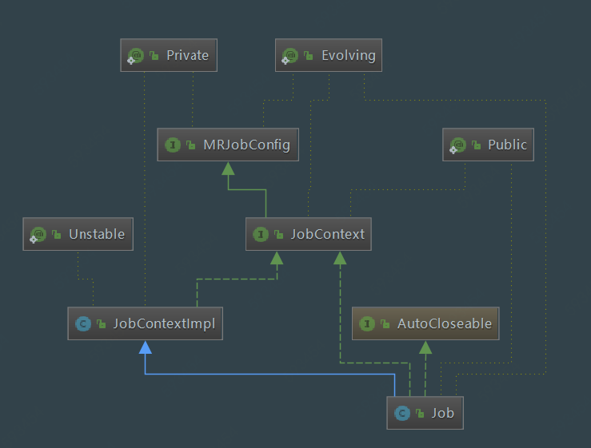

[TOC]

# Job源码学习

## 1. Job UML类图



## 2. Job类概述

Job类允许用户配置作业，提交，控制其执行并查询状态。set方法仅在提交作业之前有效，然后它们将引发IllegalStateException。通常，用户创建应用程序，通过{@link Job}描述作业的各个方面，然后提交作业并监视其进度。

继承的接口有：`AutoCloseable`，`JobContext`

```java
/**
* 以作业提交者的角度阅读Job源码
*
*/
@InterfaceAudience.Public
@InterfaceStability.Evolving
public class Job extends JobContextImpl implements JobContext, AutoCloseable {
    
}
```

## 3. Job源码详解

### 3.1 Job静态属性

```java
  public enum JobState {
      /**
      Job状态枚举类
      */
      DEFINE, // 初始化
      RUNNING // 正在运行
  };
  
  // 表示最多2000毫秒就要刷新这个作业的状态
  private static final long MAX_JOBSTATUS_AGE = 1000 * 2;

  // mapreduce的输出是否还需要一层过滤，如果需要
  // 以mapreduce.client.output.filter为键名去XML配置文件中查询。
  public static final String OUTPUT_FILTER = "mapreduce.client.output.filter";

  /** mapred-*.xml中设置轮询作业状态的更新的时间间隔 */
  public static final String COMPLETION_POLL_INTERVAL_KEY = 
    "mapreduce.client.completion.pollinterval";  
  /** 默认 completionPollIntervalMillis is 5000 ms. */
  static final int DEFAULT_COMPLETION_POLL_INTERVAL = 5000;

  /** 
  * Key in mapred-*.xml that sets progMonitorPollIntervalMillis 
  * progMonitorPollIntervalMillis——JobClient向控制台报告状态并检查作业完成的时间间隔
  */
  public static final String PROGRESS_MONITOR_POLL_INTERVAL_KEY =
    "mapreduce.client.progressmonitor.pollinterval";
  /** Default progMonitorPollIntervalMillis is 1000 ms. */
  static final int DEFAULT_MONITOR_POLL_INTERVAL = 1000;

  public static final String USED_GENERIC_PARSER = 
      "mapreduce.client.genericoptionsparser.used";
  /**
  * 提交复本文件的复本数
  */
  public static final String SUBMIT_REPLICATION = 
      "mapreduce.client.submit.file.replication";
  public static final int DEFAULT_SUBMIT_REPLICATION = 10;
  /**
  -libjar 提交jar包时是否使用通配符
  */
  public static final String USE_WILDCARD_FOR_LIBJARS =
      "mapreduce.client.libjars.wildcard";
  public static final boolean DEFAULT_USE_WILDCARD_FOR_LIBJARS = true;

  @InterfaceStability.Evolving
  public enum TaskStatusFilter { 
      // 任务执行状态枚举
      NONE, 
      KILLED, 
      FAILED, 
      SUCCEEDED, 
      ALL
  }

  static {
    // 加载相关配置文件
    ConfigUtil.loadResources();
  }
```

### 3.2 Job构造函数

```java
  Job(JobConf conf) throws IOException {
    super(conf, null);
    // propagate existing user credentials to job
    this.credentials.mergeAll(this.ugi.getCredentials());
    this.cluster = null;
  }

  Job(JobStatus status, JobConf conf) throws IOException {
    this(conf);
    setJobID(status.getJobID());
    this.status = status;
    state = JobState.RUNNING;
  }
```

### 3.3 实例化Job对象

```java
  public static Job getInstance() throws IOException {
    // create with a null Cluster
    return getInstance(new Configuration());
  }

  public static Job getInstance(Configuration conf) throws IOException {
    // create with a null Cluster
    JobConf jobConf = new JobConf(conf);
    return new Job(jobConf);
  }

 public static Job getInstance(Configuration conf, String jobName)
           throws IOException {
    // create with a null Cluster
    Job result = getInstance(conf);
    result.setJobName(jobName);
    return result;
  }

 public static Job getInstance(JobStatus status, Configuration conf) 
  throws IOException {
    return new Job(status, new JobConf(conf));
  }
```

### 3.4 Job其他属性设置与获取

```java
// 获取作业当前状态
public JobStatus.State getJobState() 
    throws IOException, InterruptedException {
    ensureState(JobState.RUNNING);
    updateStatus();
    return status.getState();
}

// 获取Job tracking URL
public String getTrackingURL(){
    ensureState(JobState.RUNNING);
    return status.getTrackingUrl().toString();
}

// 获取提交作业的配置文件路径
public String getJobFile() {
    ensureState(JobState.RUNNING);
    return status.getJobFile();
}

// 获取作业开始时间
public long getStartTime() {
    ensureState(JobState.RUNNING);
    return status.getStartTime();
}

// 获取作业完成时间
public long getFinishTime() throws IOException, InterruptedException {
    ensureState(JobState.RUNNING);
    updateStatus();
    return status.getFinishTime();
}

// 获取调度信息
public String getSchedulingInfo() {
    ensureState(JobState.RUNNING);
    return status.getSchedulingInfo();
}

public JobPriority getPriority() throws IOException, InterruptedException {
    ensureState(JobState.RUNNING);
    updateStatus();
    return status.getPriority();
}
  
public String getJobName() {
    if (state == JobState.DEFINE || status == null) {
        return super.getJobName();
    }
    ensureState(JobState.RUNNING);
    return status.getJobName();
}
public String getHistoryUrl() throws IOException, InterruptedException {
    ensureState(JobState.RUNNING);
    updateStatus();
    return status.getHistoryFile();
}

public boolean isRetired() throws IOException, InterruptedException {
    ensureState(JobState.RUNNING);
    updateStatus();
    return status.isRetired();
}

// 获取job的指定任务类型(type)任务的报告
public TaskReport[] getTaskReports(TaskType type) 
    throws IOException, InterruptedException {
    ensureState(JobState.RUNNING);
    final TaskType tmpType = type;
    return ugi.doAs(new PrivilegedExceptionAction<TaskReport[]>() {
        public TaskReport[] run() throws IOException, InterruptedException {
            return cluster.getClient().getTaskReports(getJobID(), tmpType);
        }
    });
}

public enum TaskType {
  MAP, 
  REDUCE, 
  JOB_SETUP, 
  JOB_CLEANUP, 
  TASK_CLEANUP
}

// 获取job的map任务执行百分比进度
public float mapProgress() throws IOException {
    ensureState(JobState.RUNNING);
    // 根据Job配置的状态刷新时间间隔，刷新job状态
    ensureFreshStatus();
    return status.getMapProgress();
}

public float reduceProgress() throws IOException {
    ensureState(JobState.RUNNING);
    ensureFreshStatus();
    return status.getReduceProgress();
}

public float setupProgress() throws IOException {
    ensureState(JobState.RUNNING);
    ensureFreshStatus();
    return status.getSetupProgress();
}

public boolean isComplete() throws IOException {
    ensureState(JobState.RUNNING);
    updateStatus();
    return status.isJobComplete();
}

public boolean isSuccessful() throws IOException {
    ensureState(JobState.RUNNING);
    updateStatus();
    return status.getState() == JobStatus.State.SUCCEEDED;
}

// 终止正在运行的工作。 阻塞直到所有工作任务都被杀死。 如果作业不再运行，它将简单地返回。
public void killJob() throws IOException {
    ensureState(JobState.RUNNING);
    try {
        cluster.getClient().killJob(getJobID());
    }
    catch (InterruptedException ie) {
        throw new IOException(ie);
    }
}

// 设置job的优先级
public void setPriority(JobPriority jobPriority) throws IOException,
InterruptedException {
    if (state == JobState.DEFINE) {
        // 如果是初始化状态则直接设置该作业的优先级
        if (jobPriority == JobPriority.UNDEFINED_PRIORITY) {
            conf.setJobPriorityAsInteger(convertPriorityToInteger(jobPriority));
        } else {
            conf.setJobPriority(org.apache.hadoop.mapred.JobPriority
                                .valueOf(jobPriority.name()));
        }
    } else {
        /**对于正在运行中的作业：
        * 1.如果客户端是LocalJobRunner 则不支持修改优先级
        * 2.如果客户端是YARNRunner 则更新优先级
        */
        ensureState(JobState.RUNNING);
        final int tmpPriority = convertPriorityToInteger(jobPriority);
        ugi.doAs(new PrivilegedExceptionAction<Object>() {
            @Override
            public Object run() throws IOException, InterruptedException {
                cluster.getClient()
                    .setJobPriority(getJobID(), Integer.toString(tmpPriority));
                return null;
            }
        });
    }
}

// Job优先级转换
private int convertPriorityToInteger(JobPriority jobPriority) {
    switch (jobPriority) {
        case VERY_HIGH :
            return 5;
        case HIGH :
            return 4;
        case NORMAL :
            return 3;
        case LOW :
            return 2;
        case VERY_LOW :
            return 1;
        case DEFAULT :
            return 0;
        default:
            break;
    }
    // For UNDEFINED_PRIORITY, we can set it to default for better handling
    return 0;
}

//从JobTracker中获取某个作业已经完成的Task列表，这主要是为Reduce Task获取已完成的Map Task列表，以便开始远程拷贝（shuffle）数据
public TaskCompletionEvent[] getTaskCompletionEvents(final int startFrom,
                                                     final int numEvents) throws IOException, InterruptedException {
    ensureState(JobState.RUNNING);
    return ugi.doAs(new PrivilegedExceptionAction<TaskCompletionEvent[]>() {
        @Override
        public TaskCompletionEvent[] run() throws IOException, InterruptedException {
            return cluster.getClient().getTaskCompletionEvents(getJobID(),
                                                               startFrom, numEvents); 
        }
    });
}

// 获取Job的计数器，如果该作业不再位于完成的作业存储中，则可能返回null。
public Counters getCounters() 
    throws IOException {
    ensureState(JobState.RUNNING);
    try {
        return ugi.doAs(new PrivilegedExceptionAction<Counters>() {
            @Override
            public Counters run() throws IOException, InterruptedException {
                return cluster.getClient().getJobCounters(getJobID());
            }
        });
    }
    catch (InterruptedException ie) {
        throw new IOException(ie);
    }
}

.....由于方法过多，不在此一一列举，后面只对重要方法进行说明

/**
   * Set the combiner class for the job.注意：combiner继承的是Reducer类
   * @param cls the combiner to use
   * @throws IllegalStateException if the job is submitted
   */
public void setCombinerClass(Class<? extends Reducer> cls
                            ) throws IllegalStateException {
    ensureState(JobState.DEFINE);
    conf.setClass(COMBINE_CLASS_ATTR, cls, Reducer.class);
}


/**
   * 定义比较器，该比较器控制在将键传递给{@link Reducer}之前如何对其进行排序。
   * @param cls the raw comparator
   * @throws IllegalStateException if the job is submitted
   * @see #setCombinerKeyGroupingComparatorClass(Class)
   */
public void setSortComparatorClass(Class<? extends RawComparator> cls
                                  ) throws IllegalStateException {
    ensureState(JobState.DEFINE);
    conf.setOutputKeyComparatorClass(cls);
}

// 定义比较器，该比较器控制调用组合器时将哪些键分组在一起，
public void setCombinerKeyGroupingComparatorClass(
    Class<? extends RawComparator> cls) throws IllegalStateException {
    ensureState(JobState.DEFINE);
    conf.setCombinerKeyGroupingComparator(cls);
}
```

### 3.6 Job配置缓存/归档文件

注意：DistributedCache类已经废弃，之前配置Job分布式缓存文件的方法：

```java
JobConf job = new JobConf();
DistributedCache.addCacheFile(new URI("/myapp/lookup.dat#lookup.dat"),
                              job);
DistributedCache.addCacheArchive(new URI("/myapp/map.zip"), job);
DistributedCache.addFileToClassPath(new Path("/myapp/mylib.jar"), job);
DistributedCache.addCacheArchive(new URI("/myapp/mytar.tar"), job);
DistributedCache.addCacheArchive(new URI("/myapp/mytgz.tgz"), job);
DistributedCache.addCacheArchive(new URI("/myapp/mytargz.tar.gz"), job);
```

Hadoop3中，直接使用下面Job类方法配置缓存/归档文件

```java
/**
 * Set the given set of archives
 * @param archives The list of archives that need to be localized
 */
public void setCacheArchives(URI[] archives) {
  ensureState(JobState.DEFINE);
  DistributedCache.setCacheArchives(archives, conf);
}

/**
 * Set the given set of files
 * @param files The list of files that need to be localized
 */
public void setCacheFiles(URI[] files) {
  ensureState(JobState.DEFINE);
  DistributedCache.setCacheFiles(files, conf);
}

/**
 * Add a archives to be localized
 * @param uri The uri of the cache to be localized
 */
public void addCacheArchive(URI uri) {
  ensureState(JobState.DEFINE);
  DistributedCache.addCacheArchive(uri, conf);
}

/**
 * Add a file to be localized
 * @param uri The uri of the cache to be localized
 */
public void addCacheFile(URI uri) {
  ensureState(JobState.DEFINE);
  DistributedCache.addCacheFile(uri, conf);
}

/**
 * Add an file path to the current set of classpath entries It adds the file
 * to cache as well.
 * 
 * Files added with this method will not be unpacked while being added to the
 * classpath.
 * To add archives to classpath, use the {@link #addArchiveToClassPath(Path)}
 * method instead.
 *
 * @param file Path of the file to be added
 */
public void addFileToClassPath(Path file)
  throws IOException {
  ensureState(JobState.DEFINE);
  DistributedCache.addFileToClassPath(file, conf, file.getFileSystem(conf));
}

/**
 * Add an archive path to the current set of classpath entries. It adds the
 * archive to cache as well.
 * 
 * Archive files will be unpacked and added to the classpath
 * when being distributed.
 *
 * @param archive Path of the archive to be added
 */
public void addArchiveToClassPath(Path archive)
  throws IOException {
  ensureState(JobState.DEFINE);
  DistributedCache.addArchiveToClassPath(archive, conf, archive.getFileSystem(conf));
}
```

### 3.5 提交作业(重点！！)

#### 3.5.1 进入Job.waitForCompletion()方法

```java
// 提交作业并等待完成
public boolean waitForCompletion(boolean verbose
                                   ) throws IOException, InterruptedException,
                                            ClassNotFoundException {
    // 当state为define时，则提交
    if (state == JobState.DEFINE) {
        submit();
    }
    // 检测并打印Job相关信息
    if (verbose) {
      // 打印Job信息与map任务、reduce任务完成百分比
      monitorAndPrintJob();
    } else {
      // 从客户端获取完成轮询间隔
      int completionPollIntervalMillis = 
        Job.getCompletionPollInterval(cluster.getConf());
      // while循环，阻塞线程知道job运行完毕
      while (!isComplete()) {
        try {
            // 线程睡眠轮询间隔时长
          Thread.sleep(completionPollIntervalMillis);
        } catch (InterruptedException ie) {
        }
      }
    }
    // 返回一个boolean值，表示作业是否成功提交                                            
    return isSuccessful();
  }
```

#### 3.5.2 进入submit()方法

```java
public void submit() 
    throws IOException, InterruptedException, ClassNotFoundException {
    // 再次检查作业状态
    ensureState(JobState.DEFINE);
    // 使用新版mapreduce API
    setUseNewAPI();
    //建立连接；创建提交 Job 的代理 ；initialize(jobTrackAddr, conf)判断是LocalJobRunner还是		YARNRunner
    connect();
    final JobSubmitter submitter = 
        getJobSubmitter(cluster.getFileSystem(), cluster.getClient());
    status = ugi.doAs(new PrivilegedExceptionAction<JobStatus>() {
        public JobStatus run() throws IOException, InterruptedException, 
        ClassNotFoundException {
            return submitter.submitJobInternal(Job.this, cluster);
        }
    });
    // 将job状态设置为运行中
    state = JobState.RUNNING;
    LOG.info("The url to track the job: " + getTrackingURL());
}
```

#### 3.5.3 connect()方法

MapReduce作业提交时连接集群是通过Job类的connect()z方法实现的，它实际上是构造集群Cluster实例cluster。

MapReduce作业提交时连接集群是通过Job的connect()方法实现的，它实际上是构造集群Cluster实例cluster。Cluster为连接MapReduce集群的一种工具，提供了一种获取MapReduce集群信息的方法。在Cluster内部，有一个与集群进行通信的客户端通信协议ClientProtocol实例client，它由ClientProtocolProvider的静态create()方法构造，而Hadoop2.x中提供了两种模式的ClientProtocol，分别为Yarn模式的YARNRunner和Local模式的LocalJobRunner，Cluster实际上是由它们负责与集群进行通信的，而Yarn模式下，ClientProtocol实例YARNRunner对象内部有一个ResourceManager代理ResourceMgrDelegate实例resMgrDelegate，Yarn模式下整个MapReduce客户端就是由它负责与Yarn集群进行通信，完成诸如作业提交、作业状态查询等过程，通过它获取集群的信息。

```java
private synchronized void connect()
    throws IOException, InterruptedException, ClassNotFoundException {
    if (cluster == null) {//若cluster空，则构造Cluster实例
        //cluster是连接MapReduce集群的工具，提供了远程获取MapReduce集群的方法
        cluster = 
            ugi.doAs(new PrivilegedExceptionAction<Cluster>() {
                public Cluster run()
                    throws IOException, InterruptedException, 
                ClassNotFoundException {
                    return new Cluster(getConfiguration());
                }
            });
    }
}
```

#### 3.5.4 进入connect方法return的Cluster(getConfiguration())

此时进入了Cluster类。初始化Cluster类，详细分析参见：mapreduce_cluster源码。

```java
public Cluster(InetSocketAddress jobTrackAddr, Configuration conf) 
    throws IOException {
    this.conf = conf;
    this.ugi = UserGroupInformation.getCurrentUser();
    initialize(jobTrackAddr, conf);
}
```

#### 3.5.5 submitJobInternal()方法

该方法隶属于JobSubmitter类，顾名思义，该类是MapReduce中作业提交者，而实际上JobSubmitter除了构造方法外，对外提供的唯一一个非private成员变量或方法就是submitJobInternal()方法，它是提交Job的内部方法，实现了提交Job的所有业务逻辑。

JobSubmitter的类一共有四个类成员变量，分别为：

1. 文件系统FileSystem实例jtFs：用于操作作业运行需要的各种文件等
2.  客户端通信协议ClientProtocol实例submitClient：用于与集群交互，完成作业提交、作业状态查询等，由ClientProtocolProvider创建LocalJobRunner或YARNRunner。
3. 提交作业的主机名submitHostName
4. 提交作业的主机地址submitHostAddress

## 4. 总结

Job类描述了MapReduce计算框架对作业的抽象，包括：客户端对Job的配置属性，Job属性的默认设置以及作业的提交。