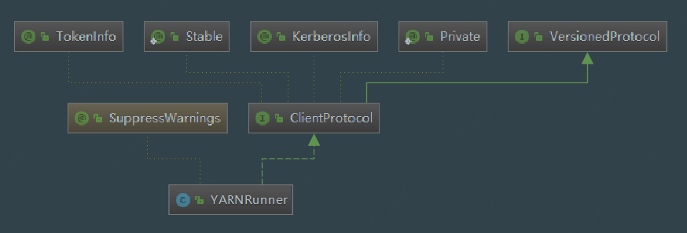

# MapReduce YARNRunner

## 1. YARNRunner类UML图



## 2. YARNRunner 源码分析

### 2.1 类成员变量

```java
  private static final Logger LOG = LoggerFactory.getLogger(YARNRunner.class);

  private static final String RACK_GROUP = "rack";
  private static final String NODE_IF_RACK_GROUP = "node1";
  private static final String NODE_IF_NO_RACK_GROUP = "node2";
```

### 2.2 submitJob方法(重点)

```java
public JobStatus submitJob(JobID jobId, String jobSubmitDir, Credentials ts)
  throws IOException, InterruptedException {
    
    addHistoryToken(ts);

    // Constructs all the necessary information to start the MR AM.
    // 构造所有必要的信息以启动MR Application Master,
    // 这个appContext很重要， 里面拼接了各种环境变量， 以及启动App Master的脚本  这个对象会一直贯穿于各个类之间， 直到AM启动
    ApplicationSubmissionContext appContext =
      createApplicationSubmissionContext(conf, jobSubmitDir, ts);

    // Submit to ResourceManager
    try {
      // 生成 applicationID
      ApplicationId applicationId =
              // 通过YarnClientImpl 提交作业， 到目前为止， 所有的内容都还是在提交Job的那台Client机器上， 还没有到ResourceManger那边。
          resMgrDelegate.submitApplication(appContext);

      // 通过ResourceMgrDelegate来sumbit这个appContext，
      // ResourceMgrDelegate类是用来和Resource Manager在通讯的
      ApplicationReport appMaster = resMgrDelegate
          .getApplicationReport(applicationId);
      String diagnostics =
          (appMaster == null ?
              "application report is null" : appMaster.getDiagnostics());
      if (appMaster == null
          || appMaster.getYarnApplicationState() == YarnApplicationState.FAILED
          || appMaster.getYarnApplicationState() == YarnApplicationState.KILLED) {
        throw new IOException("Failed to run job : " +
            diagnostics);
      }
      return clientCache.getClient(jobId).getJobStatus(jobId);
    } catch (YarnException e) {
      throw new IOException(e);
    }
  }
```

