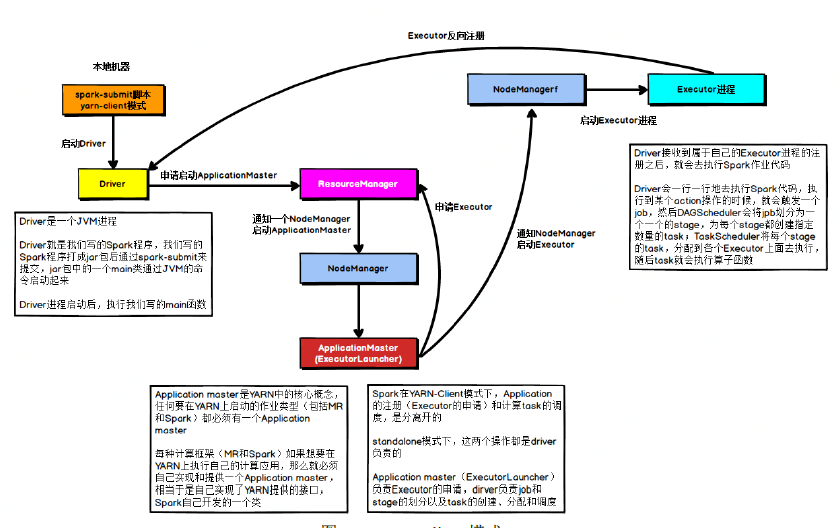
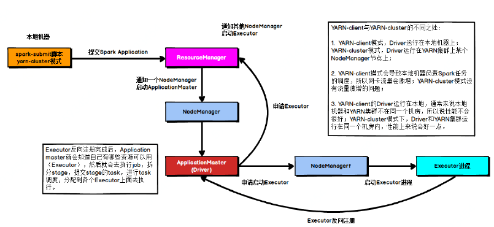
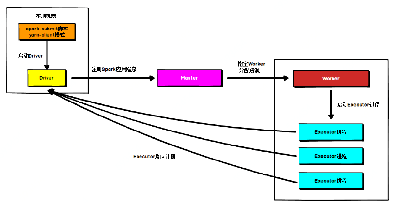
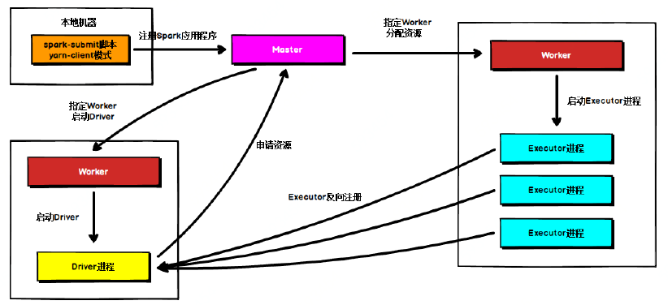

# Spark部署模式与区别

## 1. Spark on YARN Client

在YARN Client模式下，Driver在任务提交的本地机器上运行，Driver启动后会和ResourceManager通讯申请启动 ApplicationMaster，随后ResourceManager 分配container，在合适的NodeManager上启动ApplicationMaster，此时ApplicationMaster的功能相当于一个ExecutorLaucher，只负责向ResourceManager
申请Executor内存。

ResourceManager接到ApplicationMaster的资源申请后会分配container，然后ApplicationMaster 在资源分配指定的NodeManager上启动Executor进程，Executor进程启动后会向Driver反向注册，Executor全部注册完毕后Driver开始执行main函数，之后执行到Action算子时，触发一个job，并根据宽依赖开始划分Stage，每个Stage生成对应的taskSet，之后将task分发到各个Executor上执行。

## 2. Spark On YARN Cluster

在YARN Cluster模式下，任务提交后会和ResourceManger通讯申请启动ApplicationMaster，随后 ResourceManager分配container，在合适的 NodeManager上启动ApplicationMaster，此时的 ApplicationMaster就是Driver 。

Driver启动后向ResourceManger申请Executor内存，ResourceManager接到ApplicationMaster 的资源申请后会分配 container ，然后在合适的NodeManager上启动Executor进程，Executor进程启动后会向Driver反向注册，Executor全部注册完成后Driver开始执行main函数，之后执行到Action算子时，触发一个Job，并根据宽依赖开始划分Stage，每个 stage 生成对应 的 taskSet ，之后将 task 分发到各个Executor 上执行。

## 3. Standalone 模式运行机制

Standalone集群有四个重要组成部分，分别是：

- Driver：是一个进程，我们编写的Spark应用程序就运行在Driver上，由Driver进程执行；
- Executor：是一个进程 一个 Worker 上可以运行多个 Executor，Executor通过启动多个线程(task)来执行对 RDD 的 partition 进行并行计算，也就是执行我们对 RDD 定义的例如map 、flatMap 、reduce 等算子操作。
- Master：是一个进程，主要负责资源的调度和分配，并进行集群的监控等职责
- Worker：是一个进程，一个Worker运行在 集群中的一台 服务器上主要负责两个职责，一个是用自己的内存存储RDD的某些partition；另一个是启动其他进程和线程(Executor)，对RDD上的partition进行并行的处理和计算。

### 3.1 Standalone Client

在Standalone Cli ent 模式下， Driver在任务提交的本地机器上运行，Driver启动后向 Master注册应用程序， Master根据 submit 脚本的资源需求找到内部资源至少可以启动一个 Executor 的所有 Worker ，然后在这些 Worker 之间分配 Executor，Worker上的Executor启动后会向 Driver 反向注册，所有的Executor注册完成后， Driver开始执行main函数，之后执行到Action算子时 ，开始划分stage ，每个stage生成对应的taskSet，之后将 task分发到各个Executor上执行。

### 3.2 Standalone Cluster

在Standalone Cluster模式下，任务提交后，Master会找到一个Worker启动 Driver进程， Driver启动后向 Master注册应用程序，Master根据submit脚本的资源需求找到内部资源至少可以启动一个 Executor 的所有 Worker，然后在这些Worker之间分配 Executor Worker 上的 Executo r 启动后会向 Driver 反向注册，所有的 Executor注册完成后，Driver开始执行main函数，之后执行到Action算子时，开始划分stage，每个stage生成对应的taskSet，之后将task分发到各个Executor上执行。

注意：Standalone 的两种模式下(client /Cluster)，Master在接到Driver注册Spark应用程序的请求后，会获取其所管理的剩余资源能够启动一个Executor的所有 Worker，然后在这些Worker之间分发Executor，此时的分发只考虑Worker上的资源是否足够使用，直到当前应用程序所需的所有Executor都分配完毕，Executor反向注册完毕后，Driver开始执行main程序。