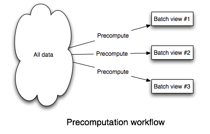
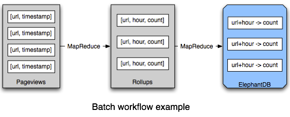
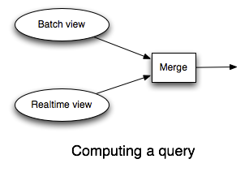
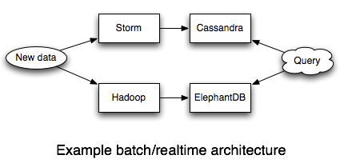

# How to beat the CAP theorem

作者：Nathan Marz

The CAP theorem states a database cannot guarantee consistency, availability, and partition-tolerance at the same time. But you can't sacrifice partition-tolerance (see [here](http://codahale.com/you-cant-sacrifice-partition-tolerance/) and [here](http://www.cloudera.com/blog/2010/04/cap-confusion-problems-with-partition-tolerance/)), so you must make a tradeoff between availability and consistency. Managing this tradeoff is a central focus of the NoSQL movement.

Consistency means that after you do a successful write, future reads will always take that write into account. Availability means that you can always read and write to the system. During a partition, you can only have one of these properties.

Systems that choose consistency over availability have to deal with some awkward issues. What do you do when the database isn't available? You can try buffering writes for later, but you risk losing those writes if you lose the machine with the buffer. Also, buffering writes can be a form of inconsistency because a client thinks a write has succeeded but the write isn't in the database yet. Alternatively, you can return errors back to the client when the database is unavailable. But if you've ever used a product that told you to "try again later", you know how aggravating this can be.

The other option is choosing availability over consistency. The best consistency guarantee these systems can provide is "eventual consistency". If you use an eventually consistent database, then sometimes you'll read a different result than you just wrote. Sometimes multiple readers reading the same key at the same time will get different results. Updates may not propagate to all replicas of a value, so you end up with some replicas getting some updates and other replicas getting different updates. It is up to you to repair the value once you detect that the values have diverged. This requires tracing back the history using vector clocks and merging the updates together (called "read repair").

I believe that maintaining eventual consistency in the application layer is too heavy of a burden for developers. Read-repair code is extremely susceptible to developer error; if and when you make a mistake, faulty read-repairs will introduce irreversible corruption into the database.

So sacrificing availability is problematic and eventual consistency is too complex to reasonably build applications. Yet these are the only two options, so it seems like I'm saying that you're damned if you do and damned if you don't. The CAP theorem is a fact of nature, so what alternative can there possibly be?

There is another way. You can't avoid the CAP theorem, but you can isolate its complexity and prevent it from sabotaging your ability to reason about your systems. The complexity caused by the CAP theorem is a symptom of fundamental problems in how we approach building data systems. Two problems stand out in particular: the use of mutable state in databases and the use of incremental algorithms to update that state. It is the interaction between these problems and the CAP theorem that causes complexity.

In this post I'll show the design of a system that beats the CAP theorem by preventing the complexity it normally causes. But I won't stop there. The CAP theorem is a result about the degree to which data systems can be fault-tolerant to machine failure. Yet there's a form of fault-tolerance that's much more important than machine fault-tolerance: human fault-tolerance. If there's any certainty in software development, it's that developers aren't perfect and bugs will inevitably reach production. Our data systems must be resilient to buggy programs that write bad data, and the system I'm going to show is as human fault-tolerant as you can get.

This post is going to challenge your basic assumptions on how data systems should be built. But by breaking down our current ways of thinking and re-imagining how data systems should be built, what emerges is an architecture more elegant, scalable, and robust than you ever thought possible.

## What is a data system?

Before we talk about system design, let's first define the problem we're trying to solve. What is the purpose of a data system? What is data? We can't even begin to approach the CAP theorem unless we can answer these questions with a definition that clearly encapsulates every data application.

Data applications range from storing and retrieving objects, joins, aggregations, stream processing, continuous computation, machine learning, and so on and so on. It's not clear that there is such a simple definition of data systems -- it seems that the range of things we do with data is too diverse to capture with a single definition.

However, there is such a simple definition. This is it:

```
Query = Function(All Data)
```

That's it. This equation summaries the entire field of databases and data systems. Everything in the field -- the past 50 years of RDBMS's, indexing, OLAP, OLTP, MapReduce, ETL, distributed filesystems, stream processors, NoSQL, etc. -- is summarized by that equation in one way or another.

A data system answers questions about a dataset. Those questions are called "queries". And this equation states that a query is just a function of all the data you have.

This equation may seem too general to be useful. It doesn't seem to capture any of the intricacies of data system design. But what matters is that every data system falls into that equation. The equation is a starting point from which we can explore data systems, and the equation will eventually lead to a method for beating the CAP theorem.

There are two concepts in this equation: "data" and "queries". These are distinct concepts that are often conflated in the database field, so let's be rigorous about what these concepts mean.

### Data

Let's start with "data". A piece of data is an indivisible unit that you hold to be true for no other reason than it exists. It is like an axiom in mathematics.

There are two crucial properties to note about data. First, data is inherently time based. A piece of data is a fact that you know to be true at some moment of time. For example, suppose Sally enters into her social network profile that she lives in Chicago. The data you take from that input is that she lived in Chicago as of the particular moment in time that she entered that information into her profile. Suppose that on a later date Sally updates her profile location to Atlanta. Then you know that she lived in Atlanta as of that particular time. The fact that she lives in Atlanta now doesn't change the fact that she used to live in Chicago. Both pieces of data are true.

The second property of data follows immediately from the first: data is inherently immutable. Because of its connection to a point in time, the truthfulness of a piece of data never changes. One cannot go back in time to change the truthfulness of a piece of data. This means that there are only two main operations you can do with data: read existing data and add more data. [CRUD](http://en.wikipedia.org/wiki/Create,_read,_update_and_delete) has become CR.

I've left out the "Update" operation. This is because updates don't make sense with immutable data. For example, "updating" Sally's location really means that you're adding a new piece of data saying she lives in a new location as of a more recent time.

I've also left out the "Delete" operation. Again, most cases of deletes are better represented as creating new data. For example, if Bob stops following Mary on Twitter, that doesn't change the fact that he used to follow her. So instead of deleting the data that says he follows her, you'd add a new data record that says he un-followed her at some moment in time.

There are a few cases where you do want to permanently delete data, such as regulations requiring you to purge data after a certain amount of time. These cases are easily supported by the data system design I'm going to show, so for the purposes of simplicity we can ignore these cases.

This definition of data is almost certainly different than what you're used to, especially if you come from the relational database world where updates are the norm. There are two reasons for this. First, this definition of data is extremely generic: it's hard to think of a kind of data that doesn't fit under this definition. Second, the immutability of data is the key property we're going to exploit in designing a human fault-tolerant data system that beats the CAP theorem.

### Query

The second concept in the equation is the "query". A query is a derivation from a set of data. In this sense, a query is like a theorem in mathematics. For example, "What is Sally's current location?" is a query. You would compute this query by returning the most recent data record about Sally's location. Queries are functions of the complete dataset, so they can do anything: aggregations, join together different types of data, and so on. So you might query for the number of female users of your service, or you might query a dataset of tweets for what topics have been trending in the past few hours.

I've defined a query as a function on the complete dataset. Of course, many queries don't need the complete dataset to run -- they only need a subset of the dataset. But what matters is that my definition encapsulates all possible queries, and if we're going to beat the CAP theorem, we must be able to do so for any query.

### Beating the CAP theorem

The simplest way to compute a query is to literally run a function on the complete dataset. If you could do this within your latency constraints, then you'd be done. There would be nothing else to build.

Of course, it's infeasible to expect a function on a complete dataset to finish quickly. Many queries, such as those that serve a website, require millisecond response times. However, let's pretend for a moment that you can compute these functions quickly, and let's see how a system like this interacts with the CAP theorem. As you are about to see, a system like this not only beats the CAP theorem, but annihilates it.

The CAP theorem still applies, so you need to make a choice between consistency and availability. The beauty is that once you decide on the tradeoff you want to make, you're done. The complexity the CAP theorem normally causes is avoided by using immutable data and computing queries from scratch.

If you choose consistency over availability, then not much changes from before. Sometimes you won't be able to read or write data because you traded off availability. But for the cases where rigid consistency is a necessity, it's an option.

Things get much more interesting when you choose availability over consistency. In this case, the system is eventually consistent without any of the complexities of eventual consistency. Since the system is highly available, you can always write new data and compute queries. In failure scenarios, queries will return results that don't incorporate previously written data. Eventually that data will be consistent and queries will incorporate that data into their computations.

The key is that data is immutable. Immutable data means there's no such thing as an update, so it's impossible for different replicas of a piece of data to become inconsistent. This means there are no divergent values, vector clocks, or read-repair. From the perspective of queries, a piece of data either exists or doesn't exist. There is just data and functions on that data. There's nothing you need to do to enforce eventual consistency, and eventual consistency does not get in the way of reasoning about the system.

What caused complexity before was the interaction between incremental updates and the CAP theorem. Incremental updates and the CAP theorem really don't play well together; mutable values require read-repair in an eventually consistent system. By rejecting incremental updates, embracing immutable data, and computing queries from scratch each time, you avoid that complexity. The CAP theorem has been beaten.

Of course, what we just went through was a thought experiment. Although we'd like to be able to compute queries from scratch each time, it's infeasible. However, we have learned some key properties of what a real solution will look like:

1. The system makes it easy to store and scale an immutable, constantly-growing dataset
2. The primary write operation is adding new immutable facts of data
3. The system avoids the complexity of the CAP theorem by recomputing queries from raw data
4. The system uses incremental algorithms to lower the latency of queries to an acceptable level

Let's begin our exploration of what such a system looks like. Note that everything from here on out is optimization. Databases, indexing, ETL, batch computation, stream processing -- these are all techniques for optimizing query functions and bringing the latency down to an acceptable level. This is a simple but profound realization. Databases are usually made out to be the centerpiece of data management, but really they're one part of a bigger picture.

### Batch computation

Figuring out how to make an arbitrary function on an arbitrary dataset run quickly is a daunting problem. So let's relax the problem a little bit. Let's pretend that it's okay for queries to be out of date by a few hours. Relaxing the problem this way leads to a simple, elegant, and general-purpose solution for building data systems. Afterwards, we'll extend the solution so that the problem is no longer relaxed.

Since a query is a function of all the data, the easiest way to make queries run fast is to precompute them. Whenever there's new data, you just recompute everything. This is feasible because we relaxed the problem to allow queries to be out of date by a few hours. Here's an illustration of this workflow:



To build this, you need a system that:

1. Can easily store a large and constantly growing dataset
2. Can compute functions on that dataset in a scalable way

Such a system exists. It's mature, battle-tested across hundreds of organizations, and has a large ecosystem of tools. It's called [Hadoop](http://hadoop.apache.org/). Hadoop [isn't perfect](http://tech.backtype.com/the-dark-side-of-hadoop), but it's the best tool out there for doing batch processing.

A lot of people will tell you that Hadoop is only good for "unstructured" data. This is completely false. Hadoop is fantastic for structured data. Using tools like [Thrift](http://thrift.apache.org/) or [Protocol Buffers](http://code.google.com/p/protobuf/), you can store your data using rich, evolvable schemas.

Hadoop is comprised of two pieces: a distributed filesystem (HDFS), and a batch processing framework (MapReduce). HDFS is good at storing a large amount of data across files in a scalable way. MapReduce is good at running computations on that data in a scalable way. These systems match our needs perfectly.

We'll store data in flat files on HDFS. A file will contain a sequence of data records. To add new data, you simply append a new file containing new data records to the folder that contains all the data. Storing data like this on HDFS solves the "Store a large and constantly growing dataset" requirement.

Precomputing queries off of that data is similarly straightforward. MapReduce is an expressive enough paradigm such that nearly any function can be implemented as a series of MapReduce jobs. Tools like [Cascalog](https://github.com/nathanmarz/cascalog), [Cascading](http://cascading.org/), and [Pig](http://pig.apache.org/) make implementing these functions much easier.

Finally, you need to index the results of the precomputation so that the results can be quickly accessed by an application. There's a class of databases that are extremely good at this. [ElephantDB](https://github.com/nathanmarz/elephantdb) and [Voldemort read-only](http://sna-projects.com/blog/2009/06/voldemort-and-hadoop/) specialize in exporting key/value data from Hadoop for fast querying. These databases support batch writes and random reads, and they *do not* support random writes. Random writes cause most of the complexity in databases, so by not supporting random writes these databases are extraordinarily simple. ElephantDB, for example, is only a few thousand lines of code. That simplicity leads to these databases being extremely robust.

Let's look at an example of how the batch system fits together. Suppose you're building a web analytics application that tracks page views, and you want to be able to query the number of page views over any period of time, to a granularity of one hour.



Implementing this is easy. Each data record contains a single page view. Those data records are stored in files on HDFS. A function that rolls up page views per URL by hour is implemented as a series of MapReduce jobs. The function emits key/value pairs, where each key is a `[URL, hour]` pair and each value is a count of the number of page views. Those key/value pairs are exported into an ElephantDB database so that an application can quickly get the value for any `[URL, hour]` pair. When an application wants to know the number of page views for a time range, it queries ElephantDB for the number of page views for each hour in that time range and adds them up to get the final result.

Batch processing can compute arbitrary functions on arbitrary data with the drawback that queries are out of date by a few hours. The "arbitrariness" of such a system means it can be applied to any problem. More importantly, it's simple, easy to understand, and completely scalable. You just have to think in terms of data and functions, and Hadoop takes care of the parallelization.

### The batch system, CAP, and human fault-tolerance

So far so good. So how does the batch system I've described line up with CAP, and does it meet our goal of being human fault-tolerant?

Let's start with CAP. The batch system is eventually consistent in the most extreme way possible: writes always take a few hours to be incorporated into queries. But it's a form of eventual consistency that's easy to reason about because you only have to think about data and functions on that data. There's no read-repair, concurrency, or other complex issues to consider.

Next, let's take a look at the batch system's human fault-tolerance. The human fault-tolerance of the batch system is as good as you can get. There are only two mistakes a human can make in a system like this: deploy a buggy implementation of a query or write bad data.

If you deploy a buggy implementation of a query, all you have to do to fix things is fix the bug, deploy the fixed version, and recompute everything from the master dataset. This works because queries are pure functions.

Likewise, writing bad data has a clear path to recovery: delete the bad data and precompute the queries again. Since data is immutable and the master dataset is append-only, writing bad data does not override or otherwise destroy good data. This is in stark contrast to almost all traditional databases where if you update a key you lose the old value.

Note that [MVCC](http://en.wikipedia.org/wiki/Multiversion_concurrency_control) and HBase-like row versioning do not come close to this level of human fault-tolerance. MVCC and HBase row versioning don't keep data around forever: once the database compacts the row, the old value is gone. Only an immutable dataset guarantees that you have a path to recovery when bad data is written.

### Realtime layer

Believe it or not, the batch solution almost solves the complete problem of computing arbitrary functions on arbitrary data in realtime. Any data older than a few hours has already been incorporated into the batch views, so all that's left to do is compensate for the last few hours of data. Figuring out how to make queries realtime against a few hours of data is much easier than doing so against the complete dataset. This is a critical insight.

To compensate for those few hours of data, you need a realtime system that runs in parallel with the batch system. The realtime system precomputes each query function for the last few hours of data. To resolve a query function, you query the batch view and the realtime view and merge the results together to get the final answer.



The realtime layer is where you use read/write databases like Riak or Cassandra, and the realtime layer relies on incremental algorithms to update the state in those databases.

The analog to Hadoop for realtime computation is [Storm](https://github.com/nathanmarz/storm/wiki). I wrote Storm to make it easy to do large amounts of realtime data processing in a way that's scalable and robust. Storm runs infinite computations over streams of data and gives strong guarantees on the processing of the data.

Let's see an example of the realtime layer by going back to the running example of querying the number of page views for a URL over a time range.



The batch system is the same as before: a batch workflow based on Hadoop and ElephantDB precomputes the query for everything but the last few hours of data. All that's left is to build the realtime system that compensates for those last few hours of data.

We'll roll up the stats for the last few hours into Cassandra, and we'll use Storm to process the stream of pageviews and parallelize the updates into the database. Each pageview leads to a counter for a `[URL, hour]` key to be incremented in Cassandra. That's all there is to it -- Storm makes these kinds of things very simple.

### Batch layer + realtime layer, the CAP theorem, and human fault-tolerance

In some ways it seems like we're back to where we started. Achieving realtime queries required us to use NoSQL databases and incremental algorithms. This means we're back in the complex world of divergent values, vector clocks, and read-repair.

There's a key difference though. Since the realtime layer only compensates for the last few hours of data, everything the realtime layer computes is eventually overridden by the batch layer. So if you make a mistake or something goes wrong in the realtime layer, the batch layer will correct it. All that complexity is transient.

This doesn't mean you shouldn't care about read-repair or eventual consistency in the realtime layer. You still want the realtime layer to be as consistent as possible. But when you make a mistake you don't permanently corrupt your data. This removes a huge complexity burden from your shoulders.

In the batch layer, you only have to think about data and functions on that data. The batch layer is really simple to reason about. In the realtime layer, on the other hand, you have to use incremental algorithms and extremely complex NoSQL databases. Isolating all that complexity into the realtime layer makes a huge difference in making robust, reliable systems.

Additionally, the realtime layer doesn't affect the human fault-tolerance of the system. The append-only immutable dataset in the batch layer is still the core of the system, so any mistake can be recovered from just like before.

Let me share a personal story about the great benefits of isolating complexity in the realtime layer. I had a system very much like the one I described here: Hadoop and ElephantDB for the batch layer, and Storm and Cassandra for the realtime layer. Due to poor monitoring on my part, I woke up one day to discover that Cassandra had run out of space and was timing out on every request. This caused my Storm topology to fail and the stream of data to back up on the queues. The same messages kept getting replayed (and kept failing) over and over.

If I didn't have a batch layer, I would have been forced to scale and recover Cassandra. This is non-trivial. Even worse, much of the database was likely inaccurate due to the same messages being replayed many times.

Fortunately, all this complexity was isolated in my realtime layer. I flushed the backed up queues into the batch layer and made a fresh Cassandra cluster. The batch layer ran like clockwork and within a few hours everything was back to normal. No data was lost and there was no inaccuracy in our queries.

### Garbage collection

Everything I've described in this post is built upon the foundation of an immutable, constantly growing dataset. So what do you do if your dataset is so large that it's impractical to store all data for all time, even with horizontally scalable storage? Does this use case break everything I've described? Should you go back to using mutable databases?

No. It's easy to extend the basic model with "garbage collection" to handle this use case. Garbage collection is simply a function that takes in the master dataset and returns a filtered version of the master dataset. Garbage collection gets rid of data that is of low value. You can use any strategy you want for garbage collection. You can simulate mutability by only keeping the last value for an entity, or you can keep a history for each entity. For example, if you're dealing with location data, you may want to keep one location per person per year along with the current location. Mutability is really just an inflexible form of garbage collection (that also interacts poorly with the CAP theorem).

Garbage collection is implemented as a batch processing task. It's something you run occasionally, perhaps once per month. Since garbage collection is run as an offline batch processing task, it doesn't affect how the system interacts with the CAP theorem.

### Conclusion

What makes scalable data systems difficult isn't the CAP theorem. It's a reliance on incremental algorithms and mutable state that leads to complexity in our systems. It's only recently with the rise of distributed databases that this complexity has gotten out of control. But that complexity has always been there.

I said in the beginning of this post that I would challenge your basic assumptions of how data systems should be built. I turned CRUD into CR, split persistence into separate batch and realtime systems, and obsessed over the importance of human fault-tolerance. It took a lot of hard-earned experience over the years to break my old assumptions and arrive at these conclusions.

The batch/realtime architecture has a lot of interesting capabilities that I didn't cover yet. It's worth summarizing some of these now:

1. **Algorithmic flexibility:** Some algorithms are difficult to compute incrementally. Computing unique counts, for example, can be challenging if the sets of uniques get large. The batch/realtime split gives you the flexibility to use the exact algorithm on the batch layer and an approximate algorithm on the realtime layer. The batch layer constantly overrides the realtime layer, so the approximation gets corrected and your system exhibits the property of "eventual accuracy".
2. **Schema migrations are easy:** Gone are the days of difficult schema migrations. Since batch computation is at the core of the system, it's easy to run functions on the complete dataset. This makes it easy to change the schema of your data or views.
3. **Easy ad-hoc analysis:** The arbitrariness of the batch layer means you can run any query you like on your data. Since all data is accessible in one location, this is easy and convenient.
4. **Self-auditing:** By treating data as immutable, you get a self-auditing dataset. The dataset records its own history. I've discussed how important this is for human fault-tolerance, but it's also super useful for doing analytics.

I don't claim to have "solved" the Big Data space, but I've laid down the framework for thinking about Big Data. The batch/realtime architecture is highly general and can be applied to any data system. Rather than give you a fish or a fishing rod, I've shown you how to make a fishing rod for any kind of fish and any kind of water.

There's lots more work to do to improve our collective ability to attack Big Data problems. Here are some key areas of improvement:

1. **Expanded data models for batch-writable, random-read databases:** Not every application is supported by a key/value data model. This is why my team is investing in expanding ElephantDB to support search, document databases, range queries, and more.
2. **Better batch processing primitives**: Hadoop is not the end-all-be-all of batch computation. It can be inefficient for certain kinds of computations. [Spark](https://github.com/mesos/spark) is an important project doing interesting work in expanding the MapReduce paradigm.
3. **Improved read/write NoSQL databases**: There's room for more databases with different data models, and these projects in general will benefit from more maturation.
4. **High level abstractions:** One of the most interesting areas of future work is high level abstractions that map to a batch processing component and a realtime processing component. There's no reason why you shouldn't have the conciseness of a declarative language with the robustness of the batch/realtime architecture.

A lot of people want a scalable relational database. What I hope you've realized in this post is that you don't want that at all! Big data and the NoSQL movement seemed to make data management more complex than it was with the RDBMS, but that's only because we were trying to treat "Big Data" the same way we treated data with an RDBMS: by conflating data and views and relying on incremental algorithms. The scale of big data lets you build systems in a completely different way. By storing data as a constantly expanding set of immutable facts and building recomputation into the core, a Big Data system is actually easier to reason about than a relational system. And it scales.