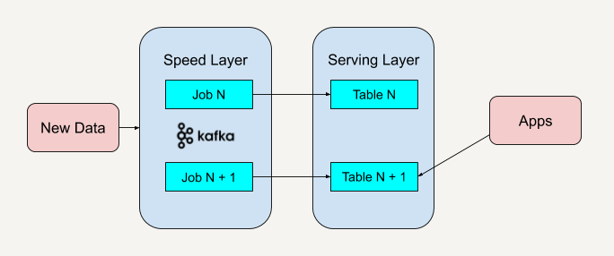

# Kappa Architecture VS Lambda Archtecture

## 1. Lambda架构

- Lambda架构结合了**批处理**和**流处理**的架构思想：将进入系统的大规模数据同时送入两套架构中，分别是**批处理层**和**速度层**，同时产生**两套数据结果**并存入**服务层**
- 批处理层有很好的**容错性**，同时因为保存着所有的历史记录，使得产生的数据具有很好的**准确性**和容错性
- 速度层可以**及时**地处理流入的数据，因此具有**低延迟性**
- 最终服务层将这两套数据结合，并生成一个**完整**的数据视图
- Lambda架构具有很好的**灵活性**，但**维护很复杂**：
		- 因为需要维护两个复杂的分布式系统，并且保证它们在**逻辑**上产生相同的结果输出到服务层中，可以部署Apache Hadoop到批处理层，同时部署Apache Flink到速度层上
		- 在分布式框架中进行编程是十分复杂的，尤其还会针对不同的框架进行专门的优化
- 改进方向：
		- 改进批处理层的系统，让它具有更低的延时性
		- 改进速度层的系统，让它产生的数据视图更具准确性和更接近历史数据

## 2. Kappa架构

Kappa架构提出了一个改进Lambda架构的观点：

- 改进速度层的系统性能，使得它可以处理好数据的**完整性**和**准确性**问题
- 改进速度层，使它既能进行**实时数据处理**，也能在业务逻辑更新的情况下**重新处理以前处理过的历史数据**

1. 部署Apache Kafka，并设置

	数据日志的保留期

	- 保留期：你希望能够**重新处理**的历史数据的时间区间

2. 如果需要改进现有的逻辑算法，那就表示需要对历史数据进行重新处理，处理措施如下

	- 重新启动一个Kafka作业实例，该实例将**重头开始，重新计算**保留好的历史数据，并将结果输出到一个新的数据视图中

	- Apache Kafka的底层是使用

		Log Offset

		来判断现在已经处理到了哪个数据块

		- 因此只需要将Log Offset**置为0**，新的作业实例就会重头开始处理历史数据

3. 当新的数据视图处理过的数据进度**赶上**旧的数据视图时，应用可以切换到从新的数据视图中读取数据

4. 停止旧版本的作业实例，并删除旧的数据视图

	- 也可以不删除旧的数据视图，出错时可以回滚或者做AB测试

Kappa架构思想与Kafka有很多共同之处。

## 3. 优缺点

1. **Kappa架构只保留了速度层**，只需在业务逻辑变更或者代码更改时进行数据的重新处理
2. Kappa架构缺少了批处理层，在速度层上处理大规模数据可能会有数据更新出错的情况，需要花费更多的时间在**异常处理**上
3. Kappa架构的批处理和流处理都放在了速度层，因此**不适用于批处理和流处理代码逻辑不一致的场景**

## 4. 应用场景

1. Lambda架构
		- 设计一种稳健的机器学习模型来预测即将发生的事情，应该优先考虑使用Lambda架构
		- 因为Lambda架构拥有批处理层和速度层来确保更少的错误

2. Kappa架构

	 -  客户端需要根据运行时发生的实时事件来做出响应，应该优先考虑Kappa架构

		

