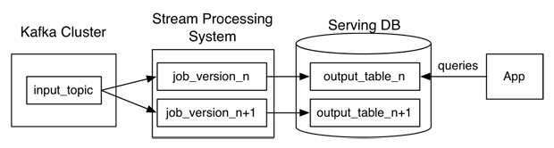
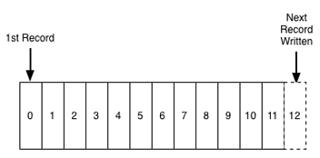
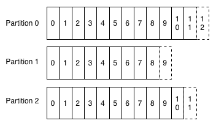

# Questioning the Lambda Architecture

The Lambda Architecture has its merits, but alternatives are worth exploring.

Nathan Marz wrote a popular blog post describing an idea he called the Lambda Architecture (“[How to beat the CAP theorem](http://nathanmarz.com/blog/how-to-beat-the-cap-theorem.html)“). The Lambda Architecture is an approach to building stream processing applications on top of MapReduce and [Storm](http://storm.incubator.apache.org/) or similar systems. This has proven to be a surprisingly popular idea, with a dedicated [website](http://lambda-architecture.net/) and an [upcoming book](http://www.manning.com/marz/). Since I’ve been involved in building out the real-time data processing infrastructure at LinkedIn using [Kafka](http://kafka.apache.org/) and [Samza](http://samza.incubator.apache.org/), I often get asked about the Lambda Architecture. I thought I would describe my thoughts and experiences.

## What is a Lambda Architecture and how do I become one?

The Lambda Architecture looks something like this:

The way this works is that an immutable sequence of records is captured and fed into a batch system and a stream processing system in parallel. You implement your transformation logic twice, once in the batch system and once in the stream processing system. You stitch together the results from both systems at query time to produce a complete answer.

There are a lot of variations on this, and I’m intentionally simplifying a bit. For example, you can swap in various similar systems for Kafka, Storm, and Hadoop, and people often use two different databases to store the output tables, one optimized for real time and the other optimized for batch updates.

The Lambda Architecture is aimed at applications built around complex asynchronous transformations that need to run with low latency (say, a few seconds to a few hours). A good example would be a news recommendation system that needs to crawl various news sources, process and normalize all the input, and then index, rank, and store it for serving.

I have been involved in building a number of real-time data systems and pipelines at LinkedIn. Some of these worked in this style, and upon reflection, it is not my favorite approach. I thought it would be worthwhile to describe what I see as the pros and cons of this architecture, and also give an alternative I prefer.

## What’s good about this?

I like that the Lambda Architecture emphasizes retaining the input data unchanged. I think the discipline of modeling data transformation as a series of materialized stages from an original input has a lot of merit. This is one of the things that makes large MapReduce workflows tractable, as it enables you to debug each stage independently. I think this lesson translates well to the stream processing domain. I’ve written some of my thoughts about capturing and transforming immutable data streams [here](http://engineering.linkedin.com/distributed-systems/log-what-every-software-engineer-should-know-about-real-time-datas-unifying).

I also like that this architecture highlights the problem of reprocessing data. Reprocessing is one of the key challenges of stream processing but is very often ignored. By “reprocessing,” I mean processing input data over again to re-derive output. This is a completely obvious but often ignored requirement. Code will always change. So, if you have code that derives output data from an input stream, whenever the code changes, you will need to recompute your output to see the effect of the change.

Why does code change? It might change because your application evolves and you want to compute new output fields that you didn’t previously need. Or it might change because you found a bug and need to fix it. Regardless, when it does, you need to regenerate your output. I have found that many people who attempt to build real-time data processing systems don’t put much thought into this problem and end-up with a system that simply cannot evolve quickly because it has no convenient way to handle reprocessing. The Lambda Architecture deserves a lot of credit for highlighting this problem.

There are a number of other motivations proposed for the Lambda Architecture, but I don’t think they make much sense. One is that real-time processing is inherently approximate, less powerful, and more lossy than batch processing. I actually do not think this is true. It is true that the existing set of stream processing frameworks are less mature than MapReduce, but there is no reason that a stream processing system can’t give as strong a semantic guarantee as a batch system.

Another explanation I have heard is that the Lambda Architecture somehow “beats the CAP theorem” by allowing a mixture of different data systems with different trade-offs. Long story short, although there are definitely latency/availability trade-offs in stream processing, this is an architecture for asynchronous processing, so the results being computed are not kept immediately consistent with the incoming data. The CAP theorem, sadly, [remains intact](http://ferd.ca/beating-the-cap-theorem-checklist.html).

## And the bad…

The problem with the Lambda Architecture is that maintaining code that needs to produce the same result in two complex distributed systems is exactly as painful as it seems like it would be. I don’t think this problem is fixable.

Programming in distributed frameworks like Storm and Hadoop is complex. Inevitably, code ends up being specifically engineered toward the framework it runs on. The resulting operational complexity of systems implementing the Lambda Architecture is the one thing that seems to be universally agreed on by everyone doing it.

Why can’t the stream processing system be improved to handle the full problem set in its target domain?One proposed approach to fixing this is to have a language or framework that abstracts over both the real-time and batch framework. You write your code using this higher level framework and then it “compiles down” to stream processing or MapReduce under the covers. [Summingbird](http://github.com/twitter/summingbird) is a framework that does this. This definitely makes things a little better, but I don’t think it solves the problem.

Ultimately, even if you can avoid coding your application twice, the operational burden of running and debugging two systems is going to be very high. And any new abstraction can only provide the features supported by the intersection of the two systems. Worse, committing to this new uber-framework walls off the rich ecosystem of tools and languages that makes Hadoop so powerful (Hive, Pig, Crunch, Cascading, Oozie, etc).

By way of analogy, consider the notorious difficulties in making cross-database ORM really transparent. And consider that this is just a matter of abstracting over very similar systems providing virtually identical capabilities with a (nearly) standardized interface language. The problem of abstracting over totally divergent programming paradigms built on top of barely stable distributed systems is much harder.

## We have done this experiment

We have actually been through a number of rounds of this at LinkedIn. We have built various hybrid-Hadoop architectures and even a domain-specific API that would allow code to be “transparently” run either in real time or in Hadoop. These approaches worked, but none were very pleasant or productive. Keeping code written in two different systems perfectly in sync was really, really hard. The API meant to hide the underlying frameworks proved to be the leakiest of abstractions. It ended up requiring deep Hadoop knowledge as well as deep knowledge of the real-time layer — and adding the new requirement that you understand enough about how the API would translate to these underlying systems whenever you were debugging problems or trying to reason about performance.

These days, my advice is to use a batch processing framework like MapReduce if you aren’t latency sensitive, and use a stream processing framework if you are, but not to try to do both at the same time unless you absolutely must.

So, why the excitement about the Lambda Architecture? I think the reason is because people increasingly need to build complex, low-latency processing systems. What they have at their disposal are two things that don’t quite solve their problem: a scalable high-latency batch system that can process historical data and a low-latency stream processing system that can’t reprocess results. By duct taping these two things together, they can actually build a working solution.

In this sense, even though it can be painful, I think the Lambda Architecture solves an important problem that was otherwise generally ignored. But I don’t think this is a new paradigm or the future of big data. It is just a temporary state driven by the current limitation of off-the-shelf tools. I also think there are better alternatives.

## An alternative

As someone who designs infrastructure, I think the glaring question is this: why can’t the stream processing system just be improved to handle the full problem set in its target domain? Why do you need to glue on another system? Why can’t you do both real-time processing and also handle the reprocessing when code changes? Stream processing systems already have a notion of parallelism; why not just handle reprocessing by increasing the parallelism and replaying history very, very fast? The answer is that you can do this, and I think this it is actually a reasonable alternative architecture if you are building this type of system today.

When I’ve discussed this with people, they sometimes tell me that stream processing feels inappropriate for high-throughput processing of historical data. But I think this is an intuition based mostly on the limitations of systems they have used, which either scale poorly or can’t save historical data. This leaves them with a sense that a stream processing system is inherently something that computes results off some ephemeral streams and then throws all the underlying data away. But there is no reason this should be true. The fundamental abstraction in stream processing is data flow DAGs, which are exactly the same underlying abstraction in a traditional data warehouse (*a la* [Volcano](http://paperhub.s3.amazonaws.com/dace52a42c07f7f8348b08dc2b186061.pdf)) as well as being the fundamental abstraction in the MapReduce successor [Tez](http://hortonworks.com/hadoop/tez/). Stream processing is just a generalization of this data-flow model that exposes checkpointing of intermediate results and continual output to the end user.

So, how can we do the reprocessing directly from our stream processing job? My preferred approach is actually stupidly simple:

1. Use Kafka or some other system that will let you retain the full log of the data you want to be able to reprocess and that allows for multiple subscribers. For example, if you want to reprocess up to 30 days of data, set your retention in Kafka to 30 days.
2. When you want to do the reprocessing, start a second instance of your stream processing job that starts processing from the beginning of the retained data, but direct this output data to a new output table.
3. When the second job has caught up, switch the application to read from the new table.
4. Stop the old version of the job, and delete the old output table.

This architecture looks something like this:

Unlike the Lambda Architecture, in this approach you only do reprocessing when your processing code changes, and you actually need to recompute your results. And, of course, the job doing the re-computation is just an improved version of the same code, running on the same framework, taking the same input data. Naturally, you will want to bump up the parallelism on your reprocessing job so it completes very quickly.

Maybe we could call this the Kappa Architecture, though it may be too simple of an idea to merit a Greek letter.

Of course, you can optimize this further. In many cases, you could combine the two output tables. However, I think there are some benefits to having both for a short period of time. This allows you to revert back instantaneously to the old logic by just having a button that redirects the application to the old table. And in cases that are particularly important (your ad targeting criteria, say), you can control the cut-over with an automatic A/B test or [bandit algorithm](http://shop.oreilly.com/product/0636920027393.do) to ensure whatever bug fix or code improvement you are rolling out hasn’t accidentally degraded things in comparison to the prior version.

Note that this this doesn’t mean your data can’t go to HDFS; it just means that you don’t run your reprocessing there. Kafka has good integration with Hadoop, so mirroring any Kafka topic into HDFS is easy. It is often useful for the output or even intermediate streams from a stream processing job to be available in Hadoop for analysis in tools like Hive or for use as input for other, offline data processing flows.

We have [documented](http://samza.incubator.apache.org/learn/documentation/0.7.0/jobs/reprocessing.html) implementing this approach as well as other variations on reprocessing architectures using Samza.

## Some background

For those less familiar with Kafka, what I just described may not make sense. A quick refresher will hopefully straighten things out. Kafka maintains ordered logs like this:

A Kafka “topic” is a collection of these logs:

A stream processor consuming this data just maintains an “offset,” which is the log entry number for the last record it has processed on each of these partitions. So, changing the consumer’s position to go back and reprocess data is as simple as restarting the job with a different offset. Adding a second consumer for the same data is just another reader pointing to a different position in the log.

Kafka supports replication and fault-tolerance, runs on cheap, commodity hardware, and is glad to store many TBs of data per machine. So, retaining large amounts of data is a perfectly natural and economical thing to do and won’t hurt performance. LinkedIn keeps more than a petabyte of Kafka storage online, and a number of applications make good use of this long retention pattern for exactly this purpose.

Cheap consumers and the ability to retain large amounts of data make adding the second “reprocessing” job just a matter of firing up a second instance of your code but starting from a different position in the log.

This design is not an accident. We built Kafka with the intent of using it as a substrate for stream processing, and we had in mind exactly this model for handling reprocessing data. For the curious, you can find more information on Kafka [here](https://kafka.apache.org/documentation.html#introduction).

Fundamentally, though, there is nothing that ties this idea to Kafka. You could substitute any system that supports long retention of ordered data (for example HDFS, or some kind of database). Indeed, a lot of people are familiar with similar patterns that go by the name [Event Sourcing](http://martinfowler.com/eaaDev/EventSourcing.html) or [CQRS](http://martinfowler.com/bliki/CQRS.html). And, of course, the distributed database people will tell you this is just a slight rebranding of materialized view maintenance, which, as they will gladly remind you, they figured out *a long long time ago, sonny*.

## Comparison

I know this approach works well using Samza as the stream processing system because we do it at LinkedIn. But I am not aware of any reason it shouldn’t work equally well in Storm or other stream processing systems. I’m not familiar enough with Storm to work through the practicalities, so I’d be glad to hear if others are doing this already. In any case, I think the general ideas are fairly system independent.

The efficiency and resource trade-offs between the two approaches are somewhat of a wash. The Lambda Architecture requires running both reprocessing and live processing all the time, whereas what I have proposed only requires running the second copy of the job when you need reprocessing. However, my proposal requires temporarily having 2x the storage space in the output database and requires a database that supports high-volume writes for the re-load. In both cases, the extra load of the reprocessing would likely average out. If you had many such jobs, they wouldn’t all reprocess at once, so on a shared cluster with several dozen such jobs you might budget an extra few percent of capacity for the few jobs that would be actively reprocessing at any given time.

The real advantage isn’t about efficiency at all, but rather about allowing people to develop, test, debug, and operate their systems on top of a single processing framework. So, in cases where simplicity is important, consider this approach as an alternative to the Lambda Architecture.